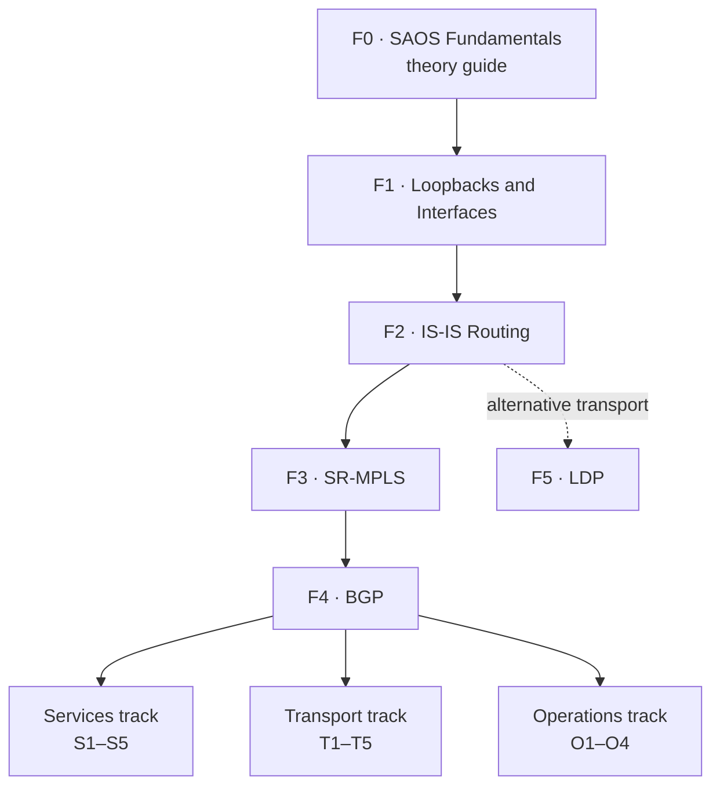

# SAOS 10x Lab Program

Hands-on containerlab labs for Ciena SAOS 10 SE enablement. 4 tracks, 19
planned hands-on labs, one introductory theory guide, and a primary SR-MPLS
progression with an alternative LDP branch.

All labs are built and validated against SAOS release 10.12.00.0228
(container image `vrnetlab/ciena_saos:10-12-00-0228`). The SAOS container image
is a licensed Ciena artifact you supply yourself (built from a Ciena SAOS
VM/qcow); activate the built-in trial license after deployment.

## Curriculum



All SEs start with the F0 guide and complete the recommended F1-F4 path.
F5 is an alternative LDP branch from F2 and is not a prerequisite for the
downstream tracks.

## Getting Started

Set your repo coordinates and target lab, then use either retrieval path below.

```bash
GITHUB_OWNER=<your-github-owner>
GITHUB_REPO=<your-repo-name>
REPO_URL="https://github.com/${GITHUB_OWNER}/${GITHUB_REPO}"
LAB=F1-Loopbacks-and-Interfaces   # replace with your target lab
```

### Option A — Shallow git clone (sparse checkout)

Clones only the history needed and limits the working tree to a single lab
directory plus top-level files:

```bash
git clone --filter=blob:none --no-checkout "${REPO_URL}.git"
cd "${GITHUB_REPO}"
git sparse-checkout init --cone
git sparse-checkout set "labs/${LAB}"
git checkout
containerlab deploy -t "labs/${LAB}/topo.clab.yml"
```

### Option B — Download archive (no git)

Downloads and unpacks only the lab directory you need:

```bash
wget -qO- "${REPO_URL}/archive/refs/heads/main.tar.gz" \
  | tar -xz --strip-components=2 "${GITHUB_REPO}-main/labs/${LAB}"
cd "${LAB}"
containerlab deploy -t topo.clab.yml
```

> **Tip:** Prefer Option A if you plan to iterate on configs or pull future
> updates. Use Option B for a one-shot deployment on a host without git.

## Labs

### Foundation Track

F0 introduces the SAOS model and CLI. The hands-on labs are cumulative and build on the previous lab.

| ID | Lab | Topic | Status |
|----|-----|-------|--------|
| F0 | [F0-SAOS-Fundamentals](labs/F0-SAOS-Fundamentals/README.md) | CLI contexts, hierarchy, classifiers, FPs, and FDs | Theory guide |
| F1 | [F1-Loopbacks-and-Interfaces](labs/F1-Loopbacks-and-Interfaces/README.md) | Classifiers, FDs, FPs, IPv4/IPv6, loopbacks | Done |
| F2 | [F2-IS-IS-Routing](labs/F2-IS-IS-Routing/README.md) | IS-IS, NET/NSAP, MD5, IPv6 AF | Done |
| F3 | [F3-SR-MPLS](labs/F3-SR-MPLS/README.md) | SR prefix-SID, SRGB, IS-IS MPLS-TE/SR, CSPF | Done |
| F4 | [F4-BGP](labs/F4-BGP/README.md) | iBGP, MP-BGP, routing policy over SR-MPLS | Done |
| F5 | [F5-LDP](labs/F5-LDP/README.md) | Alternative LDP/MPLS transport from F2 | Done |

### Services Track

Prerequisites: F1, F2, F3, F4

| ID | Lab | Topic | Status |
|----|-----|-------|--------|
| S1 | [S1-L3VPN](labs/S1-L3VPN/README.md) | VRF, RD, RT, VPNv4, route leaking | Done |
| S2 | [S2-EVPN-VPWS](labs/S2-EVPN-VPWS/README.md) | EVPN VPWS, EVI, RD/RT, BGP-signaled cross-connect | Done |
| S3 | EVPN-VPLS | EVPN VPLS, MAC learning, E-Tree, BUM | Not started |
| S4 | EVPN-IRB | IRB, RT5 IP prefix route, symmetric/asymmetric | Not started |
| S5 | Service-Protection | EVLAG, MC-LAG, ethernet-segments, dual-homing | Not started |

### Transport Track

Prerequisites: F1, F2, F3, F4

| ID | Lab | Topic | Status |
|----|-----|-------|--------|
| T1 | TI-LFA | Loop-free alternates, fast-reroute | Not started |
| T2 | SR-TE-Policies | SR-TE policies, segment lists, binding SID | Not started |
| T3 | FlexAlgo | Flex algorithm, constraints, link affinity | Not started |
| T4 | RSVP-TE | Explicit paths, FRR, GR, bandwidth reservation | Not started |
| T5 | SRv6 | SRv6 SID, uSID, SR policy, co-existence with SR-MPLS | Not started |

### Operations Track

Prerequisites: F1, F2, F3, F4

| ID | Lab | Topic | Status |
|----|-----|-------|--------|
| O1 | CFM-and-Y1731 | MEP/MIP, CCM, loopback, linktrace, DMM/SLM | Not started |
| O2 | TWAMP | Session-sender, reflector, delay/jitter/loss | Not started |
| O3 | SAT-Testing | RFC 2544 / Y.1564, throughput/latency/frame-loss | Not started |
| O4 | Ring-Protection | G.8032 ERPS, RPL owner/neighbor, sub-ring | Not started |

## Lab Structure

Each lab directory contains:

```
labs/<lab-slug>/
  topo.clab.yml                       # containerlab topology with track/sequence labels
  topo.clab.yml.annotations.json      # diagram rendering annotations
  topo.clab.svg, topo.detail.svg      # topology diagrams
  README.md                           # student instructions
  topology.md, solutions.md           # doc views
  tests.md                            # task-bound verification checks
  configs/                            # baseline partial configs (.cfg.partial)
  solutions/                          # full cumulative solution configs (.cfg)
```

### Lab Modes

Set via `topology.defaults.labels.lab-mode` in the topology file:

- **hands-on** — student follows the README to apply config manually; the
  `solutions/` configs are the reference answer.
- **preloaded** — full config baked into startup partials. Lab deploys ready
  for verification with no manual config step.

## Conventions

- **Naming** — classifiers, FDs, FPs, interfaces, and VRFs follow a consistent
  scheme; see the per-lab READMEs for the concrete names in context.
- **Overview structure** — lab READMEs carry a fixed section set in order
  (Goals, Topology, Prerequisites, Deploy, Instructions, Tests, Solutions),
  with labeled callouts and embedded diagrams.
- **Checks bind to tasks** — every `tests.md` check maps to a numbered task,
  and a Task *n* check depends only on the preloaded baseline and Tasks ≤ *n*.

## Topology Diagrams

Each lab includes a `topo.clab.svg` topology diagram (and, for factory-built
labs, a `topo.detail.svg`) generated natively from `topo.clab.yml`, plus a
`topo.clab.yml.annotations.json` metadata file — no external rendering tooling
is required.

## License & Security

Released under the terms in [LICENSE](LICENSE). All example addresses are
RFC1918 / `2001:db8::/32` documentation ranges; see [SECURITY.md](SECURITY.md)
for the content policy and coordinated-disclosure process.
