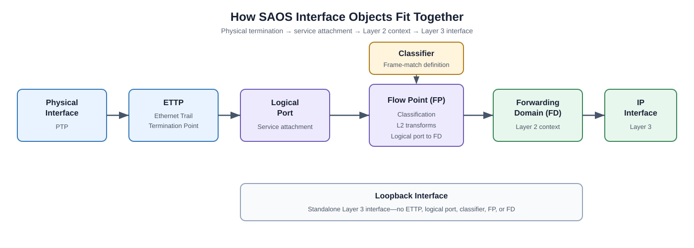
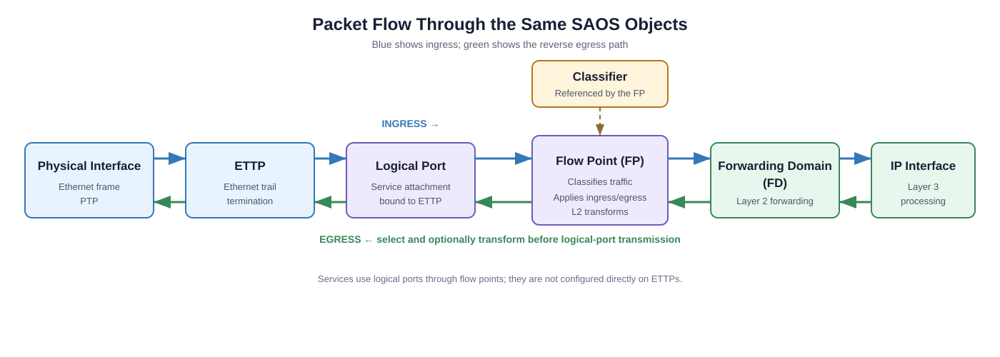

# F0 — SAOS Fundamentals

F0 is a theory-only introduction for readers who are new to Ciena SAOS 10x. There is no topology to deploy and no configuration goal. Read this guide before starting F1.

## Operational and Configuration Contexts

SAOS separates commands that inspect the system from commands that change it.

| Context | Typical prompt | Purpose |
|---------|----------------|---------|
| Operational | `PE-1>` | Run `show`, `ping`, and other monitoring commands. |
| Configuration | `diag@PE-1#` | Create or change configuration objects. |
| Configuration sub-mode | Prompt includes the current object or level | Configure individual properties within an object hierarchy. |

Enter configuration mode with:

```saos
config
```

The main navigation commands are:

| Command | Meaning |
|---------|---------|
| `exit` | Moves up one configuration level. At the top level, it leaves configuration mode. |
| `apply` | Applies pending edits without leaving configuration mode. |
| `return` | Leaves all configuration levels, but discards pending edits. |

> **Remember:** use `show` commands to inspect state in the operational context. Use `config` only when you intend to change the device.

## Understanding the CLI Hierarchy

The SAOS 10x CLI is hierarchical. A command can be entered as one complete path:

```saos
fps fp FP-IPI-1-601 fd-name FD-IPI-1-601 logical-port 1
```

The same configuration can be entered by moving through the hierarchy:

```saos
fps
fp FP-IPI-1-601
fd-name FD-IPI-1-601
logical-port 1
exit
exit
```

Both forms configure the same object. Complete commands are convenient for short changes. Sub-modes make longer objects easier to read, but you must track your current level and use `exit` to move back up the hierarchy.

## How the SAOS Objects Fit Together

An IP interface reached through an Ethernet faceplate port is built from
several linked SAOS objects. The physical interface components are abstracted
by an **Ethernet Trail Termination Point (ETTP)**. The ETTP is bound to a
**logical port**, which is the port abstraction used by services. A **flow
point (FP)** references that logical port, applies a **classifier**, and
connects matching traffic to a **forwarding domain (FD)**. The **IP
interface** then uses the FD as its Layer 2 underlay.



| Object | Role |
|--------|------|
| Physical interface components | The Ethernet medium, transceiver (XCVR), and physical termination point (PTP). |
| ETTP | Ethernet Trail Termination Point that abstracts the underlying physical interface components and terminates the Ethernet trail. |
| Logical port | The service-facing port abstraction bound to one ETTP by default, or to multiple ETTPs for an aggregation. |
| Classifier | A reusable configuration object that defines traffic match criteria, such as a VLAN ID. |
| Flow point (FP) | Applies attached classifiers on a logical port and connects matching traffic to an FD. |
| Forwarding domain (FD) | Provides the Layer 2 forwarding context beneath an IP interface. |
| IP interface | Adds Layer 3 behavior, including the MTU and IPv4/IPv6 addresses. |
| Loopback interface | A logical Layer 3 interface that does not require a port, classifier, FP, or FD. |

The classifier does not process frames by itself. It becomes active in the
forwarding path when an FP references it. The FP implements the classifier
match for its logical port in the dataplane and resolves matching traffic
into the configured FD. L2 services are configured through logical ports and
flow points, not directly on ETTPs.

## Traffic Through the Objects



On ingress, a frame passes through the physical interface components and
ETTP to the bound logical port. The FP applies its attached classifier and
optional ingress L2 transformation, and matching traffic enters the FD used
by the IP interface. On egress, traffic returns through the FD and FP, where
an egress L2 transformation can be applied before transmission through the
logical port, ETTP, and physical interface.

> **Key idea:** the ETTP represents Ethernet termination, the logical port is
> the service-facing port abstraction, and the FP applies classifier logic to
> connect that logical port to the FD.
