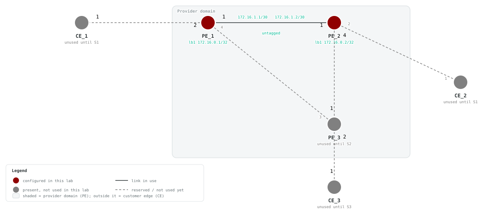

# F1 — IP Interfaces

## Goals

Build a lab network to learn the commands needed to add IP interfaces to SAOS 10x nodes. By the end of this lab you will be able to:

- Create loopback and IP interfaces using the SAOS 10x CLI
- Configure classifiers, forwarding domains, and flow points to support IP services
- Assign IPv4 and IPv6 addresses to interfaces
- Verify connectivity between directly-connected nodes

## Topology




The physical topology already matches S2. PE_1 and PE_2 use the active
foundation link; CE1, CE2, PE_3, and the future service/underlay links are
shown in gray because F1 does not configure or test them.

> **Resource note:** If you do not plan to continue into the Services track
> and your host is resource constrained, you may comment out CE1, CE2, PE_3,
> and every link except PE_1 `eth1` to PE_2 `eth1` in your local
> `topo.clab.yml`.

The generated topology diagrams are in `topo.clab.svg` and `topo.detail.svg`.

### IP Address Table

| Node | Interface    | IPv4 Address    | IPv6 Address    |
|------|--------------|-----------------|-----------------|
| PE_1 | lb1          | 172.16.0.1/32   | FC00::1/128     |
| PE_1 | PE_1-PE_2-if | 172.16.1.1/30   | FC00::600/127   |
| PE_2 | lb1          | 172.16.0.2/32   | FC00::2/128     |
| PE_2 | PE_1-PE_2-if | 172.16.1.2/30   | FC00::601/127   |

> **SAOS display note:** `show ip interfaces` reports IPv4 address and prefix-length as separate fields — not CIDR notation (you will see `172.16.1.1` and `30` on separate columns, not `172.16.1.1/30`). IPv6 addresses are shown fully expanded. Keep this in mind when reading verification output.

### Interface Stack Parameters

| Parameter    | Port 1              |
|--------------|---------------------|
| Tagging      | untagged            |
| Classifier   | CLASSIFIER-UNTAGGED |
| FD Name      | PE_1-PE_2-FD        |
| FD Mode      | vpls          |
| Flow Point   | PE_1-PE_2-FP  |
| IP Interface | PE_1-PE_2-if  |
| IP MTU       | 1500          |
| FP MTU-size  | 2000          |

## Prerequisites

- Complete [F0 — SAOS Fundamentals](../F0-SAOS-Fundamentals/README.md)
- ContainerLab installed and accessible
- SAOS 10x image `vrnetlab/ciena_saos:10-12-00-0228` (release 10.12.00.0228) available in the container registry
- Activate the built-in trial license after deployment

## Startup Configs

The checkpoint baseline each node boots from. If you are assembling the lab by hand, create a `configs/` folder next to `topo.clab.yml` and copy each file into it before you deploy.

- [PE_1.cfg.partial](./configs/PE_1.cfg.partial)
- [PE_2.cfg.partial](./configs/PE_2.cfg.partial)
- [PE_3.cfg.partial](./configs/PE_3.cfg.partial)
- [CE1.cfg.partial](./configs/CE1.cfg.partial)
- [CE2.cfg.partial](./configs/CE2.cfg.partial)

## Deploy

### Start from checkpoint

```bash
LAB=F1-Loopbacks-and-Interfaces
cd labs/${LAB}            # from the repo root, or cd into the unpacked directory
containerlab deploy -t topo.clab.yml
```

Equivalent invocation from the repo root:

```bash
containerlab deploy -t "labs/${LAB}/topo.clab.yml"
```

The lab topology (`topo.clab.yml`):

```yaml
name: F1-Loopbacks-and-Interfaces
topology:
  defaults:
    kind: ciena_saos
    image: vrnetlab/ciena_saos:10-12-00-0228
    labels:
      lab-mode: hands-on
  nodes:
    PE_1:
      type: '5162'
      startup-config: configs/PE_1.cfg.partial
    PE_2:
      type: '5162'
      startup-config: configs/PE_2.cfg.partial
    PE_3:
      type: '5162'
      labels:
        lab-state: unused
      startup-config: configs/PE_3.cfg.partial
    CE1:
      type: '3984'
      labels:
        lab-state: unused
      startup-config: configs/CE1.cfg.partial
    CE2:
      type: '3984'
      labels:
        lab-state: unused
      startup-config: configs/CE2.cfg.partial
  links:
  - endpoints: [ "PE_1:1", "PE_2:1" ]
  - endpoints: [ "PE_1:2", "CE1:1" ]
  - endpoints: [ "PE_2:2", "CE2:1" ]
  - endpoints: [ "PE_2:4", "PE_3:1" ]
  - endpoints: [ "PE_1:4", "PE_3:3" ]
  - endpoints: [ "CE2:2", "PE_3:2" ]
```

Once all five nodes reach healthy state, complete the F1 tasks on PE_1 and
PE_2:

```bash
ssh diag@clab-F1-Loopbacks-and-Interfaces-PE_1
ssh diag@clab-F1-Loopbacks-and-Interfaces-PE_2
```

Default credentials: `diag` / `ciena123`

## Instructions

<!-- task-index -->
- [Task 1: Verify the deployed topology](#task-1)
- [Task 2: Configure IP address on port 1 of PE_1](#task-2)
- [Task 3: Configure IP address on port 1 of PE_2](#task-3)
- [Task 4: Confirm the IP configuration](#task-4)
- [Task 5: Apply IPv6 addresses](#task-5)
- [Task 6: Confirm the IPv6 configuration](#task-6)

<a id="task-1"></a>
### Task 1: Verify the deployed topology
<a href="#task-1" title="Direct link to this task (right-click to copy)">🔗</a>

<!-- prose: detailed -->

**Summary** — Every lab in this series deploys the same five-node
topology, but only `PE_1` and `PE_2` are in play here — they connect
back-to-back on port 1. Before configuring anything, confirm the wiring
matches the diagram: verifying physical adjacency first means any later
reachability problem is a configuration problem, not a cabling one.

**Implementation** — Nothing to configure yet. SAOS 10x runs LLDP out
of the box, so a fresh router already advertises its hostname to its
neighbors — inspect each PE's neighbor table for its peer.

<!-- verify-prose -->

Each PE's neighbor table should show its peer on interface 1, keyed by
`system-name`. Note what LLDP hands you for free — the far-end chassis
MAC, port id, even `max-frame-size` — worth a glance now, since MTU
becomes a theme in the next task.

**Verify** (show mode) on **PE_1**:

```saos-show
show lldp neighbors
```

Pass: Output contains `system-name` and `PE_2`

<details><summary>Example output</summary>

```
+--------------- LLDP NEIGHBORS ---------------+
| Parameter                   | Value          |
+-----------------------------+----------------+
| interface                   | 1              |
| chassis-id                  | 0C00CA51D3F1   |
| chassis-id-subtype          | mac-address    |
| port-desc                   | 1              |
| port-id                     | 1              |
| port-id-subtype             | interface-name |
| system-capability-supported | bridge         |
| system-capability-enabled   | bridge         |
| system-description          | 5162           |
| system-name                 | PE_2           |
| auto-neg-supported          | True           |
| auto-neg-enabled            | False          |
| oper-mau-type               | 33             |
| port-class                  | p-class-pd     |
| mdi-supported               | False          |
| mdi-enabled                 | False          |
| pair-controlable            | False          |
| agg-status                  | capable        |
| max-frame-size              | 1526           |
| man-address-subtype         | ipv4           |
| man-address                 | 10.0.0.15      |
| if-subtype                  | if-index       |
+-----------------------------+----------------+
| interface                   | 2              |
| chassis-id                  | 0C00C94520F1   |
| chassis-id-subtype          | mac-address    |
| port-desc                   | 1              |
| port-id                     | 1              |
| port-id-subtype             | interface-name |
| system-capability-supported | bridge         |
| system-capability-enabled   | bridge         |
| system-description          | 3984           |
| system-name                 | CE1            |
| auto-neg-supported          | True           |
| auto-neg-enabled            | False          |
| oper-mau-type               | 33             |
| port-class                  | p-class-pd     |
| mdi-supported               | False          |
| mdi-enabled                 | False          |
| pair-controlable            | False          |
| agg-status                  | capable        |
| max-frame-size              | 1526           |
| man-address-subtype         | ipv4           |
| man-address                 | 10.0.0.15      |
| if-subtype                  | if-index       |
+-----------------------------+----------------+
| interface                   | 4              |
| chassis-id                  | 0C00DC6584F1   |
| chassis-id-subtype          | mac-address    |
| port-desc                   | 3              |
| port-id                     | 3              |
| port-id-subtype             | interface-name |
| system-capability-supported | bridge         |
| system-capability-enabled   | bridge         |
| system-description          | 5162           |
| system-name                 | PE_3           |
| auto-neg-supported          | True           |
| auto-neg-enabled            | False          |
| oper-mau-type               | 33             |
| port-class                  | p-class-pd     |
| mdi-supported               | False          |
| mdi-enabled                 | False          |
| pair-controlable            | False          |
| agg-status                  | capable        |
| max-frame-size              | 1526           |
| man-address-subtype         | ipv4           |
| man-address                 | 10.0.0.15      |
| if-subtype                  | if-index       |
+-----------------------------+----------------+
```

</details>

**Verify** (show mode) on **PE_2**:

```saos-show
show lldp neighbors
```

Pass: Output contains `system-name` and `PE_1`

<details><summary>Example output</summary>

```
+--------------- LLDP NEIGHBORS ---------------+
| Parameter                   | Value          |
+-----------------------------+----------------+
| interface                   | 1              |
| chassis-id                  | 0C00711A13F1   |
| chassis-id-subtype          | mac-address    |
| port-desc                   | 1              |
| port-id                     | 1              |
| port-id-subtype             | interface-name |
| system-capability-supported | bridge         |
| system-capability-enabled   | bridge         |
| system-description          | 5162           |
| system-name                 | PE_1           |
| auto-neg-supported          | True           |
| auto-neg-enabled            | False          |
| oper-mau-type               | 33             |
| port-class                  | p-class-pd     |
| mdi-supported               | False          |
| mdi-enabled                 | False          |
| pair-controlable            | False          |
| agg-status                  | capable        |
| max-frame-size              | 1526           |
| man-address-subtype         | ipv4           |
| man-address                 | 10.0.0.15      |
| if-subtype                  | if-index       |
+-----------------------------+----------------+
| interface                   | 2              |
| chassis-id                  | 0C000F3EBAF1   |
| chassis-id-subtype          | mac-address    |
| port-desc                   | 1              |
| port-id                     | 1              |
| port-id-subtype             | interface-name |
| system-capability-supported | bridge         |
| system-capability-enabled   | bridge         |
| system-description          | 3984           |
| system-name                 | CE2            |
| auto-neg-supported          | True           |
| auto-neg-enabled            | False          |
| oper-mau-type               | 33             |
| port-class                  | p-class-pd     |
| mdi-supported               | False          |
| mdi-enabled                 | False          |
| pair-controlable            | False          |
| agg-status                  | capable        |
| max-frame-size              | 1526           |
| man-address-subtype         | ipv4           |
| man-address                 | 10.0.0.15      |
| if-subtype                  | if-index       |
+-----------------------------+----------------+
| interface                   | 4              |
| chassis-id                  | 0C00DC6584F1   |
| chassis-id-subtype          | mac-address    |
| port-desc                   | 1              |
| port-id                     | 1              |
| port-id-subtype             | interface-name |
| system-capability-supported | bridge         |
| system-capability-enabled   | bridge         |
| system-description          | 5162           |
| system-name                 | PE_3           |
| auto-neg-supported          | True           |
| auto-neg-enabled            | False          |
| oper-mau-type               | 33             |
| port-class                  | p-class-pd     |
| mdi-supported               | False          |
| mdi-enabled                 | False          |
| pair-controlable            | False          |
| agg-status                  | capable        |
| max-frame-size              | 1526           |
| man-address-subtype         | ipv4           |
| man-address                 | 10.0.0.15      |
| if-subtype                  | if-index       |
+-----------------------------+----------------+
```

</details>

<a id="task-2"></a>
### Task 2: Configure IP address on port 1 of PE_1
<a href="#task-2" title="Direct link to this task (right-click to copy)">🔗</a>

<!-- prose: in-depth -->

**Summary** — This task builds `PE_1`'s entire L3 identity from
scratch, and in doing so introduces the SAOS 10x layering model: a
loopback for the router's stable identity and a routed interface for
the point-to-point link, plus the L2 plumbing underneath them.

**Background** — Unlike platforms where you type an address directly
onto a port, SAOS 10x separates *frame selection* from *forwarding*
from *routing*: a **classifier** describes which frames to match (here,
untagged ones), a **flow-point** binds a logical port plus that
classifier into a **forwarding-domain** (an L2 switching context,
`vpls` mode), and the **IP interface** — an `oc-if:interfaces` object
in the openconfig style — attaches to that FD via an
`underlay-binding`. The names encode the relationships: everything
scoped to this link shares the `PE_1-PE_2` prefix (`-FD`, `-FP`,
`-if`), so cross-references are readable at a glance.

**Implementation** — In plain steps:

1. Create the forwarding-domain `PE_1-PE_2-FD` in vpls mode — the L2
   context the routed interface will ride on.
2. Create loopback `lb1` and give it `172.16.0.1/32` — the router's
   stable identity, independent of any physical port.
3. Create IP interface `PE_1-PE_2-if` with MTU 1500, bind it to the FD,
   and address it `172.16.1.1/30` for the point-to-point link.
4. Create `CLASSIFIER-UNTAGGED` to match untagged frames, then
   flow-point `PE_1-PE_2-FP` tying port 1 plus that classifier into the
   FD.

Note the two MTUs: the flow-point's frame-level ceiling of 2000 must
leave headroom above the IP interface's `mtu` of 1500 — the flow-point
carries the whole Ethernet frame, the IP interface only the packet.

**Configure** (config mode) on **PE_1**:

```saos-config
fds fd PE_1-PE_2-FD mode vpls
oc-if:interfaces interface lb1 config name lb1 type loopback
oc-if:interfaces interface lb1 ipv4 addresses address 172.16.0.1 config ip 172.16.0.1 prefix-length 32
oc-if:interfaces interface PE_1-PE_2-if config mtu 1500 name PE_1-PE_2-if type ip
oc-if:interfaces interface PE_1-PE_2-if config underlay-binding config fd PE_1-PE_2-FD
oc-if:interfaces interface PE_1-PE_2-if ipv4 addresses address 172.16.1.1 config ip 172.16.1.1 prefix-length 30
classifiers classifier CLASSIFIER-UNTAGGED filter-entry vtag-stack untagged-exclude-priority-tagged false
fps fp PE_1-PE_2-FP classifier-list-precedence 7 fd-name PE_1-PE_2-FD logical-port 1 mtu-size 2000 stats-collection on classifier-list CLASSIFIER-UNTAGGED
```

<!-- verify-prose -->

Walk the chain in the same order you built it: the FD should exist in
`vpls` mode, and the flow-point should show it sits on logical port 1,
references `PE_1-PE_2-FD`, and carries `CLASSIFIER-UNTAGGED` — that
three-way binding is what connects the wire to the routed interface.
Then in the IP interface state, both `lb1` (`172.16.0.1/32`) and
`PE_1-PE_2-if` (`172.16.1.1/30`) should appear. Keep in mind `PE_2` is
still an empty box: the /30 has no live peer yet, so don't expect
anything to answer a ping — that comes after the next task.

**Verify** (show mode) on **PE_1**:

```saos-show
show ip interfaces
```

Pass: Output contains `lb1` and `172.16.0.1` and `32`

<details><summary>Example output</summary>

```
+-------------------------------------------------- IP INTERFACES STATE ---------------------------------------------------+
| Name                                       | Value                                                                       |
+--------------------------------------------+-----------------------------------------------------------------------------+
| Name                                       | mgmtbr0                                                                     |
| Oper Status                                | UP                                                                          |
| Admin Status                               | UP                                                                          |
| Type                                       | system                                                                      |
| Role                                       | management                                                                  |
| VRF Binding                                | default                                                                     |
| DHCP IPv4 Client                           | True                                                                        |
| DHCP IPv4 Address                          | 10.0.0.15                                                                   |
| DHCP IPv4 Prefix                           | 24                                                                          |
| IPv6 Link Local Data                       |                                                                             |
|   Address                                  | fe80::200:71ff:fe1a:1400                                                    |
|   Prefix Length                            | 128                                                                         |
|   Origin                                   | AUTO                                                                        |
| Interface Index                            | 56                                                                          |
| Description                                | bridge interface for out of band management port/local management interface |
| MTU                                        | 1500                                                                        |
| MAC Address                                | 0c:00:71:1a:14:00                                                           |
| Bandwidth (Mbps)                           | 0                                                                           |
| Gratuitous ARP                             | Disabled                                                                    |
| Unsolicited Neighbor Advertisement         | Disabled                                                                    |
| Router Advertisement                       | Disabled                                                                    |
| Counters                                   |                                                                             |
|   Input Octets                             | 32254                                                                       |
|   Input Packets                            | 557                                                                         |
|   Input Dropped Octets                     | -                                                                           |
|   Input Dropped Packets                    | 0                                                                           |
|   Output Octets                            | 209399                                                                      |
|   Output Packets                           | 580                                                                         |
|   Output Gratuitous ARP Packets            | -                                                                           |
|   Output Unsolicited Neighbor Adv. Packets | -                                                                           |
|   Output Router Adv. Packets               | 0                                                                           |
|   Output Router Adv. Octets                | 0                                                                           |
|   Input Router Solicitation Packets        | 0                                                                           |
|   Input Router Solicitation Octets         | 0                                                                           |
| DSCP Remarking                             |                                                                             |
|   Origin                                   | Not Configured                                                              |
|   Enabled                                  | False                                                                       |
| Duplicate Address Detection                |                                                                             |
|   Status                                   | Enabled                                                                     |
| IPv4 uRPF                                  |                                                                             |
|   Origin                                   | Not Configured                                                              |
|   Mode                                     | -                                                                           |
| IPv6 uRPF                                  |                                                                             |
|   Origin                                   | Not Configured                                                              |
|   Mode                                     | -                                                                           |
+--------------------------------------------+-----------------------------------------------------------------------------+
| Name                                       | remote                                                                      |
| Oper Status                                | UP                                                                          |
| Admin Status                               | UP                                                                          |
| Type                                       | ip                                                                          |
| Role                                       | management                                                                  |
| VRF Binding                                | default                                                                     |
| IPv6 Link Local Data                       |                                                                             |
|   Address                                  | fe80::e00:71ff:fe1a:13f7                                                    |
|   Prefix Length                            | 64                                                                          |
|   Origin                                   | AUTO                                                                        |
|   Address Status                           | preferred                                                                   |
| Interface Index                            | 1073731825                                                                  |
| Description                                | in band remote management interface                                         |
| MTU                                        | 1500                                                                        |
| MAC Address                                | 0c:00:71:1a:13:f7                                                           |
| Last Changed                               | Aug 06 2026 20:25:27 Local                                                  |
| Bandwidth (Mbps)                           | 10000                                                                       |
| Gratuitous ARP                             | Enabled                                                                     |
| Unsolicited Neighbor Advertisement         | Enabled                                                                     |
| Router Advertisement                       | Disabled                                                                    |
| Underlay Binding                           | remote-fd                                                                   |
| Underlay Binding Type                      | Forwarding Domain                                                           |
| CoS to Frame Map                           | default-c2f                                                                 |
| Frame to CoS Map                           | default-f2c                                                                 |
| Stats Collection                           | on                                                                          |
| Counters                                   |                                                                             |
|   Input Octets                             | 0                                                                           |
|   Input Packets                            | 0                                                                           |
|   Input Dropped Octets                     | 0                                                                           |
|   Input Dropped Packets                    | 0                                                                           |
|   Output Octets                            | 0                                                                           |
|   Output Packets                           | 0                                                                           |
|   Output Gratuitous ARP Packets            | -                                                                           |
|   Output Unsolicited Neighbor Adv. Packets | -                                                                           |
|   Output Router Adv. Packets               | 0                                                                           |
|   Output Router Adv. Octets                | 0                                                                           |
|   Input Router Solicitation Packets        | 0                                                                           |
|   Input Router Solicitation Octets         | 0                                                                           |
| DSCP Remarking                             |                                                                             |
|   Origin                                   | Not Configured                                                              |
|   Enabled                                  | False                                                                       |
| Duplicate Address Detection                |                                                                             |
|   Status                                   | Enabled                                                                     |
| Flow Point(s)                              | remote-fp1, remote-fp2, remote-fp3, remote-fp4, remote-fp5, remote-fp6,     |
|                                            | remote-fp7, remote-fp8, remote-fp9, remote-fp10, remote-fp11, remote-fp12,  |
|                                            | remote-fp13, remote-fp14, remote-fp15, remote-fp16, remote-fp17,            |
|                                            | remote-fp18, remote-fp19, remote-fp20, remote-fp21, remote-fp22,            |
|                                            | remote-fp23, remote-fp24, remote-fp25, remote-fp26, remote-fp27,            |
|                                            | remote-fp28, remote-fp29, remote-fp30, remote-fp31, remote-fp32,            |
|                                            | remote-fp33, remote-fp34, remote-fp35, remote-fp36, remote-fp37,            |
|                                            | remote-fp38, remote-fp39, remote-fp40, remote-fp41, remote-fp42             |
| Logical Port(s)                            | 1, 2, 3, 4, 5, 6, 7, 8, 9, 10, 11, 12, 13, 14, 15, 16, 17, 18, 19, 20, 21,  |
|                                            | 22, 23, 24, 25, 26, 27, 28, 29, 30, 31, 32, 33, 34, 35, 36, 37, 38, 39, 40, |
|                                            |  41, 42                                                                     |
| Classifier(s)                              | default-vid-127, default-vid-127, default-vid-127, default-vid-127,         |
|                                            | default-vid-127, default-vid-127, default-vid-127, default-vid-127,         |
|                                            | default-vid-127, default-vid-127, default-vid-127, default-vid-127,         |
|                                            | default-vid-127, default-vid-127, default-vid-127, default-vid-127,         |
|                                            | default-vid-127, default-vid-127, default-vid-127, default-vid-127,         |
|                                            | default-vid-127, default-vid-127, default-vid-127, default-vid-127,         |
|                                            | default-vid-127, default-vid-127, default-vid-127, default-vid-127,         |
|                                            | default-vid-127, default-vid-127, default-vid-127, default-vid-127,         |
|                                            | default-vid-127, default-vid-127, default-vid-127, default-vid-127,         |
|                                            | default-vid-127, default-vid-127, default-vid-127, default-vid-127,         |
|                                            | default-vid-127, default-vid-127                                            |
| IPv4 uRPF                                  |                                                                             |
|   Origin                                   | Not Configured                                                              |
|   Mode                                     | -                                                                           |
| IPv6 uRPF                                  |                                                                             |
|   Origin                                   | Not Configured                                                              |
|   Mode                                     | -                                                                           |
+--------------------------------------------+-----------------------------------------------------------------------------+
| Name                                       | lb1                                                                         |
| Oper Status                                | UP                                                                          |
| Admin Status                               | UP                                                                          |
| Type                                       | loopback                                                                    |
| Role                                       | data                                                                        |
| VRF Binding                                | default                                                                     |
| IPv6 Link Local Data                       |                                                                             |
|   Address                                  | fe80::e00:71ff:fe1a:13f6                                                    |
|   Prefix Length                            | 64                                                                          |
|   Origin                                   | AUTO                                                                        |
|   Address Status                           | preferred                                                                   |
| Interface Index                            | 1073735925                                                                  |
| Description                                | -                                                                           |
| MTU                                        | 1500                                                                        |
| Bandwidth (Mbps)                           | 0                                                                           |
| Gratuitous ARP                             | Disabled                                                                    |
| Unsolicited Neighbor Advertisement         | Disabled                                                                    |
| Router Advertisement                       | Disabled                                                                    |
| Counters                                   |                                                                             |
|   Input Octets                             | 0                                                                           |
|   Input Packets                            | 0                                                                           |
|   Input Dropped Octets                     | 0                                                                           |
|   Input Dropped Packets                    | 0                                                                           |
|   Output Octets                            | 0                                                                           |
|   Output Packets                           | 0                                                                           |
|   Output Gratuitous ARP Packets            | 0                                                                           |
|   Output Unsolicited Neighbor Adv. Packets | 0                                                                           |
|   Output Router Adv. Packets               | 0                                                                           |
|   Output Router Adv. Octets                | 0                                                                           |
|   Input Router Solicitation Packets        | 0                                                                           |
|   Input Router Solicitation Octets         | 0                                                                           |
| DSCP Remarking                             |                                                                             |
|   Origin                                   | Not Configured                                                              |
|   Enabled                                  | False                                                                       |
| IPv4 Addresses                             |                                                                             |
|   IP                                       | 172.16.0.1                                                                  |
|   Prefix Length                            | 32                                                                          |
|   Origin                                   | STATIC                                                                      |
|   Secondary IP                             |                                                                             |
| IPv6 Addresses                             |                                                                             |
|   IP                                       | fc00:0000:0000:0000:0000:0000:0000:0001                                     |
|   Prefix Length                            | 128                                                                         |
|   Origin                                   | STATIC                                                                      |
|   Address Status                           | preferred                                                                   |
|   Secondary IP                             |                                                                             |
|       Preferred                            | -                                                                           |
|       Duplicate                            | -                                                                           |
|       Tentative                            | -                                                                           |
| Duplicate Address Detection                |                                                                             |
|   Status                                   | Enabled                                                                     |
| IPv4 uRPF                                  |                                                                             |
|   Origin                                   | Not Configured                                                              |
|   Mode                                     | -                                                                           |
| IPv6 uRPF                                  |                                                                             |
|   Origin                                   | Not Configured                                                              |
|   Mode                                     | -                                                                           |
+--------------------------------------------+-----------------------------------------------------------------------------+
| Name                                       | PE_1-PE_2-if                                                                |
| Oper Status                                | UP                                                                          |
| Admin Status                               | UP                                                                          |
| Type                                       | ip                                                                          |
| Role                                       | data                                                                        |
| VRF Binding                                | default                                                                     |
| IPv6 Link Local Data                       |                                                                             |
|   Address                                  | fe80::e00:71ff:fe1a:13f6                                                    |
|   Prefix Length                            | 64                                                                          |
|   Origin                                   | AUTO                                                                        |
|   Address Status                           | preferred                                                                   |
| Interface Index                            | 1073731826                                                                  |
| Description                                | -                                                                           |
| MTU                                        | 1500                                                                        |
| MAC Address                                | 0c:00:71:1a:13:f6                                                           |
| Last Changed                               | Aug 06 2026 20:32:02 Local                                                  |
| Bandwidth (Mbps)                           | 10000                                                                       |
| Gratuitous ARP                             | Disabled                                                                    |
| Unsolicited Neighbor Advertisement         | Disabled                                                                    |
| Router Advertisement                       | Disabled                                                                    |
| Underlay Binding                           | PE_1-PE_2-FD                                                                |
| Underlay Binding Type                      | Forwarding Domain                                                           |
| CoS to Frame Map                           | default-c2f                                                                 |
| Frame to CoS Map                           | default-f2c                                                                 |
| Stats Collection                           | on                                                                          |
| Counters                                   |                                                                             |
|   Input Octets                             | 3844                                                                        |
|   Input Packets                            | 44                                                                          |
|   Input Dropped Octets                     | 0                                                                           |
|   Input Dropped Packets                    | 5                                                                           |
|   Output Octets                            | 3930                                                                        |
|   Output Packets                           | 42                                                                          |
|   Output Gratuitous ARP Packets            | 0                                                                           |
|   Output Unsolicited Neighbor Adv. Packets | 0                                                                           |
|   Output Router Adv. Packets               | 0                                                                           |
|   Output Router Adv. Octets                | 0                                                                           |
|   Input Router Solicitation Packets        | 0                                                                           |
|   Input Router Solicitation Octets         | 0                                                                           |
| DSCP Remarking                             |                                                                             |
|   Origin                                   | Not Configured                                                              |
|   Enabled                                  | False                                                                       |
| IPv4 Addresses                             |                                                                             |
|   IP                                       | 172.16.1.1                                                                  |
|   Prefix Length                            | 30                                                                          |
|   Origin                                   | STATIC                                                                      |
|   Secondary IP                             |                                                                             |
| IPv6 Addresses                             |                                                                             |
|   IP                                       | fc00:0000:0000:0000:0000:0000:0000:0600                                     |
|   Prefix Length                            | 127                                                                         |
|   Origin                                   | STATIC                                                                      |
|   Address Status                           | preferred                                                                   |
|   Secondary IP                             |                                                                             |
|       Preferred                            | -                                                                           |
|       Duplicate                            | -                                                                           |
|       Tentative                            | -                                                                           |
| Duplicate Address Detection                |                                                                             |
|   Status                                   | Enabled                                                                     |
| Flow Point(s)                              | PE_1-PE_2-FP                                                                |
| Logical Port(s)                            | 1                                                                           |
| Classifier(s)                              | CLASSIFIER-UNTAGGED                                                         |
| IPv4 uRPF                                  |                                                                             |
|   Origin                                   | Not Configured                                                              |
|   Mode                                     | -                                                                           |
| IPv6 uRPF                                  |                                                                             |
|   Origin                                   | Not Configured                                                              |
|   Mode                                     | -                                                                           |
+--------------------------------------------+-----------------------------------------------------------------------------+
```

</details>

**Verify** (show mode) on **PE_1**:

```saos-show
show forwarding-domains forwarding-domain PE_1-PE_2-FD
```

Pass: Output contains `PE_1-PE_2-FD` and `vpls`

<details><summary>Example output</summary>

```
+- FORWARDING DOMAIN -+
| KEY  | VALUE        |
+------+--------------+
| Name | PE_1-PE_2-FD |
| Mode | vpls         |
+------+--------------+
```

</details>

**Verify** (show mode) on **PE_1**:

```saos-show
show flow-points flow-point PE_1-PE_2-FP
```

Pass: Output contains `PE_1-PE_2-FP` and `PE_1-PE_2-FD` and `CLASSIFIER-UNTAGGED`

<details><summary>Example output</summary>

```
+------------------- FLOW POINT -------------------+
| KEY                        | VALUE               |
+----------------------------+---------------------+
| Name                       | PE_1-PE_2-FP        |
| Forwarding Domain Name     | PE_1-PE_2-FD        |
| Logical Port               | 1                   |
| Statistics Collection      | on                  |
| MTU Size                   | 2000                |
| Admin State                | enabled             |
| Classifier List Precedence | 7                   |
| Classifier List            |                     |
|                            | CLASSIFIER-UNTAGGED |
+----------------------------+---------------------+
+------ FLOW POINT STATISTICS -------+
| KEY                 | VALUE        |
+---------------------+--------------+
| Name                | PE_1-PE_2-FP |
| Rx Accepted Bytes   | 4552         |
| Rx Accepted Frames  | 47           |
| Tx Forwarded Bytes  | 3930         |
| Tx Forwarded Frames | 42           |
| Rx Yellow Bytes     | 0            |
| Rx Yellow Frames    | 0            |
| Rx Dropped Bytes    | 0            |
| Rx Dropped Frames   | 0            |
+---------------------+--------------+
+----------- FLOW POINT STATE -----------+
| KEY                 | VALUE            |
+---------------------+------------------+
| Name                | PE_1-PE_2-FP     |
| Oper State          | up               |
| Oper Up Time        | 0 days,0h:0m:22s |
| Egress L2 Transform | -                |
+---------------------+------------------+
```

</details>

**Verify** (show mode) on **PE_1**:

```saos-show
show ip interfaces
```

Pass: Output contains `PE_1-PE_2-if` and `172.16.1.1` and `30`

<details><summary>Example output</summary>

```
+-------------------------------------------------- IP INTERFACES STATE ---------------------------------------------------+
| Name                                       | Value                                                                       |
+--------------------------------------------+-----------------------------------------------------------------------------+
| Name                                       | mgmtbr0                                                                     |
| Oper Status                                | UP                                                                          |
| Admin Status                               | UP                                                                          |
| Type                                       | system                                                                      |
| Role                                       | management                                                                  |
| VRF Binding                                | default                                                                     |
| DHCP IPv4 Client                           | True                                                                        |
| DHCP IPv4 Address                          | 10.0.0.15                                                                   |
| DHCP IPv4 Prefix                           | 24                                                                          |
| IPv6 Link Local Data                       |                                                                             |
|   Address                                  | fe80::200:71ff:fe1a:1400                                                    |
|   Prefix Length                            | 128                                                                         |
|   Origin                                   | AUTO                                                                        |
| Interface Index                            | 56                                                                          |
| Description                                | bridge interface for out of band management port/local management interface |
| MTU                                        | 1500                                                                        |
| MAC Address                                | 0c:00:71:1a:14:00                                                           |
| Bandwidth (Mbps)                           | 0                                                                           |
| Gratuitous ARP                             | Disabled                                                                    |
| Unsolicited Neighbor Advertisement         | Disabled                                                                    |
| Router Advertisement                       | Disabled                                                                    |
| Counters                                   |                                                                             |
|   Input Octets                             | 34982                                                                       |
|   Input Packets                            | 618                                                                         |
|   Input Dropped Octets                     | -                                                                           |
|   Input Dropped Packets                    | 0                                                                           |
|   Output Octets                            | 247859                                                                      |
|   Output Packets                           | 638                                                                         |
|   Output Gratuitous ARP Packets            | -                                                                           |
|   Output Unsolicited Neighbor Adv. Packets | -                                                                           |
|   Output Router Adv. Packets               | 0                                                                           |
|   Output Router Adv. Octets                | 0                                                                           |
|   Input Router Solicitation Packets        | 0                                                                           |
|   Input Router Solicitation Octets         | 0                                                                           |
| DSCP Remarking                             |                                                                             |
|   Origin                                   | Not Configured                                                              |
|   Enabled                                  | False                                                                       |
| Duplicate Address Detection                |                                                                             |
|   Status                                   | Enabled                                                                     |
| IPv4 uRPF                                  |                                                                             |
|   Origin                                   | Not Configured                                                              |
|   Mode                                     | -                                                                           |
| IPv6 uRPF                                  |                                                                             |
|   Origin                                   | Not Configured                                                              |
|   Mode                                     | -                                                                           |
+--------------------------------------------+-----------------------------------------------------------------------------+
| Name                                       | remote                                                                      |
| Oper Status                                | UP                                                                          |
| Admin Status                               | UP                                                                          |
| Type                                       | ip                                                                          |
| Role                                       | management                                                                  |
| VRF Binding                                | default                                                                     |
| IPv6 Link Local Data                       |                                                                             |
|   Address                                  | fe80::e00:71ff:fe1a:13f7                                                    |
|   Prefix Length                            | 64                                                                          |
|   Origin                                   | AUTO                                                                        |
|   Address Status                           | preferred                                                                   |
| Interface Index                            | 1073731825                                                                  |
| Description                                | in band remote management interface                                         |
| MTU                                        | 1500                                                                        |
| MAC Address                                | 0c:00:71:1a:13:f7                                                           |
| Last Changed                               | Aug 06 2026 20:25:27 Local                                                  |
| Bandwidth (Mbps)                           | 10000                                                                       |
| Gratuitous ARP                             | Enabled                                                                     |
| Unsolicited Neighbor Advertisement         | Enabled                                                                     |
| Router Advertisement                       | Disabled                                                                    |
| Underlay Binding                           | remote-fd                                                                   |
| Underlay Binding Type                      | Forwarding Domain                                                           |
| CoS to Frame Map                           | default-c2f                                                                 |
| Frame to CoS Map                           | default-f2c                                                                 |
| Stats Collection                           | on                                                                          |
| Counters                                   |                                                                             |
|   Input Octets                             | 0                                                                           |
|   Input Packets                            | 0                                                                           |
|   Input Dropped Octets                     | 0                                                                           |
|   Input Dropped Packets                    | 0                                                                           |
|   Output Octets                            | 0                                                                           |
|   Output Packets                           | 0                                                                           |
|   Output Gratuitous ARP Packets            | -                                                                           |
|   Output Unsolicited Neighbor Adv. Packets | -                                                                           |
|   Output Router Adv. Packets               | 0                                                                           |
|   Output Router Adv. Octets                | 0                                                                           |
|   Input Router Solicitation Packets        | 0                                                                           |
|   Input Router Solicitation Octets         | 0                                                                           |
| DSCP Remarking                             |                                                                             |
|   Origin                                   | Not Configured                                                              |
|   Enabled                                  | False                                                                       |
| Duplicate Address Detection                |                                                                             |
|   Status                                   | Enabled                                                                     |
| Flow Point(s)                              | remote-fp1, remote-fp2, remote-fp3, remote-fp4, remote-fp5, remote-fp6,     |
|                                            | remote-fp7, remote-fp8, remote-fp9, remote-fp10, remote-fp11, remote-fp12,  |
|                                            | remote-fp13, remote-fp14, remote-fp15, remote-fp16, remote-fp17,            |
|                                            | remote-fp18, remote-fp19, remote-fp20, remote-fp21, remote-fp22,            |
|                                            | remote-fp23, remote-fp24, remote-fp25, remote-fp26, remote-fp27,            |
|                                            | remote-fp28, remote-fp29, remote-fp30, remote-fp31, remote-fp32,            |
|                                            | remote-fp33, remote-fp34, remote-fp35, remote-fp36, remote-fp37,            |
|                                            | remote-fp38, remote-fp39, remote-fp40, remote-fp41, remote-fp42             |
| Logical Port(s)                            | 1, 2, 3, 4, 5, 6, 7, 8, 9, 10, 11, 12, 13, 14, 15, 16, 17, 18, 19, 20, 21,  |
|                                            | 22, 23, 24, 25, 26, 27, 28, 29, 30, 31, 32, 33, 34, 35, 36, 37, 38, 39, 40, |
|                                            |  41, 42                                                                     |
| Classifier(s)                              | default-vid-127, default-vid-127, default-vid-127, default-vid-127,         |
|                                            | default-vid-127, default-vid-127, default-vid-127, default-vid-127,         |
|                                            | default-vid-127, default-vid-127, default-vid-127, default-vid-127,         |
|                                            | default-vid-127, default-vid-127, default-vid-127, default-vid-127,         |
|                                            | default-vid-127, default-vid-127, default-vid-127, default-vid-127,         |
|                                            | default-vid-127, default-vid-127, default-vid-127, default-vid-127,         |
|                                            | default-vid-127, default-vid-127, default-vid-127, default-vid-127,         |
|                                            | default-vid-127, default-vid-127, default-vid-127, default-vid-127,         |
|                                            | default-vid-127, default-vid-127, default-vid-127, default-vid-127,         |
|                                            | default-vid-127, default-vid-127, default-vid-127, default-vid-127,         |
|                                            | default-vid-127, default-vid-127                                            |
| IPv4 uRPF                                  |                                                                             |
|   Origin                                   | Not Configured                                                              |
|   Mode                                     | -                                                                           |
| IPv6 uRPF                                  |                                                                             |
|   Origin                                   | Not Configured                                                              |
|   Mode                                     | -                                                                           |
+--------------------------------------------+-----------------------------------------------------------------------------+
| Name                                       | lb1                                                                         |
| Oper Status                                | UP                                                                          |
| Admin Status                               | UP                                                                          |
| Type                                       | loopback                                                                    |
| Role                                       | data                                                                        |
| VRF Binding                                | default                                                                     |
| IPv6 Link Local Data                       |                                                                             |
|   Address                                  | fe80::e00:71ff:fe1a:13f6                                                    |
|   Prefix Length                            | 64                                                                          |
|   Origin                                   | AUTO                                                                        |
|   Address Status                           | preferred                                                                   |
| Interface Index                            | 1073735925                                                                  |
| Description                                | -                                                                           |
| MTU                                        | 1500                                                                        |
| Bandwidth (Mbps)                           | 0                                                                           |
| Gratuitous ARP                             | Disabled                                                                    |
| Unsolicited Neighbor Advertisement         | Disabled                                                                    |
| Router Advertisement                       | Disabled                                                                    |
| Counters                                   |                                                                             |
|   Input Octets                             | 0                                                                           |
|   Input Packets                            | 0                                                                           |
|   Input Dropped Octets                     | 0                                                                           |
|   Input Dropped Packets                    | 0                                                                           |
|   Output Octets                            | 0                                                                           |
|   Output Packets                           | 0                                                                           |
|   Output Gratuitous ARP Packets            | 0                                                                           |
|   Output Unsolicited Neighbor Adv. Packets | 0                                                                           |
|   Output Router Adv. Packets               | 0                                                                           |
|   Output Router Adv. Octets                | 0                                                                           |
|   Input Router Solicitation Packets        | 0                                                                           |
|   Input Router Solicitation Octets         | 0                                                                           |
| DSCP Remarking                             |                                                                             |
|   Origin                                   | Not Configured                                                              |
|   Enabled                                  | False                                                                       |
| IPv4 Addresses                             |                                                                             |
|   IP                                       | 172.16.0.1                                                                  |
|   Prefix Length                            | 32                                                                          |
|   Origin                                   | STATIC                                                                      |
|   Secondary IP                             |                                                                             |
| IPv6 Addresses                             |                                                                             |
|   IP                                       | fc00:0000:0000:0000:0000:0000:0000:0001                                     |
|   Prefix Length                            | 128                                                                         |
|   Origin                                   | STATIC                                                                      |
|   Address Status                           | preferred                                                                   |
|   Secondary IP                             |                                                                             |
|       Preferred                            | -                                                                           |
|       Duplicate                            | -                                                                           |
|       Tentative                            | -                                                                           |
| Duplicate Address Detection                |                                                                             |
|   Status                                   | Enabled                                                                     |
| IPv4 uRPF                                  |                                                                             |
|   Origin                                   | Not Configured                                                              |
|   Mode                                     | -                                                                           |
| IPv6 uRPF                                  |                                                                             |
|   Origin                                   | Not Configured                                                              |
|   Mode                                     | -                                                                           |
+--------------------------------------------+-----------------------------------------------------------------------------+
| Name                                       | PE_1-PE_2-if                                                                |
| Oper Status                                | UP                                                                          |
| Admin Status                               | UP                                                                          |
| Type                                       | ip                                                                          |
| Role                                       | data                                                                        |
| VRF Binding                                | default                                                                     |
| IPv6 Link Local Data                       |                                                                             |
|   Address                                  | fe80::e00:71ff:fe1a:13f6                                                    |
|   Prefix Length                            | 64                                                                          |
|   Origin                                   | AUTO                                                                        |
|   Address Status                           | preferred                                                                   |
| Interface Index                            | 1073731826                                                                  |
| Description                                | -                                                                           |
| MTU                                        | 1500                                                                        |
| MAC Address                                | 0c:00:71:1a:13:f6                                                           |
| Last Changed                               | Aug 06 2026 20:32:02 Local                                                  |
| Bandwidth (Mbps)                           | 10000                                                                       |
| Gratuitous ARP                             | Disabled                                                                    |
| Unsolicited Neighbor Advertisement         | Disabled                                                                    |
| Router Advertisement                       | Disabled                                                                    |
| Underlay Binding                           | PE_1-PE_2-FD                                                                |
| Underlay Binding Type                      | Forwarding Domain                                                           |
| CoS to Frame Map                           | default-c2f                                                                 |
| Frame to CoS Map                           | default-f2c                                                                 |
| Stats Collection                           | on                                                                          |
| Counters                                   |                                                                             |
|   Input Octets                             | 3844                                                                        |
|   Input Packets                            | 44                                                                          |
|   Input Dropped Octets                     | 0                                                                           |
|   Input Dropped Packets                    | 5                                                                           |
|   Output Octets                            | 4058                                                                        |
|   Output Packets                           | 43                                                                          |
|   Output Gratuitous ARP Packets            | 0                                                                           |
|   Output Unsolicited Neighbor Adv. Packets | 0                                                                           |
|   Output Router Adv. Packets               | 0                                                                           |
|   Output Router Adv. Octets                | 0                                                                           |
|   Input Router Solicitation Packets        | 0                                                                           |
|   Input Router Solicitation Octets         | 0                                                                           |
| DSCP Remarking                             |                                                                             |
|   Origin                                   | Not Configured                                                              |
|   Enabled                                  | False                                                                       |
| IPv4 Addresses                             |                                                                             |
|   IP                                       | 172.16.1.1                                                                  |
|   Prefix Length                            | 30                                                                          |
|   Origin                                   | STATIC                                                                      |
|   Secondary IP                             |                                                                             |
| IPv6 Addresses                             |                                                                             |
|   IP                                       | fc00:0000:0000:0000:0000:0000:0000:0600                                     |
|   Prefix Length                            | 127                                                                         |
|   Origin                                   | STATIC                                                                      |
|   Address Status                           | preferred                                                                   |
|   Secondary IP                             |                                                                             |
|       Preferred                            | -                                                                           |
|       Duplicate                            | -                                                                           |
|       Tentative                            | -                                                                           |
| Duplicate Address Detection                |                                                                             |
|   Status                                   | Enabled                                                                     |
| Flow Point(s)                              | PE_1-PE_2-FP                                                                |
| Logical Port(s)                            | 1                                                                           |
| Classifier(s)                              | CLASSIFIER-UNTAGGED                                                         |
| IPv4 uRPF                                  |                                                                             |
|   Origin                                   | Not Configured                                                              |
|   Mode                                     | -                                                                           |
| IPv6 uRPF                                  |                                                                             |
|   Origin                                   | Not Configured                                                              |
|   Mode                                     | -                                                                           |
+--------------------------------------------+-----------------------------------------------------------------------------+
```

</details>

**Verify** (show mode) on **PE_1**:

```saos-show
show forwarding-domains
```

Pass: Output contains `PE_1-PE_2-FD`

<details><summary>Example output</summary>

```
+- FORWARDING DOMAIN -+
| Name         | Mode |
+--------------+------+
| PE_1-PE_2-FD | vpls |
| remote-fd    | vpls |
+--------------+------+
```

</details>

<a id="task-3"></a>
### Task 3: Configure IP address on port 1 of PE_2
<a href="#task-3" title="Direct link to this task (right-click to copy)">🔗</a>

<!-- prose: simple -->

Mirror Task 2 on `PE_2` — the same object chain (forwarding domain,
loopback, IP interface, classifier, flow-point) with the addresses
shifted one:

- `lb1` gets `172.16.0.2/32`
- the link interface gets `172.16.1.2/30`, the other usable host of the same /30

**Configure** (config mode) on **PE_2**:

```saos-config
fds fd PE_1-PE_2-FD mode vpls
oc-if:interfaces interface lb1 config name lb1 type loopback
oc-if:interfaces interface lb1 ipv4 addresses address 172.16.0.2 config ip 172.16.0.2 prefix-length 32
oc-if:interfaces interface PE_1-PE_2-if config mtu 1500 name PE_1-PE_2-if type ip
oc-if:interfaces interface PE_1-PE_2-if config underlay-binding config fd PE_1-PE_2-FD
oc-if:interfaces interface PE_1-PE_2-if ipv4 addresses address 172.16.1.2 config ip 172.16.1.2 prefix-length 30
classifiers classifier CLASSIFIER-UNTAGGED filter-entry vtag-stack untagged-exclude-priority-tagged false
fps fp PE_1-PE_2-FP classifier-list-precedence 7 fd-name PE_1-PE_2-FD logical-port 1 mtu-size 2000 stats-collection on classifier-list CLASSIFIER-UNTAGGED
```

<!-- verify-prose -->

Same checks as on `PE_1`, from `PE_2`'s side: FD in `vpls` mode,
`PE_1-PE_2-FP` bound to the FD with `CLASSIFIER-UNTAGGED`, and IP
interfaces showing `lb1` at `172.16.0.2/32` and `PE_1-PE_2-if` at
`172.16.1.2/30`. One naming detail worth internalizing as you read the
output: the link-scoped names (`PE_1-PE_2-FD`, `PE_1-PE_2-FP`,
`PE_1-PE_2-if`) are *identical* on both routers, because the scope is
the link, not the local node. Names are locally significant — nothing
on the wire carries them — but keeping them symmetric makes every later
lab's configs diffable side by side. Only `lb1`'s address and the link
address differ. Once this passes, both ends of the /30 are configured
for the first time — the link is now a routable segment, which the next
task puts to the test.

**Verify** (show mode) on **PE_2**:

```saos-show
show ip interfaces
```

Pass: Output contains `lb1` and `172.16.0.2` and `32`

<details><summary>Example output</summary>

```
+-------------------------------------------------- IP INTERFACES STATE ---------------------------------------------------+
| Name                                       | Value                                                                       |
+--------------------------------------------+-----------------------------------------------------------------------------+
| Name                                       | mgmtbr0                                                                     |
| Oper Status                                | UP                                                                          |
| Admin Status                               | UP                                                                          |
| Type                                       | system                                                                      |
| Role                                       | management                                                                  |
| VRF Binding                                | default                                                                     |
| DHCP IPv4 Client                           | True                                                                        |
| DHCP IPv4 Address                          | 10.0.0.15                                                                   |
| DHCP IPv4 Prefix                           | 24                                                                          |
| IPv6 Link Local Data                       |                                                                             |
|   Address                                  | fe80::200:caff:fe51:d400                                                    |
|   Prefix Length                            | 128                                                                         |
|   Origin                                   | AUTO                                                                        |
| Interface Index                            | 56                                                                          |
| Description                                | bridge interface for out of band management port/local management interface |
| MTU                                        | 1500                                                                        |
| MAC Address                                | 0c:00:ca:51:d4:00                                                           |
| Bandwidth (Mbps)                           | 0                                                                           |
| Gratuitous ARP                             | Disabled                                                                    |
| Unsolicited Neighbor Advertisement         | Disabled                                                                    |
| Router Advertisement                       | Disabled                                                                    |
| Counters                                   |                                                                             |
|   Input Octets                             | 31830                                                                       |
|   Input Packets                            | 545                                                                         |
|   Input Dropped Octets                     | -                                                                           |
|   Input Dropped Packets                    | 0                                                                           |
|   Output Octets                            | 207181                                                                      |
|   Output Packets                           | 567                                                                         |
|   Output Gratuitous ARP Packets            | -                                                                           |
|   Output Unsolicited Neighbor Adv. Packets | -                                                                           |
|   Output Router Adv. Packets               | 0                                                                           |
|   Output Router Adv. Octets                | 0                                                                           |
|   Input Router Solicitation Packets        | 0                                                                           |
|   Input Router Solicitation Octets         | 0                                                                           |
| DSCP Remarking                             |                                                                             |
|   Origin                                   | Not Configured                                                              |
|   Enabled                                  | False                                                                       |
| Duplicate Address Detection                |                                                                             |
|   Status                                   | Enabled                                                                     |
| IPv4 uRPF                                  |                                                                             |
|   Origin                                   | Not Configured                                                              |
|   Mode                                     | -                                                                           |
| IPv6 uRPF                                  |                                                                             |
|   Origin                                   | Not Configured                                                              |
|   Mode                                     | -                                                                           |
+--------------------------------------------+-----------------------------------------------------------------------------+
| Name                                       | remote                                                                      |
| Oper Status                                | UP                                                                          |
| Admin Status                               | UP                                                                          |
| Type                                       | ip                                                                          |
| Role                                       | management                                                                  |
| VRF Binding                                | default                                                                     |
| IPv6 Link Local Data                       |                                                                             |
|   Address                                  | fe80::e00:caff:fe51:d3f7                                                    |
|   Prefix Length                            | 64                                                                          |
|   Origin                                   | AUTO                                                                        |
|   Address Status                           | preferred                                                                   |
| Interface Index                            | 1073731825                                                                  |
| Description                                | in band remote management interface                                         |
| MTU                                        | 1500                                                                        |
| MAC Address                                | 0c:00:ca:51:d3:f7                                                           |
| Last Changed                               | Aug 06 2026 20:25:04 Local                                                  |
| Bandwidth (Mbps)                           | 10000                                                                       |
| Gratuitous ARP                             | Enabled                                                                     |
| Unsolicited Neighbor Advertisement         | Enabled                                                                     |
| Router Advertisement                       | Disabled                                                                    |
| Underlay Binding                           | remote-fd                                                                   |
| Underlay Binding Type                      | Forwarding Domain                                                           |
| CoS to Frame Map                           | default-c2f                                                                 |
| Frame to CoS Map                           | default-f2c                                                                 |
| Stats Collection                           | on                                                                          |
| Counters                                   |                                                                             |
|   Input Octets                             | 0                                                                           |
|   Input Packets                            | 0                                                                           |
|   Input Dropped Octets                     | 0                                                                           |
|   Input Dropped Packets                    | 0                                                                           |
|   Output Octets                            | 0                                                                           |
|   Output Packets                           | 0                                                                           |
|   Output Gratuitous ARP Packets            | -                                                                           |
|   Output Unsolicited Neighbor Adv. Packets | -                                                                           |
|   Output Router Adv. Packets               | 0                                                                           |
|   Output Router Adv. Octets                | 0                                                                           |
|   Input Router Solicitation Packets        | 0                                                                           |
|   Input Router Solicitation Octets         | 0                                                                           |
| DSCP Remarking                             |                                                                             |
|   Origin                                   | Not Configured                                                              |
|   Enabled                                  | False                                                                       |
| Duplicate Address Detection                |                                                                             |
|   Status                                   | Enabled                                                                     |
| Flow Point(s)                              | remote-fp1, remote-fp2, remote-fp3, remote-fp4, remote-fp5, remote-fp6,     |
|                                            | remote-fp7, remote-fp8, remote-fp9, remote-fp10, remote-fp11, remote-fp12,  |
|                                            | remote-fp13, remote-fp14, remote-fp15, remote-fp16, remote-fp17,            |
|                                            | remote-fp18, remote-fp19, remote-fp20, remote-fp21, remote-fp22,            |
|                                            | remote-fp23, remote-fp24, remote-fp25, remote-fp26, remote-fp27,            |
|                                            | remote-fp28, remote-fp29, remote-fp30, remote-fp31, remote-fp32,            |
|                                            | remote-fp33, remote-fp34, remote-fp35, remote-fp36, remote-fp37,            |
|                                            | remote-fp38, remote-fp39, remote-fp40, remote-fp41, remote-fp42             |
| Logical Port(s)                            | 1, 2, 3, 4, 5, 6, 7, 8, 9, 10, 11, 12, 13, 14, 15, 16, 17, 18, 19, 20, 21,  |
|                                            | 22, 23, 24, 25, 26, 27, 28, 29, 30, 31, 32, 33, 34, 35, 36, 37, 38, 39, 40, |
|                                            |  41, 42                                                                     |
| Classifier(s)                              | default-vid-127, default-vid-127, default-vid-127, default-vid-127,         |
|                                            | default-vid-127, default-vid-127, default-vid-127, default-vid-127,         |
|                                            | default-vid-127, default-vid-127, default-vid-127, default-vid-127,         |
|                                            | default-vid-127, default-vid-127, default-vid-127, default-vid-127,         |
|                                            | default-vid-127, default-vid-127, default-vid-127, default-vid-127,         |
|                                            | default-vid-127, default-vid-127, default-vid-127, default-vid-127,         |
|                                            | default-vid-127, default-vid-127, default-vid-127, default-vid-127,         |
|                                            | default-vid-127, default-vid-127, default-vid-127, default-vid-127,         |
|                                            | default-vid-127, default-vid-127, default-vid-127, default-vid-127,         |
|                                            | default-vid-127, default-vid-127, default-vid-127, default-vid-127,         |
|                                            | default-vid-127, default-vid-127                                            |
| IPv4 uRPF                                  |                                                                             |
|   Origin                                   | Not Configured                                                              |
|   Mode                                     | -                                                                           |
| IPv6 uRPF                                  |                                                                             |
|   Origin                                   | Not Configured                                                              |
|   Mode                                     | -                                                                           |
+--------------------------------------------+-----------------------------------------------------------------------------+
| Name                                       | lb1                                                                         |
| Oper Status                                | UP                                                                          |
| Admin Status                               | UP                                                                          |
| Type                                       | loopback                                                                    |
| Role                                       | data                                                                        |
| VRF Binding                                | default                                                                     |
| IPv6 Link Local Data                       |                                                                             |
|   Address                                  | fe80::e00:caff:fe51:d3f6                                                    |
|   Prefix Length                            | 64                                                                          |
|   Origin                                   | AUTO                                                                        |
|   Address Status                           | preferred                                                                   |
| Interface Index                            | 1073735925                                                                  |
| Description                                | -                                                                           |
| MTU                                        | 1500                                                                        |
| Bandwidth (Mbps)                           | 0                                                                           |
| Gratuitous ARP                             | Disabled                                                                    |
| Unsolicited Neighbor Advertisement         | Disabled                                                                    |
| Router Advertisement                       | Disabled                                                                    |
| Counters                                   |                                                                             |
|   Input Octets                             | 0                                                                           |
|   Input Packets                            | 0                                                                           |
|   Input Dropped Octets                     | 0                                                                           |
|   Input Dropped Packets                    | 0                                                                           |
|   Output Octets                            | 0                                                                           |
|   Output Packets                           | 0                                                                           |
|   Output Gratuitous ARP Packets            | 0                                                                           |
|   Output Unsolicited Neighbor Adv. Packets | 0                                                                           |
|   Output Router Adv. Packets               | 0                                                                           |
|   Output Router Adv. Octets                | 0                                                                           |
|   Input Router Solicitation Packets        | 0                                                                           |
|   Input Router Solicitation Octets         | 0                                                                           |
| DSCP Remarking                             |                                                                             |
|   Origin                                   | Not Configured                                                              |
|   Enabled                                  | False                                                                       |
| IPv4 Addresses                             |                                                                             |
|   IP                                       | 172.16.0.2                                                                  |
|   Prefix Length                            | 32                                                                          |
|   Origin                                   | STATIC                                                                      |
|   Secondary IP                             |                                                                             |
| IPv6 Addresses                             |                                                                             |
|   IP                                       | fc00:0000:0000:0000:0000:0000:0000:0002                                     |
|   Prefix Length                            | 128                                                                         |
|   Origin                                   | STATIC                                                                      |
|   Address Status                           | preferred                                                                   |
|   Secondary IP                             |                                                                             |
|       Preferred                            | -                                                                           |
|       Duplicate                            | -                                                                           |
|       Tentative                            | -                                                                           |
| Duplicate Address Detection                |                                                                             |
|   Status                                   | Enabled                                                                     |
| IPv4 uRPF                                  |                                                                             |
|   Origin                                   | Not Configured                                                              |
|   Mode                                     | -                                                                           |
| IPv6 uRPF                                  |                                                                             |
|   Origin                                   | Not Configured                                                              |
|   Mode                                     | -                                                                           |
+--------------------------------------------+-----------------------------------------------------------------------------+
| Name                                       | PE_1-PE_2-if                                                                |
| Oper Status                                | UP                                                                          |
| Admin Status                               | UP                                                                          |
| Type                                       | ip                                                                          |
| Role                                       | data                                                                        |
| VRF Binding                                | default                                                                     |
| IPv6 Link Local Data                       |                                                                             |
|   Address                                  | fe80::e00:caff:fe51:d3f6                                                    |
|   Prefix Length                            | 64                                                                          |
|   Origin                                   | AUTO                                                                        |
|   Address Status                           | preferred                                                                   |
| Interface Index                            | 1073731826                                                                  |
| Description                                | -                                                                           |
| MTU                                        | 1500                                                                        |
| MAC Address                                | 0c:00:ca:51:d3:f6                                                           |
| Last Changed                               | Aug 06 2026 20:32:05 Local                                                  |
| Bandwidth (Mbps)                           | 10000                                                                       |
| Gratuitous ARP                             | Disabled                                                                    |
| Unsolicited Neighbor Advertisement         | Disabled                                                                    |
| Router Advertisement                       | Disabled                                                                    |
| Underlay Binding                           | PE_1-PE_2-FD                                                                |
| Underlay Binding Type                      | Forwarding Domain                                                           |
| CoS to Frame Map                           | default-c2f                                                                 |
| Frame to CoS Map                           | default-f2c                                                                 |
| Stats Collection                           | on                                                                          |
| Counters                                   |                                                                             |
|   Input Octets                             | 3182                                                                        |
|   Input Packets                            | 38                                                                          |
|   Input Dropped Octets                     | 0                                                                           |
|   Input Dropped Packets                    | 4                                                                           |
|   Output Octets                            | 4431                                                                        |
|   Output Packets                           | 46                                                                          |
|   Output Gratuitous ARP Packets            | 0                                                                           |
|   Output Unsolicited Neighbor Adv. Packets | 0                                                                           |
|   Output Router Adv. Packets               | 0                                                                           |
|   Output Router Adv. Octets                | 0                                                                           |
|   Input Router Solicitation Packets        | 0                                                                           |
|   Input Router Solicitation Octets         | 0                                                                           |
| DSCP Remarking                             |                                                                             |
|   Origin                                   | Not Configured                                                              |
|   Enabled                                  | False                                                                       |
| IPv4 Addresses                             |                                                                             |
|   IP                                       | 172.16.1.2                                                                  |
|   Prefix Length                            | 30                                                                          |
|   Origin                                   | STATIC                                                                      |
|   Secondary IP                             |                                                                             |
| IPv6 Addresses                             |                                                                             |
|   IP                                       | fc00:0000:0000:0000:0000:0000:0000:0601                                     |
|   Prefix Length                            | 127                                                                         |
|   Origin                                   | STATIC                                                                      |
|   Address Status                           | preferred                                                                   |
|   Secondary IP                             |                                                                             |
|       Preferred                            | -                                                                           |
|       Duplicate                            | -                                                                           |
|       Tentative                            | -                                                                           |
| Duplicate Address Detection                |                                                                             |
|   Status                                   | Enabled                                                                     |
| Flow Point(s)                              | PE_1-PE_2-FP                                                                |
| Logical Port(s)                            | 1                                                                           |
| Classifier(s)                              | CLASSIFIER-UNTAGGED                                                         |
| IPv4 uRPF                                  |                                                                             |
|   Origin                                   | Not Configured                                                              |
|   Mode                                     | -                                                                           |
| IPv6 uRPF                                  |                                                                             |
|   Origin                                   | Not Configured                                                              |
|   Mode                                     | -                                                                           |
+--------------------------------------------+-----------------------------------------------------------------------------+
```

</details>

**Verify** (show mode) on **PE_2**:

```saos-show
show forwarding-domains forwarding-domain PE_1-PE_2-FD
```

Pass: Output contains `PE_1-PE_2-FD` and `vpls`

<details><summary>Example output</summary>

```
+- FORWARDING DOMAIN -+
| KEY  | VALUE        |
+------+--------------+
| Name | PE_1-PE_2-FD |
| Mode | vpls         |
+------+--------------+
```

</details>

**Verify** (show mode) on **PE_2**:

```saos-show
show flow-points flow-point PE_1-PE_2-FP
```

Pass: Output contains `PE_1-PE_2-FP` and `PE_1-PE_2-FD` and `CLASSIFIER-UNTAGGED`

<details><summary>Example output</summary>

```
+------------------- FLOW POINT -------------------+
| KEY                        | VALUE               |
+----------------------------+---------------------+
| Name                       | PE_1-PE_2-FP        |
| Forwarding Domain Name     | PE_1-PE_2-FD        |
| Logical Port               | 1                   |
| Statistics Collection      | on                  |
| MTU Size                   | 2000                |
| Admin State                | enabled             |
| Classifier List Precedence | 7                   |
| Classifier List            |                     |
|                            | CLASSIFIER-UNTAGGED |
+----------------------------+---------------------+
+------ FLOW POINT STATISTICS -------+
| KEY                 | VALUE        |
+---------------------+--------------+
| Name                | PE_1-PE_2-FP |
| Rx Accepted Bytes   | 3562         |
| Rx Accepted Frames  | 39           |
| Tx Forwarded Bytes  | 4431         |
| Tx Forwarded Frames | 46           |
| Rx Yellow Bytes     | 0            |
| Rx Yellow Frames    | 0            |
| Rx Dropped Bytes    | 0            |
| Rx Dropped Frames   | 0            |
+---------------------+--------------+
+----------- FLOW POINT STATE -----------+
| KEY                 | VALUE            |
+---------------------+------------------+
| Name                | PE_1-PE_2-FP     |
| Oper State          | up               |
| Oper Up Time        | 0 days,0h:0m:21s |
| Egress L2 Transform | -                |
+---------------------+------------------+
```

</details>

**Verify** (show mode) on **PE_2**:

```saos-show
show ip interfaces
```

Pass: Output contains `PE_1-PE_2-if` and `172.16.1.2` and `30`

<details><summary>Example output</summary>

```
+-------------------------------------------------- IP INTERFACES STATE ---------------------------------------------------+
| Name                                       | Value                                                                       |
+--------------------------------------------+-----------------------------------------------------------------------------+
| Name                                       | mgmtbr0                                                                     |
| Oper Status                                | UP                                                                          |
| Admin Status                               | UP                                                                          |
| Type                                       | system                                                                      |
| Role                                       | management                                                                  |
| VRF Binding                                | default                                                                     |
| DHCP IPv4 Client                           | True                                                                        |
| DHCP IPv4 Address                          | 10.0.0.15                                                                   |
| DHCP IPv4 Prefix                           | 24                                                                          |
| IPv6 Link Local Data                       |                                                                             |
|   Address                                  | fe80::200:caff:fe51:d400                                                    |
|   Prefix Length                            | 128                                                                         |
|   Origin                                   | AUTO                                                                        |
| Interface Index                            | 56                                                                          |
| Description                                | bridge interface for out of band management port/local management interface |
| MTU                                        | 1500                                                                        |
| MAC Address                                | 0c:00:ca:51:d4:00                                                           |
| Bandwidth (Mbps)                           | 0                                                                           |
| Gratuitous ARP                             | Disabled                                                                    |
| Unsolicited Neighbor Advertisement         | Disabled                                                                    |
| Router Advertisement                       | Disabled                                                                    |
| Counters                                   |                                                                             |
|   Input Octets                             | 34878                                                                       |
|   Input Packets                            | 614                                                                         |
|   Input Dropped Octets                     | -                                                                           |
|   Input Dropped Packets                    | 0                                                                           |
|   Output Octets                            | 246843                                                                      |
|   Output Packets                           | 636                                                                         |
|   Output Gratuitous ARP Packets            | -                                                                           |
|   Output Unsolicited Neighbor Adv. Packets | -                                                                           |
|   Output Router Adv. Packets               | 0                                                                           |
|   Output Router Adv. Octets                | 0                                                                           |
|   Input Router Solicitation Packets        | 0                                                                           |
|   Input Router Solicitation Octets         | 0                                                                           |
| DSCP Remarking                             |                                                                             |
|   Origin                                   | Not Configured                                                              |
|   Enabled                                  | False                                                                       |
| Duplicate Address Detection                |                                                                             |
|   Status                                   | Enabled                                                                     |
| IPv4 uRPF                                  |                                                                             |
|   Origin                                   | Not Configured                                                              |
|   Mode                                     | -                                                                           |
| IPv6 uRPF                                  |                                                                             |
|   Origin                                   | Not Configured                                                              |
|   Mode                                     | -                                                                           |
+--------------------------------------------+-----------------------------------------------------------------------------+
| Name                                       | remote                                                                      |
| Oper Status                                | UP                                                                          |
| Admin Status                               | UP                                                                          |
| Type                                       | ip                                                                          |
| Role                                       | management                                                                  |
| VRF Binding                                | default                                                                     |
| IPv6 Link Local Data                       |                                                                             |
|   Address                                  | fe80::e00:caff:fe51:d3f7                                                    |
|   Prefix Length                            | 64                                                                          |
|   Origin                                   | AUTO                                                                        |
|   Address Status                           | preferred                                                                   |
| Interface Index                            | 1073731825                                                                  |
| Description                                | in band remote management interface                                         |
| MTU                                        | 1500                                                                        |
| MAC Address                                | 0c:00:ca:51:d3:f7                                                           |
| Last Changed                               | Aug 06 2026 20:25:04 Local                                                  |
| Bandwidth (Mbps)                           | 10000                                                                       |
| Gratuitous ARP                             | Enabled                                                                     |
| Unsolicited Neighbor Advertisement         | Enabled                                                                     |
| Router Advertisement                       | Disabled                                                                    |
| Underlay Binding                           | remote-fd                                                                   |
| Underlay Binding Type                      | Forwarding Domain                                                           |
| CoS to Frame Map                           | default-c2f                                                                 |
| Frame to CoS Map                           | default-f2c                                                                 |
| Stats Collection                           | on                                                                          |
| Counters                                   |                                                                             |
|   Input Octets                             | 0                                                                           |
|   Input Packets                            | 0                                                                           |
|   Input Dropped Octets                     | 0                                                                           |
|   Input Dropped Packets                    | 0                                                                           |
|   Output Octets                            | 0                                                                           |
|   Output Packets                           | 0                                                                           |
|   Output Gratuitous ARP Packets            | -                                                                           |
|   Output Unsolicited Neighbor Adv. Packets | -                                                                           |
|   Output Router Adv. Packets               | 0                                                                           |
|   Output Router Adv. Octets                | 0                                                                           |
|   Input Router Solicitation Packets        | 0                                                                           |
|   Input Router Solicitation Octets         | 0                                                                           |
| DSCP Remarking                             |                                                                             |
|   Origin                                   | Not Configured                                                              |
|   Enabled                                  | False                                                                       |
| Duplicate Address Detection                |                                                                             |
|   Status                                   | Enabled                                                                     |
| Flow Point(s)                              | remote-fp1, remote-fp2, remote-fp3, remote-fp4, remote-fp5, remote-fp6,     |
|                                            | remote-fp7, remote-fp8, remote-fp9, remote-fp10, remote-fp11, remote-fp12,  |
|                                            | remote-fp13, remote-fp14, remote-fp15, remote-fp16, remote-fp17,            |
|                                            | remote-fp18, remote-fp19, remote-fp20, remote-fp21, remote-fp22,            |
|                                            | remote-fp23, remote-fp24, remote-fp25, remote-fp26, remote-fp27,            |
|                                            | remote-fp28, remote-fp29, remote-fp30, remote-fp31, remote-fp32,            |
|                                            | remote-fp33, remote-fp34, remote-fp35, remote-fp36, remote-fp37,            |
|                                            | remote-fp38, remote-fp39, remote-fp40, remote-fp41, remote-fp42             |
| Logical Port(s)                            | 1, 2, 3, 4, 5, 6, 7, 8, 9, 10, 11, 12, 13, 14, 15, 16, 17, 18, 19, 20, 21,  |
|                                            | 22, 23, 24, 25, 26, 27, 28, 29, 30, 31, 32, 33, 34, 35, 36, 37, 38, 39, 40, |
|                                            |  41, 42                                                                     |
| Classifier(s)                              | default-vid-127, default-vid-127, default-vid-127, default-vid-127,         |
|                                            | default-vid-127, default-vid-127, default-vid-127, default-vid-127,         |
|                                            | default-vid-127, default-vid-127, default-vid-127, default-vid-127,         |
|                                            | default-vid-127, default-vid-127, default-vid-127, default-vid-127,         |
|                                            | default-vid-127, default-vid-127, default-vid-127, default-vid-127,         |
|                                            | default-vid-127, default-vid-127, default-vid-127, default-vid-127,         |
|                                            | default-vid-127, default-vid-127, default-vid-127, default-vid-127,         |
|                                            | default-vid-127, default-vid-127, default-vid-127, default-vid-127,         |
|                                            | default-vid-127, default-vid-127, default-vid-127, default-vid-127,         |
|                                            | default-vid-127, default-vid-127, default-vid-127, default-vid-127,         |
|                                            | default-vid-127, default-vid-127                                            |
| IPv4 uRPF                                  |                                                                             |
|   Origin                                   | Not Configured                                                              |
|   Mode                                     | -                                                                           |
| IPv6 uRPF                                  |                                                                             |
|   Origin                                   | Not Configured                                                              |
|   Mode                                     | -                                                                           |
+--------------------------------------------+-----------------------------------------------------------------------------+
| Name                                       | lb1                                                                         |
| Oper Status                                | UP                                                                          |
| Admin Status                               | UP                                                                          |
| Type                                       | loopback                                                                    |
| Role                                       | data                                                                        |
| VRF Binding                                | default                                                                     |
| IPv6 Link Local Data                       |                                                                             |
|   Address                                  | fe80::e00:caff:fe51:d3f6                                                    |
|   Prefix Length                            | 64                                                                          |
|   Origin                                   | AUTO                                                                        |
|   Address Status                           | preferred                                                                   |
| Interface Index                            | 1073735925                                                                  |
| Description                                | -                                                                           |
| MTU                                        | 1500                                                                        |
| Bandwidth (Mbps)                           | 0                                                                           |
| Gratuitous ARP                             | Disabled                                                                    |
| Unsolicited Neighbor Advertisement         | Disabled                                                                    |
| Router Advertisement                       | Disabled                                                                    |
| Counters                                   |                                                                             |
|   Input Octets                             | 0                                                                           |
|   Input Packets                            | 0                                                                           |
|   Input Dropped Octets                     | 0                                                                           |
|   Input Dropped Packets                    | 0                                                                           |
|   Output Octets                            | 0                                                                           |
|   Output Packets                           | 0                                                                           |
|   Output Gratuitous ARP Packets            | 0                                                                           |
|   Output Unsolicited Neighbor Adv. Packets | 0                                                                           |
|   Output Router Adv. Packets               | 0                                                                           |
|   Output Router Adv. Octets                | 0                                                                           |
|   Input Router Solicitation Packets        | 0                                                                           |
|   Input Router Solicitation Octets         | 0                                                                           |
| DSCP Remarking                             |                                                                             |
|   Origin                                   | Not Configured                                                              |
|   Enabled                                  | False                                                                       |
| IPv4 Addresses                             |                                                                             |
|   IP                                       | 172.16.0.2                                                                  |
|   Prefix Length                            | 32                                                                          |
|   Origin                                   | STATIC                                                                      |
|   Secondary IP                             |                                                                             |
| IPv6 Addresses                             |                                                                             |
|   IP                                       | fc00:0000:0000:0000:0000:0000:0000:0002                                     |
|   Prefix Length                            | 128                                                                         |
|   Origin                                   | STATIC                                                                      |
|   Address Status                           | preferred                                                                   |
|   Secondary IP                             |                                                                             |
|       Preferred                            | -                                                                           |
|       Duplicate                            | -                                                                           |
|       Tentative                            | -                                                                           |
| Duplicate Address Detection                |                                                                             |
|   Status                                   | Enabled                                                                     |
| IPv4 uRPF                                  |                                                                             |
|   Origin                                   | Not Configured                                                              |
|   Mode                                     | -                                                                           |
| IPv6 uRPF                                  |                                                                             |
|   Origin                                   | Not Configured                                                              |
|   Mode                                     | -                                                                           |
+--------------------------------------------+-----------------------------------------------------------------------------+
| Name                                       | PE_1-PE_2-if                                                                |
| Oper Status                                | UP                                                                          |
| Admin Status                               | UP                                                                          |
| Type                                       | ip                                                                          |
| Role                                       | data                                                                        |
| VRF Binding                                | default                                                                     |
| IPv6 Link Local Data                       |                                                                             |
|   Address                                  | fe80::e00:caff:fe51:d3f6                                                    |
|   Prefix Length                            | 64                                                                          |
|   Origin                                   | AUTO                                                                        |
|   Address Status                           | preferred                                                                   |
| Interface Index                            | 1073731826                                                                  |
| Description                                | -                                                                           |
| MTU                                        | 1500                                                                        |
| MAC Address                                | 0c:00:ca:51:d3:f6                                                           |
| Last Changed                               | Aug 06 2026 20:32:05 Local                                                  |
| Bandwidth (Mbps)                           | 10000                                                                       |
| Gratuitous ARP                             | Disabled                                                                    |
| Unsolicited Neighbor Advertisement         | Disabled                                                                    |
| Router Advertisement                       | Disabled                                                                    |
| Underlay Binding                           | PE_1-PE_2-FD                                                                |
| Underlay Binding Type                      | Forwarding Domain                                                           |
| CoS to Frame Map                           | default-c2f                                                                 |
| Frame to CoS Map                           | default-f2c                                                                 |
| Stats Collection                           | on                                                                          |
| Counters                                   |                                                                             |
|   Input Octets                             | 3182                                                                        |
|   Input Packets                            | 38                                                                          |
|   Input Dropped Octets                     | 0                                                                           |
|   Input Dropped Packets                    | 4                                                                           |
|   Output Octets                            | 4431                                                                        |
|   Output Packets                           | 46                                                                          |
|   Output Gratuitous ARP Packets            | 0                                                                           |
|   Output Unsolicited Neighbor Adv. Packets | 0                                                                           |
|   Output Router Adv. Packets               | 0                                                                           |
|   Output Router Adv. Octets                | 0                                                                           |
|   Input Router Solicitation Packets        | 0                                                                           |
|   Input Router Solicitation Octets         | 0                                                                           |
| DSCP Remarking                             |                                                                             |
|   Origin                                   | Not Configured                                                              |
|   Enabled                                  | False                                                                       |
| IPv4 Addresses                             |                                                                             |
|   IP                                       | 172.16.1.2                                                                  |
|   Prefix Length                            | 30                                                                          |
|   Origin                                   | STATIC                                                                      |
|   Secondary IP                             |                                                                             |
| IPv6 Addresses                             |                                                                             |
|   IP                                       | fc00:0000:0000:0000:0000:0000:0000:0601                                     |
|   Prefix Length                            | 127                                                                         |
|   Origin                                   | STATIC                                                                      |
|   Address Status                           | preferred                                                                   |
|   Secondary IP                             |                                                                             |
|       Preferred                            | -                                                                           |
|       Duplicate                            | -                                                                           |
|       Tentative                            | -                                                                           |
| Duplicate Address Detection                |                                                                             |
|   Status                                   | Enabled                                                                     |
| Flow Point(s)                              | PE_1-PE_2-FP                                                                |
| Logical Port(s)                            | 1                                                                           |
| Classifier(s)                              | CLASSIFIER-UNTAGGED                                                         |
| IPv4 uRPF                                  |                                                                             |
|   Origin                                   | Not Configured                                                              |
|   Mode                                     | -                                                                           |
| IPv6 uRPF                                  |                                                                             |
|   Origin                                   | Not Configured                                                              |
|   Mode                                     | -                                                                           |
+--------------------------------------------+-----------------------------------------------------------------------------+
```

</details>

**Verify** (show mode) on **PE_2**:

```saos-show
show forwarding-domains
```

Pass: Output contains `PE_1-PE_2-FD`

<details><summary>Example output</summary>

```
+- FORWARDING DOMAIN -+
| Name         | Mode |
+--------------+------+
| PE_1-PE_2-FD | vpls |
| remote-fd    | vpls |
+--------------+------+
```

</details>

<a id="task-4"></a>
### Task 4: Confirm the IP configuration
<a href="#task-4" title="Direct link to this task (right-click to copy)">🔗</a>

<!-- prose: detailed -->

**Summary** — No configuration here — this task is about reading state
and understanding what routing exists *without* a routing protocol.
Each router's table is populated only by virtue of its own interfaces.

**Implementation** — Nothing to build: inspect each PE's route table,
then ping across the /30. Expect a local route for the `lb1` /32 and a
connected route for the /30 out `PE_1-PE_2-if` — that is enough for the
two routers to reach each other across the link, and nothing more.

<!-- verify-prose -->

In `show ip routes` on each PE, expect exactly the self-derived
entries: the router's own loopback via `lb1` and the `172.16.1.0/30`
subnet via `PE_1-PE_2-if`. The pings across the /30 should then succeed
at `100.00 percent` — end-to-end proof that the classifier →
flow-point → forwarding-domain → IP interface chain forwards on both
ends. The remote loopback address is deliberately absent from these
checks: this lab configures no static or dynamic routes between
`172.16.0.1/32` and `172.16.0.2/32`, and testing them could follow the
management default route instead of the lab data path and produce a
misleading result. Making the loopbacks mutually reachable is exactly
what an IGP will do in a later lab.

**Verify** (show mode) on **PE_1**:

```saos-show
show ip routes
```

Pass: Output contains `172.16.0.1` and `lb1` and `PE_1-PE_2-if`

<details><summary>Example output</summary>

```
+---------------------------------------------------------------------------------------+
| Codes: K - kernel, C - connected, S - static, B - BGP, O - OSPF, IA - OSPF inter area |
|        E1 - OSPF external type 1, E2 - OSPF external type 2                           |
|        I - IS-IS, L1 - IS-IS level-1, L2 - IS-IS level-2, ia - IS-IS inter area       |
|        N1 - OSPF NSSA external type 1, N2 - OSPF NSSA external type 2                 |
|        M - MPLS                                                                       |
|        > - selected route, * - FIB route, ~ - Anycast Prefix                          |
|        S/T - Sub Type, RP/M - Route Preference/Metric                                 |
+---------------------------------------------------------------------------------------+
+------------------------------------------------------------------------------- RIB STATE: default -------------------------------------------------------------------------------+
|       |      |     |                  |                    |           |                 |                           | Recursive...                                | Last Update |
| State | Type | S/T | Instance         | Destination        | RP/M      | Next Hop        | Interface                 | Next Hop        | Interface                 | (hh:mm:ss)  |
+-------+------+-----+------------------+--------------------+-----------+-----------------+---------------------------+-----------------+---------------------------+-------------+
| *>    |  K   |  -  | -                | 0.0.0.0/0          | [254/0]   | 10.0.0.2        | mgmtbr0                   | -               | -                         | -           |
| *>    |  C   |  -  | -                | 10.0.0.0/24        | [0/0]     | -               | mgmtbr0                   | -               | -                         | -           |
| *>    |  C   |  -  | -                | 172.16.0.1/32      | [0/0]     | -               | lb1                       | -               | -                         | -           |
| *>    |  C   |  -  | -                | 172.16.1.0/30      | [0/0]     | -               | PE_1-PE_2-if              | -               | -                         | -           |
+-------+------+-----+------------------+--------------------+-----------+-----------------+---------------------------+-----------------+---------------------------+-------------+
```

</details>

**Verify** (show mode) on **PE_2**:

```saos-show
show ip routes
```

Pass: Output contains `172.16.0.2` and `lb1` and `PE_1-PE_2-if`

<details><summary>Example output</summary>

```
+---------------------------------------------------------------------------------------+
| Codes: K - kernel, C - connected, S - static, B - BGP, O - OSPF, IA - OSPF inter area |
|        E1 - OSPF external type 1, E2 - OSPF external type 2                           |
|        I - IS-IS, L1 - IS-IS level-1, L2 - IS-IS level-2, ia - IS-IS inter area       |
|        N1 - OSPF NSSA external type 1, N2 - OSPF NSSA external type 2                 |
|        M - MPLS                                                                       |
|        > - selected route, * - FIB route, ~ - Anycast Prefix                          |
|        S/T - Sub Type, RP/M - Route Preference/Metric                                 |
+---------------------------------------------------------------------------------------+
+------------------------------------------------------------------------------- RIB STATE: default -------------------------------------------------------------------------------+
|       |      |     |                  |                    |           |                 |                           | Recursive...                                | Last Update |
| State | Type | S/T | Instance         | Destination        | RP/M      | Next Hop        | Interface                 | Next Hop        | Interface                 | (hh:mm:ss)  |
+-------+------+-----+------------------+--------------------+-----------+-----------------+---------------------------+-----------------+---------------------------+-------------+
| *>    |  K   |  -  | -                | 0.0.0.0/0          | [254/0]   | 10.0.0.2        | mgmtbr0                   | -               | -                         | -           |
| *>    |  C   |  -  | -                | 10.0.0.0/24        | [0/0]     | -               | mgmtbr0                   | -               | -                         | -           |
| *>    |  C   |  -  | -                | 172.16.0.2/32      | [0/0]     | -               | lb1                       | -               | -                         | -           |
| *>    |  C   |  -  | -                | 172.16.1.0/30      | [0/0]     | -               | PE_1-PE_2-if              | -               | -                         | -           |
+-------+------+-----+------------------+--------------------+-----------+-----------------+---------------------------+-----------------+---------------------------+-------------+
```

</details>

<!-- retry: 60s -->
**Verify** (show mode) on **PE_1**:

```saos-show
ping ip destination 172.16.1.2 source 172.16.1.1 repeat-count 3
```

Pass: Output contains `100.00 percent`

<details><summary>Example output</summary>

```
Sending 3 ICMP Echos to 172.16.1.2, timeout is 1 second

Codes: 
'!' - Success, 'Q' - Request not sent, '.' - Timeout 

 Type 'Ctrl+C' to abort

! seq_num = 1  RTT = 2.37 ms  TTL = 255
! seq_num = 2  RTT = 2.71 ms  TTL = 255
! seq_num = 3  RTT = 3.51 ms  TTL = 255
Success Rate is 100.00 percent (3/3)
Round-trip min/avg/max = 2.37/2.86/3.51
```

</details>

<!-- retry: 60s -->
**Verify** (show mode) on **PE_2**:

```saos-show
ping ip destination 172.16.1.1 source 172.16.1.2 repeat-count 3
```

Pass: Output contains `100.00 percent`

<details><summary>Example output</summary>

```
Sending 3 ICMP Echos to 172.16.1.1, timeout is 1 second

Codes: 
'!' - Success, 'Q' - Request not sent, '.' - Timeout 

 Type 'Ctrl+C' to abort

! seq_num = 1  RTT = 3.01 ms  TTL = 255
! seq_num = 2  RTT = 1.84 ms  TTL = 255
! seq_num = 3  RTT = 2.72 ms  TTL = 255
Success Rate is 100.00 percent (3/3)
Round-trip min/avg/max = 1.84/2.52/3.01
```

</details>

<a id="task-5"></a>
### Task 5: Apply IPv6 addresses
<a href="#task-5" title="Direct link to this task (right-click to copy)">🔗</a>

<!-- prose: in-depth -->

**Summary** — Dual-stack costs almost nothing in this model. The
classifier, flow-point, and forwarding-domain are
address-family-agnostic, so adding IPv6 is just more addresses on the
*existing* interfaces — no new underlay objects.

**Background** — The plan mirrors IPv4's shape at IPv6 scale: a /128 on
the loopback plays the /32's role, and a /127 on the point-to-point
link is the IPv6 idiom for a two-host link, analogous to the /30. One
display behavior to expect: whatever case and compression you type
(`FC00::600`), SAOS 10x show output renders addresses lowercase and
fully expanded (`fc00:0000:0000:0000:0000:0000:0000:0600`) — the same
address in canonical form.

**Implementation** — On each PE, `lb1` gets a /128 (`FC00::1` on
`PE_1`, `FC00::2` on `PE_2`) and `PE_1-PE_2-if` gets one host of the
/127 (`FC00::600` and `FC00::601`).

**Configure** (config mode) on **PE_1**:

```saos-config
oc-if:interfaces interface lb1 ipv6 addresses address FC00::1 config ip FC00::1 prefix-length 128
oc-if:interfaces interface PE_1-PE_2-if ipv6 addresses address FC00::600 config ip FC00::600 prefix-length 127
```

**Configure** (config mode) on **PE_2**:

```saos-config
oc-if:interfaces interface lb1 ipv6 addresses address FC00::2 config ip FC00::2 prefix-length 128
oc-if:interfaces interface PE_1-PE_2-if ipv6 addresses address FC00::601 config ip FC00::601 prefix-length 127
```

<!-- verify-prose -->

`show ipv6 interfaces` on each PE should list `lb1` with its fully
expanded /128 and `PE_1-PE_2-if` with its /127 — and this is where the
expansion rule bites: search the output for the expanded lowercase form,
not the `FC00::` shorthand you typed. You will also see autoconfigured
link-local (`fe80::`) addresses alongside your global ones; those came
free with IPv6 enablement, not from your config.

**Verify** (show mode) on **PE_1**:

```saos-show
show ipv6 interfaces
```

Pass: Output contains `lb1` and `fc00:0000:0000:0000:0000:0000:0000:0001` and `128`

<details><summary>Example output</summary>

```
+-------------------------------------------------- IP INTERFACES STATE ---------------------------------------------------+
| Name                                       | Value                                                                       |
+--------------------------------------------+-----------------------------------------------------------------------------+
| Name                                       | mgmtbr0                                                                     |
| Oper Status                                | UP                                                                          |
| Admin Status                               | UP                                                                          |
| Type                                       | system                                                                      |
| Role                                       | management                                                                  |
| VRF Binding                                | default                                                                     |
| DHCP IPv4 Client                           | True                                                                        |
| DHCP IPv4 Address                          | 10.0.0.15                                                                   |
| DHCP IPv4 Prefix                           | 24                                                                          |
| IPv6 Link Local Data                       |                                                                             |
|   Address                                  | fe80::200:71ff:fe1a:1400                                                    |
|   Prefix Length                            | 128                                                                         |
|   Origin                                   | AUTO                                                                        |
| Interface Index                            | 56                                                                          |
| Description                                | bridge interface for out of band management port/local management interface |
| MTU                                        | 1500                                                                        |
| MAC Address                                | 0c:00:71:1a:14:00                                                           |
| Bandwidth (Mbps)                           | 0                                                                           |
| Gratuitous ARP                             | Disabled                                                                    |
| Unsolicited Neighbor Advertisement         | Disabled                                                                    |
| Router Advertisement                       | Disabled                                                                    |
| Counters                                   |                                                                             |
|   Input Octets                             | 38110                                                                       |
|   Input Packets                            | 687                                                                         |
|   Input Dropped Octets                     | -                                                                           |
|   Input Dropped Packets                    | 0                                                                           |
|   Output Octets                            | 288543                                                                      |
|   Output Packets                           | 704                                                                         |
|   Output Gratuitous ARP Packets            | -                                                                           |
|   Output Unsolicited Neighbor Adv. Packets | -                                                                           |
|   Output Router Adv. Packets               | 0                                                                           |
|   Output Router Adv. Octets                | 0                                                                           |
|   Input Router Solicitation Packets        | 0                                                                           |
|   Input Router Solicitation Octets         | 0                                                                           |
| DSCP Remarking                             |                                                                             |
|   Origin                                   | Not Configured                                                              |
|   Enabled                                  | False                                                                       |
| Duplicate Address Detection                |                                                                             |
|   Status                                   | Enabled                                                                     |
| IPv4 uRPF                                  |                                                                             |
|   Origin                                   | Not Configured                                                              |
|   Mode                                     | -                                                                           |
| IPv6 uRPF                                  |                                                                             |
|   Origin                                   | Not Configured                                                              |
|   Mode                                     | -                                                                           |
+--------------------------------------------+-----------------------------------------------------------------------------+
| Name                                       | remote                                                                      |
| Oper Status                                | UP                                                                          |
| Admin Status                               | UP                                                                          |
| Type                                       | ip                                                                          |
| Role                                       | management                                                                  |
| VRF Binding                                | default                                                                     |
| IPv6 Link Local Data                       |                                                                             |
|   Address                                  | fe80::e00:71ff:fe1a:13f7                                                    |
|   Prefix Length                            | 64                                                                          |
|   Origin                                   | AUTO                                                                        |
|   Address Status                           | preferred                                                                   |
| Interface Index                            | 1073731825                                                                  |
| Description                                | in band remote management interface                                         |
| MTU                                        | 1500                                                                        |
| MAC Address                                | 0c:00:71:1a:13:f7                                                           |
| Last Changed                               | Aug 06 2026 20:25:27 Local                                                  |
| Bandwidth (Mbps)                           | 10000                                                                       |
| Gratuitous ARP                             | Enabled                                                                     |
| Unsolicited Neighbor Advertisement         | Enabled                                                                     |
| Router Advertisement                       | Disabled                                                                    |
| Underlay Binding                           | remote-fd                                                                   |
| Underlay Binding Type                      | Forwarding Domain                                                           |
| CoS to Frame Map                           | default-c2f                                                                 |
| Frame to CoS Map                           | default-f2c                                                                 |
| Stats Collection                           | on                                                                          |
| Counters                                   |                                                                             |
|   Input Octets                             | 0                                                                           |
|   Input Packets                            | 0                                                                           |
|   Input Dropped Octets                     | 0                                                                           |
|   Input Dropped Packets                    | 0                                                                           |
|   Output Octets                            | 0                                                                           |
|   Output Packets                           | 0                                                                           |
|   Output Gratuitous ARP Packets            | -                                                                           |
|   Output Unsolicited Neighbor Adv. Packets | -                                                                           |
|   Output Router Adv. Packets               | 0                                                                           |
|   Output Router Adv. Octets                | 0                                                                           |
|   Input Router Solicitation Packets        | 0                                                                           |
|   Input Router Solicitation Octets         | 0                                                                           |
| DSCP Remarking                             |                                                                             |
|   Origin                                   | Not Configured                                                              |
|   Enabled                                  | False                                                                       |
| Duplicate Address Detection                |                                                                             |
|   Status                                   | Enabled                                                                     |
| Flow Point(s)                              | remote-fp1, remote-fp2, remote-fp3, remote-fp4, remote-fp5, remote-fp6,     |
|                                            | remote-fp7, remote-fp8, remote-fp9, remote-fp10, remote-fp11, remote-fp12,  |
|                                            | remote-fp13, remote-fp14, remote-fp15, remote-fp16, remote-fp17,            |
|                                            | remote-fp18, remote-fp19, remote-fp20, remote-fp21, remote-fp22,            |
|                                            | remote-fp23, remote-fp24, remote-fp25, remote-fp26, remote-fp27,            |
|                                            | remote-fp28, remote-fp29, remote-fp30, remote-fp31, remote-fp32,            |
|                                            | remote-fp33, remote-fp34, remote-fp35, remote-fp36, remote-fp37,            |
|                                            | remote-fp38, remote-fp39, remote-fp40, remote-fp41, remote-fp42             |
| Logical Port(s)                            | 1, 2, 3, 4, 5, 6, 7, 8, 9, 10, 11, 12, 13, 14, 15, 16, 17, 18, 19, 20, 21,  |
|                                            | 22, 23, 24, 25, 26, 27, 28, 29, 30, 31, 32, 33, 34, 35, 36, 37, 38, 39, 40, |
|                                            |  41, 42                                                                     |
| Classifier(s)                              | default-vid-127, default-vid-127, default-vid-127, default-vid-127,         |
|                                            | default-vid-127, default-vid-127, default-vid-127, default-vid-127,         |
|                                            | default-vid-127, default-vid-127, default-vid-127, default-vid-127,         |
|                                            | default-vid-127, default-vid-127, default-vid-127, default-vid-127,         |
|                                            | default-vid-127, default-vid-127, default-vid-127, default-vid-127,         |
|                                            | default-vid-127, default-vid-127, default-vid-127, default-vid-127,         |
|                                            | default-vid-127, default-vid-127, default-vid-127, default-vid-127,         |
|                                            | default-vid-127, default-vid-127, default-vid-127, default-vid-127,         |
|                                            | default-vid-127, default-vid-127, default-vid-127, default-vid-127,         |
|                                            | default-vid-127, default-vid-127, default-vid-127, default-vid-127,         |
|                                            | default-vid-127, default-vid-127                                            |
| IPv4 uRPF                                  |                                                                             |
|   Origin                                   | Not Configured                                                              |
|   Mode                                     | -                                                                           |
| IPv6 uRPF                                  |                                                                             |
|   Origin                                   | Not Configured                                                              |
|   Mode                                     | -                                                                           |
+--------------------------------------------+-----------------------------------------------------------------------------+
| Name                                       | lb1                                                                         |
| Oper Status                                | UP                                                                          |
| Admin Status                               | UP                                                                          |
| Type                                       | loopback                                                                    |
| Role                                       | data                                                                        |
| VRF Binding                                | default                                                                     |
| IPv6 Link Local Data                       |                                                                             |
|   Address                                  | fe80::e00:71ff:fe1a:13f6                                                    |
|   Prefix Length                            | 64                                                                          |
|   Origin                                   | AUTO                                                                        |
|   Address Status                           | preferred                                                                   |
| Interface Index                            | 1073735925                                                                  |
| Description                                | -                                                                           |
| MTU                                        | 1500                                                                        |
| Bandwidth (Mbps)                           | 0                                                                           |
| Gratuitous ARP                             | Disabled                                                                    |
| Unsolicited Neighbor Advertisement         | Disabled                                                                    |
| Router Advertisement                       | Disabled                                                                    |
| Counters                                   |                                                                             |
|   Input Octets                             | 0                                                                           |
|   Input Packets                            | 0                                                                           |
|   Input Dropped Octets                     | 0                                                                           |
|   Input Dropped Packets                    | 0                                                                           |
|   Output Octets                            | 0                                                                           |
|   Output Packets                           | 0                                                                           |
|   Output Gratuitous ARP Packets            | 0                                                                           |
|   Output Unsolicited Neighbor Adv. Packets | 0                                                                           |
|   Output Router Adv. Packets               | 0                                                                           |
|   Output Router Adv. Octets                | 0                                                                           |
|   Input Router Solicitation Packets        | 0                                                                           |
|   Input Router Solicitation Octets         | 0                                                                           |
| DSCP Remarking                             |                                                                             |
|   Origin                                   | Not Configured                                                              |
|   Enabled                                  | False                                                                       |
| IPv4 Addresses                             |                                                                             |
|   IP                                       | 172.16.0.1                                                                  |
|   Prefix Length                            | 32                                                                          |
|   Origin                                   | STATIC                                                                      |
|   Secondary IP                             |                                                                             |
| IPv6 Addresses                             |                                                                             |
|   IP                                       | fc00:0000:0000:0000:0000:0000:0000:0001                                     |
|   Prefix Length                            | 128                                                                         |
|   Origin                                   | STATIC                                                                      |
|   Address Status                           | preferred                                                                   |
|   Secondary IP                             |                                                                             |
|       Preferred                            | -                                                                           |
|       Duplicate                            | -                                                                           |
|       Tentative                            | -                                                                           |
| Duplicate Address Detection                |                                                                             |
|   Status                                   | Enabled                                                                     |
| IPv4 uRPF                                  |                                                                             |
|   Origin                                   | Not Configured                                                              |
|   Mode                                     | -                                                                           |
| IPv6 uRPF                                  |                                                                             |
|   Origin                                   | Not Configured                                                              |
|   Mode                                     | -                                                                           |
+--------------------------------------------+-----------------------------------------------------------------------------+
| Name                                       | PE_1-PE_2-if                                                                |
| Oper Status                                | UP                                                                          |
| Admin Status                               | UP                                                                          |
| Type                                       | ip                                                                          |
| Role                                       | data                                                                        |
| VRF Binding                                | default                                                                     |
| IPv6 Link Local Data                       |                                                                             |
|   Address                                  | fe80::e00:71ff:fe1a:13f6                                                    |
|   Prefix Length                            | 64                                                                          |
|   Origin                                   | AUTO                                                                        |
|   Address Status                           | preferred                                                                   |
| Interface Index                            | 1073731826                                                                  |
| Description                                | -                                                                           |
| MTU                                        | 1500                                                                        |
| MAC Address                                | 0c:00:71:1a:13:f6                                                           |
| Last Changed                               | Aug 06 2026 20:32:02 Local                                                  |
| Bandwidth (Mbps)                           | 10000                                                                       |
| Gratuitous ARP                             | Disabled                                                                    |
| Unsolicited Neighbor Advertisement         | Disabled                                                                    |
| Router Advertisement                       | Disabled                                                                    |
| Underlay Binding                           | PE_1-PE_2-FD                                                                |
| Underlay Binding Type                      | Forwarding Domain                                                           |
| CoS to Frame Map                           | default-c2f                                                                 |
| Frame to CoS Map                           | default-f2c                                                                 |
| Stats Collection                           | on                                                                          |
| Counters                                   |                                                                             |
|   Input Octets                             | 4372                                                                        |
|   Input Packets                            | 50                                                                          |
|   Input Dropped Octets                     | 0                                                                           |
|   Input Dropped Packets                    | 5                                                                           |
|   Output Octets                            | 4791                                                                        |
|   Output Packets                           | 50                                                                          |
|   Output Gratuitous ARP Packets            | 0                                                                           |
|   Output Unsolicited Neighbor Adv. Packets | 0                                                                           |
|   Output Router Adv. Packets               | 0                                                                           |
|   Output Router Adv. Octets                | 0                                                                           |
|   Input Router Solicitation Packets        | 0                                                                           |
|   Input Router Solicitation Octets         | 0                                                                           |
| DSCP Remarking                             |                                                                             |
|   Origin                                   | Not Configured                                                              |
|   Enabled                                  | False                                                                       |
| IPv4 Addresses                             |                                                                             |
|   IP                                       | 172.16.1.1                                                                  |
|   Prefix Length                            | 30                                                                          |
|   Origin                                   | STATIC                                                                      |
|   Secondary IP                             |                                                                             |
| IPv6 Addresses                             |                                                                             |
|   IP                                       | fc00:0000:0000:0000:0000:0000:0000:0600                                     |
|   Prefix Length                            | 127                                                                         |
|   Origin                                   | STATIC                                                                      |
|   Address Status                           | preferred                                                                   |
|   Secondary IP                             |                                                                             |
|       Preferred                            | -                                                                           |
|       Duplicate                            | -                                                                           |
|       Tentative                            | -                                                                           |
| Duplicate Address Detection                |                                                                             |
|   Status                                   | Enabled                                                                     |
| Flow Point(s)                              | PE_1-PE_2-FP                                                                |
| Logical Port(s)                            | 1                                                                           |
| Classifier(s)                              | CLASSIFIER-UNTAGGED                                                         |
| IPv4 uRPF                                  |                                                                             |
|   Origin                                   | Not Configured                                                              |
|   Mode                                     | -                                                                           |
| IPv6 uRPF                                  |                                                                             |
|   Origin                                   | Not Configured                                                              |
|   Mode                                     | -                                                                           |
+--------------------------------------------+-----------------------------------------------------------------------------+
```

</details>

**Verify** (show mode) on **PE_2**:

```saos-show
show ipv6 interfaces
```

Pass: Output contains `lb1` and `fc00:0000:0000:0000:0000:0000:0000:0002` and `128`

<details><summary>Example output</summary>

```
+-------------------------------------------------- IP INTERFACES STATE ---------------------------------------------------+
| Name                                       | Value                                                                       |
+--------------------------------------------+-----------------------------------------------------------------------------+
| Name                                       | mgmtbr0                                                                     |
| Oper Status                                | UP                                                                          |
| Admin Status                               | UP                                                                          |
| Type                                       | system                                                                      |
| Role                                       | management                                                                  |
| VRF Binding                                | default                                                                     |
| DHCP IPv4 Client                           | True                                                                        |
| DHCP IPv4 Address                          | 10.0.0.15                                                                   |
| DHCP IPv4 Prefix                           | 24                                                                          |
| IPv6 Link Local Data                       |                                                                             |
|   Address                                  | fe80::200:caff:fe51:d400                                                    |
|   Prefix Length                            | 128                                                                         |
|   Origin                                   | AUTO                                                                        |
| Interface Index                            | 56                                                                          |
| Description                                | bridge interface for out of band management port/local management interface |
| MTU                                        | 1500                                                                        |
| MAC Address                                | 0c:00:ca:51:d4:00                                                           |
| Bandwidth (Mbps)                           | 0                                                                           |
| Gratuitous ARP                             | Disabled                                                                    |
| Unsolicited Neighbor Advertisement         | Disabled                                                                    |
| Router Advertisement                       | Disabled                                                                    |
| Counters                                   |                                                                             |
|   Input Octets                             | 38326                                                                       |
|   Input Packets                            | 691                                                                         |
|   Input Dropped Octets                     | -                                                                           |
|   Input Dropped Packets                    | 0                                                                           |
|   Output Octets                            | 288697                                                                      |
|   Output Packets                           | 713                                                                         |
|   Output Gratuitous ARP Packets            | -                                                                           |
|   Output Unsolicited Neighbor Adv. Packets | -                                                                           |
|   Output Router Adv. Packets               | 0                                                                           |
|   Output Router Adv. Octets                | 0                                                                           |
|   Input Router Solicitation Packets        | 0                                                                           |
|   Input Router Solicitation Octets         | 0                                                                           |
| DSCP Remarking                             |                                                                             |
|   Origin                                   | Not Configured                                                              |
|   Enabled                                  | False                                                                       |
| Duplicate Address Detection                |                                                                             |
|   Status                                   | Enabled                                                                     |
| IPv4 uRPF                                  |                                                                             |
|   Origin                                   | Not Configured                                                              |
|   Mode                                     | -                                                                           |
| IPv6 uRPF                                  |                                                                             |
|   Origin                                   | Not Configured                                                              |
|   Mode                                     | -                                                                           |
+--------------------------------------------+-----------------------------------------------------------------------------+
| Name                                       | remote                                                                      |
| Oper Status                                | UP                                                                          |
| Admin Status                               | UP                                                                          |
| Type                                       | ip                                                                          |
| Role                                       | management                                                                  |
| VRF Binding                                | default                                                                     |
| IPv6 Link Local Data                       |                                                                             |
|   Address                                  | fe80::e00:caff:fe51:d3f7                                                    |
|   Prefix Length                            | 64                                                                          |
|   Origin                                   | AUTO                                                                        |
|   Address Status                           | preferred                                                                   |
| Interface Index                            | 1073731825                                                                  |
| Description                                | in band remote management interface                                         |
| MTU                                        | 1500                                                                        |
| MAC Address                                | 0c:00:ca:51:d3:f7                                                           |
| Last Changed                               | Aug 06 2026 20:25:04 Local                                                  |
| Bandwidth (Mbps)                           | 10000                                                                       |
| Gratuitous ARP                             | Enabled                                                                     |
| Unsolicited Neighbor Advertisement         | Enabled                                                                     |
| Router Advertisement                       | Disabled                                                                    |
| Underlay Binding                           | remote-fd                                                                   |
| Underlay Binding Type                      | Forwarding Domain                                                           |
| CoS to Frame Map                           | default-c2f                                                                 |
| Frame to CoS Map                           | default-f2c                                                                 |
| Stats Collection                           | on                                                                          |
| Counters                                   |                                                                             |
|   Input Octets                             | 0                                                                           |
|   Input Packets                            | 0                                                                           |
|   Input Dropped Octets                     | 0                                                                           |
|   Input Dropped Packets                    | 0                                                                           |
|   Output Octets                            | 0                                                                           |
|   Output Packets                           | 0                                                                           |
|   Output Gratuitous ARP Packets            | -                                                                           |
|   Output Unsolicited Neighbor Adv. Packets | -                                                                           |
|   Output Router Adv. Packets               | 0                                                                           |
|   Output Router Adv. Octets                | 0                                                                           |
|   Input Router Solicitation Packets        | 0                                                                           |
|   Input Router Solicitation Octets         | 0                                                                           |
| DSCP Remarking                             |                                                                             |
|   Origin                                   | Not Configured                                                              |
|   Enabled                                  | False                                                                       |
| Duplicate Address Detection                |                                                                             |
|   Status                                   | Enabled                                                                     |
| Flow Point(s)                              | remote-fp1, remote-fp2, remote-fp3, remote-fp4, remote-fp5, remote-fp6,     |
|                                            | remote-fp7, remote-fp8, remote-fp9, remote-fp10, remote-fp11, remote-fp12,  |
|                                            | remote-fp13, remote-fp14, remote-fp15, remote-fp16, remote-fp17,            |
|                                            | remote-fp18, remote-fp19, remote-fp20, remote-fp21, remote-fp22,            |
|                                            | remote-fp23, remote-fp24, remote-fp25, remote-fp26, remote-fp27,            |
|                                            | remote-fp28, remote-fp29, remote-fp30, remote-fp31, remote-fp32,            |
|                                            | remote-fp33, remote-fp34, remote-fp35, remote-fp36, remote-fp37,            |
|                                            | remote-fp38, remote-fp39, remote-fp40, remote-fp41, remote-fp42             |
| Logical Port(s)                            | 1, 2, 3, 4, 5, 6, 7, 8, 9, 10, 11, 12, 13, 14, 15, 16, 17, 18, 19, 20, 21,  |
|                                            | 22, 23, 24, 25, 26, 27, 28, 29, 30, 31, 32, 33, 34, 35, 36, 37, 38, 39, 40, |
|                                            |  41, 42                                                                     |
| Classifier(s)                              | default-vid-127, default-vid-127, default-vid-127, default-vid-127,         |
|                                            | default-vid-127, default-vid-127, default-vid-127, default-vid-127,         |
|                                            | default-vid-127, default-vid-127, default-vid-127, default-vid-127,         |
|                                            | default-vid-127, default-vid-127, default-vid-127, default-vid-127,         |
|                                            | default-vid-127, default-vid-127, default-vid-127, default-vid-127,         |
|                                            | default-vid-127, default-vid-127, default-vid-127, default-vid-127,         |
|                                            | default-vid-127, default-vid-127, default-vid-127, default-vid-127,         |
|                                            | default-vid-127, default-vid-127, default-vid-127, default-vid-127,         |
|                                            | default-vid-127, default-vid-127, default-vid-127, default-vid-127,         |
|                                            | default-vid-127, default-vid-127, default-vid-127, default-vid-127,         |
|                                            | default-vid-127, default-vid-127                                            |
| IPv4 uRPF                                  |                                                                             |
|   Origin                                   | Not Configured                                                              |
|   Mode                                     | -                                                                           |
| IPv6 uRPF                                  |                                                                             |
|   Origin                                   | Not Configured                                                              |
|   Mode                                     | -                                                                           |
+--------------------------------------------+-----------------------------------------------------------------------------+
| Name                                       | lb1                                                                         |
| Oper Status                                | UP                                                                          |
| Admin Status                               | UP                                                                          |
| Type                                       | loopback                                                                    |
| Role                                       | data                                                                        |
| VRF Binding                                | default                                                                     |
| IPv6 Link Local Data                       |                                                                             |
|   Address                                  | fe80::e00:caff:fe51:d3f6                                                    |
|   Prefix Length                            | 64                                                                          |
|   Origin                                   | AUTO                                                                        |
|   Address Status                           | preferred                                                                   |
| Interface Index                            | 1073735925                                                                  |
| Description                                | -                                                                           |
| MTU                                        | 1500                                                                        |
| Bandwidth (Mbps)                           | 0                                                                           |
| Gratuitous ARP                             | Disabled                                                                    |
| Unsolicited Neighbor Advertisement         | Disabled                                                                    |
| Router Advertisement                       | Disabled                                                                    |
| Counters                                   |                                                                             |
|   Input Octets                             | 0                                                                           |
|   Input Packets                            | 0                                                                           |
|   Input Dropped Octets                     | 0                                                                           |
|   Input Dropped Packets                    | 0                                                                           |
|   Output Octets                            | 0                                                                           |
|   Output Packets                           | 0                                                                           |
|   Output Gratuitous ARP Packets            | 0                                                                           |
|   Output Unsolicited Neighbor Adv. Packets | 0                                                                           |
|   Output Router Adv. Packets               | 0                                                                           |
|   Output Router Adv. Octets                | 0                                                                           |
|   Input Router Solicitation Packets        | 0                                                                           |
|   Input Router Solicitation Octets         | 0                                                                           |
| DSCP Remarking                             |                                                                             |
|   Origin                                   | Not Configured                                                              |
|   Enabled                                  | False                                                                       |
| IPv4 Addresses                             |                                                                             |
|   IP                                       | 172.16.0.2                                                                  |
|   Prefix Length                            | 32                                                                          |
|   Origin                                   | STATIC                                                                      |
|   Secondary IP                             |                                                                             |
| IPv6 Addresses                             |                                                                             |
|   IP                                       | fc00:0000:0000:0000:0000:0000:0000:0002                                     |
|   Prefix Length                            | 128                                                                         |
|   Origin                                   | STATIC                                                                      |
|   Address Status                           | preferred                                                                   |
|   Secondary IP                             |                                                                             |
|       Preferred                            | -                                                                           |
|       Duplicate                            | -                                                                           |
|       Tentative                            | -                                                                           |
| Duplicate Address Detection                |                                                                             |
|   Status                                   | Enabled                                                                     |
| IPv4 uRPF                                  |                                                                             |
|   Origin                                   | Not Configured                                                              |
|   Mode                                     | -                                                                           |
| IPv6 uRPF                                  |                                                                             |
|   Origin                                   | Not Configured                                                              |
|   Mode                                     | -                                                                           |
+--------------------------------------------+-----------------------------------------------------------------------------+
| Name                                       | PE_1-PE_2-if                                                                |
| Oper Status                                | UP                                                                          |
| Admin Status                               | UP                                                                          |
| Type                                       | ip                                                                          |
| Role                                       | data                                                                        |
| VRF Binding                                | default                                                                     |
| IPv6 Link Local Data                       |                                                                             |
|   Address                                  | fe80::e00:caff:fe51:d3f6                                                    |
|   Prefix Length                            | 64                                                                          |
|   Origin                                   | AUTO                                                                        |
|   Address Status                           | preferred                                                                   |
| Interface Index                            | 1073731826                                                                  |
| Description                                | -                                                                           |
| MTU                                        | 1500                                                                        |
| MAC Address                                | 0c:00:ca:51:d3:f6                                                           |
| Last Changed                               | Aug 06 2026 20:32:05 Local                                                  |
| Bandwidth (Mbps)                           | 10000                                                                       |
| Gratuitous ARP                             | Disabled                                                                    |
| Unsolicited Neighbor Advertisement         | Disabled                                                                    |
| Router Advertisement                       | Disabled                                                                    |
| Underlay Binding                           | PE_1-PE_2-FD                                                                |
| Underlay Binding Type                      | Forwarding Domain                                                           |
| CoS to Frame Map                           | default-c2f                                                                 |
| Frame to CoS Map                           | default-f2c                                                                 |
| Stats Collection                           | on                                                                          |
| Counters                                   |                                                                             |
|   Input Octets                             | 3710                                                                        |
|   Input Packets                            | 44                                                                          |
|   Input Dropped Octets                     | 0                                                                           |
|   Input Dropped Packets                    | 4                                                                           |
|   Output Octets                            | 5164                                                                        |
|   Output Packets                           | 53                                                                          |
|   Output Gratuitous ARP Packets            | 0                                                                           |
|   Output Unsolicited Neighbor Adv. Packets | 0                                                                           |
|   Output Router Adv. Packets               | 0                                                                           |
|   Output Router Adv. Octets                | 0                                                                           |
|   Input Router Solicitation Packets        | 0                                                                           |
|   Input Router Solicitation Octets         | 0                                                                           |
| DSCP Remarking                             |                                                                             |
|   Origin                                   | Not Configured                                                              |
|   Enabled                                  | False                                                                       |
| IPv4 Addresses                             |                                                                             |
|   IP                                       | 172.16.1.2                                                                  |
|   Prefix Length                            | 30                                                                          |
|   Origin                                   | STATIC                                                                      |
|   Secondary IP                             |                                                                             |
| IPv6 Addresses                             |                                                                             |
|   IP                                       | fc00:0000:0000:0000:0000:0000:0000:0601                                     |
|   Prefix Length                            | 127                                                                         |
|   Origin                                   | STATIC                                                                      |
|   Address Status                           | preferred                                                                   |
|   Secondary IP                             |                                                                             |
|       Preferred                            | -                                                                           |
|       Duplicate                            | -                                                                           |
|       Tentative                            | -                                                                           |
| Duplicate Address Detection                |                                                                             |
|   Status                                   | Enabled                                                                     |
| Flow Point(s)                              | PE_1-PE_2-FP                                                                |
| Logical Port(s)                            | 1                                                                           |
| Classifier(s)                              | CLASSIFIER-UNTAGGED                                                         |
| IPv4 uRPF                                  |                                                                             |
|   Origin                                   | Not Configured                                                              |
|   Mode                                     | -                                                                           |
| IPv6 uRPF                                  |                                                                             |
|   Origin                                   | Not Configured                                                              |
|   Mode                                     | -                                                                           |
+--------------------------------------------+-----------------------------------------------------------------------------+
```

</details>

**Verify** (show mode) on **PE_1**:

```saos-show
show ipv6 interfaces
```

Pass: Output contains `fc00:0000:0000:0000:0000:0000:0000:0600` and `127`

<details><summary>Example output</summary>

```
+-------------------------------------------------- IP INTERFACES STATE ---------------------------------------------------+
| Name                                       | Value                                                                       |
+--------------------------------------------+-----------------------------------------------------------------------------+
| Name                                       | mgmtbr0                                                                     |
| Oper Status                                | UP                                                                          |
| Admin Status                               | UP                                                                          |
| Type                                       | system                                                                      |
| Role                                       | management                                                                  |
| VRF Binding                                | default                                                                     |
| DHCP IPv4 Client                           | True                                                                        |
| DHCP IPv4 Address                          | 10.0.0.15                                                                   |
| DHCP IPv4 Prefix                           | 24                                                                          |
| IPv6 Link Local Data                       |                                                                             |
|   Address                                  | fe80::200:71ff:fe1a:1400                                                    |
|   Prefix Length                            | 128                                                                         |
|   Origin                                   | AUTO                                                                        |
| Interface Index                            | 56                                                                          |
| Description                                | bridge interface for out of band management port/local management interface |
| MTU                                        | 1500                                                                        |
| MAC Address                                | 0c:00:71:1a:14:00                                                           |
| Bandwidth (Mbps)                           | 0                                                                           |
| Gratuitous ARP                             | Disabled                                                                    |
| Unsolicited Neighbor Advertisement         | Disabled                                                                    |
| Router Advertisement                       | Disabled                                                                    |
| Counters                                   |                                                                             |
|   Input Octets                             | 40134                                                                       |
|   Input Packets                            | 734                                                                         |
|   Input Dropped Octets                     | -                                                                           |
|   Input Dropped Packets                    | 0                                                                           |
|   Output Octets                            | 323769                                                                      |
|   Output Packets                           | 751                                                                         |
|   Output Gratuitous ARP Packets            | -                                                                           |
|   Output Unsolicited Neighbor Adv. Packets | -                                                                           |
|   Output Router Adv. Packets               | 0                                                                           |
|   Output Router Adv. Octets                | 0                                                                           |
|   Input Router Solicitation Packets        | 0                                                                           |
|   Input Router Solicitation Octets         | 0                                                                           |
| DSCP Remarking                             |                                                                             |
|   Origin                                   | Not Configured                                                              |
|   Enabled                                  | False                                                                       |
| Duplicate Address Detection                |                                                                             |
|   Status                                   | Enabled                                                                     |
| IPv4 uRPF                                  |                                                                             |
|   Origin                                   | Not Configured                                                              |
|   Mode                                     | -                                                                           |
| IPv6 uRPF                                  |                                                                             |
|   Origin                                   | Not Configured                                                              |
|   Mode                                     | -                                                                           |
+--------------------------------------------+-----------------------------------------------------------------------------+
| Name                                       | remote                                                                      |
| Oper Status                                | UP                                                                          |
| Admin Status                               | UP                                                                          |
| Type                                       | ip                                                                          |
| Role                                       | management                                                                  |
| VRF Binding                                | default                                                                     |
| IPv6 Link Local Data                       |                                                                             |
|   Address                                  | fe80::e00:71ff:fe1a:13f7                                                    |
|   Prefix Length                            | 64                                                                          |
|   Origin                                   | AUTO                                                                        |
|   Address Status                           | preferred                                                                   |
| Interface Index                            | 1073731825                                                                  |
| Description                                | in band remote management interface                                         |
| MTU                                        | 1500                                                                        |
| MAC Address                                | 0c:00:71:1a:13:f7                                                           |
| Last Changed                               | Aug 06 2026 20:25:27 Local                                                  |
| Bandwidth (Mbps)                           | 10000                                                                       |
| Gratuitous ARP                             | Enabled                                                                     |
| Unsolicited Neighbor Advertisement         | Enabled                                                                     |
| Router Advertisement                       | Disabled                                                                    |
| Underlay Binding                           | remote-fd                                                                   |
| Underlay Binding Type                      | Forwarding Domain                                                           |
| CoS to Frame Map                           | default-c2f                                                                 |
| Frame to CoS Map                           | default-f2c                                                                 |
| Stats Collection                           | on                                                                          |
| Counters                                   |                                                                             |
|   Input Octets                             | 0                                                                           |
|   Input Packets                            | 0                                                                           |
|   Input Dropped Octets                     | 0                                                                           |
|   Input Dropped Packets                    | 0                                                                           |
|   Output Octets                            | 0                                                                           |
|   Output Packets                           | 0                                                                           |
|   Output Gratuitous ARP Packets            | -                                                                           |
|   Output Unsolicited Neighbor Adv. Packets | -                                                                           |
|   Output Router Adv. Packets               | 0                                                                           |
|   Output Router Adv. Octets                | 0                                                                           |
|   Input Router Solicitation Packets        | 0                                                                           |
|   Input Router Solicitation Octets         | 0                                                                           |
| DSCP Remarking                             |                                                                             |
|   Origin                                   | Not Configured                                                              |
|   Enabled                                  | False                                                                       |
| Duplicate Address Detection                |                                                                             |
|   Status                                   | Enabled                                                                     |
| Flow Point(s)                              | remote-fp1, remote-fp2, remote-fp3, remote-fp4, remote-fp5, remote-fp6,     |
|                                            | remote-fp7, remote-fp8, remote-fp9, remote-fp10, remote-fp11, remote-fp12,  |
|                                            | remote-fp13, remote-fp14, remote-fp15, remote-fp16, remote-fp17,            |
|                                            | remote-fp18, remote-fp19, remote-fp20, remote-fp21, remote-fp22,            |
|                                            | remote-fp23, remote-fp24, remote-fp25, remote-fp26, remote-fp27,            |
|                                            | remote-fp28, remote-fp29, remote-fp30, remote-fp31, remote-fp32,            |
|                                            | remote-fp33, remote-fp34, remote-fp35, remote-fp36, remote-fp37,            |
|                                            | remote-fp38, remote-fp39, remote-fp40, remote-fp41, remote-fp42             |
| Logical Port(s)                            | 1, 2, 3, 4, 5, 6, 7, 8, 9, 10, 11, 12, 13, 14, 15, 16, 17, 18, 19, 20, 21,  |
|                                            | 22, 23, 24, 25, 26, 27, 28, 29, 30, 31, 32, 33, 34, 35, 36, 37, 38, 39, 40, |
|                                            |  41, 42                                                                     |
| Classifier(s)                              | default-vid-127, default-vid-127, default-vid-127, default-vid-127,         |
|                                            | default-vid-127, default-vid-127, default-vid-127, default-vid-127,         |
|                                            | default-vid-127, default-vid-127, default-vid-127, default-vid-127,         |
|                                            | default-vid-127, default-vid-127, default-vid-127, default-vid-127,         |
|                                            | default-vid-127, default-vid-127, default-vid-127, default-vid-127,         |
|                                            | default-vid-127, default-vid-127, default-vid-127, default-vid-127,         |
|                                            | default-vid-127, default-vid-127, default-vid-127, default-vid-127,         |
|                                            | default-vid-127, default-vid-127, default-vid-127, default-vid-127,         |
|                                            | default-vid-127, default-vid-127, default-vid-127, default-vid-127,         |
|                                            | default-vid-127, default-vid-127, default-vid-127, default-vid-127,         |
|                                            | default-vid-127, default-vid-127                                            |
| IPv4 uRPF                                  |                                                                             |
|   Origin                                   | Not Configured                                                              |
|   Mode                                     | -                                                                           |
| IPv6 uRPF                                  |                                                                             |
|   Origin                                   | Not Configured                                                              |
|   Mode                                     | -                                                                           |
+--------------------------------------------+-----------------------------------------------------------------------------+
| Name                                       | lb1                                                                         |
| Oper Status                                | UP                                                                          |
| Admin Status                               | UP                                                                          |
| Type                                       | loopback                                                                    |
| Role                                       | data                                                                        |
| VRF Binding                                | default                                                                     |
| IPv6 Link Local Data                       |                                                                             |
|   Address                                  | fe80::e00:71ff:fe1a:13f6                                                    |
|   Prefix Length                            | 64                                                                          |
|   Origin                                   | AUTO                                                                        |
|   Address Status                           | preferred                                                                   |
| Interface Index                            | 1073735925                                                                  |
| Description                                | -                                                                           |
| MTU                                        | 1500                                                                        |
| Bandwidth (Mbps)                           | 0                                                                           |
| Gratuitous ARP                             | Disabled                                                                    |
| Unsolicited Neighbor Advertisement         | Disabled                                                                    |
| Router Advertisement                       | Disabled                                                                    |
| Counters                                   |                                                                             |
|   Input Octets                             | 0                                                                           |
|   Input Packets                            | 0                                                                           |
|   Input Dropped Octets                     | 0                                                                           |
|   Input Dropped Packets                    | 0                                                                           |
|   Output Octets                            | 0                                                                           |
|   Output Packets                           | 0                                                                           |
|   Output Gratuitous ARP Packets            | 0                                                                           |
|   Output Unsolicited Neighbor Adv. Packets | 0                                                                           |
|   Output Router Adv. Packets               | 0                                                                           |
|   Output Router Adv. Octets                | 0                                                                           |
|   Input Router Solicitation Packets        | 0                                                                           |
|   Input Router Solicitation Octets         | 0                                                                           |
| DSCP Remarking                             |                                                                             |
|   Origin                                   | Not Configured                                                              |
|   Enabled                                  | False                                                                       |
| IPv4 Addresses                             |                                                                             |
|   IP                                       | 172.16.0.1                                                                  |
|   Prefix Length                            | 32                                                                          |
|   Origin                                   | STATIC                                                                      |
|   Secondary IP                             |                                                                             |
| IPv6 Addresses                             |                                                                             |
|   IP                                       | fc00:0000:0000:0000:0000:0000:0000:0001                                     |
|   Prefix Length                            | 128                                                                         |
|   Origin                                   | STATIC                                                                      |
|   Address Status                           | preferred                                                                   |
|   Secondary IP                             |                                                                             |
|       Preferred                            | -                                                                           |
|       Duplicate                            | -                                                                           |
|       Tentative                            | -                                                                           |
| Duplicate Address Detection                |                                                                             |
|   Status                                   | Enabled                                                                     |
| IPv4 uRPF                                  |                                                                             |
|   Origin                                   | Not Configured                                                              |
|   Mode                                     | -                                                                           |
| IPv6 uRPF                                  |                                                                             |
|   Origin                                   | Not Configured                                                              |
|   Mode                                     | -                                                                           |
+--------------------------------------------+-----------------------------------------------------------------------------+
| Name                                       | PE_1-PE_2-if                                                                |
| Oper Status                                | UP                                                                          |
| Admin Status                               | UP                                                                          |
| Type                                       | ip                                                                          |
| Role                                       | data                                                                        |
| VRF Binding                                | default                                                                     |
| IPv6 Link Local Data                       |                                                                             |
|   Address                                  | fe80::e00:71ff:fe1a:13f6                                                    |
|   Prefix Length                            | 64                                                                          |
|   Origin                                   | AUTO                                                                        |
|   Address Status                           | preferred                                                                   |
| Interface Index                            | 1073731826                                                                  |
| Description                                | -                                                                           |
| MTU                                        | 1500                                                                        |
| MAC Address                                | 0c:00:71:1a:13:f6                                                           |
| Last Changed                               | Aug 06 2026 20:32:02 Local                                                  |
| Bandwidth (Mbps)                           | 10000                                                                       |
| Gratuitous ARP                             | Disabled                                                                    |
| Unsolicited Neighbor Advertisement         | Disabled                                                                    |
| Router Advertisement                       | Disabled                                                                    |
| Underlay Binding                           | PE_1-PE_2-FD                                                                |
| Underlay Binding Type                      | Forwarding Domain                                                           |
| CoS to Frame Map                           | default-c2f                                                                 |
| Frame to CoS Map                           | default-f2c                                                                 |
| Stats Collection                           | on                                                                          |
| Counters                                   |                                                                             |
|   Input Octets                             | 4372                                                                        |
|   Input Packets                            | 50                                                                          |
|   Input Dropped Octets                     | 0                                                                           |
|   Input Dropped Packets                    | 5                                                                           |
|   Output Octets                            | 5164                                                                        |
|   Output Packets                           | 51                                                                          |
|   Output Gratuitous ARP Packets            | 0                                                                           |
|   Output Unsolicited Neighbor Adv. Packets | 0                                                                           |
|   Output Router Adv. Packets               | 0                                                                           |
|   Output Router Adv. Octets                | 0                                                                           |
|   Input Router Solicitation Packets        | 0                                                                           |
|   Input Router Solicitation Octets         | 0                                                                           |
| DSCP Remarking                             |                                                                             |
|   Origin                                   | Not Configured                                                              |
|   Enabled                                  | False                                                                       |
| IPv4 Addresses                             |                                                                             |
|   IP                                       | 172.16.1.1                                                                  |
|   Prefix Length                            | 30                                                                          |
|   Origin                                   | STATIC                                                                      |
|   Secondary IP                             |                                                                             |
| IPv6 Addresses                             |                                                                             |
|   IP                                       | fc00:0000:0000:0000:0000:0000:0000:0600                                     |
|   Prefix Length                            | 127                                                                         |
|   Origin                                   | STATIC                                                                      |
|   Address Status                           | preferred                                                                   |
|   Secondary IP                             |                                                                             |
|       Preferred                            | -                                                                           |
|       Duplicate                            | -                                                                           |
|       Tentative                            | -                                                                           |
| Duplicate Address Detection                |                                                                             |
|   Status                                   | Enabled                                                                     |
| Flow Point(s)                              | PE_1-PE_2-FP                                                                |
| Logical Port(s)                            | 1                                                                           |
| Classifier(s)                              | CLASSIFIER-UNTAGGED                                                         |
| IPv4 uRPF                                  |                                                                             |
|   Origin                                   | Not Configured                                                              |
|   Mode                                     | -                                                                           |
| IPv6 uRPF                                  |                                                                             |
|   Origin                                   | Not Configured                                                              |
|   Mode                                     | -                                                                           |
+--------------------------------------------+-----------------------------------------------------------------------------+
```

</details>

**Verify** (show mode) on **PE_2**:

```saos-show
show ipv6 interfaces
```

Pass: Output contains `fc00:0000:0000:0000:0000:0000:0000:0601` and `127`

<details><summary>Example output</summary>

```
+-------------------------------------------------- IP INTERFACES STATE ---------------------------------------------------+
| Name                                       | Value                                                                       |
+--------------------------------------------+-----------------------------------------------------------------------------+
| Name                                       | mgmtbr0                                                                     |
| Oper Status                                | UP                                                                          |
| Admin Status                               | UP                                                                          |
| Type                                       | system                                                                      |
| Role                                       | management                                                                  |
| VRF Binding                                | default                                                                     |
| DHCP IPv4 Client                           | True                                                                        |
| DHCP IPv4 Address                          | 10.0.0.15                                                                   |
| DHCP IPv4 Prefix                           | 24                                                                          |
| IPv6 Link Local Data                       |                                                                             |
|   Address                                  | fe80::200:caff:fe51:d400                                                    |
|   Prefix Length                            | 128                                                                         |
|   Origin                                   | AUTO                                                                        |
| Interface Index                            | 56                                                                          |
| Description                                | bridge interface for out of band management port/local management interface |
| MTU                                        | 1500                                                                        |
| MAC Address                                | 0c:00:ca:51:d4:00                                                           |
| Bandwidth (Mbps)                           | 0                                                                           |
| Gratuitous ARP                             | Disabled                                                                    |
| Unsolicited Neighbor Advertisement         | Disabled                                                                    |
| Router Advertisement                       | Disabled                                                                    |
| Counters                                   |                                                                             |
|   Input Octets                             | 39950                                                                       |
|   Input Packets                            | 728                                                                         |
|   Input Dropped Octets                     | -                                                                           |
|   Input Dropped Packets                    | 0                                                                           |
|   Output Octets                            | 322839                                                                      |
|   Output Packets                           | 750                                                                         |
|   Output Gratuitous ARP Packets            | -                                                                           |
|   Output Unsolicited Neighbor Adv. Packets | -                                                                           |
|   Output Router Adv. Packets               | 0                                                                           |
|   Output Router Adv. Octets                | 0                                                                           |
|   Input Router Solicitation Packets        | 0                                                                           |
|   Input Router Solicitation Octets         | 0                                                                           |
| DSCP Remarking                             |                                                                             |
|   Origin                                   | Not Configured                                                              |
|   Enabled                                  | False                                                                       |
| Duplicate Address Detection                |                                                                             |
|   Status                                   | Enabled                                                                     |
| IPv4 uRPF                                  |                                                                             |
|   Origin                                   | Not Configured                                                              |
|   Mode                                     | -                                                                           |
| IPv6 uRPF                                  |                                                                             |
|   Origin                                   | Not Configured                                                              |
|   Mode                                     | -                                                                           |
+--------------------------------------------+-----------------------------------------------------------------------------+
| Name                                       | remote                                                                      |
| Oper Status                                | UP                                                                          |
| Admin Status                               | UP                                                                          |
| Type                                       | ip                                                                          |
| Role                                       | management                                                                  |
| VRF Binding                                | default                                                                     |
| IPv6 Link Local Data                       |                                                                             |
|   Address                                  | fe80::e00:caff:fe51:d3f7                                                    |
|   Prefix Length                            | 64                                                                          |
|   Origin                                   | AUTO                                                                        |
|   Address Status                           | preferred                                                                   |
| Interface Index                            | 1073731825                                                                  |
| Description                                | in band remote management interface                                         |
| MTU                                        | 1500                                                                        |
| MAC Address                                | 0c:00:ca:51:d3:f7                                                           |
| Last Changed                               | Aug 06 2026 20:25:04 Local                                                  |
| Bandwidth (Mbps)                           | 10000                                                                       |
| Gratuitous ARP                             | Enabled                                                                     |
| Unsolicited Neighbor Advertisement         | Enabled                                                                     |
| Router Advertisement                       | Disabled                                                                    |
| Underlay Binding                           | remote-fd                                                                   |
| Underlay Binding Type                      | Forwarding Domain                                                           |
| CoS to Frame Map                           | default-c2f                                                                 |
| Frame to CoS Map                           | default-f2c                                                                 |
| Stats Collection                           | on                                                                          |
| Counters                                   |                                                                             |
|   Input Octets                             | 0                                                                           |
|   Input Packets                            | 0                                                                           |
|   Input Dropped Octets                     | 0                                                                           |
|   Input Dropped Packets                    | 0                                                                           |
|   Output Octets                            | 0                                                                           |
|   Output Packets                           | 0                                                                           |
|   Output Gratuitous ARP Packets            | -                                                                           |
|   Output Unsolicited Neighbor Adv. Packets | -                                                                           |
|   Output Router Adv. Packets               | 0                                                                           |
|   Output Router Adv. Octets                | 0                                                                           |
|   Input Router Solicitation Packets        | 0                                                                           |
|   Input Router Solicitation Octets         | 0                                                                           |
| DSCP Remarking                             |                                                                             |
|   Origin                                   | Not Configured                                                              |
|   Enabled                                  | False                                                                       |
| Duplicate Address Detection                |                                                                             |
|   Status                                   | Enabled                                                                     |
| Flow Point(s)                              | remote-fp1, remote-fp2, remote-fp3, remote-fp4, remote-fp5, remote-fp6,     |
|                                            | remote-fp7, remote-fp8, remote-fp9, remote-fp10, remote-fp11, remote-fp12,  |
|                                            | remote-fp13, remote-fp14, remote-fp15, remote-fp16, remote-fp17,            |
|                                            | remote-fp18, remote-fp19, remote-fp20, remote-fp21, remote-fp22,            |
|                                            | remote-fp23, remote-fp24, remote-fp25, remote-fp26, remote-fp27,            |
|                                            | remote-fp28, remote-fp29, remote-fp30, remote-fp31, remote-fp32,            |
|                                            | remote-fp33, remote-fp34, remote-fp35, remote-fp36, remote-fp37,            |
|                                            | remote-fp38, remote-fp39, remote-fp40, remote-fp41, remote-fp42             |
| Logical Port(s)                            | 1, 2, 3, 4, 5, 6, 7, 8, 9, 10, 11, 12, 13, 14, 15, 16, 17, 18, 19, 20, 21,  |
|                                            | 22, 23, 24, 25, 26, 27, 28, 29, 30, 31, 32, 33, 34, 35, 36, 37, 38, 39, 40, |
|                                            |  41, 42                                                                     |
| Classifier(s)                              | default-vid-127, default-vid-127, default-vid-127, default-vid-127,         |
|                                            | default-vid-127, default-vid-127, default-vid-127, default-vid-127,         |
|                                            | default-vid-127, default-vid-127, default-vid-127, default-vid-127,         |
|                                            | default-vid-127, default-vid-127, default-vid-127, default-vid-127,         |
|                                            | default-vid-127, default-vid-127, default-vid-127, default-vid-127,         |
|                                            | default-vid-127, default-vid-127, default-vid-127, default-vid-127,         |
|                                            | default-vid-127, default-vid-127, default-vid-127, default-vid-127,         |
|                                            | default-vid-127, default-vid-127, default-vid-127, default-vid-127,         |
|                                            | default-vid-127, default-vid-127, default-vid-127, default-vid-127,         |
|                                            | default-vid-127, default-vid-127, default-vid-127, default-vid-127,         |
|                                            | default-vid-127, default-vid-127                                            |
| IPv4 uRPF                                  |                                                                             |
|   Origin                                   | Not Configured                                                              |
|   Mode                                     | -                                                                           |
| IPv6 uRPF                                  |                                                                             |
|   Origin                                   | Not Configured                                                              |
|   Mode                                     | -                                                                           |
+--------------------------------------------+-----------------------------------------------------------------------------+
| Name                                       | lb1                                                                         |
| Oper Status                                | UP                                                                          |
| Admin Status                               | UP                                                                          |
| Type                                       | loopback                                                                    |
| Role                                       | data                                                                        |
| VRF Binding                                | default                                                                     |
| IPv6 Link Local Data                       |                                                                             |
|   Address                                  | fe80::e00:caff:fe51:d3f6                                                    |
|   Prefix Length                            | 64                                                                          |
|   Origin                                   | AUTO                                                                        |
|   Address Status                           | preferred                                                                   |
| Interface Index                            | 1073735925                                                                  |
| Description                                | -                                                                           |
| MTU                                        | 1500                                                                        |
| Bandwidth (Mbps)                           | 0                                                                           |
| Gratuitous ARP                             | Disabled                                                                    |
| Unsolicited Neighbor Advertisement         | Disabled                                                                    |
| Router Advertisement                       | Disabled                                                                    |
| Counters                                   |                                                                             |
|   Input Octets                             | 0                                                                           |
|   Input Packets                            | 0                                                                           |
|   Input Dropped Octets                     | 0                                                                           |
|   Input Dropped Packets                    | 0                                                                           |
|   Output Octets                            | 0                                                                           |
|   Output Packets                           | 0                                                                           |
|   Output Gratuitous ARP Packets            | 0                                                                           |
|   Output Unsolicited Neighbor Adv. Packets | 0                                                                           |
|   Output Router Adv. Packets               | 0                                                                           |
|   Output Router Adv. Octets                | 0                                                                           |
|   Input Router Solicitation Packets        | 0                                                                           |
|   Input Router Solicitation Octets         | 0                                                                           |
| DSCP Remarking                             |                                                                             |
|   Origin                                   | Not Configured                                                              |
|   Enabled                                  | False                                                                       |
| IPv4 Addresses                             |                                                                             |
|   IP                                       | 172.16.0.2                                                                  |
|   Prefix Length                            | 32                                                                          |
|   Origin                                   | STATIC                                                                      |
|   Secondary IP                             |                                                                             |
| IPv6 Addresses                             |                                                                             |
|   IP                                       | fc00:0000:0000:0000:0000:0000:0000:0002                                     |
|   Prefix Length                            | 128                                                                         |
|   Origin                                   | STATIC                                                                      |
|   Address Status                           | preferred                                                                   |
|   Secondary IP                             |                                                                             |
|       Preferred                            | -                                                                           |
|       Duplicate                            | -                                                                           |
|       Tentative                            | -                                                                           |
| Duplicate Address Detection                |                                                                             |
|   Status                                   | Enabled                                                                     |
| IPv4 uRPF                                  |                                                                             |
|   Origin                                   | Not Configured                                                              |
|   Mode                                     | -                                                                           |
| IPv6 uRPF                                  |                                                                             |
|   Origin                                   | Not Configured                                                              |
|   Mode                                     | -                                                                           |
+--------------------------------------------+-----------------------------------------------------------------------------+
| Name                                       | PE_1-PE_2-if                                                                |
| Oper Status                                | UP                                                                          |
| Admin Status                               | UP                                                                          |
| Type                                       | ip                                                                          |
| Role                                       | data                                                                        |
| VRF Binding                                | default                                                                     |
| IPv6 Link Local Data                       |                                                                             |
|   Address                                  | fe80::e00:caff:fe51:d3f6                                                    |
|   Prefix Length                            | 64                                                                          |
|   Origin                                   | AUTO                                                                        |
|   Address Status                           | preferred                                                                   |
| Interface Index                            | 1073731826                                                                  |
| Description                                | -                                                                           |
| MTU                                        | 1500                                                                        |
| MAC Address                                | 0c:00:ca:51:d3:f6                                                           |
| Last Changed                               | Aug 06 2026 20:32:05 Local                                                  |
| Bandwidth (Mbps)                           | 10000                                                                       |
| Gratuitous ARP                             | Disabled                                                                    |
| Unsolicited Neighbor Advertisement         | Disabled                                                                    |
| Router Advertisement                       | Disabled                                                                    |
| Underlay Binding                           | PE_1-PE_2-FD                                                                |
| Underlay Binding Type                      | Forwarding Domain                                                           |
| CoS to Frame Map                           | default-c2f                                                                 |
| Frame to CoS Map                           | default-f2c                                                                 |
| Stats Collection                           | on                                                                          |
| Counters                                   |                                                                             |
|   Input Octets                             | 3710                                                                        |
|   Input Packets                            | 44                                                                          |
|   Input Dropped Octets                     | 0                                                                           |
|   Input Dropped Packets                    | 4                                                                           |
|   Output Octets                            | 5292                                                                        |
|   Output Packets                           | 54                                                                          |
|   Output Gratuitous ARP Packets            | 0                                                                           |
|   Output Unsolicited Neighbor Adv. Packets | 0                                                                           |
|   Output Router Adv. Packets               | 0                                                                           |
|   Output Router Adv. Octets                | 0                                                                           |
|   Input Router Solicitation Packets        | 0                                                                           |
|   Input Router Solicitation Octets         | 0                                                                           |
| DSCP Remarking                             |                                                                             |
|   Origin                                   | Not Configured                                                              |
|   Enabled                                  | False                                                                       |
| IPv4 Addresses                             |                                                                             |
|   IP                                       | 172.16.1.2                                                                  |
|   Prefix Length                            | 30                                                                          |
|   Origin                                   | STATIC                                                                      |
|   Secondary IP                             |                                                                             |
| IPv6 Addresses                             |                                                                             |
|   IP                                       | fc00:0000:0000:0000:0000:0000:0000:0601                                     |
|   Prefix Length                            | 127                                                                         |
|   Origin                                   | STATIC                                                                      |
|   Address Status                           | preferred                                                                   |
|   Secondary IP                             |                                                                             |
|       Preferred                            | -                                                                           |
|       Duplicate                            | -                                                                           |
|       Tentative                            | -                                                                           |
| Duplicate Address Detection                |                                                                             |
|   Status                                   | Enabled                                                                     |
| Flow Point(s)                              | PE_1-PE_2-FP                                                                |
| Logical Port(s)                            | 1                                                                           |
| Classifier(s)                              | CLASSIFIER-UNTAGGED                                                         |
| IPv4 uRPF                                  |                                                                             |
|   Origin                                   | Not Configured                                                              |
|   Mode                                     | -                                                                           |
| IPv6 uRPF                                  |                                                                             |
|   Origin                                   | Not Configured                                                              |
|   Mode                                     | -                                                                           |
+--------------------------------------------+-----------------------------------------------------------------------------+
```

</details>

<a id="task-6"></a>
### Task 6: Confirm the IPv6 configuration
<a href="#task-6" title="Direct link to this task (right-click to copy)">🔗</a>

<!-- prose: simple -->

The IPv6 counterpart to Task 4 — prove the /127 forwards using the same
`ping` command (it accepts an IPv6 destination directly), under the
same routing reality: each router knows only its own /128 and the
connected /127.

<!-- verify-prose -->

Pinging the far side of the /127 (`FC00::601` from `PE_1`, `FC00::600`
from `PE_2`) should return `100.00 percent` success. As with IPv4, the
remote /128 loopbacks are deliberately absent from the checks — nothing
advertises them across the link without a routing protocol. When both
stacks ping cleanly, you have a verified dual-stack point-to-point
underlay and stable /32 + /128 router identities — the foundation the
rest of the series builds on.

<!-- retry: 60s -->
**Verify** (show mode) on **PE_1**:

```saos-show
ping ip destination FC00::601 source FC00::600 repeat-count 3
```

Pass: Output contains `100.00 percent`

<details><summary>Example output</summary>

```
Sending 3 ICMP Echos to FC00::601, timeout is 1 second

Codes: 
'!' - Success, 'Q' - Request not sent, '.' - Timeout 

 Type 'Ctrl+C' to abort

! seq_num = 1  RTT = 2.43 ms  TTL = 255
! seq_num = 2  RTT = 3.32 ms  TTL = 255
! seq_num = 3  RTT = 2.99 ms  TTL = 255
Success Rate is 100.00 percent (3/3)
Round-trip min/avg/max = 2.43/2.91/3.32
```

</details>

<!-- retry: 60s -->
**Verify** (show mode) on **PE_2**:

```saos-show
ping ip destination FC00::600 source FC00::601 repeat-count 3
```

Pass: Output contains `100.00 percent`

<details><summary>Example output</summary>

```
Sending 3 ICMP Echos to FC00::600, timeout is 1 second

Codes: 
'!' - Success, 'Q' - Request not sent, '.' - Timeout 

 Type 'Ctrl+C' to abort

! seq_num = 1  RTT = 2.96 ms  TTL = 255
! seq_num = 2  RTT = 3.11 ms  TTL = 255
! seq_num = 3  RTT = 2.96 ms  TTL = 255
Success Rate is 100.00 percent (3/3)
Round-trip min/avg/max = 2.96/3.01/3.11
```

</details>

## Tests

Deploy `F1-Loopbacks-and-Interfaces`, then run the following validation checks.

### G1: Task 1 — Verify the deployed topology

On **PE_1**, run:

```saos
show lldp neighbors
```

Pass: Output contains `system-name` and `PE_2`

<details><summary>Example output</summary>

```
+--------------- LLDP NEIGHBORS ---------------+
| Parameter                   | Value          |
+-----------------------------+----------------+
| interface                   | 1              |
| chassis-id                  | 0C00CA51D3F1   |
| chassis-id-subtype          | mac-address    |
| port-desc                   | 1              |
| port-id                     | 1              |
| port-id-subtype             | interface-name |
| system-capability-supported | bridge         |
| system-capability-enabled   | bridge         |
| system-description          | 5162           |
| system-name                 | PE_2           |
| auto-neg-supported          | True           |
| auto-neg-enabled            | False          |
| oper-mau-type               | 33             |
| port-class                  | p-class-pd     |
| mdi-supported               | False          |
| mdi-enabled                 | False          |
| pair-controlable            | False          |
| agg-status                  | capable        |
| max-frame-size              | 1526           |
| man-address-subtype         | ipv4           |
| man-address                 | 10.0.0.15      |
| if-subtype                  | if-index       |
+-----------------------------+----------------+
| interface                   | 2              |
| chassis-id                  | 0C00C94520F1   |
| chassis-id-subtype          | mac-address    |
| port-desc                   | 1              |
| port-id                     | 1              |
| port-id-subtype             | interface-name |
| system-capability-supported | bridge         |
| system-capability-enabled   | bridge         |
| system-description          | 3984           |
| system-name                 | CE1            |
| auto-neg-supported          | True           |
| auto-neg-enabled            | False          |
| oper-mau-type               | 33             |
| port-class                  | p-class-pd     |
| mdi-supported               | False          |
| mdi-enabled                 | False          |
| pair-controlable            | False          |
| agg-status                  | capable        |
| max-frame-size              | 1526           |
| man-address-subtype         | ipv4           |
| man-address                 | 10.0.0.15      |
| if-subtype                  | if-index       |
+-----------------------------+----------------+
| interface                   | 4              |
| chassis-id                  | 0C00DC6584F1   |
| chassis-id-subtype          | mac-address    |
| port-desc                   | 3              |
| port-id                     | 3              |
| port-id-subtype             | interface-name |
| system-capability-supported | bridge         |
| system-capability-enabled   | bridge         |
| system-description          | 5162           |
| system-name                 | PE_3           |
| auto-neg-supported          | True           |
| auto-neg-enabled            | False          |
| oper-mau-type               | 33             |
| port-class                  | p-class-pd     |
| mdi-supported               | False          |
| mdi-enabled                 | False          |
| pair-controlable            | False          |
| agg-status                  | capable        |
| max-frame-size              | 1526           |
| man-address-subtype         | ipv4           |
| man-address                 | 10.0.0.15      |
| if-subtype                  | if-index       |
+-----------------------------+----------------+
```

</details>

On **PE_2**, run:

```saos
show lldp neighbors
```

Pass: Output contains `system-name` and `PE_1`

<details><summary>Example output</summary>

```
+--------------- LLDP NEIGHBORS ---------------+
| Parameter                   | Value          |
+-----------------------------+----------------+
| interface                   | 1              |
| chassis-id                  | 0C00711A13F1   |
| chassis-id-subtype          | mac-address    |
| port-desc                   | 1              |
| port-id                     | 1              |
| port-id-subtype             | interface-name |
| system-capability-supported | bridge         |
| system-capability-enabled   | bridge         |
| system-description          | 5162           |
| system-name                 | PE_1           |
| auto-neg-supported          | True           |
| auto-neg-enabled            | False          |
| oper-mau-type               | 33             |
| port-class                  | p-class-pd     |
| mdi-supported               | False          |
| mdi-enabled                 | False          |
| pair-controlable            | False          |
| agg-status                  | capable        |
| max-frame-size              | 1526           |
| man-address-subtype         | ipv4           |
| man-address                 | 10.0.0.15      |
| if-subtype                  | if-index       |
+-----------------------------+----------------+
| interface                   | 2              |
| chassis-id                  | 0C000F3EBAF1   |
| chassis-id-subtype          | mac-address    |
| port-desc                   | 1              |
| port-id                     | 1              |
| port-id-subtype             | interface-name |
| system-capability-supported | bridge         |
| system-capability-enabled   | bridge         |
| system-description          | 3984           |
| system-name                 | CE2            |
| auto-neg-supported          | True           |
| auto-neg-enabled            | False          |
| oper-mau-type               | 33             |
| port-class                  | p-class-pd     |
| mdi-supported               | False          |
| mdi-enabled                 | False          |
| pair-controlable            | False          |
| agg-status                  | capable        |
| max-frame-size              | 1526           |
| man-address-subtype         | ipv4           |
| man-address                 | 10.0.0.15      |
| if-subtype                  | if-index       |
+-----------------------------+----------------+
| interface                   | 4              |
| chassis-id                  | 0C00DC6584F1   |
| chassis-id-subtype          | mac-address    |
| port-desc                   | 1              |
| port-id                     | 1              |
| port-id-subtype             | interface-name |
| system-capability-supported | bridge         |
| system-capability-enabled   | bridge         |
| system-description          | 5162           |
| system-name                 | PE_3           |
| auto-neg-supported          | True           |
| auto-neg-enabled            | False          |
| oper-mau-type               | 33             |
| port-class                  | p-class-pd     |
| mdi-supported               | False          |
| mdi-enabled                 | False          |
| pair-controlable            | False          |
| agg-status                  | capable        |
| max-frame-size              | 1526           |
| man-address-subtype         | ipv4           |
| man-address                 | 10.0.0.15      |
| if-subtype                  | if-index       |
+-----------------------------+----------------+
```

</details>

### G2: Task 2 — Configure IP address on port 1 of PE_1

On **PE_1**, run:

```saos
show ip interfaces
```

Pass: Output contains `lb1` and `172.16.0.1` and `32`

<details><summary>Example output</summary>

```
+-------------------------------------------------- IP INTERFACES STATE ---------------------------------------------------+
| Name                                       | Value                                                                       |
+--------------------------------------------+-----------------------------------------------------------------------------+
| Name                                       | mgmtbr0                                                                     |
| Oper Status                                | UP                                                                          |
| Admin Status                               | UP                                                                          |
| Type                                       | system                                                                      |
| Role                                       | management                                                                  |
| VRF Binding                                | default                                                                     |
| DHCP IPv4 Client                           | True                                                                        |
| DHCP IPv4 Address                          | 10.0.0.15                                                                   |
| DHCP IPv4 Prefix                           | 24                                                                          |
| IPv6 Link Local Data                       |                                                                             |
|   Address                                  | fe80::200:71ff:fe1a:1400                                                    |
|   Prefix Length                            | 128                                                                         |
|   Origin                                   | AUTO                                                                        |
| Interface Index                            | 56                                                                          |
| Description                                | bridge interface for out of band management port/local management interface |
| MTU                                        | 1500                                                                        |
| MAC Address                                | 0c:00:71:1a:14:00                                                           |
| Bandwidth (Mbps)                           | 0                                                                           |
| Gratuitous ARP                             | Disabled                                                                    |
| Unsolicited Neighbor Advertisement         | Disabled                                                                    |
| Router Advertisement                       | Disabled                                                                    |
| Counters                                   |                                                                             |
|   Input Octets                             | 32254                                                                       |
|   Input Packets                            | 557                                                                         |
|   Input Dropped Octets                     | -                                                                           |
|   Input Dropped Packets                    | 0                                                                           |
|   Output Octets                            | 209399                                                                      |
|   Output Packets                           | 580                                                                         |
|   Output Gratuitous ARP Packets            | -                                                                           |
|   Output Unsolicited Neighbor Adv. Packets | -                                                                           |
|   Output Router Adv. Packets               | 0                                                                           |
|   Output Router Adv. Octets                | 0                                                                           |
|   Input Router Solicitation Packets        | 0                                                                           |
|   Input Router Solicitation Octets         | 0                                                                           |
| DSCP Remarking                             |                                                                             |
|   Origin                                   | Not Configured                                                              |
|   Enabled                                  | False                                                                       |
| Duplicate Address Detection                |                                                                             |
|   Status                                   | Enabled                                                                     |
| IPv4 uRPF                                  |                                                                             |
|   Origin                                   | Not Configured                                                              |
|   Mode                                     | -                                                                           |
| IPv6 uRPF                                  |                                                                             |
|   Origin                                   | Not Configured                                                              |
|   Mode                                     | -                                                                           |
+--------------------------------------------+-----------------------------------------------------------------------------+
| Name                                       | remote                                                                      |
| Oper Status                                | UP                                                                          |
| Admin Status                               | UP                                                                          |
| Type                                       | ip                                                                          |
| Role                                       | management                                                                  |
| VRF Binding                                | default                                                                     |
| IPv6 Link Local Data                       |                                                                             |
|   Address                                  | fe80::e00:71ff:fe1a:13f7                                                    |
|   Prefix Length                            | 64                                                                          |
|   Origin                                   | AUTO                                                                        |
|   Address Status                           | preferred                                                                   |
| Interface Index                            | 1073731825                                                                  |
| Description                                | in band remote management interface                                         |
| MTU                                        | 1500                                                                        |
| MAC Address                                | 0c:00:71:1a:13:f7                                                           |
| Last Changed                               | Aug 06 2026 20:25:27 Local                                                  |
| Bandwidth (Mbps)                           | 10000                                                                       |
| Gratuitous ARP                             | Enabled                                                                     |
| Unsolicited Neighbor Advertisement         | Enabled                                                                     |
| Router Advertisement                       | Disabled                                                                    |
| Underlay Binding                           | remote-fd                                                                   |
| Underlay Binding Type                      | Forwarding Domain                                                           |
| CoS to Frame Map                           | default-c2f                                                                 |
| Frame to CoS Map                           | default-f2c                                                                 |
| Stats Collection                           | on                                                                          |
| Counters                                   |                                                                             |
|   Input Octets                             | 0                                                                           |
|   Input Packets                            | 0                                                                           |
|   Input Dropped Octets                     | 0                                                                           |
|   Input Dropped Packets                    | 0                                                                           |
|   Output Octets                            | 0                                                                           |
|   Output Packets                           | 0                                                                           |
|   Output Gratuitous ARP Packets            | -                                                                           |
|   Output Unsolicited Neighbor Adv. Packets | -                                                                           |
|   Output Router Adv. Packets               | 0                                                                           |
|   Output Router Adv. Octets                | 0                                                                           |
|   Input Router Solicitation Packets        | 0                                                                           |
|   Input Router Solicitation Octets         | 0                                                                           |
| DSCP Remarking                             |                                                                             |
|   Origin                                   | Not Configured                                                              |
|   Enabled                                  | False                                                                       |
| Duplicate Address Detection                |                                                                             |
|   Status                                   | Enabled                                                                     |
| Flow Point(s)                              | remote-fp1, remote-fp2, remote-fp3, remote-fp4, remote-fp5, remote-fp6,     |
|                                            | remote-fp7, remote-fp8, remote-fp9, remote-fp10, remote-fp11, remote-fp12,  |
|                                            | remote-fp13, remote-fp14, remote-fp15, remote-fp16, remote-fp17,            |
|                                            | remote-fp18, remote-fp19, remote-fp20, remote-fp21, remote-fp22,            |
|                                            | remote-fp23, remote-fp24, remote-fp25, remote-fp26, remote-fp27,            |
|                                            | remote-fp28, remote-fp29, remote-fp30, remote-fp31, remote-fp32,            |
|                                            | remote-fp33, remote-fp34, remote-fp35, remote-fp36, remote-fp37,            |
|                                            | remote-fp38, remote-fp39, remote-fp40, remote-fp41, remote-fp42             |
| Logical Port(s)                            | 1, 2, 3, 4, 5, 6, 7, 8, 9, 10, 11, 12, 13, 14, 15, 16, 17, 18, 19, 20, 21,  |
|                                            | 22, 23, 24, 25, 26, 27, 28, 29, 30, 31, 32, 33, 34, 35, 36, 37, 38, 39, 40, |
|                                            |  41, 42                                                                     |
| Classifier(s)                              | default-vid-127, default-vid-127, default-vid-127, default-vid-127,         |
|                                            | default-vid-127, default-vid-127, default-vid-127, default-vid-127,         |
|                                            | default-vid-127, default-vid-127, default-vid-127, default-vid-127,         |
|                                            | default-vid-127, default-vid-127, default-vid-127, default-vid-127,         |
|                                            | default-vid-127, default-vid-127, default-vid-127, default-vid-127,         |
|                                            | default-vid-127, default-vid-127, default-vid-127, default-vid-127,         |
|                                            | default-vid-127, default-vid-127, default-vid-127, default-vid-127,         |
|                                            | default-vid-127, default-vid-127, default-vid-127, default-vid-127,         |
|                                            | default-vid-127, default-vid-127, default-vid-127, default-vid-127,         |
|                                            | default-vid-127, default-vid-127, default-vid-127, default-vid-127,         |
|                                            | default-vid-127, default-vid-127                                            |
| IPv4 uRPF                                  |                                                                             |
|   Origin                                   | Not Configured                                                              |
|   Mode                                     | -                                                                           |
| IPv6 uRPF                                  |                                                                             |
|   Origin                                   | Not Configured                                                              |
|   Mode                                     | -                                                                           |
+--------------------------------------------+-----------------------------------------------------------------------------+
| Name                                       | lb1                                                                         |
| Oper Status                                | UP                                                                          |
| Admin Status                               | UP                                                                          |
| Type                                       | loopback                                                                    |
| Role                                       | data                                                                        |
| VRF Binding                                | default                                                                     |
| IPv6 Link Local Data                       |                                                                             |
|   Address                                  | fe80::e00:71ff:fe1a:13f6                                                    |
|   Prefix Length                            | 64                                                                          |
|   Origin                                   | AUTO                                                                        |
|   Address Status                           | preferred                                                                   |
| Interface Index                            | 1073735925                                                                  |
| Description                                | -                                                                           |
| MTU                                        | 1500                                                                        |
| Bandwidth (Mbps)                           | 0                                                                           |
| Gratuitous ARP                             | Disabled                                                                    |
| Unsolicited Neighbor Advertisement         | Disabled                                                                    |
| Router Advertisement                       | Disabled                                                                    |
| Counters                                   |                                                                             |
|   Input Octets                             | 0                                                                           |
|   Input Packets                            | 0                                                                           |
|   Input Dropped Octets                     | 0                                                                           |
|   Input Dropped Packets                    | 0                                                                           |
|   Output Octets                            | 0                                                                           |
|   Output Packets                           | 0                                                                           |
|   Output Gratuitous ARP Packets            | 0                                                                           |
|   Output Unsolicited Neighbor Adv. Packets | 0                                                                           |
|   Output Router Adv. Packets               | 0                                                                           |
|   Output Router Adv. Octets                | 0                                                                           |
|   Input Router Solicitation Packets        | 0                                                                           |
|   Input Router Solicitation Octets         | 0                                                                           |
| DSCP Remarking                             |                                                                             |
|   Origin                                   | Not Configured                                                              |
|   Enabled                                  | False                                                                       |
| IPv4 Addresses                             |                                                                             |
|   IP                                       | 172.16.0.1                                                                  |
|   Prefix Length                            | 32                                                                          |
|   Origin                                   | STATIC                                                                      |
|   Secondary IP                             |                                                                             |
| IPv6 Addresses                             |                                                                             |
|   IP                                       | fc00:0000:0000:0000:0000:0000:0000:0001                                     |
|   Prefix Length                            | 128                                                                         |
|   Origin                                   | STATIC                                                                      |
|   Address Status                           | preferred                                                                   |
|   Secondary IP                             |                                                                             |
|       Preferred                            | -                                                                           |
|       Duplicate                            | -                                                                           |
|       Tentative                            | -                                                                           |
| Duplicate Address Detection                |                                                                             |
|   Status                                   | Enabled                                                                     |
| IPv4 uRPF                                  |                                                                             |
|   Origin                                   | Not Configured                                                              |
|   Mode                                     | -                                                                           |
| IPv6 uRPF                                  |                                                                             |
|   Origin                                   | Not Configured                                                              |
|   Mode                                     | -                                                                           |
+--------------------------------------------+-----------------------------------------------------------------------------+
| Name                                       | PE_1-PE_2-if                                                                |
| Oper Status                                | UP                                                                          |
| Admin Status                               | UP                                                                          |
| Type                                       | ip                                                                          |
| Role                                       | data                                                                        |
| VRF Binding                                | default                                                                     |
| IPv6 Link Local Data                       |                                                                             |
|   Address                                  | fe80::e00:71ff:fe1a:13f6                                                    |
|   Prefix Length                            | 64                                                                          |
|   Origin                                   | AUTO                                                                        |
|   Address Status                           | preferred                                                                   |
| Interface Index                            | 1073731826                                                                  |
| Description                                | -                                                                           |
| MTU                                        | 1500                                                                        |
| MAC Address                                | 0c:00:71:1a:13:f6                                                           |
| Last Changed                               | Aug 06 2026 20:32:02 Local                                                  |
| Bandwidth (Mbps)                           | 10000                                                                       |
| Gratuitous ARP                             | Disabled                                                                    |
| Unsolicited Neighbor Advertisement         | Disabled                                                                    |
| Router Advertisement                       | Disabled                                                                    |
| Underlay Binding                           | PE_1-PE_2-FD                                                                |
| Underlay Binding Type                      | Forwarding Domain                                                           |
| CoS to Frame Map                           | default-c2f                                                                 |
| Frame to CoS Map                           | default-f2c                                                                 |
| Stats Collection                           | on                                                                          |
| Counters                                   |                                                                             |
|   Input Octets                             | 3844                                                                        |
|   Input Packets                            | 44                                                                          |
|   Input Dropped Octets                     | 0                                                                           |
|   Input Dropped Packets                    | 5                                                                           |
|   Output Octets                            | 3930                                                                        |
|   Output Packets                           | 42                                                                          |
|   Output Gratuitous ARP Packets            | 0                                                                           |
|   Output Unsolicited Neighbor Adv. Packets | 0                                                                           |
|   Output Router Adv. Packets               | 0                                                                           |
|   Output Router Adv. Octets                | 0                                                                           |
|   Input Router Solicitation Packets        | 0                                                                           |
|   Input Router Solicitation Octets         | 0                                                                           |
| DSCP Remarking                             |                                                                             |
|   Origin                                   | Not Configured                                                              |
|   Enabled                                  | False                                                                       |
| IPv4 Addresses                             |                                                                             |
|   IP                                       | 172.16.1.1                                                                  |
|   Prefix Length                            | 30                                                                          |
|   Origin                                   | STATIC                                                                      |
|   Secondary IP                             |                                                                             |
| IPv6 Addresses                             |                                                                             |
|   IP                                       | fc00:0000:0000:0000:0000:0000:0000:0600                                     |
|   Prefix Length                            | 127                                                                         |
|   Origin                                   | STATIC                                                                      |
|   Address Status                           | preferred                                                                   |
|   Secondary IP                             |                                                                             |
|       Preferred                            | -                                                                           |
|       Duplicate                            | -                                                                           |
|       Tentative                            | -                                                                           |
| Duplicate Address Detection                |                                                                             |
|   Status                                   | Enabled                                                                     |
| Flow Point(s)                              | PE_1-PE_2-FP                                                                |
| Logical Port(s)                            | 1                                                                           |
| Classifier(s)                              | CLASSIFIER-UNTAGGED                                                         |
| IPv4 uRPF                                  |                                                                             |
|   Origin                                   | Not Configured                                                              |
|   Mode                                     | -                                                                           |
| IPv6 uRPF                                  |                                                                             |
|   Origin                                   | Not Configured                                                              |
|   Mode                                     | -                                                                           |
+--------------------------------------------+-----------------------------------------------------------------------------+
```

</details>

On **PE_1**, run:

```saos
show forwarding-domains forwarding-domain PE_1-PE_2-FD
```

Pass: Output contains `PE_1-PE_2-FD` and `vpls`

<details><summary>Example output</summary>

```
+- FORWARDING DOMAIN -+
| KEY  | VALUE        |
+------+--------------+
| Name | PE_1-PE_2-FD |
| Mode | vpls         |
+------+--------------+
```

</details>

On **PE_1**, run:

```saos
show flow-points flow-point PE_1-PE_2-FP
```

Pass: Output contains `PE_1-PE_2-FP` and `PE_1-PE_2-FD` and `CLASSIFIER-UNTAGGED`

<details><summary>Example output</summary>

```
+------------------- FLOW POINT -------------------+
| KEY                        | VALUE               |
+----------------------------+---------------------+
| Name                       | PE_1-PE_2-FP        |
| Forwarding Domain Name     | PE_1-PE_2-FD        |
| Logical Port               | 1                   |
| Statistics Collection      | on                  |
| MTU Size                   | 2000                |
| Admin State                | enabled             |
| Classifier List Precedence | 7                   |
| Classifier List            |                     |
|                            | CLASSIFIER-UNTAGGED |
+----------------------------+---------------------+
+------ FLOW POINT STATISTICS -------+
| KEY                 | VALUE        |
+---------------------+--------------+
| Name                | PE_1-PE_2-FP |
| Rx Accepted Bytes   | 4552         |
| Rx Accepted Frames  | 47           |
| Tx Forwarded Bytes  | 3930         |
| Tx Forwarded Frames | 42           |
| Rx Yellow Bytes     | 0            |
| Rx Yellow Frames    | 0            |
| Rx Dropped Bytes    | 0            |
| Rx Dropped Frames   | 0            |
+---------------------+--------------+
+----------- FLOW POINT STATE -----------+
| KEY                 | VALUE            |
+---------------------+------------------+
| Name                | PE_1-PE_2-FP     |
| Oper State          | up               |
| Oper Up Time        | 0 days,0h:0m:22s |
| Egress L2 Transform | -                |
+---------------------+------------------+
```

</details>

On **PE_1**, run:

```saos
show ip interfaces
```

Pass: Output contains `PE_1-PE_2-if` and `172.16.1.1` and `30`

<details><summary>Example output</summary>

```
+-------------------------------------------------- IP INTERFACES STATE ---------------------------------------------------+
| Name                                       | Value                                                                       |
+--------------------------------------------+-----------------------------------------------------------------------------+
| Name                                       | mgmtbr0                                                                     |
| Oper Status                                | UP                                                                          |
| Admin Status                               | UP                                                                          |
| Type                                       | system                                                                      |
| Role                                       | management                                                                  |
| VRF Binding                                | default                                                                     |
| DHCP IPv4 Client                           | True                                                                        |
| DHCP IPv4 Address                          | 10.0.0.15                                                                   |
| DHCP IPv4 Prefix                           | 24                                                                          |
| IPv6 Link Local Data                       |                                                                             |
|   Address                                  | fe80::200:71ff:fe1a:1400                                                    |
|   Prefix Length                            | 128                                                                         |
|   Origin                                   | AUTO                                                                        |
| Interface Index                            | 56                                                                          |
| Description                                | bridge interface for out of band management port/local management interface |
| MTU                                        | 1500                                                                        |
| MAC Address                                | 0c:00:71:1a:14:00                                                           |
| Bandwidth (Mbps)                           | 0                                                                           |
| Gratuitous ARP                             | Disabled                                                                    |
| Unsolicited Neighbor Advertisement         | Disabled                                                                    |
| Router Advertisement                       | Disabled                                                                    |
| Counters                                   |                                                                             |
|   Input Octets                             | 34982                                                                       |
|   Input Packets                            | 618                                                                         |
|   Input Dropped Octets                     | -                                                                           |
|   Input Dropped Packets                    | 0                                                                           |
|   Output Octets                            | 247859                                                                      |
|   Output Packets                           | 638                                                                         |
|   Output Gratuitous ARP Packets            | -                                                                           |
|   Output Unsolicited Neighbor Adv. Packets | -                                                                           |
|   Output Router Adv. Packets               | 0                                                                           |
|   Output Router Adv. Octets                | 0                                                                           |
|   Input Router Solicitation Packets        | 0                                                                           |
|   Input Router Solicitation Octets         | 0                                                                           |
| DSCP Remarking                             |                                                                             |
|   Origin                                   | Not Configured                                                              |
|   Enabled                                  | False                                                                       |
| Duplicate Address Detection                |                                                                             |
|   Status                                   | Enabled                                                                     |
| IPv4 uRPF                                  |                                                                             |
|   Origin                                   | Not Configured                                                              |
|   Mode                                     | -                                                                           |
| IPv6 uRPF                                  |                                                                             |
|   Origin                                   | Not Configured                                                              |
|   Mode                                     | -                                                                           |
+--------------------------------------------+-----------------------------------------------------------------------------+
| Name                                       | remote                                                                      |
| Oper Status                                | UP                                                                          |
| Admin Status                               | UP                                                                          |
| Type                                       | ip                                                                          |
| Role                                       | management                                                                  |
| VRF Binding                                | default                                                                     |
| IPv6 Link Local Data                       |                                                                             |
|   Address                                  | fe80::e00:71ff:fe1a:13f7                                                    |
|   Prefix Length                            | 64                                                                          |
|   Origin                                   | AUTO                                                                        |
|   Address Status                           | preferred                                                                   |
| Interface Index                            | 1073731825                                                                  |
| Description                                | in band remote management interface                                         |
| MTU                                        | 1500                                                                        |
| MAC Address                                | 0c:00:71:1a:13:f7                                                           |
| Last Changed                               | Aug 06 2026 20:25:27 Local                                                  |
| Bandwidth (Mbps)                           | 10000                                                                       |
| Gratuitous ARP                             | Enabled                                                                     |
| Unsolicited Neighbor Advertisement         | Enabled                                                                     |
| Router Advertisement                       | Disabled                                                                    |
| Underlay Binding                           | remote-fd                                                                   |
| Underlay Binding Type                      | Forwarding Domain                                                           |
| CoS to Frame Map                           | default-c2f                                                                 |
| Frame to CoS Map                           | default-f2c                                                                 |
| Stats Collection                           | on                                                                          |
| Counters                                   |                                                                             |
|   Input Octets                             | 0                                                                           |
|   Input Packets                            | 0                                                                           |
|   Input Dropped Octets                     | 0                                                                           |
|   Input Dropped Packets                    | 0                                                                           |
|   Output Octets                            | 0                                                                           |
|   Output Packets                           | 0                                                                           |
|   Output Gratuitous ARP Packets            | -                                                                           |
|   Output Unsolicited Neighbor Adv. Packets | -                                                                           |
|   Output Router Adv. Packets               | 0                                                                           |
|   Output Router Adv. Octets                | 0                                                                           |
|   Input Router Solicitation Packets        | 0                                                                           |
|   Input Router Solicitation Octets         | 0                                                                           |
| DSCP Remarking                             |                                                                             |
|   Origin                                   | Not Configured                                                              |
|   Enabled                                  | False                                                                       |
| Duplicate Address Detection                |                                                                             |
|   Status                                   | Enabled                                                                     |
| Flow Point(s)                              | remote-fp1, remote-fp2, remote-fp3, remote-fp4, remote-fp5, remote-fp6,     |
|                                            | remote-fp7, remote-fp8, remote-fp9, remote-fp10, remote-fp11, remote-fp12,  |
|                                            | remote-fp13, remote-fp14, remote-fp15, remote-fp16, remote-fp17,            |
|                                            | remote-fp18, remote-fp19, remote-fp20, remote-fp21, remote-fp22,            |
|                                            | remote-fp23, remote-fp24, remote-fp25, remote-fp26, remote-fp27,            |
|                                            | remote-fp28, remote-fp29, remote-fp30, remote-fp31, remote-fp32,            |
|                                            | remote-fp33, remote-fp34, remote-fp35, remote-fp36, remote-fp37,            |
|                                            | remote-fp38, remote-fp39, remote-fp40, remote-fp41, remote-fp42             |
| Logical Port(s)                            | 1, 2, 3, 4, 5, 6, 7, 8, 9, 10, 11, 12, 13, 14, 15, 16, 17, 18, 19, 20, 21,  |
|                                            | 22, 23, 24, 25, 26, 27, 28, 29, 30, 31, 32, 33, 34, 35, 36, 37, 38, 39, 40, |
|                                            |  41, 42                                                                     |
| Classifier(s)                              | default-vid-127, default-vid-127, default-vid-127, default-vid-127,         |
|                                            | default-vid-127, default-vid-127, default-vid-127, default-vid-127,         |
|                                            | default-vid-127, default-vid-127, default-vid-127, default-vid-127,         |
|                                            | default-vid-127, default-vid-127, default-vid-127, default-vid-127,         |
|                                            | default-vid-127, default-vid-127, default-vid-127, default-vid-127,         |
|                                            | default-vid-127, default-vid-127, default-vid-127, default-vid-127,         |
|                                            | default-vid-127, default-vid-127, default-vid-127, default-vid-127,         |
|                                            | default-vid-127, default-vid-127, default-vid-127, default-vid-127,         |
|                                            | default-vid-127, default-vid-127, default-vid-127, default-vid-127,         |
|                                            | default-vid-127, default-vid-127, default-vid-127, default-vid-127,         |
|                                            | default-vid-127, default-vid-127                                            |
| IPv4 uRPF                                  |                                                                             |
|   Origin                                   | Not Configured                                                              |
|   Mode                                     | -                                                                           |
| IPv6 uRPF                                  |                                                                             |
|   Origin                                   | Not Configured                                                              |
|   Mode                                     | -                                                                           |
+--------------------------------------------+-----------------------------------------------------------------------------+
| Name                                       | lb1                                                                         |
| Oper Status                                | UP                                                                          |
| Admin Status                               | UP                                                                          |
| Type                                       | loopback                                                                    |
| Role                                       | data                                                                        |
| VRF Binding                                | default                                                                     |
| IPv6 Link Local Data                       |                                                                             |
|   Address                                  | fe80::e00:71ff:fe1a:13f6                                                    |
|   Prefix Length                            | 64                                                                          |
|   Origin                                   | AUTO                                                                        |
|   Address Status                           | preferred                                                                   |
| Interface Index                            | 1073735925                                                                  |
| Description                                | -                                                                           |
| MTU                                        | 1500                                                                        |
| Bandwidth (Mbps)                           | 0                                                                           |
| Gratuitous ARP                             | Disabled                                                                    |
| Unsolicited Neighbor Advertisement         | Disabled                                                                    |
| Router Advertisement                       | Disabled                                                                    |
| Counters                                   |                                                                             |
|   Input Octets                             | 0                                                                           |
|   Input Packets                            | 0                                                                           |
|   Input Dropped Octets                     | 0                                                                           |
|   Input Dropped Packets                    | 0                                                                           |
|   Output Octets                            | 0                                                                           |
|   Output Packets                           | 0                                                                           |
|   Output Gratuitous ARP Packets            | 0                                                                           |
|   Output Unsolicited Neighbor Adv. Packets | 0                                                                           |
|   Output Router Adv. Packets               | 0                                                                           |
|   Output Router Adv. Octets                | 0                                                                           |
|   Input Router Solicitation Packets        | 0                                                                           |
|   Input Router Solicitation Octets         | 0                                                                           |
| DSCP Remarking                             |                                                                             |
|   Origin                                   | Not Configured                                                              |
|   Enabled                                  | False                                                                       |
| IPv4 Addresses                             |                                                                             |
|   IP                                       | 172.16.0.1                                                                  |
|   Prefix Length                            | 32                                                                          |
|   Origin                                   | STATIC                                                                      |
|   Secondary IP                             |                                                                             |
| IPv6 Addresses                             |                                                                             |
|   IP                                       | fc00:0000:0000:0000:0000:0000:0000:0001                                     |
|   Prefix Length                            | 128                                                                         |
|   Origin                                   | STATIC                                                                      |
|   Address Status                           | preferred                                                                   |
|   Secondary IP                             |                                                                             |
|       Preferred                            | -                                                                           |
|       Duplicate                            | -                                                                           |
|       Tentative                            | -                                                                           |
| Duplicate Address Detection                |                                                                             |
|   Status                                   | Enabled                                                                     |
| IPv4 uRPF                                  |                                                                             |
|   Origin                                   | Not Configured                                                              |
|   Mode                                     | -                                                                           |
| IPv6 uRPF                                  |                                                                             |
|   Origin                                   | Not Configured                                                              |
|   Mode                                     | -                                                                           |
+--------------------------------------------+-----------------------------------------------------------------------------+
| Name                                       | PE_1-PE_2-if                                                                |
| Oper Status                                | UP                                                                          |
| Admin Status                               | UP                                                                          |
| Type                                       | ip                                                                          |
| Role                                       | data                                                                        |
| VRF Binding                                | default                                                                     |
| IPv6 Link Local Data                       |                                                                             |
|   Address                                  | fe80::e00:71ff:fe1a:13f6                                                    |
|   Prefix Length                            | 64                                                                          |
|   Origin                                   | AUTO                                                                        |
|   Address Status                           | preferred                                                                   |
| Interface Index                            | 1073731826                                                                  |
| Description                                | -                                                                           |
| MTU                                        | 1500                                                                        |
| MAC Address                                | 0c:00:71:1a:13:f6                                                           |
| Last Changed                               | Aug 06 2026 20:32:02 Local                                                  |
| Bandwidth (Mbps)                           | 10000                                                                       |
| Gratuitous ARP                             | Disabled                                                                    |
| Unsolicited Neighbor Advertisement         | Disabled                                                                    |
| Router Advertisement                       | Disabled                                                                    |
| Underlay Binding                           | PE_1-PE_2-FD                                                                |
| Underlay Binding Type                      | Forwarding Domain                                                           |
| CoS to Frame Map                           | default-c2f                                                                 |
| Frame to CoS Map                           | default-f2c                                                                 |
| Stats Collection                           | on                                                                          |
| Counters                                   |                                                                             |
|   Input Octets                             | 3844                                                                        |
|   Input Packets                            | 44                                                                          |
|   Input Dropped Octets                     | 0                                                                           |
|   Input Dropped Packets                    | 5                                                                           |
|   Output Octets                            | 4058                                                                        |
|   Output Packets                           | 43                                                                          |
|   Output Gratuitous ARP Packets            | 0                                                                           |
|   Output Unsolicited Neighbor Adv. Packets | 0                                                                           |
|   Output Router Adv. Packets               | 0                                                                           |
|   Output Router Adv. Octets                | 0                                                                           |
|   Input Router Solicitation Packets        | 0                                                                           |
|   Input Router Solicitation Octets         | 0                                                                           |
| DSCP Remarking                             |                                                                             |
|   Origin                                   | Not Configured                                                              |
|   Enabled                                  | False                                                                       |
| IPv4 Addresses                             |                                                                             |
|   IP                                       | 172.16.1.1                                                                  |
|   Prefix Length                            | 30                                                                          |
|   Origin                                   | STATIC                                                                      |
|   Secondary IP                             |                                                                             |
| IPv6 Addresses                             |                                                                             |
|   IP                                       | fc00:0000:0000:0000:0000:0000:0000:0600                                     |
|   Prefix Length                            | 127                                                                         |
|   Origin                                   | STATIC                                                                      |
|   Address Status                           | preferred                                                                   |
|   Secondary IP                             |                                                                             |
|       Preferred                            | -                                                                           |
|       Duplicate                            | -                                                                           |
|       Tentative                            | -                                                                           |
| Duplicate Address Detection                |                                                                             |
|   Status                                   | Enabled                                                                     |
| Flow Point(s)                              | PE_1-PE_2-FP                                                                |
| Logical Port(s)                            | 1                                                                           |
| Classifier(s)                              | CLASSIFIER-UNTAGGED                                                         |
| IPv4 uRPF                                  |                                                                             |
|   Origin                                   | Not Configured                                                              |
|   Mode                                     | -                                                                           |
| IPv6 uRPF                                  |                                                                             |
|   Origin                                   | Not Configured                                                              |
|   Mode                                     | -                                                                           |
+--------------------------------------------+-----------------------------------------------------------------------------+
```

</details>

On **PE_1**, run:

```saos
show forwarding-domains
```

Pass: Output contains `PE_1-PE_2-FD`

<details><summary>Example output</summary>

```
+- FORWARDING DOMAIN -+
| Name         | Mode |
+--------------+------+
| PE_1-PE_2-FD | vpls |
| remote-fd    | vpls |
+--------------+------+
```

</details>

### G3: Task 3 — Configure IP address on port 1 of PE_2

On **PE_2**, run:

```saos
show ip interfaces
```

Pass: Output contains `lb1` and `172.16.0.2` and `32`

<details><summary>Example output</summary>

```
+-------------------------------------------------- IP INTERFACES STATE ---------------------------------------------------+
| Name                                       | Value                                                                       |
+--------------------------------------------+-----------------------------------------------------------------------------+
| Name                                       | mgmtbr0                                                                     |
| Oper Status                                | UP                                                                          |
| Admin Status                               | UP                                                                          |
| Type                                       | system                                                                      |
| Role                                       | management                                                                  |
| VRF Binding                                | default                                                                     |
| DHCP IPv4 Client                           | True                                                                        |
| DHCP IPv4 Address                          | 10.0.0.15                                                                   |
| DHCP IPv4 Prefix                           | 24                                                                          |
| IPv6 Link Local Data                       |                                                                             |
|   Address                                  | fe80::200:caff:fe51:d400                                                    |
|   Prefix Length                            | 128                                                                         |
|   Origin                                   | AUTO                                                                        |
| Interface Index                            | 56                                                                          |
| Description                                | bridge interface for out of band management port/local management interface |
| MTU                                        | 1500                                                                        |
| MAC Address                                | 0c:00:ca:51:d4:00                                                           |
| Bandwidth (Mbps)                           | 0                                                                           |
| Gratuitous ARP                             | Disabled                                                                    |
| Unsolicited Neighbor Advertisement         | Disabled                                                                    |
| Router Advertisement                       | Disabled                                                                    |
| Counters                                   |                                                                             |
|   Input Octets                             | 31830                                                                       |
|   Input Packets                            | 545                                                                         |
|   Input Dropped Octets                     | -                                                                           |
|   Input Dropped Packets                    | 0                                                                           |
|   Output Octets                            | 207181                                                                      |
|   Output Packets                           | 567                                                                         |
|   Output Gratuitous ARP Packets            | -                                                                           |
|   Output Unsolicited Neighbor Adv. Packets | -                                                                           |
|   Output Router Adv. Packets               | 0                                                                           |
|   Output Router Adv. Octets                | 0                                                                           |
|   Input Router Solicitation Packets        | 0                                                                           |
|   Input Router Solicitation Octets         | 0                                                                           |
| DSCP Remarking                             |                                                                             |
|   Origin                                   | Not Configured                                                              |
|   Enabled                                  | False                                                                       |
| Duplicate Address Detection                |                                                                             |
|   Status                                   | Enabled                                                                     |
| IPv4 uRPF                                  |                                                                             |
|   Origin                                   | Not Configured                                                              |
|   Mode                                     | -                                                                           |
| IPv6 uRPF                                  |                                                                             |
|   Origin                                   | Not Configured                                                              |
|   Mode                                     | -                                                                           |
+--------------------------------------------+-----------------------------------------------------------------------------+
| Name                                       | remote                                                                      |
| Oper Status                                | UP                                                                          |
| Admin Status                               | UP                                                                          |
| Type                                       | ip                                                                          |
| Role                                       | management                                                                  |
| VRF Binding                                | default                                                                     |
| IPv6 Link Local Data                       |                                                                             |
|   Address                                  | fe80::e00:caff:fe51:d3f7                                                    |
|   Prefix Length                            | 64                                                                          |
|   Origin                                   | AUTO                                                                        |
|   Address Status                           | preferred                                                                   |
| Interface Index                            | 1073731825                                                                  |
| Description                                | in band remote management interface                                         |
| MTU                                        | 1500                                                                        |
| MAC Address                                | 0c:00:ca:51:d3:f7                                                           |
| Last Changed                               | Aug 06 2026 20:25:04 Local                                                  |
| Bandwidth (Mbps)                           | 10000                                                                       |
| Gratuitous ARP                             | Enabled                                                                     |
| Unsolicited Neighbor Advertisement         | Enabled                                                                     |
| Router Advertisement                       | Disabled                                                                    |
| Underlay Binding                           | remote-fd                                                                   |
| Underlay Binding Type                      | Forwarding Domain                                                           |
| CoS to Frame Map                           | default-c2f                                                                 |
| Frame to CoS Map                           | default-f2c                                                                 |
| Stats Collection                           | on                                                                          |
| Counters                                   |                                                                             |
|   Input Octets                             | 0                                                                           |
|   Input Packets                            | 0                                                                           |
|   Input Dropped Octets                     | 0                                                                           |
|   Input Dropped Packets                    | 0                                                                           |
|   Output Octets                            | 0                                                                           |
|   Output Packets                           | 0                                                                           |
|   Output Gratuitous ARP Packets            | -                                                                           |
|   Output Unsolicited Neighbor Adv. Packets | -                                                                           |
|   Output Router Adv. Packets               | 0                                                                           |
|   Output Router Adv. Octets                | 0                                                                           |
|   Input Router Solicitation Packets        | 0                                                                           |
|   Input Router Solicitation Octets         | 0                                                                           |
| DSCP Remarking                             |                                                                             |
|   Origin                                   | Not Configured                                                              |
|   Enabled                                  | False                                                                       |
| Duplicate Address Detection                |                                                                             |
|   Status                                   | Enabled                                                                     |
| Flow Point(s)                              | remote-fp1, remote-fp2, remote-fp3, remote-fp4, remote-fp5, remote-fp6,     |
|                                            | remote-fp7, remote-fp8, remote-fp9, remote-fp10, remote-fp11, remote-fp12,  |
|                                            | remote-fp13, remote-fp14, remote-fp15, remote-fp16, remote-fp17,            |
|                                            | remote-fp18, remote-fp19, remote-fp20, remote-fp21, remote-fp22,            |
|                                            | remote-fp23, remote-fp24, remote-fp25, remote-fp26, remote-fp27,            |
|                                            | remote-fp28, remote-fp29, remote-fp30, remote-fp31, remote-fp32,            |
|                                            | remote-fp33, remote-fp34, remote-fp35, remote-fp36, remote-fp37,            |
|                                            | remote-fp38, remote-fp39, remote-fp40, remote-fp41, remote-fp42             |
| Logical Port(s)                            | 1, 2, 3, 4, 5, 6, 7, 8, 9, 10, 11, 12, 13, 14, 15, 16, 17, 18, 19, 20, 21,  |
|                                            | 22, 23, 24, 25, 26, 27, 28, 29, 30, 31, 32, 33, 34, 35, 36, 37, 38, 39, 40, |
|                                            |  41, 42                                                                     |
| Classifier(s)                              | default-vid-127, default-vid-127, default-vid-127, default-vid-127,         |
|                                            | default-vid-127, default-vid-127, default-vid-127, default-vid-127,         |
|                                            | default-vid-127, default-vid-127, default-vid-127, default-vid-127,         |
|                                            | default-vid-127, default-vid-127, default-vid-127, default-vid-127,         |
|                                            | default-vid-127, default-vid-127, default-vid-127, default-vid-127,         |
|                                            | default-vid-127, default-vid-127, default-vid-127, default-vid-127,         |
|                                            | default-vid-127, default-vid-127, default-vid-127, default-vid-127,         |
|                                            | default-vid-127, default-vid-127, default-vid-127, default-vid-127,         |
|                                            | default-vid-127, default-vid-127, default-vid-127, default-vid-127,         |
|                                            | default-vid-127, default-vid-127, default-vid-127, default-vid-127,         |
|                                            | default-vid-127, default-vid-127                                            |
| IPv4 uRPF                                  |                                                                             |
|   Origin                                   | Not Configured                                                              |
|   Mode                                     | -                                                                           |
| IPv6 uRPF                                  |                                                                             |
|   Origin                                   | Not Configured                                                              |
|   Mode                                     | -                                                                           |
+--------------------------------------------+-----------------------------------------------------------------------------+
| Name                                       | lb1                                                                         |
| Oper Status                                | UP                                                                          |
| Admin Status                               | UP                                                                          |
| Type                                       | loopback                                                                    |
| Role                                       | data                                                                        |
| VRF Binding                                | default                                                                     |
| IPv6 Link Local Data                       |                                                                             |
|   Address                                  | fe80::e00:caff:fe51:d3f6                                                    |
|   Prefix Length                            | 64                                                                          |
|   Origin                                   | AUTO                                                                        |
|   Address Status                           | preferred                                                                   |
| Interface Index                            | 1073735925                                                                  |
| Description                                | -                                                                           |
| MTU                                        | 1500                                                                        |
| Bandwidth (Mbps)                           | 0                                                                           |
| Gratuitous ARP                             | Disabled                                                                    |
| Unsolicited Neighbor Advertisement         | Disabled                                                                    |
| Router Advertisement                       | Disabled                                                                    |
| Counters                                   |                                                                             |
|   Input Octets                             | 0                                                                           |
|   Input Packets                            | 0                                                                           |
|   Input Dropped Octets                     | 0                                                                           |
|   Input Dropped Packets                    | 0                                                                           |
|   Output Octets                            | 0                                                                           |
|   Output Packets                           | 0                                                                           |
|   Output Gratuitous ARP Packets            | 0                                                                           |
|   Output Unsolicited Neighbor Adv. Packets | 0                                                                           |
|   Output Router Adv. Packets               | 0                                                                           |
|   Output Router Adv. Octets                | 0                                                                           |
|   Input Router Solicitation Packets        | 0                                                                           |
|   Input Router Solicitation Octets         | 0                                                                           |
| DSCP Remarking                             |                                                                             |
|   Origin                                   | Not Configured                                                              |
|   Enabled                                  | False                                                                       |
| IPv4 Addresses                             |                                                                             |
|   IP                                       | 172.16.0.2                                                                  |
|   Prefix Length                            | 32                                                                          |
|   Origin                                   | STATIC                                                                      |
|   Secondary IP                             |                                                                             |
| IPv6 Addresses                             |                                                                             |
|   IP                                       | fc00:0000:0000:0000:0000:0000:0000:0002                                     |
|   Prefix Length                            | 128                                                                         |
|   Origin                                   | STATIC                                                                      |
|   Address Status                           | preferred                                                                   |
|   Secondary IP                             |                                                                             |
|       Preferred                            | -                                                                           |
|       Duplicate                            | -                                                                           |
|       Tentative                            | -                                                                           |
| Duplicate Address Detection                |                                                                             |
|   Status                                   | Enabled                                                                     |
| IPv4 uRPF                                  |                                                                             |
|   Origin                                   | Not Configured                                                              |
|   Mode                                     | -                                                                           |
| IPv6 uRPF                                  |                                                                             |
|   Origin                                   | Not Configured                                                              |
|   Mode                                     | -                                                                           |
+--------------------------------------------+-----------------------------------------------------------------------------+
| Name                                       | PE_1-PE_2-if                                                                |
| Oper Status                                | UP                                                                          |
| Admin Status                               | UP                                                                          |
| Type                                       | ip                                                                          |
| Role                                       | data                                                                        |
| VRF Binding                                | default                                                                     |
| IPv6 Link Local Data                       |                                                                             |
|   Address                                  | fe80::e00:caff:fe51:d3f6                                                    |
|   Prefix Length                            | 64                                                                          |
|   Origin                                   | AUTO                                                                        |
|   Address Status                           | preferred                                                                   |
| Interface Index                            | 1073731826                                                                  |
| Description                                | -                                                                           |
| MTU                                        | 1500                                                                        |
| MAC Address                                | 0c:00:ca:51:d3:f6                                                           |
| Last Changed                               | Aug 06 2026 20:32:05 Local                                                  |
| Bandwidth (Mbps)                           | 10000                                                                       |
| Gratuitous ARP                             | Disabled                                                                    |
| Unsolicited Neighbor Advertisement         | Disabled                                                                    |
| Router Advertisement                       | Disabled                                                                    |
| Underlay Binding                           | PE_1-PE_2-FD                                                                |
| Underlay Binding Type                      | Forwarding Domain                                                           |
| CoS to Frame Map                           | default-c2f                                                                 |
| Frame to CoS Map                           | default-f2c                                                                 |
| Stats Collection                           | on                                                                          |
| Counters                                   |                                                                             |
|   Input Octets                             | 3182                                                                        |
|   Input Packets                            | 38                                                                          |
|   Input Dropped Octets                     | 0                                                                           |
|   Input Dropped Packets                    | 4                                                                           |
|   Output Octets                            | 4431                                                                        |
|   Output Packets                           | 46                                                                          |
|   Output Gratuitous ARP Packets            | 0                                                                           |
|   Output Unsolicited Neighbor Adv. Packets | 0                                                                           |
|   Output Router Adv. Packets               | 0                                                                           |
|   Output Router Adv. Octets                | 0                                                                           |
|   Input Router Solicitation Packets        | 0                                                                           |
|   Input Router Solicitation Octets         | 0                                                                           |
| DSCP Remarking                             |                                                                             |
|   Origin                                   | Not Configured                                                              |
|   Enabled                                  | False                                                                       |
| IPv4 Addresses                             |                                                                             |
|   IP                                       | 172.16.1.2                                                                  |
|   Prefix Length                            | 30                                                                          |
|   Origin                                   | STATIC                                                                      |
|   Secondary IP                             |                                                                             |
| IPv6 Addresses                             |                                                                             |
|   IP                                       | fc00:0000:0000:0000:0000:0000:0000:0601                                     |
|   Prefix Length                            | 127                                                                         |
|   Origin                                   | STATIC                                                                      |
|   Address Status                           | preferred                                                                   |
|   Secondary IP                             |                                                                             |
|       Preferred                            | -                                                                           |
|       Duplicate                            | -                                                                           |
|       Tentative                            | -                                                                           |
| Duplicate Address Detection                |                                                                             |
|   Status                                   | Enabled                                                                     |
| Flow Point(s)                              | PE_1-PE_2-FP                                                                |
| Logical Port(s)                            | 1                                                                           |
| Classifier(s)                              | CLASSIFIER-UNTAGGED                                                         |
| IPv4 uRPF                                  |                                                                             |
|   Origin                                   | Not Configured                                                              |
|   Mode                                     | -                                                                           |
| IPv6 uRPF                                  |                                                                             |
|   Origin                                   | Not Configured                                                              |
|   Mode                                     | -                                                                           |
+--------------------------------------------+-----------------------------------------------------------------------------+
```

</details>

On **PE_2**, run:

```saos
show forwarding-domains forwarding-domain PE_1-PE_2-FD
```

Pass: Output contains `PE_1-PE_2-FD` and `vpls`

<details><summary>Example output</summary>

```
+- FORWARDING DOMAIN -+
| KEY  | VALUE        |
+------+--------------+
| Name | PE_1-PE_2-FD |
| Mode | vpls         |
+------+--------------+
```

</details>

On **PE_2**, run:

```saos
show flow-points flow-point PE_1-PE_2-FP
```

Pass: Output contains `PE_1-PE_2-FP` and `PE_1-PE_2-FD` and `CLASSIFIER-UNTAGGED`

<details><summary>Example output</summary>

```
+------------------- FLOW POINT -------------------+
| KEY                        | VALUE               |
+----------------------------+---------------------+
| Name                       | PE_1-PE_2-FP        |
| Forwarding Domain Name     | PE_1-PE_2-FD        |
| Logical Port               | 1                   |
| Statistics Collection      | on                  |
| MTU Size                   | 2000                |
| Admin State                | enabled             |
| Classifier List Precedence | 7                   |
| Classifier List            |                     |
|                            | CLASSIFIER-UNTAGGED |
+----------------------------+---------------------+
+------ FLOW POINT STATISTICS -------+
| KEY                 | VALUE        |
+---------------------+--------------+
| Name                | PE_1-PE_2-FP |
| Rx Accepted Bytes   | 3562         |
| Rx Accepted Frames  | 39           |
| Tx Forwarded Bytes  | 4431         |
| Tx Forwarded Frames | 46           |
| Rx Yellow Bytes     | 0            |
| Rx Yellow Frames    | 0            |
| Rx Dropped Bytes    | 0            |
| Rx Dropped Frames   | 0            |
+---------------------+--------------+
+----------- FLOW POINT STATE -----------+
| KEY                 | VALUE            |
+---------------------+------------------+
| Name                | PE_1-PE_2-FP     |
| Oper State          | up               |
| Oper Up Time        | 0 days,0h:0m:21s |
| Egress L2 Transform | -                |
+---------------------+------------------+
```

</details>

On **PE_2**, run:

```saos
show ip interfaces
```

Pass: Output contains `PE_1-PE_2-if` and `172.16.1.2` and `30`

<details><summary>Example output</summary>

```
+-------------------------------------------------- IP INTERFACES STATE ---------------------------------------------------+
| Name                                       | Value                                                                       |
+--------------------------------------------+-----------------------------------------------------------------------------+
| Name                                       | mgmtbr0                                                                     |
| Oper Status                                | UP                                                                          |
| Admin Status                               | UP                                                                          |
| Type                                       | system                                                                      |
| Role                                       | management                                                                  |
| VRF Binding                                | default                                                                     |
| DHCP IPv4 Client                           | True                                                                        |
| DHCP IPv4 Address                          | 10.0.0.15                                                                   |
| DHCP IPv4 Prefix                           | 24                                                                          |
| IPv6 Link Local Data                       |                                                                             |
|   Address                                  | fe80::200:caff:fe51:d400                                                    |
|   Prefix Length                            | 128                                                                         |
|   Origin                                   | AUTO                                                                        |
| Interface Index                            | 56                                                                          |
| Description                                | bridge interface for out of band management port/local management interface |
| MTU                                        | 1500                                                                        |
| MAC Address                                | 0c:00:ca:51:d4:00                                                           |
| Bandwidth (Mbps)                           | 0                                                                           |
| Gratuitous ARP                             | Disabled                                                                    |
| Unsolicited Neighbor Advertisement         | Disabled                                                                    |
| Router Advertisement                       | Disabled                                                                    |
| Counters                                   |                                                                             |
|   Input Octets                             | 34878                                                                       |
|   Input Packets                            | 614                                                                         |
|   Input Dropped Octets                     | -                                                                           |
|   Input Dropped Packets                    | 0                                                                           |
|   Output Octets                            | 246843                                                                      |
|   Output Packets                           | 636                                                                         |
|   Output Gratuitous ARP Packets            | -                                                                           |
|   Output Unsolicited Neighbor Adv. Packets | -                                                                           |
|   Output Router Adv. Packets               | 0                                                                           |
|   Output Router Adv. Octets                | 0                                                                           |
|   Input Router Solicitation Packets        | 0                                                                           |
|   Input Router Solicitation Octets         | 0                                                                           |
| DSCP Remarking                             |                                                                             |
|   Origin                                   | Not Configured                                                              |
|   Enabled                                  | False                                                                       |
| Duplicate Address Detection                |                                                                             |
|   Status                                   | Enabled                                                                     |
| IPv4 uRPF                                  |                                                                             |
|   Origin                                   | Not Configured                                                              |
|   Mode                                     | -                                                                           |
| IPv6 uRPF                                  |                                                                             |
|   Origin                                   | Not Configured                                                              |
|   Mode                                     | -                                                                           |
+--------------------------------------------+-----------------------------------------------------------------------------+
| Name                                       | remote                                                                      |
| Oper Status                                | UP                                                                          |
| Admin Status                               | UP                                                                          |
| Type                                       | ip                                                                          |
| Role                                       | management                                                                  |
| VRF Binding                                | default                                                                     |
| IPv6 Link Local Data                       |                                                                             |
|   Address                                  | fe80::e00:caff:fe51:d3f7                                                    |
|   Prefix Length                            | 64                                                                          |
|   Origin                                   | AUTO                                                                        |
|   Address Status                           | preferred                                                                   |
| Interface Index                            | 1073731825                                                                  |
| Description                                | in band remote management interface                                         |
| MTU                                        | 1500                                                                        |
| MAC Address                                | 0c:00:ca:51:d3:f7                                                           |
| Last Changed                               | Aug 06 2026 20:25:04 Local                                                  |
| Bandwidth (Mbps)                           | 10000                                                                       |
| Gratuitous ARP                             | Enabled                                                                     |
| Unsolicited Neighbor Advertisement         | Enabled                                                                     |
| Router Advertisement                       | Disabled                                                                    |
| Underlay Binding                           | remote-fd                                                                   |
| Underlay Binding Type                      | Forwarding Domain                                                           |
| CoS to Frame Map                           | default-c2f                                                                 |
| Frame to CoS Map                           | default-f2c                                                                 |
| Stats Collection                           | on                                                                          |
| Counters                                   |                                                                             |
|   Input Octets                             | 0                                                                           |
|   Input Packets                            | 0                                                                           |
|   Input Dropped Octets                     | 0                                                                           |
|   Input Dropped Packets                    | 0                                                                           |
|   Output Octets                            | 0                                                                           |
|   Output Packets                           | 0                                                                           |
|   Output Gratuitous ARP Packets            | -                                                                           |
|   Output Unsolicited Neighbor Adv. Packets | -                                                                           |
|   Output Router Adv. Packets               | 0                                                                           |
|   Output Router Adv. Octets                | 0                                                                           |
|   Input Router Solicitation Packets        | 0                                                                           |
|   Input Router Solicitation Octets         | 0                                                                           |
| DSCP Remarking                             |                                                                             |
|   Origin                                   | Not Configured                                                              |
|   Enabled                                  | False                                                                       |
| Duplicate Address Detection                |                                                                             |
|   Status                                   | Enabled                                                                     |
| Flow Point(s)                              | remote-fp1, remote-fp2, remote-fp3, remote-fp4, remote-fp5, remote-fp6,     |
|                                            | remote-fp7, remote-fp8, remote-fp9, remote-fp10, remote-fp11, remote-fp12,  |
|                                            | remote-fp13, remote-fp14, remote-fp15, remote-fp16, remote-fp17,            |
|                                            | remote-fp18, remote-fp19, remote-fp20, remote-fp21, remote-fp22,            |
|                                            | remote-fp23, remote-fp24, remote-fp25, remote-fp26, remote-fp27,            |
|                                            | remote-fp28, remote-fp29, remote-fp30, remote-fp31, remote-fp32,            |
|                                            | remote-fp33, remote-fp34, remote-fp35, remote-fp36, remote-fp37,            |
|                                            | remote-fp38, remote-fp39, remote-fp40, remote-fp41, remote-fp42             |
| Logical Port(s)                            | 1, 2, 3, 4, 5, 6, 7, 8, 9, 10, 11, 12, 13, 14, 15, 16, 17, 18, 19, 20, 21,  |
|                                            | 22, 23, 24, 25, 26, 27, 28, 29, 30, 31, 32, 33, 34, 35, 36, 37, 38, 39, 40, |
|                                            |  41, 42                                                                     |
| Classifier(s)                              | default-vid-127, default-vid-127, default-vid-127, default-vid-127,         |
|                                            | default-vid-127, default-vid-127, default-vid-127, default-vid-127,         |
|                                            | default-vid-127, default-vid-127, default-vid-127, default-vid-127,         |
|                                            | default-vid-127, default-vid-127, default-vid-127, default-vid-127,         |
|                                            | default-vid-127, default-vid-127, default-vid-127, default-vid-127,         |
|                                            | default-vid-127, default-vid-127, default-vid-127, default-vid-127,         |
|                                            | default-vid-127, default-vid-127, default-vid-127, default-vid-127,         |
|                                            | default-vid-127, default-vid-127, default-vid-127, default-vid-127,         |
|                                            | default-vid-127, default-vid-127, default-vid-127, default-vid-127,         |
|                                            | default-vid-127, default-vid-127, default-vid-127, default-vid-127,         |
|                                            | default-vid-127, default-vid-127                                            |
| IPv4 uRPF                                  |                                                                             |
|   Origin                                   | Not Configured                                                              |
|   Mode                                     | -                                                                           |
| IPv6 uRPF                                  |                                                                             |
|   Origin                                   | Not Configured                                                              |
|   Mode                                     | -                                                                           |
+--------------------------------------------+-----------------------------------------------------------------------------+
| Name                                       | lb1                                                                         |
| Oper Status                                | UP                                                                          |
| Admin Status                               | UP                                                                          |
| Type                                       | loopback                                                                    |
| Role                                       | data                                                                        |
| VRF Binding                                | default                                                                     |
| IPv6 Link Local Data                       |                                                                             |
|   Address                                  | fe80::e00:caff:fe51:d3f6                                                    |
|   Prefix Length                            | 64                                                                          |
|   Origin                                   | AUTO                                                                        |
|   Address Status                           | preferred                                                                   |
| Interface Index                            | 1073735925                                                                  |
| Description                                | -                                                                           |
| MTU                                        | 1500                                                                        |
| Bandwidth (Mbps)                           | 0                                                                           |
| Gratuitous ARP                             | Disabled                                                                    |
| Unsolicited Neighbor Advertisement         | Disabled                                                                    |
| Router Advertisement                       | Disabled                                                                    |
| Counters                                   |                                                                             |
|   Input Octets                             | 0                                                                           |
|   Input Packets                            | 0                                                                           |
|   Input Dropped Octets                     | 0                                                                           |
|   Input Dropped Packets                    | 0                                                                           |
|   Output Octets                            | 0                                                                           |
|   Output Packets                           | 0                                                                           |
|   Output Gratuitous ARP Packets            | 0                                                                           |
|   Output Unsolicited Neighbor Adv. Packets | 0                                                                           |
|   Output Router Adv. Packets               | 0                                                                           |
|   Output Router Adv. Octets                | 0                                                                           |
|   Input Router Solicitation Packets        | 0                                                                           |
|   Input Router Solicitation Octets         | 0                                                                           |
| DSCP Remarking                             |                                                                             |
|   Origin                                   | Not Configured                                                              |
|   Enabled                                  | False                                                                       |
| IPv4 Addresses                             |                                                                             |
|   IP                                       | 172.16.0.2                                                                  |
|   Prefix Length                            | 32                                                                          |
|   Origin                                   | STATIC                                                                      |
|   Secondary IP                             |                                                                             |
| IPv6 Addresses                             |                                                                             |
|   IP                                       | fc00:0000:0000:0000:0000:0000:0000:0002                                     |
|   Prefix Length                            | 128                                                                         |
|   Origin                                   | STATIC                                                                      |
|   Address Status                           | preferred                                                                   |
|   Secondary IP                             |                                                                             |
|       Preferred                            | -                                                                           |
|       Duplicate                            | -                                                                           |
|       Tentative                            | -                                                                           |
| Duplicate Address Detection                |                                                                             |
|   Status                                   | Enabled                                                                     |
| IPv4 uRPF                                  |                                                                             |
|   Origin                                   | Not Configured                                                              |
|   Mode                                     | -                                                                           |
| IPv6 uRPF                                  |                                                                             |
|   Origin                                   | Not Configured                                                              |
|   Mode                                     | -                                                                           |
+--------------------------------------------+-----------------------------------------------------------------------------+
| Name                                       | PE_1-PE_2-if                                                                |
| Oper Status                                | UP                                                                          |
| Admin Status                               | UP                                                                          |
| Type                                       | ip                                                                          |
| Role                                       | data                                                                        |
| VRF Binding                                | default                                                                     |
| IPv6 Link Local Data                       |                                                                             |
|   Address                                  | fe80::e00:caff:fe51:d3f6                                                    |
|   Prefix Length                            | 64                                                                          |
|   Origin                                   | AUTO                                                                        |
|   Address Status                           | preferred                                                                   |
| Interface Index                            | 1073731826                                                                  |
| Description                                | -                                                                           |
| MTU                                        | 1500                                                                        |
| MAC Address                                | 0c:00:ca:51:d3:f6                                                           |
| Last Changed                               | Aug 06 2026 20:32:05 Local                                                  |
| Bandwidth (Mbps)                           | 10000                                                                       |
| Gratuitous ARP                             | Disabled                                                                    |
| Unsolicited Neighbor Advertisement         | Disabled                                                                    |
| Router Advertisement                       | Disabled                                                                    |
| Underlay Binding                           | PE_1-PE_2-FD                                                                |
| Underlay Binding Type                      | Forwarding Domain                                                           |
| CoS to Frame Map                           | default-c2f                                                                 |
| Frame to CoS Map                           | default-f2c                                                                 |
| Stats Collection                           | on                                                                          |
| Counters                                   |                                                                             |
|   Input Octets                             | 3182                                                                        |
|   Input Packets                            | 38                                                                          |
|   Input Dropped Octets                     | 0                                                                           |
|   Input Dropped Packets                    | 4                                                                           |
|   Output Octets                            | 4431                                                                        |
|   Output Packets                           | 46                                                                          |
|   Output Gratuitous ARP Packets            | 0                                                                           |
|   Output Unsolicited Neighbor Adv. Packets | 0                                                                           |
|   Output Router Adv. Packets               | 0                                                                           |
|   Output Router Adv. Octets                | 0                                                                           |
|   Input Router Solicitation Packets        | 0                                                                           |
|   Input Router Solicitation Octets         | 0                                                                           |
| DSCP Remarking                             |                                                                             |
|   Origin                                   | Not Configured                                                              |
|   Enabled                                  | False                                                                       |
| IPv4 Addresses                             |                                                                             |
|   IP                                       | 172.16.1.2                                                                  |
|   Prefix Length                            | 30                                                                          |
|   Origin                                   | STATIC                                                                      |
|   Secondary IP                             |                                                                             |
| IPv6 Addresses                             |                                                                             |
|   IP                                       | fc00:0000:0000:0000:0000:0000:0000:0601                                     |
|   Prefix Length                            | 127                                                                         |
|   Origin                                   | STATIC                                                                      |
|   Address Status                           | preferred                                                                   |
|   Secondary IP                             |                                                                             |
|       Preferred                            | -                                                                           |
|       Duplicate                            | -                                                                           |
|       Tentative                            | -                                                                           |
| Duplicate Address Detection                |                                                                             |
|   Status                                   | Enabled                                                                     |
| Flow Point(s)                              | PE_1-PE_2-FP                                                                |
| Logical Port(s)                            | 1                                                                           |
| Classifier(s)                              | CLASSIFIER-UNTAGGED                                                         |
| IPv4 uRPF                                  |                                                                             |
|   Origin                                   | Not Configured                                                              |
|   Mode                                     | -                                                                           |
| IPv6 uRPF                                  |                                                                             |
|   Origin                                   | Not Configured                                                              |
|   Mode                                     | -                                                                           |
+--------------------------------------------+-----------------------------------------------------------------------------+
```

</details>

On **PE_2**, run:

```saos
show forwarding-domains
```

Pass: Output contains `PE_1-PE_2-FD`

<details><summary>Example output</summary>

```
+- FORWARDING DOMAIN -+
| Name         | Mode |
+--------------+------+
| PE_1-PE_2-FD | vpls |
| remote-fd    | vpls |
+--------------+------+
```

</details>

### G4: Task 4 — Confirm the IP configuration

On **PE_1**, run:

```saos
show ip routes
```

Pass: Output contains `172.16.0.1` and `lb1` and `PE_1-PE_2-if`

<details><summary>Example output</summary>

```
+---------------------------------------------------------------------------------------+
| Codes: K - kernel, C - connected, S - static, B - BGP, O - OSPF, IA - OSPF inter area |
|        E1 - OSPF external type 1, E2 - OSPF external type 2                           |
|        I - IS-IS, L1 - IS-IS level-1, L2 - IS-IS level-2, ia - IS-IS inter area       |
|        N1 - OSPF NSSA external type 1, N2 - OSPF NSSA external type 2                 |
|        M - MPLS                                                                       |
|        > - selected route, * - FIB route, ~ - Anycast Prefix                          |
|        S/T - Sub Type, RP/M - Route Preference/Metric                                 |
+---------------------------------------------------------------------------------------+
+------------------------------------------------------------------------------- RIB STATE: default -------------------------------------------------------------------------------+
|       |      |     |                  |                    |           |                 |                           | Recursive...                                | Last Update |
| State | Type | S/T | Instance         | Destination        | RP/M      | Next Hop        | Interface                 | Next Hop        | Interface                 | (hh:mm:ss)  |
+-------+------+-----+------------------+--------------------+-----------+-----------------+---------------------------+-----------------+---------------------------+-------------+
| *>    |  K   |  -  | -                | 0.0.0.0/0          | [254/0]   | 10.0.0.2        | mgmtbr0                   | -               | -                         | -           |
| *>    |  C   |  -  | -                | 10.0.0.0/24        | [0/0]     | -               | mgmtbr0                   | -               | -                         | -           |
| *>    |  C   |  -  | -                | 172.16.0.1/32      | [0/0]     | -               | lb1                       | -               | -                         | -           |
| *>    |  C   |  -  | -                | 172.16.1.0/30      | [0/0]     | -               | PE_1-PE_2-if              | -               | -                         | -           |
+-------+------+-----+------------------+--------------------+-----------+-----------------+---------------------------+-----------------+---------------------------+-------------+
```

</details>

On **PE_2**, run:

```saos
show ip routes
```

Pass: Output contains `172.16.0.2` and `lb1` and `PE_1-PE_2-if`

<details><summary>Example output</summary>

```
+---------------------------------------------------------------------------------------+
| Codes: K - kernel, C - connected, S - static, B - BGP, O - OSPF, IA - OSPF inter area |
|        E1 - OSPF external type 1, E2 - OSPF external type 2                           |
|        I - IS-IS, L1 - IS-IS level-1, L2 - IS-IS level-2, ia - IS-IS inter area       |
|        N1 - OSPF NSSA external type 1, N2 - OSPF NSSA external type 2                 |
|        M - MPLS                                                                       |
|        > - selected route, * - FIB route, ~ - Anycast Prefix                          |
|        S/T - Sub Type, RP/M - Route Preference/Metric                                 |
+---------------------------------------------------------------------------------------+
+------------------------------------------------------------------------------- RIB STATE: default -------------------------------------------------------------------------------+
|       |      |     |                  |                    |           |                 |                           | Recursive...                                | Last Update |
| State | Type | S/T | Instance         | Destination        | RP/M      | Next Hop        | Interface                 | Next Hop        | Interface                 | (hh:mm:ss)  |
+-------+------+-----+------------------+--------------------+-----------+-----------------+---------------------------+-----------------+---------------------------+-------------+
| *>    |  K   |  -  | -                | 0.0.0.0/0          | [254/0]   | 10.0.0.2        | mgmtbr0                   | -               | -                         | -           |
| *>    |  C   |  -  | -                | 10.0.0.0/24        | [0/0]     | -               | mgmtbr0                   | -               | -                         | -           |
| *>    |  C   |  -  | -                | 172.16.0.2/32      | [0/0]     | -               | lb1                       | -               | -                         | -           |
| *>    |  C   |  -  | -                | 172.16.1.0/30      | [0/0]     | -               | PE_1-PE_2-if              | -               | -                         | -           |
+-------+------+-----+------------------+--------------------+-----------+-----------------+---------------------------+-----------------+---------------------------+-------------+
```

</details>

<!-- retry: 60s -->
On **PE_1**, run:

```saos
ping ip destination 172.16.1.2 source 172.16.1.1 repeat-count 3
```

Pass: Output contains `100.00 percent`

<details><summary>Example output</summary>

```
Sending 3 ICMP Echos to 172.16.1.2, timeout is 1 second

Codes: 
'!' - Success, 'Q' - Request not sent, '.' - Timeout 

 Type 'Ctrl+C' to abort

! seq_num = 1  RTT = 2.37 ms  TTL = 255
! seq_num = 2  RTT = 2.71 ms  TTL = 255
! seq_num = 3  RTT = 3.51 ms  TTL = 255
Success Rate is 100.00 percent (3/3)
Round-trip min/avg/max = 2.37/2.86/3.51
```

</details>

<!-- retry: 60s -->
On **PE_2**, run:

```saos
ping ip destination 172.16.1.1 source 172.16.1.2 repeat-count 3
```

Pass: Output contains `100.00 percent`

<details><summary>Example output</summary>

```
Sending 3 ICMP Echos to 172.16.1.1, timeout is 1 second

Codes: 
'!' - Success, 'Q' - Request not sent, '.' - Timeout 

 Type 'Ctrl+C' to abort

! seq_num = 1  RTT = 3.01 ms  TTL = 255
! seq_num = 2  RTT = 1.84 ms  TTL = 255
! seq_num = 3  RTT = 2.72 ms  TTL = 255
Success Rate is 100.00 percent (3/3)
Round-trip min/avg/max = 1.84/2.52/3.01
```

</details>

### G5: Task 5 — Apply IPv6 addresses

On **PE_1**, run:

```saos
show ipv6 interfaces
```

Pass: Output contains `lb1` and `fc00:0000:0000:0000:0000:0000:0000:0001` and `128`

<details><summary>Example output</summary>

```
+-------------------------------------------------- IP INTERFACES STATE ---------------------------------------------------+
| Name                                       | Value                                                                       |
+--------------------------------------------+-----------------------------------------------------------------------------+
| Name                                       | mgmtbr0                                                                     |
| Oper Status                                | UP                                                                          |
| Admin Status                               | UP                                                                          |
| Type                                       | system                                                                      |
| Role                                       | management                                                                  |
| VRF Binding                                | default                                                                     |
| DHCP IPv4 Client                           | True                                                                        |
| DHCP IPv4 Address                          | 10.0.0.15                                                                   |
| DHCP IPv4 Prefix                           | 24                                                                          |
| IPv6 Link Local Data                       |                                                                             |
|   Address                                  | fe80::200:71ff:fe1a:1400                                                    |
|   Prefix Length                            | 128                                                                         |
|   Origin                                   | AUTO                                                                        |
| Interface Index                            | 56                                                                          |
| Description                                | bridge interface for out of band management port/local management interface |
| MTU                                        | 1500                                                                        |
| MAC Address                                | 0c:00:71:1a:14:00                                                           |
| Bandwidth (Mbps)                           | 0                                                                           |
| Gratuitous ARP                             | Disabled                                                                    |
| Unsolicited Neighbor Advertisement         | Disabled                                                                    |
| Router Advertisement                       | Disabled                                                                    |
| Counters                                   |                                                                             |
|   Input Octets                             | 38110                                                                       |
|   Input Packets                            | 687                                                                         |
|   Input Dropped Octets                     | -                                                                           |
|   Input Dropped Packets                    | 0                                                                           |
|   Output Octets                            | 288543                                                                      |
|   Output Packets                           | 704                                                                         |
|   Output Gratuitous ARP Packets            | -                                                                           |
|   Output Unsolicited Neighbor Adv. Packets | -                                                                           |
|   Output Router Adv. Packets               | 0                                                                           |
|   Output Router Adv. Octets                | 0                                                                           |
|   Input Router Solicitation Packets        | 0                                                                           |
|   Input Router Solicitation Octets         | 0                                                                           |
| DSCP Remarking                             |                                                                             |
|   Origin                                   | Not Configured                                                              |
|   Enabled                                  | False                                                                       |
| Duplicate Address Detection                |                                                                             |
|   Status                                   | Enabled                                                                     |
| IPv4 uRPF                                  |                                                                             |
|   Origin                                   | Not Configured                                                              |
|   Mode                                     | -                                                                           |
| IPv6 uRPF                                  |                                                                             |
|   Origin                                   | Not Configured                                                              |
|   Mode                                     | -                                                                           |
+--------------------------------------------+-----------------------------------------------------------------------------+
| Name                                       | remote                                                                      |
| Oper Status                                | UP                                                                          |
| Admin Status                               | UP                                                                          |
| Type                                       | ip                                                                          |
| Role                                       | management                                                                  |
| VRF Binding                                | default                                                                     |
| IPv6 Link Local Data                       |                                                                             |
|   Address                                  | fe80::e00:71ff:fe1a:13f7                                                    |
|   Prefix Length                            | 64                                                                          |
|   Origin                                   | AUTO                                                                        |
|   Address Status                           | preferred                                                                   |
| Interface Index                            | 1073731825                                                                  |
| Description                                | in band remote management interface                                         |
| MTU                                        | 1500                                                                        |
| MAC Address                                | 0c:00:71:1a:13:f7                                                           |
| Last Changed                               | Aug 06 2026 20:25:27 Local                                                  |
| Bandwidth (Mbps)                           | 10000                                                                       |
| Gratuitous ARP                             | Enabled                                                                     |
| Unsolicited Neighbor Advertisement         | Enabled                                                                     |
| Router Advertisement                       | Disabled                                                                    |
| Underlay Binding                           | remote-fd                                                                   |
| Underlay Binding Type                      | Forwarding Domain                                                           |
| CoS to Frame Map                           | default-c2f                                                                 |
| Frame to CoS Map                           | default-f2c                                                                 |
| Stats Collection                           | on                                                                          |
| Counters                                   |                                                                             |
|   Input Octets                             | 0                                                                           |
|   Input Packets                            | 0                                                                           |
|   Input Dropped Octets                     | 0                                                                           |
|   Input Dropped Packets                    | 0                                                                           |
|   Output Octets                            | 0                                                                           |
|   Output Packets                           | 0                                                                           |
|   Output Gratuitous ARP Packets            | -                                                                           |
|   Output Unsolicited Neighbor Adv. Packets | -                                                                           |
|   Output Router Adv. Packets               | 0                                                                           |
|   Output Router Adv. Octets                | 0                                                                           |
|   Input Router Solicitation Packets        | 0                                                                           |
|   Input Router Solicitation Octets         | 0                                                                           |
| DSCP Remarking                             |                                                                             |
|   Origin                                   | Not Configured                                                              |
|   Enabled                                  | False                                                                       |
| Duplicate Address Detection                |                                                                             |
|   Status                                   | Enabled                                                                     |
| Flow Point(s)                              | remote-fp1, remote-fp2, remote-fp3, remote-fp4, remote-fp5, remote-fp6,     |
|                                            | remote-fp7, remote-fp8, remote-fp9, remote-fp10, remote-fp11, remote-fp12,  |
|                                            | remote-fp13, remote-fp14, remote-fp15, remote-fp16, remote-fp17,            |
|                                            | remote-fp18, remote-fp19, remote-fp20, remote-fp21, remote-fp22,            |
|                                            | remote-fp23, remote-fp24, remote-fp25, remote-fp26, remote-fp27,            |
|                                            | remote-fp28, remote-fp29, remote-fp30, remote-fp31, remote-fp32,            |
|                                            | remote-fp33, remote-fp34, remote-fp35, remote-fp36, remote-fp37,            |
|                                            | remote-fp38, remote-fp39, remote-fp40, remote-fp41, remote-fp42             |
| Logical Port(s)                            | 1, 2, 3, 4, 5, 6, 7, 8, 9, 10, 11, 12, 13, 14, 15, 16, 17, 18, 19, 20, 21,  |
|                                            | 22, 23, 24, 25, 26, 27, 28, 29, 30, 31, 32, 33, 34, 35, 36, 37, 38, 39, 40, |
|                                            |  41, 42                                                                     |
| Classifier(s)                              | default-vid-127, default-vid-127, default-vid-127, default-vid-127,         |
|                                            | default-vid-127, default-vid-127, default-vid-127, default-vid-127,         |
|                                            | default-vid-127, default-vid-127, default-vid-127, default-vid-127,         |
|                                            | default-vid-127, default-vid-127, default-vid-127, default-vid-127,         |
|                                            | default-vid-127, default-vid-127, default-vid-127, default-vid-127,         |
|                                            | default-vid-127, default-vid-127, default-vid-127, default-vid-127,         |
|                                            | default-vid-127, default-vid-127, default-vid-127, default-vid-127,         |
|                                            | default-vid-127, default-vid-127, default-vid-127, default-vid-127,         |
|                                            | default-vid-127, default-vid-127, default-vid-127, default-vid-127,         |
|                                            | default-vid-127, default-vid-127, default-vid-127, default-vid-127,         |
|                                            | default-vid-127, default-vid-127                                            |
| IPv4 uRPF                                  |                                                                             |
|   Origin                                   | Not Configured                                                              |
|   Mode                                     | -                                                                           |
| IPv6 uRPF                                  |                                                                             |
|   Origin                                   | Not Configured                                                              |
|   Mode                                     | -                                                                           |
+--------------------------------------------+-----------------------------------------------------------------------------+
| Name                                       | lb1                                                                         |
| Oper Status                                | UP                                                                          |
| Admin Status                               | UP                                                                          |
| Type                                       | loopback                                                                    |
| Role                                       | data                                                                        |
| VRF Binding                                | default                                                                     |
| IPv6 Link Local Data                       |                                                                             |
|   Address                                  | fe80::e00:71ff:fe1a:13f6                                                    |
|   Prefix Length                            | 64                                                                          |
|   Origin                                   | AUTO                                                                        |
|   Address Status                           | preferred                                                                   |
| Interface Index                            | 1073735925                                                                  |
| Description                                | -                                                                           |
| MTU                                        | 1500                                                                        |
| Bandwidth (Mbps)                           | 0                                                                           |
| Gratuitous ARP                             | Disabled                                                                    |
| Unsolicited Neighbor Advertisement         | Disabled                                                                    |
| Router Advertisement                       | Disabled                                                                    |
| Counters                                   |                                                                             |
|   Input Octets                             | 0                                                                           |
|   Input Packets                            | 0                                                                           |
|   Input Dropped Octets                     | 0                                                                           |
|   Input Dropped Packets                    | 0                                                                           |
|   Output Octets                            | 0                                                                           |
|   Output Packets                           | 0                                                                           |
|   Output Gratuitous ARP Packets            | 0                                                                           |
|   Output Unsolicited Neighbor Adv. Packets | 0                                                                           |
|   Output Router Adv. Packets               | 0                                                                           |
|   Output Router Adv. Octets                | 0                                                                           |
|   Input Router Solicitation Packets        | 0                                                                           |
|   Input Router Solicitation Octets         | 0                                                                           |
| DSCP Remarking                             |                                                                             |
|   Origin                                   | Not Configured                                                              |
|   Enabled                                  | False                                                                       |
| IPv4 Addresses                             |                                                                             |
|   IP                                       | 172.16.0.1                                                                  |
|   Prefix Length                            | 32                                                                          |
|   Origin                                   | STATIC                                                                      |
|   Secondary IP                             |                                                                             |
| IPv6 Addresses                             |                                                                             |
|   IP                                       | fc00:0000:0000:0000:0000:0000:0000:0001                                     |
|   Prefix Length                            | 128                                                                         |
|   Origin                                   | STATIC                                                                      |
|   Address Status                           | preferred                                                                   |
|   Secondary IP                             |                                                                             |
|       Preferred                            | -                                                                           |
|       Duplicate                            | -                                                                           |
|       Tentative                            | -                                                                           |
| Duplicate Address Detection                |                                                                             |
|   Status                                   | Enabled                                                                     |
| IPv4 uRPF                                  |                                                                             |
|   Origin                                   | Not Configured                                                              |
|   Mode                                     | -                                                                           |
| IPv6 uRPF                                  |                                                                             |
|   Origin                                   | Not Configured                                                              |
|   Mode                                     | -                                                                           |
+--------------------------------------------+-----------------------------------------------------------------------------+
| Name                                       | PE_1-PE_2-if                                                                |
| Oper Status                                | UP                                                                          |
| Admin Status                               | UP                                                                          |
| Type                                       | ip                                                                          |
| Role                                       | data                                                                        |
| VRF Binding                                | default                                                                     |
| IPv6 Link Local Data                       |                                                                             |
|   Address                                  | fe80::e00:71ff:fe1a:13f6                                                    |
|   Prefix Length                            | 64                                                                          |
|   Origin                                   | AUTO                                                                        |
|   Address Status                           | preferred                                                                   |
| Interface Index                            | 1073731826                                                                  |
| Description                                | -                                                                           |
| MTU                                        | 1500                                                                        |
| MAC Address                                | 0c:00:71:1a:13:f6                                                           |
| Last Changed                               | Aug 06 2026 20:32:02 Local                                                  |
| Bandwidth (Mbps)                           | 10000                                                                       |
| Gratuitous ARP                             | Disabled                                                                    |
| Unsolicited Neighbor Advertisement         | Disabled                                                                    |
| Router Advertisement                       | Disabled                                                                    |
| Underlay Binding                           | PE_1-PE_2-FD                                                                |
| Underlay Binding Type                      | Forwarding Domain                                                           |
| CoS to Frame Map                           | default-c2f                                                                 |
| Frame to CoS Map                           | default-f2c                                                                 |
| Stats Collection                           | on                                                                          |
| Counters                                   |                                                                             |
|   Input Octets                             | 4372                                                                        |
|   Input Packets                            | 50                                                                          |
|   Input Dropped Octets                     | 0                                                                           |
|   Input Dropped Packets                    | 5                                                                           |
|   Output Octets                            | 4791                                                                        |
|   Output Packets                           | 50                                                                          |
|   Output Gratuitous ARP Packets            | 0                                                                           |
|   Output Unsolicited Neighbor Adv. Packets | 0                                                                           |
|   Output Router Adv. Packets               | 0                                                                           |
|   Output Router Adv. Octets                | 0                                                                           |
|   Input Router Solicitation Packets        | 0                                                                           |
|   Input Router Solicitation Octets         | 0                                                                           |
| DSCP Remarking                             |                                                                             |
|   Origin                                   | Not Configured                                                              |
|   Enabled                                  | False                                                                       |
| IPv4 Addresses                             |                                                                             |
|   IP                                       | 172.16.1.1                                                                  |
|   Prefix Length                            | 30                                                                          |
|   Origin                                   | STATIC                                                                      |
|   Secondary IP                             |                                                                             |
| IPv6 Addresses                             |                                                                             |
|   IP                                       | fc00:0000:0000:0000:0000:0000:0000:0600                                     |
|   Prefix Length                            | 127                                                                         |
|   Origin                                   | STATIC                                                                      |
|   Address Status                           | preferred                                                                   |
|   Secondary IP                             |                                                                             |
|       Preferred                            | -                                                                           |
|       Duplicate                            | -                                                                           |
|       Tentative                            | -                                                                           |
| Duplicate Address Detection                |                                                                             |
|   Status                                   | Enabled                                                                     |
| Flow Point(s)                              | PE_1-PE_2-FP                                                                |
| Logical Port(s)                            | 1                                                                           |
| Classifier(s)                              | CLASSIFIER-UNTAGGED                                                         |
| IPv4 uRPF                                  |                                                                             |
|   Origin                                   | Not Configured                                                              |
|   Mode                                     | -                                                                           |
| IPv6 uRPF                                  |                                                                             |
|   Origin                                   | Not Configured                                                              |
|   Mode                                     | -                                                                           |
+--------------------------------------------+-----------------------------------------------------------------------------+
```

</details>

On **PE_2**, run:

```saos
show ipv6 interfaces
```

Pass: Output contains `lb1` and `fc00:0000:0000:0000:0000:0000:0000:0002` and `128`

<details><summary>Example output</summary>

```
+-------------------------------------------------- IP INTERFACES STATE ---------------------------------------------------+
| Name                                       | Value                                                                       |
+--------------------------------------------+-----------------------------------------------------------------------------+
| Name                                       | mgmtbr0                                                                     |
| Oper Status                                | UP                                                                          |
| Admin Status                               | UP                                                                          |
| Type                                       | system                                                                      |
| Role                                       | management                                                                  |
| VRF Binding                                | default                                                                     |
| DHCP IPv4 Client                           | True                                                                        |
| DHCP IPv4 Address                          | 10.0.0.15                                                                   |
| DHCP IPv4 Prefix                           | 24                                                                          |
| IPv6 Link Local Data                       |                                                                             |
|   Address                                  | fe80::200:caff:fe51:d400                                                    |
|   Prefix Length                            | 128                                                                         |
|   Origin                                   | AUTO                                                                        |
| Interface Index                            | 56                                                                          |
| Description                                | bridge interface for out of band management port/local management interface |
| MTU                                        | 1500                                                                        |
| MAC Address                                | 0c:00:ca:51:d4:00                                                           |
| Bandwidth (Mbps)                           | 0                                                                           |
| Gratuitous ARP                             | Disabled                                                                    |
| Unsolicited Neighbor Advertisement         | Disabled                                                                    |
| Router Advertisement                       | Disabled                                                                    |
| Counters                                   |                                                                             |
|   Input Octets                             | 38326                                                                       |
|   Input Packets                            | 691                                                                         |
|   Input Dropped Octets                     | -                                                                           |
|   Input Dropped Packets                    | 0                                                                           |
|   Output Octets                            | 288697                                                                      |
|   Output Packets                           | 713                                                                         |
|   Output Gratuitous ARP Packets            | -                                                                           |
|   Output Unsolicited Neighbor Adv. Packets | -                                                                           |
|   Output Router Adv. Packets               | 0                                                                           |
|   Output Router Adv. Octets                | 0                                                                           |
|   Input Router Solicitation Packets        | 0                                                                           |
|   Input Router Solicitation Octets         | 0                                                                           |
| DSCP Remarking                             |                                                                             |
|   Origin                                   | Not Configured                                                              |
|   Enabled                                  | False                                                                       |
| Duplicate Address Detection                |                                                                             |
|   Status                                   | Enabled                                                                     |
| IPv4 uRPF                                  |                                                                             |
|   Origin                                   | Not Configured                                                              |
|   Mode                                     | -                                                                           |
| IPv6 uRPF                                  |                                                                             |
|   Origin                                   | Not Configured                                                              |
|   Mode                                     | -                                                                           |
+--------------------------------------------+-----------------------------------------------------------------------------+
| Name                                       | remote                                                                      |
| Oper Status                                | UP                                                                          |
| Admin Status                               | UP                                                                          |
| Type                                       | ip                                                                          |
| Role                                       | management                                                                  |
| VRF Binding                                | default                                                                     |
| IPv6 Link Local Data                       |                                                                             |
|   Address                                  | fe80::e00:caff:fe51:d3f7                                                    |
|   Prefix Length                            | 64                                                                          |
|   Origin                                   | AUTO                                                                        |
|   Address Status                           | preferred                                                                   |
| Interface Index                            | 1073731825                                                                  |
| Description                                | in band remote management interface                                         |
| MTU                                        | 1500                                                                        |
| MAC Address                                | 0c:00:ca:51:d3:f7                                                           |
| Last Changed                               | Aug 06 2026 20:25:04 Local                                                  |
| Bandwidth (Mbps)                           | 10000                                                                       |
| Gratuitous ARP                             | Enabled                                                                     |
| Unsolicited Neighbor Advertisement         | Enabled                                                                     |
| Router Advertisement                       | Disabled                                                                    |
| Underlay Binding                           | remote-fd                                                                   |
| Underlay Binding Type                      | Forwarding Domain                                                           |
| CoS to Frame Map                           | default-c2f                                                                 |
| Frame to CoS Map                           | default-f2c                                                                 |
| Stats Collection                           | on                                                                          |
| Counters                                   |                                                                             |
|   Input Octets                             | 0                                                                           |
|   Input Packets                            | 0                                                                           |
|   Input Dropped Octets                     | 0                                                                           |
|   Input Dropped Packets                    | 0                                                                           |
|   Output Octets                            | 0                                                                           |
|   Output Packets                           | 0                                                                           |
|   Output Gratuitous ARP Packets            | -                                                                           |
|   Output Unsolicited Neighbor Adv. Packets | -                                                                           |
|   Output Router Adv. Packets               | 0                                                                           |
|   Output Router Adv. Octets                | 0                                                                           |
|   Input Router Solicitation Packets        | 0                                                                           |
|   Input Router Solicitation Octets         | 0                                                                           |
| DSCP Remarking                             |                                                                             |
|   Origin                                   | Not Configured                                                              |
|   Enabled                                  | False                                                                       |
| Duplicate Address Detection                |                                                                             |
|   Status                                   | Enabled                                                                     |
| Flow Point(s)                              | remote-fp1, remote-fp2, remote-fp3, remote-fp4, remote-fp5, remote-fp6,     |
|                                            | remote-fp7, remote-fp8, remote-fp9, remote-fp10, remote-fp11, remote-fp12,  |
|                                            | remote-fp13, remote-fp14, remote-fp15, remote-fp16, remote-fp17,            |
|                                            | remote-fp18, remote-fp19, remote-fp20, remote-fp21, remote-fp22,            |
|                                            | remote-fp23, remote-fp24, remote-fp25, remote-fp26, remote-fp27,            |
|                                            | remote-fp28, remote-fp29, remote-fp30, remote-fp31, remote-fp32,            |
|                                            | remote-fp33, remote-fp34, remote-fp35, remote-fp36, remote-fp37,            |
|                                            | remote-fp38, remote-fp39, remote-fp40, remote-fp41, remote-fp42             |
| Logical Port(s)                            | 1, 2, 3, 4, 5, 6, 7, 8, 9, 10, 11, 12, 13, 14, 15, 16, 17, 18, 19, 20, 21,  |
|                                            | 22, 23, 24, 25, 26, 27, 28, 29, 30, 31, 32, 33, 34, 35, 36, 37, 38, 39, 40, |
|                                            |  41, 42                                                                     |
| Classifier(s)                              | default-vid-127, default-vid-127, default-vid-127, default-vid-127,         |
|                                            | default-vid-127, default-vid-127, default-vid-127, default-vid-127,         |
|                                            | default-vid-127, default-vid-127, default-vid-127, default-vid-127,         |
|                                            | default-vid-127, default-vid-127, default-vid-127, default-vid-127,         |
|                                            | default-vid-127, default-vid-127, default-vid-127, default-vid-127,         |
|                                            | default-vid-127, default-vid-127, default-vid-127, default-vid-127,         |
|                                            | default-vid-127, default-vid-127, default-vid-127, default-vid-127,         |
|                                            | default-vid-127, default-vid-127, default-vid-127, default-vid-127,         |
|                                            | default-vid-127, default-vid-127, default-vid-127, default-vid-127,         |
|                                            | default-vid-127, default-vid-127, default-vid-127, default-vid-127,         |
|                                            | default-vid-127, default-vid-127                                            |
| IPv4 uRPF                                  |                                                                             |
|   Origin                                   | Not Configured                                                              |
|   Mode                                     | -                                                                           |
| IPv6 uRPF                                  |                                                                             |
|   Origin                                   | Not Configured                                                              |
|   Mode                                     | -                                                                           |
+--------------------------------------------+-----------------------------------------------------------------------------+
| Name                                       | lb1                                                                         |
| Oper Status                                | UP                                                                          |
| Admin Status                               | UP                                                                          |
| Type                                       | loopback                                                                    |
| Role                                       | data                                                                        |
| VRF Binding                                | default                                                                     |
| IPv6 Link Local Data                       |                                                                             |
|   Address                                  | fe80::e00:caff:fe51:d3f6                                                    |
|   Prefix Length                            | 64                                                                          |
|   Origin                                   | AUTO                                                                        |
|   Address Status                           | preferred                                                                   |
| Interface Index                            | 1073735925                                                                  |
| Description                                | -                                                                           |
| MTU                                        | 1500                                                                        |
| Bandwidth (Mbps)                           | 0                                                                           |
| Gratuitous ARP                             | Disabled                                                                    |
| Unsolicited Neighbor Advertisement         | Disabled                                                                    |
| Router Advertisement                       | Disabled                                                                    |
| Counters                                   |                                                                             |
|   Input Octets                             | 0                                                                           |
|   Input Packets                            | 0                                                                           |
|   Input Dropped Octets                     | 0                                                                           |
|   Input Dropped Packets                    | 0                                                                           |
|   Output Octets                            | 0                                                                           |
|   Output Packets                           | 0                                                                           |
|   Output Gratuitous ARP Packets            | 0                                                                           |
|   Output Unsolicited Neighbor Adv. Packets | 0                                                                           |
|   Output Router Adv. Packets               | 0                                                                           |
|   Output Router Adv. Octets                | 0                                                                           |
|   Input Router Solicitation Packets        | 0                                                                           |
|   Input Router Solicitation Octets         | 0                                                                           |
| DSCP Remarking                             |                                                                             |
|   Origin                                   | Not Configured                                                              |
|   Enabled                                  | False                                                                       |
| IPv4 Addresses                             |                                                                             |
|   IP                                       | 172.16.0.2                                                                  |
|   Prefix Length                            | 32                                                                          |
|   Origin                                   | STATIC                                                                      |
|   Secondary IP                             |                                                                             |
| IPv6 Addresses                             |                                                                             |
|   IP                                       | fc00:0000:0000:0000:0000:0000:0000:0002                                     |
|   Prefix Length                            | 128                                                                         |
|   Origin                                   | STATIC                                                                      |
|   Address Status                           | preferred                                                                   |
|   Secondary IP                             |                                                                             |
|       Preferred                            | -                                                                           |
|       Duplicate                            | -                                                                           |
|       Tentative                            | -                                                                           |
| Duplicate Address Detection                |                                                                             |
|   Status                                   | Enabled                                                                     |
| IPv4 uRPF                                  |                                                                             |
|   Origin                                   | Not Configured                                                              |
|   Mode                                     | -                                                                           |
| IPv6 uRPF                                  |                                                                             |
|   Origin                                   | Not Configured                                                              |
|   Mode                                     | -                                                                           |
+--------------------------------------------+-----------------------------------------------------------------------------+
| Name                                       | PE_1-PE_2-if                                                                |
| Oper Status                                | UP                                                                          |
| Admin Status                               | UP                                                                          |
| Type                                       | ip                                                                          |
| Role                                       | data                                                                        |
| VRF Binding                                | default                                                                     |
| IPv6 Link Local Data                       |                                                                             |
|   Address                                  | fe80::e00:caff:fe51:d3f6                                                    |
|   Prefix Length                            | 64                                                                          |
|   Origin                                   | AUTO                                                                        |
|   Address Status                           | preferred                                                                   |
| Interface Index                            | 1073731826                                                                  |
| Description                                | -                                                                           |
| MTU                                        | 1500                                                                        |
| MAC Address                                | 0c:00:ca:51:d3:f6                                                           |
| Last Changed                               | Aug 06 2026 20:32:05 Local                                                  |
| Bandwidth (Mbps)                           | 10000                                                                       |
| Gratuitous ARP                             | Disabled                                                                    |
| Unsolicited Neighbor Advertisement         | Disabled                                                                    |
| Router Advertisement                       | Disabled                                                                    |
| Underlay Binding                           | PE_1-PE_2-FD                                                                |
| Underlay Binding Type                      | Forwarding Domain                                                           |
| CoS to Frame Map                           | default-c2f                                                                 |
| Frame to CoS Map                           | default-f2c                                                                 |
| Stats Collection                           | on                                                                          |
| Counters                                   |                                                                             |
|   Input Octets                             | 3710                                                                        |
|   Input Packets                            | 44                                                                          |
|   Input Dropped Octets                     | 0                                                                           |
|   Input Dropped Packets                    | 4                                                                           |
|   Output Octets                            | 5164                                                                        |
|   Output Packets                           | 53                                                                          |
|   Output Gratuitous ARP Packets            | 0                                                                           |
|   Output Unsolicited Neighbor Adv. Packets | 0                                                                           |
|   Output Router Adv. Packets               | 0                                                                           |
|   Output Router Adv. Octets                | 0                                                                           |
|   Input Router Solicitation Packets        | 0                                                                           |
|   Input Router Solicitation Octets         | 0                                                                           |
| DSCP Remarking                             |                                                                             |
|   Origin                                   | Not Configured                                                              |
|   Enabled                                  | False                                                                       |
| IPv4 Addresses                             |                                                                             |
|   IP                                       | 172.16.1.2                                                                  |
|   Prefix Length                            | 30                                                                          |
|   Origin                                   | STATIC                                                                      |
|   Secondary IP                             |                                                                             |
| IPv6 Addresses                             |                                                                             |
|   IP                                       | fc00:0000:0000:0000:0000:0000:0000:0601                                     |
|   Prefix Length                            | 127                                                                         |
|   Origin                                   | STATIC                                                                      |
|   Address Status                           | preferred                                                                   |
|   Secondary IP                             |                                                                             |
|       Preferred                            | -                                                                           |
|       Duplicate                            | -                                                                           |
|       Tentative                            | -                                                                           |
| Duplicate Address Detection                |                                                                             |
|   Status                                   | Enabled                                                                     |
| Flow Point(s)                              | PE_1-PE_2-FP                                                                |
| Logical Port(s)                            | 1                                                                           |
| Classifier(s)                              | CLASSIFIER-UNTAGGED                                                         |
| IPv4 uRPF                                  |                                                                             |
|   Origin                                   | Not Configured                                                              |
|   Mode                                     | -                                                                           |
| IPv6 uRPF                                  |                                                                             |
|   Origin                                   | Not Configured                                                              |
|   Mode                                     | -                                                                           |
+--------------------------------------------+-----------------------------------------------------------------------------+
```

</details>

On **PE_1**, run:

```saos
show ipv6 interfaces
```

Pass: Output contains `fc00:0000:0000:0000:0000:0000:0000:0600` and `127`

<details><summary>Example output</summary>

```
+-------------------------------------------------- IP INTERFACES STATE ---------------------------------------------------+
| Name                                       | Value                                                                       |
+--------------------------------------------+-----------------------------------------------------------------------------+
| Name                                       | mgmtbr0                                                                     |
| Oper Status                                | UP                                                                          |
| Admin Status                               | UP                                                                          |
| Type                                       | system                                                                      |
| Role                                       | management                                                                  |
| VRF Binding                                | default                                                                     |
| DHCP IPv4 Client                           | True                                                                        |
| DHCP IPv4 Address                          | 10.0.0.15                                                                   |
| DHCP IPv4 Prefix                           | 24                                                                          |
| IPv6 Link Local Data                       |                                                                             |
|   Address                                  | fe80::200:71ff:fe1a:1400                                                    |
|   Prefix Length                            | 128                                                                         |
|   Origin                                   | AUTO                                                                        |
| Interface Index                            | 56                                                                          |
| Description                                | bridge interface for out of band management port/local management interface |
| MTU                                        | 1500                                                                        |
| MAC Address                                | 0c:00:71:1a:14:00                                                           |
| Bandwidth (Mbps)                           | 0                                                                           |
| Gratuitous ARP                             | Disabled                                                                    |
| Unsolicited Neighbor Advertisement         | Disabled                                                                    |
| Router Advertisement                       | Disabled                                                                    |
| Counters                                   |                                                                             |
|   Input Octets                             | 40134                                                                       |
|   Input Packets                            | 734                                                                         |
|   Input Dropped Octets                     | -                                                                           |
|   Input Dropped Packets                    | 0                                                                           |
|   Output Octets                            | 323769                                                                      |
|   Output Packets                           | 751                                                                         |
|   Output Gratuitous ARP Packets            | -                                                                           |
|   Output Unsolicited Neighbor Adv. Packets | -                                                                           |
|   Output Router Adv. Packets               | 0                                                                           |
|   Output Router Adv. Octets                | 0                                                                           |
|   Input Router Solicitation Packets        | 0                                                                           |
|   Input Router Solicitation Octets         | 0                                                                           |
| DSCP Remarking                             |                                                                             |
|   Origin                                   | Not Configured                                                              |
|   Enabled                                  | False                                                                       |
| Duplicate Address Detection                |                                                                             |
|   Status                                   | Enabled                                                                     |
| IPv4 uRPF                                  |                                                                             |
|   Origin                                   | Not Configured                                                              |
|   Mode                                     | -                                                                           |
| IPv6 uRPF                                  |                                                                             |
|   Origin                                   | Not Configured                                                              |
|   Mode                                     | -                                                                           |
+--------------------------------------------+-----------------------------------------------------------------------------+
| Name                                       | remote                                                                      |
| Oper Status                                | UP                                                                          |
| Admin Status                               | UP                                                                          |
| Type                                       | ip                                                                          |
| Role                                       | management                                                                  |
| VRF Binding                                | default                                                                     |
| IPv6 Link Local Data                       |                                                                             |
|   Address                                  | fe80::e00:71ff:fe1a:13f7                                                    |
|   Prefix Length                            | 64                                                                          |
|   Origin                                   | AUTO                                                                        |
|   Address Status                           | preferred                                                                   |
| Interface Index                            | 1073731825                                                                  |
| Description                                | in band remote management interface                                         |
| MTU                                        | 1500                                                                        |
| MAC Address                                | 0c:00:71:1a:13:f7                                                           |
| Last Changed                               | Aug 06 2026 20:25:27 Local                                                  |
| Bandwidth (Mbps)                           | 10000                                                                       |
| Gratuitous ARP                             | Enabled                                                                     |
| Unsolicited Neighbor Advertisement         | Enabled                                                                     |
| Router Advertisement                       | Disabled                                                                    |
| Underlay Binding                           | remote-fd                                                                   |
| Underlay Binding Type                      | Forwarding Domain                                                           |
| CoS to Frame Map                           | default-c2f                                                                 |
| Frame to CoS Map                           | default-f2c                                                                 |
| Stats Collection                           | on                                                                          |
| Counters                                   |                                                                             |
|   Input Octets                             | 0                                                                           |
|   Input Packets                            | 0                                                                           |
|   Input Dropped Octets                     | 0                                                                           |
|   Input Dropped Packets                    | 0                                                                           |
|   Output Octets                            | 0                                                                           |
|   Output Packets                           | 0                                                                           |
|   Output Gratuitous ARP Packets            | -                                                                           |
|   Output Unsolicited Neighbor Adv. Packets | -                                                                           |
|   Output Router Adv. Packets               | 0                                                                           |
|   Output Router Adv. Octets                | 0                                                                           |
|   Input Router Solicitation Packets        | 0                                                                           |
|   Input Router Solicitation Octets         | 0                                                                           |
| DSCP Remarking                             |                                                                             |
|   Origin                                   | Not Configured                                                              |
|   Enabled                                  | False                                                                       |
| Duplicate Address Detection                |                                                                             |
|   Status                                   | Enabled                                                                     |
| Flow Point(s)                              | remote-fp1, remote-fp2, remote-fp3, remote-fp4, remote-fp5, remote-fp6,     |
|                                            | remote-fp7, remote-fp8, remote-fp9, remote-fp10, remote-fp11, remote-fp12,  |
|                                            | remote-fp13, remote-fp14, remote-fp15, remote-fp16, remote-fp17,            |
|                                            | remote-fp18, remote-fp19, remote-fp20, remote-fp21, remote-fp22,            |
|                                            | remote-fp23, remote-fp24, remote-fp25, remote-fp26, remote-fp27,            |
|                                            | remote-fp28, remote-fp29, remote-fp30, remote-fp31, remote-fp32,            |
|                                            | remote-fp33, remote-fp34, remote-fp35, remote-fp36, remote-fp37,            |
|                                            | remote-fp38, remote-fp39, remote-fp40, remote-fp41, remote-fp42             |
| Logical Port(s)                            | 1, 2, 3, 4, 5, 6, 7, 8, 9, 10, 11, 12, 13, 14, 15, 16, 17, 18, 19, 20, 21,  |
|                                            | 22, 23, 24, 25, 26, 27, 28, 29, 30, 31, 32, 33, 34, 35, 36, 37, 38, 39, 40, |
|                                            |  41, 42                                                                     |
| Classifier(s)                              | default-vid-127, default-vid-127, default-vid-127, default-vid-127,         |
|                                            | default-vid-127, default-vid-127, default-vid-127, default-vid-127,         |
|                                            | default-vid-127, default-vid-127, default-vid-127, default-vid-127,         |
|                                            | default-vid-127, default-vid-127, default-vid-127, default-vid-127,         |
|                                            | default-vid-127, default-vid-127, default-vid-127, default-vid-127,         |
|                                            | default-vid-127, default-vid-127, default-vid-127, default-vid-127,         |
|                                            | default-vid-127, default-vid-127, default-vid-127, default-vid-127,         |
|                                            | default-vid-127, default-vid-127, default-vid-127, default-vid-127,         |
|                                            | default-vid-127, default-vid-127, default-vid-127, default-vid-127,         |
|                                            | default-vid-127, default-vid-127, default-vid-127, default-vid-127,         |
|                                            | default-vid-127, default-vid-127                                            |
| IPv4 uRPF                                  |                                                                             |
|   Origin                                   | Not Configured                                                              |
|   Mode                                     | -                                                                           |
| IPv6 uRPF                                  |                                                                             |
|   Origin                                   | Not Configured                                                              |
|   Mode                                     | -                                                                           |
+--------------------------------------------+-----------------------------------------------------------------------------+
| Name                                       | lb1                                                                         |
| Oper Status                                | UP                                                                          |
| Admin Status                               | UP                                                                          |
| Type                                       | loopback                                                                    |
| Role                                       | data                                                                        |
| VRF Binding                                | default                                                                     |
| IPv6 Link Local Data                       |                                                                             |
|   Address                                  | fe80::e00:71ff:fe1a:13f6                                                    |
|   Prefix Length                            | 64                                                                          |
|   Origin                                   | AUTO                                                                        |
|   Address Status                           | preferred                                                                   |
| Interface Index                            | 1073735925                                                                  |
| Description                                | -                                                                           |
| MTU                                        | 1500                                                                        |
| Bandwidth (Mbps)                           | 0                                                                           |
| Gratuitous ARP                             | Disabled                                                                    |
| Unsolicited Neighbor Advertisement         | Disabled                                                                    |
| Router Advertisement                       | Disabled                                                                    |
| Counters                                   |                                                                             |
|   Input Octets                             | 0                                                                           |
|   Input Packets                            | 0                                                                           |
|   Input Dropped Octets                     | 0                                                                           |
|   Input Dropped Packets                    | 0                                                                           |
|   Output Octets                            | 0                                                                           |
|   Output Packets                           | 0                                                                           |
|   Output Gratuitous ARP Packets            | 0                                                                           |
|   Output Unsolicited Neighbor Adv. Packets | 0                                                                           |
|   Output Router Adv. Packets               | 0                                                                           |
|   Output Router Adv. Octets                | 0                                                                           |
|   Input Router Solicitation Packets        | 0                                                                           |
|   Input Router Solicitation Octets         | 0                                                                           |
| DSCP Remarking                             |                                                                             |
|   Origin                                   | Not Configured                                                              |
|   Enabled                                  | False                                                                       |
| IPv4 Addresses                             |                                                                             |
|   IP                                       | 172.16.0.1                                                                  |
|   Prefix Length                            | 32                                                                          |
|   Origin                                   | STATIC                                                                      |
|   Secondary IP                             |                                                                             |
| IPv6 Addresses                             |                                                                             |
|   IP                                       | fc00:0000:0000:0000:0000:0000:0000:0001                                     |
|   Prefix Length                            | 128                                                                         |
|   Origin                                   | STATIC                                                                      |
|   Address Status                           | preferred                                                                   |
|   Secondary IP                             |                                                                             |
|       Preferred                            | -                                                                           |
|       Duplicate                            | -                                                                           |
|       Tentative                            | -                                                                           |
| Duplicate Address Detection                |                                                                             |
|   Status                                   | Enabled                                                                     |
| IPv4 uRPF                                  |                                                                             |
|   Origin                                   | Not Configured                                                              |
|   Mode                                     | -                                                                           |
| IPv6 uRPF                                  |                                                                             |
|   Origin                                   | Not Configured                                                              |
|   Mode                                     | -                                                                           |
+--------------------------------------------+-----------------------------------------------------------------------------+
| Name                                       | PE_1-PE_2-if                                                                |
| Oper Status                                | UP                                                                          |
| Admin Status                               | UP                                                                          |
| Type                                       | ip                                                                          |
| Role                                       | data                                                                        |
| VRF Binding                                | default                                                                     |
| IPv6 Link Local Data                       |                                                                             |
|   Address                                  | fe80::e00:71ff:fe1a:13f6                                                    |
|   Prefix Length                            | 64                                                                          |
|   Origin                                   | AUTO                                                                        |
|   Address Status                           | preferred                                                                   |
| Interface Index                            | 1073731826                                                                  |
| Description                                | -                                                                           |
| MTU                                        | 1500                                                                        |
| MAC Address                                | 0c:00:71:1a:13:f6                                                           |
| Last Changed                               | Aug 06 2026 20:32:02 Local                                                  |
| Bandwidth (Mbps)                           | 10000                                                                       |
| Gratuitous ARP                             | Disabled                                                                    |
| Unsolicited Neighbor Advertisement         | Disabled                                                                    |
| Router Advertisement                       | Disabled                                                                    |
| Underlay Binding                           | PE_1-PE_2-FD                                                                |
| Underlay Binding Type                      | Forwarding Domain                                                           |
| CoS to Frame Map                           | default-c2f                                                                 |
| Frame to CoS Map                           | default-f2c                                                                 |
| Stats Collection                           | on                                                                          |
| Counters                                   |                                                                             |
|   Input Octets                             | 4372                                                                        |
|   Input Packets                            | 50                                                                          |
|   Input Dropped Octets                     | 0                                                                           |
|   Input Dropped Packets                    | 5                                                                           |
|   Output Octets                            | 5164                                                                        |
|   Output Packets                           | 51                                                                          |
|   Output Gratuitous ARP Packets            | 0                                                                           |
|   Output Unsolicited Neighbor Adv. Packets | 0                                                                           |
|   Output Router Adv. Packets               | 0                                                                           |
|   Output Router Adv. Octets                | 0                                                                           |
|   Input Router Solicitation Packets        | 0                                                                           |
|   Input Router Solicitation Octets         | 0                                                                           |
| DSCP Remarking                             |                                                                             |
|   Origin                                   | Not Configured                                                              |
|   Enabled                                  | False                                                                       |
| IPv4 Addresses                             |                                                                             |
|   IP                                       | 172.16.1.1                                                                  |
|   Prefix Length                            | 30                                                                          |
|   Origin                                   | STATIC                                                                      |
|   Secondary IP                             |                                                                             |
| IPv6 Addresses                             |                                                                             |
|   IP                                       | fc00:0000:0000:0000:0000:0000:0000:0600                                     |
|   Prefix Length                            | 127                                                                         |
|   Origin                                   | STATIC                                                                      |
|   Address Status                           | preferred                                                                   |
|   Secondary IP                             |                                                                             |
|       Preferred                            | -                                                                           |
|       Duplicate                            | -                                                                           |
|       Tentative                            | -                                                                           |
| Duplicate Address Detection                |                                                                             |
|   Status                                   | Enabled                                                                     |
| Flow Point(s)                              | PE_1-PE_2-FP                                                                |
| Logical Port(s)                            | 1                                                                           |
| Classifier(s)                              | CLASSIFIER-UNTAGGED                                                         |
| IPv4 uRPF                                  |                                                                             |
|   Origin                                   | Not Configured                                                              |
|   Mode                                     | -                                                                           |
| IPv6 uRPF                                  |                                                                             |
|   Origin                                   | Not Configured                                                              |
|   Mode                                     | -                                                                           |
+--------------------------------------------+-----------------------------------------------------------------------------+
```

</details>

On **PE_2**, run:

```saos
show ipv6 interfaces
```

Pass: Output contains `fc00:0000:0000:0000:0000:0000:0000:0601` and `127`

<details><summary>Example output</summary>

```
+-------------------------------------------------- IP INTERFACES STATE ---------------------------------------------------+
| Name                                       | Value                                                                       |
+--------------------------------------------+-----------------------------------------------------------------------------+
| Name                                       | mgmtbr0                                                                     |
| Oper Status                                | UP                                                                          |
| Admin Status                               | UP                                                                          |
| Type                                       | system                                                                      |
| Role                                       | management                                                                  |
| VRF Binding                                | default                                                                     |
| DHCP IPv4 Client                           | True                                                                        |
| DHCP IPv4 Address                          | 10.0.0.15                                                                   |
| DHCP IPv4 Prefix                           | 24                                                                          |
| IPv6 Link Local Data                       |                                                                             |
|   Address                                  | fe80::200:caff:fe51:d400                                                    |
|   Prefix Length                            | 128                                                                         |
|   Origin                                   | AUTO                                                                        |
| Interface Index                            | 56                                                                          |
| Description                                | bridge interface for out of band management port/local management interface |
| MTU                                        | 1500                                                                        |
| MAC Address                                | 0c:00:ca:51:d4:00                                                           |
| Bandwidth (Mbps)                           | 0                                                                           |
| Gratuitous ARP                             | Disabled                                                                    |
| Unsolicited Neighbor Advertisement         | Disabled                                                                    |
| Router Advertisement                       | Disabled                                                                    |
| Counters                                   |                                                                             |
|   Input Octets                             | 39950                                                                       |
|   Input Packets                            | 728                                                                         |
|   Input Dropped Octets                     | -                                                                           |
|   Input Dropped Packets                    | 0                                                                           |
|   Output Octets                            | 322839                                                                      |
|   Output Packets                           | 750                                                                         |
|   Output Gratuitous ARP Packets            | -                                                                           |
|   Output Unsolicited Neighbor Adv. Packets | -                                                                           |
|   Output Router Adv. Packets               | 0                                                                           |
|   Output Router Adv. Octets                | 0                                                                           |
|   Input Router Solicitation Packets        | 0                                                                           |
|   Input Router Solicitation Octets         | 0                                                                           |
| DSCP Remarking                             |                                                                             |
|   Origin                                   | Not Configured                                                              |
|   Enabled                                  | False                                                                       |
| Duplicate Address Detection                |                                                                             |
|   Status                                   | Enabled                                                                     |
| IPv4 uRPF                                  |                                                                             |
|   Origin                                   | Not Configured                                                              |
|   Mode                                     | -                                                                           |
| IPv6 uRPF                                  |                                                                             |
|   Origin                                   | Not Configured                                                              |
|   Mode                                     | -                                                                           |
+--------------------------------------------+-----------------------------------------------------------------------------+
| Name                                       | remote                                                                      |
| Oper Status                                | UP                                                                          |
| Admin Status                               | UP                                                                          |
| Type                                       | ip                                                                          |
| Role                                       | management                                                                  |
| VRF Binding                                | default                                                                     |
| IPv6 Link Local Data                       |                                                                             |
|   Address                                  | fe80::e00:caff:fe51:d3f7                                                    |
|   Prefix Length                            | 64                                                                          |
|   Origin                                   | AUTO                                                                        |
|   Address Status                           | preferred                                                                   |
| Interface Index                            | 1073731825                                                                  |
| Description                                | in band remote management interface                                         |
| MTU                                        | 1500                                                                        |
| MAC Address                                | 0c:00:ca:51:d3:f7                                                           |
| Last Changed                               | Aug 06 2026 20:25:04 Local                                                  |
| Bandwidth (Mbps)                           | 10000                                                                       |
| Gratuitous ARP                             | Enabled                                                                     |
| Unsolicited Neighbor Advertisement         | Enabled                                                                     |
| Router Advertisement                       | Disabled                                                                    |
| Underlay Binding                           | remote-fd                                                                   |
| Underlay Binding Type                      | Forwarding Domain                                                           |
| CoS to Frame Map                           | default-c2f                                                                 |
| Frame to CoS Map                           | default-f2c                                                                 |
| Stats Collection                           | on                                                                          |
| Counters                                   |                                                                             |
|   Input Octets                             | 0                                                                           |
|   Input Packets                            | 0                                                                           |
|   Input Dropped Octets                     | 0                                                                           |
|   Input Dropped Packets                    | 0                                                                           |
|   Output Octets                            | 0                                                                           |
|   Output Packets                           | 0                                                                           |
|   Output Gratuitous ARP Packets            | -                                                                           |
|   Output Unsolicited Neighbor Adv. Packets | -                                                                           |
|   Output Router Adv. Packets               | 0                                                                           |
|   Output Router Adv. Octets                | 0                                                                           |
|   Input Router Solicitation Packets        | 0                                                                           |
|   Input Router Solicitation Octets         | 0                                                                           |
| DSCP Remarking                             |                                                                             |
|   Origin                                   | Not Configured                                                              |
|   Enabled                                  | False                                                                       |
| Duplicate Address Detection                |                                                                             |
|   Status                                   | Enabled                                                                     |
| Flow Point(s)                              | remote-fp1, remote-fp2, remote-fp3, remote-fp4, remote-fp5, remote-fp6,     |
|                                            | remote-fp7, remote-fp8, remote-fp9, remote-fp10, remote-fp11, remote-fp12,  |
|                                            | remote-fp13, remote-fp14, remote-fp15, remote-fp16, remote-fp17,            |
|                                            | remote-fp18, remote-fp19, remote-fp20, remote-fp21, remote-fp22,            |
|                                            | remote-fp23, remote-fp24, remote-fp25, remote-fp26, remote-fp27,            |
|                                            | remote-fp28, remote-fp29, remote-fp30, remote-fp31, remote-fp32,            |
|                                            | remote-fp33, remote-fp34, remote-fp35, remote-fp36, remote-fp37,            |
|                                            | remote-fp38, remote-fp39, remote-fp40, remote-fp41, remote-fp42             |
| Logical Port(s)                            | 1, 2, 3, 4, 5, 6, 7, 8, 9, 10, 11, 12, 13, 14, 15, 16, 17, 18, 19, 20, 21,  |
|                                            | 22, 23, 24, 25, 26, 27, 28, 29, 30, 31, 32, 33, 34, 35, 36, 37, 38, 39, 40, |
|                                            |  41, 42                                                                     |
| Classifier(s)                              | default-vid-127, default-vid-127, default-vid-127, default-vid-127,         |
|                                            | default-vid-127, default-vid-127, default-vid-127, default-vid-127,         |
|                                            | default-vid-127, default-vid-127, default-vid-127, default-vid-127,         |
|                                            | default-vid-127, default-vid-127, default-vid-127, default-vid-127,         |
|                                            | default-vid-127, default-vid-127, default-vid-127, default-vid-127,         |
|                                            | default-vid-127, default-vid-127, default-vid-127, default-vid-127,         |
|                                            | default-vid-127, default-vid-127, default-vid-127, default-vid-127,         |
|                                            | default-vid-127, default-vid-127, default-vid-127, default-vid-127,         |
|                                            | default-vid-127, default-vid-127, default-vid-127, default-vid-127,         |
|                                            | default-vid-127, default-vid-127, default-vid-127, default-vid-127,         |
|                                            | default-vid-127, default-vid-127                                            |
| IPv4 uRPF                                  |                                                                             |
|   Origin                                   | Not Configured                                                              |
|   Mode                                     | -                                                                           |
| IPv6 uRPF                                  |                                                                             |
|   Origin                                   | Not Configured                                                              |
|   Mode                                     | -                                                                           |
+--------------------------------------------+-----------------------------------------------------------------------------+
| Name                                       | lb1                                                                         |
| Oper Status                                | UP                                                                          |
| Admin Status                               | UP                                                                          |
| Type                                       | loopback                                                                    |
| Role                                       | data                                                                        |
| VRF Binding                                | default                                                                     |
| IPv6 Link Local Data                       |                                                                             |
|   Address                                  | fe80::e00:caff:fe51:d3f6                                                    |
|   Prefix Length                            | 64                                                                          |
|   Origin                                   | AUTO                                                                        |
|   Address Status                           | preferred                                                                   |
| Interface Index                            | 1073735925                                                                  |
| Description                                | -                                                                           |
| MTU                                        | 1500                                                                        |
| Bandwidth (Mbps)                           | 0                                                                           |
| Gratuitous ARP                             | Disabled                                                                    |
| Unsolicited Neighbor Advertisement         | Disabled                                                                    |
| Router Advertisement                       | Disabled                                                                    |
| Counters                                   |                                                                             |
|   Input Octets                             | 0                                                                           |
|   Input Packets                            | 0                                                                           |
|   Input Dropped Octets                     | 0                                                                           |
|   Input Dropped Packets                    | 0                                                                           |
|   Output Octets                            | 0                                                                           |
|   Output Packets                           | 0                                                                           |
|   Output Gratuitous ARP Packets            | 0                                                                           |
|   Output Unsolicited Neighbor Adv. Packets | 0                                                                           |
|   Output Router Adv. Packets               | 0                                                                           |
|   Output Router Adv. Octets                | 0                                                                           |
|   Input Router Solicitation Packets        | 0                                                                           |
|   Input Router Solicitation Octets         | 0                                                                           |
| DSCP Remarking                             |                                                                             |
|   Origin                                   | Not Configured                                                              |
|   Enabled                                  | False                                                                       |
| IPv4 Addresses                             |                                                                             |
|   IP                                       | 172.16.0.2                                                                  |
|   Prefix Length                            | 32                                                                          |
|   Origin                                   | STATIC                                                                      |
|   Secondary IP                             |                                                                             |
| IPv6 Addresses                             |                                                                             |
|   IP                                       | fc00:0000:0000:0000:0000:0000:0000:0002                                     |
|   Prefix Length                            | 128                                                                         |
|   Origin                                   | STATIC                                                                      |
|   Address Status                           | preferred                                                                   |
|   Secondary IP                             |                                                                             |
|       Preferred                            | -                                                                           |
|       Duplicate                            | -                                                                           |
|       Tentative                            | -                                                                           |
| Duplicate Address Detection                |                                                                             |
|   Status                                   | Enabled                                                                     |
| IPv4 uRPF                                  |                                                                             |
|   Origin                                   | Not Configured                                                              |
|   Mode                                     | -                                                                           |
| IPv6 uRPF                                  |                                                                             |
|   Origin                                   | Not Configured                                                              |
|   Mode                                     | -                                                                           |
+--------------------------------------------+-----------------------------------------------------------------------------+
| Name                                       | PE_1-PE_2-if                                                                |
| Oper Status                                | UP                                                                          |
| Admin Status                               | UP                                                                          |
| Type                                       | ip                                                                          |
| Role                                       | data                                                                        |
| VRF Binding                                | default                                                                     |
| IPv6 Link Local Data                       |                                                                             |
|   Address                                  | fe80::e00:caff:fe51:d3f6                                                    |
|   Prefix Length                            | 64                                                                          |
|   Origin                                   | AUTO                                                                        |
|   Address Status                           | preferred                                                                   |
| Interface Index                            | 1073731826                                                                  |
| Description                                | -                                                                           |
| MTU                                        | 1500                                                                        |
| MAC Address                                | 0c:00:ca:51:d3:f6                                                           |
| Last Changed                               | Aug 06 2026 20:32:05 Local                                                  |
| Bandwidth (Mbps)                           | 10000                                                                       |
| Gratuitous ARP                             | Disabled                                                                    |
| Unsolicited Neighbor Advertisement         | Disabled                                                                    |
| Router Advertisement                       | Disabled                                                                    |
| Underlay Binding                           | PE_1-PE_2-FD                                                                |
| Underlay Binding Type                      | Forwarding Domain                                                           |
| CoS to Frame Map                           | default-c2f                                                                 |
| Frame to CoS Map                           | default-f2c                                                                 |
| Stats Collection                           | on                                                                          |
| Counters                                   |                                                                             |
|   Input Octets                             | 3710                                                                        |
|   Input Packets                            | 44                                                                          |
|   Input Dropped Octets                     | 0                                                                           |
|   Input Dropped Packets                    | 4                                                                           |
|   Output Octets                            | 5292                                                                        |
|   Output Packets                           | 54                                                                          |
|   Output Gratuitous ARP Packets            | 0                                                                           |
|   Output Unsolicited Neighbor Adv. Packets | 0                                                                           |
|   Output Router Adv. Packets               | 0                                                                           |
|   Output Router Adv. Octets                | 0                                                                           |
|   Input Router Solicitation Packets        | 0                                                                           |
|   Input Router Solicitation Octets         | 0                                                                           |
| DSCP Remarking                             |                                                                             |
|   Origin                                   | Not Configured                                                              |
|   Enabled                                  | False                                                                       |
| IPv4 Addresses                             |                                                                             |
|   IP                                       | 172.16.1.2                                                                  |
|   Prefix Length                            | 30                                                                          |
|   Origin                                   | STATIC                                                                      |
|   Secondary IP                             |                                                                             |
| IPv6 Addresses                             |                                                                             |
|   IP                                       | fc00:0000:0000:0000:0000:0000:0000:0601                                     |
|   Prefix Length                            | 127                                                                         |
|   Origin                                   | STATIC                                                                      |
|   Address Status                           | preferred                                                                   |
|   Secondary IP                             |                                                                             |
|       Preferred                            | -                                                                           |
|       Duplicate                            | -                                                                           |
|       Tentative                            | -                                                                           |
| Duplicate Address Detection                |                                                                             |
|   Status                                   | Enabled                                                                     |
| Flow Point(s)                              | PE_1-PE_2-FP                                                                |
| Logical Port(s)                            | 1                                                                           |
| Classifier(s)                              | CLASSIFIER-UNTAGGED                                                         |
| IPv4 uRPF                                  |                                                                             |
|   Origin                                   | Not Configured                                                              |
|   Mode                                     | -                                                                           |
| IPv6 uRPF                                  |                                                                             |
|   Origin                                   | Not Configured                                                              |
|   Mode                                     | -                                                                           |
+--------------------------------------------+-----------------------------------------------------------------------------+
```

</details>

### G6: Task 6 — Confirm the IPv6 configuration

<!-- retry: 60s -->
On **PE_1**, run:

```saos
ping ip destination FC00::601 source FC00::600 repeat-count 3
```

Pass: Output contains `100.00 percent`

<details><summary>Example output</summary>

```
Sending 3 ICMP Echos to FC00::601, timeout is 1 second

Codes: 
'!' - Success, 'Q' - Request not sent, '.' - Timeout 

 Type 'Ctrl+C' to abort

! seq_num = 1  RTT = 2.43 ms  TTL = 255
! seq_num = 2  RTT = 3.32 ms  TTL = 255
! seq_num = 3  RTT = 2.99 ms  TTL = 255
Success Rate is 100.00 percent (3/3)
Round-trip min/avg/max = 2.43/2.91/3.32
```

</details>

<!-- retry: 60s -->
On **PE_2**, run:

```saos
ping ip destination FC00::600 source FC00::601 repeat-count 3
```

Pass: Output contains `100.00 percent`

<details><summary>Example output</summary>

```
Sending 3 ICMP Echos to FC00::600, timeout is 1 second

Codes: 
'!' - Success, 'Q' - Request not sent, '.' - Timeout 

 Type 'Ctrl+C' to abort

! seq_num = 1  RTT = 2.96 ms  TTL = 255
! seq_num = 2  RTT = 3.11 ms  TTL = 255
! seq_num = 3  RTT = 2.96 ms  TTL = 255
Success Rate is 100.00 percent (3/3)
Round-trip min/avg/max = 2.96/3.01/3.11
```

</details>

## Solutions

Use the preloaded baseline for context, then apply the learner solution blocks in task order.

### Preloaded baseline

#### PE_1

```saos
# Preloaded start
system config hostname PE_1
# Preloaded end
```

#### PE_2

```saos
# Preloaded start
system config hostname PE_2
# Preloaded end
```

#### PE_3

```saos
# Preloaded start
system config hostname PE_3
# Preloaded end
```

#### CE1

```saos
# Preloaded start
system config hostname CE1
# Preloaded end
```

#### CE2

```saos
# Preloaded start
system config hostname CE2
# Preloaded end
```

### Solution for Task 1

No configuration commands; this is a verification-only task.

### Solution for Task 2

#### PE_1

```saos
# Task 2 start
fds fd PE_1-PE_2-FD mode vpls
oc-if:interfaces interface lb1 config name lb1 type loopback
oc-if:interfaces interface lb1 ipv4 addresses address 172.16.0.1 config ip 172.16.0.1 prefix-length 32
oc-if:interfaces interface PE_1-PE_2-if config mtu 1500 name PE_1-PE_2-if type ip
oc-if:interfaces interface PE_1-PE_2-if config underlay-binding config fd PE_1-PE_2-FD
oc-if:interfaces interface PE_1-PE_2-if ipv4 addresses address 172.16.1.1 config ip 172.16.1.1 prefix-length 30
classifiers classifier CLASSIFIER-UNTAGGED filter-entry vtag-stack untagged-exclude-priority-tagged false
fps fp PE_1-PE_2-FP classifier-list-precedence 7 fd-name PE_1-PE_2-FD logical-port 1 mtu-size 2000 stats-collection on classifier-list CLASSIFIER-UNTAGGED
# Task 2 end
```

### Solution for Task 3

#### PE_2

```saos
# Task 3 start
fds fd PE_1-PE_2-FD mode vpls
oc-if:interfaces interface lb1 config name lb1 type loopback
oc-if:interfaces interface lb1 ipv4 addresses address 172.16.0.2 config ip 172.16.0.2 prefix-length 32
oc-if:interfaces interface PE_1-PE_2-if config mtu 1500 name PE_1-PE_2-if type ip
oc-if:interfaces interface PE_1-PE_2-if config underlay-binding config fd PE_1-PE_2-FD
oc-if:interfaces interface PE_1-PE_2-if ipv4 addresses address 172.16.1.2 config ip 172.16.1.2 prefix-length 30
classifiers classifier CLASSIFIER-UNTAGGED filter-entry vtag-stack untagged-exclude-priority-tagged false
fps fp PE_1-PE_2-FP classifier-list-precedence 7 fd-name PE_1-PE_2-FD logical-port 1 mtu-size 2000 stats-collection on classifier-list CLASSIFIER-UNTAGGED
# Task 3 end
```

### Solution for Task 4

No configuration commands; this is a verification-only task.

### Solution for Task 5

#### PE_1

```saos
# Task 5 start
oc-if:interfaces interface lb1 ipv6 addresses address FC00::1 config ip FC00::1 prefix-length 128
oc-if:interfaces interface PE_1-PE_2-if ipv6 addresses address FC00::600 config ip FC00::600 prefix-length 127
# Task 5 end
```

#### PE_2

```saos
# Task 5 start
oc-if:interfaces interface lb1 ipv6 addresses address FC00::2 config ip FC00::2 prefix-length 128
oc-if:interfaces interface PE_1-PE_2-if ipv6 addresses address FC00::601 config ip FC00::601 prefix-length 127
# Task 5 end
```

### Solution for Task 6

No configuration commands; this is a verification-only task.
