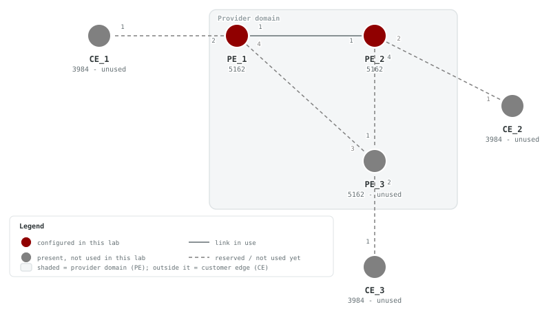
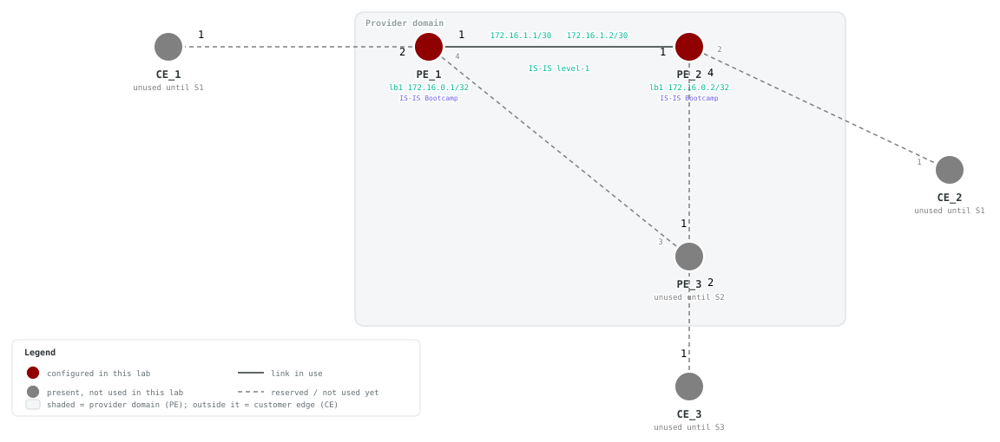

# F2 — IS-IS Routing

## Goals

Enable IS-IS routing between the two SAOS 10x nodes addressed in F1 so their loopbacks are reachable over the core link. By the end of this lab you will be able to:

- Create an IS-IS instance with a NET and add interfaces to it
- Observe which address families IS-IS advertises by default
- Enable the IPv6 address-family on IS-IS interfaces
- Secure the IS-IS adjacency with MD5 authentication
- Verify adjacencies, learned routes, and loopback-to-loopback reachability

## Topology





The physical topology already matches S2. CE_1, CE_2, PE_3, and their future
links are intentionally unused in F2, so the diagrams show them in gray. All
tasks and checks remain scoped to PE_1 and PE_2.

> **Resource note:** If you do not plan to continue into the Services track
> and your host is resource constrained, you may comment out CE_1, CE_2, PE_3,
> and every link except `[ "PE_1:1", "PE_2:1" ]` in your local
> `topo.clab.yml`.

See `topo.clab.svg` for the physical connectivity diagram, and
`topo.detail.svg` for the annotated view with addressing and IS-IS roles.

- **PE_1**: SAOS 5162, loopback 172.16.0.1/32
- **PE_2**: SAOS 5162, loopback 172.16.0.2/32
- **Link** (SAOS port 1): PE_1 port 1 ↔ PE_2 port 1, untagged

### IP Addressing

| Node | Interface | IPv4 | Prefix | IPv6 | Prefix |
|------|-----------|------|--------|------|--------|
| PE_1 | lb1 | 172.16.0.1 | /32 | FC00::1 | /128 |
| PE_1 | PE_1-PE_2-if | 172.16.1.1 | /30 | FC00::600 | /127 |
| PE_2 | lb1 | 172.16.0.2 | /32 | FC00::2 | /128 |
| PE_2 | PE_1-PE_2-if | 172.16.1.2 | /30 | FC00::601 | /127 |

> **SAOS display note:** SAOS displays IPv4 address and prefix-length as separate fields — you will not see CIDR notation such as `172.16.0.1/32` in device output. IPv6 addresses are shown fully expanded.

### NSAP Addresses

| Node | NET |
|------|-----|
| PE_1 | 49.0001.0172.0016.0001.00 |
| PE_2 | 49.0001.0172.0016.0002.00 |

The NET encodes: area `49.0001`, system ID derived from the loopback address, and NSEL `00`.

## Prerequisites

- Complete [F1 — IP Interfaces](../F1-Loopbacks-and-Interfaces/README.md), or deploy this lab with its included F1 baseline
- ContainerLab installed and accessible
- SAOS 10x image `vrnetlab/ciena_saos:10-12-00-0228` (release 10.12.00.0228) available in the container registry
- Activate the built-in trial license after deployment

## Startup Configs

The checkpoint baseline each node boots from. If you are assembling the lab by hand, create a `configs/` folder next to `topo.clab.yml` and copy each file into it before you deploy.

- [PE_1.cfg.partial](./configs/PE_1.cfg.partial)
- [PE_2.cfg.partial](./configs/PE_2.cfg.partial)
- [PE_3.cfg.partial](./configs/PE_3.cfg.partial)
- [CE_1.cfg.partial](./configs/CE_1.cfg.partial)
- [CE_2.cfg.partial](./configs/CE_2.cfg.partial)

## Deploy

### Start from checkpoint

```bash
LAB=F2-IS-IS-Routing
cd labs/${LAB}            # from the repo root, or cd into the unpacked directory
containerlab deploy -t topo.clab.yml
```

Equivalent invocation from the repo root:

```bash
containerlab deploy -t "labs/${LAB}/topo.clab.yml"
```

The lab topology (`topo.clab.yml`):

```yaml
name: F2-IS-IS-Routing
topology:
  defaults:
    kind: ciena_saos
    image: vrnetlab/ciena_saos:10-12-00-0228
    labels:
      lab-mode: hands-on
  nodes:
    PE_1:
      type: '5162'
      startup-config: configs/PE_1.cfg.partial
    PE_2:
      type: '5162'
      startup-config: configs/PE_2.cfg.partial
    PE_3:
      type: '5162'
      labels:
        lab-state: unused
      startup-config: configs/PE_3.cfg.partial
    CE_1:
      type: '3984'
      labels:
        lab-state: unused
      startup-config: configs/CE_1.cfg.partial
    CE_2:
      type: '3984'
      labels:
        lab-state: unused
      startup-config: configs/CE_2.cfg.partial
  links:
  - endpoints: [ "PE_1:1", "PE_2:1" ]
  - endpoints: [ "PE_1:2", "CE_1:1" ]
  - endpoints: [ "PE_2:2", "CE_2:1" ]
  - endpoints: [ "PE_2:4", "PE_3:1" ]
  - endpoints: [ "PE_1:4", "PE_3:3" ]
  - endpoints: [ "CE_2:2", "PE_3:2" ]
```

Wait for all five nodes to reach healthy state, then complete the F2 tasks on
PE_1 and PE_2:

```bash
ssh diag@clab-F2-IS-IS-Routing-PE_1
ssh diag@clab-F2-IS-IS-Routing-PE_2
```

Default credentials: `diag` / `ciena123`

## Instructions

<!-- task-index -->
- [Task 1: Survey the network before any routing protocol](#task-1)
- [Task 2: Create an IS-IS instance on PE_1 and add interfaces to it](#task-2)
- [Task 3: Create an IS-IS instance on PE_2 and add interfaces to it](#task-3)
- [Task 4: Observe IS-IS carrying IPv4 but not IPv6](#task-4)
- [Task 5: Confirm the IPv6 underlay addressing](#task-5)
- [Task 6: Add the ipv6 address-family to the IS-IS interfaces](#task-6)
- [Task 7: Confirm IPv6 reachability over IS-IS](#task-7)
- [Task 8: Add MD5 authentication to the IS-IS neighbor association](#task-8)

<a id="task-1"></a>
### Task 1: Survey the network before any routing protocol
<a href="#task-1" title="Direct link to this task (right-click to copy)">🔗</a>

<!-- prose: detailed -->

**Summary** — This lab starts where F1 finished: the routed underlay between
`PE_1` and `PE_2` is preloaded, but any routing protocol is deliberately
missing — each PE knows only its connected networks. Before configuring
anything, take stock. This baseline is what makes the effect of IS-IS
visible later.

**Implementation** — Nothing to configure yet: look at each router's IP
route table and try reaching the far side. The preloaded pieces are the
`PE_1-PE_2-FD` forwarding domain, the `PE_1-PE_2-FP` flow point on the link
port, the routed interface `PE_1-PE_2-if` (`172.16.1.1/30` and
`172.16.1.2/30`), and the `lb1` loopbacks (`172.16.0.1/32`,
`172.16.0.2/32`), each also carrying IPv6 addresses.

<!-- verify-prose -->

Expect the route table on each PE to hold only connected entries (its own
`lb1` /32 and the `172.16.1.0/30` link) plus management routes — nothing
learned from a protocol. A ping across the link to the neighbor's
`172.16.1.x` address should work: that subnet is directly connected. A ping
to the far loopback (`172.16.0.2` from `PE_1`) should fail — can you explain
why one works and the other doesn't? Which single fact in the route table
predicts both outcomes?

<a id="task-2"></a>
### Task 2: Create an IS-IS instance on PE_1 and add interfaces to it
<a href="#task-2" title="Direct link to this task (right-click to copy)">🔗</a>

<!-- prose: in-depth -->

**Summary** — Now layer the first IGP onto that underlay. On `PE_1`, create
an IS-IS instance named `Bootcamp`, restricted to level-1, with the NET
`49.0001.0172.0016.0001.00`, then add two interfaces to it.

**Background** — Read the NET right to left: `00` is the NSAP selector
(always zero on a router), `0172.0016.0001` is the system ID — the loopback
`172.16.0.1` with each octet zero-padded to three digits and regrouped in
fours — and what remains, `49.0001`, is the area (AFI `49` means private
addressing). Deriving the system ID from `lb1` gives every router a unique,
self-documenting identity.

**Implementation** — Create the instance, then join both interfaces as
point-to-point: `PE_1-PE_2-if`, pinned to level-1, is where hellos will
actually be exchanged; joining `lb1` is what injects the `172.16.0.1/32`
prefix into IS-IS so other routers can learn a path to it — exactly the
reachability F1 lacked.

**Configure** (config mode) on **PE_1**:

```saos-config
isis instance Bootcamp level-type level-1 net 49.0001.0172.0016.0001.00
isis instance Bootcamp interfaces interface lb1 interface-type point-to-point
isis instance Bootcamp interfaces interface PE_1-PE_2-if interface-type point-to-point level-type level-1
```

<!-- verify-prose -->

The IS-IS summary should show Instance `Bootcamp` and Level Type `level-1`.
Note the SAOS display convention: the NET you configured never appears as
one string — it is decomposed into a System ID field (`0172.0016.0001`) and
an Area Ids field (`49.0001`). Confirm both interfaces are listed,
`PE_1-PE_2-if` as point-to-point level-1. Don't expect a neighbor yet —
`PE_2` is not running IS-IS until the next task, so who would answer the
hellos?

**Verify** (show mode) on **PE_1**:

```saos-show
show isis summary
```

Pass: Output contains `Bootcamp` and `level-1` and `0172.0016.0001` and `49.0001`

<details><summary>Example output</summary>

```
+------------------------ ISIS SUMMARY -----------------------+
| Name                                      |           Value |
+-------------------------------------------+-----------------+
| Instance                                  |        Bootcamp |
| Level Type                                |         level-1 |
| System ID                                 |  0172.0016.0001 |
| Area Ids                                  |         49.0001 |
| Topology Type                             | Single-Topology |
| Dynamic Hostname                          |           False |
| Transition                                |           False |
| Level 1                                   |                 |
|   Authentication                          |        Disabled |
|   Authentication Type                     |               - |
|   Authentication Send Only                |           False |
|   Level Restarting                        |           False |
|   Configured T2 Restart Timer (Seconds)   |              60 |
|   Remaining T2 Restart Timer (Seconds)    |               0 |
|   Minimum LSP Generation Interval (ms)    |             100 |
|   Maximum LSP Generation Interval (ms)    |           10000 |
| Level 2                                   |                 |
|   Authentication                          |        Disabled |
|   Authentication Type                     |               - |
|   Authentication Send Only                |           False |
|   Level Restarting                        |           False |
|   Configured T2 Restart Timer (Seconds)   |              60 |
|   Remaining T2 Restart Timer (Seconds)    |               0 |
|   Minimum LSP Generation Interval (ms)    |             100 |
|   Maximum LSP Generation Interval (ms)    |           10000 |
| MPLS-TE                                   |  Not Configured |
| Segment Routing                           |        Disabled |
| Microloop Avoidance                       |        Disabled |
| Graceful Restart                          |        Disabled |
| Graceful Restart Helper                   |         Enabled |
| Node Restarting                           |           False |
| Configured T3 Grace Period (Seconds)      |           65535 |
| Remaining T3 Grace Period (Seconds)       |               0 |
| Interfaces                                |                 |
|                                           |                 |
|   Interface Name                          |    PE_1-PE_2-if |
|     Interface Type                        |  point-to-point |
|     Level Type                            |         level-1 |
|     Passive Interface                     |           False |
|     IPv4 Unicast                          |            True |
|     IPv6 Unicast                          |            True |
|     Level 1                               |                 |
|       Authentication                      |         Enabled |
|       Authentication Type                 |        HMAC-MD5 |
|       Authentication Send Only            |           False |
|       Metric                              |              10 |
|       Wide Metric                         |              10 |
|       Admin Tag                           |               - |
|       T1 Restart Hello Interval (Seconds) |               3 |
|       Restart Request (RR) Sent           |               0 |
|       Restart Acknowledge (RA) Received   |               0 |
|       Restart Request (RR) Received       |               0 |
|       Restart Acknowledge (RA) Sent       |               0 |
|     Level 2                               |                 |
|       Authentication                      |         Enabled |
|       Authentication Type                 |        HMAC-MD5 |
|       Authentication Send Only            |           False |
|       Metric                              |              10 |
|       Wide Metric                         |              10 |
|       Admin Tag                           |               - |
|       T1 Restart Hello Interval (Seconds) |               3 |
|       Restart Request (RR) Sent           |               0 |
|       Restart Acknowledge (RA) Received   |               0 |
|       Restart Request (RR) Received       |               0 |
|       Restart Acknowledge (RA) Sent       |               0 |
|                                           |                 |
|   Interface Name                          |             lb1 |
|     Interface Type                        |  point-to-point |
|     Level Type                            |       level-1-2 |
|     Passive Interface                     |           False |
|     IPv4 Unicast                          |            True |
|     IPv6 Unicast                          |            True |
|     Level 1                               |                 |
|       Authentication                      |        Disabled |
|       Authentication Type                 |               - |
|       Authentication Send Only            |           False |
|       Metric                              |              10 |
|       Wide Metric                         |              10 |
|       Admin Tag                           |               - |
|       T1 Restart Hello Interval (Seconds) |               3 |
|       Restart Request (RR) Sent           |               0 |
|       Restart Acknowledge (RA) Received   |               0 |
|       Restart Request (RR) Received       |               0 |
|       Restart Acknowledge (RA) Sent       |               0 |
|     Level 2                               |                 |
|       Authentication                      |        Disabled |
|       Authentication Type                 |               - |
|       Authentication Send Only            |           False |
|       Metric                              |              10 |
|       Wide Metric                         |              10 |
|       Admin Tag                           |               - |
|       T1 Restart Hello Interval (Seconds) |               3 |
|       Restart Request (RR) Sent           |               0 |
|       Restart Acknowledge (RA) Received   |               0 |
|       Restart Request (RR) Received       |               0 |
|       Restart Acknowledge (RA) Sent       |               0 |
+-------------------------------------------+-----------------+
```

</details>

<a id="task-3"></a>
### Task 3: Create an IS-IS instance on PE_2 and add interfaces to it
<a href="#task-3" title="Direct link to this task (right-click to copy)">🔗</a>

<!-- prose: simple -->

Mirror Task 2 on `PE_2` — the area must match (level-1 adjacencies only form
within a common area) while the system ID derives from its own loopback.
Only the values change:

- NET: `49.0001.0172.0016.0002.00` (from `172.16.0.2`)
- interfaces: `lb1` and `PE_1-PE_2-if`, added the same way

**Configure** (config mode) on **PE_2**:

```saos-config
isis instance Bootcamp level-type level-1 net 49.0001.0172.0016.0002.00
isis instance Bootcamp interfaces interface lb1 interface-type point-to-point
isis instance Bootcamp interfaces interface PE_1-PE_2-if interface-type point-to-point level-type level-1
```

<!-- verify-prose -->

The moment both ends run IS-IS on the shared link, hellos meet, the
point-to-point adjacency forms, and each router floods a link-state PDU
describing its prefixes — including the loopback /32s. On each PE the
neighbor view should show a `P2P` adjacency of type `L1` in
state `Up`, identifying the peer by system ID (`0172.0016.0002` seen from
`PE_1`). Then check the payoff in the route table: `PE_1` should learn
`172.16.0.2/32` as an IS-IS level-1 route with next hop `172.16.1.2` via
`PE_1-PE_2-if`, and `PE_2` the mirror image. A loopback-to-loopback ping
should now succeed — the exact test that failed in Task 1. Which configured
line caused the /32 to be advertised at all?

**Verify** (show mode) on **PE_2**:

```saos-show
show isis summary
```

Pass: Output contains `Bootcamp` and `level-1` and `0172.0016.0002` and `49.0001`

<details><summary>Example output</summary>

```
+------------------------ ISIS SUMMARY -----------------------+
| Name                                      |           Value |
+-------------------------------------------+-----------------+
| Instance                                  |        Bootcamp |
| Level Type                                |         level-1 |
| System ID                                 |  0172.0016.0002 |
| Area Ids                                  |         49.0001 |
| Topology Type                             | Single-Topology |
| Dynamic Hostname                          |           False |
| Transition                                |           False |
| Level 1                                   |                 |
|   Authentication                          |        Disabled |
|   Authentication Type                     |               - |
|   Authentication Send Only                |           False |
|   Level Restarting                        |           False |
|   Configured T2 Restart Timer (Seconds)   |              60 |
|   Remaining T2 Restart Timer (Seconds)    |               0 |
|   Minimum LSP Generation Interval (ms)    |             100 |
|   Maximum LSP Generation Interval (ms)    |           10000 |
| Level 2                                   |                 |
|   Authentication                          |        Disabled |
|   Authentication Type                     |               - |
|   Authentication Send Only                |           False |
|   Level Restarting                        |           False |
|   Configured T2 Restart Timer (Seconds)   |              60 |
|   Remaining T2 Restart Timer (Seconds)    |               0 |
|   Minimum LSP Generation Interval (ms)    |             100 |
|   Maximum LSP Generation Interval (ms)    |           10000 |
| MPLS-TE                                   |  Not Configured |
| Segment Routing                           |        Disabled |
| Microloop Avoidance                       |        Disabled |
| Graceful Restart                          |        Disabled |
| Graceful Restart Helper                   |         Enabled |
| Node Restarting                           |           False |
| Configured T3 Grace Period (Seconds)      |           65535 |
| Remaining T3 Grace Period (Seconds)       |               0 |
| Interfaces                                |                 |
|                                           |                 |
|   Interface Name                          |    PE_1-PE_2-if |
|     Interface Type                        |  point-to-point |
|     Level Type                            |         level-1 |
|     Passive Interface                     |           False |
|     IPv4 Unicast                          |            True |
|     IPv6 Unicast                          |            True |
|     Level 1                               |                 |
|       Authentication                      |         Enabled |
|       Authentication Type                 |        HMAC-MD5 |
|       Authentication Send Only            |           False |
|       Metric                              |              10 |
|       Wide Metric                         |              10 |
|       Admin Tag                           |               - |
|       T1 Restart Hello Interval (Seconds) |               3 |
|       Restart Request (RR) Sent           |               0 |
|       Restart Acknowledge (RA) Received   |               0 |
|       Restart Request (RR) Received       |               0 |
|       Restart Acknowledge (RA) Sent       |               0 |
|     Level 2                               |                 |
|       Authentication                      |         Enabled |
|       Authentication Type                 |        HMAC-MD5 |
|       Authentication Send Only            |           False |
|       Metric                              |              10 |
|       Wide Metric                         |              10 |
|       Admin Tag                           |               - |
|       T1 Restart Hello Interval (Seconds) |               3 |
|       Restart Request (RR) Sent           |               0 |
|       Restart Acknowledge (RA) Received   |               0 |
|       Restart Request (RR) Received       |               0 |
|       Restart Acknowledge (RA) Sent       |               0 |
|                                           |                 |
|   Interface Name                          |             lb1 |
|     Interface Type                        |  point-to-point |
|     Level Type                            |       level-1-2 |
|     Passive Interface                     |           False |
|     IPv4 Unicast                          |            True |
|     IPv6 Unicast                          |            True |
|     Level 1                               |                 |
|       Authentication                      |        Disabled |
|       Authentication Type                 |               - |
|       Authentication Send Only            |           False |
|       Metric                              |              10 |
|       Wide Metric                         |              10 |
|       Admin Tag                           |               - |
|       T1 Restart Hello Interval (Seconds) |               3 |
|       Restart Request (RR) Sent           |               0 |
|       Restart Acknowledge (RA) Received   |               0 |
|       Restart Request (RR) Received       |               0 |
|       Restart Acknowledge (RA) Sent       |               0 |
|     Level 2                               |                 |
|       Authentication                      |        Disabled |
|       Authentication Type                 |               - |
|       Authentication Send Only            |           False |
|       Metric                              |              10 |
|       Wide Metric                         |              10 |
|       Admin Tag                           |               - |
|       T1 Restart Hello Interval (Seconds) |               3 |
|       Restart Request (RR) Sent           |               0 |
|       Restart Acknowledge (RA) Received   |               0 |
|       Restart Request (RR) Received       |               0 |
|       Restart Acknowledge (RA) Sent       |               0 |
+-------------------------------------------+-----------------+
```

</details>

<!-- retry: 90s -->
**Verify** (show mode) on **PE_1**:

```saos-show
show isis neighbors
```

Pass: Output contains `0172.0016.0002` and `PE_1-PE_2-if` and `Up`

<details><summary>Example output</summary>

```
+-------------------------------------- ISIS NEIGHBOR STATE: Bootcamp ---------------------------------------+
| Neighbor |                        |                  |                |       |   Hold   |      |          |
|   Type   |       System ID        |    Interface     |      SNPA      | State | Time (s) | Type | Protocol |
+----------+------------------------+------------------+----------------+-------+----------+------+----------+
|   P2P    |     0172.0016.0002     |   PE_1-PE_2-if   | 0c00.e1d6.83f6 |    Up |       23 |  L1  |  IS-IS   |
+----------+------------------------+------------------+----------------+-------+----------+------+----------+
```

</details>

<!-- retry: 90s -->
**Verify** (show mode) on **PE_2**:

```saos-show
show isis neighbors
```

Pass: Output contains `0172.0016.0001` and `PE_1-PE_2-if` and `Up`

<details><summary>Example output</summary>

```
+-------------------------------------- ISIS NEIGHBOR STATE: Bootcamp ---------------------------------------+
| Neighbor |                        |                  |                |       |   Hold   |      |          |
|   Type   |       System ID        |    Interface     |      SNPA      | State | Time (s) | Type | Protocol |
+----------+------------------------+------------------+----------------+-------+----------+------+----------+
|   P2P    |     0172.0016.0001     |   PE_1-PE_2-if   | 0c00.2f0f.4af6 |    Up |       22 |  L1  |  IS-IS   |
+----------+------------------------+------------------+----------------+-------+----------+------+----------+
```

</details>

<!-- retry: 90s -->
**Verify** (show mode) on **PE_1**:

```saos-show
show ip routes
```

Pass: Output contains `172.16.0.2/32` and `172.16.1.2`

<details><summary>Example output</summary>

```
+---------------------------------------------------------------------------------------+
| Codes: K - kernel, C - connected, S - static, B - BGP, O - OSPF, IA - OSPF inter area |
|        E1 - OSPF external type 1, E2 - OSPF external type 2                           |
|        I - IS-IS, L1 - IS-IS level-1, L2 - IS-IS level-2, ia - IS-IS inter area       |
|        N1 - OSPF NSSA external type 1, N2 - OSPF NSSA external type 2                 |
|        M - MPLS                                                                       |
|        > - selected route, * - FIB route, ~ - Anycast Prefix                          |
|        S/T - Sub Type, RP/M - Route Preference/Metric                                 |
+---------------------------------------------------------------------------------------+
+------------------------------------------------------------------------------- RIB STATE: default -------------------------------------------------------------------------------+
|       |      |     |                  |                    |           |                 |                           | Recursive...                                | Last Update |
| State | Type | S/T | Instance         | Destination        | RP/M      | Next Hop        | Interface                 | Next Hop        | Interface                 | (hh:mm:ss)  |
+-------+------+-----+------------------+--------------------+-----------+-----------------+---------------------------+-----------------+---------------------------+-------------+
| *>    |  K   |  -  | -                | 0.0.0.0/0          | [254/0]   | 10.0.0.2        | mgmtbr0                   | -               | -                         | -           |
| *>    |  C   |  -  | -                | 10.0.0.0/24        | [0/0]     | -               | mgmtbr0                   | -               | -                         | -           |
| *>    |  C   |  -  | -                | 172.16.0.1/32      | [0/0]     | -               | lb1                       | -               | -                         | -           |
| *>    |  I   |  L1 | Bootcamp         | 172.16.0.2/32      | [115/20]  | 172.16.1.2      | PE_1-PE_2-if              | -               | -                         | 00:00:56    |
| *>    |  C   |  -  | -                | 172.16.1.0/30      | [0/0]     | -               | PE_1-PE_2-if              | -               | -                         | -           |
+-------+------+-----+------------------+--------------------+-----------+-----------------+---------------------------+-----------------+---------------------------+-------------+
```

</details>

<!-- retry: 90s -->
**Verify** (show mode) on **PE_1**:

```saos-show
ping ip destination 172.16.0.2 source 172.16.0.1 repeat-count 3
```

Pass: Output contains `100.00 percent`

<details><summary>Example output</summary>

```
Sending 3 ICMP Echos to 172.16.0.2, timeout is 1 second

Codes: 
'!' - Success, 'Q' - Request not sent, '.' - Timeout 

 Type 'Ctrl+C' to abort

! seq_num = 1  RTT = 2.58 ms  TTL = 255
! seq_num = 2  RTT = 1.73 ms  TTL = 255
! seq_num = 3  RTT = 2.33 ms  TTL = 255
Success Rate is 100.00 percent (3/3)
Round-trip min/avg/max = 1.73/2.21/2.58
```

</details>

<!-- retry: 90s -->
**Verify** (show mode) on **PE_2**:

```saos-show
show ip routes
```

Pass: Output contains `172.16.0.1/32` and `172.16.1.1`

<details><summary>Example output</summary>

```
+---------------------------------------------------------------------------------------+
| Codes: K - kernel, C - connected, S - static, B - BGP, O - OSPF, IA - OSPF inter area |
|        E1 - OSPF external type 1, E2 - OSPF external type 2                           |
|        I - IS-IS, L1 - IS-IS level-1, L2 - IS-IS level-2, ia - IS-IS inter area       |
|        N1 - OSPF NSSA external type 1, N2 - OSPF NSSA external type 2                 |
|        M - MPLS                                                                       |
|        > - selected route, * - FIB route, ~ - Anycast Prefix                          |
|        S/T - Sub Type, RP/M - Route Preference/Metric                                 |
+---------------------------------------------------------------------------------------+
+------------------------------------------------------------------------------- RIB STATE: default -------------------------------------------------------------------------------+
|       |      |     |                  |                    |           |                 |                           | Recursive...                                | Last Update |
| State | Type | S/T | Instance         | Destination        | RP/M      | Next Hop        | Interface                 | Next Hop        | Interface                 | (hh:mm:ss)  |
+-------+------+-----+------------------+--------------------+-----------+-----------------+---------------------------+-----------------+---------------------------+-------------+
| *>    |  K   |  -  | -                | 0.0.0.0/0          | [254/0]   | 10.0.0.2        | mgmtbr0                   | -               | -                         | -           |
| *>    |  C   |  -  | -                | 10.0.0.0/24        | [0/0]     | -               | mgmtbr0                   | -               | -                         | -           |
| *>    |  I   |  L1 | Bootcamp         | 172.16.0.1/32      | [115/20]  | 172.16.1.1      | PE_1-PE_2-if              | -               | -                         | 00:00:40    |
| *>    |  C   |  -  | -                | 172.16.0.2/32      | [0/0]     | -               | lb1                       | -               | -                         | -           |
| *>    |  C   |  -  | -                | 172.16.1.0/30      | [0/0]     | -               | PE_1-PE_2-if              | -               | -                         | -           |
+-------+------+-----+------------------+--------------------+-----------+-----------------+---------------------------+-----------------+---------------------------+-------------+
```

</details>

<!-- retry: 90s -->
**Verify** (show mode) on **PE_2**:

```saos-show
ping ip destination 172.16.0.1 source 172.16.0.2 repeat-count 3
```

Pass: Output contains `100.00 percent`

<details><summary>Example output</summary>

```
Sending 3 ICMP Echos to 172.16.0.1, timeout is 1 second

Codes: 
'!' - Success, 'Q' - Request not sent, '.' - Timeout 

 Type 'Ctrl+C' to abort

! seq_num = 1  RTT = 3.31 ms  TTL = 255
! seq_num = 2  RTT = 1.93 ms  TTL = 255
! seq_num = 3  RTT = 2.03 ms  TTL = 255
Success Rate is 100.00 percent (3/3)
Round-trip min/avg/max = 1.93/2.42/3.31
```

</details>

<a id="task-4"></a>
### Task 4: Observe IS-IS carrying IPv4 but not IPv6
<a href="#task-4" title="Direct link to this task (right-click to copy)">🔗</a>

<!-- prose: detailed -->

**Summary** — Pause and survey the network again, the way you did in Task 1,
before touching IPv6. IS-IS is now exchanging IPv4 reachability: the
loopbacks appear in each other's route tables and respond to ping. But the
F1 underlay also gave every interface an IPv6 address — `lb1` has
`FC00::1/128` and `FC00::2/128`, and the link carries the `FC00::600/127`
pair.

**Implementation** — Nothing to configure: ask yourself what the IS-IS
instance you just built is actually carrying. Did adding an interface to the
instance say anything about which address families it advertises?

<!-- verify-prose -->

Expect a split picture: IPv4 loopback-to-loopback pings succeed, but a ping
from `PE_1` to `FC00::2` should still fail. The adjacency is up, the
interfaces have IPv6 addresses — so what is missing? Predict the answer
before moving on: reachability requires not just a neighbor, but a protocol
willing to exchange routes for that address family.

<a id="task-5"></a>
### Task 5: Confirm the IPv6 underlay addressing
<a href="#task-5" title="Direct link to this task (right-click to copy)">🔗</a>

<!-- prose: detailed -->

**Summary** — Confirm the IPv6 side of the underlay is genuinely in place
before blaming it. This is a diagnostic habit worth building: separate "the
address is missing" from "the route is missing" — they fail identically from
ping's point of view but have different fixes.

**Implementation** — On each PE, inspect the interface addressing: `lb1`
should carry its /128 (`FC00::1` on `PE_1`, `FC00::2` on `PE_2`) and
`PE_1-PE_2-if` its half of the /127 point-to-point pair (`FC00::600` and
`FC00::601`).

<!-- verify-prose -->

Expect the addresses to all be present — they were preloaded from F1. A ping
across the link to the neighbor's /127 address (`FC00::601` from `PE_1`)
should work, since that prefix is directly connected. The remote loopback
/128 should remain unreachable: nothing advertises it yet. If both facts
hold, you've isolated the problem to route exchange, which the next task
fixes.

<a id="task-6"></a>
### Task 6: Add the ipv6 address-family to the IS-IS interfaces
<a href="#task-6" title="Direct link to this task (right-click to copy)">🔗</a>

<!-- prose: in-depth -->

**Summary** — Teach IS-IS to carry IPv6. On both PEs, enable the `ipv6`
unicast address family on each IS-IS interface — `lb1` and `PE_1-PE_2-if`.

**Background** — This is the integrated-IS-IS advantage: IS-IS is not an IP
protocol underneath (it runs directly over the link layer), so the same
instance, same adjacency, and same flooding can announce IPv4 and IPv6
prefixes side by side — no second protocol, no second neighbor relationship.

**Implementation** — Add the `ipv6` unicast family to both interfaces
inside instance `Bootcamp`, on both PEs. Enabling the family on `lb1` is
what injects `FC00::1/128` and `FC00::2/128` into the level-1 database.

**Configure** (config mode) on **PE_1**:

```saos-config
isis instance Bootcamp interfaces interface lb1 address-families address-family ipv6 unicast
isis instance Bootcamp interfaces interface PE_1-PE_2-if address-families address-family ipv6 unicast
```

**Configure** (config mode) on **PE_2**:

```saos-config
isis instance Bootcamp interfaces interface lb1 address-families address-family ipv6 unicast
isis instance Bootcamp interfaces interface PE_1-PE_2-if address-families address-family ipv6 unicast
```

<!-- verify-prose -->

The IS-IS interface state on each PE should now list an IPv6 address
alongside the IPv4 address for both `PE_1-PE_2-if` and `lb1`, while the
adjacency itself is unchanged — same instance, broader payload. The decisive
test is the one that failed before: `PE_1` pinging `FC00::2` and `PE_2`
pinging `FC00::1` should both succeed. Notice the adjacency count didn't
change — why did no new neighbor relationship need to form for IPv6 to start
working?

**Verify** (show mode) on **PE_1**:

```saos-show
show isis interfaces
```

Pass: Output contains `PE_1-PE_2-if` and `lb1` and `IPv6`

<details><summary>Example output</summary>

```
+------------------------ ISIS INTERFACE STATE -----------------------+
| Name                             |                            Value |
+----------------------------------+----------------------------------+
| Interface                        |                     PE_1-PE_2-if |
| Routing Protocol                 |                  ISIS (Bootcamp) |
| Network Type                     |                   Point-to-Point |
| Circuit Type                     |                          level-1 |
| Local Circuit ID                 |                               02 |
| Extended Local Circuit ID        |                         3FFFD8F2 |
| Local SNPA                       |                                - |
| Hello Padding                    |                             True |
| LDP IGP SYNC Status              |                   Not Configured |
| IP Interface Address(es)         |                    172.16.1.1/30 |
| IPv6 Interface Address(es)       |                    fc00::600/127 |
|                                  |      fe80::e00:2fff:fe0f:4af6/64 |
| Level Index                      |                          level-1 |
|    Circuit ID                    |                0172.0016.0001.02 |
|    Active Adjacencies            |                                1 |
|    LSP MTU                       |                             1492 |
|    Metric (Narrow/Wide)          |                            10/10 |
|    Admin Tag                     |                                - |
|    Protocol Oper State           |                               up |
|    Next Hello                    |                        5 seconds |
|    Hello Interval                |                       10 seconds |
|    Hello Multiplier              |                                3 |
|    Authentication                |                              MD5 |
|   Password                       |                             **** |
| BFD                              |                         Disabled |
| BFD IPv6                         |                         Disabled |
+----------------------------------+----------------------------------+
| Interface                        |                              lb1 |
| Routing Protocol                 |                  ISIS (Bootcamp) |
| Network Type                     |                   Point-to-Point |
| Circuit Type                     |                        level-1-2 |
| Local Circuit ID                 |                               01 |
| Extended Local Circuit ID        |                         3FFFE8F5 |
| Local SNPA                       |                                - |
| Hello Padding                    |                             True |
| LDP IGP SYNC Status              |                   Not Configured |
| IP Interface Address(es)         |                    172.16.0.1/32 |
| IPv6 Interface Address(es)       |                      fc00::1/128 |
|                                  |      fe80::e00:2fff:fe0f:4af6/64 |
| Level Index                      |                          level-1 |
|    Circuit ID                    |                0172.0016.0001.01 |
|    Active Adjacencies            |                                0 |
|    LSP MTU                       |                             1492 |
|    Metric (Narrow/Wide)          |                            10/10 |
|    Admin Tag                     |                                - |
|    Protocol Oper State           |                               up |
|    Next Hello                    |                        0 seconds |
|    Hello Interval                |                       10 seconds |
|    Hello Multiplier              |                                3 |
|    Authentication                |                          Not Set |
| BFD                              |                         Disabled |
| BFD IPv6                         |                         Disabled |
+----------------------------------+----------------------------------+
```

</details>

**Verify** (show mode) on **PE_2**:

```saos-show
show isis interfaces
```

Pass: Output contains `PE_1-PE_2-if` and `lb1` and `IPv6`

<details><summary>Example output</summary>

```
+------------------------ ISIS INTERFACE STATE -----------------------+
| Name                             |                            Value |
+----------------------------------+----------------------------------+
| Interface                        |                     PE_1-PE_2-if |
| Routing Protocol                 |                  ISIS (Bootcamp) |
| Network Type                     |                   Point-to-Point |
| Circuit Type                     |                          level-1 |
| Local Circuit ID                 |                               02 |
| Extended Local Circuit ID        |                         3FFFD8F2 |
| Local SNPA                       |                                - |
| Hello Padding                    |                             True |
| LDP IGP SYNC Status              |                   Not Configured |
| IP Interface Address(es)         |                    172.16.1.2/30 |
| IPv6 Interface Address(es)       |                    fc00::601/127 |
|                                  |      fe80::e00:e1ff:fed6:83f6/64 |
| Level Index                      |                          level-1 |
|    Circuit ID                    |                0172.0016.0002.02 |
|    Active Adjacencies            |                                1 |
|    LSP MTU                       |                             1492 |
|    Metric (Narrow/Wide)          |                            10/10 |
|    Admin Tag                     |                                - |
|    Protocol Oper State           |                               up |
|    Next Hello                    |                        6 seconds |
|    Hello Interval                |                       10 seconds |
|    Hello Multiplier              |                                3 |
|    Authentication                |                              MD5 |
|   Password                       |                             **** |
| BFD                              |                         Disabled |
| BFD IPv6                         |                         Disabled |
+----------------------------------+----------------------------------+
| Interface                        |                              lb1 |
| Routing Protocol                 |                  ISIS (Bootcamp) |
| Network Type                     |                   Point-to-Point |
| Circuit Type                     |                        level-1-2 |
| Local Circuit ID                 |                               01 |
| Extended Local Circuit ID        |                         3FFFE8F5 |
| Local SNPA                       |                                - |
| Hello Padding                    |                             True |
| LDP IGP SYNC Status              |                   Not Configured |
| IP Interface Address(es)         |                    172.16.0.2/32 |
| IPv6 Interface Address(es)       |                      fc00::2/128 |
|                                  |      fe80::e00:e1ff:fed6:83f6/64 |
| Level Index                      |                          level-1 |
|    Circuit ID                    |                0172.0016.0002.01 |
|    Active Adjacencies            |                                0 |
|    LSP MTU                       |                             1492 |
|    Metric (Narrow/Wide)          |                            10/10 |
|    Admin Tag                     |                                - |
|    Protocol Oper State           |                               up |
|    Next Hello                    |                        0 seconds |
|    Hello Interval                |                       10 seconds |
|    Hello Multiplier              |                                3 |
|    Authentication                |                          Not Set |
| BFD                              |                         Disabled |
| BFD IPv6                         |                         Disabled |
+----------------------------------+----------------------------------+
```

</details>

<!-- retry: 90s -->
**Verify** (show mode) on **PE_1**:

```saos-show
ping ip destination FC00::2 source FC00::1 repeat-count 3
```

Pass: Output contains `100.00 percent`

<details><summary>Example output</summary>

```
Sending 3 ICMP Echos to FC00::2, timeout is 1 second

Codes: 
'!' - Success, 'Q' - Request not sent, '.' - Timeout 

 Type 'Ctrl+C' to abort

! seq_num = 1  RTT = 1.87 ms  TTL = 255
! seq_num = 2  RTT = 1.82 ms  TTL = 255
! seq_num = 3  RTT = 2.05 ms  TTL = 255
Success Rate is 100.00 percent (3/3)
Round-trip min/avg/max = 1.82/1.91/2.05
```

</details>

<!-- retry: 90s -->
**Verify** (show mode) on **PE_2**:

```saos-show
ping ip destination FC00::1 source FC00::2 repeat-count 3
```

Pass: Output contains `100.00 percent`

<details><summary>Example output</summary>

```
Sending 3 ICMP Echos to FC00::1, timeout is 1 second

Codes: 
'!' - Success, 'Q' - Request not sent, '.' - Timeout 

 Type 'Ctrl+C' to abort

! seq_num = 1  RTT = 1.61 ms  TTL = 255
! seq_num = 2  RTT = 2.37 ms  TTL = 255
! seq_num = 3  RTT = 1.74 ms  TTL = 255
Success Rate is 100.00 percent (3/3)
Round-trip min/avg/max = 1.61/1.91/2.37
```

</details>

<a id="task-7"></a>
### Task 7: Confirm IPv6 reachability over IS-IS
<a href="#task-7" title="Direct link to this task (right-click to copy)">🔗</a>

<!-- prose: simple -->

Repeat the Task 5 confirmation now that the `ipv6` address family is active
— the addresses are unchanged; only what IS-IS advertises changed.
Re-running an identical check after a one-line change ties the symptom
(loopback unreachable) to its exact cause (the missing address family).

<!-- verify-prose -->

Expect the remote loopback pings that failed in Task 5 to succeed now, with
the on-link /127 behavior unchanged. If you inspect the IPv6 routing
information, expect the far /128 loopbacks to appear as IS-IS-learned
entries. One question to close the loop: of the three ingredients — address,
adjacency, address family — which two were already present in Task 5, and
how did your checks there prove it?

<a id="task-8"></a>
### Task 8: Add MD5 authentication to the IS-IS neighbor association
<a href="#task-8" title="Direct link to this task (right-click to copy)">🔗</a>

<!-- prose: in-depth -->

**Summary** — Finally, protect the neighbor relationship. On `PE_1-PE_2-if`
on both PEs, configure a level-1 authentication password (`ciena123` — it
must match exactly on both ends).

**Background** — SAOS applies it as HMAC-MD5: each hello carries a hash
computed from the packet and the shared secret, and a receiver discards
hellos whose hash it cannot reproduce, so a rogue or misconfigured device
cannot join the area over this link. The password attaches to the interface
at level-1 because that is where this adjacency lives; `lb1` needs none —
no hellos are exchanged with anyone there.

**Implementation** — One password line per PE, on the link interface. Worth
watching in real time: configure `PE_1` first and pause — `show isis
neighbors` and the route table will show the adjacency and its learned
routes drop, because authenticated and unauthenticated hellos reject each
other. Configure `PE_2` and watch both return.

**Configure** (config mode) on **PE_1**:

```saos-config
isis instance Bootcamp interfaces interface PE_1-PE_2-if level-1 password ciena123
```

**Configure** (config mode) on **PE_2**:

```saos-config
isis instance Bootcamp interfaces interface PE_1-PE_2-if level-1 password ciena123
```

<!-- verify-prose -->

The IS-IS interface state on `PE_1-PE_2-if` should report level-1
authentication as `MD5` — the secret itself is never shown in readable form,
on this or any well-behaved platform. That means you cannot verify
authentication by reading it back; you prove it by its effect: with matching
passwords the adjacency should return to `Up` on both PEs, and the IPv4 and
IPv6 loopback pings should still succeed. What would you expect the neighbor
table to show if the two passwords differed — and how would that differ from
the link simply being down?

<!-- retry: 90s -->
**Verify** (show mode) on **PE_1**:

```saos-show
show isis interfaces
```

Pass: Output contains `PE_1-PE_2-if` and `level-1` and `MD5`

<details><summary>Example output</summary>

```
+------------------------ ISIS INTERFACE STATE -----------------------+
| Name                             |                            Value |
+----------------------------------+----------------------------------+
| Interface                        |                     PE_1-PE_2-if |
| Routing Protocol                 |                  ISIS (Bootcamp) |
| Network Type                     |                   Point-to-Point |
| Circuit Type                     |                          level-1 |
| Local Circuit ID                 |                               02 |
| Extended Local Circuit ID        |                         3FFFD8F2 |
| Local SNPA                       |                                - |
| Hello Padding                    |                             True |
| LDP IGP SYNC Status              |                   Not Configured |
| IP Interface Address(es)         |                    172.16.1.1/30 |
| IPv6 Interface Address(es)       |                    fc00::600/127 |
|                                  |      fe80::e00:2fff:fe0f:4af6/64 |
| Level Index                      |                          level-1 |
|    Circuit ID                    |                0172.0016.0001.02 |
|    Active Adjacencies            |                                1 |
|    LSP MTU                       |                             1492 |
|    Metric (Narrow/Wide)          |                            10/10 |
|    Admin Tag                     |                                - |
|    Protocol Oper State           |                               up |
|    Next Hello                    |                        8 seconds |
|    Hello Interval                |                       10 seconds |
|    Hello Multiplier              |                                3 |
|    Authentication                |                              MD5 |
|   Password                       |                             **** |
| BFD                              |                         Disabled |
| BFD IPv6                         |                         Disabled |
+----------------------------------+----------------------------------+
| Interface                        |                              lb1 |
| Routing Protocol                 |                  ISIS (Bootcamp) |
| Network Type                     |                   Point-to-Point |
| Circuit Type                     |                        level-1-2 |
| Local Circuit ID                 |                               01 |
| Extended Local Circuit ID        |                         3FFFE8F5 |
| Local SNPA                       |                                - |
| Hello Padding                    |                             True |
| LDP IGP SYNC Status              |                   Not Configured |
| IP Interface Address(es)         |                    172.16.0.1/32 |
| IPv6 Interface Address(es)       |                      fc00::1/128 |
|                                  |      fe80::e00:2fff:fe0f:4af6/64 |
| Level Index                      |                          level-1 |
|    Circuit ID                    |                0172.0016.0001.01 |
|    Active Adjacencies            |                                0 |
|    LSP MTU                       |                             1492 |
|    Metric (Narrow/Wide)          |                            10/10 |
|    Admin Tag                     |                                - |
|    Protocol Oper State           |                               up |
|    Next Hello                    |                        0 seconds |
|    Hello Interval                |                       10 seconds |
|    Hello Multiplier              |                                3 |
|    Authentication                |                          Not Set |
| BFD                              |                         Disabled |
| BFD IPv6                         |                         Disabled |
+----------------------------------+----------------------------------+
```

</details>

<!-- retry: 90s -->
**Verify** (show mode) on **PE_2**:

```saos-show
show isis interfaces
```

Pass: Output contains `PE_1-PE_2-if` and `level-1` and `MD5`

<details><summary>Example output</summary>

```
+------------------------ ISIS INTERFACE STATE -----------------------+
| Name                             |                            Value |
+----------------------------------+----------------------------------+
| Interface                        |                     PE_1-PE_2-if |
| Routing Protocol                 |                  ISIS (Bootcamp) |
| Network Type                     |                   Point-to-Point |
| Circuit Type                     |                          level-1 |
| Local Circuit ID                 |                               02 |
| Extended Local Circuit ID        |                         3FFFD8F2 |
| Local SNPA                       |                                - |
| Hello Padding                    |                             True |
| LDP IGP SYNC Status              |                   Not Configured |
| IP Interface Address(es)         |                    172.16.1.2/30 |
| IPv6 Interface Address(es)       |                    fc00::601/127 |
|                                  |      fe80::e00:e1ff:fed6:83f6/64 |
| Level Index                      |                          level-1 |
|    Circuit ID                    |                0172.0016.0002.02 |
|    Active Adjacencies            |                                1 |
|    LSP MTU                       |                             1492 |
|    Metric (Narrow/Wide)          |                            10/10 |
|    Admin Tag                     |                                - |
|    Protocol Oper State           |                               up |
|    Next Hello                    |                        9 seconds |
|    Hello Interval                |                       10 seconds |
|    Hello Multiplier              |                                3 |
|    Authentication                |                              MD5 |
|   Password                       |                             **** |
| BFD                              |                         Disabled |
| BFD IPv6                         |                         Disabled |
+----------------------------------+----------------------------------+
| Interface                        |                              lb1 |
| Routing Protocol                 |                  ISIS (Bootcamp) |
| Network Type                     |                   Point-to-Point |
| Circuit Type                     |                        level-1-2 |
| Local Circuit ID                 |                               01 |
| Extended Local Circuit ID        |                         3FFFE8F5 |
| Local SNPA                       |                                - |
| Hello Padding                    |                             True |
| LDP IGP SYNC Status              |                   Not Configured |
| IP Interface Address(es)         |                    172.16.0.2/32 |
| IPv6 Interface Address(es)       |                      fc00::2/128 |
|                                  |      fe80::e00:e1ff:fed6:83f6/64 |
| Level Index                      |                          level-1 |
|    Circuit ID                    |                0172.0016.0002.01 |
|    Active Adjacencies            |                                0 |
|    LSP MTU                       |                             1492 |
|    Metric (Narrow/Wide)          |                            10/10 |
|    Admin Tag                     |                                - |
|    Protocol Oper State           |                               up |
|    Next Hello                    |                        0 seconds |
|    Hello Interval                |                       10 seconds |
|    Hello Multiplier              |                                3 |
|    Authentication                |                          Not Set |
| BFD                              |                         Disabled |
| BFD IPv6                         |                         Disabled |
+----------------------------------+----------------------------------+
```

</details>

<!-- retry: 90s -->
**Verify** (show mode) on **PE_1**:

```saos-show
show isis neighbors
```

Pass: Output contains `0172.0016.0002` and `Up`

<details><summary>Example output</summary>

```
+-------------------------------------- ISIS NEIGHBOR STATE: Bootcamp ---------------------------------------+
| Neighbor |                        |                  |                |       |   Hold   |      |          |
|   Type   |       System ID        |    Interface     |      SNPA      | State | Time (s) | Type | Protocol |
+----------+------------------------+------------------+----------------+-------+----------+------+----------+
|   P2P    |     0172.0016.0002     |   PE_1-PE_2-if   | 0c00.e1d6.83f6 |    Up |       29 |  L1  |  IS-IS   |
+----------+------------------------+------------------+----------------+-------+----------+------+----------+
```

</details>

<!-- retry: 90s -->
**Verify** (show mode) on **PE_2**:

```saos-show
show isis neighbors
```

Pass: Output contains `0172.0016.0001` and `Up`

<details><summary>Example output</summary>

```
+-------------------------------------- ISIS NEIGHBOR STATE: Bootcamp ---------------------------------------+
| Neighbor |                        |                  |                |       |   Hold   |      |          |
|   Type   |       System ID        |    Interface     |      SNPA      | State | Time (s) | Type | Protocol |
+----------+------------------------+------------------+----------------+-------+----------+------+----------+
|   P2P    |     0172.0016.0001     |   PE_1-PE_2-if   | 0c00.2f0f.4af6 |    Up |       27 |  L1  |  IS-IS   |
+----------+------------------------+------------------+----------------+-------+----------+------+----------+
```

</details>

<!-- retry: 90s -->
**Verify** (show mode) on **PE_1**:

```saos-show
ping ip destination FC00::2 source FC00::1 repeat-count 3
```

Pass: Output contains `100.00 percent`

<details><summary>Example output</summary>

```
Sending 3 ICMP Echos to FC00::2, timeout is 1 second

Codes: 
'!' - Success, 'Q' - Request not sent, '.' - Timeout 

 Type 'Ctrl+C' to abort

! seq_num = 1  RTT = 1.92 ms  TTL = 255
! seq_num = 2  RTT = 2.87 ms  TTL = 255
! seq_num = 3  RTT = 2.28 ms  TTL = 255
Success Rate is 100.00 percent (3/3)
Round-trip min/avg/max = 1.92/2.36/2.87
```

</details>

<!-- retry: 90s -->
**Verify** (show mode) on **PE_2**:

```saos-show
ping ip destination FC00::1 source FC00::2 repeat-count 3
```

Pass: Output contains `100.00 percent`

<details><summary>Example output</summary>

```
Sending 3 ICMP Echos to FC00::1, timeout is 1 second

Codes: 
'!' - Success, 'Q' - Request not sent, '.' - Timeout 

 Type 'Ctrl+C' to abort

! seq_num = 1  RTT = 2.00 ms  TTL = 255
! seq_num = 2  RTT = 2.94 ms  TTL = 255
! seq_num = 3  RTT = 2.04 ms  TTL = 255
Success Rate is 100.00 percent (3/3)
Round-trip min/avg/max = 2.00/2.33/2.94
```

</details>

## Tests

Deploy `F2-IS-IS-Routing`, then run the following validation checks.

### G1: Task 2 — Create an IS-IS instance on PE_1 and add interfaces to it

On **PE_1**, run:

```saos
show isis summary
```

Pass: Output contains `Bootcamp` and `level-1` and `0172.0016.0001` and `49.0001`

<details><summary>Example output</summary>

```
+------------------------ ISIS SUMMARY -----------------------+
| Name                                      |           Value |
+-------------------------------------------+-----------------+
| Instance                                  |        Bootcamp |
| Level Type                                |         level-1 |
| System ID                                 |  0172.0016.0001 |
| Area Ids                                  |         49.0001 |
| Topology Type                             | Single-Topology |
| Dynamic Hostname                          |           False |
| Transition                                |           False |
| Level 1                                   |                 |
|   Authentication                          |        Disabled |
|   Authentication Type                     |               - |
|   Authentication Send Only                |           False |
|   Level Restarting                        |           False |
|   Configured T2 Restart Timer (Seconds)   |              60 |
|   Remaining T2 Restart Timer (Seconds)    |               0 |
|   Minimum LSP Generation Interval (ms)    |             100 |
|   Maximum LSP Generation Interval (ms)    |           10000 |
| Level 2                                   |                 |
|   Authentication                          |        Disabled |
|   Authentication Type                     |               - |
|   Authentication Send Only                |           False |
|   Level Restarting                        |           False |
|   Configured T2 Restart Timer (Seconds)   |              60 |
|   Remaining T2 Restart Timer (Seconds)    |               0 |
|   Minimum LSP Generation Interval (ms)    |             100 |
|   Maximum LSP Generation Interval (ms)    |           10000 |
| MPLS-TE                                   |  Not Configured |
| Segment Routing                           |        Disabled |
| Microloop Avoidance                       |        Disabled |
| Graceful Restart                          |        Disabled |
| Graceful Restart Helper                   |         Enabled |
| Node Restarting                           |           False |
| Configured T3 Grace Period (Seconds)      |           65535 |
| Remaining T3 Grace Period (Seconds)       |               0 |
| Interfaces                                |                 |
|                                           |                 |
|   Interface Name                          |    PE_1-PE_2-if |
|     Interface Type                        |  point-to-point |
|     Level Type                            |         level-1 |
|     Passive Interface                     |           False |
|     IPv4 Unicast                          |            True |
|     IPv6 Unicast                          |            True |
|     Level 1                               |                 |
|       Authentication                      |         Enabled |
|       Authentication Type                 |        HMAC-MD5 |
|       Authentication Send Only            |           False |
|       Metric                              |              10 |
|       Wide Metric                         |              10 |
|       Admin Tag                           |               - |
|       T1 Restart Hello Interval (Seconds) |               3 |
|       Restart Request (RR) Sent           |               0 |
|       Restart Acknowledge (RA) Received   |               0 |
|       Restart Request (RR) Received       |               0 |
|       Restart Acknowledge (RA) Sent       |               0 |
|     Level 2                               |                 |
|       Authentication                      |         Enabled |
|       Authentication Type                 |        HMAC-MD5 |
|       Authentication Send Only            |           False |
|       Metric                              |              10 |
|       Wide Metric                         |              10 |
|       Admin Tag                           |               - |
|       T1 Restart Hello Interval (Seconds) |               3 |
|       Restart Request (RR) Sent           |               0 |
|       Restart Acknowledge (RA) Received   |               0 |
|       Restart Request (RR) Received       |               0 |
|       Restart Acknowledge (RA) Sent       |               0 |
|                                           |                 |
|   Interface Name                          |             lb1 |
|     Interface Type                        |  point-to-point |
|     Level Type                            |       level-1-2 |
|     Passive Interface                     |           False |
|     IPv4 Unicast                          |            True |
|     IPv6 Unicast                          |            True |
|     Level 1                               |                 |
|       Authentication                      |        Disabled |
|       Authentication Type                 |               - |
|       Authentication Send Only            |           False |
|       Metric                              |              10 |
|       Wide Metric                         |              10 |
|       Admin Tag                           |               - |
|       T1 Restart Hello Interval (Seconds) |               3 |
|       Restart Request (RR) Sent           |               0 |
|       Restart Acknowledge (RA) Received   |               0 |
|       Restart Request (RR) Received       |               0 |
|       Restart Acknowledge (RA) Sent       |               0 |
|     Level 2                               |                 |
|       Authentication                      |        Disabled |
|       Authentication Type                 |               - |
|       Authentication Send Only            |           False |
|       Metric                              |              10 |
|       Wide Metric                         |              10 |
|       Admin Tag                           |               - |
|       T1 Restart Hello Interval (Seconds) |               3 |
|       Restart Request (RR) Sent           |               0 |
|       Restart Acknowledge (RA) Received   |               0 |
|       Restart Request (RR) Received       |               0 |
|       Restart Acknowledge (RA) Sent       |               0 |
+-------------------------------------------+-----------------+
```

</details>

### G2: Task 3 — Create an IS-IS instance on PE_2 and add interfaces to it

On **PE_2**, run:

```saos
show isis summary
```

Pass: Output contains `Bootcamp` and `level-1` and `0172.0016.0002` and `49.0001`

<details><summary>Example output</summary>

```
+------------------------ ISIS SUMMARY -----------------------+
| Name                                      |           Value |
+-------------------------------------------+-----------------+
| Instance                                  |        Bootcamp |
| Level Type                                |         level-1 |
| System ID                                 |  0172.0016.0002 |
| Area Ids                                  |         49.0001 |
| Topology Type                             | Single-Topology |
| Dynamic Hostname                          |           False |
| Transition                                |           False |
| Level 1                                   |                 |
|   Authentication                          |        Disabled |
|   Authentication Type                     |               - |
|   Authentication Send Only                |           False |
|   Level Restarting                        |           False |
|   Configured T2 Restart Timer (Seconds)   |              60 |
|   Remaining T2 Restart Timer (Seconds)    |               0 |
|   Minimum LSP Generation Interval (ms)    |             100 |
|   Maximum LSP Generation Interval (ms)    |           10000 |
| Level 2                                   |                 |
|   Authentication                          |        Disabled |
|   Authentication Type                     |               - |
|   Authentication Send Only                |           False |
|   Level Restarting                        |           False |
|   Configured T2 Restart Timer (Seconds)   |              60 |
|   Remaining T2 Restart Timer (Seconds)    |               0 |
|   Minimum LSP Generation Interval (ms)    |             100 |
|   Maximum LSP Generation Interval (ms)    |           10000 |
| MPLS-TE                                   |  Not Configured |
| Segment Routing                           |        Disabled |
| Microloop Avoidance                       |        Disabled |
| Graceful Restart                          |        Disabled |
| Graceful Restart Helper                   |         Enabled |
| Node Restarting                           |           False |
| Configured T3 Grace Period (Seconds)      |           65535 |
| Remaining T3 Grace Period (Seconds)       |               0 |
| Interfaces                                |                 |
|                                           |                 |
|   Interface Name                          |    PE_1-PE_2-if |
|     Interface Type                        |  point-to-point |
|     Level Type                            |         level-1 |
|     Passive Interface                     |           False |
|     IPv4 Unicast                          |            True |
|     IPv6 Unicast                          |            True |
|     Level 1                               |                 |
|       Authentication                      |         Enabled |
|       Authentication Type                 |        HMAC-MD5 |
|       Authentication Send Only            |           False |
|       Metric                              |              10 |
|       Wide Metric                         |              10 |
|       Admin Tag                           |               - |
|       T1 Restart Hello Interval (Seconds) |               3 |
|       Restart Request (RR) Sent           |               0 |
|       Restart Acknowledge (RA) Received   |               0 |
|       Restart Request (RR) Received       |               0 |
|       Restart Acknowledge (RA) Sent       |               0 |
|     Level 2                               |                 |
|       Authentication                      |         Enabled |
|       Authentication Type                 |        HMAC-MD5 |
|       Authentication Send Only            |           False |
|       Metric                              |              10 |
|       Wide Metric                         |              10 |
|       Admin Tag                           |               - |
|       T1 Restart Hello Interval (Seconds) |               3 |
|       Restart Request (RR) Sent           |               0 |
|       Restart Acknowledge (RA) Received   |               0 |
|       Restart Request (RR) Received       |               0 |
|       Restart Acknowledge (RA) Sent       |               0 |
|                                           |                 |
|   Interface Name                          |             lb1 |
|     Interface Type                        |  point-to-point |
|     Level Type                            |       level-1-2 |
|     Passive Interface                     |           False |
|     IPv4 Unicast                          |            True |
|     IPv6 Unicast                          |            True |
|     Level 1                               |                 |
|       Authentication                      |        Disabled |
|       Authentication Type                 |               - |
|       Authentication Send Only            |           False |
|       Metric                              |              10 |
|       Wide Metric                         |              10 |
|       Admin Tag                           |               - |
|       T1 Restart Hello Interval (Seconds) |               3 |
|       Restart Request (RR) Sent           |               0 |
|       Restart Acknowledge (RA) Received   |               0 |
|       Restart Request (RR) Received       |               0 |
|       Restart Acknowledge (RA) Sent       |               0 |
|     Level 2                               |                 |
|       Authentication                      |        Disabled |
|       Authentication Type                 |               - |
|       Authentication Send Only            |           False |
|       Metric                              |              10 |
|       Wide Metric                         |              10 |
|       Admin Tag                           |               - |
|       T1 Restart Hello Interval (Seconds) |               3 |
|       Restart Request (RR) Sent           |               0 |
|       Restart Acknowledge (RA) Received   |               0 |
|       Restart Request (RR) Received       |               0 |
|       Restart Acknowledge (RA) Sent       |               0 |
+-------------------------------------------+-----------------+
```

</details>

<!-- retry: 90s -->
On **PE_1**, run:

```saos
show isis neighbors
```

Pass: Output contains `0172.0016.0002` and `PE_1-PE_2-if` and `Up`

<details><summary>Example output</summary>

```
+-------------------------------------- ISIS NEIGHBOR STATE: Bootcamp ---------------------------------------+
| Neighbor |                        |                  |                |       |   Hold   |      |          |
|   Type   |       System ID        |    Interface     |      SNPA      | State | Time (s) | Type | Protocol |
+----------+------------------------+------------------+----------------+-------+----------+------+----------+
|   P2P    |     0172.0016.0002     |   PE_1-PE_2-if   | 0c00.e1d6.83f6 |    Up |       23 |  L1  |  IS-IS   |
+----------+------------------------+------------------+----------------+-------+----------+------+----------+
```

</details>

<!-- retry: 90s -->
On **PE_2**, run:

```saos
show isis neighbors
```

Pass: Output contains `0172.0016.0001` and `PE_1-PE_2-if` and `Up`

<details><summary>Example output</summary>

```
+-------------------------------------- ISIS NEIGHBOR STATE: Bootcamp ---------------------------------------+
| Neighbor |                        |                  |                |       |   Hold   |      |          |
|   Type   |       System ID        |    Interface     |      SNPA      | State | Time (s) | Type | Protocol |
+----------+------------------------+------------------+----------------+-------+----------+------+----------+
|   P2P    |     0172.0016.0001     |   PE_1-PE_2-if   | 0c00.2f0f.4af6 |    Up |       22 |  L1  |  IS-IS   |
+----------+------------------------+------------------+----------------+-------+----------+------+----------+
```

</details>

<!-- retry: 90s -->
On **PE_1**, run:

```saos
show ip routes
```

Pass: Output contains `172.16.0.2/32` and `172.16.1.2`

<details><summary>Example output</summary>

```
+---------------------------------------------------------------------------------------+
| Codes: K - kernel, C - connected, S - static, B - BGP, O - OSPF, IA - OSPF inter area |
|        E1 - OSPF external type 1, E2 - OSPF external type 2                           |
|        I - IS-IS, L1 - IS-IS level-1, L2 - IS-IS level-2, ia - IS-IS inter area       |
|        N1 - OSPF NSSA external type 1, N2 - OSPF NSSA external type 2                 |
|        M - MPLS                                                                       |
|        > - selected route, * - FIB route, ~ - Anycast Prefix                          |
|        S/T - Sub Type, RP/M - Route Preference/Metric                                 |
+---------------------------------------------------------------------------------------+
+------------------------------------------------------------------------------- RIB STATE: default -------------------------------------------------------------------------------+
|       |      |     |                  |                    |           |                 |                           | Recursive...                                | Last Update |
| State | Type | S/T | Instance         | Destination        | RP/M      | Next Hop        | Interface                 | Next Hop        | Interface                 | (hh:mm:ss)  |
+-------+------+-----+------------------+--------------------+-----------+-----------------+---------------------------+-----------------+---------------------------+-------------+
| *>    |  K   |  -  | -                | 0.0.0.0/0          | [254/0]   | 10.0.0.2        | mgmtbr0                   | -               | -                         | -           |
| *>    |  C   |  -  | -                | 10.0.0.0/24        | [0/0]     | -               | mgmtbr0                   | -               | -                         | -           |
| *>    |  C   |  -  | -                | 172.16.0.1/32      | [0/0]     | -               | lb1                       | -               | -                         | -           |
| *>    |  I   |  L1 | Bootcamp         | 172.16.0.2/32      | [115/20]  | 172.16.1.2      | PE_1-PE_2-if              | -               | -                         | 00:00:56    |
| *>    |  C   |  -  | -                | 172.16.1.0/30      | [0/0]     | -               | PE_1-PE_2-if              | -               | -                         | -           |
+-------+------+-----+------------------+--------------------+-----------+-----------------+---------------------------+-----------------+---------------------------+-------------+
```

</details>

<!-- retry: 90s -->
On **PE_1**, run:

```saos
ping ip destination 172.16.0.2 source 172.16.0.1 repeat-count 3
```

Pass: Output contains `100.00 percent`

<details><summary>Example output</summary>

```
Sending 3 ICMP Echos to 172.16.0.2, timeout is 1 second

Codes: 
'!' - Success, 'Q' - Request not sent, '.' - Timeout 

 Type 'Ctrl+C' to abort

! seq_num = 1  RTT = 2.58 ms  TTL = 255
! seq_num = 2  RTT = 1.73 ms  TTL = 255
! seq_num = 3  RTT = 2.33 ms  TTL = 255
Success Rate is 100.00 percent (3/3)
Round-trip min/avg/max = 1.73/2.21/2.58
```

</details>

<!-- retry: 90s -->
On **PE_2**, run:

```saos
show ip routes
```

Pass: Output contains `172.16.0.1/32` and `172.16.1.1`

<details><summary>Example output</summary>

```
+---------------------------------------------------------------------------------------+
| Codes: K - kernel, C - connected, S - static, B - BGP, O - OSPF, IA - OSPF inter area |
|        E1 - OSPF external type 1, E2 - OSPF external type 2                           |
|        I - IS-IS, L1 - IS-IS level-1, L2 - IS-IS level-2, ia - IS-IS inter area       |
|        N1 - OSPF NSSA external type 1, N2 - OSPF NSSA external type 2                 |
|        M - MPLS                                                                       |
|        > - selected route, * - FIB route, ~ - Anycast Prefix                          |
|        S/T - Sub Type, RP/M - Route Preference/Metric                                 |
+---------------------------------------------------------------------------------------+
+------------------------------------------------------------------------------- RIB STATE: default -------------------------------------------------------------------------------+
|       |      |     |                  |                    |           |                 |                           | Recursive...                                | Last Update |
| State | Type | S/T | Instance         | Destination        | RP/M      | Next Hop        | Interface                 | Next Hop        | Interface                 | (hh:mm:ss)  |
+-------+------+-----+------------------+--------------------+-----------+-----------------+---------------------------+-----------------+---------------------------+-------------+
| *>    |  K   |  -  | -                | 0.0.0.0/0          | [254/0]   | 10.0.0.2        | mgmtbr0                   | -               | -                         | -           |
| *>    |  C   |  -  | -                | 10.0.0.0/24        | [0/0]     | -               | mgmtbr0                   | -               | -                         | -           |
| *>    |  I   |  L1 | Bootcamp         | 172.16.0.1/32      | [115/20]  | 172.16.1.1      | PE_1-PE_2-if              | -               | -                         | 00:00:40    |
| *>    |  C   |  -  | -                | 172.16.0.2/32      | [0/0]     | -               | lb1                       | -               | -                         | -           |
| *>    |  C   |  -  | -                | 172.16.1.0/30      | [0/0]     | -               | PE_1-PE_2-if              | -               | -                         | -           |
+-------+------+-----+------------------+--------------------+-----------+-----------------+---------------------------+-----------------+---------------------------+-------------+
```

</details>

<!-- retry: 90s -->
On **PE_2**, run:

```saos
ping ip destination 172.16.0.1 source 172.16.0.2 repeat-count 3
```

Pass: Output contains `100.00 percent`

<details><summary>Example output</summary>

```
Sending 3 ICMP Echos to 172.16.0.1, timeout is 1 second

Codes: 
'!' - Success, 'Q' - Request not sent, '.' - Timeout 

 Type 'Ctrl+C' to abort

! seq_num = 1  RTT = 3.31 ms  TTL = 255
! seq_num = 2  RTT = 1.93 ms  TTL = 255
! seq_num = 3  RTT = 2.03 ms  TTL = 255
Success Rate is 100.00 percent (3/3)
Round-trip min/avg/max = 1.93/2.42/3.31
```

</details>

### G3: Task 6 — Add the ipv6 address-family to the IS-IS interfaces

On **PE_1**, run:

```saos
show isis interfaces
```

Pass: Output contains `PE_1-PE_2-if` and `lb1` and `IPv6`

<details><summary>Example output</summary>

```
+------------------------ ISIS INTERFACE STATE -----------------------+
| Name                             |                            Value |
+----------------------------------+----------------------------------+
| Interface                        |                     PE_1-PE_2-if |
| Routing Protocol                 |                  ISIS (Bootcamp) |
| Network Type                     |                   Point-to-Point |
| Circuit Type                     |                          level-1 |
| Local Circuit ID                 |                               02 |
| Extended Local Circuit ID        |                         3FFFD8F2 |
| Local SNPA                       |                                - |
| Hello Padding                    |                             True |
| LDP IGP SYNC Status              |                   Not Configured |
| IP Interface Address(es)         |                    172.16.1.1/30 |
| IPv6 Interface Address(es)       |                    fc00::600/127 |
|                                  |      fe80::e00:2fff:fe0f:4af6/64 |
| Level Index                      |                          level-1 |
|    Circuit ID                    |                0172.0016.0001.02 |
|    Active Adjacencies            |                                1 |
|    LSP MTU                       |                             1492 |
|    Metric (Narrow/Wide)          |                            10/10 |
|    Admin Tag                     |                                - |
|    Protocol Oper State           |                               up |
|    Next Hello                    |                        5 seconds |
|    Hello Interval                |                       10 seconds |
|    Hello Multiplier              |                                3 |
|    Authentication                |                              MD5 |
|   Password                       |                             **** |
| BFD                              |                         Disabled |
| BFD IPv6                         |                         Disabled |
+----------------------------------+----------------------------------+
| Interface                        |                              lb1 |
| Routing Protocol                 |                  ISIS (Bootcamp) |
| Network Type                     |                   Point-to-Point |
| Circuit Type                     |                        level-1-2 |
| Local Circuit ID                 |                               01 |
| Extended Local Circuit ID        |                         3FFFE8F5 |
| Local SNPA                       |                                - |
| Hello Padding                    |                             True |
| LDP IGP SYNC Status              |                   Not Configured |
| IP Interface Address(es)         |                    172.16.0.1/32 |
| IPv6 Interface Address(es)       |                      fc00::1/128 |
|                                  |      fe80::e00:2fff:fe0f:4af6/64 |
| Level Index                      |                          level-1 |
|    Circuit ID                    |                0172.0016.0001.01 |
|    Active Adjacencies            |                                0 |
|    LSP MTU                       |                             1492 |
|    Metric (Narrow/Wide)          |                            10/10 |
|    Admin Tag                     |                                - |
|    Protocol Oper State           |                               up |
|    Next Hello                    |                        0 seconds |
|    Hello Interval                |                       10 seconds |
|    Hello Multiplier              |                                3 |
|    Authentication                |                          Not Set |
| BFD                              |                         Disabled |
| BFD IPv6                         |                         Disabled |
+----------------------------------+----------------------------------+
```

</details>

On **PE_2**, run:

```saos
show isis interfaces
```

Pass: Output contains `PE_1-PE_2-if` and `lb1` and `IPv6`

<details><summary>Example output</summary>

```
+------------------------ ISIS INTERFACE STATE -----------------------+
| Name                             |                            Value |
+----------------------------------+----------------------------------+
| Interface                        |                     PE_1-PE_2-if |
| Routing Protocol                 |                  ISIS (Bootcamp) |
| Network Type                     |                   Point-to-Point |
| Circuit Type                     |                          level-1 |
| Local Circuit ID                 |                               02 |
| Extended Local Circuit ID        |                         3FFFD8F2 |
| Local SNPA                       |                                - |
| Hello Padding                    |                             True |
| LDP IGP SYNC Status              |                   Not Configured |
| IP Interface Address(es)         |                    172.16.1.2/30 |
| IPv6 Interface Address(es)       |                    fc00::601/127 |
|                                  |      fe80::e00:e1ff:fed6:83f6/64 |
| Level Index                      |                          level-1 |
|    Circuit ID                    |                0172.0016.0002.02 |
|    Active Adjacencies            |                                1 |
|    LSP MTU                       |                             1492 |
|    Metric (Narrow/Wide)          |                            10/10 |
|    Admin Tag                     |                                - |
|    Protocol Oper State           |                               up |
|    Next Hello                    |                        6 seconds |
|    Hello Interval                |                       10 seconds |
|    Hello Multiplier              |                                3 |
|    Authentication                |                              MD5 |
|   Password                       |                             **** |
| BFD                              |                         Disabled |
| BFD IPv6                         |                         Disabled |
+----------------------------------+----------------------------------+
| Interface                        |                              lb1 |
| Routing Protocol                 |                  ISIS (Bootcamp) |
| Network Type                     |                   Point-to-Point |
| Circuit Type                     |                        level-1-2 |
| Local Circuit ID                 |                               01 |
| Extended Local Circuit ID        |                         3FFFE8F5 |
| Local SNPA                       |                                - |
| Hello Padding                    |                             True |
| LDP IGP SYNC Status              |                   Not Configured |
| IP Interface Address(es)         |                    172.16.0.2/32 |
| IPv6 Interface Address(es)       |                      fc00::2/128 |
|                                  |      fe80::e00:e1ff:fed6:83f6/64 |
| Level Index                      |                          level-1 |
|    Circuit ID                    |                0172.0016.0002.01 |
|    Active Adjacencies            |                                0 |
|    LSP MTU                       |                             1492 |
|    Metric (Narrow/Wide)          |                            10/10 |
|    Admin Tag                     |                                - |
|    Protocol Oper State           |                               up |
|    Next Hello                    |                        0 seconds |
|    Hello Interval                |                       10 seconds |
|    Hello Multiplier              |                                3 |
|    Authentication                |                          Not Set |
| BFD                              |                         Disabled |
| BFD IPv6                         |                         Disabled |
+----------------------------------+----------------------------------+
```

</details>

<!-- retry: 90s -->
On **PE_1**, run:

```saos
ping ip destination FC00::2 source FC00::1 repeat-count 3
```

Pass: Output contains `100.00 percent`

<details><summary>Example output</summary>

```
Sending 3 ICMP Echos to FC00::2, timeout is 1 second

Codes: 
'!' - Success, 'Q' - Request not sent, '.' - Timeout 

 Type 'Ctrl+C' to abort

! seq_num = 1  RTT = 1.87 ms  TTL = 255
! seq_num = 2  RTT = 1.82 ms  TTL = 255
! seq_num = 3  RTT = 2.05 ms  TTL = 255
Success Rate is 100.00 percent (3/3)
Round-trip min/avg/max = 1.82/1.91/2.05
```

</details>

<!-- retry: 90s -->
On **PE_2**, run:

```saos
ping ip destination FC00::1 source FC00::2 repeat-count 3
```

Pass: Output contains `100.00 percent`

<details><summary>Example output</summary>

```
Sending 3 ICMP Echos to FC00::1, timeout is 1 second

Codes: 
'!' - Success, 'Q' - Request not sent, '.' - Timeout 

 Type 'Ctrl+C' to abort

! seq_num = 1  RTT = 1.61 ms  TTL = 255
! seq_num = 2  RTT = 2.37 ms  TTL = 255
! seq_num = 3  RTT = 1.74 ms  TTL = 255
Success Rate is 100.00 percent (3/3)
Round-trip min/avg/max = 1.61/1.91/2.37
```

</details>

### G4: Task 8 — Add MD5 authentication to the IS-IS neighbor association

<!-- retry: 90s -->
On **PE_1**, run:

```saos
show isis interfaces
```

Pass: Output contains `PE_1-PE_2-if` and `level-1` and `MD5`

<details><summary>Example output</summary>

```
+------------------------ ISIS INTERFACE STATE -----------------------+
| Name                             |                            Value |
+----------------------------------+----------------------------------+
| Interface                        |                     PE_1-PE_2-if |
| Routing Protocol                 |                  ISIS (Bootcamp) |
| Network Type                     |                   Point-to-Point |
| Circuit Type                     |                          level-1 |
| Local Circuit ID                 |                               02 |
| Extended Local Circuit ID        |                         3FFFD8F2 |
| Local SNPA                       |                                - |
| Hello Padding                    |                             True |
| LDP IGP SYNC Status              |                   Not Configured |
| IP Interface Address(es)         |                    172.16.1.1/30 |
| IPv6 Interface Address(es)       |                    fc00::600/127 |
|                                  |      fe80::e00:2fff:fe0f:4af6/64 |
| Level Index                      |                          level-1 |
|    Circuit ID                    |                0172.0016.0001.02 |
|    Active Adjacencies            |                                1 |
|    LSP MTU                       |                             1492 |
|    Metric (Narrow/Wide)          |                            10/10 |
|    Admin Tag                     |                                - |
|    Protocol Oper State           |                               up |
|    Next Hello                    |                        8 seconds |
|    Hello Interval                |                       10 seconds |
|    Hello Multiplier              |                                3 |
|    Authentication                |                              MD5 |
|   Password                       |                             **** |
| BFD                              |                         Disabled |
| BFD IPv6                         |                         Disabled |
+----------------------------------+----------------------------------+
| Interface                        |                              lb1 |
| Routing Protocol                 |                  ISIS (Bootcamp) |
| Network Type                     |                   Point-to-Point |
| Circuit Type                     |                        level-1-2 |
| Local Circuit ID                 |                               01 |
| Extended Local Circuit ID        |                         3FFFE8F5 |
| Local SNPA                       |                                - |
| Hello Padding                    |                             True |
| LDP IGP SYNC Status              |                   Not Configured |
| IP Interface Address(es)         |                    172.16.0.1/32 |
| IPv6 Interface Address(es)       |                      fc00::1/128 |
|                                  |      fe80::e00:2fff:fe0f:4af6/64 |
| Level Index                      |                          level-1 |
|    Circuit ID                    |                0172.0016.0001.01 |
|    Active Adjacencies            |                                0 |
|    LSP MTU                       |                             1492 |
|    Metric (Narrow/Wide)          |                            10/10 |
|    Admin Tag                     |                                - |
|    Protocol Oper State           |                               up |
|    Next Hello                    |                        0 seconds |
|    Hello Interval                |                       10 seconds |
|    Hello Multiplier              |                                3 |
|    Authentication                |                          Not Set |
| BFD                              |                         Disabled |
| BFD IPv6                         |                         Disabled |
+----------------------------------+----------------------------------+
```

</details>

<!-- retry: 90s -->
On **PE_2**, run:

```saos
show isis interfaces
```

Pass: Output contains `PE_1-PE_2-if` and `level-1` and `MD5`

<details><summary>Example output</summary>

```
+------------------------ ISIS INTERFACE STATE -----------------------+
| Name                             |                            Value |
+----------------------------------+----------------------------------+
| Interface                        |                     PE_1-PE_2-if |
| Routing Protocol                 |                  ISIS (Bootcamp) |
| Network Type                     |                   Point-to-Point |
| Circuit Type                     |                          level-1 |
| Local Circuit ID                 |                               02 |
| Extended Local Circuit ID        |                         3FFFD8F2 |
| Local SNPA                       |                                - |
| Hello Padding                    |                             True |
| LDP IGP SYNC Status              |                   Not Configured |
| IP Interface Address(es)         |                    172.16.1.2/30 |
| IPv6 Interface Address(es)       |                    fc00::601/127 |
|                                  |      fe80::e00:e1ff:fed6:83f6/64 |
| Level Index                      |                          level-1 |
|    Circuit ID                    |                0172.0016.0002.02 |
|    Active Adjacencies            |                                1 |
|    LSP MTU                       |                             1492 |
|    Metric (Narrow/Wide)          |                            10/10 |
|    Admin Tag                     |                                - |
|    Protocol Oper State           |                               up |
|    Next Hello                    |                        9 seconds |
|    Hello Interval                |                       10 seconds |
|    Hello Multiplier              |                                3 |
|    Authentication                |                              MD5 |
|   Password                       |                             **** |
| BFD                              |                         Disabled |
| BFD IPv6                         |                         Disabled |
+----------------------------------+----------------------------------+
| Interface                        |                              lb1 |
| Routing Protocol                 |                  ISIS (Bootcamp) |
| Network Type                     |                   Point-to-Point |
| Circuit Type                     |                        level-1-2 |
| Local Circuit ID                 |                               01 |
| Extended Local Circuit ID        |                         3FFFE8F5 |
| Local SNPA                       |                                - |
| Hello Padding                    |                             True |
| LDP IGP SYNC Status              |                   Not Configured |
| IP Interface Address(es)         |                    172.16.0.2/32 |
| IPv6 Interface Address(es)       |                      fc00::2/128 |
|                                  |      fe80::e00:e1ff:fed6:83f6/64 |
| Level Index                      |                          level-1 |
|    Circuit ID                    |                0172.0016.0002.01 |
|    Active Adjacencies            |                                0 |
|    LSP MTU                       |                             1492 |
|    Metric (Narrow/Wide)          |                            10/10 |
|    Admin Tag                     |                                - |
|    Protocol Oper State           |                               up |
|    Next Hello                    |                        0 seconds |
|    Hello Interval                |                       10 seconds |
|    Hello Multiplier              |                                3 |
|    Authentication                |                          Not Set |
| BFD                              |                         Disabled |
| BFD IPv6                         |                         Disabled |
+----------------------------------+----------------------------------+
```

</details>

<!-- retry: 90s -->
On **PE_1**, run:

```saos
show isis neighbors
```

Pass: Output contains `0172.0016.0002` and `Up`

<details><summary>Example output</summary>

```
+-------------------------------------- ISIS NEIGHBOR STATE: Bootcamp ---------------------------------------+
| Neighbor |                        |                  |                |       |   Hold   |      |          |
|   Type   |       System ID        |    Interface     |      SNPA      | State | Time (s) | Type | Protocol |
+----------+------------------------+------------------+----------------+-------+----------+------+----------+
|   P2P    |     0172.0016.0002     |   PE_1-PE_2-if   | 0c00.e1d6.83f6 |    Up |       29 |  L1  |  IS-IS   |
+----------+------------------------+------------------+----------------+-------+----------+------+----------+
```

</details>

<!-- retry: 90s -->
On **PE_2**, run:

```saos
show isis neighbors
```

Pass: Output contains `0172.0016.0001` and `Up`

<details><summary>Example output</summary>

```
+-------------------------------------- ISIS NEIGHBOR STATE: Bootcamp ---------------------------------------+
| Neighbor |                        |                  |                |       |   Hold   |      |          |
|   Type   |       System ID        |    Interface     |      SNPA      | State | Time (s) | Type | Protocol |
+----------+------------------------+------------------+----------------+-------+----------+------+----------+
|   P2P    |     0172.0016.0001     |   PE_1-PE_2-if   | 0c00.2f0f.4af6 |    Up |       27 |  L1  |  IS-IS   |
+----------+------------------------+------------------+----------------+-------+----------+------+----------+
```

</details>

<!-- retry: 90s -->
On **PE_1**, run:

```saos
ping ip destination FC00::2 source FC00::1 repeat-count 3
```

Pass: Output contains `100.00 percent`

<details><summary>Example output</summary>

```
Sending 3 ICMP Echos to FC00::2, timeout is 1 second

Codes: 
'!' - Success, 'Q' - Request not sent, '.' - Timeout 

 Type 'Ctrl+C' to abort

! seq_num = 1  RTT = 1.92 ms  TTL = 255
! seq_num = 2  RTT = 2.87 ms  TTL = 255
! seq_num = 3  RTT = 2.28 ms  TTL = 255
Success Rate is 100.00 percent (3/3)
Round-trip min/avg/max = 1.92/2.36/2.87
```

</details>

<!-- retry: 90s -->
On **PE_2**, run:

```saos
ping ip destination FC00::1 source FC00::2 repeat-count 3
```

Pass: Output contains `100.00 percent`

<details><summary>Example output</summary>

```
Sending 3 ICMP Echos to FC00::1, timeout is 1 second

Codes: 
'!' - Success, 'Q' - Request not sent, '.' - Timeout 

 Type 'Ctrl+C' to abort

! seq_num = 1  RTT = 2.00 ms  TTL = 255
! seq_num = 2  RTT = 2.94 ms  TTL = 255
! seq_num = 3  RTT = 2.04 ms  TTL = 255
Success Rate is 100.00 percent (3/3)
Round-trip min/avg/max = 2.00/2.33/2.94
```

</details>

## Solutions

Use the preloaded baseline for context, then apply the learner solution blocks in task order.

### Preloaded baseline

#### PE_1

```saos
# Preloaded start
system config hostname PE_1
fds fd PE_1-PE_2-FD mode vpls
oc-if:interfaces interface lb1 config name lb1 type loopback
oc-if:interfaces interface lb1 ipv4 addresses address 172.16.0.1 config ip 172.16.0.1 prefix-length 32
oc-if:interfaces interface lb1 ipv6 addresses address FC00::1 config ip FC00::1 prefix-length 128
oc-if:interfaces interface PE_1-PE_2-if config mtu 1500 name PE_1-PE_2-if type ip
oc-if:interfaces interface PE_1-PE_2-if config underlay-binding config fd PE_1-PE_2-FD
oc-if:interfaces interface PE_1-PE_2-if ipv4 addresses address 172.16.1.1 config ip 172.16.1.1 prefix-length 30
oc-if:interfaces interface PE_1-PE_2-if ipv6 addresses address FC00::600 config ip FC00::600 prefix-length 127
classifiers classifier CLASSIFIER-UNTAGGED filter-entry vtag-stack untagged-exclude-priority-tagged false
fps fp PE_1-PE_2-FP classifier-list-precedence 7 fd-name PE_1-PE_2-FD logical-port 1 mtu-size 2000 stats-collection on classifier-list CLASSIFIER-UNTAGGED
# Preloaded end
```

#### PE_2

```saos
# Preloaded start
system config hostname PE_2
fds fd PE_1-PE_2-FD mode vpls
oc-if:interfaces interface lb1 config name lb1 type loopback
oc-if:interfaces interface lb1 ipv4 addresses address 172.16.0.2 config ip 172.16.0.2 prefix-length 32
oc-if:interfaces interface lb1 ipv6 addresses address FC00::2 config ip FC00::2 prefix-length 128
oc-if:interfaces interface PE_1-PE_2-if config mtu 1500 name PE_1-PE_2-if type ip
oc-if:interfaces interface PE_1-PE_2-if config underlay-binding config fd PE_1-PE_2-FD
oc-if:interfaces interface PE_1-PE_2-if ipv4 addresses address 172.16.1.2 config ip 172.16.1.2 prefix-length 30
oc-if:interfaces interface PE_1-PE_2-if ipv6 addresses address FC00::601 config ip FC00::601 prefix-length 127
classifiers classifier CLASSIFIER-UNTAGGED filter-entry vtag-stack untagged-exclude-priority-tagged false
fps fp PE_1-PE_2-FP classifier-list-precedence 7 fd-name PE_1-PE_2-FD logical-port 1 mtu-size 2000 stats-collection on classifier-list CLASSIFIER-UNTAGGED
# Preloaded end
```

#### PE_3

```saos
# Preloaded start
system config hostname PE_3
# Preloaded end
```

#### CE_1

```saos
# Preloaded start
system config hostname CE_1
# Preloaded end
```

#### CE_2

```saos
# Preloaded start
system config hostname CE_2
# Preloaded end
```

### Solution for Task 1

No configuration commands; this is a verification-only task.

### Solution for Task 2

#### PE_1

```saos
# Task 2 start
isis instance Bootcamp level-type level-1 net 49.0001.0172.0016.0001.00
isis instance Bootcamp interfaces interface lb1 interface-type point-to-point
isis instance Bootcamp interfaces interface PE_1-PE_2-if interface-type point-to-point level-type level-1
# Task 2 end
```

### Solution for Task 3

#### PE_2

```saos
# Task 3 start
isis instance Bootcamp level-type level-1 net 49.0001.0172.0016.0002.00
isis instance Bootcamp interfaces interface lb1 interface-type point-to-point
isis instance Bootcamp interfaces interface PE_1-PE_2-if interface-type point-to-point level-type level-1
# Task 3 end
```

### Solution for Task 4

No configuration commands; this is a verification-only task.

### Solution for Task 5

No configuration commands; this is a verification-only task.

### Solution for Task 6

#### PE_1

```saos
# Task 6 start
isis instance Bootcamp interfaces interface lb1 address-families address-family ipv6 unicast
isis instance Bootcamp interfaces interface PE_1-PE_2-if address-families address-family ipv6 unicast
# Task 6 end
```

#### PE_2

```saos
# Task 6 start
isis instance Bootcamp interfaces interface lb1 address-families address-family ipv6 unicast
isis instance Bootcamp interfaces interface PE_1-PE_2-if address-families address-family ipv6 unicast
# Task 6 end
```

### Solution for Task 7

No configuration commands; this is a verification-only task.

### Solution for Task 8

#### PE_1

```saos
# Task 8 start
isis instance Bootcamp interfaces interface PE_1-PE_2-if level-1 password ciena123
# Task 8 end
```

#### PE_2

```saos
# Task 8 start
isis instance Bootcamp interfaces interface PE_1-PE_2-if level-1 password ciena123
# Task 8 end
```
