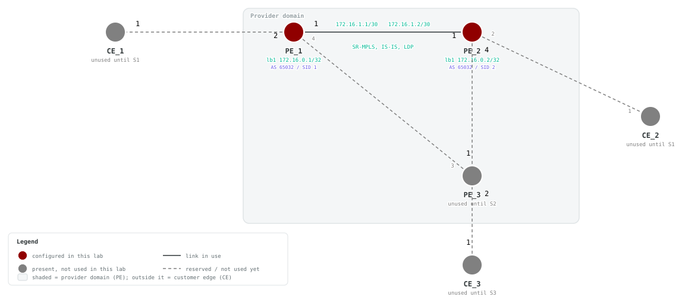

# F3 — Segment Routing over IS-IS (SR-MPLS)

## Goals

Build the primary transport path directly on the F2 IS-IS underlay. This lab
intentionally does not configure LDP or BGP.

By the end of this lab you will be able to:

- Enable MPLS forwarding and define a shared SRGB
- Enable segment routing and MPLS-TE under the IS-IS instance
- Assign a prefix-SID to each PE loopback
- Verify the SR-MPLS transport labels and loopback-to-loopback forwarding

## Topology




PE_1 and PE_2 use port 1 for the active IS-IS and SR-MPLS core link. The other
nodes and links are reserved for later Services labs.

### Addressing and SID plan

| Node | Loopback | Core address | Prefix-SID index |
| --- | --- | --- | --- |
| PE_1 | 172.16.0.1/32 | 172.16.1.1/30 | 1 |
| PE_2 | 172.16.0.2/32 | 172.16.1.2/30 | 2 |

## Prerequisites

- Complete F1 and F2, or deploy this lab with its included F2 baseline.
- Make the SAOS 10x image `vrnetlab/ciena_saos:10-12-00-0228` (release 10.12.00.0228) available to Containerlab.
- Activate the built-in trial license after deployment.

## Startup Configs

The checkpoint baseline each node boots from. If you are assembling the lab by hand, create a `configs/` folder next to `topo.clab.yml` and copy each file into it before you deploy.

- [PE_1.cfg.partial](./configs/PE_1.cfg.partial)
- [PE_2.cfg.partial](./configs/PE_2.cfg.partial)
- [PE_3.cfg.partial](./configs/PE_3.cfg.partial)
- [CE1.cfg.partial](./configs/CE1.cfg.partial)
- [CE2.cfg.partial](./configs/CE2.cfg.partial)

## Deploy

### Start from checkpoint

```bash
LAB=F3-SR-MPLS
cd labs/${LAB}            # from the repo root, or cd into the unpacked directory
containerlab deploy -t topo.clab.yml
```

Equivalent invocation from the repo root:

```bash
containerlab deploy -t "labs/${LAB}/topo.clab.yml"
```

The lab topology (`topo.clab.yml`):

```yaml
name: F3-SR-MPLS
topology:
  defaults:
    kind: ciena_saos
    image: vrnetlab/ciena_saos:10-12-00-0228
    labels:
      lab-mode: hands-on
  nodes:
    PE_1:
      type: '5162'
      startup-config: configs/PE_1.cfg.partial
    PE_2:
      type: '5162'
      startup-config: configs/PE_2.cfg.partial
    PE_3:
      type: '5162'
      labels:
        lab-state: unused
      startup-config: configs/PE_3.cfg.partial
    CE1:
      type: '3984'
      labels:
        lab-state: unused
      startup-config: configs/CE1.cfg.partial
    CE2:
      type: '3984'
      labels:
        lab-state: unused
      startup-config: configs/CE2.cfg.partial
  links:
  - endpoints: [ "PE_1:1", "PE_2:1" ]
  - endpoints: [ "PE_1:2", "CE1:1" ]
  - endpoints: [ "PE_2:2", "CE2:1" ]
  - endpoints: [ "PE_2:4", "PE_3:1" ]
  - endpoints: [ "PE_1:4", "PE_3:3" ]
  - endpoints: [ "CE2:2", "PE_3:2" ]
```

Connect to the active PEs:

```bash
ssh diag@clab-F3-SR-MPLS-PE_1
ssh diag@clab-F3-SR-MPLS-PE_2
```

Default credentials: `diag` / `ciena123`

## Instructions

<!-- task-index -->
- [Task 1: Verify the deployed topology](#task-1)
- [Task 2: Configure SR-MPLS on PE_1](#task-2)
- [Task 3: Configure SR-MPLS on PE_2](#task-3)
- [Task 4: Verify the primary transport](#task-4)

<a id="task-1"></a>
### Task 1: Verify the deployed topology
<a href="#task-1" title="Direct link to this task (right-click to copy)">🔗</a>

<!-- prose: detailed -->

**Summary** — This lab starts from the F2 IS-IS baseline, already preloaded
in the startup configs. Before layering segment routing on top, confirm the
IGP actually works: the loopbacks live on different prefixes than the shared
link, so reaching a neighbor's loopback requires an established adjacency
and exchanged routes, not just cable connectivity.

**Implementation** — Nothing to configure yet: inspect the preloaded
baseline and ping across it. Each PE carries loopback `lb1`
(`172.16.0.1`/`FC00::1` on `PE_1`, `172.16.0.2`/`FC00::2` on `PE_2`), the
routed core link `PE_1-PE_2-if` on `172.16.1.0/30` and `FC00::600/127`, and
IS-IS instance `Bootcamp` running level-1 with a shared interface password.
`PE_3`, `CE1`, and `CE2` are deployed but carry only a hostname; they sit
idle in this lab.

<!-- verify-prose -->

Healthy state is a clean `100.00 percent` success pinging `FC00::2` from
`PE_1` and `FC00::1` from `PE_2` — each router reaching the other's loopback
address. Because those loopbacks are /128s advertised only through IS-IS,
success proves the `Bootcamp` adjacency formed (matching level-1 passwords
included) and LSPs were flooded and installed. Adjacencies take a little
time after deploy, so an initial failure right after boot is expected to
clear on retry.

Question to consider: why does pinging `FC00::2` prove more than pinging the
far end of the `FC00::600/127` link would?

<!-- retry: 120s -->
**Verify** (show mode) on **PE_1**:

```saos-show
ping ip destination FC00::2 source FC00::1 repeat-count 5
```

Pass: Output contains `100.00 percent`

<details><summary>Example output</summary>

```
Sending 5 ICMP Echos to FC00::2, timeout is 1 second

Codes: 
'!' - Success, 'Q' - Request not sent, '.' - Timeout 

 Type 'Ctrl+C' to abort

! seq_num = 1  RTT = 5.00 ms  TTL = 255
! seq_num = 2  RTT = 2.87 ms  TTL = 255
! seq_num = 3  RTT = 2.73 ms  TTL = 255
! seq_num = 4  RTT = 3.12 ms  TTL = 255
! seq_num = 5  RTT = 2.78 ms  TTL = 255
Success Rate is 100.00 percent (5/5)
Round-trip min/avg/max = 2.73/3.30/5.00
```

</details>

<!-- retry: 120s -->
**Verify** (show mode) on **PE_2**:

```saos-show
ping ip destination FC00::1 source FC00::2 repeat-count 5
```

Pass: Output contains `100.00 percent`

<details><summary>Example output</summary>

```
Sending 5 ICMP Echos to FC00::1, timeout is 1 second

Codes: 
'!' - Success, 'Q' - Request not sent, '.' - Timeout 

 Type 'Ctrl+C' to abort

! seq_num = 1  RTT = 2.49 ms  TTL = 255
! seq_num = 2  RTT = 3.66 ms  TTL = 255
! seq_num = 3  RTT = 3.91 ms  TTL = 255
! seq_num = 4  RTT = 3.99 ms  TTL = 255
! seq_num = 5  RTT = 3.20 ms  TTL = 255
Success Rate is 100.00 percent (5/5)
Round-trip min/avg/max = 2.49/3.45/3.99
```

</details>

<a id="task-2"></a>
### Task 2: Configure SR-MPLS on PE_1
<a href="#task-2" title="Direct link to this task (right-click to copy)">🔗</a>

<!-- prose: in-depth -->

**Summary** — This task turns `PE_1` into a segment-routing MPLS node.
Unlike LDP, SR needs no separate label-distribution protocol — labels are
derived from information the IGP already floods.

**Background** — An index is not a label — it is an offset into a shared
block. That block is the SRGB, `16000`–`23999` here. Label = SRGB base +
index, so `PE_1`'s loopback should resolve to `16000 + 1 = 16001` on any
router using this SRGB — which is why every router in the domain is given
the same range.

**Implementation** — First, allow the box to switch labeled packets at all:
enable MPLS label switching on the core-facing `PE_1-PE_2-if` and on `lb1`.
Next, give the loopback an identity in the label space: map prefix
`172.16.0.1/32` on `lb1` to prefix-SID index `1`, and enable segment
routing with the SRGB `16000`–`23999` under IS-IS instance `Bootcamp`.
Finally, anchor traffic engineering to the loopback: set the MPLS-TE
router-id to `172.16.0.1`, enable CSPF, and turn on advertising and
receiving of SID bindings so IS-IS carries the SR information.

**Configure** (config mode) on **PE_1**:

```saos-config
mpls interfaces interface PE_1-PE_2-if label-switching true
mpls interfaces interface lb1 label-switching true
segment-routing connected-prefix-sid-map 172.16.0.1/32 interface lb1 start-sid 1 value-type index
isis instance Bootcamp cspf-flag true
isis instance Bootcamp mpls-te level-type level-1 router-id 172.16.0.1
isis instance Bootcamp segment-routing enabled true srgb 16000 23999
isis instance Bootcamp segment-routing bindings advertise true receive true
```

<!-- verify-prose -->

Healthy state: IS-IS instance `Bootcamp` reports segment routing `Enabled`,
and the connected prefix-SID map shows `172.16.0.1/32` bound to `lb1`. Be
clear about what this proves: these outputs largely echo local configuration
back at you — `PE_2` has no SR yet, so there is no far-end state to observe,
and no label-switched path exists at this point.

Question: given index `1` and an SRGB starting at `16000`, what label do you
expect the rest of the network to use for `PE_1`'s loopback once neighbors
learn it?

<!-- retry: 60s -->
**Verify** (show mode) on **PE_1**:

```saos-show
show isis segment-routing
```

Pass: Output contains `Bootcamp` and `Enabled`

<details><summary>Example output</summary>

```
+----------- ISIS SEGMENT-ROUTING STATE -----------+
| ISIS Tag | Config State | Oper State | Force PHP |
+----------+--------------+------------+-----------+
| Bootcamp | Enabled      | Enabled    | Disabled  |
+----------+--------------+------------+-----------+
```

</details>

**Verify** (show mode) on **PE_1**:

```saos-show
show segment-routing connected-prefix-sid-map
```

Pass: Output contains `172.16.0.1/32` and `lb1`

<details><summary>Example output</summary>

```
+----- SEGMENT-ROUTING SID MAP -----+
|  Name             |  Value        |
+-------------------+---------------+
| Prefix            | 172.16.0.1/32 |
| Interface         | lb1           |
| Value Type        | Index         |
| Start SID         | 1             |
| Range             | 1             |
| Algorithm         | SPF           |
| Last Hop Behavior | -             |
+-------------------+---------------+
```

</details>

<a id="task-3"></a>
### Task 3: Configure SR-MPLS on PE_2
<a href="#task-3" title="Direct link to this task (right-click to copy)">🔗</a>

<!-- prose: simple -->

Mirror Task 2 on `PE_2` — label switching on `PE_1-PE_2-if` and `lb1`,
CSPF, SID binding advertise/receive, and the same SRGB `16000`–`23999`
under `Bootcamp`, with only its own values changed:

- prefix-SID: `172.16.0.2/32` on `lb1`, index `2` (`16000 + 2 = 16002`)
- MPLS-TE router-id: `172.16.0.2`

**Configure** (config mode) on **PE_2**:

```saos-config
mpls interfaces interface PE_1-PE_2-if label-switching true
mpls interfaces interface lb1 label-switching true
segment-routing connected-prefix-sid-map 172.16.0.2/32 interface lb1 start-sid 2 value-type index
isis instance Bootcamp cspf-flag true
isis instance Bootcamp mpls-te level-type level-1 router-id 172.16.0.2
isis instance Bootcamp segment-routing enabled true srgb 16000 23999
isis instance Bootcamp segment-routing bindings advertise true receive true
```

<!-- verify-prose -->

Healthy state matches Task 2's, viewed from `PE_2`: instance `Bootcamp`
shows segment routing `Enabled`, and the sid-map shows `172.16.0.2/32` on
`lb1`. Again these checks confirm local intent; whether the two routers have
actually learned each other's SIDs and installed labels is the subject of
the next task. A shared SRGB is what lets every router compute the same
label for the same index without any per-hop label negotiation — once this
side comes up, both ends of the link are SR-capable, and IS-IS can flood
each router's SR capability and prefix-SIDs to the other.

Question: what would go wrong if `PE_2` had been configured with a different
SRGB, say starting at `20000`, while still advertising index `2`?

<!-- retry: 60s -->
**Verify** (show mode) on **PE_2**:

```saos-show
show isis segment-routing
```

Pass: Output contains `Bootcamp` and `Enabled`

<details><summary>Example output</summary>

```
+----------- ISIS SEGMENT-ROUTING STATE -----------+
| ISIS Tag | Config State | Oper State | Force PHP |
+----------+--------------+------------+-----------+
| Bootcamp | Enabled      | Enabled    | Disabled  |
+----------+--------------+------------+-----------+
```

</details>

**Verify** (show mode) on **PE_2**:

```saos-show
show segment-routing connected-prefix-sid-map
```

Pass: Output contains `172.16.0.2/32` and `lb1`

<details><summary>Example output</summary>

```
+----- SEGMENT-ROUTING SID MAP -----+
|  Name             |  Value        |
+-------------------+---------------+
| Prefix            | 172.16.0.2/32 |
| Interface         | lb1           |
| Value Type        | Index         |
| Start SID         | 2             |
| Range             | 1             |
| Algorithm         | SPF           |
| Last Hop Behavior | -             |
+-------------------+---------------+
```

</details>

<a id="task-4"></a>
### Task 4: Verify the primary transport
<a href="#task-4" title="Direct link to this task (right-click to copy)">🔗</a>

<!-- prose: detailed -->

**Summary** — Nothing new is configured here. This task teaches you to read
the evidence that SR transport is actually working, moving from
control-plane learning to installed forwarding state.

**Implementation** — The SR capability view answers "who advertises what":
each router should list both `172.16.0.1` and `172.16.0.2` with the shared
`16000`–`23999`
SRGB, proving the capability TLVs were flooded through IS-IS. The active
mapping table answers "which prefix-SIDs did I learn": both /32 loopback
prefixes should appear on both routers — remote SIDs learned purely from the
IGP, with no LDP session anywhere. The MPLS forwarding table answers "did
the data plane install it": unlike the config-echo checks earlier, an entry
for the remote loopback marked `i >` shows a selected, installed label-
switched path — this is the table that proves packets can actually be
forwarded on labels. A final loopback-to-loopback IPv4 ping, source pinned
to the local loopback, exercises the transport end to end.

<!-- verify-prose -->

Healthy state on each PE: the capability output lists both router IDs
against SRGB `16000`/`23999`; the active mapping table holds `172.16.0.1/32`
and `172.16.0.2/32`; and the forwarding table shows the remote loopback
(`172.16.0.2/32` from `PE_1`, `172.16.0.1/32` from `PE_2`) with an `i >`
entry. Pings between `172.16.0.1` and `172.16.0.2` should complete at
`100.00 percent` in both directions; flooding and installation can lag, so
allow the retry window to do its work.

Questions: based on index-plus-base arithmetic, which outgoing label would
you expect toward each loopback — and which single show output here would
LDP have required a signaling protocol to populate?

<!-- retry: 120s -->
**Verify** (show mode) on **PE_1**:

```saos-show
show isis segment-routing capability
```

Pass: Output contains `16000` and `23999` and `172.16.0.1` and `172.16.0.2`

<details><summary>Example output</summary>

```
+------------------------------- ISIS SEGMENT-ROUTING CAPABILITY --------------------------------+
|          |            |       |       |    Total  | SID Range  |            |           |      |
|          |            | SRGB  | SRGB  |      SID  |      List  |      SRMS  |           | Node |
| Instance |  Router ID | Start |   End | Supported |      Count | Preference | Algorithm | MSD  |
+----------+------------+-------+-------+-----------+------------+------------+-----------+------+
| Bootcamp | 172.16.0.1 | 16000 | 23999 |      8000 |          1 |        128 |       SPF | 0    |
+----------+------------+-------+-------+-----------+------------+------------+-----------+------+
| Bootcamp | 172.16.0.2 | 16000 | 23999 |      8000 |          1 |        128 |       SPF | 0    |
+----------+------------+-------+-------+-----------+------------+------------+-----------+------+
```

</details>

<!-- retry: 120s -->
**Verify** (show mode) on **PE_2**:

```saos-show
show isis segment-routing capability
```

Pass: Output contains `16000` and `23999` and `172.16.0.1` and `172.16.0.2`

<details><summary>Example output</summary>

```
+------------------------------- ISIS SEGMENT-ROUTING CAPABILITY --------------------------------+
|          |            |       |       |    Total  | SID Range  |            |           |      |
|          |            | SRGB  | SRGB  |      SID  |      List  |      SRMS  |           | Node |
| Instance |  Router ID | Start |   End | Supported |      Count | Preference | Algorithm | MSD  |
+----------+------------+-------+-------+-----------+------------+------------+-----------+------+
| Bootcamp | 172.16.0.1 | 16000 | 23999 |      8000 |          1 |        128 |       SPF | 0    |
+----------+------------+-------+-------+-----------+------------+------------+-----------+------+
| Bootcamp | 172.16.0.2 | 16000 | 23999 |      8000 |          1 |        128 |       SPF | 0    |
+----------+------------+-------+-------+-----------+------------+------------+-----------+------+
```

</details>

<!-- retry: 120s -->
**Verify** (show mode) on **PE_1**:

```saos-show
show isis segment-routing mapping-table status active
```

Pass: Output contains `172.16.0.1/32` and `172.16.0.2/32`

<details><summary>Example output</summary>

```
+---------- ISIS SEGMENT-ROUTING MAPPING TABLE ACTIVE -----------+
| ISIS Instance |  Entry Prefix | SID Index | Range | Preference |
+---------------+---------------+-----------+-------+------------+
|    Bootcamp   | 172.16.0.1/32 |         1 |     1 |        192 |
|    Bootcamp   | 172.16.0.2/32 |         2 |     1 |        192 |
+---------------+---------------+-----------+-------+------------+
```

</details>

<!-- retry: 120s -->
**Verify** (show mode) on **PE_2**:

```saos-show
show isis segment-routing mapping-table status active
```

Pass: Output contains `172.16.0.1/32` and `172.16.0.2/32`

<details><summary>Example output</summary>

```
+---------- ISIS SEGMENT-ROUTING MAPPING TABLE ACTIVE -----------+
| ISIS Instance |  Entry Prefix | SID Index | Range | Preference |
+---------------+---------------+-----------+-------+------------+
|    Bootcamp   | 172.16.0.1/32 |         1 |     1 |        192 |
|    Bootcamp   | 172.16.0.2/32 |         2 |     1 |        192 |
+---------------+---------------+-----------+-------+------------+
```

</details>

<!-- retry: 120s -->
**Verify** (show mode) on **PE_1**:

```saos-show
show mpls forwarding-table
```

Pass: Output contains `172.16.0.2/32` and `i >`

<details><summary>Example output</summary>

```
+--------------------------------------------------------------------------------------------------------------------+
| Codes: > - installed FTN, * - selected FTN, p - stale FTN, b - backup route                                        |
|        B - BGP FTN, K - CLI FTN, t - tunnel                                                                        |
|        L - LDP FTN, R - RSVP-TE FTN, S - SNMP FTN, I - IGP-Shortcut,                                               |
|        U - unknown FTN, O - SR-OSPF FTN, i - SR-ISIS FTN, k - SR-CLI FTN,                                          |
|        s - SR-TE FTN,  ip - IP-ISIS FTN, io - IP-OSPF FTN, ib - IP-BGP FTN,                                        |
|        M - MPLS-TP FTN, ias - IAS FTN, v - VPN FTN,                                                                |
|        m - PW-MPLS FTN, e - EVPN FTN                                                                               |
|        C - Color, Tn - Tunnel Name, f - Fallback, ML - Multicast LDP, IR - Ingress-Replication, F - Flex-Algorithm |
+--------------------------------------------------------------------------------------------------------------------+
+-------------------------------------- MPLS FORWARDING TABLE --------------------------------------+
|      |                    | Opaque |          Label          |                  |                 |
| Code |        FEC         |  ID    |     In     |    Out     |     Out Intf     |     Next Hop    |
+------+--------------------+--------+------------+------------+------------------+-----------------+
| i >  | 172.16.0.2/32      | 7      | -          | 3          | PE_1-PE_2-if     | 172.16.1.2      |
+------+--------------------+--------+------------+------------+------------------+-----------------+
```

</details>

<!-- retry: 120s -->
**Verify** (show mode) on **PE_2**:

```saos-show
show mpls forwarding-table
```

Pass: Output contains `172.16.0.1/32` and `i >`

<details><summary>Example output</summary>

```
+--------------------------------------------------------------------------------------------------------------------+
| Codes: > - installed FTN, * - selected FTN, p - stale FTN, b - backup route                                        |
|        B - BGP FTN, K - CLI FTN, t - tunnel                                                                        |
|        L - LDP FTN, R - RSVP-TE FTN, S - SNMP FTN, I - IGP-Shortcut,                                               |
|        U - unknown FTN, O - SR-OSPF FTN, i - SR-ISIS FTN, k - SR-CLI FTN,                                          |
|        s - SR-TE FTN,  ip - IP-ISIS FTN, io - IP-OSPF FTN, ib - IP-BGP FTN,                                        |
|        M - MPLS-TP FTN, ias - IAS FTN, v - VPN FTN,                                                                |
|        m - PW-MPLS FTN, e - EVPN FTN                                                                               |
|        C - Color, Tn - Tunnel Name, f - Fallback, ML - Multicast LDP, IR - Ingress-Replication, F - Flex-Algorithm |
+--------------------------------------------------------------------------------------------------------------------+
+-------------------------------------- MPLS FORWARDING TABLE --------------------------------------+
|      |                    | Opaque |          Label          |                  |                 |
| Code |        FEC         |  ID    |     In     |    Out     |     Out Intf     |     Next Hop    |
+------+--------------------+--------+------------+------------+------------------+-----------------+
| i >  | 172.16.0.1/32      | 8      | -          | 3          | PE_1-PE_2-if     | 172.16.1.1      |
+------+--------------------+--------+------------+------------+------------------+-----------------+
```

</details>

<!-- retry: 120s -->
**Verify** (show mode) on **PE_1**:

```saos-show
ping ip destination 172.16.0.2 source 172.16.0.1 repeat-count 5
```

Pass: Output contains `100.00 percent`

<details><summary>Example output</summary>

```
Sending 5 ICMP Echos to 172.16.0.2, timeout is 1 second

Codes: 
'!' - Success, 'Q' - Request not sent, '.' - Timeout 

 Type 'Ctrl+C' to abort

! seq_num = 1  RTT = 2.84 ms  TTL = 255
! seq_num = 2  RTT = 3.69 ms  TTL = 255
! seq_num = 3  RTT = 3.03 ms  TTL = 255
! seq_num = 4  RTT = 3.16 ms  TTL = 255
! seq_num = 5  RTT = 3.61 ms  TTL = 255
Success Rate is 100.00 percent (5/5)
Round-trip min/avg/max = 2.84/3.27/3.69
```

</details>

<!-- retry: 120s -->
**Verify** (show mode) on **PE_2**:

```saos-show
ping ip destination 172.16.0.1 source 172.16.0.2 repeat-count 5
```

Pass: Output contains `100.00 percent`

<details><summary>Example output</summary>

```
Sending 5 ICMP Echos to 172.16.0.1, timeout is 1 second

Codes: 
'!' - Success, 'Q' - Request not sent, '.' - Timeout 

 Type 'Ctrl+C' to abort

! seq_num = 1  RTT = 2.96 ms  TTL = 255
! seq_num = 2  RTT = 2.94 ms  TTL = 255
! seq_num = 3  RTT = 2.79 ms  TTL = 255
! seq_num = 4  RTT = 3.10 ms  TTL = 255
! seq_num = 5  RTT = 3.57 ms  TTL = 255
Success Rate is 100.00 percent (5/5)
Round-trip min/avg/max = 2.79/3.07/3.57
```

</details>

## Tests

Deploy `F3-SR-MPLS`, then run the following validation checks.

### G1: Task 1 — Verify the deployed topology

<!-- retry: 120s -->
On **PE_1**, run:

```saos
ping ip destination FC00::2 source FC00::1 repeat-count 5
```

Pass: Output contains `100.00 percent`

<details><summary>Example output</summary>

```
Sending 5 ICMP Echos to FC00::2, timeout is 1 second

Codes: 
'!' - Success, 'Q' - Request not sent, '.' - Timeout 

 Type 'Ctrl+C' to abort

! seq_num = 1  RTT = 5.00 ms  TTL = 255
! seq_num = 2  RTT = 2.87 ms  TTL = 255
! seq_num = 3  RTT = 2.73 ms  TTL = 255
! seq_num = 4  RTT = 3.12 ms  TTL = 255
! seq_num = 5  RTT = 2.78 ms  TTL = 255
Success Rate is 100.00 percent (5/5)
Round-trip min/avg/max = 2.73/3.30/5.00
```

</details>

<!-- retry: 120s -->
On **PE_2**, run:

```saos
ping ip destination FC00::1 source FC00::2 repeat-count 5
```

Pass: Output contains `100.00 percent`

<details><summary>Example output</summary>

```
Sending 5 ICMP Echos to FC00::1, timeout is 1 second

Codes: 
'!' - Success, 'Q' - Request not sent, '.' - Timeout 

 Type 'Ctrl+C' to abort

! seq_num = 1  RTT = 2.49 ms  TTL = 255
! seq_num = 2  RTT = 3.66 ms  TTL = 255
! seq_num = 3  RTT = 3.91 ms  TTL = 255
! seq_num = 4  RTT = 3.99 ms  TTL = 255
! seq_num = 5  RTT = 3.20 ms  TTL = 255
Success Rate is 100.00 percent (5/5)
Round-trip min/avg/max = 2.49/3.45/3.99
```

</details>

### G2: Task 2 — Configure SR-MPLS on PE_1

<!-- retry: 60s -->
On **PE_1**, run:

```saos
show isis segment-routing
```

Pass: Output contains `Bootcamp` and `Enabled`

<details><summary>Example output</summary>

```
+----------- ISIS SEGMENT-ROUTING STATE -----------+
| ISIS Tag | Config State | Oper State | Force PHP |
+----------+--------------+------------+-----------+
| Bootcamp | Enabled      | Enabled    | Disabled  |
+----------+--------------+------------+-----------+
```

</details>

On **PE_1**, run:

```saos
show segment-routing connected-prefix-sid-map
```

Pass: Output contains `172.16.0.1/32` and `lb1`

<details><summary>Example output</summary>

```
+----- SEGMENT-ROUTING SID MAP -----+
|  Name             |  Value        |
+-------------------+---------------+
| Prefix            | 172.16.0.1/32 |
| Interface         | lb1           |
| Value Type        | Index         |
| Start SID         | 1             |
| Range             | 1             |
| Algorithm         | SPF           |
| Last Hop Behavior | -             |
+-------------------+---------------+
```

</details>

### G3: Task 3 — Configure SR-MPLS on PE_2

<!-- retry: 60s -->
On **PE_2**, run:

```saos
show isis segment-routing
```

Pass: Output contains `Bootcamp` and `Enabled`

<details><summary>Example output</summary>

```
+----------- ISIS SEGMENT-ROUTING STATE -----------+
| ISIS Tag | Config State | Oper State | Force PHP |
+----------+--------------+------------+-----------+
| Bootcamp | Enabled      | Enabled    | Disabled  |
+----------+--------------+------------+-----------+
```

</details>

On **PE_2**, run:

```saos
show segment-routing connected-prefix-sid-map
```

Pass: Output contains `172.16.0.2/32` and `lb1`

<details><summary>Example output</summary>

```
+----- SEGMENT-ROUTING SID MAP -----+
|  Name             |  Value        |
+-------------------+---------------+
| Prefix            | 172.16.0.2/32 |
| Interface         | lb1           |
| Value Type        | Index         |
| Start SID         | 2             |
| Range             | 1             |
| Algorithm         | SPF           |
| Last Hop Behavior | -             |
+-------------------+---------------+
```

</details>

### G4: Task 4 — Verify the primary transport

<!-- retry: 120s -->
On **PE_1**, run:

```saos
show isis segment-routing capability
```

Pass: Output contains `16000` and `23999` and `172.16.0.1` and `172.16.0.2`

<details><summary>Example output</summary>

```
+------------------------------- ISIS SEGMENT-ROUTING CAPABILITY --------------------------------+
|          |            |       |       |    Total  | SID Range  |            |           |      |
|          |            | SRGB  | SRGB  |      SID  |      List  |      SRMS  |           | Node |
| Instance |  Router ID | Start |   End | Supported |      Count | Preference | Algorithm | MSD  |
+----------+------------+-------+-------+-----------+------------+------------+-----------+------+
| Bootcamp | 172.16.0.1 | 16000 | 23999 |      8000 |          1 |        128 |       SPF | 0    |
+----------+------------+-------+-------+-----------+------------+------------+-----------+------+
| Bootcamp | 172.16.0.2 | 16000 | 23999 |      8000 |          1 |        128 |       SPF | 0    |
+----------+------------+-------+-------+-----------+------------+------------+-----------+------+
```

</details>

<!-- retry: 120s -->
On **PE_2**, run:

```saos
show isis segment-routing capability
```

Pass: Output contains `16000` and `23999` and `172.16.0.1` and `172.16.0.2`

<details><summary>Example output</summary>

```
+------------------------------- ISIS SEGMENT-ROUTING CAPABILITY --------------------------------+
|          |            |       |       |    Total  | SID Range  |            |           |      |
|          |            | SRGB  | SRGB  |      SID  |      List  |      SRMS  |           | Node |
| Instance |  Router ID | Start |   End | Supported |      Count | Preference | Algorithm | MSD  |
+----------+------------+-------+-------+-----------+------------+------------+-----------+------+
| Bootcamp | 172.16.0.1 | 16000 | 23999 |      8000 |          1 |        128 |       SPF | 0    |
+----------+------------+-------+-------+-----------+------------+------------+-----------+------+
| Bootcamp | 172.16.0.2 | 16000 | 23999 |      8000 |          1 |        128 |       SPF | 0    |
+----------+------------+-------+-------+-----------+------------+------------+-----------+------+
```

</details>

<!-- retry: 120s -->
On **PE_1**, run:

```saos
show isis segment-routing mapping-table status active
```

Pass: Output contains `172.16.0.1/32` and `172.16.0.2/32`

<details><summary>Example output</summary>

```
+---------- ISIS SEGMENT-ROUTING MAPPING TABLE ACTIVE -----------+
| ISIS Instance |  Entry Prefix | SID Index | Range | Preference |
+---------------+---------------+-----------+-------+------------+
|    Bootcamp   | 172.16.0.1/32 |         1 |     1 |        192 |
|    Bootcamp   | 172.16.0.2/32 |         2 |     1 |        192 |
+---------------+---------------+-----------+-------+------------+
```

</details>

<!-- retry: 120s -->
On **PE_2**, run:

```saos
show isis segment-routing mapping-table status active
```

Pass: Output contains `172.16.0.1/32` and `172.16.0.2/32`

<details><summary>Example output</summary>

```
+---------- ISIS SEGMENT-ROUTING MAPPING TABLE ACTIVE -----------+
| ISIS Instance |  Entry Prefix | SID Index | Range | Preference |
+---------------+---------------+-----------+-------+------------+
|    Bootcamp   | 172.16.0.1/32 |         1 |     1 |        192 |
|    Bootcamp   | 172.16.0.2/32 |         2 |     1 |        192 |
+---------------+---------------+-----------+-------+------------+
```

</details>

<!-- retry: 120s -->
On **PE_1**, run:

```saos
show mpls forwarding-table
```

Pass: Output contains `172.16.0.2/32` and `i >`

<details><summary>Example output</summary>

```
+--------------------------------------------------------------------------------------------------------------------+
| Codes: > - installed FTN, * - selected FTN, p - stale FTN, b - backup route                                        |
|        B - BGP FTN, K - CLI FTN, t - tunnel                                                                        |
|        L - LDP FTN, R - RSVP-TE FTN, S - SNMP FTN, I - IGP-Shortcut,                                               |
|        U - unknown FTN, O - SR-OSPF FTN, i - SR-ISIS FTN, k - SR-CLI FTN,                                          |
|        s - SR-TE FTN,  ip - IP-ISIS FTN, io - IP-OSPF FTN, ib - IP-BGP FTN,                                        |
|        M - MPLS-TP FTN, ias - IAS FTN, v - VPN FTN,                                                                |
|        m - PW-MPLS FTN, e - EVPN FTN                                                                               |
|        C - Color, Tn - Tunnel Name, f - Fallback, ML - Multicast LDP, IR - Ingress-Replication, F - Flex-Algorithm |
+--------------------------------------------------------------------------------------------------------------------+
+-------------------------------------- MPLS FORWARDING TABLE --------------------------------------+
|      |                    | Opaque |          Label          |                  |                 |
| Code |        FEC         |  ID    |     In     |    Out     |     Out Intf     |     Next Hop    |
+------+--------------------+--------+------------+------------+------------------+-----------------+
| i >  | 172.16.0.2/32      | 7      | -          | 3          | PE_1-PE_2-if     | 172.16.1.2      |
+------+--------------------+--------+------------+------------+------------------+-----------------+
```

</details>

<!-- retry: 120s -->
On **PE_2**, run:

```saos
show mpls forwarding-table
```

Pass: Output contains `172.16.0.1/32` and `i >`

<details><summary>Example output</summary>

```
+--------------------------------------------------------------------------------------------------------------------+
| Codes: > - installed FTN, * - selected FTN, p - stale FTN, b - backup route                                        |
|        B - BGP FTN, K - CLI FTN, t - tunnel                                                                        |
|        L - LDP FTN, R - RSVP-TE FTN, S - SNMP FTN, I - IGP-Shortcut,                                               |
|        U - unknown FTN, O - SR-OSPF FTN, i - SR-ISIS FTN, k - SR-CLI FTN,                                          |
|        s - SR-TE FTN,  ip - IP-ISIS FTN, io - IP-OSPF FTN, ib - IP-BGP FTN,                                        |
|        M - MPLS-TP FTN, ias - IAS FTN, v - VPN FTN,                                                                |
|        m - PW-MPLS FTN, e - EVPN FTN                                                                               |
|        C - Color, Tn - Tunnel Name, f - Fallback, ML - Multicast LDP, IR - Ingress-Replication, F - Flex-Algorithm |
+--------------------------------------------------------------------------------------------------------------------+
+-------------------------------------- MPLS FORWARDING TABLE --------------------------------------+
|      |                    | Opaque |          Label          |                  |                 |
| Code |        FEC         |  ID    |     In     |    Out     |     Out Intf     |     Next Hop    |
+------+--------------------+--------+------------+------------+------------------+-----------------+
| i >  | 172.16.0.1/32      | 8      | -          | 3          | PE_1-PE_2-if     | 172.16.1.1      |
+------+--------------------+--------+------------+------------+------------------+-----------------+
```

</details>

<!-- retry: 120s -->
On **PE_1**, run:

```saos
ping ip destination 172.16.0.2 source 172.16.0.1 repeat-count 5
```

Pass: Output contains `100.00 percent`

<details><summary>Example output</summary>

```
Sending 5 ICMP Echos to 172.16.0.2, timeout is 1 second

Codes: 
'!' - Success, 'Q' - Request not sent, '.' - Timeout 

 Type 'Ctrl+C' to abort

! seq_num = 1  RTT = 2.84 ms  TTL = 255
! seq_num = 2  RTT = 3.69 ms  TTL = 255
! seq_num = 3  RTT = 3.03 ms  TTL = 255
! seq_num = 4  RTT = 3.16 ms  TTL = 255
! seq_num = 5  RTT = 3.61 ms  TTL = 255
Success Rate is 100.00 percent (5/5)
Round-trip min/avg/max = 2.84/3.27/3.69
```

</details>

<!-- retry: 120s -->
On **PE_2**, run:

```saos
ping ip destination 172.16.0.1 source 172.16.0.2 repeat-count 5
```

Pass: Output contains `100.00 percent`

<details><summary>Example output</summary>

```
Sending 5 ICMP Echos to 172.16.0.1, timeout is 1 second

Codes: 
'!' - Success, 'Q' - Request not sent, '.' - Timeout 

 Type 'Ctrl+C' to abort

! seq_num = 1  RTT = 2.96 ms  TTL = 255
! seq_num = 2  RTT = 2.94 ms  TTL = 255
! seq_num = 3  RTT = 2.79 ms  TTL = 255
! seq_num = 4  RTT = 3.10 ms  TTL = 255
! seq_num = 5  RTT = 3.57 ms  TTL = 255
Success Rate is 100.00 percent (5/5)
Round-trip min/avg/max = 2.79/3.07/3.57
```

</details>

## Solutions

Use the preloaded baseline for context, then apply the learner solution blocks in task order.

### Preloaded baseline

#### PE_1

```saos
# Preloaded start
system config hostname PE_1
fds fd PE_1-PE_2-FD mode vpls
oc-if:interfaces interface lb1 config name lb1 type loopback
oc-if:interfaces interface lb1 ipv4 addresses address 172.16.0.1 config ip 172.16.0.1 prefix-length 32
oc-if:interfaces interface lb1 ipv6 addresses address FC00::1 config ip FC00::1 prefix-length 128
oc-if:interfaces interface PE_1-PE_2-if config mtu 1500 name PE_1-PE_2-if type ip
oc-if:interfaces interface PE_1-PE_2-if config underlay-binding config fd PE_1-PE_2-FD
oc-if:interfaces interface PE_1-PE_2-if ipv4 addresses address 172.16.1.1 config ip 172.16.1.1 prefix-length 30
oc-if:interfaces interface PE_1-PE_2-if ipv6 addresses address FC00::600 config ip FC00::600 prefix-length 127
classifiers classifier CLASSIFIER-UNTAGGED filter-entry vtag-stack untagged-exclude-priority-tagged false
fps fp PE_1-PE_2-FP classifier-list-precedence 7 fd-name PE_1-PE_2-FD logical-port 1 mtu-size 2000 stats-collection on classifier-list CLASSIFIER-UNTAGGED
classifiers classifier CLASSIFIER-UNTAGGED filter-entry vtag-stack untagged-exclude-priority-tagged false
fps fp PE_1-PE_2-FP classifier-list-precedence 7 fd-name PE_1-PE_2-FD logical-port 1 mtu-size 2000 stats-collection on classifier-list CLASSIFIER-UNTAGGED
isis instance Bootcamp level-type level-1 net 49.0001.0172.0016.0001.00
isis instance Bootcamp interfaces interface lb1 interface-type point-to-point
isis instance Bootcamp interfaces interface lb1 address-families address-family ipv6 unicast
isis instance Bootcamp interfaces interface PE_1-PE_2-if interface-type point-to-point level-type level-1
isis instance Bootcamp interfaces interface PE_1-PE_2-if address-families address-family ipv6 unicast
isis instance Bootcamp interfaces interface PE_1-PE_2-if level-1 password ciena123
# Preloaded end
```

#### PE_2

```saos
# Preloaded start
system config hostname PE_2
fds fd PE_1-PE_2-FD mode vpls
oc-if:interfaces interface lb1 config name lb1 type loopback
oc-if:interfaces interface lb1 ipv4 addresses address 172.16.0.2 config ip 172.16.0.2 prefix-length 32
oc-if:interfaces interface lb1 ipv6 addresses address FC00::2 config ip FC00::2 prefix-length 128
oc-if:interfaces interface PE_1-PE_2-if config mtu 1500 name PE_1-PE_2-if type ip
oc-if:interfaces interface PE_1-PE_2-if config underlay-binding config fd PE_1-PE_2-FD
oc-if:interfaces interface PE_1-PE_2-if ipv4 addresses address 172.16.1.2 config ip 172.16.1.2 prefix-length 30
oc-if:interfaces interface PE_1-PE_2-if ipv6 addresses address FC00::601 config ip FC00::601 prefix-length 127
classifiers classifier CLASSIFIER-UNTAGGED filter-entry vtag-stack untagged-exclude-priority-tagged false
fps fp PE_1-PE_2-FP classifier-list-precedence 7 fd-name PE_1-PE_2-FD logical-port 1 mtu-size 2000 stats-collection on classifier-list CLASSIFIER-UNTAGGED
classifiers classifier CLASSIFIER-UNTAGGED filter-entry vtag-stack untagged-exclude-priority-tagged false
fps fp PE_1-PE_2-FP classifier-list-precedence 7 fd-name PE_1-PE_2-FD logical-port 1 mtu-size 2000 stats-collection on classifier-list CLASSIFIER-UNTAGGED
isis instance Bootcamp level-type level-1 net 49.0001.0172.0016.0002.00
isis instance Bootcamp interfaces interface lb1 interface-type point-to-point
isis instance Bootcamp interfaces interface lb1 address-families address-family ipv6 unicast
isis instance Bootcamp interfaces interface PE_1-PE_2-if interface-type point-to-point level-type level-1
isis instance Bootcamp interfaces interface PE_1-PE_2-if address-families address-family ipv6 unicast
isis instance Bootcamp interfaces interface PE_1-PE_2-if level-1 password ciena123
# Preloaded end
```

#### PE_3

```saos
# Preloaded start
system config hostname PE_3
# Preloaded end
```

#### CE1

```saos
# Preloaded start
system config hostname CE1
# Preloaded end
```

#### CE2

```saos
# Preloaded start
system config hostname CE2
# Preloaded end
```

### Solution for Task 1

No configuration commands; this is a verification-only task.

### Solution for Task 2

#### PE_1

```saos
# Task 2 start
mpls interfaces interface PE_1-PE_2-if label-switching true
mpls interfaces interface lb1 label-switching true
segment-routing connected-prefix-sid-map 172.16.0.1/32 interface lb1 start-sid 1 value-type index
isis instance Bootcamp cspf-flag true
isis instance Bootcamp mpls-te level-type level-1 router-id 172.16.0.1
isis instance Bootcamp segment-routing enabled true srgb 16000 23999
isis instance Bootcamp segment-routing bindings advertise true receive true
# Task 2 end
```

### Solution for Task 3

#### PE_2

```saos
# Task 3 start
mpls interfaces interface PE_1-PE_2-if label-switching true
mpls interfaces interface lb1 label-switching true
segment-routing connected-prefix-sid-map 172.16.0.2/32 interface lb1 start-sid 2 value-type index
isis instance Bootcamp cspf-flag true
isis instance Bootcamp mpls-te level-type level-1 router-id 172.16.0.2
isis instance Bootcamp segment-routing enabled true srgb 16000 23999
isis instance Bootcamp segment-routing bindings advertise true receive true
# Task 3 end
```

### Solution for Task 4

No configuration commands; this is a verification-only task.
