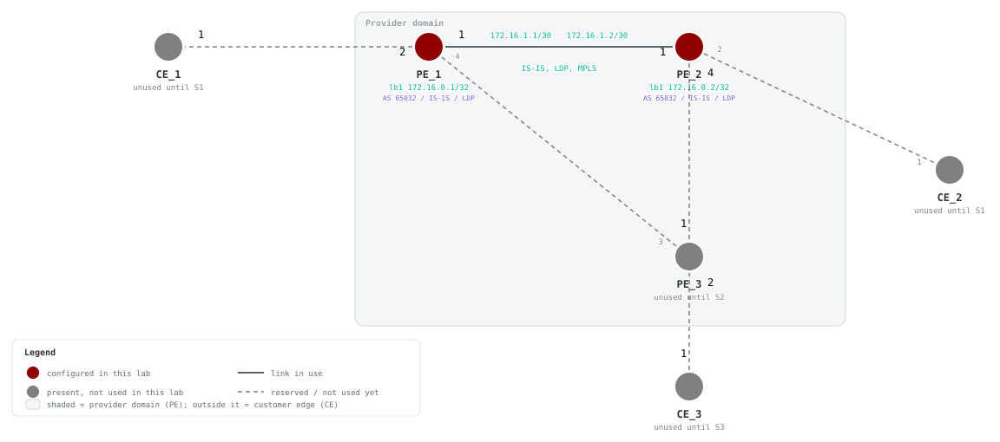

# F5 — Label Distribution Protocol (LDP)

## Goals

Explore LDP as an alternative MPLS transport branch. This lab starts from the
F2 IS-IS baseline and does not require F3 SR-MPLS or F4 BGP.

By the end of this lab you will be able to:

- Enable MPLS forwarding on the core interfaces
- Configure an LDP instance with a loopback-based LSR ID
- Form and verify the LDP adjacency over the IS-IS core link
- Verify label bindings for the PE loopbacks

## Prerequisites

- Complete F1 and F2, or deploy this lab with its included F2 baseline.
- F3 and F4 are not prerequisites; F5 is the alternative LDP branch.
- Make the SAOS 10x image `vrnetlab/ciena_saos:10-12-00-0228` (release 10.12.00.0228) available to Containerlab.
- Activate the built-in trial license after deployment.

## Topology




PE_1 and PE_2 use port 1 for the IS-IS and LDP core link.

### LDP addressing

| Node | LDP LSR ID | Core address |
| --- | --- | --- |
| PE_1 | 172.16.0.1 | 172.16.1.1/30 |
| PE_2 | 172.16.0.2 | 172.16.1.2/30 |

## Deploy

### Startup Configs

The checkpoint baseline each node boots from. If you are assembling the lab by hand, create a `configs/` folder next to [`topo.clab.yml`](./topo.clab.yml) and copy each file into it before you deploy.

- [PE_1.cfg.partial](./configs/PE_1.cfg.partial)
- [PE_2.cfg.partial](./configs/PE_2.cfg.partial)
- [PE_3.cfg.partial](./configs/PE_3.cfg.partial)
- [CE_1.cfg.partial](./configs/CE_1.cfg.partial)
- [CE_2.cfg.partial](./configs/CE_2.cfg.partial)

### Containerlab topology

Download the topology file: [`topo.clab.yml`](./topo.clab.yml)

```yaml
name: F5-LDP
topology:
  defaults:
    kind: ciena_saos
    image: vrnetlab/ciena_saos:10-12-00-0228
    labels:
      lab-mode: hands-on
      prereq-lab: F2-IS-IS-Routing
  nodes:
    PE_1:
      type: '5162'
      startup-config: configs/PE_1.cfg.partial
    PE_2:
      type: '5162'
      startup-config: configs/PE_2.cfg.partial
    PE_3:
      type: '5162'
      labels:
        lab-state: unused
      startup-config: configs/PE_3.cfg.partial
    CE_1:
      type: '3984'
      labels:
        lab-state: unused
      startup-config: configs/CE_1.cfg.partial
    CE_2:
      type: '3984'
      labels:
        lab-state: unused
      startup-config: configs/CE_2.cfg.partial
  links:
  - endpoints: [ "PE_1:1", "PE_2:1" ]
  - endpoints: [ "PE_1:2", "CE_1:1" ]
  - endpoints: [ "PE_2:2", "CE_2:1" ]
  - endpoints: [ "PE_2:4", "PE_3:1" ]
  - endpoints: [ "PE_1:4", "PE_3:3" ]
  - endpoints: [ "CE_2:2", "PE_3:2" ]
```

### Start from checkpoint

```bash
LAB=F5-LDP
cd labs/${LAB}            # from the repo root, or cd into the unpacked directory
containerlab deploy -t topo.clab.yml
```

Equivalent invocation from the repo root:

```bash
containerlab deploy -t "labs/${LAB}/topo.clab.yml"
```

Connect to the active PEs:

```bash
ssh diag@clab-F5-LDP-PE_1
ssh diag@clab-F5-LDP-PE_2
```

Default credentials: `diag` / `ciena123`

## Instructions

<!-- task-index -->
- [Task 1: Configure LDP on PE_1](#task-1)
- [Task 2: Configure LDP on PE_2](#task-2)
- [Task 3: Verify the alternative transport](#task-3)

<a id="task-1"></a>
### Task 1: Configure LDP on PE_1
<a href="#task-1" title="Direct link to this task (right-click to copy)">🔗</a>

<!-- prose: in-depth -->

**Summary** — The preloaded baseline is the familiar IS-IS underlay:
instance `Bootcamp` runs level-1 between `PE_1` and `PE_2` over
`PE_1-PE_2-if`, with loopbacks `172.16.0.1` and `172.16.0.2` as router
identities. This lab layers a different MPLS transport on top of it — LDP.

**Background** — LDP is a protocol that signals label bindings dynamically
instead of deriving them from IGP-advertised segments the way SR does.
Neighbors are discovered by hello messages sent on LDP-enabled interfaces,
and each router presents itself with an LSR ID — the stable identity every
peer will know this router by.

**Implementation** — On `PE_1` that takes three moves. First, allow the
dataplane to switch labels at all by turning on label switching for the
core interface `PE_1-PE_2-if` and the loopback `lb1` under MPLS. Second,
create the `default` LDP instance and anchor its LSR ID to the loopback
address `172.16.0.1`. Third, enable IPv4 LDP on `PE_1-PE_2-if`, which is
what actually starts hello messages leaving that interface.

**Configure** (config mode) on **PE_1**:

```saos-config
mpls interfaces interface PE_1-PE_2-if label-switching true
mpls interfaces interface lb1 label-switching true
ldp instance default lsr-id 172.16.0.1
ldp instance default interfaces interface PE_1-PE_2-if enable-ipv4 true
```

<!-- verify-prose -->

LDP state is single-ended at first: the moment the instance exists, `show
ldp` should report the local LSR ID `172.16.0.1` — that alone is what this
task's check looks for. Would you expect any adjacency to appear yet? `PE_2`
is not speaking LDP, so hellos sent on `PE_1-PE_2-if` have no listener; a
one-sided view here is healthy, not broken.

Why anchor the LSR ID to `lb1` rather than the link address `172.16.1.1`?
The loopback never goes down with a physical port, so the router's LDP
identity — and the TCP session later built to it — survives topology
changes.

**Verify** (show mode) on **PE_1**:

```saos-show
show ldp
```

Pass: Output contains `172.16.0.1`

<details><summary>Example output</summary>

```
+---------------------- LDP STATE ----------------------+
| Name                         | Value                  |
+------------------------------+------------------------+
| Instance                     | default                |
| Version                      | 1                      |
| FEC Count                    | 3                      |
| Session Count                | Total:1     UP:1       |
| Targeted Count               | Total:0     UP:0       |
| PW Status TLV                | False                  |
| Inter-area LSP               | False                  |
| Neighbor Liveness (s)        | 120                    |
| Max Recovery (s)             | 120                    |
| GR helper-enable             | True                   |
| GR enable                    | False                  |
| Router ID                    | 172.16.0.1             |
| Advertisement Mode           | downstream-unsolicited |
| Label Retention Mode         | liberal                |
| Label Control Mode           | ordered                |
| Targeted Hello Hold Time (s) | 45                     |
| Targeted Hello Interval (s)  | 15                     |
| Hold Time (s)                | 15                     |
| Hello Interval (s)           | 5                      |
| Keepalive Interval (s)       | 10                     |
| Keepalive Timeout (s)        | 30                     |
| Label Space                  | 0                      |
| Transport Address            | 172.16.0.1             |
+------------------------------+------------------------+
```

</details>

<a id="task-2"></a>
### Task 2: Configure LDP on PE_2
<a href="#task-2" title="Direct link to this task (right-click to copy)">🔗</a>

<!-- prose: simple -->

Mirror Task 1 on `PE_2` — the same three moves, deliberately symmetric;
only the LSR ID differs, because it must be unique per router:

- label switching on for `PE_1-PE_2-if` and `lb1`
- the `default` LDP instance with LSR ID `172.16.0.2`
- IPv4 LDP enabled on `PE_1-PE_2-if`

**Configure** (config mode) on **PE_2**:

```saos-config
mpls interfaces interface PE_1-PE_2-if label-switching true
mpls interfaces interface lb1 label-switching true
ldp instance default lsr-id 172.16.0.2
ldp instance default interfaces interface PE_1-PE_2-if enable-ipv4 true
```

<!-- verify-prose -->

Completing this side is what turns the protocol two-ended: both routers are
now sourcing hellos on the shared link, so discovery, the session, and label
exchange can all begin.

As on `PE_1`, the local view should immediately show the LSR ID `172.16.0.2`
— that is the check for this task. But the more interesting question is what
changes beyond it: with hellos now flowing both ways on `PE_1-PE_2-if`,
would you expect the two routers to discover each other, and roughly how
quickly? The next task puts that expectation to the test.

**Verify** (show mode) on **PE_2**:

```saos-show
show ldp
```

Pass: Output contains `172.16.0.2`

<details><summary>Example output</summary>

```
+---------------------- LDP STATE ----------------------+
| Name                         | Value                  |
+------------------------------+------------------------+
| Instance                     | default                |
| Version                      | 1                      |
| FEC Count                    | 3                      |
| Session Count                | Total:1     UP:1       |
| Targeted Count               | Total:0     UP:0       |
| PW Status TLV                | False                  |
| Inter-area LSP               | False                  |
| Neighbor Liveness (s)        | 120                    |
| Max Recovery (s)             | 120                    |
| GR helper-enable             | True                   |
| GR enable                    | False                  |
| Router ID                    | 172.16.0.2             |
| Advertisement Mode           | downstream-unsolicited |
| Label Retention Mode         | liberal                |
| Label Control Mode           | ordered                |
| Targeted Hello Hold Time (s) | 45                     |
| Targeted Hello Interval (s)  | 15                     |
| Hold Time (s)                | 15                     |
| Hello Interval (s)           | 5                      |
| Keepalive Interval (s)       | 10                     |
| Keepalive Timeout (s)        | 30                     |
| Label Space                  | 0                      |
| Transport Address            | 172.16.0.2             |
+------------------------------+------------------------+
```

</details>

<a id="task-3"></a>
### Task 3: Verify the alternative transport
<a href="#task-3" title="Direct link to this task (right-click to copy)">🔗</a>

<!-- prose: detailed -->

**Summary** — This task is verification only — no configuration changes. It
is worth separating two things LDP builds in sequence: first a hello
adjacency, formed when each router hears the other's discovery hellos on
`PE_1-PE_2-if`; then a session between the two LSR IDs, over which the
routers exchange label bindings for the IPv4 prefixes they learned from IS-
IS — including each other's loopback /32s.

**Implementation** — Nothing to configure; inspect the end product, which
lives in the MPLS forwarding tables: an FTN (FEC-to-NHLFE) entry that maps
traffic destined to the remote loopback onto a label push out
`PE_1-PE_2-if`. That entry is the proof that a labeled transport path now
exists between the PEs, signaled entirely by LDP.

<!-- verify-prose -->

On `PE_1`, the LDP adjacency view should list peer `172.16.0.2` learned via
`PE_1-PE_2-if`; `PE_2` should show the mirror image with `172.16.0.1`.
Seeing the peer's LSR ID here confirms bidirectional hello exchange —
remember this state could not exist until both Tasks 1 and 2 were done.

Then the FTN table on each PE should hold a `push` entry for the remote
loopback (`172.16.0.2` from `PE_1`, `172.16.0.1` from `PE_2`) out
`PE_1-PE_2-if` — LDP bound a label to a prefix that IS-IS put in the routing
table. Discovery, session setup, and label distribution take time, so expect
these entries to appear within a couple of minutes of finishing Task 2; the
checks allow for that.

If the adjacency shows but the FTN entry never does, what would you inspect
— the LDP session between the LSR IDs, or whether IS-IS is advertising the
IPv4 loopback at all?

<!-- retry: 120s -->
**Verify** (show mode) on **PE_1**:

```saos-show
show ldp adjacencies
```

Pass: Output contains `172.16.0.2` and `PE_1-PE_2-if`

<details><summary>Example output</summary>

```
+----------------------- LDP ADJACENCY STATE ------------------------+
|            |              |  Hold    |                |            |
| IP Address |    Interface | Time (s) | LDP Identifier |    Type    |
+------------+--------------+----------+----------------+------------+
| 172.16.1.2 | PE_1-PE_2-if |    15    |     172.16.0.2 | LINK HELLO |
+------------+--------------+----------+----------------+------------+
```

</details>

<!-- retry: 120s -->
**Verify** (show mode) on **PE_2**:

```saos-show
show ldp adjacencies
```

Pass: Output contains `172.16.0.1` and `PE_1-PE_2-if`

<details><summary>Example output</summary>

```
+----------------------- LDP ADJACENCY STATE ------------------------+
|            |              |  Hold    |                |            |
| IP Address |    Interface | Time (s) | LDP Identifier |    Type    |
+------------+--------------+----------+----------------+------------+
| 172.16.1.1 | PE_1-PE_2-if |    15    |     172.16.0.1 | LINK HELLO |
+------------+--------------+----------+----------------+------------+
```

</details>

<!-- retry: 120s -->
**Verify** (show mode) on **PE_1**:

```saos-show
show mpls ftn-table
```

Pass: Output contains `PE_1-PE_2-if` and `172.16.0.2` and `push`

<details><summary>Example output</summary>

```
+--------------------------------------------------------------------------------------------------------------------+
| Codes: > - installed FTN, * - selected FTN, p - stale FTN, b - backup route                                        |
|        B - BGP FTN, K - CLI FTN, t - tunnel                                                                        |
|        L - LDP FTN, R - RSVP-TE FTN, S - SNMP FTN, I - IGP-Shortcut,                                               |
|        U - unknown FTN, O - SR-OSPF FTN, i - SR-ISIS FTN, k - SR-CLI FTN,                                          |
|        s - SR-TE FTN,  ip - IP-ISIS FTN, io - IP-OSPF FTN, ib - IP-BGP FTN,                                        |
|        M - MPLS-TP FTN, ias - IAS FTN, v - VPN FTN,                                                                |
|        m - PW-MPLS FTN, e - EVPN FTN                                                                               |
|        C - Color, Tn - Tunnel Name, f - Fallback, ML - Multicast LDP, IR - Ingress-Replication, F - Flex-Algorithm |
+--------------------------------------------------------------------------------------------------------------------+
+------------------------------------------------------------------------------- MPLS FTN TABLE -------------------------------------------------------------------------------+
|          |                    |                                      |        |          Label          |                  |                 |  Oper  | Admin  |    Inner    |
|   Code   |        FEC         |              Qualifiers              | OpCode |     In     |    Out     |  Out Interface   |     Next Hop    | Status | Status | Label Stack |
+----------+--------------------+--------------------------------------+--------+------------+------------+------------------+-----------------+--------+--------+-------------+
| L *>     | 172.16.0.2/32      | -                                    |  push  | -          | 3          | PE_1-PE_2-if     | 172.16.1.2      |   Up   |   Up   |             |
+----------+--------------------+--------------------------------------+--------+------------+------------+------------------+-----------------+--------+--------+-------------+
```

</details>

<!-- retry: 120s -->
**Verify** (show mode) on **PE_2**:

```saos-show
show mpls ftn-table
```

Pass: Output contains `PE_1-PE_2-if` and `172.16.0.1` and `push`

<details><summary>Example output</summary>

```
+--------------------------------------------------------------------------------------------------------------------+
| Codes: > - installed FTN, * - selected FTN, p - stale FTN, b - backup route                                        |
|        B - BGP FTN, K - CLI FTN, t - tunnel                                                                        |
|        L - LDP FTN, R - RSVP-TE FTN, S - SNMP FTN, I - IGP-Shortcut,                                               |
|        U - unknown FTN, O - SR-OSPF FTN, i - SR-ISIS FTN, k - SR-CLI FTN,                                          |
|        s - SR-TE FTN,  ip - IP-ISIS FTN, io - IP-OSPF FTN, ib - IP-BGP FTN,                                        |
|        M - MPLS-TP FTN, ias - IAS FTN, v - VPN FTN,                                                                |
|        m - PW-MPLS FTN, e - EVPN FTN                                                                               |
|        C - Color, Tn - Tunnel Name, f - Fallback, ML - Multicast LDP, IR - Ingress-Replication, F - Flex-Algorithm |
+--------------------------------------------------------------------------------------------------------------------+
+------------------------------------------------------------------------------- MPLS FTN TABLE -------------------------------------------------------------------------------+
|          |                    |                                      |        |          Label          |                  |                 |  Oper  | Admin  |    Inner    |
|   Code   |        FEC         |              Qualifiers              | OpCode |     In     |    Out     |  Out Interface   |     Next Hop    | Status | Status | Label Stack |
+----------+--------------------+--------------------------------------+--------+------------+------------+------------------+-----------------+--------+--------+-------------+
| L *>     | 172.16.0.1/32      | -                                    |  push  | -          | 3          | PE_1-PE_2-if     | 172.16.1.1      |   Up   |   Up   |             |
+----------+--------------------+--------------------------------------+--------+------------+------------+------------------+-----------------+--------+--------+-------------+
```

</details>

## Tests

Deploy `F5-LDP`, then run the following validation checks.

### G1: Task 1 — Configure LDP on PE_1

On **PE_1**, run:

```saos
show ldp
```

Pass: Output contains `172.16.0.1`

<details><summary>Example output</summary>

```
+---------------------- LDP STATE ----------------------+
| Name                         | Value                  |
+------------------------------+------------------------+
| Instance                     | default                |
| Version                      | 1                      |
| FEC Count                    | 3                      |
| Session Count                | Total:1     UP:1       |
| Targeted Count               | Total:0     UP:0       |
| PW Status TLV                | False                  |
| Inter-area LSP               | False                  |
| Neighbor Liveness (s)        | 120                    |
| Max Recovery (s)             | 120                    |
| GR helper-enable             | True                   |
| GR enable                    | False                  |
| Router ID                    | 172.16.0.1             |
| Advertisement Mode           | downstream-unsolicited |
| Label Retention Mode         | liberal                |
| Label Control Mode           | ordered                |
| Targeted Hello Hold Time (s) | 45                     |
| Targeted Hello Interval (s)  | 15                     |
| Hold Time (s)                | 15                     |
| Hello Interval (s)           | 5                      |
| Keepalive Interval (s)       | 10                     |
| Keepalive Timeout (s)        | 30                     |
| Label Space                  | 0                      |
| Transport Address            | 172.16.0.1             |
+------------------------------+------------------------+
```

</details>

### G2: Task 2 — Configure LDP on PE_2

On **PE_2**, run:

```saos
show ldp
```

Pass: Output contains `172.16.0.2`

<details><summary>Example output</summary>

```
+---------------------- LDP STATE ----------------------+
| Name                         | Value                  |
+------------------------------+------------------------+
| Instance                     | default                |
| Version                      | 1                      |
| FEC Count                    | 3                      |
| Session Count                | Total:1     UP:1       |
| Targeted Count               | Total:0     UP:0       |
| PW Status TLV                | False                  |
| Inter-area LSP               | False                  |
| Neighbor Liveness (s)        | 120                    |
| Max Recovery (s)             | 120                    |
| GR helper-enable             | True                   |
| GR enable                    | False                  |
| Router ID                    | 172.16.0.2             |
| Advertisement Mode           | downstream-unsolicited |
| Label Retention Mode         | liberal                |
| Label Control Mode           | ordered                |
| Targeted Hello Hold Time (s) | 45                     |
| Targeted Hello Interval (s)  | 15                     |
| Hold Time (s)                | 15                     |
| Hello Interval (s)           | 5                      |
| Keepalive Interval (s)       | 10                     |
| Keepalive Timeout (s)        | 30                     |
| Label Space                  | 0                      |
| Transport Address            | 172.16.0.2             |
+------------------------------+------------------------+
```

</details>

### G3: Task 3 — Verify the alternative transport

<!-- retry: 120s -->
On **PE_1**, run:

```saos
show ldp adjacencies
```

Pass: Output contains `172.16.0.2` and `PE_1-PE_2-if`

<details><summary>Example output</summary>

```
+----------------------- LDP ADJACENCY STATE ------------------------+
|            |              |  Hold    |                |            |
| IP Address |    Interface | Time (s) | LDP Identifier |    Type    |
+------------+--------------+----------+----------------+------------+
| 172.16.1.2 | PE_1-PE_2-if |    15    |     172.16.0.2 | LINK HELLO |
+------------+--------------+----------+----------------+------------+
```

</details>

<!-- retry: 120s -->
On **PE_2**, run:

```saos
show ldp adjacencies
```

Pass: Output contains `172.16.0.1` and `PE_1-PE_2-if`

<details><summary>Example output</summary>

```
+----------------------- LDP ADJACENCY STATE ------------------------+
|            |              |  Hold    |                |            |
| IP Address |    Interface | Time (s) | LDP Identifier |    Type    |
+------------+--------------+----------+----------------+------------+
| 172.16.1.1 | PE_1-PE_2-if |    15    |     172.16.0.1 | LINK HELLO |
+------------+--------------+----------+----------------+------------+
```

</details>

<!-- retry: 120s -->
On **PE_1**, run:

```saos
show mpls ftn-table
```

Pass: Output contains `PE_1-PE_2-if` and `172.16.0.2` and `push`

<details><summary>Example output</summary>

```
+--------------------------------------------------------------------------------------------------------------------+
| Codes: > - installed FTN, * - selected FTN, p - stale FTN, b - backup route                                        |
|        B - BGP FTN, K - CLI FTN, t - tunnel                                                                        |
|        L - LDP FTN, R - RSVP-TE FTN, S - SNMP FTN, I - IGP-Shortcut,                                               |
|        U - unknown FTN, O - SR-OSPF FTN, i - SR-ISIS FTN, k - SR-CLI FTN,                                          |
|        s - SR-TE FTN,  ip - IP-ISIS FTN, io - IP-OSPF FTN, ib - IP-BGP FTN,                                        |
|        M - MPLS-TP FTN, ias - IAS FTN, v - VPN FTN,                                                                |
|        m - PW-MPLS FTN, e - EVPN FTN                                                                               |
|        C - Color, Tn - Tunnel Name, f - Fallback, ML - Multicast LDP, IR - Ingress-Replication, F - Flex-Algorithm |
+--------------------------------------------------------------------------------------------------------------------+
+------------------------------------------------------------------------------- MPLS FTN TABLE -------------------------------------------------------------------------------+
|          |                    |                                      |        |          Label          |                  |                 |  Oper  | Admin  |    Inner    |
|   Code   |        FEC         |              Qualifiers              | OpCode |     In     |    Out     |  Out Interface   |     Next Hop    | Status | Status | Label Stack |
+----------+--------------------+--------------------------------------+--------+------------+------------+------------------+-----------------+--------+--------+-------------+
| L *>     | 172.16.0.2/32      | -                                    |  push  | -          | 3          | PE_1-PE_2-if     | 172.16.1.2      |   Up   |   Up   |             |
+----------+--------------------+--------------------------------------+--------+------------+------------+------------------+-----------------+--------+--------+-------------+
```

</details>

<!-- retry: 120s -->
On **PE_2**, run:

```saos
show mpls ftn-table
```

Pass: Output contains `PE_1-PE_2-if` and `172.16.0.1` and `push`

<details><summary>Example output</summary>

```
+--------------------------------------------------------------------------------------------------------------------+
| Codes: > - installed FTN, * - selected FTN, p - stale FTN, b - backup route                                        |
|        B - BGP FTN, K - CLI FTN, t - tunnel                                                                        |
|        L - LDP FTN, R - RSVP-TE FTN, S - SNMP FTN, I - IGP-Shortcut,                                               |
|        U - unknown FTN, O - SR-OSPF FTN, i - SR-ISIS FTN, k - SR-CLI FTN,                                          |
|        s - SR-TE FTN,  ip - IP-ISIS FTN, io - IP-OSPF FTN, ib - IP-BGP FTN,                                        |
|        M - MPLS-TP FTN, ias - IAS FTN, v - VPN FTN,                                                                |
|        m - PW-MPLS FTN, e - EVPN FTN                                                                               |
|        C - Color, Tn - Tunnel Name, f - Fallback, ML - Multicast LDP, IR - Ingress-Replication, F - Flex-Algorithm |
+--------------------------------------------------------------------------------------------------------------------+
+------------------------------------------------------------------------------- MPLS FTN TABLE -------------------------------------------------------------------------------+
|          |                    |                                      |        |          Label          |                  |                 |  Oper  | Admin  |    Inner    |
|   Code   |        FEC         |              Qualifiers              | OpCode |     In     |    Out     |  Out Interface   |     Next Hop    | Status | Status | Label Stack |
+----------+--------------------+--------------------------------------+--------+------------+------------+------------------+-----------------+--------+--------+-------------+
| L *>     | 172.16.0.1/32      | -                                    |  push  | -          | 3          | PE_1-PE_2-if     | 172.16.1.1      |   Up   |   Up   |             |
+----------+--------------------+--------------------------------------+--------+------------+------------+------------------+-----------------+--------+--------+-------------+
```

</details>

## Solutions

Use the preloaded baseline for context, then apply the learner solution blocks in task order.

### Preloaded baseline

#### PE_1

```saos
# Preloaded start
system config hostname PE_1
fds fd PE_1-PE_2-FD mode vpls
oc-if:interfaces interface lb1 config name lb1 type loopback
oc-if:interfaces interface lb1 ipv4 addresses address 172.16.0.1 config ip 172.16.0.1 prefix-length 32
oc-if:interfaces interface lb1 ipv6 addresses address FC00::1 config ip FC00::1 prefix-length 128
oc-if:interfaces interface PE_1-PE_2-if config mtu 1500 name PE_1-PE_2-if type ip
oc-if:interfaces interface PE_1-PE_2-if config underlay-binding config fd PE_1-PE_2-FD
oc-if:interfaces interface PE_1-PE_2-if ipv4 addresses address 172.16.1.1 config ip 172.16.1.1 prefix-length 30
oc-if:interfaces interface PE_1-PE_2-if ipv6 addresses address FC00::600 config ip FC00::600 prefix-length 127
classifiers classifier CLASSIFIER-UNTAGGED filter-entry vtag-stack untagged-exclude-priority-tagged false
fps fp PE_1-PE_2-FP classifier-list-precedence 7 fd-name PE_1-PE_2-FD logical-port 1 mtu-size 2000 stats-collection on classifier-list CLASSIFIER-UNTAGGED
isis instance Bootcamp level-type level-1 net 49.0001.0172.0016.0001.00
isis instance Bootcamp interfaces interface lb1 interface-type point-to-point
isis instance Bootcamp interfaces interface lb1 address-families address-family ipv6 unicast
isis instance Bootcamp interfaces interface PE_1-PE_2-if interface-type point-to-point level-type level-1
isis instance Bootcamp interfaces interface PE_1-PE_2-if address-families address-family ipv6 unicast
isis instance Bootcamp interfaces interface PE_1-PE_2-if level-1 password ciena123
# Preloaded end
```

#### PE_2

```saos
# Preloaded start
system config hostname PE_2
fds fd PE_1-PE_2-FD mode vpls
oc-if:interfaces interface lb1 config name lb1 type loopback
oc-if:interfaces interface lb1 ipv4 addresses address 172.16.0.2 config ip 172.16.0.2 prefix-length 32
oc-if:interfaces interface lb1 ipv6 addresses address FC00::2 config ip FC00::2 prefix-length 128
oc-if:interfaces interface PE_1-PE_2-if config mtu 1500 name PE_1-PE_2-if type ip
oc-if:interfaces interface PE_1-PE_2-if config underlay-binding config fd PE_1-PE_2-FD
oc-if:interfaces interface PE_1-PE_2-if ipv4 addresses address 172.16.1.2 config ip 172.16.1.2 prefix-length 30
oc-if:interfaces interface PE_1-PE_2-if ipv6 addresses address FC00::601 config ip FC00::601 prefix-length 127
classifiers classifier CLASSIFIER-UNTAGGED filter-entry vtag-stack untagged-exclude-priority-tagged false
fps fp PE_1-PE_2-FP classifier-list-precedence 7 fd-name PE_1-PE_2-FD logical-port 1 mtu-size 2000 stats-collection on classifier-list CLASSIFIER-UNTAGGED
isis instance Bootcamp level-type level-1 net 49.0001.0172.0016.0002.00
isis instance Bootcamp interfaces interface lb1 interface-type point-to-point
isis instance Bootcamp interfaces interface lb1 address-families address-family ipv6 unicast
isis instance Bootcamp interfaces interface PE_1-PE_2-if interface-type point-to-point level-type level-1
isis instance Bootcamp interfaces interface PE_1-PE_2-if address-families address-family ipv6 unicast
isis instance Bootcamp interfaces interface PE_1-PE_2-if level-1 password ciena123
# Preloaded end
```

#### PE_3

```saos
# Preloaded start
system config hostname PE_3
# Preloaded end
```

#### CE_1

```saos
# Preloaded start
system config hostname CE_1
# Preloaded end
```

#### CE_2

```saos
# Preloaded start
system config hostname CE_2
# Preloaded end
```

### Solution for Task 1

#### PE_1

```saos
# Task 1 start
mpls interfaces interface PE_1-PE_2-if label-switching true
mpls interfaces interface lb1 label-switching true
ldp instance default lsr-id 172.16.0.1
ldp instance default interfaces interface PE_1-PE_2-if enable-ipv4 true
# Task 1 end
```

### Solution for Task 2

#### PE_2

```saos
# Task 2 start
mpls interfaces interface PE_1-PE_2-if label-switching true
mpls interfaces interface lb1 label-switching true
ldp instance default lsr-id 172.16.0.2
ldp instance default interfaces interface PE_1-PE_2-if enable-ipv4 true
# Task 2 end
```

### Solution for Task 3

No configuration commands; this is a verification-only task.
