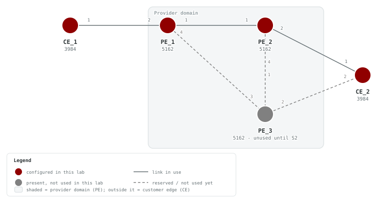
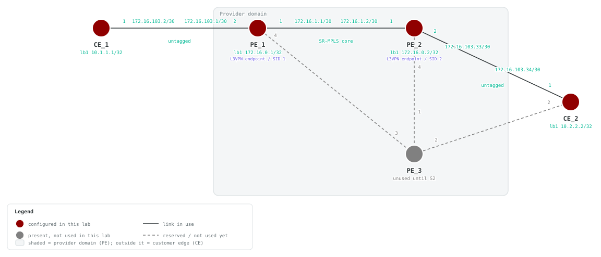

# S1 — L3VPN Route Leaking with L3VPN_2-vrf

## Goals

This lab builds directly on the F4 SR-MPLS/iBGP underlay (`PE_1`,
`PE_2`, AS 65032, and ISIS `Bootcamp`) and introduces the first L3VPN
services. By the end of this lab you will be able to:

- Stand up a second, fully independent L3VPN — `L3VPN_2-vrf` — on `PE_1`
  and `PE_2`, realized as an in-VRF loopback (`lb2`) plus its own BGP
  VRF instance.
- Configure `L3VPN_2-vrf`'s route-distinguisher and route-target exactly
  as you did for `L3VPN_1-vrf`, keeping the two VRFs isolated by default.
- Deliberately break that isolation with a **route leak**: import
  `L3VPN_2-vrf`'s route-target (`0:104:1`) into `L3VPN_1-vrf`, and
  `L3VPN_1-vrf`'s route-target (`0:103:1`) into `L3VPN_2-vrf`, so each VRF
  learns the other's connected prefixes over the vpnv4 core.
- Confirm the two CE routers (`CE_1`, `CE_2`), which sit in `L3VPN_1-vrf`
  behind `PE_1` and `PE_2`, are completely unaffected by the
  change — they never touch `L3VPN_2-vrf` directly.

**Reasoning prompt:** `L3VPN_1-vrf` and `L3VPN_2-vrf` live on the *same*
PE routers and share the *same* MP-BGP session. What, specifically,
keeps their routes apart before you add the cross-import — and what
single BGP knob removes that separation once you add it?

## Prerequisites

- Complete F1 through F4, or deploy this lab with its included F4
  SR-MPLS/ISIS and iBGP baseline. This lab creates both L3VPN VRFs; F4 does
  not provide an existing L3VPN service.
- containerlab installed, with the SAOS 10x image
  `vrnetlab/ciena_saos:10-12-00-0228` (release 10.12.00.0228) available
  locally.
- Activate the built-in trial license after deployment.

## Topology





The topology already has the complete five-node S2 physical shape. `PE_1`
and `PE_2` are the inherited F4 SR-MPLS/iBGP PE routers (AS 65032, ISIS
area `49.0001`), each now carrying two L3VPNs. `CE_1` and `CE_2` are active
customer-edge routers, each single-homed to one PE over an untagged access
link. `PE_3` and its three links remain gray and unused until S2.

### Active links

| Link | Purpose |
|---|---|
| PE_1 port 1 — PE_2 port 1 | SR-MPLS/ISIS core link (inherited F4 underlay, untagged trunk) |
| PE_1 port 2 — CE_1 port 1 | `L3VPN_1-vrf` access (untagged) |
| PE_2 port 2 — CE_2 port 1 | `L3VPN_1-vrf` access (untagged) |

### PE_1 addressing

| Interface | Address | Prefix-length | VLAN | Notes |
|---|---|---|---|---|
| `lb1` | 172.16.0.1 | /32 | — | loopback / BGP router-id / ISIS SR node-SID (F4) |
| `lb10` | 10.65.0.32 | /32 | — | redistribution loopback, community `65032:100` (F4) |
| `PE_1-PE_2-if` | 172.16.1.1 | /30 | untagged | core link to PE_2 (F4) |
| `CE_1-PE_1-if` | 172.16.103.1 | /30 | untagged | `L3VPN_1-vrf` access to CE_1 |
| `lb2` | 172.16.104.1 | /32 | — | `L3VPN_2-vrf` in-VRF loopback, no CE peer |

### PE_2 addressing

| Interface | Address | Prefix-length | VLAN | Notes |
|---|---|---|---|---|
| `lb1` | 172.16.0.2 | /32 | — | loopback / BGP router-id / ISIS SR node-SID (F4) |
| `lb10` | 10.65.0.33 | /32 | — | redistribution loopback, community `65032:100` (F4) |
| `PE_1-PE_2-if` | 172.16.1.2 | /30 | untagged | core link to PE_1 (F4) |
| `CE_2-PE_2-if` | 172.16.103.33 | /30 | untagged | `L3VPN_1-vrf` access to CE_2 |
| `lb2` | 172.16.104.33 | /32 | — | `L3VPN_2-vrf` in-VRF loopback, no CE peer |

### CE_1 / CE_2 addressing

| Node | Interface | Address | Prefix-length | VLAN | Notes |
|---|---|---|---|---|---|
| `CE_1` | `lb1` | 10.1.1.1 | /32 | — | CE_1 loopback identity |
| `CE_1` | `CE_1-PE_1-if` | 172.16.103.2 | /30 | untagged | access link to PE_1 |
| `CE_2` | `lb1` | 10.2.2.2 | /32 | — | CE_2 loopback identity |
| `CE_2` | `CE_2-PE_2-if` | 172.16.103.34 | /30 | untagged | access link to PE_2 |

### VRF route-target plan

| VRF | Route-distinguisher | Route-target (both) | Imported route-target (leak) |
|---|---|---|---|
| `L3VPN_1-vrf` | 0:103:1 | 0:103:1 | 0:104:1 |
| `L3VPN_2-vrf` | 0:104:1 | 0:104:1 | 0:103:1 |

> **SAOS display note:** every IPv4 address above shows on-box as two
> separate fields — `ip <addr>` and `prefix-length <n>` — never as
> CIDR (`/n`) notation. The inherited `lb1` IPv6 addresses
> (`FC00::1/128`, `FC00::2/128`) likewise render fully expanded, not
> as CIDR or with `::` shorthand collapsed further than the address
> itself already is.

## Deploy

### Startup Configs

The checkpoint baseline each node boots from. If you are assembling the lab by hand, create a `configs/` folder next to [`topo.clab.yml`](./topo.clab.yml) and copy each file into it before you deploy.

- [PE_1.cfg.partial](./configs/PE_1.cfg.partial)
- [PE_2.cfg.partial](./configs/PE_2.cfg.partial)
- [PE_3.cfg.partial](./configs/PE_3.cfg.partial)
- [CE_1.cfg.partial](./configs/CE_1.cfg.partial)
- [CE_2.cfg.partial](./configs/CE_2.cfg.partial)

### Containerlab topology

Download the topology file: [`topo.clab.yml`](./topo.clab.yml)

```yaml
name: S1-L3VPN
topology:
  defaults:
    kind: ciena_saos
    image: vrnetlab/ciena_saos:10-12-00-0228
    labels:
      lab-mode: hands-on
      prereq-lab: F4-BGP
  nodes:
    PE_1:
      type: '5162'
      startup-config: configs/PE_1.cfg.partial
    PE_2:
      type: '5162'
      startup-config: configs/PE_2.cfg.partial
    PE_3:
      type: '5162'
      labels:
        lab-state: unused
      startup-config: configs/PE_3.cfg.partial
    CE_1:
      type: '3984'
      startup-config: configs/CE_1.cfg.partial
    CE_2:
      type: '3984'
      startup-config: configs/CE_2.cfg.partial
  links:
  - endpoints: [ "PE_1:1", "PE_2:1" ]
  - endpoints: [ "PE_1:2", "CE_1:1" ]
  - endpoints: [ "PE_2:2", "CE_2:1" ]
  - endpoints: [ "PE_2:4", "PE_3:1" ]
  - endpoints: [ "PE_1:4", "PE_3:3" ]
  - endpoints: [ "CE_2:2", "PE_3:2" ]
```

### Start from checkpoint

```bash
LAB=S1-L3VPN
cd labs/${LAB}            # from the repo root, or cd into the unpacked directory
containerlab deploy -t topo.clab.yml
```

Equivalent invocation from the repo root:

```bash
containerlab deploy -t "labs/${LAB}/topo.clab.yml"
```

Once all five nodes reach healthy state, complete the S1 tasks on PE_1,
PE_2, CE_1, and CE_2:

```bash
ssh diag@clab-S1-L3VPN-PE_1
ssh diag@clab-S1-L3VPN-PE_2
ssh diag@clab-S1-L3VPN-CE_1
ssh diag@clab-S1-L3VPN-CE_2
```

Default credentials: `diag` / `ciena123`

## Instructions

<!-- task-index -->
- [Task 1: Verify the deployed topology](#task-1)
- [Task 2: Create the L3VPN_2-vrf VRF and its in-VRF loopback on PE_1 and PE_2](#task-2)
- [Task 3: Configure the BGP VRF instance for L3VPN_2-vrf](#task-3)
- [Task 4: Leak routes between L3VPN_1-vrf and L3VPN_2-vrf](#task-4)
- [Task 5: Confirm CE_1 and CE_2 are unaffected](#task-5)

> **Simulator note:** the containerlab image forwards VRF traffic
> between PE loopback/interface addresses and answers CPU-originated
> pings, but does not forward VPN-decapped transit traffic to hosts
> behind the access links (CE-to-CE across the VPN only works on
> hardware). The end-to-end checks therefore ping PE↔PE inside each
> VRF plus each CE's local gateway.

<a id="task-1"></a>
### Task 1: Verify the deployed topology
<a href="#task-1" title="Direct link to this task (right-click to copy)">🔗</a>

<!-- prose: detailed -->

**Summary** — Before configuring anything, take stock of what the lab hands
you. `PE_1` and `PE_2` come up with a complete transport baseline: an IS-IS
level-1 instance (`Bootcamp`) with segment routing enabled, MPLS label
switching on the core link, and an iBGP session in AS `65032` between the
`lb1` router-ids `172.16.0.1` and `172.16.0.2` with the vpnv4 family already
activated. That is everything an L3VPN needs underneath it — labeled
reachability between PE loopbacks and a signaling channel for VPN routes —
and none of it changes in this lab.

**Implementation** — Nothing to configure: this task just confirms the CE
side is healthy before you build the PE side. The customer edge is fully
preloaded: `CE_1` has `CE_1-PE_1-if` at `172.16.103.2/30` plus a loopback,
`CE_2` has `CE_2-PE_2-if` at `172.16.103.34/30` plus a loopback, and each CE
holds a static route pointing the far customer subnet at its PE gateway.
What the PEs do *not* yet have is any customer-facing configuration: no
VRFs, no CE-facing interfaces. `PE_3` is cabled into the topology but unused
here.

<!-- verify-prose -->

On each CE you should find the full untagged attachment stack, named per the
underlay convention: forwarding domain `CE_1-PE_1-FD` / `CE_2-PE_2-FD` in
`vpls` mode, the IP interface with its /30 address bound over that FD, and
flow point `CE_1-PE_1-FP` / `CE_2-PE_2-FP` matching `CLASSIFIER-UNTAGGED`. The
interfaces sit in the CE's default VRF — the CEs know nothing about VPNs,
now or ever in this lab.

Question to hold onto: could `CE_1` ping its gateway `172.16.103.1` right
now? Expect not — that address does not exist anywhere yet; creating the PE
side of these links is the next task.

**Verify** (show mode) on **CE_1**:

```saos-show
show forwarding-domains
```

Pass: Output contains `CE_1-PE_1-FD` and `vpls`

<details><summary>Example output</summary>

```
+ FORWARDING DOMAIN -+
| Name        | Mode |
+-------------+------+
| CE_1-PE_1-FD | vpls |
| remote-fd   | vpls |
+-------------+------+
```

</details>

**Verify** (show mode) on **CE_2**:

```saos-show
show forwarding-domains
```

Pass: Output contains `CE_2-PE_2-FD` and `vpls`

<details><summary>Example output</summary>

```
+ FORWARDING DOMAIN -+
| Name        | Mode |
+-------------+------+
| CE_2-PE_2-FD | vpls |
| remote-fd   | vpls |
+-------------+------+
```

</details>

**Verify** (show mode) on **CE_1**:

```saos-show
show ip interfaces
```

Pass: Output contains `CE_1-PE_1-if` and `172.16.103.2` and `30`

<details><summary>Example output</summary>

```
+-------------------------------------------------- IP INTERFACES STATE ---------------------------------------------------+
| Name                                       | Value                                                                       |
+--------------------------------------------+-----------------------------------------------------------------------------+
| Name                                       | mgmtbr0                                                                     |
| Oper Status                                | UP                                                                          |
| Admin Status                               | UP                                                                          |
| Type                                       | system                                                                      |
| Role                                       | management                                                                  |
| VRF Binding                                | default                                                                     |
| DHCP IPv4 Client                           | True                                                                        |
| DHCP IPv4 Address                          | 10.0.0.15                                                                   |
| DHCP IPv4 Prefix                           | 24                                                                          |
| IPv6 Link Local Data                       |                                                                             |
|   Address                                  | fe80::200:8bff:fea9:5b00                                                    |
|   Prefix Length                            | 128                                                                         |
|   Origin                                   | AUTO                                                                        |
| Interface Index                            | 20                                                                          |
| Description                                | bridge interface for out of band management port/local management interface |
| MTU                                        | 1500                                                                        |
| MAC Address                                | 0c:00:8b:a9:5b:00                                                           |
| Bandwidth (Mbps)                           | 0                                                                           |
| Gratuitous ARP                             | Disabled                                                                    |
| Unsolicited Neighbor Advertisement         | Disabled                                                                    |
| Router Advertisement                       | Disabled                                                                    |
| Counters                                   |                                                                             |
|   Input Octets                             | 24510                                                                       |
|   Input Packets                            | 376                                                                         |
|   Input Dropped Octets                     | -                                                                           |
|   Input Dropped Packets                    | 0                                                                           |
|   Output Octets                            | 85744                                                                       |
|   Output Packets                           | 409                                                                         |
|   Output Gratuitous ARP Packets            | -                                                                           |
|   Output Unsolicited Neighbor Adv. Packets | -                                                                           |
|   Output Router Adv. Packets               | 0                                                                           |
|   Output Router Adv. Octets                | 0                                                                           |
|   Input Router Solicitation Packets        | 0                                                                           |
|   Input Router Solicitation Octets         | 0                                                                           |
| DSCP Remarking                             |                                                                             |
|   Origin                                   | Not Configured                                                              |
|   Enabled                                  | False                                                                       |
| Duplicate Address Detection                |                                                                             |
|   Status                                   | Enabled                                                                     |
| IPv4 uRPF                                  |                                                                             |
|   Origin                                   | Not Configured                                                              |
|   Mode                                     | -                                                                           |
| IPv6 uRPF                                  |                                                                             |
|   Origin                                   | Not Configured                                                              |
|   Mode                                     | -                                                                           |
+--------------------------------------------+-----------------------------------------------------------------------------+
| Name                                       | remote                                                                      |
| Oper Status                                | UP                                                                          |
| Admin Status                               | UP                                                                          |
| Type                                       | ip                                                                          |
| Role                                       | management                                                                  |
| VRF Binding                                | default                                                                     |
| IPv6 Link Local Data                       |                                                                             |
|   Address                                  | fe80::e00:8bff:fea9:5af6                                                    |
|   Prefix Length                            | 64                                                                          |
|   Origin                                   | AUTO                                                                        |
|   Address Status                           | preferred                                                                   |
| Interface Index                            | 1073731825                                                                  |
| Description                                | in band remote management interface                                         |
| MTU                                        | 1500                                                                        |
| MAC Address                                | 0c:00:8b:a9:5a:f6                                                           |
| Last Changed                               | Aug 06 2026 20:50:02 Local                                                  |
| Bandwidth (Mbps)                           | 10000                                                                       |
| Gratuitous ARP                             | Enabled                                                                     |
| Unsolicited Neighbor Advertisement         | Enabled                                                                     |
| Router Advertisement                       | Disabled                                                                    |
| Underlay Binding                           | remote-fd                                                                   |
| Underlay Binding Type                      | Forwarding Domain                                                           |
| CoS to Frame Map                           | default-c2f                                                                 |
| Frame to CoS Map                           | default-f2c                                                                 |
| Stats Collection                           | on                                                                          |
| Counters                                   |                                                                             |
|   Input Octets                             | 0                                                                           |
|   Input Packets                            | 0                                                                           |
|   Input Dropped Octets                     | 0                                                                           |
|   Input Dropped Packets                    | 0                                                                           |
|   Output Octets                            | 0                                                                           |
|   Output Packets                           | 0                                                                           |
|   Output Gratuitous ARP Packets            | -                                                                           |
|   Output Unsolicited Neighbor Adv. Packets | -                                                                           |
|   Output Router Adv. Packets               | 0                                                                           |
|   Output Router Adv. Octets                | 0                                                                           |
|   Input Router Solicitation Packets        | 0                                                                           |
|   Input Router Solicitation Octets         | 0                                                                           |
| DSCP Remarking                             |                                                                             |
|   Origin                                   | Not Configured                                                              |
|   Enabled                                  | False                                                                       |
| Duplicate Address Detection                |                                                                             |
|   Status                                   | Enabled                                                                     |
| Flow Point(s)                              | remote-fp1, remote-fp2, remote-fp3, remote-fp4, remote-fp5, remote-fp6      |
| Logical Port(s)                            | 1, 2, 3, 4, 5, 6                                                            |
| Classifier(s)                              | default-vid-127, default-vid-127, default-vid-127, default-vid-127,         |
|                                            | default-vid-127, default-vid-127                                            |
| IPv4 uRPF                                  |                                                                             |
|   Origin                                   | Not Configured                                                              |
|   Mode                                     | -                                                                           |
| IPv6 uRPF                                  |                                                                             |
|   Origin                                   | Not Configured                                                              |
|   Mode                                     | -                                                                           |
+--------------------------------------------+-----------------------------------------------------------------------------+
| Name                                       | lb1                                                                         |
| Oper Status                                | UP                                                                          |
| Admin Status                               | UP                                                                          |
| Type                                       | loopback                                                                    |
| Role                                       | data                                                                        |
| VRF Binding                                | default                                                                     |
| IPv6 Link Local Data                       |                                                                             |
|   Address                                  | fe80::e00:8bff:fea9:5af5                                                    |
|   Prefix Length                            | 64                                                                          |
|   Origin                                   | AUTO                                                                        |
|   Address Status                           | preferred                                                                   |
| Interface Index                            | 1073735925                                                                  |
| Description                                | -                                                                           |
| MTU                                        | 1500                                                                        |
| Bandwidth (Mbps)                           | 0                                                                           |
| Gratuitous ARP                             | Disabled                                                                    |
| Unsolicited Neighbor Advertisement         | Disabled                                                                    |
| Router Advertisement                       | Disabled                                                                    |
| Counters                                   |                                                                             |
|   Input Octets                             | 0                                                                           |
|   Input Packets                            | 0                                                                           |
|   Input Dropped Octets                     | 0                                                                           |
|   Input Dropped Packets                    | 0                                                                           |
|   Output Octets                            | 0                                                                           |
|   Output Packets                           | 0                                                                           |
|   Output Gratuitous ARP Packets            | 0                                                                           |
|   Output Unsolicited Neighbor Adv. Packets | 0                                                                           |
|   Output Router Adv. Packets               | 0                                                                           |
|   Output Router Adv. Octets                | 0                                                                           |
|   Input Router Solicitation Packets        | 0                                                                           |
|   Input Router Solicitation Octets         | 0                                                                           |
| DSCP Remarking                             |                                                                             |
|   Origin                                   | Not Configured                                                              |
|   Enabled                                  | False                                                                       |
| IPv4 Addresses                             |                                                                             |
|   IP                                       | 10.1.1.1                                                                    |
|   Prefix Length                            | 32                                                                          |
|   Origin                                   | STATIC                                                                      |
|   Secondary IP                             |                                                                             |
| Duplicate Address Detection                |                                                                             |
|   Status                                   | Enabled                                                                     |
| IPv4 uRPF                                  |                                                                             |
|   Origin                                   | Not Configured                                                              |
|   Mode                                     | -                                                                           |
| IPv6 uRPF                                  |                                                                             |
|   Origin                                   | Not Configured                                                              |
|   Mode                                     | -                                                                           |
+--------------------------------------------+-----------------------------------------------------------------------------+
| Name                                       | CE_1-PE_1-if                                                                 |
| Oper Status                                | UP                                                                          |
| Admin Status                               | UP                                                                          |
| Type                                       | ip                                                                          |
| Role                                       | data                                                                        |
| VRF Binding                                | default                                                                     |
| IPv6 Link Local Data                       |                                                                             |
|   Address                                  | fe80::e00:8bff:fea9:5af5                                                    |
|   Prefix Length                            | 64                                                                          |
|   Origin                                   | AUTO                                                                        |
|   Address Status                           | preferred                                                                   |
| Interface Index                            | 1073731826                                                                  |
| Description                                | -                                                                           |
| MTU                                        | 1500                                                                        |
| MAC Address                                | 0c:00:8b:a9:5a:f5                                                           |
| Last Changed                               | Aug 06 2026 20:55:22 Local                                                  |
| Bandwidth (Mbps)                           | 10000                                                                       |
| Gratuitous ARP                             | Disabled                                                                    |
| Unsolicited Neighbor Advertisement         | Disabled                                                                    |
| Router Advertisement                       | Disabled                                                                    |
| Underlay Binding                           | CE_1-PE_1-FD                                                                 |
| Underlay Binding Type                      | Forwarding Domain                                                           |
| CoS to Frame Map                           | default-c2f                                                                 |
| Frame to CoS Map                           | default-f2c                                                                 |
| Stats Collection                           | on                                                                          |
| Counters                                   |                                                                             |
|   Input Octets                             | 1712                                                                        |
|   Input Packets                            | 20                                                                          |
|   Input Dropped Octets                     | 0                                                                           |
|   Input Dropped Packets                    | 23                                                                          |
|   Output Octets                            | 9271                                                                        |
|   Output Packets                           | 66                                                                          |
|   Output Gratuitous ARP Packets            | 0                                                                           |
|   Output Unsolicited Neighbor Adv. Packets | 0                                                                           |
|   Output Router Adv. Packets               | 0                                                                           |
|   Output Router Adv. Octets                | 0                                                                           |
|   Input Router Solicitation Packets        | 2                                                                           |
|   Input Router Solicitation Octets         | 32                                                                          |
| DSCP Remarking                             |                                                                             |
|   Origin                                   | Not Configured                                                              |
|   Enabled                                  | False                                                                       |
| IPv4 Addresses                             |                                                                             |
|   IP                                       | 172.16.103.2                                                                |
|   Prefix Length                            | 30                                                                          |
|   Origin                                   | STATIC                                                                      |
|   Secondary IP                             |                                                                             |
| Duplicate Address Detection                |                                                                             |
|   Status                                   | Enabled                                                                     |
| Flow Point(s)                              | CE_1-PE_1-FP                                                                 |
| Logical Port(s)                            | 1                                                                           |
| Classifier(s)                              | CLASSIFIER-UNTAGGED                                                         |
| IPv4 uRPF                                  |                                                                             |
|   Origin                                   | Not Configured                                                              |
|   Mode                                     | -                                                                           |
| IPv6 uRPF                                  |                                                                             |
|   Origin                                   | Not Configured                                                              |
|   Mode                                     | -                                                                           |
+--------------------------------------------+-----------------------------------------------------------------------------+
```

</details>

**Verify** (show mode) on **CE_2**:

```saos-show
show ip interfaces
```

Pass: Output contains `CE_2-PE_2-if` and `172.16.103.34` and `30`

<details><summary>Example output</summary>

```
+-------------------------------------------------- IP INTERFACES STATE ---------------------------------------------------+
| Name                                       | Value                                                                       |
+--------------------------------------------+-----------------------------------------------------------------------------+
| Name                                       | mgmtbr0                                                                     |
| Oper Status                                | UP                                                                          |
| Admin Status                               | UP                                                                          |
| Type                                       | system                                                                      |
| Role                                       | management                                                                  |
| VRF Binding                                | default                                                                     |
| DHCP IPv4 Client                           | True                                                                        |
| DHCP IPv4 Address                          | 10.0.0.15                                                                   |
| DHCP IPv4 Prefix                           | 24                                                                          |
| IPv6 Link Local Data                       |                                                                             |
|   Address                                  | fe80::200:80ff:fea2:a00                                                     |
|   Prefix Length                            | 128                                                                         |
|   Origin                                   | AUTO                                                                        |
| Interface Index                            | 20                                                                          |
| Description                                | bridge interface for out of band management port/local management interface |
| MTU                                        | 1500                                                                        |
| MAC Address                                | 0c:00:80:a2:0a:00                                                           |
| Bandwidth (Mbps)                           | 0                                                                           |
| Gratuitous ARP                             | Disabled                                                                    |
| Unsolicited Neighbor Advertisement         | Disabled                                                                    |
| Router Advertisement                       | Disabled                                                                    |
| Counters                                   |                                                                             |
|   Input Octets                             | 24926                                                                       |
|   Input Packets                            | 373                                                                         |
|   Input Dropped Octets                     | -                                                                           |
|   Input Dropped Packets                    | 0                                                                           |
|   Output Octets                            | 85939                                                                       |
|   Output Packets                           | 403                                                                         |
|   Output Gratuitous ARP Packets            | -                                                                           |
|   Output Unsolicited Neighbor Adv. Packets | -                                                                           |
|   Output Router Adv. Packets               | 0                                                                           |
|   Output Router Adv. Octets                | 0                                                                           |
|   Input Router Solicitation Packets        | 0                                                                           |
|   Input Router Solicitation Octets         | 0                                                                           |
| DSCP Remarking                             |                                                                             |
|   Origin                                   | Not Configured                                                              |
|   Enabled                                  | False                                                                       |
| Duplicate Address Detection                |                                                                             |
|   Status                                   | Enabled                                                                     |
| IPv4 uRPF                                  |                                                                             |
|   Origin                                   | Not Configured                                                              |
|   Mode                                     | -                                                                           |
| IPv6 uRPF                                  |                                                                             |
|   Origin                                   | Not Configured                                                              |
|   Mode                                     | -                                                                           |
+--------------------------------------------+-----------------------------------------------------------------------------+
| Name                                       | remote                                                                      |
| Oper Status                                | UP                                                                          |
| Admin Status                               | UP                                                                          |
| Type                                       | ip                                                                          |
| Role                                       | management                                                                  |
| VRF Binding                                | default                                                                     |
| IPv6 Link Local Data                       |                                                                             |
|   Address                                  | fe80::e00:80ff:fea2:9f6                                                     |
|   Prefix Length                            | 64                                                                          |
|   Origin                                   | AUTO                                                                        |
|   Address Status                           | preferred                                                                   |
| Interface Index                            | 1073731825                                                                  |
| Description                                | in band remote management interface                                         |
| MTU                                        | 1500                                                                        |
| MAC Address                                | 0c:00:80:a2:09:f6                                                           |
| Last Changed                               | Aug 06 2026 20:50:15 Local                                                  |
| Bandwidth (Mbps)                           | 10000                                                                       |
| Gratuitous ARP                             | Enabled                                                                     |
| Unsolicited Neighbor Advertisement         | Enabled                                                                     |
| Router Advertisement                       | Disabled                                                                    |
| Underlay Binding                           | remote-fd                                                                   |
| Underlay Binding Type                      | Forwarding Domain                                                           |
| CoS to Frame Map                           | default-c2f                                                                 |
| Frame to CoS Map                           | default-f2c                                                                 |
| Stats Collection                           | on                                                                          |
| Counters                                   |                                                                             |
|   Input Octets                             | 0                                                                           |
|   Input Packets                            | 0                                                                           |
|   Input Dropped Octets                     | 0                                                                           |
|   Input Dropped Packets                    | 0                                                                           |
|   Output Octets                            | 0                                                                           |
|   Output Packets                           | 0                                                                           |
|   Output Gratuitous ARP Packets            | -                                                                           |
|   Output Unsolicited Neighbor Adv. Packets | -                                                                           |
|   Output Router Adv. Packets               | 0                                                                           |
|   Output Router Adv. Octets                | 0                                                                           |
|   Input Router Solicitation Packets        | 0                                                                           |
|   Input Router Solicitation Octets         | 0                                                                           |
| DSCP Remarking                             |                                                                             |
|   Origin                                   | Not Configured                                                              |
|   Enabled                                  | False                                                                       |
| Duplicate Address Detection                |                                                                             |
|   Status                                   | Enabled                                                                     |
| Flow Point(s)                              | remote-fp1, remote-fp2, remote-fp3, remote-fp4, remote-fp5, remote-fp6      |
| Logical Port(s)                            | 1, 2, 3, 4, 5, 6                                                            |
| Classifier(s)                              | default-vid-127, default-vid-127, default-vid-127, default-vid-127,         |
|                                            | default-vid-127, default-vid-127                                            |
| IPv4 uRPF                                  |                                                                             |
|   Origin                                   | Not Configured                                                              |
|   Mode                                     | -                                                                           |
| IPv6 uRPF                                  |                                                                             |
|   Origin                                   | Not Configured                                                              |
|   Mode                                     | -                                                                           |
+--------------------------------------------+-----------------------------------------------------------------------------+
| Name                                       | lb1                                                                         |
| Oper Status                                | UP                                                                          |
| Admin Status                               | UP                                                                          |
| Type                                       | loopback                                                                    |
| Role                                       | data                                                                        |
| VRF Binding                                | default                                                                     |
| IPv6 Link Local Data                       |                                                                             |
|   Address                                  | fe80::e00:80ff:fea2:9f5                                                     |
|   Prefix Length                            | 64                                                                          |
|   Origin                                   | AUTO                                                                        |
|   Address Status                           | preferred                                                                   |
| Interface Index                            | 1073735925                                                                  |
| Description                                | -                                                                           |
| MTU                                        | 1500                                                                        |
| Bandwidth (Mbps)                           | 0                                                                           |
| Gratuitous ARP                             | Disabled                                                                    |
| Unsolicited Neighbor Advertisement         | Disabled                                                                    |
| Router Advertisement                       | Disabled                                                                    |
| Counters                                   |                                                                             |
|   Input Octets                             | 0                                                                           |
|   Input Packets                            | 0                                                                           |
|   Input Dropped Octets                     | 0                                                                           |
|   Input Dropped Packets                    | 0                                                                           |
|   Output Octets                            | 0                                                                           |
|   Output Packets                           | 0                                                                           |
|   Output Gratuitous ARP Packets            | 0                                                                           |
|   Output Unsolicited Neighbor Adv. Packets | 0                                                                           |
|   Output Router Adv. Packets               | 0                                                                           |
|   Output Router Adv. Octets                | 0                                                                           |
|   Input Router Solicitation Packets        | 0                                                                           |
|   Input Router Solicitation Octets         | 0                                                                           |
| DSCP Remarking                             |                                                                             |
|   Origin                                   | Not Configured                                                              |
|   Enabled                                  | False                                                                       |
| IPv4 Addresses                             |                                                                             |
|   IP                                       | 10.2.2.2                                                                    |
|   Prefix Length                            | 32                                                                          |
|   Origin                                   | STATIC                                                                      |
|   Secondary IP                             |                                                                             |
| Duplicate Address Detection                |                                                                             |
|   Status                                   | Enabled                                                                     |
| IPv4 uRPF                                  |                                                                             |
|   Origin                                   | Not Configured                                                              |
|   Mode                                     | -                                                                           |
| IPv6 uRPF                                  |                                                                             |
|   Origin                                   | Not Configured                                                              |
|   Mode                                     | -                                                                           |
+--------------------------------------------+-----------------------------------------------------------------------------+
| Name                                       | CE_2-PE_2-if                                                                 |
| Oper Status                                | UP                                                                          |
| Admin Status                               | UP                                                                          |
| Type                                       | ip                                                                          |
| Role                                       | data                                                                        |
| VRF Binding                                | default                                                                     |
| IPv6 Link Local Data                       |                                                                             |
|   Address                                  | fe80::e00:80ff:fea2:9f5                                                     |
|   Prefix Length                            | 64                                                                          |
|   Origin                                   | AUTO                                                                        |
|   Address Status                           | preferred                                                                   |
| Interface Index                            | 1073731826                                                                  |
| Description                                | -                                                                           |
| MTU                                        | 1500                                                                        |
| MAC Address                                | 0c:00:80:a2:09:f5                                                           |
| Last Changed                               | Aug 06 2026 20:55:35 Local                                                  |
| Bandwidth (Mbps)                           | 10000                                                                       |
| Gratuitous ARP                             | Disabled                                                                    |
| Unsolicited Neighbor Advertisement         | Disabled                                                                    |
| Router Advertisement                       | Disabled                                                                    |
| Underlay Binding                           | CE_2-PE_2-FD                                                                 |
| Underlay Binding Type                      | Forwarding Domain                                                           |
| CoS to Frame Map                           | default-c2f                                                                 |
| Frame to CoS Map                           | default-f2c                                                                 |
| Stats Collection                           | on                                                                          |
| Counters                                   |                                                                             |
|   Input Octets                             | 1976                                                                        |
|   Input Packets                            | 22                                                                          |
|   Input Dropped Octets                     | 0                                                                           |
|   Input Dropped Packets                    | 19                                                                          |
|   Output Octets                            | 8182                                                                        |
|   Output Packets                           | 56                                                                          |
|   Output Gratuitous ARP Packets            | 0                                                                           |
|   Output Unsolicited Neighbor Adv. Packets | 0                                                                           |
|   Output Router Adv. Packets               | 0                                                                           |
|   Output Router Adv. Octets                | 0                                                                           |
|   Input Router Solicitation Packets        | 1                                                                           |
|   Input Router Solicitation Octets         | 16                                                                          |
| DSCP Remarking                             |                                                                             |
|   Origin                                   | Not Configured                                                              |
|   Enabled                                  | False                                                                       |
| IPv4 Addresses                             |                                                                             |
|   IP                                       | 172.16.103.34                                                               |
|   Prefix Length                            | 30                                                                          |
|   Origin                                   | STATIC                                                                      |
|   Secondary IP                             |                                                                             |
| Duplicate Address Detection                |                                                                             |
|   Status                                   | Enabled                                                                     |
| Flow Point(s)                              | CE_2-PE_2-FP                                                                 |
| Logical Port(s)                            | 1                                                                           |
| Classifier(s)                              | CLASSIFIER-UNTAGGED                                                         |
| IPv4 uRPF                                  |                                                                             |
|   Origin                                   | Not Configured                                                              |
|   Mode                                     | -                                                                           |
| IPv6 uRPF                                  |                                                                             |
|   Origin                                   | Not Configured                                                              |
|   Mode                                     | -                                                                           |
+--------------------------------------------+-----------------------------------------------------------------------------+
```

</details>

**Verify** (show mode) on **CE_1**:

```saos-show
show classifiers
```

Pass: Output contains `CLASSIFIER-UNTAGGED`

<details><summary>Example output</summary>

```
+---------------------- CLASSIFIER ---------------------+
| Name                | Filter Parameter                |
+---------------------+---------------------------------+
| CLASSIFIER-UNTAGGED | ciena-mef-classifier:vtag-stack |
| default-vid-127     | Classifier:single-tagged        |
+---------------------+---------------------------------+
```

</details>

**Verify** (show mode) on **CE_2**:

```saos-show
show classifiers
```

Pass: Output contains `CLASSIFIER-UNTAGGED`

<details><summary>Example output</summary>

```
+---------------------- CLASSIFIER ---------------------+
| Name                | Filter Parameter                |
+---------------------+---------------------------------+
| CLASSIFIER-UNTAGGED | ciena-mef-classifier:vtag-stack |
| default-vid-127     | Classifier:single-tagged        |
+---------------------+---------------------------------+
```

</details>

**Verify** (show mode) on **CE_1**:

```saos-show
show flow-points
```

Pass: Output contains `CE_1-PE_1-FP`

<details><summary>Example output</summary>

```
+--------------------------------------- FLOW POINT --------------------------------------+
| Name        | Forwarding Domain Name | Logical Port | Admin State | Classifier List     |
+-------------+------------------------+--------------+-------------+---------------------+
| CE_1-PE_1-FP | CE_1-PE_1-FD            | 1            | enabled     | CLASSIFIER-UNTAGGED |
| remote-fp1  | remote-fd              | 1            | enabled     | default-vid-127     |
| remote-fp2  | remote-fd              | 2            | enabled     | default-vid-127     |
| remote-fp3  | remote-fd              | 3            | enabled     | default-vid-127     |
| remote-fp4  | remote-fd              | 4            | enabled     | default-vid-127     |
| remote-fp5  | remote-fd              | 5            | enabled     | default-vid-127     |
| remote-fp6  | remote-fd              | 6            | enabled     | default-vid-127     |
+-------------+------------------------+--------------+-------------+---------------------+
+------------------------------------ FLOW POINT STATISTICS ------------------------------------+
| Name        | Rx Accepted Frames | Tx Forwarded Frames | Rx Yellow Frames | Rx Dropped Frames |
+-------------+--------------------+---------------------+------------------+-------------------+
| CE_1-PE_1-FP | 63                 | 67                  | 0                | 0                 |
| remote-fp1  | -                  | -                   | -                | -                 |
| remote-fp2  | -                  | -                   | -                | -                 |
| remote-fp3  | -                  | -                   | -                | -                 |
| remote-fp4  | -                  | -                   | -                | -                 |
| remote-fp5  | -                  | -                   | -                | -                 |
| remote-fp6  | -                  | -                   | -                | -                 |
+-------------+--------------------+---------------------+------------------+-------------------+
+------------------------------------------------- FLOW POINT STATE -------------------------------------------------+
| Name        | PFG Operational State | EVPN FXC Locally Switched | Oper State | Oper Up Time     | Forwarding State |
+-------------+-----------------------+---------------------------+------------+------------------+------------------+
| CE_1-PE_1-FP | -                     | -                         | up         | 0 days,0h:4m:14s | -                |
| remote-fp1  | leaf                  | -                         | up         | 0 days,0h:9m:34s | -                |
| remote-fp2  | leaf                  | -                         | up         | 0 days,0h:9m:34s | -                |
| remote-fp3  | leaf                  | -                         | up         | 0 days,0h:9m:34s | -                |
| remote-fp4  | leaf                  | -                         | up         | 0 days,0h:9m:34s | -                |
| remote-fp5  | leaf                  | -                         | up         | 0 days,0h:9m:33s | -                |
| remote-fp6  | leaf                  | -                         | up         | 0 days,0h:9m:33s | -                |
+-------------+-----------------------+---------------------------+------------+------------------+------------------+
```

</details>

**Verify** (show mode) on **CE_2**:

```saos-show
show flow-points
```

Pass: Output contains `CE_2-PE_2-FP`

<details><summary>Example output</summary>

```
+--------------------------------------- FLOW POINT --------------------------------------+
| Name        | Forwarding Domain Name | Logical Port | Admin State | Classifier List     |
+-------------+------------------------+--------------+-------------+---------------------+
| CE_2-PE_2-FP | CE_2-PE_2-FD            | 1            | enabled     | CLASSIFIER-UNTAGGED |
| remote-fp1  | remote-fd              | 1            | enabled     | default-vid-127     |
| remote-fp2  | remote-fd              | 2            | enabled     | default-vid-127     |
| remote-fp3  | remote-fd              | 3            | enabled     | default-vid-127     |
| remote-fp4  | remote-fd              | 4            | enabled     | default-vid-127     |
| remote-fp5  | remote-fd              | 5            | enabled     | default-vid-127     |
| remote-fp6  | remote-fd              | 6            | enabled     | default-vid-127     |
+-------------+------------------------+--------------+-------------+---------------------+
+------------------------------------ FLOW POINT STATISTICS ------------------------------------+
| Name        | Rx Accepted Frames | Tx Forwarded Frames | Rx Yellow Frames | Rx Dropped Frames |
+-------------+--------------------+---------------------+------------------+-------------------+
| CE_2-PE_2-FP | 59                 | 56                  | 0                | 0                 |
| remote-fp1  | -                  | -                   | -                | -                 |
| remote-fp2  | -                  | -                   | -                | -                 |
| remote-fp3  | -                  | -                   | -                | -                 |
| remote-fp4  | -                  | -                   | -                | -                 |
| remote-fp5  | -                  | -                   | -                | -                 |
| remote-fp6  | -                  | -                   | -                | -                 |
+-------------+--------------------+---------------------+------------------+-------------------+
+------------------------------------------------- FLOW POINT STATE -------------------------------------------------+
| Name        | PFG Operational State | EVPN FXC Locally Switched | Oper State | Oper Up Time     | Forwarding State |
+-------------+-----------------------+---------------------------+------------+------------------+------------------+
| CE_2-PE_2-FP | -                     | -                         | up         | 0 days,0h:4m:1s  | -                |
| remote-fp1  | leaf                  | -                         | up         | 0 days,0h:9m:21s | -                |
| remote-fp2  | leaf                  | -                         | up         | 0 days,0h:9m:20s | -                |
| remote-fp3  | leaf                  | -                         | up         | 0 days,0h:9m:20s | -                |
| remote-fp4  | leaf                  | -                         | up         | 0 days,0h:9m:20s | -                |
| remote-fp5  | leaf                  | -                         | up         | 0 days,0h:9m:20s | -                |
| remote-fp6  | leaf                  | -                         | up         | 0 days,0h:9m:19s | -                |
+-------------+-----------------------+---------------------------+------------+------------------+------------------+
```

</details>

<a id="task-2"></a>
### Task 2: Create the L3VPN_2-vrf VRF and its in-VRF loopback on PE_1 and PE_2
<a href="#task-2" title="Direct link to this task (right-click to copy)">🔗</a>

<!-- prose: in-depth -->

**Summary** — This task creates two VRFs on each PE — `L3VPN_1-vrf` and
`L3VPN_2-vrf` — plus the interfaces that populate them. `L3VPN_1-vrf` gets
the CE attachment circuit; `L3VPN_2-vrf` gets an in-VRF loopback `lb2`.

**Background** — A VRF is an isolated routing table on the PE: routes and
interfaces placed in it are invisible to the global table and to every other
VRF. A loopback is enough to put a connected prefix into a VRF's table —
something to advertise and something to ping — so a VPN needs no physical
wire to exist.

**Implementation** — For `L3VPN_1-vrf`, build the CE attachment circuit: a
forwarding domain (`CE_1-PE_1-FD` on PE_1, `CE_2-PE_2-FD` on PE_2), an IP
interface placed into the VRF with the gateway address the CE already points
at (`172.16.103.1/30` on PE_1, `172.16.103.33/30` on PE_2), and a flow point
on the CE-facing port reusing the preloaded `CLASSIFIER-UNTAGGED`. This
mirrors the stack the CEs already run — the genuinely new ingredient is that
the interface is born inside a named VRF instead of the default table.
`L3VPN_2-vrf` has no physical wire at all, so give it the cheapest possible
presence: the in-VRF loopback `lb2` (`172.16.104.1/32` on PE_1,
`172.16.104.33/32` on PE_2).

**Configure** (config mode) on **PE_1**:

```saos-config
vrf L3VPN_1-vrf
exit
vrf L3VPN_2-vrf
exit
oc-if:interfaces interface lb2 config name lb2 type loopback vrfName L3VPN_2-vrf
oc-if:interfaces interface lb2 ipv4 addresses address 172.16.104.1 config ip 172.16.104.1 prefix-length 32
fds fd CE_1-PE_1-FD mode vpls
oc-if:interfaces interface CE_1-PE_1-if config admin-status true mtu 1500 name CE_1-PE_1-if type ip vrfName L3VPN_1-vrf
oc-if:interfaces interface CE_1-PE_1-if config underlay-binding config fd CE_1-PE_1-FD
oc-if:interfaces interface CE_1-PE_1-if ipv4 addresses address 172.16.103.1 config ip 172.16.103.1 prefix-length 30
fps fp CE_1-PE_1-FP fd-name CE_1-PE_1-FD logical-port 2 stats-collection on classifier-list CLASSIFIER-UNTAGGED
```

**Configure** (config mode) on **PE_2**:

```saos-config
vrf L3VPN_1-vrf
exit
vrf L3VPN_2-vrf
exit
oc-if:interfaces interface lb2 config name lb2 type loopback vrfName L3VPN_2-vrf
oc-if:interfaces interface lb2 ipv4 addresses address 172.16.104.33 config ip 172.16.104.33 prefix-length 32
fds fd CE_2-PE_2-FD mode vpls
oc-if:interfaces interface CE_2-PE_2-if config admin-status true mtu 1500 name CE_2-PE_2-if type ip vrfName L3VPN_1-vrf
oc-if:interfaces interface CE_2-PE_2-if config underlay-binding config fd CE_2-PE_2-FD
oc-if:interfaces interface CE_2-PE_2-if ipv4 addresses address 172.16.103.33 config ip 172.16.103.33 prefix-length 30
fps fp CE_2-PE_2-FP fd-name CE_2-PE_2-FD logical-port 2 stats-collection on classifier-list CLASSIFIER-UNTAGGED
```

<!-- verify-prose -->

Each VRF's route table should now exist and contain exactly its own
connected routes: `L3VPN_1-vrf` shows its /30 via the CE-facing interface,
and `L3VPN_2-vrf` shows just the `lb2` host route. At this stage expect
nothing learned from the other PE — no BGP is attached to these VRFs yet.
That emptiness is the lesson: two tables on one box, neither seeing the
other nor the global table. Also expect the CE gateway addresses to answer
now — the two ends of each /30 finally both exist.

Question: `lb2` on PE_1 and `lb2` on PE_2 carry different addresses in the
same VRF name — why must the VRF name match on both PEs conceptually, and
what actually ties the two tables together later?

<!-- retry: 90s -->
**Verify** (show mode) on **PE_1**:

```saos-show
show ip routes vrf L3VPN_1-vrf
```

Pass: Output contains `L3VPN_1-vrf` and `CE_1-PE_1-if`

<details><summary>Example output</summary>

```
+---------------------------------------------------------------------------------------+
| Codes: K - kernel, C - connected, S - static, B - BGP, O - OSPF, IA - OSPF inter area |
|        E1 - OSPF external type 1, E2 - OSPF external type 2                           |
|        I - IS-IS, L1 - IS-IS level-1, L2 - IS-IS level-2, ia - IS-IS inter area       |
|        N1 - OSPF NSSA external type 1, N2 - OSPF NSSA external type 2                 |
|        M - MPLS                                                                       |
|        > - selected route, * - FIB route, ~ - Anycast Prefix                          |
|        S/T - Sub Type, RP/M - Route Preference/Metric                                 |
+---------------------------------------------------------------------------------------+
+----------------------------------------------------------------------------- RIB STATE: L3VPN_1-vrf -----------------------------------------------------------------------------+
|       |      |     |                  |                    |           |                 |                           | Recursive...                                | Last Update |
| State | Type | S/T | Instance         | Destination        | RP/M      | Next Hop        | Interface                 | Next Hop        | Interface                 | (hh:mm:ss)  |
+-------+------+-----+------------------+--------------------+-----------+-----------------+---------------------------+-----------------+---------------------------+-------------+
| *>    |  C   |  -  | -                | 172.16.103.0/30    | [0/0]     | -               | CE_1-PE_1-if               | -               | -                         | -           |
|  >    |  B   |  M  | -                | 172.16.103.32/30   | [200/0]   | 172.16.0.2      | -                         | -               | -                         | 00:00:31    |
|  >    |  B   |  M  | -                | 172.16.104.33/32   | [200/0]   | 172.16.0.2      | -                         | -               | -                         | 00:00:18    |
+-------+------+-----+------------------+--------------------+-----------+-----------------+---------------------------+-----------------+---------------------------+-------------+
```

</details>

<!-- retry: 90s -->
**Verify** (show mode) on **PE_2**:

```saos-show
show ip routes vrf L3VPN_1-vrf
```

Pass: Output contains `L3VPN_1-vrf` and `CE_2-PE_2-if`

<details><summary>Example output</summary>

```
+---------------------------------------------------------------------------------------+
| Codes: K - kernel, C - connected, S - static, B - BGP, O - OSPF, IA - OSPF inter area |
|        E1 - OSPF external type 1, E2 - OSPF external type 2                           |
|        I - IS-IS, L1 - IS-IS level-1, L2 - IS-IS level-2, ia - IS-IS inter area       |
|        N1 - OSPF NSSA external type 1, N2 - OSPF NSSA external type 2                 |
|        M - MPLS                                                                       |
|        > - selected route, * - FIB route, ~ - Anycast Prefix                          |
|        S/T - Sub Type, RP/M - Route Preference/Metric                                 |
+---------------------------------------------------------------------------------------+
+----------------------------------------------------------------------------- RIB STATE: L3VPN_1-vrf -----------------------------------------------------------------------------+
|       |      |     |                  |                    |           |                 |                           | Recursive...                                | Last Update |
| State | Type | S/T | Instance         | Destination        | RP/M      | Next Hop        | Interface                 | Next Hop        | Interface                 | (hh:mm:ss)  |
+-------+------+-----+------------------+--------------------+-----------+-----------------+---------------------------+-----------------+---------------------------+-------------+
|  >    |  B   |  M  | -                | 172.16.103.0/30    | [200/0]   | 172.16.0.1      | -                         | -               | -                         | 00:00:32    |
| *>    |  C   |  -  | -                | 172.16.103.32/30   | [0/0]     | -               | CE_2-PE_2-if               | -               | -                         | -           |
|  >    |  B   |  M  | -                | 172.16.104.1/32    | [200/0]   | 172.16.0.1      | -                         | -               | -                         | 00:00:19    |
+-------+------+-----+------------------+--------------------+-----------+-----------------+---------------------------+-----------------+---------------------------+-------------+
```

</details>

**Verify** (show mode) on **PE_1**:

```saos-show
show forwarding-domains
```

Pass: Output contains `CE_1-PE_1-FD` and `vpls`

<details><summary>Example output</summary>

```
+- FORWARDING DOMAIN -+
| Name         | Mode |
+--------------+------+
| CE_1-PE_1-FD  | vpls |
| PE_1-PE_2-FD | vpls |
| remote-fd    | vpls |
+--------------+------+
```

</details>

**Verify** (show mode) on **PE_2**:

```saos-show
show forwarding-domains
```

Pass: Output contains `CE_2-PE_2-FD` and `vpls`

<details><summary>Example output</summary>

```
+- FORWARDING DOMAIN -+
| Name         | Mode |
+--------------+------+
| CE_2-PE_2-FD  | vpls |
| PE_1-PE_2-FD | vpls |
| remote-fd    | vpls |
+--------------+------+
```

</details>

**Verify** (show mode) on **PE_1**:

```saos-show
show ip interfaces
```

Pass: Output contains `CE_1-PE_1-if` and `172.16.103.1` and `30`

<details><summary>Example output</summary>

```
+-------------------------------------------------- IP INTERFACES STATE ---------------------------------------------------+
| Name                                       | Value                                                                       |
+--------------------------------------------+-----------------------------------------------------------------------------+
| Name                                       | mgmtbr0                                                                     |
| Oper Status                                | UP                                                                          |
| Admin Status                               | UP                                                                          |
| Type                                       | system                                                                      |
| Role                                       | management                                                                  |
| VRF Binding                                | default                                                                     |
| DHCP IPv4 Client                           | True                                                                        |
| DHCP IPv4 Address                          | 10.0.0.15                                                                   |
| DHCP IPv4 Prefix                           | 24                                                                          |
| IPv6 Link Local Data                       |                                                                             |
|   Address                                  | fe80::200:e6ff:fe1e:5400                                                    |
|   Prefix Length                            | 128                                                                         |
|   Origin                                   | AUTO                                                                        |
| Interface Index                            | 56                                                                          |
| Description                                | bridge interface for out of band management port/local management interface |
| MTU                                        | 1500                                                                        |
| MAC Address                                | 0c:00:e6:1e:54:00                                                           |
| Bandwidth (Mbps)                           | 0                                                                           |
| Gratuitous ARP                             | Disabled                                                                    |
| Unsolicited Neighbor Advertisement         | Disabled                                                                    |
| Router Advertisement                       | Disabled                                                                    |
| Counters                                   |                                                                             |
|   Input Octets                             | 78410                                                                       |
|   Input Packets                            | 1500                                                                        |
|   Input Dropped Octets                     | -                                                                           |
|   Input Dropped Packets                    | 0                                                                           |
|   Output Octets                            | 288728                                                                      |
|   Output Packets                           | 1535                                                                        |
|   Output Gratuitous ARP Packets            | -                                                                           |
|   Output Unsolicited Neighbor Adv. Packets | -                                                                           |
|   Output Router Adv. Packets               | 0                                                                           |
|   Output Router Adv. Octets                | 0                                                                           |
|   Input Router Solicitation Packets        | 0                                                                           |
|   Input Router Solicitation Octets         | 0                                                                           |
| DSCP Remarking                             |                                                                             |
|   Origin                                   | Not Configured                                                              |
|   Enabled                                  | False                                                                       |
| Duplicate Address Detection                |                                                                             |
|   Status                                   | Enabled                                                                     |
| IPv4 uRPF                                  |                                                                             |
|   Origin                                   | Not Configured                                                              |
|   Mode                                     | -                                                                           |
| IPv6 uRPF                                  |                                                                             |
|   Origin                                   | Not Configured                                                              |
|   Mode                                     | -                                                                           |
+--------------------------------------------+-----------------------------------------------------------------------------+
| Name                                       | remote                                                                      |
| Oper Status                                | UP                                                                          |
| Admin Status                               | UP                                                                          |
| Type                                       | ip                                                                          |
| Role                                       | management                                                                  |
| VRF Binding                                | default                                                                     |
| IPv6 Link Local Data                       |                                                                             |
|   Address                                  | fe80::e00:e6ff:fe1e:53f7                                                    |
|   Prefix Length                            | 64                                                                          |
|   Origin                                   | AUTO                                                                        |
|   Address Status                           | preferred                                                                   |
| Interface Index                            | 1073731825                                                                  |
| Description                                | in band remote management interface                                         |
| MTU                                        | 1500                                                                        |
| MAC Address                                | 0c:00:e6:1e:53:f7                                                           |
| Last Changed                               | Aug 06 2026 20:52:04 Local                                                  |
| Bandwidth (Mbps)                           | 10000                                                                       |
| Gratuitous ARP                             | Enabled                                                                     |
| Unsolicited Neighbor Advertisement         | Enabled                                                                     |
| Router Advertisement                       | Disabled                                                                    |
| Underlay Binding                           | remote-fd                                                                   |
| Underlay Binding Type                      | Forwarding Domain                                                           |
| CoS to Frame Map                           | default-c2f                                                                 |
| Frame to CoS Map                           | default-f2c                                                                 |
| Stats Collection                           | on                                                                          |
| Counters                                   |                                                                             |
|   Input Octets                             | 0                                                                           |
|   Input Packets                            | 0                                                                           |
|   Input Dropped Octets                     | 0                                                                           |
|   Input Dropped Packets                    | 0                                                                           |
|   Output Octets                            | 0                                                                           |
|   Output Packets                           | 0                                                                           |
|   Output Gratuitous ARP Packets            | -                                                                           |
|   Output Unsolicited Neighbor Adv. Packets | -                                                                           |
|   Output Router Adv. Packets               | 0                                                                           |
|   Output Router Adv. Octets                | 0                                                                           |
|   Input Router Solicitation Packets        | 0                                                                           |
|   Input Router Solicitation Octets         | 0                                                                           |
| DSCP Remarking                             |                                                                             |
|   Origin                                   | Not Configured                                                              |
|   Enabled                                  | False                                                                       |
| Duplicate Address Detection                |                                                                             |
|   Status                                   | Enabled                                                                     |
| Flow Point(s)                              | remote-fp1, remote-fp2, remote-fp3, remote-fp4, remote-fp5, remote-fp6,     |
|                                            | remote-fp7, remote-fp8, remote-fp9, remote-fp10, remote-fp11, remote-fp12,  |
|                                            | remote-fp13, remote-fp14, remote-fp15, remote-fp16, remote-fp17,            |
|                                            | remote-fp18, remote-fp19, remote-fp20, remote-fp21, remote-fp22,            |
|                                            | remote-fp23, remote-fp24, remote-fp25, remote-fp26, remote-fp27,            |
|                                            | remote-fp28, remote-fp29, remote-fp30, remote-fp31, remote-fp32,            |
|                                            | remote-fp33, remote-fp34, remote-fp35, remote-fp36, remote-fp37,            |
|                                            | remote-fp38, remote-fp39, remote-fp40, remote-fp41, remote-fp42             |
| Logical Port(s)                            | 1, 2, 3, 4, 5, 6, 7, 8, 9, 10, 11, 12, 13, 14, 15, 16, 17, 18, 19, 20, 21,  |
|                                            | 22, 23, 24, 25, 26, 27, 28, 29, 30, 31, 32, 33, 34, 35, 36, 37, 38, 39, 40, |
|                                            |  41, 42                                                                     |
| Classifier(s)                              | default-vid-127, default-vid-127, default-vid-127, default-vid-127,         |
|                                            | default-vid-127, default-vid-127, default-vid-127, default-vid-127,         |
|                                            | default-vid-127, default-vid-127, default-vid-127, default-vid-127,         |
|                                            | default-vid-127, default-vid-127, default-vid-127, default-vid-127,         |
|                                            | default-vid-127, default-vid-127, default-vid-127, default-vid-127,         |
|                                            | default-vid-127, default-vid-127, default-vid-127, default-vid-127,         |
|                                            | default-vid-127, default-vid-127, default-vid-127, default-vid-127,         |
|                                            | default-vid-127, default-vid-127, default-vid-127, default-vid-127,         |
|                                            | default-vid-127, default-vid-127, default-vid-127, default-vid-127,         |
|                                            | default-vid-127, default-vid-127, default-vid-127, default-vid-127,         |
|                                            | default-vid-127, default-vid-127                                            |
| IPv4 uRPF                                  |                                                                             |
|   Origin                                   | Not Configured                                                              |
|   Mode                                     | -                                                                           |
| IPv6 uRPF                                  |                                                                             |
|   Origin                                   | Not Configured                                                              |
|   Mode                                     | -                                                                           |
+--------------------------------------------+-----------------------------------------------------------------------------+
| Name                                       | lb1                                                                         |
| Oper Status                                | UP                                                                          |
| Admin Status                               | UP                                                                          |
| Type                                       | loopback                                                                    |
| Role                                       | data                                                                        |
| VRF Binding                                | default                                                                     |
| IPv6 Link Local Data                       |                                                                             |
|   Address                                  | fe80::e00:e6ff:fe1e:53f6                                                    |
|   Prefix Length                            | 64                                                                          |
|   Origin                                   | AUTO                                                                        |
|   Address Status                           | preferred                                                                   |
| Interface Index                            | 1073735925                                                                  |
| Description                                | -                                                                           |
| MTU                                        | 1500                                                                        |
| Bandwidth (Mbps)                           | 0                                                                           |
| Gratuitous ARP                             | Disabled                                                                    |
| Unsolicited Neighbor Advertisement         | Disabled                                                                    |
| Router Advertisement                       | Disabled                                                                    |
| Counters                                   |                                                                             |
|   Input Octets                             | 0                                                                           |
|   Input Packets                            | 0                                                                           |
|   Input Dropped Octets                     | 0                                                                           |
|   Input Dropped Packets                    | 0                                                                           |
|   Output Octets                            | 0                                                                           |
|   Output Packets                           | 0                                                                           |
|   Output Gratuitous ARP Packets            | 0                                                                           |
|   Output Unsolicited Neighbor Adv. Packets | 0                                                                           |
|   Output Router Adv. Packets               | 0                                                                           |
|   Output Router Adv. Octets                | 0                                                                           |
|   Input Router Solicitation Packets        | 0                                                                           |
|   Input Router Solicitation Octets         | 0                                                                           |
| DSCP Remarking                             |                                                                             |
|   Origin                                   | Not Configured                                                              |
|   Enabled                                  | False                                                                       |
| IPv4 Addresses                             |                                                                             |
|   IP                                       | 172.16.0.1                                                                  |
|   Prefix Length                            | 32                                                                          |
|   Origin                                   | STATIC                                                                      |
|   Secondary IP                             |                                                                             |
| IPv6 Addresses                             |                                                                             |
|   IP                                       | fc00:0000:0000:0000:0000:0000:0000:0001                                     |
|   Prefix Length                            | 128                                                                         |
|   Origin                                   | STATIC                                                                      |
|   Address Status                           | preferred                                                                   |
|   Secondary IP                             |                                                                             |
|       Preferred                            | -                                                                           |
|       Duplicate                            | -                                                                           |
|       Tentative                            | -                                                                           |
| Duplicate Address Detection                |                                                                             |
|   Status                                   | Enabled                                                                     |
| IPv4 uRPF                                  |                                                                             |
|   Origin                                   | Not Configured                                                              |
|   Mode                                     | -                                                                           |
| IPv6 uRPF                                  |                                                                             |
|   Origin                                   | Not Configured                                                              |
|   Mode                                     | -                                                                           |
+--------------------------------------------+-----------------------------------------------------------------------------+
| Name                                       | PE_1-PE_2-if                                                                |
| Oper Status                                | UP                                                                          |
| Admin Status                               | UP                                                                          |
| Type                                       | ip                                                                          |
| Role                                       | data                                                                        |
| VRF Binding                                | default                                                                     |
| IPv6 Link Local Data                       |                                                                             |
|   Address                                  | fe80::e00:e6ff:fe1e:53f6                                                    |
|   Prefix Length                            | 64                                                                          |
|   Origin                                   | AUTO                                                                        |
|   Address Status                           | preferred                                                                   |
| Interface Index                            | 1073731826                                                                  |
| Description                                | -                                                                           |
| MTU                                        | 1500                                                                        |
| MAC Address                                | 0c:00:e6:1e:53:f6                                                           |
| Last Changed                               | Aug 06 2026 20:57:39 Local                                                  |
| Bandwidth (Mbps)                           | 10000                                                                       |
| Gratuitous ARP                             | Disabled                                                                    |
| Unsolicited Neighbor Advertisement         | Disabled                                                                    |
| Router Advertisement                       | Disabled                                                                    |
| Underlay Binding                           | PE_1-PE_2-FD                                                                |
| Underlay Binding Type                      | Forwarding Domain                                                           |
| CoS to Frame Map                           | default-c2f                                                                 |
| Frame to CoS Map                           | default-f2c                                                                 |
| Stats Collection                           | on                                                                          |
| Counters                                   |                                                                             |
|   Input Octets                             | 32281                                                                       |
|   Input Packets                            | 177                                                                         |
|   Input Dropped Octets                     | 0                                                                           |
|   Input Dropped Packets                    | 9                                                                           |
|   Output Octets                            | 37632                                                                       |
|   Output Packets                           | 194                                                                         |
|   Output Gratuitous ARP Packets            | 0                                                                           |
|   Output Unsolicited Neighbor Adv. Packets | 0                                                                           |
|   Output Router Adv. Packets               | 0                                                                           |
|   Output Router Adv. Octets                | 0                                                                           |
|   Input Router Solicitation Packets        | 0                                                                           |
|   Input Router Solicitation Octets         | 0                                                                           |
| DSCP Remarking                             |                                                                             |
|   Origin                                   | Not Configured                                                              |
|   Enabled                                  | False                                                                       |
| IPv4 Addresses                             |                                                                             |
|   IP                                       | 172.16.1.1                                                                  |
|   Prefix Length                            | 30                                                                          |
|   Origin                                   | STATIC                                                                      |
|   Secondary IP                             |                                                                             |
| IPv6 Addresses                             |                                                                             |
|   IP                                       | fc00:0000:0000:0000:0000:0000:0000:0600                                     |
|   Prefix Length                            | 127                                                                         |
|   Origin                                   | STATIC                                                                      |
|   Address Status                           | preferred                                                                   |
|   Secondary IP                             |                                                                             |
|       Preferred                            | -                                                                           |
|       Duplicate                            | -                                                                           |
|       Tentative                            | -                                                                           |
| Duplicate Address Detection                |                                                                             |
|   Status                                   | Enabled                                                                     |
| Flow Point(s)                              | PE_1-PE_2-FP                                                                |
| Logical Port(s)                            | 1                                                                           |
| Classifier(s)                              | CLASSIFIER-UNTAGGED                                                         |
| IPv4 uRPF                                  |                                                                             |
|   Origin                                   | Not Configured                                                              |
|   Mode                                     | -                                                                           |
| IPv6 uRPF                                  |                                                                             |
|   Origin                                   | Not Configured                                                              |
|   Mode                                     | -                                                                           |
+--------------------------------------------+-----------------------------------------------------------------------------+
| Name                                       | lb10                                                                        |
| Oper Status                                | UP                                                                          |
| Admin Status                               | UP                                                                          |
| Type                                       | loopback                                                                    |
| Role                                       | data                                                                        |
| VRF Binding                                | default                                                                     |
| IPv6 Link Local Data                       |                                                                             |
|   Address                                  | fe80::e00:e6ff:fe1e:53f6                                                    |
|   Prefix Length                            | 64                                                                          |
|   Origin                                   | AUTO                                                                        |
|   Address Status                           | preferred                                                                   |
| Interface Index                            | 1073735926                                                                  |
| Description                                | -                                                                           |
| MTU                                        | 1500                                                                        |
| Bandwidth (Mbps)                           | 0                                                                           |
| Gratuitous ARP                             | Disabled                                                                    |
| Unsolicited Neighbor Advertisement         | Disabled                                                                    |
| Router Advertisement                       | Disabled                                                                    |
| Counters                                   |                                                                             |
|   Input Octets                             | 0                                                                           |
|   Input Packets                            | 0                                                                           |
|   Input Dropped Octets                     | 0                                                                           |
|   Input Dropped Packets                    | 0                                                                           |
|   Output Octets                            | 0                                                                           |
|   Output Packets                           | 0                                                                           |
|   Output Gratuitous ARP Packets            | 0                                                                           |
|   Output Unsolicited Neighbor Adv. Packets | 0                                                                           |
|   Output Router Adv. Packets               | 0                                                                           |
|   Output Router Adv. Octets                | 0                                                                           |
|   Input Router Solicitation Packets        | 0                                                                           |
|   Input Router Solicitation Octets         | 0                                                                           |
| DSCP Remarking                             |                                                                             |
|   Origin                                   | Not Configured                                                              |
|   Enabled                                  | False                                                                       |
| IPv4 Addresses                             |                                                                             |
|   IP                                       | 10.65.0.32                                                                  |
|   Prefix Length                            | 32                                                                          |
|   Origin                                   | STATIC                                                                      |
|   Secondary IP                             |                                                                             |
|   Secondary IP                             |                                                                             |
| Duplicate Address Detection                |                                                                             |
|   Status                                   | Enabled                                                                     |
| IPv4 uRPF                                  |                                                                             |
|   Origin                                   | Not Configured                                                              |
|   Mode                                     | -                                                                           |
| IPv6 uRPF                                  |                                                                             |
|   Origin                                   | Not Configured                                                              |
|   Mode                                     | -                                                                           |
+--------------------------------------------+-----------------------------------------------------------------------------+
| Name                                       | lb2                                                                         |
| Oper Status                                | UP                                                                          |
| Admin Status                               | UP                                                                          |
| Type                                       | loopback                                                                    |
| Role                                       | data                                                                        |
| VRF Binding                                | L3VPN_2-vrf                                                                 |
| IPv6 Link Local Data                       |                                                                             |
|   Address                                  | fe80::e00:e6ff:fe1e:53f6                                                    |
|   Prefix Length                            | 64                                                                          |
|   Origin                                   | AUTO                                                                        |
|   Address Status                           | preferred                                                                   |
| Interface Index                            | 1073735927                                                                  |
| Description                                | -                                                                           |
| MTU                                        | 1500                                                                        |
| Last Changed                               | Aug 06 2026 20:58:57 Local                                                  |
| Bandwidth (Mbps)                           | 0                                                                           |
| Gratuitous ARP                             | Disabled                                                                    |
| Unsolicited Neighbor Advertisement         | Disabled                                                                    |
| Router Advertisement                       | Disabled                                                                    |
| Counters                                   |                                                                             |
|   Input Octets                             | 0                                                                           |
|   Input Packets                            | 0                                                                           |
|   Input Dropped Octets                     | 0                                                                           |
|   Input Dropped Packets                    | 0                                                                           |
|   Output Octets                            | 0                                                                           |
|   Output Packets                           | 0                                                                           |
|   Output Gratuitous ARP Packets            | 0                                                                           |
|   Output Unsolicited Neighbor Adv. Packets | 0                                                                           |
|   Output Router Adv. Packets               | 0                                                                           |
|   Output Router Adv. Octets                | 0                                                                           |
|   Input Router Solicitation Packets        | 0                                                                           |
|   Input Router Solicitation Octets         | 0                                                                           |
| DSCP Remarking                             |                                                                             |
|   Origin                                   | Not Configured                                                              |
|   Enabled                                  | False                                                                       |
| IPv4 Addresses                             |                                                                             |
|   IP                                       | 172.16.104.1                                                                |
|   Prefix Length                            | 32                                                                          |
|   Origin                                   | STATIC                                                                      |
|   Secondary IP                             |                                                                             |
|   Secondary IP                             |                                                                             |
| Duplicate Address Detection                |                                                                             |
|   Status                                   | Enabled                                                                     |
| IPv4 uRPF                                  |                                                                             |
|   Origin                                   | Not Configured                                                              |
|   Mode                                     | -                                                                           |
| IPv6 uRPF                                  |                                                                             |
|   Origin                                   | Not Configured                                                              |
|   Mode                                     | -                                                                           |
+--------------------------------------------+-----------------------------------------------------------------------------+
| Name                                       | CE_1-PE_1-if                                                                 |
| Oper Status                                | UP                                                                          |
| Admin Status                               | UP                                                                          |
| Type                                       | ip                                                                          |
| Role                                       | data                                                                        |
| VRF Binding                                | L3VPN_1-vrf                                                                 |
| IPv6 Link Local Data                       |                                                                             |
|   Address                                  | fe80::e00:e6ff:fe1e:53f6                                                    |
|   Prefix Length                            | 64                                                                          |
|   Origin                                   | AUTO                                                                        |
|   Address Status                           | preferred                                                                   |
| Interface Index                            | 1073731827                                                                  |
| Description                                | -                                                                           |
| MTU                                        | 1500                                                                        |
| MAC Address                                | 0c:00:e6:1e:53:f6                                                           |
| Last Changed                               | Aug 06 2026 20:58:59 Local                                                  |
| Bandwidth (Mbps)                           | 10000                                                                       |
| Gratuitous ARP                             | Disabled                                                                    |
| Unsolicited Neighbor Advertisement         | Disabled                                                                    |
| Router Advertisement                       | Disabled                                                                    |
| Underlay Binding                           | CE_1-PE_1-FD                                                                 |
| Underlay Binding Type                      | Forwarding Domain                                                           |
| CoS to Frame Map                           | default-c2f                                                                 |
| Frame to CoS Map                           | default-f2c                                                                 |
| Stats Collection                           | on                                                                          |
| Counters                                   |                                                                             |
|   Input Octets                             | 888                                                                         |
|   Input Packets                            | 12                                                                          |
|   Input Dropped Octets                     | 0                                                                           |
|   Input Dropped Packets                    | 5                                                                           |
|   Output Octets                            | 2698                                                                        |
|   Output Packets                           | 24                                                                          |
|   Output Gratuitous ARP Packets            | 0                                                                           |
|   Output Unsolicited Neighbor Adv. Packets | 0                                                                           |
|   Output Router Adv. Packets               | 0                                                                           |
|   Output Router Adv. Octets                | 0                                                                           |
|   Input Router Solicitation Packets        | 0                                                                           |
|   Input Router Solicitation Octets         | 0                                                                           |
| DSCP Remarking                             |                                                                             |
|   Origin                                   | Not Configured                                                              |
|   Enabled                                  | False                                                                       |
| IPv4 Addresses                             |                                                                             |
|   IP                                       | 172.16.103.1                                                                |
|   Prefix Length                            | 30                                                                          |
|   Origin                                   | STATIC                                                                      |
|   Secondary IP                             |                                                                             |
|   Secondary IP                             |                                                                             |
| Duplicate Address Detection                |                                                                             |
|   Status                                   | Enabled                                                                     |
| Flow Point(s)                              | CE_1-PE_1-FP                                                                 |
| Logical Port(s)                            | 2                                                                           |
| Classifier(s)                              | CLASSIFIER-UNTAGGED                                                         |
| IPv4 uRPF                                  |                                                                             |
|   Origin                                   | Not Configured                                                              |
|   Mode                                     | -                                                                           |
| IPv6 uRPF                                  |                                                                             |
|   Origin                                   | Not Configured                                                              |
|   Mode                                     | -                                                                           |
+--------------------------------------------+-----------------------------------------------------------------------------+
```

</details>

**Verify** (show mode) on **PE_2**:

```saos-show
show ip interfaces
```

Pass: Output contains `CE_2-PE_2-if` and `172.16.103.33` and `30`

<details><summary>Example output</summary>

```
+-------------------------------------------------- IP INTERFACES STATE ---------------------------------------------------+
| Name                                       | Value                                                                       |
+--------------------------------------------+-----------------------------------------------------------------------------+
| Name                                       | mgmtbr0                                                                     |
| Oper Status                                | UP                                                                          |
| Admin Status                               | UP                                                                          |
| Type                                       | system                                                                      |
| Role                                       | management                                                                  |
| VRF Binding                                | default                                                                     |
| DHCP IPv4 Client                           | True                                                                        |
| DHCP IPv4 Address                          | 10.0.0.15                                                                   |
| DHCP IPv4 Prefix                           | 24                                                                          |
| IPv6 Link Local Data                       |                                                                             |
|   Address                                  | fe80::200:7ff:fef3:2f00                                                     |
|   Prefix Length                            | 128                                                                         |
|   Origin                                   | AUTO                                                                        |
| Interface Index                            | 56                                                                          |
| Description                                | bridge interface for out of band management port/local management interface |
| MTU                                        | 1500                                                                        |
| MAC Address                                | 0c:00:07:f3:2f:00                                                           |
| Bandwidth (Mbps)                           | 0                                                                           |
| Gratuitous ARP                             | Disabled                                                                    |
| Unsolicited Neighbor Advertisement         | Disabled                                                                    |
| Router Advertisement                       | Disabled                                                                    |
| Counters                                   |                                                                             |
|   Input Octets                             | 76002                                                                       |
|   Input Packets                            | 1435                                                                        |
|   Input Dropped Octets                     | -                                                                           |
|   Input Dropped Packets                    | 0                                                                           |
|   Output Octets                            | 281293                                                                      |
|   Output Packets                           | 1457                                                                        |
|   Output Gratuitous ARP Packets            | -                                                                           |
|   Output Unsolicited Neighbor Adv. Packets | -                                                                           |
|   Output Router Adv. Packets               | 0                                                                           |
|   Output Router Adv. Octets                | 0                                                                           |
|   Input Router Solicitation Packets        | 0                                                                           |
|   Input Router Solicitation Octets         | 0                                                                           |
| DSCP Remarking                             |                                                                             |
|   Origin                                   | Not Configured                                                              |
|   Enabled                                  | False                                                                       |
| Duplicate Address Detection                |                                                                             |
|   Status                                   | Enabled                                                                     |
| IPv4 uRPF                                  |                                                                             |
|   Origin                                   | Not Configured                                                              |
|   Mode                                     | -                                                                           |
| IPv6 uRPF                                  |                                                                             |
|   Origin                                   | Not Configured                                                              |
|   Mode                                     | -                                                                           |
+--------------------------------------------+-----------------------------------------------------------------------------+
| Name                                       | remote                                                                      |
| Oper Status                                | UP                                                                          |
| Admin Status                               | UP                                                                          |
| Type                                       | ip                                                                          |
| Role                                       | management                                                                  |
| VRF Binding                                | default                                                                     |
| IPv6 Link Local Data                       |                                                                             |
|   Address                                  | fe80::e00:7ff:fef3:2ef7                                                     |
|   Prefix Length                            | 64                                                                          |
|   Origin                                   | AUTO                                                                        |
|   Address Status                           | preferred                                                                   |
| Interface Index                            | 1073731825                                                                  |
| Description                                | in band remote management interface                                         |
| MTU                                        | 1500                                                                        |
| MAC Address                                | 0c:00:07:f3:2e:f7                                                           |
| Last Changed                               | Aug 06 2026 20:52:17 Local                                                  |
| Bandwidth (Mbps)                           | 10000                                                                       |
| Gratuitous ARP                             | Enabled                                                                     |
| Unsolicited Neighbor Advertisement         | Enabled                                                                     |
| Router Advertisement                       | Disabled                                                                    |
| Underlay Binding                           | remote-fd                                                                   |
| Underlay Binding Type                      | Forwarding Domain                                                           |
| CoS to Frame Map                           | default-c2f                                                                 |
| Frame to CoS Map                           | default-f2c                                                                 |
| Stats Collection                           | on                                                                          |
| Counters                                   |                                                                             |
|   Input Octets                             | 0                                                                           |
|   Input Packets                            | 0                                                                           |
|   Input Dropped Octets                     | 0                                                                           |
|   Input Dropped Packets                    | 0                                                                           |
|   Output Octets                            | 0                                                                           |
|   Output Packets                           | 0                                                                           |
|   Output Gratuitous ARP Packets            | -                                                                           |
|   Output Unsolicited Neighbor Adv. Packets | -                                                                           |
|   Output Router Adv. Packets               | 0                                                                           |
|   Output Router Adv. Octets                | 0                                                                           |
|   Input Router Solicitation Packets        | 0                                                                           |
|   Input Router Solicitation Octets         | 0                                                                           |
| DSCP Remarking                             |                                                                             |
|   Origin                                   | Not Configured                                                              |
|   Enabled                                  | False                                                                       |
| Duplicate Address Detection                |                                                                             |
|   Status                                   | Enabled                                                                     |
| Flow Point(s)                              | remote-fp1, remote-fp2, remote-fp3, remote-fp4, remote-fp5, remote-fp6,     |
|                                            | remote-fp7, remote-fp8, remote-fp9, remote-fp10, remote-fp11, remote-fp12,  |
|                                            | remote-fp13, remote-fp14, remote-fp15, remote-fp16, remote-fp17,            |
|                                            | remote-fp18, remote-fp19, remote-fp20, remote-fp21, remote-fp22,            |
|                                            | remote-fp23, remote-fp24, remote-fp25, remote-fp26, remote-fp27,            |
|                                            | remote-fp28, remote-fp29, remote-fp30, remote-fp31, remote-fp32,            |
|                                            | remote-fp33, remote-fp34, remote-fp35, remote-fp36, remote-fp37,            |
|                                            | remote-fp38, remote-fp39, remote-fp40, remote-fp41, remote-fp42             |
| Logical Port(s)                            | 1, 2, 3, 4, 5, 6, 7, 8, 9, 10, 11, 12, 13, 14, 15, 16, 17, 18, 19, 20, 21,  |
|                                            | 22, 23, 24, 25, 26, 27, 28, 29, 30, 31, 32, 33, 34, 35, 36, 37, 38, 39, 40, |
|                                            |  41, 42                                                                     |
| Classifier(s)                              | default-vid-127, default-vid-127, default-vid-127, default-vid-127,         |
|                                            | default-vid-127, default-vid-127, default-vid-127, default-vid-127,         |
|                                            | default-vid-127, default-vid-127, default-vid-127, default-vid-127,         |
|                                            | default-vid-127, default-vid-127, default-vid-127, default-vid-127,         |
|                                            | default-vid-127, default-vid-127, default-vid-127, default-vid-127,         |
|                                            | default-vid-127, default-vid-127, default-vid-127, default-vid-127,         |
|                                            | default-vid-127, default-vid-127, default-vid-127, default-vid-127,         |
|                                            | default-vid-127, default-vid-127, default-vid-127, default-vid-127,         |
|                                            | default-vid-127, default-vid-127, default-vid-127, default-vid-127,         |
|                                            | default-vid-127, default-vid-127, default-vid-127, default-vid-127,         |
|                                            | default-vid-127, default-vid-127                                            |
| IPv4 uRPF                                  |                                                                             |
|   Origin                                   | Not Configured                                                              |
|   Mode                                     | -                                                                           |
| IPv6 uRPF                                  |                                                                             |
|   Origin                                   | Not Configured                                                              |
|   Mode                                     | -                                                                           |
+--------------------------------------------+-----------------------------------------------------------------------------+
| Name                                       | lb1                                                                         |
| Oper Status                                | UP                                                                          |
| Admin Status                               | UP                                                                          |
| Type                                       | loopback                                                                    |
| Role                                       | data                                                                        |
| VRF Binding                                | default                                                                     |
| IPv6 Link Local Data                       |                                                                             |
|   Address                                  | fe80::e00:7ff:fef3:2ef6                                                     |
|   Prefix Length                            | 64                                                                          |
|   Origin                                   | AUTO                                                                        |
|   Address Status                           | preferred                                                                   |
| Interface Index                            | 1073735925                                                                  |
| Description                                | -                                                                           |
| MTU                                        | 1500                                                                        |
| Bandwidth (Mbps)                           | 0                                                                           |
| Gratuitous ARP                             | Disabled                                                                    |
| Unsolicited Neighbor Advertisement         | Disabled                                                                    |
| Router Advertisement                       | Disabled                                                                    |
| Counters                                   |                                                                             |
|   Input Octets                             | 0                                                                           |
|   Input Packets                            | 0                                                                           |
|   Input Dropped Octets                     | 0                                                                           |
|   Input Dropped Packets                    | 0                                                                           |
|   Output Octets                            | 0                                                                           |
|   Output Packets                           | 0                                                                           |
|   Output Gratuitous ARP Packets            | 0                                                                           |
|   Output Unsolicited Neighbor Adv. Packets | 0                                                                           |
|   Output Router Adv. Packets               | 0                                                                           |
|   Output Router Adv. Octets                | 0                                                                           |
|   Input Router Solicitation Packets        | 0                                                                           |
|   Input Router Solicitation Octets         | 0                                                                           |
| DSCP Remarking                             |                                                                             |
|   Origin                                   | Not Configured                                                              |
|   Enabled                                  | False                                                                       |
| IPv4 Addresses                             |                                                                             |
|   IP                                       | 172.16.0.2                                                                  |
|   Prefix Length                            | 32                                                                          |
|   Origin                                   | STATIC                                                                      |
|   Secondary IP                             |                                                                             |
| IPv6 Addresses                             |                                                                             |
|   IP                                       | fc00:0000:0000:0000:0000:0000:0000:0002                                     |
|   Prefix Length                            | 128                                                                         |
|   Origin                                   | STATIC                                                                      |
|   Address Status                           | preferred                                                                   |
|   Secondary IP                             |                                                                             |
|       Preferred                            | -                                                                           |
|       Duplicate                            | -                                                                           |
|       Tentative                            | -                                                                           |
| Duplicate Address Detection                |                                                                             |
|   Status                                   | Enabled                                                                     |
| IPv4 uRPF                                  |                                                                             |
|   Origin                                   | Not Configured                                                              |
|   Mode                                     | -                                                                           |
| IPv6 uRPF                                  |                                                                             |
|   Origin                                   | Not Configured                                                              |
|   Mode                                     | -                                                                           |
+--------------------------------------------+-----------------------------------------------------------------------------+
| Name                                       | PE_1-PE_2-if                                                                |
| Oper Status                                | UP                                                                          |
| Admin Status                               | UP                                                                          |
| Type                                       | ip                                                                          |
| Role                                       | data                                                                        |
| VRF Binding                                | default                                                                     |
| IPv6 Link Local Data                       |                                                                             |
|   Address                                  | fe80::e00:7ff:fef3:2ef6                                                     |
|   Prefix Length                            | 64                                                                          |
|   Origin                                   | AUTO                                                                        |
|   Address Status                           | preferred                                                                   |
| Interface Index                            | 1073731826                                                                  |
| Description                                | -                                                                           |
| MTU                                        | 1500                                                                        |
| MAC Address                                | 0c:00:07:f3:2e:f6                                                           |
| Last Changed                               | Aug 06 2026 20:57:49 Local                                                  |
| Bandwidth (Mbps)                           | 10000                                                                       |
| Gratuitous ARP                             | Disabled                                                                    |
| Unsolicited Neighbor Advertisement         | Disabled                                                                    |
| Router Advertisement                       | Disabled                                                                    |
| Underlay Binding                           | PE_1-PE_2-FD                                                                |
| Underlay Binding Type                      | Forwarding Domain                                                           |
| CoS to Frame Map                           | default-c2f                                                                 |
| Frame to CoS Map                           | default-f2c                                                                 |
| Stats Collection                           | on                                                                          |
| Counters                                   |                                                                             |
|   Input Octets                             | 31931                                                                       |
|   Input Packets                            | 172                                                                         |
|   Input Dropped Octets                     | 0                                                                           |
|   Input Dropped Packets                    | 8                                                                           |
|   Output Octets                            | 36815                                                                       |
|   Output Packets                           | 189                                                                         |
|   Output Gratuitous ARP Packets            | 0                                                                           |
|   Output Unsolicited Neighbor Adv. Packets | 0                                                                           |
|   Output Router Adv. Packets               | 0                                                                           |
|   Output Router Adv. Octets                | 0                                                                           |
|   Input Router Solicitation Packets        | 0                                                                           |
|   Input Router Solicitation Octets         | 0                                                                           |
| DSCP Remarking                             |                                                                             |
|   Origin                                   | Not Configured                                                              |
|   Enabled                                  | False                                                                       |
| IPv4 Addresses                             |                                                                             |
|   IP                                       | 172.16.1.2                                                                  |
|   Prefix Length                            | 30                                                                          |
|   Origin                                   | STATIC                                                                      |
|   Secondary IP                             |                                                                             |
| IPv6 Addresses                             |                                                                             |
|   IP                                       | fc00:0000:0000:0000:0000:0000:0000:0601                                     |
|   Prefix Length                            | 127                                                                         |
|   Origin                                   | STATIC                                                                      |
|   Address Status                           | preferred                                                                   |
|   Secondary IP                             |                                                                             |
|       Preferred                            | -                                                                           |
|       Duplicate                            | -                                                                           |
|       Tentative                            | -                                                                           |
| Duplicate Address Detection                |                                                                             |
|   Status                                   | Enabled                                                                     |
| Flow Point(s)                              | PE_1-PE_2-FP                                                                |
| Logical Port(s)                            | 1                                                                           |
| Classifier(s)                              | CLASSIFIER-UNTAGGED                                                         |
| IPv4 uRPF                                  |                                                                             |
|   Origin                                   | Not Configured                                                              |
|   Mode                                     | -                                                                           |
| IPv6 uRPF                                  |                                                                             |
|   Origin                                   | Not Configured                                                              |
|   Mode                                     | -                                                                           |
+--------------------------------------------+-----------------------------------------------------------------------------+
| Name                                       | lb10                                                                        |
| Oper Status                                | UP                                                                          |
| Admin Status                               | UP                                                                          |
| Type                                       | loopback                                                                    |
| Role                                       | data                                                                        |
| VRF Binding                                | default                                                                     |
| IPv6 Link Local Data                       |                                                                             |
|   Address                                  | fe80::e00:7ff:fef3:2ef6                                                     |
|   Prefix Length                            | 64                                                                          |
|   Origin                                   | AUTO                                                                        |
|   Address Status                           | preferred                                                                   |
| Interface Index                            | 1073735926                                                                  |
| Description                                | -                                                                           |
| MTU                                        | 1500                                                                        |
| Bandwidth (Mbps)                           | 0                                                                           |
| Gratuitous ARP                             | Disabled                                                                    |
| Unsolicited Neighbor Advertisement         | Disabled                                                                    |
| Router Advertisement                       | Disabled                                                                    |
| Counters                                   |                                                                             |
|   Input Octets                             | 0                                                                           |
|   Input Packets                            | 0                                                                           |
|   Input Dropped Octets                     | 0                                                                           |
|   Input Dropped Packets                    | 0                                                                           |
|   Output Octets                            | 0                                                                           |
|   Output Packets                           | 0                                                                           |
|   Output Gratuitous ARP Packets            | 0                                                                           |
|   Output Unsolicited Neighbor Adv. Packets | 0                                                                           |
|   Output Router Adv. Packets               | 0                                                                           |
|   Output Router Adv. Octets                | 0                                                                           |
|   Input Router Solicitation Packets        | 0                                                                           |
|   Input Router Solicitation Octets         | 0                                                                           |
| DSCP Remarking                             |                                                                             |
|   Origin                                   | Not Configured                                                              |
|   Enabled                                  | False                                                                       |
| IPv4 Addresses                             |                                                                             |
|   IP                                       | 10.65.0.33                                                                  |
|   Prefix Length                            | 32                                                                          |
|   Origin                                   | STATIC                                                                      |
|   Secondary IP                             |                                                                             |
|   Secondary IP                             |                                                                             |
| Duplicate Address Detection                |                                                                             |
|   Status                                   | Enabled                                                                     |
| IPv4 uRPF                                  |                                                                             |
|   Origin                                   | Not Configured                                                              |
|   Mode                                     | -                                                                           |
| IPv6 uRPF                                  |                                                                             |
|   Origin                                   | Not Configured                                                              |
|   Mode                                     | -                                                                           |
+--------------------------------------------+-----------------------------------------------------------------------------+
| Name                                       | lb2                                                                         |
| Oper Status                                | UP                                                                          |
| Admin Status                               | UP                                                                          |
| Type                                       | loopback                                                                    |
| Role                                       | data                                                                        |
| VRF Binding                                | L3VPN_2-vrf                                                                 |
| IPv6 Link Local Data                       |                                                                             |
|   Address                                  | fe80::e00:7ff:fef3:2ef6                                                     |
|   Prefix Length                            | 64                                                                          |
|   Origin                                   | AUTO                                                                        |
|   Address Status                           | preferred                                                                   |
| Interface Index                            | 1073735927                                                                  |
| Description                                | -                                                                           |
| MTU                                        | 1500                                                                        |
| Last Changed                               | Aug 06 2026 20:59:01 Local                                                  |
| Bandwidth (Mbps)                           | 0                                                                           |
| Gratuitous ARP                             | Disabled                                                                    |
| Unsolicited Neighbor Advertisement         | Disabled                                                                    |
| Router Advertisement                       | Disabled                                                                    |
| Counters                                   |                                                                             |
|   Input Octets                             | 0                                                                           |
|   Input Packets                            | 0                                                                           |
|   Input Dropped Octets                     | 0                                                                           |
|   Input Dropped Packets                    | 0                                                                           |
|   Output Octets                            | 0                                                                           |
|   Output Packets                           | 0                                                                           |
|   Output Gratuitous ARP Packets            | 0                                                                           |
|   Output Unsolicited Neighbor Adv. Packets | 0                                                                           |
|   Output Router Adv. Packets               | 0                                                                           |
|   Output Router Adv. Octets                | 0                                                                           |
|   Input Router Solicitation Packets        | 0                                                                           |
|   Input Router Solicitation Octets         | 0                                                                           |
| DSCP Remarking                             |                                                                             |
|   Origin                                   | Not Configured                                                              |
|   Enabled                                  | False                                                                       |
| IPv4 Addresses                             |                                                                             |
|   IP                                       | 172.16.104.33                                                               |
|   Prefix Length                            | 32                                                                          |
|   Origin                                   | STATIC                                                                      |
|   Secondary IP                             |                                                                             |
|   Secondary IP                             |                                                                             |
| Duplicate Address Detection                |                                                                             |
|   Status                                   | Enabled                                                                     |
| IPv4 uRPF                                  |                                                                             |
|   Origin                                   | Not Configured                                                              |
|   Mode                                     | -                                                                           |
| IPv6 uRPF                                  |                                                                             |
|   Origin                                   | Not Configured                                                              |
|   Mode                                     | -                                                                           |
+--------------------------------------------+-----------------------------------------------------------------------------+
| Name                                       | CE_2-PE_2-if                                                                 |
| Oper Status                                | UP                                                                          |
| Admin Status                               | UP                                                                          |
| Type                                       | ip                                                                          |
| Role                                       | data                                                                        |
| VRF Binding                                | L3VPN_1-vrf                                                                 |
| IPv6 Link Local Data                       |                                                                             |
|   Address                                  | fe80::e00:7ff:fef3:2ef6                                                     |
|   Prefix Length                            | 64                                                                          |
|   Origin                                   | AUTO                                                                        |
|   Address Status                           | preferred                                                                   |
| Interface Index                            | 1073731827                                                                  |
| Description                                | -                                                                           |
| MTU                                        | 1500                                                                        |
| MAC Address                                | 0c:00:07:f3:2e:f6                                                           |
| Last Changed                               | Aug 06 2026 20:59:02 Local                                                  |
| Bandwidth (Mbps)                           | 10000                                                                       |
| Gratuitous ARP                             | Disabled                                                                    |
| Unsolicited Neighbor Advertisement         | Disabled                                                                    |
| Router Advertisement                       | Disabled                                                                    |
| Underlay Binding                           | CE_2-PE_2-FD                                                                 |
| Underlay Binding Type                      | Forwarding Domain                                                           |
| CoS to Frame Map                           | default-c2f                                                                 |
| Frame to CoS Map                           | default-f2c                                                                 |
| Stats Collection                           | on                                                                          |
| Counters                                   |                                                                             |
|   Input Octets                             | 888                                                                         |
|   Input Packets                            | 12                                                                          |
|   Input Dropped Octets                     | 0                                                                           |
|   Input Dropped Packets                    | 1                                                                           |
|   Output Octets                            | 2787                                                                        |
|   Output Packets                           | 25                                                                          |
|   Output Gratuitous ARP Packets            | 0                                                                           |
|   Output Unsolicited Neighbor Adv. Packets | 0                                                                           |
|   Output Router Adv. Packets               | 0                                                                           |
|   Output Router Adv. Octets                | 0                                                                           |
|   Input Router Solicitation Packets        | 0                                                                           |
|   Input Router Solicitation Octets         | 0                                                                           |
| DSCP Remarking                             |                                                                             |
|   Origin                                   | Not Configured                                                              |
|   Enabled                                  | False                                                                       |
| IPv4 Addresses                             |                                                                             |
|   IP                                       | 172.16.103.33                                                               |
|   Prefix Length                            | 30                                                                          |
|   Origin                                   | STATIC                                                                      |
|   Secondary IP                             |                                                                             |
|   Secondary IP                             |                                                                             |
| Duplicate Address Detection                |                                                                             |
|   Status                                   | Enabled                                                                     |
| Flow Point(s)                              | CE_2-PE_2-FP                                                                 |
| Logical Port(s)                            | 2                                                                           |
| Classifier(s)                              | CLASSIFIER-UNTAGGED                                                         |
| IPv4 uRPF                                  |                                                                             |
|   Origin                                   | Not Configured                                                              |
|   Mode                                     | -                                                                           |
| IPv6 uRPF                                  |                                                                             |
|   Origin                                   | Not Configured                                                              |
|   Mode                                     | -                                                                           |
+--------------------------------------------+-----------------------------------------------------------------------------+
```

</details>

<!-- retry: 90s -->
**Verify** (show mode) on **PE_1**:

```saos-show
show ip routes vrf L3VPN_2-vrf
```

Pass: Output contains `L3VPN_2-vrf` and `lb2`

<details><summary>Example output</summary>

```
+---------------------------------------------------------------------------------------+
| Codes: K - kernel, C - connected, S - static, B - BGP, O - OSPF, IA - OSPF inter area |
|        E1 - OSPF external type 1, E2 - OSPF external type 2                           |
|        I - IS-IS, L1 - IS-IS level-1, L2 - IS-IS level-2, ia - IS-IS inter area       |
|        N1 - OSPF NSSA external type 1, N2 - OSPF NSSA external type 2                 |
|        M - MPLS                                                                       |
|        > - selected route, * - FIB route, ~ - Anycast Prefix                          |
|        S/T - Sub Type, RP/M - Route Preference/Metric                                 |
+---------------------------------------------------------------------------------------+
+----------------------------------------------------------------------------- RIB STATE: L3VPN_2-vrf -----------------------------------------------------------------------------+
|       |      |     |                  |                    |           |                 |                           | Recursive...                                | Last Update |
| State | Type | S/T | Instance         | Destination        | RP/M      | Next Hop        | Interface                 | Next Hop        | Interface                 | (hh:mm:ss)  |
+-------+------+-----+------------------+--------------------+-----------+-----------------+---------------------------+-----------------+---------------------------+-------------+
|  >    |  B   |  M  | -                | 172.16.103.32/30   | [200/0]   | 172.16.0.2      | -                         | -               | -                         | 00:00:20    |
| *>    |  C   |  -  | -                | 172.16.104.1/32    | [0/0]     | -               | lb2                       | -               | -                         | -           |
|  >    |  B   |  M  | -                | 172.16.104.33/32   | [200/0]   | 172.16.0.2      | -                         | -               | -                         | 00:00:32    |
+-------+------+-----+------------------+--------------------+-----------+-----------------+---------------------------+-----------------+---------------------------+-------------+
```

</details>

<!-- retry: 90s -->
**Verify** (show mode) on **PE_2**:

```saos-show
show ip routes vrf L3VPN_2-vrf
```

Pass: Output contains `L3VPN_2-vrf` and `lb2`

<details><summary>Example output</summary>

```
+---------------------------------------------------------------------------------------+
| Codes: K - kernel, C - connected, S - static, B - BGP, O - OSPF, IA - OSPF inter area |
|        E1 - OSPF external type 1, E2 - OSPF external type 2                           |
|        I - IS-IS, L1 - IS-IS level-1, L2 - IS-IS level-2, ia - IS-IS inter area       |
|        N1 - OSPF NSSA external type 1, N2 - OSPF NSSA external type 2                 |
|        M - MPLS                                                                       |
|        > - selected route, * - FIB route, ~ - Anycast Prefix                          |
|        S/T - Sub Type, RP/M - Route Preference/Metric                                 |
+---------------------------------------------------------------------------------------+
+----------------------------------------------------------------------------- RIB STATE: L3VPN_2-vrf -----------------------------------------------------------------------------+
|       |      |     |                  |                    |           |                 |                           | Recursive...                                | Last Update |
| State | Type | S/T | Instance         | Destination        | RP/M      | Next Hop        | Interface                 | Next Hop        | Interface                 | (hh:mm:ss)  |
+-------+------+-----+------------------+--------------------+-----------+-----------------+---------------------------+-----------------+---------------------------+-------------+
|  >    |  B   |  M  | -                | 172.16.103.0/30    | [200/0]   | 172.16.0.1      | -                         | -               | -                         | 00:00:21    |
|  >    |  B   |  M  | -                | 172.16.104.1/32    | [200/0]   | 172.16.0.1      | -                         | -               | -                         | 00:00:33    |
| *>    |  C   |  -  | -                | 172.16.104.33/32   | [0/0]     | -               | lb2                       | -               | -                         | -           |
+-------+------+-----+------------------+--------------------+-----------+-----------------+---------------------------+-----------------+---------------------------+-------------+
```

</details>

**Verify** (show mode) on **PE_1**:

```saos-show
show ip interfaces
```

Pass: Output contains `lb2` and `172.16.104.1` and `32`

<details><summary>Example output</summary>

```
+-------------------------------------------------- IP INTERFACES STATE ---------------------------------------------------+
| Name                                       | Value                                                                       |
+--------------------------------------------+-----------------------------------------------------------------------------+
| Name                                       | mgmtbr0                                                                     |
| Oper Status                                | UP                                                                          |
| Admin Status                               | UP                                                                          |
| Type                                       | system                                                                      |
| Role                                       | management                                                                  |
| VRF Binding                                | default                                                                     |
| DHCP IPv4 Client                           | True                                                                        |
| DHCP IPv4 Address                          | 10.0.0.15                                                                   |
| DHCP IPv4 Prefix                           | 24                                                                          |
| IPv6 Link Local Data                       |                                                                             |
|   Address                                  | fe80::200:e6ff:fe1e:5400                                                    |
|   Prefix Length                            | 128                                                                         |
|   Origin                                   | AUTO                                                                        |
| Interface Index                            | 56                                                                          |
| Description                                | bridge interface for out of band management port/local management interface |
| MTU                                        | 1500                                                                        |
| MAC Address                                | 0c:00:e6:1e:54:00                                                           |
| Bandwidth (Mbps)                           | 0                                                                           |
| Gratuitous ARP                             | Disabled                                                                    |
| Unsolicited Neighbor Advertisement         | Disabled                                                                    |
| Router Advertisement                       | Disabled                                                                    |
| Counters                                   |                                                                             |
|   Input Octets                             | 83826                                                                       |
|   Input Packets                            | 1631                                                                        |
|   Input Dropped Octets                     | -                                                                           |
|   Input Dropped Packets                    | 0                                                                           |
|   Output Octets                            | 355060                                                                      |
|   Output Packets                           | 1665                                                                        |
|   Output Gratuitous ARP Packets            | -                                                                           |
|   Output Unsolicited Neighbor Adv. Packets | -                                                                           |
|   Output Router Adv. Packets               | 0                                                                           |
|   Output Router Adv. Octets                | 0                                                                           |
|   Input Router Solicitation Packets        | 0                                                                           |
|   Input Router Solicitation Octets         | 0                                                                           |
| DSCP Remarking                             |                                                                             |
|   Origin                                   | Not Configured                                                              |
|   Enabled                                  | False                                                                       |
| Duplicate Address Detection                |                                                                             |
|   Status                                   | Enabled                                                                     |
| IPv4 uRPF                                  |                                                                             |
|   Origin                                   | Not Configured                                                              |
|   Mode                                     | -                                                                           |
| IPv6 uRPF                                  |                                                                             |
|   Origin                                   | Not Configured                                                              |
|   Mode                                     | -                                                                           |
+--------------------------------------------+-----------------------------------------------------------------------------+
| Name                                       | remote                                                                      |
| Oper Status                                | UP                                                                          |
| Admin Status                               | UP                                                                          |
| Type                                       | ip                                                                          |
| Role                                       | management                                                                  |
| VRF Binding                                | default                                                                     |
| IPv6 Link Local Data                       |                                                                             |
|   Address                                  | fe80::e00:e6ff:fe1e:53f7                                                    |
|   Prefix Length                            | 64                                                                          |
|   Origin                                   | AUTO                                                                        |
|   Address Status                           | preferred                                                                   |
| Interface Index                            | 1073731825                                                                  |
| Description                                | in band remote management interface                                         |
| MTU                                        | 1500                                                                        |
| MAC Address                                | 0c:00:e6:1e:53:f7                                                           |
| Last Changed                               | Aug 06 2026 20:52:04 Local                                                  |
| Bandwidth (Mbps)                           | 10000                                                                       |
| Gratuitous ARP                             | Enabled                                                                     |
| Unsolicited Neighbor Advertisement         | Enabled                                                                     |
| Router Advertisement                       | Disabled                                                                    |
| Underlay Binding                           | remote-fd                                                                   |
| Underlay Binding Type                      | Forwarding Domain                                                           |
| CoS to Frame Map                           | default-c2f                                                                 |
| Frame to CoS Map                           | default-f2c                                                                 |
| Stats Collection                           | on                                                                          |
| Counters                                   |                                                                             |
|   Input Octets                             | 0                                                                           |
|   Input Packets                            | 0                                                                           |
|   Input Dropped Octets                     | 0                                                                           |
|   Input Dropped Packets                    | 0                                                                           |
|   Output Octets                            | 0                                                                           |
|   Output Packets                           | 0                                                                           |
|   Output Gratuitous ARP Packets            | -                                                                           |
|   Output Unsolicited Neighbor Adv. Packets | -                                                                           |
|   Output Router Adv. Packets               | 0                                                                           |
|   Output Router Adv. Octets                | 0                                                                           |
|   Input Router Solicitation Packets        | 0                                                                           |
|   Input Router Solicitation Octets         | 0                                                                           |
| DSCP Remarking                             |                                                                             |
|   Origin                                   | Not Configured                                                              |
|   Enabled                                  | False                                                                       |
| Duplicate Address Detection                |                                                                             |
|   Status                                   | Enabled                                                                     |
| Flow Point(s)                              | remote-fp1, remote-fp2, remote-fp3, remote-fp4, remote-fp5, remote-fp6,     |
|                                            | remote-fp7, remote-fp8, remote-fp9, remote-fp10, remote-fp11, remote-fp12,  |
|                                            | remote-fp13, remote-fp14, remote-fp15, remote-fp16, remote-fp17,            |
|                                            | remote-fp18, remote-fp19, remote-fp20, remote-fp21, remote-fp22,            |
|                                            | remote-fp23, remote-fp24, remote-fp25, remote-fp26, remote-fp27,            |
|                                            | remote-fp28, remote-fp29, remote-fp30, remote-fp31, remote-fp32,            |
|                                            | remote-fp33, remote-fp34, remote-fp35, remote-fp36, remote-fp37,            |
|                                            | remote-fp38, remote-fp39, remote-fp40, remote-fp41, remote-fp42             |
| Logical Port(s)                            | 1, 2, 3, 4, 5, 6, 7, 8, 9, 10, 11, 12, 13, 14, 15, 16, 17, 18, 19, 20, 21,  |
|                                            | 22, 23, 24, 25, 26, 27, 28, 29, 30, 31, 32, 33, 34, 35, 36, 37, 38, 39, 40, |
|                                            |  41, 42                                                                     |
| Classifier(s)                              | default-vid-127, default-vid-127, default-vid-127, default-vid-127,         |
|                                            | default-vid-127, default-vid-127, default-vid-127, default-vid-127,         |
|                                            | default-vid-127, default-vid-127, default-vid-127, default-vid-127,         |
|                                            | default-vid-127, default-vid-127, default-vid-127, default-vid-127,         |
|                                            | default-vid-127, default-vid-127, default-vid-127, default-vid-127,         |
|                                            | default-vid-127, default-vid-127, default-vid-127, default-vid-127,         |
|                                            | default-vid-127, default-vid-127, default-vid-127, default-vid-127,         |
|                                            | default-vid-127, default-vid-127, default-vid-127, default-vid-127,         |
|                                            | default-vid-127, default-vid-127, default-vid-127, default-vid-127,         |
|                                            | default-vid-127, default-vid-127, default-vid-127, default-vid-127,         |
|                                            | default-vid-127, default-vid-127                                            |
| IPv4 uRPF                                  |                                                                             |
|   Origin                                   | Not Configured                                                              |
|   Mode                                     | -                                                                           |
| IPv6 uRPF                                  |                                                                             |
|   Origin                                   | Not Configured                                                              |
|   Mode                                     | -                                                                           |
+--------------------------------------------+-----------------------------------------------------------------------------+
| Name                                       | lb1                                                                         |
| Oper Status                                | UP                                                                          |
| Admin Status                               | UP                                                                          |
| Type                                       | loopback                                                                    |
| Role                                       | data                                                                        |
| VRF Binding                                | default                                                                     |
| IPv6 Link Local Data                       |                                                                             |
|   Address                                  | fe80::e00:e6ff:fe1e:53f6                                                    |
|   Prefix Length                            | 64                                                                          |
|   Origin                                   | AUTO                                                                        |
|   Address Status                           | preferred                                                                   |
| Interface Index                            | 1073735925                                                                  |
| Description                                | -                                                                           |
| MTU                                        | 1500                                                                        |
| Bandwidth (Mbps)                           | 0                                                                           |
| Gratuitous ARP                             | Disabled                                                                    |
| Unsolicited Neighbor Advertisement         | Disabled                                                                    |
| Router Advertisement                       | Disabled                                                                    |
| Counters                                   |                                                                             |
|   Input Octets                             | 0                                                                           |
|   Input Packets                            | 0                                                                           |
|   Input Dropped Octets                     | 0                                                                           |
|   Input Dropped Packets                    | 0                                                                           |
|   Output Octets                            | 0                                                                           |
|   Output Packets                           | 0                                                                           |
|   Output Gratuitous ARP Packets            | 0                                                                           |
|   Output Unsolicited Neighbor Adv. Packets | 0                                                                           |
|   Output Router Adv. Packets               | 0                                                                           |
|   Output Router Adv. Octets                | 0                                                                           |
|   Input Router Solicitation Packets        | 0                                                                           |
|   Input Router Solicitation Octets         | 0                                                                           |
| DSCP Remarking                             |                                                                             |
|   Origin                                   | Not Configured                                                              |
|   Enabled                                  | False                                                                       |
| IPv4 Addresses                             |                                                                             |
|   IP                                       | 172.16.0.1                                                                  |
|   Prefix Length                            | 32                                                                          |
|   Origin                                   | STATIC                                                                      |
|   Secondary IP                             |                                                                             |
| IPv6 Addresses                             |                                                                             |
|   IP                                       | fc00:0000:0000:0000:0000:0000:0000:0001                                     |
|   Prefix Length                            | 128                                                                         |
|   Origin                                   | STATIC                                                                      |
|   Address Status                           | preferred                                                                   |
|   Secondary IP                             |                                                                             |
|       Preferred                            | -                                                                           |
|       Duplicate                            | -                                                                           |
|       Tentative                            | -                                                                           |
| Duplicate Address Detection                |                                                                             |
|   Status                                   | Enabled                                                                     |
| IPv4 uRPF                                  |                                                                             |
|   Origin                                   | Not Configured                                                              |
|   Mode                                     | -                                                                           |
| IPv6 uRPF                                  |                                                                             |
|   Origin                                   | Not Configured                                                              |
|   Mode                                     | -                                                                           |
+--------------------------------------------+-----------------------------------------------------------------------------+
| Name                                       | PE_1-PE_2-if                                                                |
| Oper Status                                | UP                                                                          |
| Admin Status                               | UP                                                                          |
| Type                                       | ip                                                                          |
| Role                                       | data                                                                        |
| VRF Binding                                | default                                                                     |
| IPv6 Link Local Data                       |                                                                             |
|   Address                                  | fe80::e00:e6ff:fe1e:53f6                                                    |
|   Prefix Length                            | 64                                                                          |
|   Origin                                   | AUTO                                                                        |
|   Address Status                           | preferred                                                                   |
| Interface Index                            | 1073731826                                                                  |
| Description                                | -                                                                           |
| MTU                                        | 1500                                                                        |
| MAC Address                                | 0c:00:e6:1e:53:f6                                                           |
| Last Changed                               | Aug 06 2026 20:57:39 Local                                                  |
| Bandwidth (Mbps)                           | 10000                                                                       |
| Gratuitous ARP                             | Disabled                                                                    |
| Unsolicited Neighbor Advertisement         | Disabled                                                                    |
| Router Advertisement                       | Disabled                                                                    |
| Underlay Binding                           | PE_1-PE_2-FD                                                                |
| Underlay Binding Type                      | Forwarding Domain                                                           |
| CoS to Frame Map                           | default-c2f                                                                 |
| Frame to CoS Map                           | default-f2c                                                                 |
| Stats Collection                           | on                                                                          |
| Counters                                   |                                                                             |
|   Input Octets                             | 32281                                                                       |
|   Input Packets                            | 177                                                                         |
|   Input Dropped Octets                     | 0                                                                           |
|   Input Dropped Packets                    | 9                                                                           |
|   Output Octets                            | 37632                                                                       |
|   Output Packets                           | 194                                                                         |
|   Output Gratuitous ARP Packets            | 0                                                                           |
|   Output Unsolicited Neighbor Adv. Packets | 0                                                                           |
|   Output Router Adv. Packets               | 0                                                                           |
|   Output Router Adv. Octets                | 0                                                                           |
|   Input Router Solicitation Packets        | 0                                                                           |
|   Input Router Solicitation Octets         | 0                                                                           |
| DSCP Remarking                             |                                                                             |
|   Origin                                   | Not Configured                                                              |
|   Enabled                                  | False                                                                       |
| IPv4 Addresses                             |                                                                             |
|   IP                                       | 172.16.1.1                                                                  |
|   Prefix Length                            | 30                                                                          |
|   Origin                                   | STATIC                                                                      |
|   Secondary IP                             |                                                                             |
| IPv6 Addresses                             |                                                                             |
|   IP                                       | fc00:0000:0000:0000:0000:0000:0000:0600                                     |
|   Prefix Length                            | 127                                                                         |
|   Origin                                   | STATIC                                                                      |
|   Address Status                           | preferred                                                                   |
|   Secondary IP                             |                                                                             |
|       Preferred                            | -                                                                           |
|       Duplicate                            | -                                                                           |
|       Tentative                            | -                                                                           |
| Duplicate Address Detection                |                                                                             |
|   Status                                   | Enabled                                                                     |
| Flow Point(s)                              | PE_1-PE_2-FP                                                                |
| Logical Port(s)                            | 1                                                                           |
| Classifier(s)                              | CLASSIFIER-UNTAGGED                                                         |
| IPv4 uRPF                                  |                                                                             |
|   Origin                                   | Not Configured                                                              |
|   Mode                                     | -                                                                           |
| IPv6 uRPF                                  |                                                                             |
|   Origin                                   | Not Configured                                                              |
|   Mode                                     | -                                                                           |
+--------------------------------------------+-----------------------------------------------------------------------------+
| Name                                       | lb10                                                                        |
| Oper Status                                | UP                                                                          |
| Admin Status                               | UP                                                                          |
| Type                                       | loopback                                                                    |
| Role                                       | data                                                                        |
| VRF Binding                                | default                                                                     |
| IPv6 Link Local Data                       |                                                                             |
|   Address                                  | fe80::e00:e6ff:fe1e:53f6                                                    |
|   Prefix Length                            | 64                                                                          |
|   Origin                                   | AUTO                                                                        |
|   Address Status                           | preferred                                                                   |
| Interface Index                            | 1073735926                                                                  |
| Description                                | -                                                                           |
| MTU                                        | 1500                                                                        |
| Bandwidth (Mbps)                           | 0                                                                           |
| Gratuitous ARP                             | Disabled                                                                    |
| Unsolicited Neighbor Advertisement         | Disabled                                                                    |
| Router Advertisement                       | Disabled                                                                    |
| Counters                                   |                                                                             |
|   Input Octets                             | 0                                                                           |
|   Input Packets                            | 0                                                                           |
|   Input Dropped Octets                     | 0                                                                           |
|   Input Dropped Packets                    | 0                                                                           |
|   Output Octets                            | 0                                                                           |
|   Output Packets                           | 0                                                                           |
|   Output Gratuitous ARP Packets            | 0                                                                           |
|   Output Unsolicited Neighbor Adv. Packets | 0                                                                           |
|   Output Router Adv. Packets               | 0                                                                           |
|   Output Router Adv. Octets                | 0                                                                           |
|   Input Router Solicitation Packets        | 0                                                                           |
|   Input Router Solicitation Octets         | 0                                                                           |
| DSCP Remarking                             |                                                                             |
|   Origin                                   | Not Configured                                                              |
|   Enabled                                  | False                                                                       |
| IPv4 Addresses                             |                                                                             |
|   IP                                       | 10.65.0.32                                                                  |
|   Prefix Length                            | 32                                                                          |
|   Origin                                   | STATIC                                                                      |
|   Secondary IP                             |                                                                             |
|   Secondary IP                             |                                                                             |
| Duplicate Address Detection                |                                                                             |
|   Status                                   | Enabled                                                                     |
| IPv4 uRPF                                  |                                                                             |
|   Origin                                   | Not Configured                                                              |
|   Mode                                     | -                                                                           |
| IPv6 uRPF                                  |                                                                             |
|   Origin                                   | Not Configured                                                              |
|   Mode                                     | -                                                                           |
+--------------------------------------------+-----------------------------------------------------------------------------+
| Name                                       | lb2                                                                         |
| Oper Status                                | UP                                                                          |
| Admin Status                               | UP                                                                          |
| Type                                       | loopback                                                                    |
| Role                                       | data                                                                        |
| VRF Binding                                | L3VPN_2-vrf                                                                 |
| IPv6 Link Local Data                       |                                                                             |
|   Address                                  | fe80::e00:e6ff:fe1e:53f6                                                    |
|   Prefix Length                            | 64                                                                          |
|   Origin                                   | AUTO                                                                        |
|   Address Status                           | preferred                                                                   |
| Interface Index                            | 1073735927                                                                  |
| Description                                | -                                                                           |
| MTU                                        | 1500                                                                        |
| Last Changed                               | Aug 06 2026 20:58:57 Local                                                  |
| Bandwidth (Mbps)                           | 0                                                                           |
| Gratuitous ARP                             | Disabled                                                                    |
| Unsolicited Neighbor Advertisement         | Disabled                                                                    |
| Router Advertisement                       | Disabled                                                                    |
| Counters                                   |                                                                             |
|   Input Octets                             | 0                                                                           |
|   Input Packets                            | 0                                                                           |
|   Input Dropped Octets                     | 0                                                                           |
|   Input Dropped Packets                    | 0                                                                           |
|   Output Octets                            | 0                                                                           |
|   Output Packets                           | 0                                                                           |
|   Output Gratuitous ARP Packets            | 0                                                                           |
|   Output Unsolicited Neighbor Adv. Packets | 0                                                                           |
|   Output Router Adv. Packets               | 0                                                                           |
|   Output Router Adv. Octets                | 0                                                                           |
|   Input Router Solicitation Packets        | 0                                                                           |
|   Input Router Solicitation Octets         | 0                                                                           |
| DSCP Remarking                             |                                                                             |
|   Origin                                   | Not Configured                                                              |
|   Enabled                                  | False                                                                       |
| IPv4 Addresses                             |                                                                             |
|   IP                                       | 172.16.104.1                                                                |
|   Prefix Length                            | 32                                                                          |
|   Origin                                   | STATIC                                                                      |
|   Secondary IP                             |                                                                             |
|   Secondary IP                             |                                                                             |
| Duplicate Address Detection                |                                                                             |
|   Status                                   | Enabled                                                                     |
| IPv4 uRPF                                  |                                                                             |
|   Origin                                   | Not Configured                                                              |
|   Mode                                     | -                                                                           |
| IPv6 uRPF                                  |                                                                             |
|   Origin                                   | Not Configured                                                              |
|   Mode                                     | -                                                                           |
+--------------------------------------------+-----------------------------------------------------------------------------+
| Name                                       | CE_1-PE_1-if                                                                 |
| Oper Status                                | UP                                                                          |
| Admin Status                               | UP                                                                          |
| Type                                       | ip                                                                          |
| Role                                       | data                                                                        |
| VRF Binding                                | L3VPN_1-vrf                                                                 |
| IPv6 Link Local Data                       |                                                                             |
|   Address                                  | fe80::e00:e6ff:fe1e:53f6                                                    |
|   Prefix Length                            | 64                                                                          |
|   Origin                                   | AUTO                                                                        |
|   Address Status                           | preferred                                                                   |
| Interface Index                            | 1073731827                                                                  |
| Description                                | -                                                                           |
| MTU                                        | 1500                                                                        |
| MAC Address                                | 0c:00:e6:1e:53:f6                                                           |
| Last Changed                               | Aug 06 2026 20:58:59 Local                                                  |
| Bandwidth (Mbps)                           | 10000                                                                       |
| Gratuitous ARP                             | Disabled                                                                    |
| Unsolicited Neighbor Advertisement         | Disabled                                                                    |
| Router Advertisement                       | Disabled                                                                    |
| Underlay Binding                           | CE_1-PE_1-FD                                                                 |
| Underlay Binding Type                      | Forwarding Domain                                                           |
| CoS to Frame Map                           | default-c2f                                                                 |
| Frame to CoS Map                           | default-f2c                                                                 |
| Stats Collection                           | on                                                                          |
| Counters                                   |                                                                             |
|   Input Octets                             | 888                                                                         |
|   Input Packets                            | 12                                                                          |
|   Input Dropped Octets                     | 0                                                                           |
|   Input Dropped Packets                    | 5                                                                           |
|   Output Octets                            | 2698                                                                        |
|   Output Packets                           | 24                                                                          |
|   Output Gratuitous ARP Packets            | 0                                                                           |
|   Output Unsolicited Neighbor Adv. Packets | 0                                                                           |
|   Output Router Adv. Packets               | 0                                                                           |
|   Output Router Adv. Octets                | 0                                                                           |
|   Input Router Solicitation Packets        | 0                                                                           |
|   Input Router Solicitation Octets         | 0                                                                           |
| DSCP Remarking                             |                                                                             |
|   Origin                                   | Not Configured                                                              |
|   Enabled                                  | False                                                                       |
| IPv4 Addresses                             |                                                                             |
|   IP                                       | 172.16.103.1                                                                |
|   Prefix Length                            | 30                                                                          |
|   Origin                                   | STATIC                                                                      |
|   Secondary IP                             |                                                                             |
|   Secondary IP                             |                                                                             |
| Duplicate Address Detection                |                                                                             |
|   Status                                   | Enabled                                                                     |
| Flow Point(s)                              | CE_1-PE_1-FP                                                                 |
| Logical Port(s)                            | 2                                                                           |
| Classifier(s)                              | CLASSIFIER-UNTAGGED                                                         |
| IPv4 uRPF                                  |                                                                             |
|   Origin                                   | Not Configured                                                              |
|   Mode                                     | -                                                                           |
| IPv6 uRPF                                  |                                                                             |
|   Origin                                   | Not Configured                                                              |
|   Mode                                     | -                                                                           |
+--------------------------------------------+-----------------------------------------------------------------------------+
```

</details>

**Verify** (show mode) on **PE_2**:

```saos-show
show ip interfaces
```

Pass: Output contains `lb2` and `172.16.104.33` and `32`

<details><summary>Example output</summary>

```
+-------------------------------------------------- IP INTERFACES STATE ---------------------------------------------------+
| Name                                       | Value                                                                       |
+--------------------------------------------+-----------------------------------------------------------------------------+
| Name                                       | mgmtbr0                                                                     |
| Oper Status                                | UP                                                                          |
| Admin Status                               | UP                                                                          |
| Type                                       | system                                                                      |
| Role                                       | management                                                                  |
| VRF Binding                                | default                                                                     |
| DHCP IPv4 Client                           | True                                                                        |
| DHCP IPv4 Address                          | 10.0.0.15                                                                   |
| DHCP IPv4 Prefix                           | 24                                                                          |
| IPv6 Link Local Data                       |                                                                             |
|   Address                                  | fe80::200:7ff:fef3:2f00                                                     |
|   Prefix Length                            | 128                                                                         |
|   Origin                                   | AUTO                                                                        |
| Interface Index                            | 56                                                                          |
| Description                                | bridge interface for out of band management port/local management interface |
| MTU                                        | 1500                                                                        |
| MAC Address                                | 0c:00:07:f3:2f:00                                                           |
| Bandwidth (Mbps)                           | 0                                                                           |
| Gratuitous ARP                             | Disabled                                                                    |
| Unsolicited Neighbor Advertisement         | Disabled                                                                    |
| Router Advertisement                       | Disabled                                                                    |
| Counters                                   |                                                                             |
|   Input Octets                             | 80298                                                                       |
|   Input Packets                            | 1538                                                                        |
|   Input Dropped Octets                     | -                                                                           |
|   Input Dropped Packets                    | 0                                                                           |
|   Output Octets                            | 344736                                                                      |
|   Output Packets                           | 1561                                                                        |
|   Output Gratuitous ARP Packets            | -                                                                           |
|   Output Unsolicited Neighbor Adv. Packets | -                                                                           |
|   Output Router Adv. Packets               | 0                                                                           |
|   Output Router Adv. Octets                | 0                                                                           |
|   Input Router Solicitation Packets        | 0                                                                           |
|   Input Router Solicitation Octets         | 0                                                                           |
| DSCP Remarking                             |                                                                             |
|   Origin                                   | Not Configured                                                              |
|   Enabled                                  | False                                                                       |
| Duplicate Address Detection                |                                                                             |
|   Status                                   | Enabled                                                                     |
| IPv4 uRPF                                  |                                                                             |
|   Origin                                   | Not Configured                                                              |
|   Mode                                     | -                                                                           |
| IPv6 uRPF                                  |                                                                             |
|   Origin                                   | Not Configured                                                              |
|   Mode                                     | -                                                                           |
+--------------------------------------------+-----------------------------------------------------------------------------+
| Name                                       | remote                                                                      |
| Oper Status                                | UP                                                                          |
| Admin Status                               | UP                                                                          |
| Type                                       | ip                                                                          |
| Role                                       | management                                                                  |
| VRF Binding                                | default                                                                     |
| IPv6 Link Local Data                       |                                                                             |
|   Address                                  | fe80::e00:7ff:fef3:2ef7                                                     |
|   Prefix Length                            | 64                                                                          |
|   Origin                                   | AUTO                                                                        |
|   Address Status                           | preferred                                                                   |
| Interface Index                            | 1073731825                                                                  |
| Description                                | in band remote management interface                                         |
| MTU                                        | 1500                                                                        |
| MAC Address                                | 0c:00:07:f3:2e:f7                                                           |
| Last Changed                               | Aug 06 2026 20:52:17 Local                                                  |
| Bandwidth (Mbps)                           | 10000                                                                       |
| Gratuitous ARP                             | Enabled                                                                     |
| Unsolicited Neighbor Advertisement         | Enabled                                                                     |
| Router Advertisement                       | Disabled                                                                    |
| Underlay Binding                           | remote-fd                                                                   |
| Underlay Binding Type                      | Forwarding Domain                                                           |
| CoS to Frame Map                           | default-c2f                                                                 |
| Frame to CoS Map                           | default-f2c                                                                 |
| Stats Collection                           | on                                                                          |
| Counters                                   |                                                                             |
|   Input Octets                             | 0                                                                           |
|   Input Packets                            | 0                                                                           |
|   Input Dropped Octets                     | 0                                                                           |
|   Input Dropped Packets                    | 0                                                                           |
|   Output Octets                            | 0                                                                           |
|   Output Packets                           | 0                                                                           |
|   Output Gratuitous ARP Packets            | -                                                                           |
|   Output Unsolicited Neighbor Adv. Packets | -                                                                           |
|   Output Router Adv. Packets               | 0                                                                           |
|   Output Router Adv. Octets                | 0                                                                           |
|   Input Router Solicitation Packets        | 0                                                                           |
|   Input Router Solicitation Octets         | 0                                                                           |
| DSCP Remarking                             |                                                                             |
|   Origin                                   | Not Configured                                                              |
|   Enabled                                  | False                                                                       |
| Duplicate Address Detection                |                                                                             |
|   Status                                   | Enabled                                                                     |
| Flow Point(s)                              | remote-fp1, remote-fp2, remote-fp3, remote-fp4, remote-fp5, remote-fp6,     |
|                                            | remote-fp7, remote-fp8, remote-fp9, remote-fp10, remote-fp11, remote-fp12,  |
|                                            | remote-fp13, remote-fp14, remote-fp15, remote-fp16, remote-fp17,            |
|                                            | remote-fp18, remote-fp19, remote-fp20, remote-fp21, remote-fp22,            |
|                                            | remote-fp23, remote-fp24, remote-fp25, remote-fp26, remote-fp27,            |
|                                            | remote-fp28, remote-fp29, remote-fp30, remote-fp31, remote-fp32,            |
|                                            | remote-fp33, remote-fp34, remote-fp35, remote-fp36, remote-fp37,            |
|                                            | remote-fp38, remote-fp39, remote-fp40, remote-fp41, remote-fp42             |
| Logical Port(s)                            | 1, 2, 3, 4, 5, 6, 7, 8, 9, 10, 11, 12, 13, 14, 15, 16, 17, 18, 19, 20, 21,  |
|                                            | 22, 23, 24, 25, 26, 27, 28, 29, 30, 31, 32, 33, 34, 35, 36, 37, 38, 39, 40, |
|                                            |  41, 42                                                                     |
| Classifier(s)                              | default-vid-127, default-vid-127, default-vid-127, default-vid-127,         |
|                                            | default-vid-127, default-vid-127, default-vid-127, default-vid-127,         |
|                                            | default-vid-127, default-vid-127, default-vid-127, default-vid-127,         |
|                                            | default-vid-127, default-vid-127, default-vid-127, default-vid-127,         |
|                                            | default-vid-127, default-vid-127, default-vid-127, default-vid-127,         |
|                                            | default-vid-127, default-vid-127, default-vid-127, default-vid-127,         |
|                                            | default-vid-127, default-vid-127, default-vid-127, default-vid-127,         |
|                                            | default-vid-127, default-vid-127, default-vid-127, default-vid-127,         |
|                                            | default-vid-127, default-vid-127, default-vid-127, default-vid-127,         |
|                                            | default-vid-127, default-vid-127, default-vid-127, default-vid-127,         |
|                                            | default-vid-127, default-vid-127                                            |
| IPv4 uRPF                                  |                                                                             |
|   Origin                                   | Not Configured                                                              |
|   Mode                                     | -                                                                           |
| IPv6 uRPF                                  |                                                                             |
|   Origin                                   | Not Configured                                                              |
|   Mode                                     | -                                                                           |
+--------------------------------------------+-----------------------------------------------------------------------------+
| Name                                       | lb1                                                                         |
| Oper Status                                | UP                                                                          |
| Admin Status                               | UP                                                                          |
| Type                                       | loopback                                                                    |
| Role                                       | data                                                                        |
| VRF Binding                                | default                                                                     |
| IPv6 Link Local Data                       |                                                                             |
|   Address                                  | fe80::e00:7ff:fef3:2ef6                                                     |
|   Prefix Length                            | 64                                                                          |
|   Origin                                   | AUTO                                                                        |
|   Address Status                           | preferred                                                                   |
| Interface Index                            | 1073735925                                                                  |
| Description                                | -                                                                           |
| MTU                                        | 1500                                                                        |
| Bandwidth (Mbps)                           | 0                                                                           |
| Gratuitous ARP                             | Disabled                                                                    |
| Unsolicited Neighbor Advertisement         | Disabled                                                                    |
| Router Advertisement                       | Disabled                                                                    |
| Counters                                   |                                                                             |
|   Input Octets                             | 0                                                                           |
|   Input Packets                            | 0                                                                           |
|   Input Dropped Octets                     | 0                                                                           |
|   Input Dropped Packets                    | 0                                                                           |
|   Output Octets                            | 0                                                                           |
|   Output Packets                           | 0                                                                           |
|   Output Gratuitous ARP Packets            | 0                                                                           |
|   Output Unsolicited Neighbor Adv. Packets | 0                                                                           |
|   Output Router Adv. Packets               | 0                                                                           |
|   Output Router Adv. Octets                | 0                                                                           |
|   Input Router Solicitation Packets        | 0                                                                           |
|   Input Router Solicitation Octets         | 0                                                                           |
| DSCP Remarking                             |                                                                             |
|   Origin                                   | Not Configured                                                              |
|   Enabled                                  | False                                                                       |
| IPv4 Addresses                             |                                                                             |
|   IP                                       | 172.16.0.2                                                                  |
|   Prefix Length                            | 32                                                                          |
|   Origin                                   | STATIC                                                                      |
|   Secondary IP                             |                                                                             |
| IPv6 Addresses                             |                                                                             |
|   IP                                       | fc00:0000:0000:0000:0000:0000:0000:0002                                     |
|   Prefix Length                            | 128                                                                         |
|   Origin                                   | STATIC                                                                      |
|   Address Status                           | preferred                                                                   |
|   Secondary IP                             |                                                                             |
|       Preferred                            | -                                                                           |
|       Duplicate                            | -                                                                           |
|       Tentative                            | -                                                                           |
| Duplicate Address Detection                |                                                                             |
|   Status                                   | Enabled                                                                     |
| IPv4 uRPF                                  |                                                                             |
|   Origin                                   | Not Configured                                                              |
|   Mode                                     | -                                                                           |
| IPv6 uRPF                                  |                                                                             |
|   Origin                                   | Not Configured                                                              |
|   Mode                                     | -                                                                           |
+--------------------------------------------+-----------------------------------------------------------------------------+
| Name                                       | PE_1-PE_2-if                                                                |
| Oper Status                                | UP                                                                          |
| Admin Status                               | UP                                                                          |
| Type                                       | ip                                                                          |
| Role                                       | data                                                                        |
| VRF Binding                                | default                                                                     |
| IPv6 Link Local Data                       |                                                                             |
|   Address                                  | fe80::e00:7ff:fef3:2ef6                                                     |
|   Prefix Length                            | 64                                                                          |
|   Origin                                   | AUTO                                                                        |
|   Address Status                           | preferred                                                                   |
| Interface Index                            | 1073731826                                                                  |
| Description                                | -                                                                           |
| MTU                                        | 1500                                                                        |
| MAC Address                                | 0c:00:07:f3:2e:f6                                                           |
| Last Changed                               | Aug 06 2026 20:57:49 Local                                                  |
| Bandwidth (Mbps)                           | 10000                                                                       |
| Gratuitous ARP                             | Disabled                                                                    |
| Unsolicited Neighbor Advertisement         | Disabled                                                                    |
| Router Advertisement                       | Disabled                                                                    |
| Underlay Binding                           | PE_1-PE_2-FD                                                                |
| Underlay Binding Type                      | Forwarding Domain                                                           |
| CoS to Frame Map                           | default-c2f                                                                 |
| Frame to CoS Map                           | default-f2c                                                                 |
| Stats Collection                           | on                                                                          |
| Counters                                   |                                                                             |
|   Input Octets                             | 31931                                                                       |
|   Input Packets                            | 172                                                                         |
|   Input Dropped Octets                     | 0                                                                           |
|   Input Dropped Packets                    | 8                                                                           |
|   Output Octets                            | 36815                                                                       |
|   Output Packets                           | 189                                                                         |
|   Output Gratuitous ARP Packets            | 0                                                                           |
|   Output Unsolicited Neighbor Adv. Packets | 0                                                                           |
|   Output Router Adv. Packets               | 0                                                                           |
|   Output Router Adv. Octets                | 0                                                                           |
|   Input Router Solicitation Packets        | 0                                                                           |
|   Input Router Solicitation Octets         | 0                                                                           |
| DSCP Remarking                             |                                                                             |
|   Origin                                   | Not Configured                                                              |
|   Enabled                                  | False                                                                       |
| IPv4 Addresses                             |                                                                             |
|   IP                                       | 172.16.1.2                                                                  |
|   Prefix Length                            | 30                                                                          |
|   Origin                                   | STATIC                                                                      |
|   Secondary IP                             |                                                                             |
| IPv6 Addresses                             |                                                                             |
|   IP                                       | fc00:0000:0000:0000:0000:0000:0000:0601                                     |
|   Prefix Length                            | 127                                                                         |
|   Origin                                   | STATIC                                                                      |
|   Address Status                           | preferred                                                                   |
|   Secondary IP                             |                                                                             |
|       Preferred                            | -                                                                           |
|       Duplicate                            | -                                                                           |
|       Tentative                            | -                                                                           |
| Duplicate Address Detection                |                                                                             |
|   Status                                   | Enabled                                                                     |
| Flow Point(s)                              | PE_1-PE_2-FP                                                                |
| Logical Port(s)                            | 1                                                                           |
| Classifier(s)                              | CLASSIFIER-UNTAGGED                                                         |
| IPv4 uRPF                                  |                                                                             |
|   Origin                                   | Not Configured                                                              |
|   Mode                                     | -                                                                           |
| IPv6 uRPF                                  |                                                                             |
|   Origin                                   | Not Configured                                                              |
|   Mode                                     | -                                                                           |
+--------------------------------------------+-----------------------------------------------------------------------------+
| Name                                       | lb10                                                                        |
| Oper Status                                | UP                                                                          |
| Admin Status                               | UP                                                                          |
| Type                                       | loopback                                                                    |
| Role                                       | data                                                                        |
| VRF Binding                                | default                                                                     |
| IPv6 Link Local Data                       |                                                                             |
|   Address                                  | fe80::e00:7ff:fef3:2ef6                                                     |
|   Prefix Length                            | 64                                                                          |
|   Origin                                   | AUTO                                                                        |
|   Address Status                           | preferred                                                                   |
| Interface Index                            | 1073735926                                                                  |
| Description                                | -                                                                           |
| MTU                                        | 1500                                                                        |
| Bandwidth (Mbps)                           | 0                                                                           |
| Gratuitous ARP                             | Disabled                                                                    |
| Unsolicited Neighbor Advertisement         | Disabled                                                                    |
| Router Advertisement                       | Disabled                                                                    |
| Counters                                   |                                                                             |
|   Input Octets                             | 0                                                                           |
|   Input Packets                            | 0                                                                           |
|   Input Dropped Octets                     | 0                                                                           |
|   Input Dropped Packets                    | 0                                                                           |
|   Output Octets                            | 0                                                                           |
|   Output Packets                           | 0                                                                           |
|   Output Gratuitous ARP Packets            | 0                                                                           |
|   Output Unsolicited Neighbor Adv. Packets | 0                                                                           |
|   Output Router Adv. Packets               | 0                                                                           |
|   Output Router Adv. Octets                | 0                                                                           |
|   Input Router Solicitation Packets        | 0                                                                           |
|   Input Router Solicitation Octets         | 0                                                                           |
| DSCP Remarking                             |                                                                             |
|   Origin                                   | Not Configured                                                              |
|   Enabled                                  | False                                                                       |
| IPv4 Addresses                             |                                                                             |
|   IP                                       | 10.65.0.33                                                                  |
|   Prefix Length                            | 32                                                                          |
|   Origin                                   | STATIC                                                                      |
|   Secondary IP                             |                                                                             |
|   Secondary IP                             |                                                                             |
| Duplicate Address Detection                |                                                                             |
|   Status                                   | Enabled                                                                     |
| IPv4 uRPF                                  |                                                                             |
|   Origin                                   | Not Configured                                                              |
|   Mode                                     | -                                                                           |
| IPv6 uRPF                                  |                                                                             |
|   Origin                                   | Not Configured                                                              |
|   Mode                                     | -                                                                           |
+--------------------------------------------+-----------------------------------------------------------------------------+
| Name                                       | lb2                                                                         |
| Oper Status                                | UP                                                                          |
| Admin Status                               | UP                                                                          |
| Type                                       | loopback                                                                    |
| Role                                       | data                                                                        |
| VRF Binding                                | L3VPN_2-vrf                                                                 |
| IPv6 Link Local Data                       |                                                                             |
|   Address                                  | fe80::e00:7ff:fef3:2ef6                                                     |
|   Prefix Length                            | 64                                                                          |
|   Origin                                   | AUTO                                                                        |
|   Address Status                           | preferred                                                                   |
| Interface Index                            | 1073735927                                                                  |
| Description                                | -                                                                           |
| MTU                                        | 1500                                                                        |
| Last Changed                               | Aug 06 2026 20:59:01 Local                                                  |
| Bandwidth (Mbps)                           | 0                                                                           |
| Gratuitous ARP                             | Disabled                                                                    |
| Unsolicited Neighbor Advertisement         | Disabled                                                                    |
| Router Advertisement                       | Disabled                                                                    |
| Counters                                   |                                                                             |
|   Input Octets                             | 0                                                                           |
|   Input Packets                            | 0                                                                           |
|   Input Dropped Octets                     | 0                                                                           |
|   Input Dropped Packets                    | 0                                                                           |
|   Output Octets                            | 0                                                                           |
|   Output Packets                           | 0                                                                           |
|   Output Gratuitous ARP Packets            | 0                                                                           |
|   Output Unsolicited Neighbor Adv. Packets | 0                                                                           |
|   Output Router Adv. Packets               | 0                                                                           |
|   Output Router Adv. Octets                | 0                                                                           |
|   Input Router Solicitation Packets        | 0                                                                           |
|   Input Router Solicitation Octets         | 0                                                                           |
| DSCP Remarking                             |                                                                             |
|   Origin                                   | Not Configured                                                              |
|   Enabled                                  | False                                                                       |
| IPv4 Addresses                             |                                                                             |
|   IP                                       | 172.16.104.33                                                               |
|   Prefix Length                            | 32                                                                          |
|   Origin                                   | STATIC                                                                      |
|   Secondary IP                             |                                                                             |
|   Secondary IP                             |                                                                             |
| Duplicate Address Detection                |                                                                             |
|   Status                                   | Enabled                                                                     |
| IPv4 uRPF                                  |                                                                             |
|   Origin                                   | Not Configured                                                              |
|   Mode                                     | -                                                                           |
| IPv6 uRPF                                  |                                                                             |
|   Origin                                   | Not Configured                                                              |
|   Mode                                     | -                                                                           |
+--------------------------------------------+-----------------------------------------------------------------------------+
| Name                                       | CE_2-PE_2-if                                                                 |
| Oper Status                                | UP                                                                          |
| Admin Status                               | UP                                                                          |
| Type                                       | ip                                                                          |
| Role                                       | data                                                                        |
| VRF Binding                                | L3VPN_1-vrf                                                                 |
| IPv6 Link Local Data                       |                                                                             |
|   Address                                  | fe80::e00:7ff:fef3:2ef6                                                     |
|   Prefix Length                            | 64                                                                          |
|   Origin                                   | AUTO                                                                        |
|   Address Status                           | preferred                                                                   |
| Interface Index                            | 1073731827                                                                  |
| Description                                | -                                                                           |
| MTU                                        | 1500                                                                        |
| MAC Address                                | 0c:00:07:f3:2e:f6                                                           |
| Last Changed                               | Aug 06 2026 20:59:02 Local                                                  |
| Bandwidth (Mbps)                           | 10000                                                                       |
| Gratuitous ARP                             | Disabled                                                                    |
| Unsolicited Neighbor Advertisement         | Disabled                                                                    |
| Router Advertisement                       | Disabled                                                                    |
| Underlay Binding                           | CE_2-PE_2-FD                                                                 |
| Underlay Binding Type                      | Forwarding Domain                                                           |
| CoS to Frame Map                           | default-c2f                                                                 |
| Frame to CoS Map                           | default-f2c                                                                 |
| Stats Collection                           | on                                                                          |
| Counters                                   |                                                                             |
|   Input Octets                             | 888                                                                         |
|   Input Packets                            | 12                                                                          |
|   Input Dropped Octets                     | 0                                                                           |
|   Input Dropped Packets                    | 1                                                                           |
|   Output Octets                            | 2787                                                                        |
|   Output Packets                           | 25                                                                          |
|   Output Gratuitous ARP Packets            | 0                                                                           |
|   Output Unsolicited Neighbor Adv. Packets | 0                                                                           |
|   Output Router Adv. Packets               | 0                                                                           |
|   Output Router Adv. Octets                | 0                                                                           |
|   Input Router Solicitation Packets        | 0                                                                           |
|   Input Router Solicitation Octets         | 0                                                                           |
| DSCP Remarking                             |                                                                             |
|   Origin                                   | Not Configured                                                              |
|   Enabled                                  | False                                                                       |
| IPv4 Addresses                             |                                                                             |
|   IP                                       | 172.16.103.33                                                               |
|   Prefix Length                            | 30                                                                          |
|   Origin                                   | STATIC                                                                      |
|   Secondary IP                             |                                                                             |
|   Secondary IP                             |                                                                             |
| Duplicate Address Detection                |                                                                             |
|   Status                                   | Enabled                                                                     |
| Flow Point(s)                              | CE_2-PE_2-FP                                                                 |
| Logical Port(s)                            | 2                                                                           |
| Classifier(s)                              | CLASSIFIER-UNTAGGED                                                         |
| IPv4 uRPF                                  |                                                                             |
|   Origin                                   | Not Configured                                                              |
|   Mode                                     | -                                                                           |
| IPv6 uRPF                                  |                                                                             |
|   Origin                                   | Not Configured                                                              |
|   Mode                                     | -                                                                           |
+--------------------------------------------+-----------------------------------------------------------------------------+
```

</details>

<a id="task-3"></a>
### Task 3: Configure the BGP VRF instance for L3VPN_2-vrf
<a href="#task-3" title="Direct link to this task (right-click to copy)">🔗</a>

<!-- prose: in-depth -->

**Summary** — The VRFs exist but each PE's copy is an island. This task
attaches both VRFs to BGP instance `65032` so their routes ride the existing
vpnv4 session between the PEs.

**Background** — Two identifiers do distinct jobs. The route distinguisher
(`0:103:1` for `L3VPN_1-vrf`, `0:104:1` for `L3VPN_2-vrf`) is prepended to
each prefix so overlapping customer addresses stay unique inside the shared
vpnv4 table — it is namespace, not policy. The route target (same values
here) is a community stamped on exported routes; a VRF imports only routes
whose RT it is configured to accept.

**Implementation** — Attach each VRF under BGP instance `65032` with its
route distinguisher and its route target in direction "both": each VRF
exports with its own RT and imports that same RT — plain any-to-any within
one VPN. Then redistribute connected routes inside each VRF's IPv4 family,
turning the CE-facing /30s and the `lb2` host routes into vpnv4
advertisements. Configure the same on both PEs.

**Configure** (config mode) on **PE_1**:

```saos-config
bgp instance 65032 vrf L3VPN_1-vrf route-distinguisher 0:103:1 route-target 0:103:1 direction both
bgp instance 65032 vrf L3VPN_1-vrf vrf-address-family ipv4 unicast redistribute connected
        exit
      exit
    exit
  exit
exit
bgp instance 65032 vrf L3VPN_2-vrf route-distinguisher 0:104:1 route-target 0:104:1 direction both
bgp instance 65032 vrf L3VPN_2-vrf vrf-address-family ipv4 unicast redistribute connected
        exit
      exit
    exit
  exit
exit
```

**Configure** (config mode) on **PE_2**:

```saos-config
bgp instance 65032 vrf L3VPN_1-vrf route-distinguisher 0:103:1 route-target 0:103:1 direction both
bgp instance 65032 vrf L3VPN_1-vrf vrf-address-family ipv4 unicast redistribute connected
        exit
      exit
    exit
  exit
exit
bgp instance 65032 vrf L3VPN_2-vrf route-distinguisher 0:104:1 route-target 0:104:1 direction both
bgp instance 65032 vrf L3VPN_2-vrf vrf-address-family ipv4 unicast redistribute connected
        exit
      exit
    exit
  exit
exit
```

<!-- verify-prose -->

Each VRF table should now gain its remote counterpart: on PE_1,
`L3VPN_1-vrf` learns `172.16.103.32/30` and `L3VPN_2-vrf` learns
`172.16.104.33/32`, both with next hop `172.16.0.2` — an iBGP-learned vpnv4
route, imported because its RT matches. The mirror image appears on PE_2
with next hop `172.16.0.1`. Note what the next hop is: the remote PE's
`lb1`, with no outgoing interface listed. The route resolves recursively
over the SR-MPLS underlay — the label-switched path does the forwarding. A
vpnv4 route sitting in a VRF table proves the whole chain: export, RD-unique
advertisement, RT-matched import, and label transport.

A ping across `L3VPN_1-vrf` between the two PE gateway addresses should
succeed at `100.00 percent`. Still no crossover: `L3VPN_1-vrf` sees no
`172.16.104.x` routes and vice versa — why not, given both VRFs share one
BGP session?

<!-- retry: 180s -->
**Verify** (show mode) on **PE_1**:

```saos-show
show ip routes vrf L3VPN_1-vrf
```

Pass: Output contains `172.16.103.32` and `172.16.0.2`

<details><summary>Example output</summary>

```
+---------------------------------------------------------------------------------------+
| Codes: K - kernel, C - connected, S - static, B - BGP, O - OSPF, IA - OSPF inter area |
|        E1 - OSPF external type 1, E2 - OSPF external type 2                           |
|        I - IS-IS, L1 - IS-IS level-1, L2 - IS-IS level-2, ia - IS-IS inter area       |
|        N1 - OSPF NSSA external type 1, N2 - OSPF NSSA external type 2                 |
|        M - MPLS                                                                       |
|        > - selected route, * - FIB route, ~ - Anycast Prefix                          |
|        S/T - Sub Type, RP/M - Route Preference/Metric                                 |
+---------------------------------------------------------------------------------------+
+----------------------------------------------------------------------------- RIB STATE: L3VPN_1-vrf -----------------------------------------------------------------------------+
|       |      |     |                  |                    |           |                 |                           | Recursive...                                | Last Update |
| State | Type | S/T | Instance         | Destination        | RP/M      | Next Hop        | Interface                 | Next Hop        | Interface                 | (hh:mm:ss)  |
+-------+------+-----+------------------+--------------------+-----------+-----------------+---------------------------+-----------------+---------------------------+-------------+
| *>    |  C   |  -  | -                | 172.16.103.0/30    | [0/0]     | -               | CE_1-PE_1-if               | -               | -                         | -           |
|  >    |  B   |  M  | -                | 172.16.103.32/30   | [200/0]   | 172.16.0.2      | -                         | -               | -                         | 00:00:35    |
|  >    |  B   |  M  | -                | 172.16.104.33/32   | [200/0]   | 172.16.0.2      | -                         | -               | -                         | 00:00:22    |
+-------+------+-----+------------------+--------------------+-----------+-----------------+---------------------------+-----------------+---------------------------+-------------+
```

</details>

<!-- retry: 180s -->
**Verify** (show mode) on **PE_2**:

```saos-show
show ip routes vrf L3VPN_1-vrf
```

Pass: Output contains `172.16.103.0` and `172.16.0.1`

<details><summary>Example output</summary>

```
+---------------------------------------------------------------------------------------+
| Codes: K - kernel, C - connected, S - static, B - BGP, O - OSPF, IA - OSPF inter area |
|        E1 - OSPF external type 1, E2 - OSPF external type 2                           |
|        I - IS-IS, L1 - IS-IS level-1, L2 - IS-IS level-2, ia - IS-IS inter area       |
|        N1 - OSPF NSSA external type 1, N2 - OSPF NSSA external type 2                 |
|        M - MPLS                                                                       |
|        > - selected route, * - FIB route, ~ - Anycast Prefix                          |
|        S/T - Sub Type, RP/M - Route Preference/Metric                                 |
+---------------------------------------------------------------------------------------+
+----------------------------------------------------------------------------- RIB STATE: L3VPN_1-vrf -----------------------------------------------------------------------------+
|       |      |     |                  |                    |           |                 |                           | Recursive...                                | Last Update |
| State | Type | S/T | Instance         | Destination        | RP/M      | Next Hop        | Interface                 | Next Hop        | Interface                 | (hh:mm:ss)  |
+-------+------+-----+------------------+--------------------+-----------+-----------------+---------------------------+-----------------+---------------------------+-------------+
|  >    |  B   |  M  | -                | 172.16.103.0/30    | [200/0]   | 172.16.0.1      | -                         | -               | -                         | 00:00:35    |
| *>    |  C   |  -  | -                | 172.16.103.32/30   | [0/0]     | -               | CE_2-PE_2-if               | -               | -                         | -           |
|  >    |  B   |  M  | -                | 172.16.104.1/32    | [200/0]   | 172.16.0.1      | -                         | -               | -                         | 00:00:22    |
+-------+------+-----+------------------+--------------------+-----------+-----------------+---------------------------+-----------------+---------------------------+-------------+
```

</details>

<!-- retry: 180s -->
**Verify** (show mode) on **PE_1**:

```saos-show
show ip routes vrf L3VPN_2-vrf
```

Pass: Output contains `172.16.104.33` and `172.16.0.2`

<details><summary>Example output</summary>

```
+---------------------------------------------------------------------------------------+
| Codes: K - kernel, C - connected, S - static, B - BGP, O - OSPF, IA - OSPF inter area |
|        E1 - OSPF external type 1, E2 - OSPF external type 2                           |
|        I - IS-IS, L1 - IS-IS level-1, L2 - IS-IS level-2, ia - IS-IS inter area       |
|        N1 - OSPF NSSA external type 1, N2 - OSPF NSSA external type 2                 |
|        M - MPLS                                                                       |
|        > - selected route, * - FIB route, ~ - Anycast Prefix                          |
|        S/T - Sub Type, RP/M - Route Preference/Metric                                 |
+---------------------------------------------------------------------------------------+
+----------------------------------------------------------------------------- RIB STATE: L3VPN_2-vrf -----------------------------------------------------------------------------+
|       |      |     |                  |                    |           |                 |                           | Recursive...                                | Last Update |
| State | Type | S/T | Instance         | Destination        | RP/M      | Next Hop        | Interface                 | Next Hop        | Interface                 | (hh:mm:ss)  |
+-------+------+-----+------------------+--------------------+-----------+-----------------+---------------------------+-----------------+---------------------------+-------------+
|  >    |  B   |  M  | -                | 172.16.103.32/30   | [200/0]   | 172.16.0.2      | -                         | -               | -                         | 00:00:22    |
| *>    |  C   |  -  | -                | 172.16.104.1/32    | [0/0]     | -               | lb2                       | -               | -                         | -           |
|  >    |  B   |  M  | -                | 172.16.104.33/32   | [200/0]   | 172.16.0.2      | -                         | -               | -                         | 00:00:34    |
+-------+------+-----+------------------+--------------------+-----------+-----------------+---------------------------+-----------------+---------------------------+-------------+
```

</details>

<!-- retry: 180s -->
**Verify** (show mode) on **PE_2**:

```saos-show
show ip routes vrf L3VPN_2-vrf
```

Pass: Output contains `172.16.104.1` and `172.16.0.1`

<details><summary>Example output</summary>

```
+---------------------------------------------------------------------------------------+
| Codes: K - kernel, C - connected, S - static, B - BGP, O - OSPF, IA - OSPF inter area |
|        E1 - OSPF external type 1, E2 - OSPF external type 2                           |
|        I - IS-IS, L1 - IS-IS level-1, L2 - IS-IS level-2, ia - IS-IS inter area       |
|        N1 - OSPF NSSA external type 1, N2 - OSPF NSSA external type 2                 |
|        M - MPLS                                                                       |
|        > - selected route, * - FIB route, ~ - Anycast Prefix                          |
|        S/T - Sub Type, RP/M - Route Preference/Metric                                 |
+---------------------------------------------------------------------------------------+
+----------------------------------------------------------------------------- RIB STATE: L3VPN_2-vrf -----------------------------------------------------------------------------+
|       |      |     |                  |                    |           |                 |                           | Recursive...                                | Last Update |
| State | Type | S/T | Instance         | Destination        | RP/M      | Next Hop        | Interface                 | Next Hop        | Interface                 | (hh:mm:ss)  |
+-------+------+-----+------------------+--------------------+-----------+-----------------+---------------------------+-----------------+---------------------------+-------------+
|  >    |  B   |  M  | -                | 172.16.103.0/30    | [200/0]   | 172.16.0.1      | -                         | -               | -                         | 00:00:22    |
|  >    |  B   |  M  | -                | 172.16.104.1/32    | [200/0]   | 172.16.0.1      | -                         | -               | -                         | 00:00:34    |
| *>    |  C   |  -  | -                | 172.16.104.33/32   | [0/0]     | -               | lb2                       | -               | -                         | -           |
+-------+------+-----+------------------+--------------------+-----------+-----------------+---------------------------+-----------------+---------------------------+-------------+
```

</details>

<!-- retry: 180s -->
**Verify** (show mode) on **PE_1**:

```saos-show
show ip routes vrf L3VPN_1-vrf
```

Pass: Output contains `172.16.103.32/30`

<details><summary>Example output</summary>

```
+---------------------------------------------------------------------------------------+
| Codes: K - kernel, C - connected, S - static, B - BGP, O - OSPF, IA - OSPF inter area |
|        E1 - OSPF external type 1, E2 - OSPF external type 2                           |
|        I - IS-IS, L1 - IS-IS level-1, L2 - IS-IS level-2, ia - IS-IS inter area       |
|        N1 - OSPF NSSA external type 1, N2 - OSPF NSSA external type 2                 |
|        M - MPLS                                                                       |
|        > - selected route, * - FIB route, ~ - Anycast Prefix                          |
|        S/T - Sub Type, RP/M - Route Preference/Metric                                 |
+---------------------------------------------------------------------------------------+
+----------------------------------------------------------------------------- RIB STATE: L3VPN_1-vrf -----------------------------------------------------------------------------+
|       |      |     |                  |                    |           |                 |                           | Recursive...                                | Last Update |
| State | Type | S/T | Instance         | Destination        | RP/M      | Next Hop        | Interface                 | Next Hop        | Interface                 | (hh:mm:ss)  |
+-------+------+-----+------------------+--------------------+-----------+-----------------+---------------------------+-----------------+---------------------------+-------------+
| *>    |  C   |  -  | -                | 172.16.103.0/30    | [0/0]     | -               | CE_1-PE_1-if               | -               | -                         | -           |
|  >    |  B   |  M  | -                | 172.16.103.32/30   | [200/0]   | 172.16.0.2      | -                         | -               | -                         | 00:00:35    |
|  >    |  B   |  M  | -                | 172.16.104.33/32   | [200/0]   | 172.16.0.2      | -                         | -               | -                         | 00:00:22    |
+-------+------+-----+------------------+--------------------+-----------+-----------------+---------------------------+-----------------+---------------------------+-------------+
```

</details>

<!-- retry: 180s -->
**Verify** (show mode) on **PE_2**:

```saos-show
show ip routes vrf L3VPN_1-vrf
```

Pass: Output contains `172.16.103.0/30`

<details><summary>Example output</summary>

```
+---------------------------------------------------------------------------------------+
| Codes: K - kernel, C - connected, S - static, B - BGP, O - OSPF, IA - OSPF inter area |
|        E1 - OSPF external type 1, E2 - OSPF external type 2                           |
|        I - IS-IS, L1 - IS-IS level-1, L2 - IS-IS level-2, ia - IS-IS inter area       |
|        N1 - OSPF NSSA external type 1, N2 - OSPF NSSA external type 2                 |
|        M - MPLS                                                                       |
|        > - selected route, * - FIB route, ~ - Anycast Prefix                          |
|        S/T - Sub Type, RP/M - Route Preference/Metric                                 |
+---------------------------------------------------------------------------------------+
+----------------------------------------------------------------------------- RIB STATE: L3VPN_1-vrf -----------------------------------------------------------------------------+
|       |      |     |                  |                    |           |                 |                           | Recursive...                                | Last Update |
| State | Type | S/T | Instance         | Destination        | RP/M      | Next Hop        | Interface                 | Next Hop        | Interface                 | (hh:mm:ss)  |
+-------+------+-----+------------------+--------------------+-----------+-----------------+---------------------------+-----------------+---------------------------+-------------+
|  >    |  B   |  M  | -                | 172.16.103.0/30    | [200/0]   | 172.16.0.1      | -                         | -               | -                         | 00:00:36    |
| *>    |  C   |  -  | -                | 172.16.103.32/30   | [0/0]     | -               | CE_2-PE_2-if               | -               | -                         | -           |
|  >    |  B   |  M  | -                | 172.16.104.1/32    | [200/0]   | 172.16.0.1      | -                         | -               | -                         | 00:00:23    |
+-------+------+-----+------------------+--------------------+-----------+-----------------+---------------------------+-----------------+---------------------------+-------------+
```

</details>

<!-- retry: 180s -->
**Verify** (show mode) on **PE_1**:

```saos-show
ping ip destination 172.16.103.33 vrf L3VPN_1-vrf repeat-count 5
```

Pass: Output contains `100.00 percent`

<details><summary>Example output</summary>

```
Sending 5 ICMP Echos to 172.16.103.33, timeout is 1 second

Codes: 
'!' - Success, 'Q' - Request not sent, '.' - Timeout 

 Type 'Ctrl+C' to abort

! seq_num = 1  RTT = 2.35 ms  TTL = 255
! seq_num = 2  RTT = 1.40 ms  TTL = 255
! seq_num = 3  RTT = 1.93 ms  TTL = 255
! seq_num = 4  RTT = 1.65 ms  TTL = 255
! seq_num = 5  RTT = 1.50 ms  TTL = 255
Success Rate is 100.00 percent (5/5)
Round-trip min/avg/max = 1.40/1.77/2.35
```

</details>

<!-- retry: 180s -->
**Verify** (show mode) on **PE_2**:

```saos-show
ping ip destination 172.16.103.1 vrf L3VPN_1-vrf repeat-count 5
```

Pass: Output contains `100.00 percent`

<details><summary>Example output</summary>

```
Sending 5 ICMP Echos to 172.16.103.1, timeout is 1 second

Codes: 
'!' - Success, 'Q' - Request not sent, '.' - Timeout 

 Type 'Ctrl+C' to abort

! seq_num = 1  RTT = 1.96 ms  TTL = 255
! seq_num = 2  RTT = 2.09 ms  TTL = 255
! seq_num = 3  RTT = 3.15 ms  TTL = 255
! seq_num = 4  RTT = 2.55 ms  TTL = 255
! seq_num = 5  RTT = 2.75 ms  TTL = 255
Success Rate is 100.00 percent (5/5)
Round-trip min/avg/max = 1.96/2.50/3.15
```

</details>

<a id="task-4"></a>
### Task 4: Leak routes between L3VPN_1-vrf and L3VPN_2-vrf
<a href="#task-4" title="Direct link to this task (right-click to copy)">🔗</a>

<!-- prose: detailed -->

**Summary** — The two VPNs are healthy but sealed off from each other. Route
leaking opens a deliberate hole, and the mechanism is nothing new — it is
the same RT import machinery, pointed across VPN boundaries.

**Implementation** — On both PEs, give `L3VPN_1-vrf` an additional route
target `0:104:1` in the
import direction only, and give `L3VPN_2-vrf` an additional import of
`0:103:1`. Now each VRF accepts vpnv4 routes exported by the other VPN while
its own exports are unchanged. Directionality is the point: an import
statement pulls the other VPN's routes into your table; it does nothing to
push yours toward them. Useful two-way traffic needs both statements, and
asymmetric designs (a shared-services VRF many customers can reach, say)
come from configuring only some of them.

**Configure** (config mode) on **PE_1**:

```saos-config
bgp instance 65032 vrf L3VPN_1-vrf route-target 0:104:1 direction import
bgp instance 65032 vrf L3VPN_2-vrf route-target 0:103:1 direction import
```

**Configure** (config mode) on **PE_2**:

```saos-config
bgp instance 65032 vrf L3VPN_1-vrf route-target 0:104:1 direction import
bgp instance 65032 vrf L3VPN_2-vrf route-target 0:103:1 direction import
```

<!-- verify-prose -->

`L3VPN_1-vrf` should now also carry the leaked `L3VPN_2` loopbacks
(`172.16.104.33/32` on PE_1, `172.16.104.1/32` on PE_2), and `L3VPN_2-vrf`
should carry the leaked CE subnets `172.16.103.0/30` and `172.16.103.32/30`
— the same vpnv4 advertisements as before, now accepted by a second
importer. No new routes were created; only import policy changed.

The cross-VRF ping — from PE_2 inside `L3VPN_2-vrf` to `172.16.103.1`, an
address living in `L3VPN_1-vrf` on PE_1 — should succeed at `100.00
percent`. Expect that to depend on both leak directions: the request needs
`L3VPN_2-vrf` to route toward `172.16.103.0/30`, and the reply needs
`L3VPN_1-vrf` to route back toward an `L3VPN_2` source. Question: which
single import line could you remove to make that ping fail while leaving
every route in the failing direction's forward path intact?

<!-- retry: 180s -->
**Verify** (show mode) on **PE_1**:

```saos-show
show ip routes vrf L3VPN_1-vrf
```

Pass: Output contains `172.16.104.33` and `172.16.0.2`

<details><summary>Example output</summary>

```
+---------------------------------------------------------------------------------------+
| Codes: K - kernel, C - connected, S - static, B - BGP, O - OSPF, IA - OSPF inter area |
|        E1 - OSPF external type 1, E2 - OSPF external type 2                           |
|        I - IS-IS, L1 - IS-IS level-1, L2 - IS-IS level-2, ia - IS-IS inter area       |
|        N1 - OSPF NSSA external type 1, N2 - OSPF NSSA external type 2                 |
|        M - MPLS                                                                       |
|        > - selected route, * - FIB route, ~ - Anycast Prefix                          |
|        S/T - Sub Type, RP/M - Route Preference/Metric                                 |
+---------------------------------------------------------------------------------------+
+----------------------------------------------------------------------------- RIB STATE: L3VPN_1-vrf -----------------------------------------------------------------------------+
|       |      |     |                  |                    |           |                 |                           | Recursive...                                | Last Update |
| State | Type | S/T | Instance         | Destination        | RP/M      | Next Hop        | Interface                 | Next Hop        | Interface                 | (hh:mm:ss)  |
+-------+------+-----+------------------+--------------------+-----------+-----------------+---------------------------+-----------------+---------------------------+-------------+
| *>    |  C   |  -  | -                | 172.16.103.0/30    | [0/0]     | -               | CE_1-PE_1-if               | -               | -                         | -           |
|  >    |  B   |  M  | -                | 172.16.103.32/30   | [200/0]   | 172.16.0.2      | -                         | -               | -                         | 00:00:46    |
|  >    |  B   |  M  | -                | 172.16.104.33/32   | [200/0]   | 172.16.0.2      | -                         | -               | -                         | 00:00:33    |
+-------+------+-----+------------------+--------------------+-----------+-----------------+---------------------------+-----------------+---------------------------+-------------+
```

</details>

<!-- retry: 180s -->
**Verify** (show mode) on **PE_2**:

```saos-show
show ip routes vrf L3VPN_1-vrf
```

Pass: Output contains `172.16.104.1` and `172.16.0.1`

<details><summary>Example output</summary>

```
+---------------------------------------------------------------------------------------+
| Codes: K - kernel, C - connected, S - static, B - BGP, O - OSPF, IA - OSPF inter area |
|        E1 - OSPF external type 1, E2 - OSPF external type 2                           |
|        I - IS-IS, L1 - IS-IS level-1, L2 - IS-IS level-2, ia - IS-IS inter area       |
|        N1 - OSPF NSSA external type 1, N2 - OSPF NSSA external type 2                 |
|        M - MPLS                                                                       |
|        > - selected route, * - FIB route, ~ - Anycast Prefix                          |
|        S/T - Sub Type, RP/M - Route Preference/Metric                                 |
+---------------------------------------------------------------------------------------+
+----------------------------------------------------------------------------- RIB STATE: L3VPN_1-vrf -----------------------------------------------------------------------------+
|       |      |     |                  |                    |           |                 |                           | Recursive...                                | Last Update |
| State | Type | S/T | Instance         | Destination        | RP/M      | Next Hop        | Interface                 | Next Hop        | Interface                 | (hh:mm:ss)  |
+-------+------+-----+------------------+--------------------+-----------+-----------------+---------------------------+-----------------+---------------------------+-------------+
|  >    |  B   |  M  | -                | 172.16.103.0/30    | [200/0]   | 172.16.0.1      | -                         | -               | -                         | 00:00:46    |
| *>    |  C   |  -  | -                | 172.16.103.32/30   | [0/0]     | -               | CE_2-PE_2-if               | -               | -                         | -           |
|  >    |  B   |  M  | -                | 172.16.104.1/32    | [200/0]   | 172.16.0.1      | -                         | -               | -                         | 00:00:33    |
+-------+------+-----+------------------+--------------------+-----------+-----------------+---------------------------+-----------------+---------------------------+-------------+
```

</details>

<!-- retry: 180s -->
**Verify** (show mode) on **PE_1**:

```saos-show
show ip routes vrf L3VPN_2-vrf
```

Pass: Output contains `172.16.103.32/30`

<details><summary>Example output</summary>

```
+---------------------------------------------------------------------------------------+
| Codes: K - kernel, C - connected, S - static, B - BGP, O - OSPF, IA - OSPF inter area |
|        E1 - OSPF external type 1, E2 - OSPF external type 2                           |
|        I - IS-IS, L1 - IS-IS level-1, L2 - IS-IS level-2, ia - IS-IS inter area       |
|        N1 - OSPF NSSA external type 1, N2 - OSPF NSSA external type 2                 |
|        M - MPLS                                                                       |
|        > - selected route, * - FIB route, ~ - Anycast Prefix                          |
|        S/T - Sub Type, RP/M - Route Preference/Metric                                 |
+---------------------------------------------------------------------------------------+
+----------------------------------------------------------------------------- RIB STATE: L3VPN_2-vrf -----------------------------------------------------------------------------+
|       |      |     |                  |                    |           |                 |                           | Recursive...                                | Last Update |
| State | Type | S/T | Instance         | Destination        | RP/M      | Next Hop        | Interface                 | Next Hop        | Interface                 | (hh:mm:ss)  |
+-------+------+-----+------------------+--------------------+-----------+-----------------+---------------------------+-----------------+---------------------------+-------------+
|  >    |  B   |  M  | -                | 172.16.103.32/30   | [200/0]   | 172.16.0.2      | -                         | -               | -                         | 00:00:33    |
| *>    |  C   |  -  | -                | 172.16.104.1/32    | [0/0]     | -               | lb2                       | -               | -                         | -           |
|  >    |  B   |  M  | -                | 172.16.104.33/32   | [200/0]   | 172.16.0.2      | -                         | -               | -                         | 00:00:45    |
+-------+------+-----+------------------+--------------------+-----------+-----------------+---------------------------+-----------------+---------------------------+-------------+
```

</details>

<!-- retry: 180s -->
**Verify** (show mode) on **PE_2**:

```saos-show
show ip routes vrf L3VPN_2-vrf
```

Pass: Output contains `172.16.103.0/30`

<details><summary>Example output</summary>

```
+---------------------------------------------------------------------------------------+
| Codes: K - kernel, C - connected, S - static, B - BGP, O - OSPF, IA - OSPF inter area |
|        E1 - OSPF external type 1, E2 - OSPF external type 2                           |
|        I - IS-IS, L1 - IS-IS level-1, L2 - IS-IS level-2, ia - IS-IS inter area       |
|        N1 - OSPF NSSA external type 1, N2 - OSPF NSSA external type 2                 |
|        M - MPLS                                                                       |
|        > - selected route, * - FIB route, ~ - Anycast Prefix                          |
|        S/T - Sub Type, RP/M - Route Preference/Metric                                 |
+---------------------------------------------------------------------------------------+
+----------------------------------------------------------------------------- RIB STATE: L3VPN_2-vrf -----------------------------------------------------------------------------+
|       |      |     |                  |                    |           |                 |                           | Recursive...                                | Last Update |
| State | Type | S/T | Instance         | Destination        | RP/M      | Next Hop        | Interface                 | Next Hop        | Interface                 | (hh:mm:ss)  |
+-------+------+-----+------------------+--------------------+-----------+-----------------+---------------------------+-----------------+---------------------------+-------------+
|  >    |  B   |  M  | -                | 172.16.103.0/30    | [200/0]   | 172.16.0.1      | -                         | -               | -                         | 00:00:34    |
|  >    |  B   |  M  | -                | 172.16.104.1/32    | [200/0]   | 172.16.0.1      | -                         | -               | -                         | 00:00:46    |
| *>    |  C   |  -  | -                | 172.16.104.33/32   | [0/0]     | -               | lb2                       | -               | -                         | -           |
+-------+------+-----+------------------+--------------------+-----------+-----------------+---------------------------+-----------------+---------------------------+-------------+
```

</details>

<!-- retry: 180s -->
**Verify** (show mode) on **PE_2**:

```saos-show
ping ip destination 172.16.103.1 vrf L3VPN_2-vrf repeat-count 5
```

Pass: Output contains `100.00 percent`

<details><summary>Example output</summary>

```
Sending 5 ICMP Echos to 172.16.103.1, timeout is 1 second

Codes: 
'!' - Success, 'Q' - Request not sent, '.' - Timeout 

 Type 'Ctrl+C' to abort

! seq_num = 1  RTT = 2.05 ms  TTL = 255
! seq_num = 2  RTT = 1.57 ms  TTL = 255
! seq_num = 3  RTT = 1.45 ms  TTL = 255
! seq_num = 4  RTT = 1.95 ms  TTL = 255
! seq_num = 5  RTT = 1.72 ms  TTL = 255
Success Rate is 100.00 percent (5/5)
Round-trip min/avg/max = 1.45/1.75/2.05
```

</details>

<a id="task-5"></a>
### Task 5: Confirm CE_1 and CE_2 are unaffected
<a href="#task-5" title="Direct link to this task (right-click to copy)">🔗</a>

<!-- prose: detailed -->

**Summary** — Nothing to configure — this task closes the loop on a claim
made at the start: the CE routers require no changes for any of this. Their
configuration today is byte-for-byte what the lab preloaded: one interface,
one loopback, one static route, all in the default VRF.

**Implementation** — Ping each CE's gateway from its default VRF and read
the result against that claim: it is the economic argument for
provider-managed L3VPN. VRF membership is a property of the PE's interface,
not of the wire or the neighbor; RDs, RTs, vpnv4, and leaking all live at
the service edge. From the CE's chair, `172.16.103.1` is simply the next hop
it was always given — it moved into `L3VPN_1-vrf` without the CE ever
noticing.

<!-- verify-prose -->

`CE_1` should ping its gateway `172.16.103.1` and `CE_2` its gateway
`172.16.103.33` at `100.00 percent`, from their default VRFs — the CE side
of each /30 talking to a PE interface that now lives inside `L3VPN_1-vrf`.
If the VRF work had disturbed the attachment circuits — wrong interface
placement, a broken flow point — this is where it would surface as loss.

Question: each CE also holds a preloaded static route to the far customer
/30. Trace what a CE_1-to-CE_2 ping would traverse: whose tables, which vpnv4
route, and at which two boxes does the packet enter and leave `L3VPN_1-vrf`?

<!-- retry: 120s -->
**Verify** (show mode) on **CE_1**:

```saos-show
ping ip destination 172.16.103.1 source 172.16.103.2 repeat-count 5
```

Pass: Output contains `100.00 percent`

<details><summary>Example output</summary>

```
Sending 5 ICMP Echos to 172.16.103.1, timeout is 1 second

Codes: 
'!' - Success, 'Q' - Request not sent, '.' - Timeout 

 Type 'Ctrl+C' to abort

! seq_num = 1  RTT = 1.68 ms  TTL = 255
! seq_num = 2  RTT = 3.19 ms  TTL = 255
! seq_num = 3  RTT = 1.38 ms  TTL = 255
! seq_num = 4  RTT = 2.72 ms  TTL = 255
! seq_num = 5  RTT = 3.40 ms  TTL = 255
Success Rate is 100.00 percent (5/5)
Round-trip min/avg/max = 1.38/2.47/3.40
```

</details>

<!-- retry: 120s -->
**Verify** (show mode) on **CE_2**:

```saos-show
ping ip destination 172.16.103.33 source 172.16.103.34 repeat-count 5
```

Pass: Output contains `100.00 percent`

<details><summary>Example output</summary>

```
Sending 5 ICMP Echos to 172.16.103.33, timeout is 1 second

Codes: 
'!' - Success, 'Q' - Request not sent, '.' - Timeout 

 Type 'Ctrl+C' to abort

! seq_num = 1  RTT = 2.57 ms  TTL = 255
! seq_num = 2  RTT = 2.40 ms  TTL = 255
! seq_num = 3  RTT = 1.74 ms  TTL = 255
! seq_num = 4  RTT = 1.98 ms  TTL = 255
! seq_num = 5  RTT = 1.64 ms  TTL = 255
Success Rate is 100.00 percent (5/5)
Round-trip min/avg/max = 1.64/2.07/2.57
```

</details>

## Tests

Deploy `S1-L3VPN`, then run the following validation checks.

### G1: Task 1 — Verify the deployed topology

On **CE_1**, run:

```saos
show forwarding-domains
```

Pass: Output contains `CE_1-PE_1-FD` and `vpls`

<details><summary>Example output</summary>

```
+ FORWARDING DOMAIN -+
| Name        | Mode |
+-------------+------+
| CE_1-PE_1-FD | vpls |
| remote-fd   | vpls |
+-------------+------+
```

</details>

On **CE_2**, run:

```saos
show forwarding-domains
```

Pass: Output contains `CE_2-PE_2-FD` and `vpls`

<details><summary>Example output</summary>

```
+ FORWARDING DOMAIN -+
| Name        | Mode |
+-------------+------+
| CE_2-PE_2-FD | vpls |
| remote-fd   | vpls |
+-------------+------+
```

</details>

On **CE_1**, run:

```saos
show ip interfaces
```

Pass: Output contains `CE_1-PE_1-if` and `172.16.103.2` and `30`

<details><summary>Example output</summary>

```
+-------------------------------------------------- IP INTERFACES STATE ---------------------------------------------------+
| Name                                       | Value                                                                       |
+--------------------------------------------+-----------------------------------------------------------------------------+
| Name                                       | mgmtbr0                                                                     |
| Oper Status                                | UP                                                                          |
| Admin Status                               | UP                                                                          |
| Type                                       | system                                                                      |
| Role                                       | management                                                                  |
| VRF Binding                                | default                                                                     |
| DHCP IPv4 Client                           | True                                                                        |
| DHCP IPv4 Address                          | 10.0.0.15                                                                   |
| DHCP IPv4 Prefix                           | 24                                                                          |
| IPv6 Link Local Data                       |                                                                             |
|   Address                                  | fe80::200:8bff:fea9:5b00                                                    |
|   Prefix Length                            | 128                                                                         |
|   Origin                                   | AUTO                                                                        |
| Interface Index                            | 20                                                                          |
| Description                                | bridge interface for out of band management port/local management interface |
| MTU                                        | 1500                                                                        |
| MAC Address                                | 0c:00:8b:a9:5b:00                                                           |
| Bandwidth (Mbps)                           | 0                                                                           |
| Gratuitous ARP                             | Disabled                                                                    |
| Unsolicited Neighbor Advertisement         | Disabled                                                                    |
| Router Advertisement                       | Disabled                                                                    |
| Counters                                   |                                                                             |
|   Input Octets                             | 24510                                                                       |
|   Input Packets                            | 376                                                                         |
|   Input Dropped Octets                     | -                                                                           |
|   Input Dropped Packets                    | 0                                                                           |
|   Output Octets                            | 85744                                                                       |
|   Output Packets                           | 409                                                                         |
|   Output Gratuitous ARP Packets            | -                                                                           |
|   Output Unsolicited Neighbor Adv. Packets | -                                                                           |
|   Output Router Adv. Packets               | 0                                                                           |
|   Output Router Adv. Octets                | 0                                                                           |
|   Input Router Solicitation Packets        | 0                                                                           |
|   Input Router Solicitation Octets         | 0                                                                           |
| DSCP Remarking                             |                                                                             |
|   Origin                                   | Not Configured                                                              |
|   Enabled                                  | False                                                                       |
| Duplicate Address Detection                |                                                                             |
|   Status                                   | Enabled                                                                     |
| IPv4 uRPF                                  |                                                                             |
|   Origin                                   | Not Configured                                                              |
|   Mode                                     | -                                                                           |
| IPv6 uRPF                                  |                                                                             |
|   Origin                                   | Not Configured                                                              |
|   Mode                                     | -                                                                           |
+--------------------------------------------+-----------------------------------------------------------------------------+
| Name                                       | remote                                                                      |
| Oper Status                                | UP                                                                          |
| Admin Status                               | UP                                                                          |
| Type                                       | ip                                                                          |
| Role                                       | management                                                                  |
| VRF Binding                                | default                                                                     |
| IPv6 Link Local Data                       |                                                                             |
|   Address                                  | fe80::e00:8bff:fea9:5af6                                                    |
|   Prefix Length                            | 64                                                                          |
|   Origin                                   | AUTO                                                                        |
|   Address Status                           | preferred                                                                   |
| Interface Index                            | 1073731825                                                                  |
| Description                                | in band remote management interface                                         |
| MTU                                        | 1500                                                                        |
| MAC Address                                | 0c:00:8b:a9:5a:f6                                                           |
| Last Changed                               | Aug 06 2026 20:50:02 Local                                                  |
| Bandwidth (Mbps)                           | 10000                                                                       |
| Gratuitous ARP                             | Enabled                                                                     |
| Unsolicited Neighbor Advertisement         | Enabled                                                                     |
| Router Advertisement                       | Disabled                                                                    |
| Underlay Binding                           | remote-fd                                                                   |
| Underlay Binding Type                      | Forwarding Domain                                                           |
| CoS to Frame Map                           | default-c2f                                                                 |
| Frame to CoS Map                           | default-f2c                                                                 |
| Stats Collection                           | on                                                                          |
| Counters                                   |                                                                             |
|   Input Octets                             | 0                                                                           |
|   Input Packets                            | 0                                                                           |
|   Input Dropped Octets                     | 0                                                                           |
|   Input Dropped Packets                    | 0                                                                           |
|   Output Octets                            | 0                                                                           |
|   Output Packets                           | 0                                                                           |
|   Output Gratuitous ARP Packets            | -                                                                           |
|   Output Unsolicited Neighbor Adv. Packets | -                                                                           |
|   Output Router Adv. Packets               | 0                                                                           |
|   Output Router Adv. Octets                | 0                                                                           |
|   Input Router Solicitation Packets        | 0                                                                           |
|   Input Router Solicitation Octets         | 0                                                                           |
| DSCP Remarking                             |                                                                             |
|   Origin                                   | Not Configured                                                              |
|   Enabled                                  | False                                                                       |
| Duplicate Address Detection                |                                                                             |
|   Status                                   | Enabled                                                                     |
| Flow Point(s)                              | remote-fp1, remote-fp2, remote-fp3, remote-fp4, remote-fp5, remote-fp6      |
| Logical Port(s)                            | 1, 2, 3, 4, 5, 6                                                            |
| Classifier(s)                              | default-vid-127, default-vid-127, default-vid-127, default-vid-127,         |
|                                            | default-vid-127, default-vid-127                                            |
| IPv4 uRPF                                  |                                                                             |
|   Origin                                   | Not Configured                                                              |
|   Mode                                     | -                                                                           |
| IPv6 uRPF                                  |                                                                             |
|   Origin                                   | Not Configured                                                              |
|   Mode                                     | -                                                                           |
+--------------------------------------------+-----------------------------------------------------------------------------+
| Name                                       | lb1                                                                         |
| Oper Status                                | UP                                                                          |
| Admin Status                               | UP                                                                          |
| Type                                       | loopback                                                                    |
| Role                                       | data                                                                        |
| VRF Binding                                | default                                                                     |
| IPv6 Link Local Data                       |                                                                             |
|   Address                                  | fe80::e00:8bff:fea9:5af5                                                    |
|   Prefix Length                            | 64                                                                          |
|   Origin                                   | AUTO                                                                        |
|   Address Status                           | preferred                                                                   |
| Interface Index                            | 1073735925                                                                  |
| Description                                | -                                                                           |
| MTU                                        | 1500                                                                        |
| Bandwidth (Mbps)                           | 0                                                                           |
| Gratuitous ARP                             | Disabled                                                                    |
| Unsolicited Neighbor Advertisement         | Disabled                                                                    |
| Router Advertisement                       | Disabled                                                                    |
| Counters                                   |                                                                             |
|   Input Octets                             | 0                                                                           |
|   Input Packets                            | 0                                                                           |
|   Input Dropped Octets                     | 0                                                                           |
|   Input Dropped Packets                    | 0                                                                           |
|   Output Octets                            | 0                                                                           |
|   Output Packets                           | 0                                                                           |
|   Output Gratuitous ARP Packets            | 0                                                                           |
|   Output Unsolicited Neighbor Adv. Packets | 0                                                                           |
|   Output Router Adv. Packets               | 0                                                                           |
|   Output Router Adv. Octets                | 0                                                                           |
|   Input Router Solicitation Packets        | 0                                                                           |
|   Input Router Solicitation Octets         | 0                                                                           |
| DSCP Remarking                             |                                                                             |
|   Origin                                   | Not Configured                                                              |
|   Enabled                                  | False                                                                       |
| IPv4 Addresses                             |                                                                             |
|   IP                                       | 10.1.1.1                                                                    |
|   Prefix Length                            | 32                                                                          |
|   Origin                                   | STATIC                                                                      |
|   Secondary IP                             |                                                                             |
| Duplicate Address Detection                |                                                                             |
|   Status                                   | Enabled                                                                     |
| IPv4 uRPF                                  |                                                                             |
|   Origin                                   | Not Configured                                                              |
|   Mode                                     | -                                                                           |
| IPv6 uRPF                                  |                                                                             |
|   Origin                                   | Not Configured                                                              |
|   Mode                                     | -                                                                           |
+--------------------------------------------+-----------------------------------------------------------------------------+
| Name                                       | CE_1-PE_1-if                                                                 |
| Oper Status                                | UP                                                                          |
| Admin Status                               | UP                                                                          |
| Type                                       | ip                                                                          |
| Role                                       | data                                                                        |
| VRF Binding                                | default                                                                     |
| IPv6 Link Local Data                       |                                                                             |
|   Address                                  | fe80::e00:8bff:fea9:5af5                                                    |
|   Prefix Length                            | 64                                                                          |
|   Origin                                   | AUTO                                                                        |
|   Address Status                           | preferred                                                                   |
| Interface Index                            | 1073731826                                                                  |
| Description                                | -                                                                           |
| MTU                                        | 1500                                                                        |
| MAC Address                                | 0c:00:8b:a9:5a:f5                                                           |
| Last Changed                               | Aug 06 2026 20:55:22 Local                                                  |
| Bandwidth (Mbps)                           | 10000                                                                       |
| Gratuitous ARP                             | Disabled                                                                    |
| Unsolicited Neighbor Advertisement         | Disabled                                                                    |
| Router Advertisement                       | Disabled                                                                    |
| Underlay Binding                           | CE_1-PE_1-FD                                                                 |
| Underlay Binding Type                      | Forwarding Domain                                                           |
| CoS to Frame Map                           | default-c2f                                                                 |
| Frame to CoS Map                           | default-f2c                                                                 |
| Stats Collection                           | on                                                                          |
| Counters                                   |                                                                             |
|   Input Octets                             | 1712                                                                        |
|   Input Packets                            | 20                                                                          |
|   Input Dropped Octets                     | 0                                                                           |
|   Input Dropped Packets                    | 23                                                                          |
|   Output Octets                            | 9271                                                                        |
|   Output Packets                           | 66                                                                          |
|   Output Gratuitous ARP Packets            | 0                                                                           |
|   Output Unsolicited Neighbor Adv. Packets | 0                                                                           |
|   Output Router Adv. Packets               | 0                                                                           |
|   Output Router Adv. Octets                | 0                                                                           |
|   Input Router Solicitation Packets        | 2                                                                           |
|   Input Router Solicitation Octets         | 32                                                                          |
| DSCP Remarking                             |                                                                             |
|   Origin                                   | Not Configured                                                              |
|   Enabled                                  | False                                                                       |
| IPv4 Addresses                             |                                                                             |
|   IP                                       | 172.16.103.2                                                                |
|   Prefix Length                            | 30                                                                          |
|   Origin                                   | STATIC                                                                      |
|   Secondary IP                             |                                                                             |
| Duplicate Address Detection                |                                                                             |
|   Status                                   | Enabled                                                                     |
| Flow Point(s)                              | CE_1-PE_1-FP                                                                 |
| Logical Port(s)                            | 1                                                                           |
| Classifier(s)                              | CLASSIFIER-UNTAGGED                                                         |
| IPv4 uRPF                                  |                                                                             |
|   Origin                                   | Not Configured                                                              |
|   Mode                                     | -                                                                           |
| IPv6 uRPF                                  |                                                                             |
|   Origin                                   | Not Configured                                                              |
|   Mode                                     | -                                                                           |
+--------------------------------------------+-----------------------------------------------------------------------------+
```

</details>

On **CE_2**, run:

```saos
show ip interfaces
```

Pass: Output contains `CE_2-PE_2-if` and `172.16.103.34` and `30`

<details><summary>Example output</summary>

```
+-------------------------------------------------- IP INTERFACES STATE ---------------------------------------------------+
| Name                                       | Value                                                                       |
+--------------------------------------------+-----------------------------------------------------------------------------+
| Name                                       | mgmtbr0                                                                     |
| Oper Status                                | UP                                                                          |
| Admin Status                               | UP                                                                          |
| Type                                       | system                                                                      |
| Role                                       | management                                                                  |
| VRF Binding                                | default                                                                     |
| DHCP IPv4 Client                           | True                                                                        |
| DHCP IPv4 Address                          | 10.0.0.15                                                                   |
| DHCP IPv4 Prefix                           | 24                                                                          |
| IPv6 Link Local Data                       |                                                                             |
|   Address                                  | fe80::200:80ff:fea2:a00                                                     |
|   Prefix Length                            | 128                                                                         |
|   Origin                                   | AUTO                                                                        |
| Interface Index                            | 20                                                                          |
| Description                                | bridge interface for out of band management port/local management interface |
| MTU                                        | 1500                                                                        |
| MAC Address                                | 0c:00:80:a2:0a:00                                                           |
| Bandwidth (Mbps)                           | 0                                                                           |
| Gratuitous ARP                             | Disabled                                                                    |
| Unsolicited Neighbor Advertisement         | Disabled                                                                    |
| Router Advertisement                       | Disabled                                                                    |
| Counters                                   |                                                                             |
|   Input Octets                             | 24926                                                                       |
|   Input Packets                            | 373                                                                         |
|   Input Dropped Octets                     | -                                                                           |
|   Input Dropped Packets                    | 0                                                                           |
|   Output Octets                            | 85939                                                                       |
|   Output Packets                           | 403                                                                         |
|   Output Gratuitous ARP Packets            | -                                                                           |
|   Output Unsolicited Neighbor Adv. Packets | -                                                                           |
|   Output Router Adv. Packets               | 0                                                                           |
|   Output Router Adv. Octets                | 0                                                                           |
|   Input Router Solicitation Packets        | 0                                                                           |
|   Input Router Solicitation Octets         | 0                                                                           |
| DSCP Remarking                             |                                                                             |
|   Origin                                   | Not Configured                                                              |
|   Enabled                                  | False                                                                       |
| Duplicate Address Detection                |                                                                             |
|   Status                                   | Enabled                                                                     |
| IPv4 uRPF                                  |                                                                             |
|   Origin                                   | Not Configured                                                              |
|   Mode                                     | -                                                                           |
| IPv6 uRPF                                  |                                                                             |
|   Origin                                   | Not Configured                                                              |
|   Mode                                     | -                                                                           |
+--------------------------------------------+-----------------------------------------------------------------------------+
| Name                                       | remote                                                                      |
| Oper Status                                | UP                                                                          |
| Admin Status                               | UP                                                                          |
| Type                                       | ip                                                                          |
| Role                                       | management                                                                  |
| VRF Binding                                | default                                                                     |
| IPv6 Link Local Data                       |                                                                             |
|   Address                                  | fe80::e00:80ff:fea2:9f6                                                     |
|   Prefix Length                            | 64                                                                          |
|   Origin                                   | AUTO                                                                        |
|   Address Status                           | preferred                                                                   |
| Interface Index                            | 1073731825                                                                  |
| Description                                | in band remote management interface                                         |
| MTU                                        | 1500                                                                        |
| MAC Address                                | 0c:00:80:a2:09:f6                                                           |
| Last Changed                               | Aug 06 2026 20:50:15 Local                                                  |
| Bandwidth (Mbps)                           | 10000                                                                       |
| Gratuitous ARP                             | Enabled                                                                     |
| Unsolicited Neighbor Advertisement         | Enabled                                                                     |
| Router Advertisement                       | Disabled                                                                    |
| Underlay Binding                           | remote-fd                                                                   |
| Underlay Binding Type                      | Forwarding Domain                                                           |
| CoS to Frame Map                           | default-c2f                                                                 |
| Frame to CoS Map                           | default-f2c                                                                 |
| Stats Collection                           | on                                                                          |
| Counters                                   |                                                                             |
|   Input Octets                             | 0                                                                           |
|   Input Packets                            | 0                                                                           |
|   Input Dropped Octets                     | 0                                                                           |
|   Input Dropped Packets                    | 0                                                                           |
|   Output Octets                            | 0                                                                           |
|   Output Packets                           | 0                                                                           |
|   Output Gratuitous ARP Packets            | -                                                                           |
|   Output Unsolicited Neighbor Adv. Packets | -                                                                           |
|   Output Router Adv. Packets               | 0                                                                           |
|   Output Router Adv. Octets                | 0                                                                           |
|   Input Router Solicitation Packets        | 0                                                                           |
|   Input Router Solicitation Octets         | 0                                                                           |
| DSCP Remarking                             |                                                                             |
|   Origin                                   | Not Configured                                                              |
|   Enabled                                  | False                                                                       |
| Duplicate Address Detection                |                                                                             |
|   Status                                   | Enabled                                                                     |
| Flow Point(s)                              | remote-fp1, remote-fp2, remote-fp3, remote-fp4, remote-fp5, remote-fp6      |
| Logical Port(s)                            | 1, 2, 3, 4, 5, 6                                                            |
| Classifier(s)                              | default-vid-127, default-vid-127, default-vid-127, default-vid-127,         |
|                                            | default-vid-127, default-vid-127                                            |
| IPv4 uRPF                                  |                                                                             |
|   Origin                                   | Not Configured                                                              |
|   Mode                                     | -                                                                           |
| IPv6 uRPF                                  |                                                                             |
|   Origin                                   | Not Configured                                                              |
|   Mode                                     | -                                                                           |
+--------------------------------------------+-----------------------------------------------------------------------------+
| Name                                       | lb1                                                                         |
| Oper Status                                | UP                                                                          |
| Admin Status                               | UP                                                                          |
| Type                                       | loopback                                                                    |
| Role                                       | data                                                                        |
| VRF Binding                                | default                                                                     |
| IPv6 Link Local Data                       |                                                                             |
|   Address                                  | fe80::e00:80ff:fea2:9f5                                                     |
|   Prefix Length                            | 64                                                                          |
|   Origin                                   | AUTO                                                                        |
|   Address Status                           | preferred                                                                   |
| Interface Index                            | 1073735925                                                                  |
| Description                                | -                                                                           |
| MTU                                        | 1500                                                                        |
| Bandwidth (Mbps)                           | 0                                                                           |
| Gratuitous ARP                             | Disabled                                                                    |
| Unsolicited Neighbor Advertisement         | Disabled                                                                    |
| Router Advertisement                       | Disabled                                                                    |
| Counters                                   |                                                                             |
|   Input Octets                             | 0                                                                           |
|   Input Packets                            | 0                                                                           |
|   Input Dropped Octets                     | 0                                                                           |
|   Input Dropped Packets                    | 0                                                                           |
|   Output Octets                            | 0                                                                           |
|   Output Packets                           | 0                                                                           |
|   Output Gratuitous ARP Packets            | 0                                                                           |
|   Output Unsolicited Neighbor Adv. Packets | 0                                                                           |
|   Output Router Adv. Packets               | 0                                                                           |
|   Output Router Adv. Octets                | 0                                                                           |
|   Input Router Solicitation Packets        | 0                                                                           |
|   Input Router Solicitation Octets         | 0                                                                           |
| DSCP Remarking                             |                                                                             |
|   Origin                                   | Not Configured                                                              |
|   Enabled                                  | False                                                                       |
| IPv4 Addresses                             |                                                                             |
|   IP                                       | 10.2.2.2                                                                    |
|   Prefix Length                            | 32                                                                          |
|   Origin                                   | STATIC                                                                      |
|   Secondary IP                             |                                                                             |
| Duplicate Address Detection                |                                                                             |
|   Status                                   | Enabled                                                                     |
| IPv4 uRPF                                  |                                                                             |
|   Origin                                   | Not Configured                                                              |
|   Mode                                     | -                                                                           |
| IPv6 uRPF                                  |                                                                             |
|   Origin                                   | Not Configured                                                              |
|   Mode                                     | -                                                                           |
+--------------------------------------------+-----------------------------------------------------------------------------+
| Name                                       | CE_2-PE_2-if                                                                 |
| Oper Status                                | UP                                                                          |
| Admin Status                               | UP                                                                          |
| Type                                       | ip                                                                          |
| Role                                       | data                                                                        |
| VRF Binding                                | default                                                                     |
| IPv6 Link Local Data                       |                                                                             |
|   Address                                  | fe80::e00:80ff:fea2:9f5                                                     |
|   Prefix Length                            | 64                                                                          |
|   Origin                                   | AUTO                                                                        |
|   Address Status                           | preferred                                                                   |
| Interface Index                            | 1073731826                                                                  |
| Description                                | -                                                                           |
| MTU                                        | 1500                                                                        |
| MAC Address                                | 0c:00:80:a2:09:f5                                                           |
| Last Changed                               | Aug 06 2026 20:55:35 Local                                                  |
| Bandwidth (Mbps)                           | 10000                                                                       |
| Gratuitous ARP                             | Disabled                                                                    |
| Unsolicited Neighbor Advertisement         | Disabled                                                                    |
| Router Advertisement                       | Disabled                                                                    |
| Underlay Binding                           | CE_2-PE_2-FD                                                                 |
| Underlay Binding Type                      | Forwarding Domain                                                           |
| CoS to Frame Map                           | default-c2f                                                                 |
| Frame to CoS Map                           | default-f2c                                                                 |
| Stats Collection                           | on                                                                          |
| Counters                                   |                                                                             |
|   Input Octets                             | 1976                                                                        |
|   Input Packets                            | 22                                                                          |
|   Input Dropped Octets                     | 0                                                                           |
|   Input Dropped Packets                    | 19                                                                          |
|   Output Octets                            | 8182                                                                        |
|   Output Packets                           | 56                                                                          |
|   Output Gratuitous ARP Packets            | 0                                                                           |
|   Output Unsolicited Neighbor Adv. Packets | 0                                                                           |
|   Output Router Adv. Packets               | 0                                                                           |
|   Output Router Adv. Octets                | 0                                                                           |
|   Input Router Solicitation Packets        | 1                                                                           |
|   Input Router Solicitation Octets         | 16                                                                          |
| DSCP Remarking                             |                                                                             |
|   Origin                                   | Not Configured                                                              |
|   Enabled                                  | False                                                                       |
| IPv4 Addresses                             |                                                                             |
|   IP                                       | 172.16.103.34                                                               |
|   Prefix Length                            | 30                                                                          |
|   Origin                                   | STATIC                                                                      |
|   Secondary IP                             |                                                                             |
| Duplicate Address Detection                |                                                                             |
|   Status                                   | Enabled                                                                     |
| Flow Point(s)                              | CE_2-PE_2-FP                                                                 |
| Logical Port(s)                            | 1                                                                           |
| Classifier(s)                              | CLASSIFIER-UNTAGGED                                                         |
| IPv4 uRPF                                  |                                                                             |
|   Origin                                   | Not Configured                                                              |
|   Mode                                     | -                                                                           |
| IPv6 uRPF                                  |                                                                             |
|   Origin                                   | Not Configured                                                              |
|   Mode                                     | -                                                                           |
+--------------------------------------------+-----------------------------------------------------------------------------+
```

</details>

On **CE_1**, run:

```saos
show classifiers
```

Pass: Output contains `CLASSIFIER-UNTAGGED`

<details><summary>Example output</summary>

```
+---------------------- CLASSIFIER ---------------------+
| Name                | Filter Parameter                |
+---------------------+---------------------------------+
| CLASSIFIER-UNTAGGED | ciena-mef-classifier:vtag-stack |
| default-vid-127     | Classifier:single-tagged        |
+---------------------+---------------------------------+
```

</details>

On **CE_2**, run:

```saos
show classifiers
```

Pass: Output contains `CLASSIFIER-UNTAGGED`

<details><summary>Example output</summary>

```
+---------------------- CLASSIFIER ---------------------+
| Name                | Filter Parameter                |
+---------------------+---------------------------------+
| CLASSIFIER-UNTAGGED | ciena-mef-classifier:vtag-stack |
| default-vid-127     | Classifier:single-tagged        |
+---------------------+---------------------------------+
```

</details>

On **CE_1**, run:

```saos
show flow-points
```

Pass: Output contains `CE_1-PE_1-FP`

<details><summary>Example output</summary>

```
+--------------------------------------- FLOW POINT --------------------------------------+
| Name        | Forwarding Domain Name | Logical Port | Admin State | Classifier List     |
+-------------+------------------------+--------------+-------------+---------------------+
| CE_1-PE_1-FP | CE_1-PE_1-FD            | 1            | enabled     | CLASSIFIER-UNTAGGED |
| remote-fp1  | remote-fd              | 1            | enabled     | default-vid-127     |
| remote-fp2  | remote-fd              | 2            | enabled     | default-vid-127     |
| remote-fp3  | remote-fd              | 3            | enabled     | default-vid-127     |
| remote-fp4  | remote-fd              | 4            | enabled     | default-vid-127     |
| remote-fp5  | remote-fd              | 5            | enabled     | default-vid-127     |
| remote-fp6  | remote-fd              | 6            | enabled     | default-vid-127     |
+-------------+------------------------+--------------+-------------+---------------------+
+------------------------------------ FLOW POINT STATISTICS ------------------------------------+
| Name        | Rx Accepted Frames | Tx Forwarded Frames | Rx Yellow Frames | Rx Dropped Frames |
+-------------+--------------------+---------------------+------------------+-------------------+
| CE_1-PE_1-FP | 63                 | 67                  | 0                | 0                 |
| remote-fp1  | -                  | -                   | -                | -                 |
| remote-fp2  | -                  | -                   | -                | -                 |
| remote-fp3  | -                  | -                   | -                | -                 |
| remote-fp4  | -                  | -                   | -                | -                 |
| remote-fp5  | -                  | -                   | -                | -                 |
| remote-fp6  | -                  | -                   | -                | -                 |
+-------------+--------------------+---------------------+------------------+-------------------+
+------------------------------------------------- FLOW POINT STATE -------------------------------------------------+
| Name        | PFG Operational State | EVPN FXC Locally Switched | Oper State | Oper Up Time     | Forwarding State |
+-------------+-----------------------+---------------------------+------------+------------------+------------------+
| CE_1-PE_1-FP | -                     | -                         | up         | 0 days,0h:4m:14s | -                |
| remote-fp1  | leaf                  | -                         | up         | 0 days,0h:9m:34s | -                |
| remote-fp2  | leaf                  | -                         | up         | 0 days,0h:9m:34s | -                |
| remote-fp3  | leaf                  | -                         | up         | 0 days,0h:9m:34s | -                |
| remote-fp4  | leaf                  | -                         | up         | 0 days,0h:9m:34s | -                |
| remote-fp5  | leaf                  | -                         | up         | 0 days,0h:9m:33s | -                |
| remote-fp6  | leaf                  | -                         | up         | 0 days,0h:9m:33s | -                |
+-------------+-----------------------+---------------------------+------------+------------------+------------------+
```

</details>

On **CE_2**, run:

```saos
show flow-points
```

Pass: Output contains `CE_2-PE_2-FP`

<details><summary>Example output</summary>

```
+--------------------------------------- FLOW POINT --------------------------------------+
| Name        | Forwarding Domain Name | Logical Port | Admin State | Classifier List     |
+-------------+------------------------+--------------+-------------+---------------------+
| CE_2-PE_2-FP | CE_2-PE_2-FD            | 1            | enabled     | CLASSIFIER-UNTAGGED |
| remote-fp1  | remote-fd              | 1            | enabled     | default-vid-127     |
| remote-fp2  | remote-fd              | 2            | enabled     | default-vid-127     |
| remote-fp3  | remote-fd              | 3            | enabled     | default-vid-127     |
| remote-fp4  | remote-fd              | 4            | enabled     | default-vid-127     |
| remote-fp5  | remote-fd              | 5            | enabled     | default-vid-127     |
| remote-fp6  | remote-fd              | 6            | enabled     | default-vid-127     |
+-------------+------------------------+--------------+-------------+---------------------+
+------------------------------------ FLOW POINT STATISTICS ------------------------------------+
| Name        | Rx Accepted Frames | Tx Forwarded Frames | Rx Yellow Frames | Rx Dropped Frames |
+-------------+--------------------+---------------------+------------------+-------------------+
| CE_2-PE_2-FP | 59                 | 56                  | 0                | 0                 |
| remote-fp1  | -                  | -                   | -                | -                 |
| remote-fp2  | -                  | -                   | -                | -                 |
| remote-fp3  | -                  | -                   | -                | -                 |
| remote-fp4  | -                  | -                   | -                | -                 |
| remote-fp5  | -                  | -                   | -                | -                 |
| remote-fp6  | -                  | -                   | -                | -                 |
+-------------+--------------------+---------------------+------------------+-------------------+
+------------------------------------------------- FLOW POINT STATE -------------------------------------------------+
| Name        | PFG Operational State | EVPN FXC Locally Switched | Oper State | Oper Up Time     | Forwarding State |
+-------------+-----------------------+---------------------------+------------+------------------+------------------+
| CE_2-PE_2-FP | -                     | -                         | up         | 0 days,0h:4m:1s  | -                |
| remote-fp1  | leaf                  | -                         | up         | 0 days,0h:9m:21s | -                |
| remote-fp2  | leaf                  | -                         | up         | 0 days,0h:9m:20s | -                |
| remote-fp3  | leaf                  | -                         | up         | 0 days,0h:9m:20s | -                |
| remote-fp4  | leaf                  | -                         | up         | 0 days,0h:9m:20s | -                |
| remote-fp5  | leaf                  | -                         | up         | 0 days,0h:9m:20s | -                |
| remote-fp6  | leaf                  | -                         | up         | 0 days,0h:9m:19s | -                |
+-------------+-----------------------+---------------------------+------------+------------------+------------------+
```

</details>

### G2: Task 2 — Create the L3VPN_2-vrf VRF and its in-VRF loopback on PE_1 and PE_2

<!-- retry: 90s -->
On **PE_1**, run:

```saos
show ip routes vrf L3VPN_1-vrf
```

Pass: Output contains `L3VPN_1-vrf` and `CE_1-PE_1-if`

<details><summary>Example output</summary>

```
+---------------------------------------------------------------------------------------+
| Codes: K - kernel, C - connected, S - static, B - BGP, O - OSPF, IA - OSPF inter area |
|        E1 - OSPF external type 1, E2 - OSPF external type 2                           |
|        I - IS-IS, L1 - IS-IS level-1, L2 - IS-IS level-2, ia - IS-IS inter area       |
|        N1 - OSPF NSSA external type 1, N2 - OSPF NSSA external type 2                 |
|        M - MPLS                                                                       |
|        > - selected route, * - FIB route, ~ - Anycast Prefix                          |
|        S/T - Sub Type, RP/M - Route Preference/Metric                                 |
+---------------------------------------------------------------------------------------+
+----------------------------------------------------------------------------- RIB STATE: L3VPN_1-vrf -----------------------------------------------------------------------------+
|       |      |     |                  |                    |           |                 |                           | Recursive...                                | Last Update |
| State | Type | S/T | Instance         | Destination        | RP/M      | Next Hop        | Interface                 | Next Hop        | Interface                 | (hh:mm:ss)  |
+-------+------+-----+------------------+--------------------+-----------+-----------------+---------------------------+-----------------+---------------------------+-------------+
| *>    |  C   |  -  | -                | 172.16.103.0/30    | [0/0]     | -               | CE_1-PE_1-if               | -               | -                         | -           |
|  >    |  B   |  M  | -                | 172.16.103.32/30   | [200/0]   | 172.16.0.2      | -                         | -               | -                         | 00:00:31    |
|  >    |  B   |  M  | -                | 172.16.104.33/32   | [200/0]   | 172.16.0.2      | -                         | -               | -                         | 00:00:18    |
+-------+------+-----+------------------+--------------------+-----------+-----------------+---------------------------+-----------------+---------------------------+-------------+
```

</details>

<!-- retry: 90s -->
On **PE_2**, run:

```saos
show ip routes vrf L3VPN_1-vrf
```

Pass: Output contains `L3VPN_1-vrf` and `CE_2-PE_2-if`

<details><summary>Example output</summary>

```
+---------------------------------------------------------------------------------------+
| Codes: K - kernel, C - connected, S - static, B - BGP, O - OSPF, IA - OSPF inter area |
|        E1 - OSPF external type 1, E2 - OSPF external type 2                           |
|        I - IS-IS, L1 - IS-IS level-1, L2 - IS-IS level-2, ia - IS-IS inter area       |
|        N1 - OSPF NSSA external type 1, N2 - OSPF NSSA external type 2                 |
|        M - MPLS                                                                       |
|        > - selected route, * - FIB route, ~ - Anycast Prefix                          |
|        S/T - Sub Type, RP/M - Route Preference/Metric                                 |
+---------------------------------------------------------------------------------------+
+----------------------------------------------------------------------------- RIB STATE: L3VPN_1-vrf -----------------------------------------------------------------------------+
|       |      |     |                  |                    |           |                 |                           | Recursive...                                | Last Update |
| State | Type | S/T | Instance         | Destination        | RP/M      | Next Hop        | Interface                 | Next Hop        | Interface                 | (hh:mm:ss)  |
+-------+------+-----+------------------+--------------------+-----------+-----------------+---------------------------+-----------------+---------------------------+-------------+
|  >    |  B   |  M  | -                | 172.16.103.0/30    | [200/0]   | 172.16.0.1      | -                         | -               | -                         | 00:00:32    |
| *>    |  C   |  -  | -                | 172.16.103.32/30   | [0/0]     | -               | CE_2-PE_2-if               | -               | -                         | -           |
|  >    |  B   |  M  | -                | 172.16.104.1/32    | [200/0]   | 172.16.0.1      | -                         | -               | -                         | 00:00:19    |
+-------+------+-----+------------------+--------------------+-----------+-----------------+---------------------------+-----------------+---------------------------+-------------+
```

</details>

On **PE_1**, run:

```saos
show forwarding-domains
```

Pass: Output contains `CE_1-PE_1-FD` and `vpls`

<details><summary>Example output</summary>

```
+- FORWARDING DOMAIN -+
| Name         | Mode |
+--------------+------+
| CE_1-PE_1-FD  | vpls |
| PE_1-PE_2-FD | vpls |
| remote-fd    | vpls |
+--------------+------+
```

</details>

On **PE_2**, run:

```saos
show forwarding-domains
```

Pass: Output contains `CE_2-PE_2-FD` and `vpls`

<details><summary>Example output</summary>

```
+- FORWARDING DOMAIN -+
| Name         | Mode |
+--------------+------+
| CE_2-PE_2-FD  | vpls |
| PE_1-PE_2-FD | vpls |
| remote-fd    | vpls |
+--------------+------+
```

</details>

On **PE_1**, run:

```saos
show ip interfaces
```

Pass: Output contains `CE_1-PE_1-if` and `172.16.103.1` and `30`

<details><summary>Example output</summary>

```
+-------------------------------------------------- IP INTERFACES STATE ---------------------------------------------------+
| Name                                       | Value                                                                       |
+--------------------------------------------+-----------------------------------------------------------------------------+
| Name                                       | mgmtbr0                                                                     |
| Oper Status                                | UP                                                                          |
| Admin Status                               | UP                                                                          |
| Type                                       | system                                                                      |
| Role                                       | management                                                                  |
| VRF Binding                                | default                                                                     |
| DHCP IPv4 Client                           | True                                                                        |
| DHCP IPv4 Address                          | 10.0.0.15                                                                   |
| DHCP IPv4 Prefix                           | 24                                                                          |
| IPv6 Link Local Data                       |                                                                             |
|   Address                                  | fe80::200:e6ff:fe1e:5400                                                    |
|   Prefix Length                            | 128                                                                         |
|   Origin                                   | AUTO                                                                        |
| Interface Index                            | 56                                                                          |
| Description                                | bridge interface for out of band management port/local management interface |
| MTU                                        | 1500                                                                        |
| MAC Address                                | 0c:00:e6:1e:54:00                                                           |
| Bandwidth (Mbps)                           | 0                                                                           |
| Gratuitous ARP                             | Disabled                                                                    |
| Unsolicited Neighbor Advertisement         | Disabled                                                                    |
| Router Advertisement                       | Disabled                                                                    |
| Counters                                   |                                                                             |
|   Input Octets                             | 78410                                                                       |
|   Input Packets                            | 1500                                                                        |
|   Input Dropped Octets                     | -                                                                           |
|   Input Dropped Packets                    | 0                                                                           |
|   Output Octets                            | 288728                                                                      |
|   Output Packets                           | 1535                                                                        |
|   Output Gratuitous ARP Packets            | -                                                                           |
|   Output Unsolicited Neighbor Adv. Packets | -                                                                           |
|   Output Router Adv. Packets               | 0                                                                           |
|   Output Router Adv. Octets                | 0                                                                           |
|   Input Router Solicitation Packets        | 0                                                                           |
|   Input Router Solicitation Octets         | 0                                                                           |
| DSCP Remarking                             |                                                                             |
|   Origin                                   | Not Configured                                                              |
|   Enabled                                  | False                                                                       |
| Duplicate Address Detection                |                                                                             |
|   Status                                   | Enabled                                                                     |
| IPv4 uRPF                                  |                                                                             |
|   Origin                                   | Not Configured                                                              |
|   Mode                                     | -                                                                           |
| IPv6 uRPF                                  |                                                                             |
|   Origin                                   | Not Configured                                                              |
|   Mode                                     | -                                                                           |
+--------------------------------------------+-----------------------------------------------------------------------------+
| Name                                       | remote                                                                      |
| Oper Status                                | UP                                                                          |
| Admin Status                               | UP                                                                          |
| Type                                       | ip                                                                          |
| Role                                       | management                                                                  |
| VRF Binding                                | default                                                                     |
| IPv6 Link Local Data                       |                                                                             |
|   Address                                  | fe80::e00:e6ff:fe1e:53f7                                                    |
|   Prefix Length                            | 64                                                                          |
|   Origin                                   | AUTO                                                                        |
|   Address Status                           | preferred                                                                   |
| Interface Index                            | 1073731825                                                                  |
| Description                                | in band remote management interface                                         |
| MTU                                        | 1500                                                                        |
| MAC Address                                | 0c:00:e6:1e:53:f7                                                           |
| Last Changed                               | Aug 06 2026 20:52:04 Local                                                  |
| Bandwidth (Mbps)                           | 10000                                                                       |
| Gratuitous ARP                             | Enabled                                                                     |
| Unsolicited Neighbor Advertisement         | Enabled                                                                     |
| Router Advertisement                       | Disabled                                                                    |
| Underlay Binding                           | remote-fd                                                                   |
| Underlay Binding Type                      | Forwarding Domain                                                           |
| CoS to Frame Map                           | default-c2f                                                                 |
| Frame to CoS Map                           | default-f2c                                                                 |
| Stats Collection                           | on                                                                          |
| Counters                                   |                                                                             |
|   Input Octets                             | 0                                                                           |
|   Input Packets                            | 0                                                                           |
|   Input Dropped Octets                     | 0                                                                           |
|   Input Dropped Packets                    | 0                                                                           |
|   Output Octets                            | 0                                                                           |
|   Output Packets                           | 0                                                                           |
|   Output Gratuitous ARP Packets            | -                                                                           |
|   Output Unsolicited Neighbor Adv. Packets | -                                                                           |
|   Output Router Adv. Packets               | 0                                                                           |
|   Output Router Adv. Octets                | 0                                                                           |
|   Input Router Solicitation Packets        | 0                                                                           |
|   Input Router Solicitation Octets         | 0                                                                           |
| DSCP Remarking                             |                                                                             |
|   Origin                                   | Not Configured                                                              |
|   Enabled                                  | False                                                                       |
| Duplicate Address Detection                |                                                                             |
|   Status                                   | Enabled                                                                     |
| Flow Point(s)                              | remote-fp1, remote-fp2, remote-fp3, remote-fp4, remote-fp5, remote-fp6,     |
|                                            | remote-fp7, remote-fp8, remote-fp9, remote-fp10, remote-fp11, remote-fp12,  |
|                                            | remote-fp13, remote-fp14, remote-fp15, remote-fp16, remote-fp17,            |
|                                            | remote-fp18, remote-fp19, remote-fp20, remote-fp21, remote-fp22,            |
|                                            | remote-fp23, remote-fp24, remote-fp25, remote-fp26, remote-fp27,            |
|                                            | remote-fp28, remote-fp29, remote-fp30, remote-fp31, remote-fp32,            |
|                                            | remote-fp33, remote-fp34, remote-fp35, remote-fp36, remote-fp37,            |
|                                            | remote-fp38, remote-fp39, remote-fp40, remote-fp41, remote-fp42             |
| Logical Port(s)                            | 1, 2, 3, 4, 5, 6, 7, 8, 9, 10, 11, 12, 13, 14, 15, 16, 17, 18, 19, 20, 21,  |
|                                            | 22, 23, 24, 25, 26, 27, 28, 29, 30, 31, 32, 33, 34, 35, 36, 37, 38, 39, 40, |
|                                            |  41, 42                                                                     |
| Classifier(s)                              | default-vid-127, default-vid-127, default-vid-127, default-vid-127,         |
|                                            | default-vid-127, default-vid-127, default-vid-127, default-vid-127,         |
|                                            | default-vid-127, default-vid-127, default-vid-127, default-vid-127,         |
|                                            | default-vid-127, default-vid-127, default-vid-127, default-vid-127,         |
|                                            | default-vid-127, default-vid-127, default-vid-127, default-vid-127,         |
|                                            | default-vid-127, default-vid-127, default-vid-127, default-vid-127,         |
|                                            | default-vid-127, default-vid-127, default-vid-127, default-vid-127,         |
|                                            | default-vid-127, default-vid-127, default-vid-127, default-vid-127,         |
|                                            | default-vid-127, default-vid-127, default-vid-127, default-vid-127,         |
|                                            | default-vid-127, default-vid-127, default-vid-127, default-vid-127,         |
|                                            | default-vid-127, default-vid-127                                            |
| IPv4 uRPF                                  |                                                                             |
|   Origin                                   | Not Configured                                                              |
|   Mode                                     | -                                                                           |
| IPv6 uRPF                                  |                                                                             |
|   Origin                                   | Not Configured                                                              |
|   Mode                                     | -                                                                           |
+--------------------------------------------+-----------------------------------------------------------------------------+
| Name                                       | lb1                                                                         |
| Oper Status                                | UP                                                                          |
| Admin Status                               | UP                                                                          |
| Type                                       | loopback                                                                    |
| Role                                       | data                                                                        |
| VRF Binding                                | default                                                                     |
| IPv6 Link Local Data                       |                                                                             |
|   Address                                  | fe80::e00:e6ff:fe1e:53f6                                                    |
|   Prefix Length                            | 64                                                                          |
|   Origin                                   | AUTO                                                                        |
|   Address Status                           | preferred                                                                   |
| Interface Index                            | 1073735925                                                                  |
| Description                                | -                                                                           |
| MTU                                        | 1500                                                                        |
| Bandwidth (Mbps)                           | 0                                                                           |
| Gratuitous ARP                             | Disabled                                                                    |
| Unsolicited Neighbor Advertisement         | Disabled                                                                    |
| Router Advertisement                       | Disabled                                                                    |
| Counters                                   |                                                                             |
|   Input Octets                             | 0                                                                           |
|   Input Packets                            | 0                                                                           |
|   Input Dropped Octets                     | 0                                                                           |
|   Input Dropped Packets                    | 0                                                                           |
|   Output Octets                            | 0                                                                           |
|   Output Packets                           | 0                                                                           |
|   Output Gratuitous ARP Packets            | 0                                                                           |
|   Output Unsolicited Neighbor Adv. Packets | 0                                                                           |
|   Output Router Adv. Packets               | 0                                                                           |
|   Output Router Adv. Octets                | 0                                                                           |
|   Input Router Solicitation Packets        | 0                                                                           |
|   Input Router Solicitation Octets         | 0                                                                           |
| DSCP Remarking                             |                                                                             |
|   Origin                                   | Not Configured                                                              |
|   Enabled                                  | False                                                                       |
| IPv4 Addresses                             |                                                                             |
|   IP                                       | 172.16.0.1                                                                  |
|   Prefix Length                            | 32                                                                          |
|   Origin                                   | STATIC                                                                      |
|   Secondary IP                             |                                                                             |
| IPv6 Addresses                             |                                                                             |
|   IP                                       | fc00:0000:0000:0000:0000:0000:0000:0001                                     |
|   Prefix Length                            | 128                                                                         |
|   Origin                                   | STATIC                                                                      |
|   Address Status                           | preferred                                                                   |
|   Secondary IP                             |                                                                             |
|       Preferred                            | -                                                                           |
|       Duplicate                            | -                                                                           |
|       Tentative                            | -                                                                           |
| Duplicate Address Detection                |                                                                             |
|   Status                                   | Enabled                                                                     |
| IPv4 uRPF                                  |                                                                             |
|   Origin                                   | Not Configured                                                              |
|   Mode                                     | -                                                                           |
| IPv6 uRPF                                  |                                                                             |
|   Origin                                   | Not Configured                                                              |
|   Mode                                     | -                                                                           |
+--------------------------------------------+-----------------------------------------------------------------------------+
| Name                                       | PE_1-PE_2-if                                                                |
| Oper Status                                | UP                                                                          |
| Admin Status                               | UP                                                                          |
| Type                                       | ip                                                                          |
| Role                                       | data                                                                        |
| VRF Binding                                | default                                                                     |
| IPv6 Link Local Data                       |                                                                             |
|   Address                                  | fe80::e00:e6ff:fe1e:53f6                                                    |
|   Prefix Length                            | 64                                                                          |
|   Origin                                   | AUTO                                                                        |
|   Address Status                           | preferred                                                                   |
| Interface Index                            | 1073731826                                                                  |
| Description                                | -                                                                           |
| MTU                                        | 1500                                                                        |
| MAC Address                                | 0c:00:e6:1e:53:f6                                                           |
| Last Changed                               | Aug 06 2026 20:57:39 Local                                                  |
| Bandwidth (Mbps)                           | 10000                                                                       |
| Gratuitous ARP                             | Disabled                                                                    |
| Unsolicited Neighbor Advertisement         | Disabled                                                                    |
| Router Advertisement                       | Disabled                                                                    |
| Underlay Binding                           | PE_1-PE_2-FD                                                                |
| Underlay Binding Type                      | Forwarding Domain                                                           |
| CoS to Frame Map                           | default-c2f                                                                 |
| Frame to CoS Map                           | default-f2c                                                                 |
| Stats Collection                           | on                                                                          |
| Counters                                   |                                                                             |
|   Input Octets                             | 32281                                                                       |
|   Input Packets                            | 177                                                                         |
|   Input Dropped Octets                     | 0                                                                           |
|   Input Dropped Packets                    | 9                                                                           |
|   Output Octets                            | 37632                                                                       |
|   Output Packets                           | 194                                                                         |
|   Output Gratuitous ARP Packets            | 0                                                                           |
|   Output Unsolicited Neighbor Adv. Packets | 0                                                                           |
|   Output Router Adv. Packets               | 0                                                                           |
|   Output Router Adv. Octets                | 0                                                                           |
|   Input Router Solicitation Packets        | 0                                                                           |
|   Input Router Solicitation Octets         | 0                                                                           |
| DSCP Remarking                             |                                                                             |
|   Origin                                   | Not Configured                                                              |
|   Enabled                                  | False                                                                       |
| IPv4 Addresses                             |                                                                             |
|   IP                                       | 172.16.1.1                                                                  |
|   Prefix Length                            | 30                                                                          |
|   Origin                                   | STATIC                                                                      |
|   Secondary IP                             |                                                                             |
| IPv6 Addresses                             |                                                                             |
|   IP                                       | fc00:0000:0000:0000:0000:0000:0000:0600                                     |
|   Prefix Length                            | 127                                                                         |
|   Origin                                   | STATIC                                                                      |
|   Address Status                           | preferred                                                                   |
|   Secondary IP                             |                                                                             |
|       Preferred                            | -                                                                           |
|       Duplicate                            | -                                                                           |
|       Tentative                            | -                                                                           |
| Duplicate Address Detection                |                                                                             |
|   Status                                   | Enabled                                                                     |
| Flow Point(s)                              | PE_1-PE_2-FP                                                                |
| Logical Port(s)                            | 1                                                                           |
| Classifier(s)                              | CLASSIFIER-UNTAGGED                                                         |
| IPv4 uRPF                                  |                                                                             |
|   Origin                                   | Not Configured                                                              |
|   Mode                                     | -                                                                           |
| IPv6 uRPF                                  |                                                                             |
|   Origin                                   | Not Configured                                                              |
|   Mode                                     | -                                                                           |
+--------------------------------------------+-----------------------------------------------------------------------------+
| Name                                       | lb10                                                                        |
| Oper Status                                | UP                                                                          |
| Admin Status                               | UP                                                                          |
| Type                                       | loopback                                                                    |
| Role                                       | data                                                                        |
| VRF Binding                                | default                                                                     |
| IPv6 Link Local Data                       |                                                                             |
|   Address                                  | fe80::e00:e6ff:fe1e:53f6                                                    |
|   Prefix Length                            | 64                                                                          |
|   Origin                                   | AUTO                                                                        |
|   Address Status                           | preferred                                                                   |
| Interface Index                            | 1073735926                                                                  |
| Description                                | -                                                                           |
| MTU                                        | 1500                                                                        |
| Bandwidth (Mbps)                           | 0                                                                           |
| Gratuitous ARP                             | Disabled                                                                    |
| Unsolicited Neighbor Advertisement         | Disabled                                                                    |
| Router Advertisement                       | Disabled                                                                    |
| Counters                                   |                                                                             |
|   Input Octets                             | 0                                                                           |
|   Input Packets                            | 0                                                                           |
|   Input Dropped Octets                     | 0                                                                           |
|   Input Dropped Packets                    | 0                                                                           |
|   Output Octets                            | 0                                                                           |
|   Output Packets                           | 0                                                                           |
|   Output Gratuitous ARP Packets            | 0                                                                           |
|   Output Unsolicited Neighbor Adv. Packets | 0                                                                           |
|   Output Router Adv. Packets               | 0                                                                           |
|   Output Router Adv. Octets                | 0                                                                           |
|   Input Router Solicitation Packets        | 0                                                                           |
|   Input Router Solicitation Octets         | 0                                                                           |
| DSCP Remarking                             |                                                                             |
|   Origin                                   | Not Configured                                                              |
|   Enabled                                  | False                                                                       |
| IPv4 Addresses                             |                                                                             |
|   IP                                       | 10.65.0.32                                                                  |
|   Prefix Length                            | 32                                                                          |
|   Origin                                   | STATIC                                                                      |
|   Secondary IP                             |                                                                             |
|   Secondary IP                             |                                                                             |
| Duplicate Address Detection                |                                                                             |
|   Status                                   | Enabled                                                                     |
| IPv4 uRPF                                  |                                                                             |
|   Origin                                   | Not Configured                                                              |
|   Mode                                     | -                                                                           |
| IPv6 uRPF                                  |                                                                             |
|   Origin                                   | Not Configured                                                              |
|   Mode                                     | -                                                                           |
+--------------------------------------------+-----------------------------------------------------------------------------+
| Name                                       | lb2                                                                         |
| Oper Status                                | UP                                                                          |
| Admin Status                               | UP                                                                          |
| Type                                       | loopback                                                                    |
| Role                                       | data                                                                        |
| VRF Binding                                | L3VPN_2-vrf                                                                 |
| IPv6 Link Local Data                       |                                                                             |
|   Address                                  | fe80::e00:e6ff:fe1e:53f6                                                    |
|   Prefix Length                            | 64                                                                          |
|   Origin                                   | AUTO                                                                        |
|   Address Status                           | preferred                                                                   |
| Interface Index                            | 1073735927                                                                  |
| Description                                | -                                                                           |
| MTU                                        | 1500                                                                        |
| Last Changed                               | Aug 06 2026 20:58:57 Local                                                  |
| Bandwidth (Mbps)                           | 0                                                                           |
| Gratuitous ARP                             | Disabled                                                                    |
| Unsolicited Neighbor Advertisement         | Disabled                                                                    |
| Router Advertisement                       | Disabled                                                                    |
| Counters                                   |                                                                             |
|   Input Octets                             | 0                                                                           |
|   Input Packets                            | 0                                                                           |
|   Input Dropped Octets                     | 0                                                                           |
|   Input Dropped Packets                    | 0                                                                           |
|   Output Octets                            | 0                                                                           |
|   Output Packets                           | 0                                                                           |
|   Output Gratuitous ARP Packets            | 0                                                                           |
|   Output Unsolicited Neighbor Adv. Packets | 0                                                                           |
|   Output Router Adv. Packets               | 0                                                                           |
|   Output Router Adv. Octets                | 0                                                                           |
|   Input Router Solicitation Packets        | 0                                                                           |
|   Input Router Solicitation Octets         | 0                                                                           |
| DSCP Remarking                             |                                                                             |
|   Origin                                   | Not Configured                                                              |
|   Enabled                                  | False                                                                       |
| IPv4 Addresses                             |                                                                             |
|   IP                                       | 172.16.104.1                                                                |
|   Prefix Length                            | 32                                                                          |
|   Origin                                   | STATIC                                                                      |
|   Secondary IP                             |                                                                             |
|   Secondary IP                             |                                                                             |
| Duplicate Address Detection                |                                                                             |
|   Status                                   | Enabled                                                                     |
| IPv4 uRPF                                  |                                                                             |
|   Origin                                   | Not Configured                                                              |
|   Mode                                     | -                                                                           |
| IPv6 uRPF                                  |                                                                             |
|   Origin                                   | Not Configured                                                              |
|   Mode                                     | -                                                                           |
+--------------------------------------------+-----------------------------------------------------------------------------+
| Name                                       | CE_1-PE_1-if                                                                 |
| Oper Status                                | UP                                                                          |
| Admin Status                               | UP                                                                          |
| Type                                       | ip                                                                          |
| Role                                       | data                                                                        |
| VRF Binding                                | L3VPN_1-vrf                                                                 |
| IPv6 Link Local Data                       |                                                                             |
|   Address                                  | fe80::e00:e6ff:fe1e:53f6                                                    |
|   Prefix Length                            | 64                                                                          |
|   Origin                                   | AUTO                                                                        |
|   Address Status                           | preferred                                                                   |
| Interface Index                            | 1073731827                                                                  |
| Description                                | -                                                                           |
| MTU                                        | 1500                                                                        |
| MAC Address                                | 0c:00:e6:1e:53:f6                                                           |
| Last Changed                               | Aug 06 2026 20:58:59 Local                                                  |
| Bandwidth (Mbps)                           | 10000                                                                       |
| Gratuitous ARP                             | Disabled                                                                    |
| Unsolicited Neighbor Advertisement         | Disabled                                                                    |
| Router Advertisement                       | Disabled                                                                    |
| Underlay Binding                           | CE_1-PE_1-FD                                                                 |
| Underlay Binding Type                      | Forwarding Domain                                                           |
| CoS to Frame Map                           | default-c2f                                                                 |
| Frame to CoS Map                           | default-f2c                                                                 |
| Stats Collection                           | on                                                                          |
| Counters                                   |                                                                             |
|   Input Octets                             | 888                                                                         |
|   Input Packets                            | 12                                                                          |
|   Input Dropped Octets                     | 0                                                                           |
|   Input Dropped Packets                    | 5                                                                           |
|   Output Octets                            | 2698                                                                        |
|   Output Packets                           | 24                                                                          |
|   Output Gratuitous ARP Packets            | 0                                                                           |
|   Output Unsolicited Neighbor Adv. Packets | 0                                                                           |
|   Output Router Adv. Packets               | 0                                                                           |
|   Output Router Adv. Octets                | 0                                                                           |
|   Input Router Solicitation Packets        | 0                                                                           |
|   Input Router Solicitation Octets         | 0                                                                           |
| DSCP Remarking                             |                                                                             |
|   Origin                                   | Not Configured                                                              |
|   Enabled                                  | False                                                                       |
| IPv4 Addresses                             |                                                                             |
|   IP                                       | 172.16.103.1                                                                |
|   Prefix Length                            | 30                                                                          |
|   Origin                                   | STATIC                                                                      |
|   Secondary IP                             |                                                                             |
|   Secondary IP                             |                                                                             |
| Duplicate Address Detection                |                                                                             |
|   Status                                   | Enabled                                                                     |
| Flow Point(s)                              | CE_1-PE_1-FP                                                                 |
| Logical Port(s)                            | 2                                                                           |
| Classifier(s)                              | CLASSIFIER-UNTAGGED                                                         |
| IPv4 uRPF                                  |                                                                             |
|   Origin                                   | Not Configured                                                              |
|   Mode                                     | -                                                                           |
| IPv6 uRPF                                  |                                                                             |
|   Origin                                   | Not Configured                                                              |
|   Mode                                     | -                                                                           |
+--------------------------------------------+-----------------------------------------------------------------------------+
```

</details>

On **PE_2**, run:

```saos
show ip interfaces
```

Pass: Output contains `CE_2-PE_2-if` and `172.16.103.33` and `30`

<details><summary>Example output</summary>

```
+-------------------------------------------------- IP INTERFACES STATE ---------------------------------------------------+
| Name                                       | Value                                                                       |
+--------------------------------------------+-----------------------------------------------------------------------------+
| Name                                       | mgmtbr0                                                                     |
| Oper Status                                | UP                                                                          |
| Admin Status                               | UP                                                                          |
| Type                                       | system                                                                      |
| Role                                       | management                                                                  |
| VRF Binding                                | default                                                                     |
| DHCP IPv4 Client                           | True                                                                        |
| DHCP IPv4 Address                          | 10.0.0.15                                                                   |
| DHCP IPv4 Prefix                           | 24                                                                          |
| IPv6 Link Local Data                       |                                                                             |
|   Address                                  | fe80::200:7ff:fef3:2f00                                                     |
|   Prefix Length                            | 128                                                                         |
|   Origin                                   | AUTO                                                                        |
| Interface Index                            | 56                                                                          |
| Description                                | bridge interface for out of band management port/local management interface |
| MTU                                        | 1500                                                                        |
| MAC Address                                | 0c:00:07:f3:2f:00                                                           |
| Bandwidth (Mbps)                           | 0                                                                           |
| Gratuitous ARP                             | Disabled                                                                    |
| Unsolicited Neighbor Advertisement         | Disabled                                                                    |
| Router Advertisement                       | Disabled                                                                    |
| Counters                                   |                                                                             |
|   Input Octets                             | 76002                                                                       |
|   Input Packets                            | 1435                                                                        |
|   Input Dropped Octets                     | -                                                                           |
|   Input Dropped Packets                    | 0                                                                           |
|   Output Octets                            | 281293                                                                      |
|   Output Packets                           | 1457                                                                        |
|   Output Gratuitous ARP Packets            | -                                                                           |
|   Output Unsolicited Neighbor Adv. Packets | -                                                                           |
|   Output Router Adv. Packets               | 0                                                                           |
|   Output Router Adv. Octets                | 0                                                                           |
|   Input Router Solicitation Packets        | 0                                                                           |
|   Input Router Solicitation Octets         | 0                                                                           |
| DSCP Remarking                             |                                                                             |
|   Origin                                   | Not Configured                                                              |
|   Enabled                                  | False                                                                       |
| Duplicate Address Detection                |                                                                             |
|   Status                                   | Enabled                                                                     |
| IPv4 uRPF                                  |                                                                             |
|   Origin                                   | Not Configured                                                              |
|   Mode                                     | -                                                                           |
| IPv6 uRPF                                  |                                                                             |
|   Origin                                   | Not Configured                                                              |
|   Mode                                     | -                                                                           |
+--------------------------------------------+-----------------------------------------------------------------------------+
| Name                                       | remote                                                                      |
| Oper Status                                | UP                                                                          |
| Admin Status                               | UP                                                                          |
| Type                                       | ip                                                                          |
| Role                                       | management                                                                  |
| VRF Binding                                | default                                                                     |
| IPv6 Link Local Data                       |                                                                             |
|   Address                                  | fe80::e00:7ff:fef3:2ef7                                                     |
|   Prefix Length                            | 64                                                                          |
|   Origin                                   | AUTO                                                                        |
|   Address Status                           | preferred                                                                   |
| Interface Index                            | 1073731825                                                                  |
| Description                                | in band remote management interface                                         |
| MTU                                        | 1500                                                                        |
| MAC Address                                | 0c:00:07:f3:2e:f7                                                           |
| Last Changed                               | Aug 06 2026 20:52:17 Local                                                  |
| Bandwidth (Mbps)                           | 10000                                                                       |
| Gratuitous ARP                             | Enabled                                                                     |
| Unsolicited Neighbor Advertisement         | Enabled                                                                     |
| Router Advertisement                       | Disabled                                                                    |
| Underlay Binding                           | remote-fd                                                                   |
| Underlay Binding Type                      | Forwarding Domain                                                           |
| CoS to Frame Map                           | default-c2f                                                                 |
| Frame to CoS Map                           | default-f2c                                                                 |
| Stats Collection                           | on                                                                          |
| Counters                                   |                                                                             |
|   Input Octets                             | 0                                                                           |
|   Input Packets                            | 0                                                                           |
|   Input Dropped Octets                     | 0                                                                           |
|   Input Dropped Packets                    | 0                                                                           |
|   Output Octets                            | 0                                                                           |
|   Output Packets                           | 0                                                                           |
|   Output Gratuitous ARP Packets            | -                                                                           |
|   Output Unsolicited Neighbor Adv. Packets | -                                                                           |
|   Output Router Adv. Packets               | 0                                                                           |
|   Output Router Adv. Octets                | 0                                                                           |
|   Input Router Solicitation Packets        | 0                                                                           |
|   Input Router Solicitation Octets         | 0                                                                           |
| DSCP Remarking                             |                                                                             |
|   Origin                                   | Not Configured                                                              |
|   Enabled                                  | False                                                                       |
| Duplicate Address Detection                |                                                                             |
|   Status                                   | Enabled                                                                     |
| Flow Point(s)                              | remote-fp1, remote-fp2, remote-fp3, remote-fp4, remote-fp5, remote-fp6,     |
|                                            | remote-fp7, remote-fp8, remote-fp9, remote-fp10, remote-fp11, remote-fp12,  |
|                                            | remote-fp13, remote-fp14, remote-fp15, remote-fp16, remote-fp17,            |
|                                            | remote-fp18, remote-fp19, remote-fp20, remote-fp21, remote-fp22,            |
|                                            | remote-fp23, remote-fp24, remote-fp25, remote-fp26, remote-fp27,            |
|                                            | remote-fp28, remote-fp29, remote-fp30, remote-fp31, remote-fp32,            |
|                                            | remote-fp33, remote-fp34, remote-fp35, remote-fp36, remote-fp37,            |
|                                            | remote-fp38, remote-fp39, remote-fp40, remote-fp41, remote-fp42             |
| Logical Port(s)                            | 1, 2, 3, 4, 5, 6, 7, 8, 9, 10, 11, 12, 13, 14, 15, 16, 17, 18, 19, 20, 21,  |
|                                            | 22, 23, 24, 25, 26, 27, 28, 29, 30, 31, 32, 33, 34, 35, 36, 37, 38, 39, 40, |
|                                            |  41, 42                                                                     |
| Classifier(s)                              | default-vid-127, default-vid-127, default-vid-127, default-vid-127,         |
|                                            | default-vid-127, default-vid-127, default-vid-127, default-vid-127,         |
|                                            | default-vid-127, default-vid-127, default-vid-127, default-vid-127,         |
|                                            | default-vid-127, default-vid-127, default-vid-127, default-vid-127,         |
|                                            | default-vid-127, default-vid-127, default-vid-127, default-vid-127,         |
|                                            | default-vid-127, default-vid-127, default-vid-127, default-vid-127,         |
|                                            | default-vid-127, default-vid-127, default-vid-127, default-vid-127,         |
|                                            | default-vid-127, default-vid-127, default-vid-127, default-vid-127,         |
|                                            | default-vid-127, default-vid-127, default-vid-127, default-vid-127,         |
|                                            | default-vid-127, default-vid-127, default-vid-127, default-vid-127,         |
|                                            | default-vid-127, default-vid-127                                            |
| IPv4 uRPF                                  |                                                                             |
|   Origin                                   | Not Configured                                                              |
|   Mode                                     | -                                                                           |
| IPv6 uRPF                                  |                                                                             |
|   Origin                                   | Not Configured                                                              |
|   Mode                                     | -                                                                           |
+--------------------------------------------+-----------------------------------------------------------------------------+
| Name                                       | lb1                                                                         |
| Oper Status                                | UP                                                                          |
| Admin Status                               | UP                                                                          |
| Type                                       | loopback                                                                    |
| Role                                       | data                                                                        |
| VRF Binding                                | default                                                                     |
| IPv6 Link Local Data                       |                                                                             |
|   Address                                  | fe80::e00:7ff:fef3:2ef6                                                     |
|   Prefix Length                            | 64                                                                          |
|   Origin                                   | AUTO                                                                        |
|   Address Status                           | preferred                                                                   |
| Interface Index                            | 1073735925                                                                  |
| Description                                | -                                                                           |
| MTU                                        | 1500                                                                        |
| Bandwidth (Mbps)                           | 0                                                                           |
| Gratuitous ARP                             | Disabled                                                                    |
| Unsolicited Neighbor Advertisement         | Disabled                                                                    |
| Router Advertisement                       | Disabled                                                                    |
| Counters                                   |                                                                             |
|   Input Octets                             | 0                                                                           |
|   Input Packets                            | 0                                                                           |
|   Input Dropped Octets                     | 0                                                                           |
|   Input Dropped Packets                    | 0                                                                           |
|   Output Octets                            | 0                                                                           |
|   Output Packets                           | 0                                                                           |
|   Output Gratuitous ARP Packets            | 0                                                                           |
|   Output Unsolicited Neighbor Adv. Packets | 0                                                                           |
|   Output Router Adv. Packets               | 0                                                                           |
|   Output Router Adv. Octets                | 0                                                                           |
|   Input Router Solicitation Packets        | 0                                                                           |
|   Input Router Solicitation Octets         | 0                                                                           |
| DSCP Remarking                             |                                                                             |
|   Origin                                   | Not Configured                                                              |
|   Enabled                                  | False                                                                       |
| IPv4 Addresses                             |                                                                             |
|   IP                                       | 172.16.0.2                                                                  |
|   Prefix Length                            | 32                                                                          |
|   Origin                                   | STATIC                                                                      |
|   Secondary IP                             |                                                                             |
| IPv6 Addresses                             |                                                                             |
|   IP                                       | fc00:0000:0000:0000:0000:0000:0000:0002                                     |
|   Prefix Length                            | 128                                                                         |
|   Origin                                   | STATIC                                                                      |
|   Address Status                           | preferred                                                                   |
|   Secondary IP                             |                                                                             |
|       Preferred                            | -                                                                           |
|       Duplicate                            | -                                                                           |
|       Tentative                            | -                                                                           |
| Duplicate Address Detection                |                                                                             |
|   Status                                   | Enabled                                                                     |
| IPv4 uRPF                                  |                                                                             |
|   Origin                                   | Not Configured                                                              |
|   Mode                                     | -                                                                           |
| IPv6 uRPF                                  |                                                                             |
|   Origin                                   | Not Configured                                                              |
|   Mode                                     | -                                                                           |
+--------------------------------------------+-----------------------------------------------------------------------------+
| Name                                       | PE_1-PE_2-if                                                                |
| Oper Status                                | UP                                                                          |
| Admin Status                               | UP                                                                          |
| Type                                       | ip                                                                          |
| Role                                       | data                                                                        |
| VRF Binding                                | default                                                                     |
| IPv6 Link Local Data                       |                                                                             |
|   Address                                  | fe80::e00:7ff:fef3:2ef6                                                     |
|   Prefix Length                            | 64                                                                          |
|   Origin                                   | AUTO                                                                        |
|   Address Status                           | preferred                                                                   |
| Interface Index                            | 1073731826                                                                  |
| Description                                | -                                                                           |
| MTU                                        | 1500                                                                        |
| MAC Address                                | 0c:00:07:f3:2e:f6                                                           |
| Last Changed                               | Aug 06 2026 20:57:49 Local                                                  |
| Bandwidth (Mbps)                           | 10000                                                                       |
| Gratuitous ARP                             | Disabled                                                                    |
| Unsolicited Neighbor Advertisement         | Disabled                                                                    |
| Router Advertisement                       | Disabled                                                                    |
| Underlay Binding                           | PE_1-PE_2-FD                                                                |
| Underlay Binding Type                      | Forwarding Domain                                                           |
| CoS to Frame Map                           | default-c2f                                                                 |
| Frame to CoS Map                           | default-f2c                                                                 |
| Stats Collection                           | on                                                                          |
| Counters                                   |                                                                             |
|   Input Octets                             | 31931                                                                       |
|   Input Packets                            | 172                                                                         |
|   Input Dropped Octets                     | 0                                                                           |
|   Input Dropped Packets                    | 8                                                                           |
|   Output Octets                            | 36815                                                                       |
|   Output Packets                           | 189                                                                         |
|   Output Gratuitous ARP Packets            | 0                                                                           |
|   Output Unsolicited Neighbor Adv. Packets | 0                                                                           |
|   Output Router Adv. Packets               | 0                                                                           |
|   Output Router Adv. Octets                | 0                                                                           |
|   Input Router Solicitation Packets        | 0                                                                           |
|   Input Router Solicitation Octets         | 0                                                                           |
| DSCP Remarking                             |                                                                             |
|   Origin                                   | Not Configured                                                              |
|   Enabled                                  | False                                                                       |
| IPv4 Addresses                             |                                                                             |
|   IP                                       | 172.16.1.2                                                                  |
|   Prefix Length                            | 30                                                                          |
|   Origin                                   | STATIC                                                                      |
|   Secondary IP                             |                                                                             |
| IPv6 Addresses                             |                                                                             |
|   IP                                       | fc00:0000:0000:0000:0000:0000:0000:0601                                     |
|   Prefix Length                            | 127                                                                         |
|   Origin                                   | STATIC                                                                      |
|   Address Status                           | preferred                                                                   |
|   Secondary IP                             |                                                                             |
|       Preferred                            | -                                                                           |
|       Duplicate                            | -                                                                           |
|       Tentative                            | -                                                                           |
| Duplicate Address Detection                |                                                                             |
|   Status                                   | Enabled                                                                     |
| Flow Point(s)                              | PE_1-PE_2-FP                                                                |
| Logical Port(s)                            | 1                                                                           |
| Classifier(s)                              | CLASSIFIER-UNTAGGED                                                         |
| IPv4 uRPF                                  |                                                                             |
|   Origin                                   | Not Configured                                                              |
|   Mode                                     | -                                                                           |
| IPv6 uRPF                                  |                                                                             |
|   Origin                                   | Not Configured                                                              |
|   Mode                                     | -                                                                           |
+--------------------------------------------+-----------------------------------------------------------------------------+
| Name                                       | lb10                                                                        |
| Oper Status                                | UP                                                                          |
| Admin Status                               | UP                                                                          |
| Type                                       | loopback                                                                    |
| Role                                       | data                                                                        |
| VRF Binding                                | default                                                                     |
| IPv6 Link Local Data                       |                                                                             |
|   Address                                  | fe80::e00:7ff:fef3:2ef6                                                     |
|   Prefix Length                            | 64                                                                          |
|   Origin                                   | AUTO                                                                        |
|   Address Status                           | preferred                                                                   |
| Interface Index                            | 1073735926                                                                  |
| Description                                | -                                                                           |
| MTU                                        | 1500                                                                        |
| Bandwidth (Mbps)                           | 0                                                                           |
| Gratuitous ARP                             | Disabled                                                                    |
| Unsolicited Neighbor Advertisement         | Disabled                                                                    |
| Router Advertisement                       | Disabled                                                                    |
| Counters                                   |                                                                             |
|   Input Octets                             | 0                                                                           |
|   Input Packets                            | 0                                                                           |
|   Input Dropped Octets                     | 0                                                                           |
|   Input Dropped Packets                    | 0                                                                           |
|   Output Octets                            | 0                                                                           |
|   Output Packets                           | 0                                                                           |
|   Output Gratuitous ARP Packets            | 0                                                                           |
|   Output Unsolicited Neighbor Adv. Packets | 0                                                                           |
|   Output Router Adv. Packets               | 0                                                                           |
|   Output Router Adv. Octets                | 0                                                                           |
|   Input Router Solicitation Packets        | 0                                                                           |
|   Input Router Solicitation Octets         | 0                                                                           |
| DSCP Remarking                             |                                                                             |
|   Origin                                   | Not Configured                                                              |
|   Enabled                                  | False                                                                       |
| IPv4 Addresses                             |                                                                             |
|   IP                                       | 10.65.0.33                                                                  |
|   Prefix Length                            | 32                                                                          |
|   Origin                                   | STATIC                                                                      |
|   Secondary IP                             |                                                                             |
|   Secondary IP                             |                                                                             |
| Duplicate Address Detection                |                                                                             |
|   Status                                   | Enabled                                                                     |
| IPv4 uRPF                                  |                                                                             |
|   Origin                                   | Not Configured                                                              |
|   Mode                                     | -                                                                           |
| IPv6 uRPF                                  |                                                                             |
|   Origin                                   | Not Configured                                                              |
|   Mode                                     | -                                                                           |
+--------------------------------------------+-----------------------------------------------------------------------------+
| Name                                       | lb2                                                                         |
| Oper Status                                | UP                                                                          |
| Admin Status                               | UP                                                                          |
| Type                                       | loopback                                                                    |
| Role                                       | data                                                                        |
| VRF Binding                                | L3VPN_2-vrf                                                                 |
| IPv6 Link Local Data                       |                                                                             |
|   Address                                  | fe80::e00:7ff:fef3:2ef6                                                     |
|   Prefix Length                            | 64                                                                          |
|   Origin                                   | AUTO                                                                        |
|   Address Status                           | preferred                                                                   |
| Interface Index                            | 1073735927                                                                  |
| Description                                | -                                                                           |
| MTU                                        | 1500                                                                        |
| Last Changed                               | Aug 06 2026 20:59:01 Local                                                  |
| Bandwidth (Mbps)                           | 0                                                                           |
| Gratuitous ARP                             | Disabled                                                                    |
| Unsolicited Neighbor Advertisement         | Disabled                                                                    |
| Router Advertisement                       | Disabled                                                                    |
| Counters                                   |                                                                             |
|   Input Octets                             | 0                                                                           |
|   Input Packets                            | 0                                                                           |
|   Input Dropped Octets                     | 0                                                                           |
|   Input Dropped Packets                    | 0                                                                           |
|   Output Octets                            | 0                                                                           |
|   Output Packets                           | 0                                                                           |
|   Output Gratuitous ARP Packets            | 0                                                                           |
|   Output Unsolicited Neighbor Adv. Packets | 0                                                                           |
|   Output Router Adv. Packets               | 0                                                                           |
|   Output Router Adv. Octets                | 0                                                                           |
|   Input Router Solicitation Packets        | 0                                                                           |
|   Input Router Solicitation Octets         | 0                                                                           |
| DSCP Remarking                             |                                                                             |
|   Origin                                   | Not Configured                                                              |
|   Enabled                                  | False                                                                       |
| IPv4 Addresses                             |                                                                             |
|   IP                                       | 172.16.104.33                                                               |
|   Prefix Length                            | 32                                                                          |
|   Origin                                   | STATIC                                                                      |
|   Secondary IP                             |                                                                             |
|   Secondary IP                             |                                                                             |
| Duplicate Address Detection                |                                                                             |
|   Status                                   | Enabled                                                                     |
| IPv4 uRPF                                  |                                                                             |
|   Origin                                   | Not Configured                                                              |
|   Mode                                     | -                                                                           |
| IPv6 uRPF                                  |                                                                             |
|   Origin                                   | Not Configured                                                              |
|   Mode                                     | -                                                                           |
+--------------------------------------------+-----------------------------------------------------------------------------+
| Name                                       | CE_2-PE_2-if                                                                 |
| Oper Status                                | UP                                                                          |
| Admin Status                               | UP                                                                          |
| Type                                       | ip                                                                          |
| Role                                       | data                                                                        |
| VRF Binding                                | L3VPN_1-vrf                                                                 |
| IPv6 Link Local Data                       |                                                                             |
|   Address                                  | fe80::e00:7ff:fef3:2ef6                                                     |
|   Prefix Length                            | 64                                                                          |
|   Origin                                   | AUTO                                                                        |
|   Address Status                           | preferred                                                                   |
| Interface Index                            | 1073731827                                                                  |
| Description                                | -                                                                           |
| MTU                                        | 1500                                                                        |
| MAC Address                                | 0c:00:07:f3:2e:f6                                                           |
| Last Changed                               | Aug 06 2026 20:59:02 Local                                                  |
| Bandwidth (Mbps)                           | 10000                                                                       |
| Gratuitous ARP                             | Disabled                                                                    |
| Unsolicited Neighbor Advertisement         | Disabled                                                                    |
| Router Advertisement                       | Disabled                                                                    |
| Underlay Binding                           | CE_2-PE_2-FD                                                                 |
| Underlay Binding Type                      | Forwarding Domain                                                           |
| CoS to Frame Map                           | default-c2f                                                                 |
| Frame to CoS Map                           | default-f2c                                                                 |
| Stats Collection                           | on                                                                          |
| Counters                                   |                                                                             |
|   Input Octets                             | 888                                                                         |
|   Input Packets                            | 12                                                                          |
|   Input Dropped Octets                     | 0                                                                           |
|   Input Dropped Packets                    | 1                                                                           |
|   Output Octets                            | 2787                                                                        |
|   Output Packets                           | 25                                                                          |
|   Output Gratuitous ARP Packets            | 0                                                                           |
|   Output Unsolicited Neighbor Adv. Packets | 0                                                                           |
|   Output Router Adv. Packets               | 0                                                                           |
|   Output Router Adv. Octets                | 0                                                                           |
|   Input Router Solicitation Packets        | 0                                                                           |
|   Input Router Solicitation Octets         | 0                                                                           |
| DSCP Remarking                             |                                                                             |
|   Origin                                   | Not Configured                                                              |
|   Enabled                                  | False                                                                       |
| IPv4 Addresses                             |                                                                             |
|   IP                                       | 172.16.103.33                                                               |
|   Prefix Length                            | 30                                                                          |
|   Origin                                   | STATIC                                                                      |
|   Secondary IP                             |                                                                             |
|   Secondary IP                             |                                                                             |
| Duplicate Address Detection                |                                                                             |
|   Status                                   | Enabled                                                                     |
| Flow Point(s)                              | CE_2-PE_2-FP                                                                 |
| Logical Port(s)                            | 2                                                                           |
| Classifier(s)                              | CLASSIFIER-UNTAGGED                                                         |
| IPv4 uRPF                                  |                                                                             |
|   Origin                                   | Not Configured                                                              |
|   Mode                                     | -                                                                           |
| IPv6 uRPF                                  |                                                                             |
|   Origin                                   | Not Configured                                                              |
|   Mode                                     | -                                                                           |
+--------------------------------------------+-----------------------------------------------------------------------------+
```

</details>

<!-- retry: 90s -->
On **PE_1**, run:

```saos
show ip routes vrf L3VPN_2-vrf
```

Pass: Output contains `L3VPN_2-vrf` and `lb2`

<details><summary>Example output</summary>

```
+---------------------------------------------------------------------------------------+
| Codes: K - kernel, C - connected, S - static, B - BGP, O - OSPF, IA - OSPF inter area |
|        E1 - OSPF external type 1, E2 - OSPF external type 2                           |
|        I - IS-IS, L1 - IS-IS level-1, L2 - IS-IS level-2, ia - IS-IS inter area       |
|        N1 - OSPF NSSA external type 1, N2 - OSPF NSSA external type 2                 |
|        M - MPLS                                                                       |
|        > - selected route, * - FIB route, ~ - Anycast Prefix                          |
|        S/T - Sub Type, RP/M - Route Preference/Metric                                 |
+---------------------------------------------------------------------------------------+
+----------------------------------------------------------------------------- RIB STATE: L3VPN_2-vrf -----------------------------------------------------------------------------+
|       |      |     |                  |                    |           |                 |                           | Recursive...                                | Last Update |
| State | Type | S/T | Instance         | Destination        | RP/M      | Next Hop        | Interface                 | Next Hop        | Interface                 | (hh:mm:ss)  |
+-------+------+-----+------------------+--------------------+-----------+-----------------+---------------------------+-----------------+---------------------------+-------------+
|  >    |  B   |  M  | -                | 172.16.103.32/30   | [200/0]   | 172.16.0.2      | -                         | -               | -                         | 00:00:20    |
| *>    |  C   |  -  | -                | 172.16.104.1/32    | [0/0]     | -               | lb2                       | -               | -                         | -           |
|  >    |  B   |  M  | -                | 172.16.104.33/32   | [200/0]   | 172.16.0.2      | -                         | -               | -                         | 00:00:32    |
+-------+------+-----+------------------+--------------------+-----------+-----------------+---------------------------+-----------------+---------------------------+-------------+
```

</details>

<!-- retry: 90s -->
On **PE_2**, run:

```saos
show ip routes vrf L3VPN_2-vrf
```

Pass: Output contains `L3VPN_2-vrf` and `lb2`

<details><summary>Example output</summary>

```
+---------------------------------------------------------------------------------------+
| Codes: K - kernel, C - connected, S - static, B - BGP, O - OSPF, IA - OSPF inter area |
|        E1 - OSPF external type 1, E2 - OSPF external type 2                           |
|        I - IS-IS, L1 - IS-IS level-1, L2 - IS-IS level-2, ia - IS-IS inter area       |
|        N1 - OSPF NSSA external type 1, N2 - OSPF NSSA external type 2                 |
|        M - MPLS                                                                       |
|        > - selected route, * - FIB route, ~ - Anycast Prefix                          |
|        S/T - Sub Type, RP/M - Route Preference/Metric                                 |
+---------------------------------------------------------------------------------------+
+----------------------------------------------------------------------------- RIB STATE: L3VPN_2-vrf -----------------------------------------------------------------------------+
|       |      |     |                  |                    |           |                 |                           | Recursive...                                | Last Update |
| State | Type | S/T | Instance         | Destination        | RP/M      | Next Hop        | Interface                 | Next Hop        | Interface                 | (hh:mm:ss)  |
+-------+------+-----+------------------+--------------------+-----------+-----------------+---------------------------+-----------------+---------------------------+-------------+
|  >    |  B   |  M  | -                | 172.16.103.0/30    | [200/0]   | 172.16.0.1      | -                         | -               | -                         | 00:00:21    |
|  >    |  B   |  M  | -                | 172.16.104.1/32    | [200/0]   | 172.16.0.1      | -                         | -               | -                         | 00:00:33    |
| *>    |  C   |  -  | -                | 172.16.104.33/32   | [0/0]     | -               | lb2                       | -               | -                         | -           |
+-------+------+-----+------------------+--------------------+-----------+-----------------+---------------------------+-----------------+---------------------------+-------------+
```

</details>

On **PE_1**, run:

```saos
show ip interfaces
```

Pass: Output contains `lb2` and `172.16.104.1` and `32`

<details><summary>Example output</summary>

```
+-------------------------------------------------- IP INTERFACES STATE ---------------------------------------------------+
| Name                                       | Value                                                                       |
+--------------------------------------------+-----------------------------------------------------------------------------+
| Name                                       | mgmtbr0                                                                     |
| Oper Status                                | UP                                                                          |
| Admin Status                               | UP                                                                          |
| Type                                       | system                                                                      |
| Role                                       | management                                                                  |
| VRF Binding                                | default                                                                     |
| DHCP IPv4 Client                           | True                                                                        |
| DHCP IPv4 Address                          | 10.0.0.15                                                                   |
| DHCP IPv4 Prefix                           | 24                                                                          |
| IPv6 Link Local Data                       |                                                                             |
|   Address                                  | fe80::200:e6ff:fe1e:5400                                                    |
|   Prefix Length                            | 128                                                                         |
|   Origin                                   | AUTO                                                                        |
| Interface Index                            | 56                                                                          |
| Description                                | bridge interface for out of band management port/local management interface |
| MTU                                        | 1500                                                                        |
| MAC Address                                | 0c:00:e6:1e:54:00                                                           |
| Bandwidth (Mbps)                           | 0                                                                           |
| Gratuitous ARP                             | Disabled                                                                    |
| Unsolicited Neighbor Advertisement         | Disabled                                                                    |
| Router Advertisement                       | Disabled                                                                    |
| Counters                                   |                                                                             |
|   Input Octets                             | 83826                                                                       |
|   Input Packets                            | 1631                                                                        |
|   Input Dropped Octets                     | -                                                                           |
|   Input Dropped Packets                    | 0                                                                           |
|   Output Octets                            | 355060                                                                      |
|   Output Packets                           | 1665                                                                        |
|   Output Gratuitous ARP Packets            | -                                                                           |
|   Output Unsolicited Neighbor Adv. Packets | -                                                                           |
|   Output Router Adv. Packets               | 0                                                                           |
|   Output Router Adv. Octets                | 0                                                                           |
|   Input Router Solicitation Packets        | 0                                                                           |
|   Input Router Solicitation Octets         | 0                                                                           |
| DSCP Remarking                             |                                                                             |
|   Origin                                   | Not Configured                                                              |
|   Enabled                                  | False                                                                       |
| Duplicate Address Detection                |                                                                             |
|   Status                                   | Enabled                                                                     |
| IPv4 uRPF                                  |                                                                             |
|   Origin                                   | Not Configured                                                              |
|   Mode                                     | -                                                                           |
| IPv6 uRPF                                  |                                                                             |
|   Origin                                   | Not Configured                                                              |
|   Mode                                     | -                                                                           |
+--------------------------------------------+-----------------------------------------------------------------------------+
| Name                                       | remote                                                                      |
| Oper Status                                | UP                                                                          |
| Admin Status                               | UP                                                                          |
| Type                                       | ip                                                                          |
| Role                                       | management                                                                  |
| VRF Binding                                | default                                                                     |
| IPv6 Link Local Data                       |                                                                             |
|   Address                                  | fe80::e00:e6ff:fe1e:53f7                                                    |
|   Prefix Length                            | 64                                                                          |
|   Origin                                   | AUTO                                                                        |
|   Address Status                           | preferred                                                                   |
| Interface Index                            | 1073731825                                                                  |
| Description                                | in band remote management interface                                         |
| MTU                                        | 1500                                                                        |
| MAC Address                                | 0c:00:e6:1e:53:f7                                                           |
| Last Changed                               | Aug 06 2026 20:52:04 Local                                                  |
| Bandwidth (Mbps)                           | 10000                                                                       |
| Gratuitous ARP                             | Enabled                                                                     |
| Unsolicited Neighbor Advertisement         | Enabled                                                                     |
| Router Advertisement                       | Disabled                                                                    |
| Underlay Binding                           | remote-fd                                                                   |
| Underlay Binding Type                      | Forwarding Domain                                                           |
| CoS to Frame Map                           | default-c2f                                                                 |
| Frame to CoS Map                           | default-f2c                                                                 |
| Stats Collection                           | on                                                                          |
| Counters                                   |                                                                             |
|   Input Octets                             | 0                                                                           |
|   Input Packets                            | 0                                                                           |
|   Input Dropped Octets                     | 0                                                                           |
|   Input Dropped Packets                    | 0                                                                           |
|   Output Octets                            | 0                                                                           |
|   Output Packets                           | 0                                                                           |
|   Output Gratuitous ARP Packets            | -                                                                           |
|   Output Unsolicited Neighbor Adv. Packets | -                                                                           |
|   Output Router Adv. Packets               | 0                                                                           |
|   Output Router Adv. Octets                | 0                                                                           |
|   Input Router Solicitation Packets        | 0                                                                           |
|   Input Router Solicitation Octets         | 0                                                                           |
| DSCP Remarking                             |                                                                             |
|   Origin                                   | Not Configured                                                              |
|   Enabled                                  | False                                                                       |
| Duplicate Address Detection                |                                                                             |
|   Status                                   | Enabled                                                                     |
| Flow Point(s)                              | remote-fp1, remote-fp2, remote-fp3, remote-fp4, remote-fp5, remote-fp6,     |
|                                            | remote-fp7, remote-fp8, remote-fp9, remote-fp10, remote-fp11, remote-fp12,  |
|                                            | remote-fp13, remote-fp14, remote-fp15, remote-fp16, remote-fp17,            |
|                                            | remote-fp18, remote-fp19, remote-fp20, remote-fp21, remote-fp22,            |
|                                            | remote-fp23, remote-fp24, remote-fp25, remote-fp26, remote-fp27,            |
|                                            | remote-fp28, remote-fp29, remote-fp30, remote-fp31, remote-fp32,            |
|                                            | remote-fp33, remote-fp34, remote-fp35, remote-fp36, remote-fp37,            |
|                                            | remote-fp38, remote-fp39, remote-fp40, remote-fp41, remote-fp42             |
| Logical Port(s)                            | 1, 2, 3, 4, 5, 6, 7, 8, 9, 10, 11, 12, 13, 14, 15, 16, 17, 18, 19, 20, 21,  |
|                                            | 22, 23, 24, 25, 26, 27, 28, 29, 30, 31, 32, 33, 34, 35, 36, 37, 38, 39, 40, |
|                                            |  41, 42                                                                     |
| Classifier(s)                              | default-vid-127, default-vid-127, default-vid-127, default-vid-127,         |
|                                            | default-vid-127, default-vid-127, default-vid-127, default-vid-127,         |
|                                            | default-vid-127, default-vid-127, default-vid-127, default-vid-127,         |
|                                            | default-vid-127, default-vid-127, default-vid-127, default-vid-127,         |
|                                            | default-vid-127, default-vid-127, default-vid-127, default-vid-127,         |
|                                            | default-vid-127, default-vid-127, default-vid-127, default-vid-127,         |
|                                            | default-vid-127, default-vid-127, default-vid-127, default-vid-127,         |
|                                            | default-vid-127, default-vid-127, default-vid-127, default-vid-127,         |
|                                            | default-vid-127, default-vid-127, default-vid-127, default-vid-127,         |
|                                            | default-vid-127, default-vid-127, default-vid-127, default-vid-127,         |
|                                            | default-vid-127, default-vid-127                                            |
| IPv4 uRPF                                  |                                                                             |
|   Origin                                   | Not Configured                                                              |
|   Mode                                     | -                                                                           |
| IPv6 uRPF                                  |                                                                             |
|   Origin                                   | Not Configured                                                              |
|   Mode                                     | -                                                                           |
+--------------------------------------------+-----------------------------------------------------------------------------+
| Name                                       | lb1                                                                         |
| Oper Status                                | UP                                                                          |
| Admin Status                               | UP                                                                          |
| Type                                       | loopback                                                                    |
| Role                                       | data                                                                        |
| VRF Binding                                | default                                                                     |
| IPv6 Link Local Data                       |                                                                             |
|   Address                                  | fe80::e00:e6ff:fe1e:53f6                                                    |
|   Prefix Length                            | 64                                                                          |
|   Origin                                   | AUTO                                                                        |
|   Address Status                           | preferred                                                                   |
| Interface Index                            | 1073735925                                                                  |
| Description                                | -                                                                           |
| MTU                                        | 1500                                                                        |
| Bandwidth (Mbps)                           | 0                                                                           |
| Gratuitous ARP                             | Disabled                                                                    |
| Unsolicited Neighbor Advertisement         | Disabled                                                                    |
| Router Advertisement                       | Disabled                                                                    |
| Counters                                   |                                                                             |
|   Input Octets                             | 0                                                                           |
|   Input Packets                            | 0                                                                           |
|   Input Dropped Octets                     | 0                                                                           |
|   Input Dropped Packets                    | 0                                                                           |
|   Output Octets                            | 0                                                                           |
|   Output Packets                           | 0                                                                           |
|   Output Gratuitous ARP Packets            | 0                                                                           |
|   Output Unsolicited Neighbor Adv. Packets | 0                                                                           |
|   Output Router Adv. Packets               | 0                                                                           |
|   Output Router Adv. Octets                | 0                                                                           |
|   Input Router Solicitation Packets        | 0                                                                           |
|   Input Router Solicitation Octets         | 0                                                                           |
| DSCP Remarking                             |                                                                             |
|   Origin                                   | Not Configured                                                              |
|   Enabled                                  | False                                                                       |
| IPv4 Addresses                             |                                                                             |
|   IP                                       | 172.16.0.1                                                                  |
|   Prefix Length                            | 32                                                                          |
|   Origin                                   | STATIC                                                                      |
|   Secondary IP                             |                                                                             |
| IPv6 Addresses                             |                                                                             |
|   IP                                       | fc00:0000:0000:0000:0000:0000:0000:0001                                     |
|   Prefix Length                            | 128                                                                         |
|   Origin                                   | STATIC                                                                      |
|   Address Status                           | preferred                                                                   |
|   Secondary IP                             |                                                                             |
|       Preferred                            | -                                                                           |
|       Duplicate                            | -                                                                           |
|       Tentative                            | -                                                                           |
| Duplicate Address Detection                |                                                                             |
|   Status                                   | Enabled                                                                     |
| IPv4 uRPF                                  |                                                                             |
|   Origin                                   | Not Configured                                                              |
|   Mode                                     | -                                                                           |
| IPv6 uRPF                                  |                                                                             |
|   Origin                                   | Not Configured                                                              |
|   Mode                                     | -                                                                           |
+--------------------------------------------+-----------------------------------------------------------------------------+
| Name                                       | PE_1-PE_2-if                                                                |
| Oper Status                                | UP                                                                          |
| Admin Status                               | UP                                                                          |
| Type                                       | ip                                                                          |
| Role                                       | data                                                                        |
| VRF Binding                                | default                                                                     |
| IPv6 Link Local Data                       |                                                                             |
|   Address                                  | fe80::e00:e6ff:fe1e:53f6                                                    |
|   Prefix Length                            | 64                                                                          |
|   Origin                                   | AUTO                                                                        |
|   Address Status                           | preferred                                                                   |
| Interface Index                            | 1073731826                                                                  |
| Description                                | -                                                                           |
| MTU                                        | 1500                                                                        |
| MAC Address                                | 0c:00:e6:1e:53:f6                                                           |
| Last Changed                               | Aug 06 2026 20:57:39 Local                                                  |
| Bandwidth (Mbps)                           | 10000                                                                       |
| Gratuitous ARP                             | Disabled                                                                    |
| Unsolicited Neighbor Advertisement         | Disabled                                                                    |
| Router Advertisement                       | Disabled                                                                    |
| Underlay Binding                           | PE_1-PE_2-FD                                                                |
| Underlay Binding Type                      | Forwarding Domain                                                           |
| CoS to Frame Map                           | default-c2f                                                                 |
| Frame to CoS Map                           | default-f2c                                                                 |
| Stats Collection                           | on                                                                          |
| Counters                                   |                                                                             |
|   Input Octets                             | 32281                                                                       |
|   Input Packets                            | 177                                                                         |
|   Input Dropped Octets                     | 0                                                                           |
|   Input Dropped Packets                    | 9                                                                           |
|   Output Octets                            | 37632                                                                       |
|   Output Packets                           | 194                                                                         |
|   Output Gratuitous ARP Packets            | 0                                                                           |
|   Output Unsolicited Neighbor Adv. Packets | 0                                                                           |
|   Output Router Adv. Packets               | 0                                                                           |
|   Output Router Adv. Octets                | 0                                                                           |
|   Input Router Solicitation Packets        | 0                                                                           |
|   Input Router Solicitation Octets         | 0                                                                           |
| DSCP Remarking                             |                                                                             |
|   Origin                                   | Not Configured                                                              |
|   Enabled                                  | False                                                                       |
| IPv4 Addresses                             |                                                                             |
|   IP                                       | 172.16.1.1                                                                  |
|   Prefix Length                            | 30                                                                          |
|   Origin                                   | STATIC                                                                      |
|   Secondary IP                             |                                                                             |
| IPv6 Addresses                             |                                                                             |
|   IP                                       | fc00:0000:0000:0000:0000:0000:0000:0600                                     |
|   Prefix Length                            | 127                                                                         |
|   Origin                                   | STATIC                                                                      |
|   Address Status                           | preferred                                                                   |
|   Secondary IP                             |                                                                             |
|       Preferred                            | -                                                                           |
|       Duplicate                            | -                                                                           |
|       Tentative                            | -                                                                           |
| Duplicate Address Detection                |                                                                             |
|   Status                                   | Enabled                                                                     |
| Flow Point(s)                              | PE_1-PE_2-FP                                                                |
| Logical Port(s)                            | 1                                                                           |
| Classifier(s)                              | CLASSIFIER-UNTAGGED                                                         |
| IPv4 uRPF                                  |                                                                             |
|   Origin                                   | Not Configured                                                              |
|   Mode                                     | -                                                                           |
| IPv6 uRPF                                  |                                                                             |
|   Origin                                   | Not Configured                                                              |
|   Mode                                     | -                                                                           |
+--------------------------------------------+-----------------------------------------------------------------------------+
| Name                                       | lb10                                                                        |
| Oper Status                                | UP                                                                          |
| Admin Status                               | UP                                                                          |
| Type                                       | loopback                                                                    |
| Role                                       | data                                                                        |
| VRF Binding                                | default                                                                     |
| IPv6 Link Local Data                       |                                                                             |
|   Address                                  | fe80::e00:e6ff:fe1e:53f6                                                    |
|   Prefix Length                            | 64                                                                          |
|   Origin                                   | AUTO                                                                        |
|   Address Status                           | preferred                                                                   |
| Interface Index                            | 1073735926                                                                  |
| Description                                | -                                                                           |
| MTU                                        | 1500                                                                        |
| Bandwidth (Mbps)                           | 0                                                                           |
| Gratuitous ARP                             | Disabled                                                                    |
| Unsolicited Neighbor Advertisement         | Disabled                                                                    |
| Router Advertisement                       | Disabled                                                                    |
| Counters                                   |                                                                             |
|   Input Octets                             | 0                                                                           |
|   Input Packets                            | 0                                                                           |
|   Input Dropped Octets                     | 0                                                                           |
|   Input Dropped Packets                    | 0                                                                           |
|   Output Octets                            | 0                                                                           |
|   Output Packets                           | 0                                                                           |
|   Output Gratuitous ARP Packets            | 0                                                                           |
|   Output Unsolicited Neighbor Adv. Packets | 0                                                                           |
|   Output Router Adv. Packets               | 0                                                                           |
|   Output Router Adv. Octets                | 0                                                                           |
|   Input Router Solicitation Packets        | 0                                                                           |
|   Input Router Solicitation Octets         | 0                                                                           |
| DSCP Remarking                             |                                                                             |
|   Origin                                   | Not Configured                                                              |
|   Enabled                                  | False                                                                       |
| IPv4 Addresses                             |                                                                             |
|   IP                                       | 10.65.0.32                                                                  |
|   Prefix Length                            | 32                                                                          |
|   Origin                                   | STATIC                                                                      |
|   Secondary IP                             |                                                                             |
|   Secondary IP                             |                                                                             |
| Duplicate Address Detection                |                                                                             |
|   Status                                   | Enabled                                                                     |
| IPv4 uRPF                                  |                                                                             |
|   Origin                                   | Not Configured                                                              |
|   Mode                                     | -                                                                           |
| IPv6 uRPF                                  |                                                                             |
|   Origin                                   | Not Configured                                                              |
|   Mode                                     | -                                                                           |
+--------------------------------------------+-----------------------------------------------------------------------------+
| Name                                       | lb2                                                                         |
| Oper Status                                | UP                                                                          |
| Admin Status                               | UP                                                                          |
| Type                                       | loopback                                                                    |
| Role                                       | data                                                                        |
| VRF Binding                                | L3VPN_2-vrf                                                                 |
| IPv6 Link Local Data                       |                                                                             |
|   Address                                  | fe80::e00:e6ff:fe1e:53f6                                                    |
|   Prefix Length                            | 64                                                                          |
|   Origin                                   | AUTO                                                                        |
|   Address Status                           | preferred                                                                   |
| Interface Index                            | 1073735927                                                                  |
| Description                                | -                                                                           |
| MTU                                        | 1500                                                                        |
| Last Changed                               | Aug 06 2026 20:58:57 Local                                                  |
| Bandwidth (Mbps)                           | 0                                                                           |
| Gratuitous ARP                             | Disabled                                                                    |
| Unsolicited Neighbor Advertisement         | Disabled                                                                    |
| Router Advertisement                       | Disabled                                                                    |
| Counters                                   |                                                                             |
|   Input Octets                             | 0                                                                           |
|   Input Packets                            | 0                                                                           |
|   Input Dropped Octets                     | 0                                                                           |
|   Input Dropped Packets                    | 0                                                                           |
|   Output Octets                            | 0                                                                           |
|   Output Packets                           | 0                                                                           |
|   Output Gratuitous ARP Packets            | 0                                                                           |
|   Output Unsolicited Neighbor Adv. Packets | 0                                                                           |
|   Output Router Adv. Packets               | 0                                                                           |
|   Output Router Adv. Octets                | 0                                                                           |
|   Input Router Solicitation Packets        | 0                                                                           |
|   Input Router Solicitation Octets         | 0                                                                           |
| DSCP Remarking                             |                                                                             |
|   Origin                                   | Not Configured                                                              |
|   Enabled                                  | False                                                                       |
| IPv4 Addresses                             |                                                                             |
|   IP                                       | 172.16.104.1                                                                |
|   Prefix Length                            | 32                                                                          |
|   Origin                                   | STATIC                                                                      |
|   Secondary IP                             |                                                                             |
|   Secondary IP                             |                                                                             |
| Duplicate Address Detection                |                                                                             |
|   Status                                   | Enabled                                                                     |
| IPv4 uRPF                                  |                                                                             |
|   Origin                                   | Not Configured                                                              |
|   Mode                                     | -                                                                           |
| IPv6 uRPF                                  |                                                                             |
|   Origin                                   | Not Configured                                                              |
|   Mode                                     | -                                                                           |
+--------------------------------------------+-----------------------------------------------------------------------------+
| Name                                       | CE_1-PE_1-if                                                                 |
| Oper Status                                | UP                                                                          |
| Admin Status                               | UP                                                                          |
| Type                                       | ip                                                                          |
| Role                                       | data                                                                        |
| VRF Binding                                | L3VPN_1-vrf                                                                 |
| IPv6 Link Local Data                       |                                                                             |
|   Address                                  | fe80::e00:e6ff:fe1e:53f6                                                    |
|   Prefix Length                            | 64                                                                          |
|   Origin                                   | AUTO                                                                        |
|   Address Status                           | preferred                                                                   |
| Interface Index                            | 1073731827                                                                  |
| Description                                | -                                                                           |
| MTU                                        | 1500                                                                        |
| MAC Address                                | 0c:00:e6:1e:53:f6                                                           |
| Last Changed                               | Aug 06 2026 20:58:59 Local                                                  |
| Bandwidth (Mbps)                           | 10000                                                                       |
| Gratuitous ARP                             | Disabled                                                                    |
| Unsolicited Neighbor Advertisement         | Disabled                                                                    |
| Router Advertisement                       | Disabled                                                                    |
| Underlay Binding                           | CE_1-PE_1-FD                                                                 |
| Underlay Binding Type                      | Forwarding Domain                                                           |
| CoS to Frame Map                           | default-c2f                                                                 |
| Frame to CoS Map                           | default-f2c                                                                 |
| Stats Collection                           | on                                                                          |
| Counters                                   |                                                                             |
|   Input Octets                             | 888                                                                         |
|   Input Packets                            | 12                                                                          |
|   Input Dropped Octets                     | 0                                                                           |
|   Input Dropped Packets                    | 5                                                                           |
|   Output Octets                            | 2698                                                                        |
|   Output Packets                           | 24                                                                          |
|   Output Gratuitous ARP Packets            | 0                                                                           |
|   Output Unsolicited Neighbor Adv. Packets | 0                                                                           |
|   Output Router Adv. Packets               | 0                                                                           |
|   Output Router Adv. Octets                | 0                                                                           |
|   Input Router Solicitation Packets        | 0                                                                           |
|   Input Router Solicitation Octets         | 0                                                                           |
| DSCP Remarking                             |                                                                             |
|   Origin                                   | Not Configured                                                              |
|   Enabled                                  | False                                                                       |
| IPv4 Addresses                             |                                                                             |
|   IP                                       | 172.16.103.1                                                                |
|   Prefix Length                            | 30                                                                          |
|   Origin                                   | STATIC                                                                      |
|   Secondary IP                             |                                                                             |
|   Secondary IP                             |                                                                             |
| Duplicate Address Detection                |                                                                             |
|   Status                                   | Enabled                                                                     |
| Flow Point(s)                              | CE_1-PE_1-FP                                                                 |
| Logical Port(s)                            | 2                                                                           |
| Classifier(s)                              | CLASSIFIER-UNTAGGED                                                         |
| IPv4 uRPF                                  |                                                                             |
|   Origin                                   | Not Configured                                                              |
|   Mode                                     | -                                                                           |
| IPv6 uRPF                                  |                                                                             |
|   Origin                                   | Not Configured                                                              |
|   Mode                                     | -                                                                           |
+--------------------------------------------+-----------------------------------------------------------------------------+
```

</details>

On **PE_2**, run:

```saos
show ip interfaces
```

Pass: Output contains `lb2` and `172.16.104.33` and `32`

<details><summary>Example output</summary>

```
+-------------------------------------------------- IP INTERFACES STATE ---------------------------------------------------+
| Name                                       | Value                                                                       |
+--------------------------------------------+-----------------------------------------------------------------------------+
| Name                                       | mgmtbr0                                                                     |
| Oper Status                                | UP                                                                          |
| Admin Status                               | UP                                                                          |
| Type                                       | system                                                                      |
| Role                                       | management                                                                  |
| VRF Binding                                | default                                                                     |
| DHCP IPv4 Client                           | True                                                                        |
| DHCP IPv4 Address                          | 10.0.0.15                                                                   |
| DHCP IPv4 Prefix                           | 24                                                                          |
| IPv6 Link Local Data                       |                                                                             |
|   Address                                  | fe80::200:7ff:fef3:2f00                                                     |
|   Prefix Length                            | 128                                                                         |
|   Origin                                   | AUTO                                                                        |
| Interface Index                            | 56                                                                          |
| Description                                | bridge interface for out of band management port/local management interface |
| MTU                                        | 1500                                                                        |
| MAC Address                                | 0c:00:07:f3:2f:00                                                           |
| Bandwidth (Mbps)                           | 0                                                                           |
| Gratuitous ARP                             | Disabled                                                                    |
| Unsolicited Neighbor Advertisement         | Disabled                                                                    |
| Router Advertisement                       | Disabled                                                                    |
| Counters                                   |                                                                             |
|   Input Octets                             | 80298                                                                       |
|   Input Packets                            | 1538                                                                        |
|   Input Dropped Octets                     | -                                                                           |
|   Input Dropped Packets                    | 0                                                                           |
|   Output Octets                            | 344736                                                                      |
|   Output Packets                           | 1561                                                                        |
|   Output Gratuitous ARP Packets            | -                                                                           |
|   Output Unsolicited Neighbor Adv. Packets | -                                                                           |
|   Output Router Adv. Packets               | 0                                                                           |
|   Output Router Adv. Octets                | 0                                                                           |
|   Input Router Solicitation Packets        | 0                                                                           |
|   Input Router Solicitation Octets         | 0                                                                           |
| DSCP Remarking                             |                                                                             |
|   Origin                                   | Not Configured                                                              |
|   Enabled                                  | False                                                                       |
| Duplicate Address Detection                |                                                                             |
|   Status                                   | Enabled                                                                     |
| IPv4 uRPF                                  |                                                                             |
|   Origin                                   | Not Configured                                                              |
|   Mode                                     | -                                                                           |
| IPv6 uRPF                                  |                                                                             |
|   Origin                                   | Not Configured                                                              |
|   Mode                                     | -                                                                           |
+--------------------------------------------+-----------------------------------------------------------------------------+
| Name                                       | remote                                                                      |
| Oper Status                                | UP                                                                          |
| Admin Status                               | UP                                                                          |
| Type                                       | ip                                                                          |
| Role                                       | management                                                                  |
| VRF Binding                                | default                                                                     |
| IPv6 Link Local Data                       |                                                                             |
|   Address                                  | fe80::e00:7ff:fef3:2ef7                                                     |
|   Prefix Length                            | 64                                                                          |
|   Origin                                   | AUTO                                                                        |
|   Address Status                           | preferred                                                                   |
| Interface Index                            | 1073731825                                                                  |
| Description                                | in band remote management interface                                         |
| MTU                                        | 1500                                                                        |
| MAC Address                                | 0c:00:07:f3:2e:f7                                                           |
| Last Changed                               | Aug 06 2026 20:52:17 Local                                                  |
| Bandwidth (Mbps)                           | 10000                                                                       |
| Gratuitous ARP                             | Enabled                                                                     |
| Unsolicited Neighbor Advertisement         | Enabled                                                                     |
| Router Advertisement                       | Disabled                                                                    |
| Underlay Binding                           | remote-fd                                                                   |
| Underlay Binding Type                      | Forwarding Domain                                                           |
| CoS to Frame Map                           | default-c2f                                                                 |
| Frame to CoS Map                           | default-f2c                                                                 |
| Stats Collection                           | on                                                                          |
| Counters                                   |                                                                             |
|   Input Octets                             | 0                                                                           |
|   Input Packets                            | 0                                                                           |
|   Input Dropped Octets                     | 0                                                                           |
|   Input Dropped Packets                    | 0                                                                           |
|   Output Octets                            | 0                                                                           |
|   Output Packets                           | 0                                                                           |
|   Output Gratuitous ARP Packets            | -                                                                           |
|   Output Unsolicited Neighbor Adv. Packets | -                                                                           |
|   Output Router Adv. Packets               | 0                                                                           |
|   Output Router Adv. Octets                | 0                                                                           |
|   Input Router Solicitation Packets        | 0                                                                           |
|   Input Router Solicitation Octets         | 0                                                                           |
| DSCP Remarking                             |                                                                             |
|   Origin                                   | Not Configured                                                              |
|   Enabled                                  | False                                                                       |
| Duplicate Address Detection                |                                                                             |
|   Status                                   | Enabled                                                                     |
| Flow Point(s)                              | remote-fp1, remote-fp2, remote-fp3, remote-fp4, remote-fp5, remote-fp6,     |
|                                            | remote-fp7, remote-fp8, remote-fp9, remote-fp10, remote-fp11, remote-fp12,  |
|                                            | remote-fp13, remote-fp14, remote-fp15, remote-fp16, remote-fp17,            |
|                                            | remote-fp18, remote-fp19, remote-fp20, remote-fp21, remote-fp22,            |
|                                            | remote-fp23, remote-fp24, remote-fp25, remote-fp26, remote-fp27,            |
|                                            | remote-fp28, remote-fp29, remote-fp30, remote-fp31, remote-fp32,            |
|                                            | remote-fp33, remote-fp34, remote-fp35, remote-fp36, remote-fp37,            |
|                                            | remote-fp38, remote-fp39, remote-fp40, remote-fp41, remote-fp42             |
| Logical Port(s)                            | 1, 2, 3, 4, 5, 6, 7, 8, 9, 10, 11, 12, 13, 14, 15, 16, 17, 18, 19, 20, 21,  |
|                                            | 22, 23, 24, 25, 26, 27, 28, 29, 30, 31, 32, 33, 34, 35, 36, 37, 38, 39, 40, |
|                                            |  41, 42                                                                     |
| Classifier(s)                              | default-vid-127, default-vid-127, default-vid-127, default-vid-127,         |
|                                            | default-vid-127, default-vid-127, default-vid-127, default-vid-127,         |
|                                            | default-vid-127, default-vid-127, default-vid-127, default-vid-127,         |
|                                            | default-vid-127, default-vid-127, default-vid-127, default-vid-127,         |
|                                            | default-vid-127, default-vid-127, default-vid-127, default-vid-127,         |
|                                            | default-vid-127, default-vid-127, default-vid-127, default-vid-127,         |
|                                            | default-vid-127, default-vid-127, default-vid-127, default-vid-127,         |
|                                            | default-vid-127, default-vid-127, default-vid-127, default-vid-127,         |
|                                            | default-vid-127, default-vid-127, default-vid-127, default-vid-127,         |
|                                            | default-vid-127, default-vid-127, default-vid-127, default-vid-127,         |
|                                            | default-vid-127, default-vid-127                                            |
| IPv4 uRPF                                  |                                                                             |
|   Origin                                   | Not Configured                                                              |
|   Mode                                     | -                                                                           |
| IPv6 uRPF                                  |                                                                             |
|   Origin                                   | Not Configured                                                              |
|   Mode                                     | -                                                                           |
+--------------------------------------------+-----------------------------------------------------------------------------+
| Name                                       | lb1                                                                         |
| Oper Status                                | UP                                                                          |
| Admin Status                               | UP                                                                          |
| Type                                       | loopback                                                                    |
| Role                                       | data                                                                        |
| VRF Binding                                | default                                                                     |
| IPv6 Link Local Data                       |                                                                             |
|   Address                                  | fe80::e00:7ff:fef3:2ef6                                                     |
|   Prefix Length                            | 64                                                                          |
|   Origin                                   | AUTO                                                                        |
|   Address Status                           | preferred                                                                   |
| Interface Index                            | 1073735925                                                                  |
| Description                                | -                                                                           |
| MTU                                        | 1500                                                                        |
| Bandwidth (Mbps)                           | 0                                                                           |
| Gratuitous ARP                             | Disabled                                                                    |
| Unsolicited Neighbor Advertisement         | Disabled                                                                    |
| Router Advertisement                       | Disabled                                                                    |
| Counters                                   |                                                                             |
|   Input Octets                             | 0                                                                           |
|   Input Packets                            | 0                                                                           |
|   Input Dropped Octets                     | 0                                                                           |
|   Input Dropped Packets                    | 0                                                                           |
|   Output Octets                            | 0                                                                           |
|   Output Packets                           | 0                                                                           |
|   Output Gratuitous ARP Packets            | 0                                                                           |
|   Output Unsolicited Neighbor Adv. Packets | 0                                                                           |
|   Output Router Adv. Packets               | 0                                                                           |
|   Output Router Adv. Octets                | 0                                                                           |
|   Input Router Solicitation Packets        | 0                                                                           |
|   Input Router Solicitation Octets         | 0                                                                           |
| DSCP Remarking                             |                                                                             |
|   Origin                                   | Not Configured                                                              |
|   Enabled                                  | False                                                                       |
| IPv4 Addresses                             |                                                                             |
|   IP                                       | 172.16.0.2                                                                  |
|   Prefix Length                            | 32                                                                          |
|   Origin                                   | STATIC                                                                      |
|   Secondary IP                             |                                                                             |
| IPv6 Addresses                             |                                                                             |
|   IP                                       | fc00:0000:0000:0000:0000:0000:0000:0002                                     |
|   Prefix Length                            | 128                                                                         |
|   Origin                                   | STATIC                                                                      |
|   Address Status                           | preferred                                                                   |
|   Secondary IP                             |                                                                             |
|       Preferred                            | -                                                                           |
|       Duplicate                            | -                                                                           |
|       Tentative                            | -                                                                           |
| Duplicate Address Detection                |                                                                             |
|   Status                                   | Enabled                                                                     |
| IPv4 uRPF                                  |                                                                             |
|   Origin                                   | Not Configured                                                              |
|   Mode                                     | -                                                                           |
| IPv6 uRPF                                  |                                                                             |
|   Origin                                   | Not Configured                                                              |
|   Mode                                     | -                                                                           |
+--------------------------------------------+-----------------------------------------------------------------------------+
| Name                                       | PE_1-PE_2-if                                                                |
| Oper Status                                | UP                                                                          |
| Admin Status                               | UP                                                                          |
| Type                                       | ip                                                                          |
| Role                                       | data                                                                        |
| VRF Binding                                | default                                                                     |
| IPv6 Link Local Data                       |                                                                             |
|   Address                                  | fe80::e00:7ff:fef3:2ef6                                                     |
|   Prefix Length                            | 64                                                                          |
|   Origin                                   | AUTO                                                                        |
|   Address Status                           | preferred                                                                   |
| Interface Index                            | 1073731826                                                                  |
| Description                                | -                                                                           |
| MTU                                        | 1500                                                                        |
| MAC Address                                | 0c:00:07:f3:2e:f6                                                           |
| Last Changed                               | Aug 06 2026 20:57:49 Local                                                  |
| Bandwidth (Mbps)                           | 10000                                                                       |
| Gratuitous ARP                             | Disabled                                                                    |
| Unsolicited Neighbor Advertisement         | Disabled                                                                    |
| Router Advertisement                       | Disabled                                                                    |
| Underlay Binding                           | PE_1-PE_2-FD                                                                |
| Underlay Binding Type                      | Forwarding Domain                                                           |
| CoS to Frame Map                           | default-c2f                                                                 |
| Frame to CoS Map                           | default-f2c                                                                 |
| Stats Collection                           | on                                                                          |
| Counters                                   |                                                                             |
|   Input Octets                             | 31931                                                                       |
|   Input Packets                            | 172                                                                         |
|   Input Dropped Octets                     | 0                                                                           |
|   Input Dropped Packets                    | 8                                                                           |
|   Output Octets                            | 36815                                                                       |
|   Output Packets                           | 189                                                                         |
|   Output Gratuitous ARP Packets            | 0                                                                           |
|   Output Unsolicited Neighbor Adv. Packets | 0                                                                           |
|   Output Router Adv. Packets               | 0                                                                           |
|   Output Router Adv. Octets                | 0                                                                           |
|   Input Router Solicitation Packets        | 0                                                                           |
|   Input Router Solicitation Octets         | 0                                                                           |
| DSCP Remarking                             |                                                                             |
|   Origin                                   | Not Configured                                                              |
|   Enabled                                  | False                                                                       |
| IPv4 Addresses                             |                                                                             |
|   IP                                       | 172.16.1.2                                                                  |
|   Prefix Length                            | 30                                                                          |
|   Origin                                   | STATIC                                                                      |
|   Secondary IP                             |                                                                             |
| IPv6 Addresses                             |                                                                             |
|   IP                                       | fc00:0000:0000:0000:0000:0000:0000:0601                                     |
|   Prefix Length                            | 127                                                                         |
|   Origin                                   | STATIC                                                                      |
|   Address Status                           | preferred                                                                   |
|   Secondary IP                             |                                                                             |
|       Preferred                            | -                                                                           |
|       Duplicate                            | -                                                                           |
|       Tentative                            | -                                                                           |
| Duplicate Address Detection                |                                                                             |
|   Status                                   | Enabled                                                                     |
| Flow Point(s)                              | PE_1-PE_2-FP                                                                |
| Logical Port(s)                            | 1                                                                           |
| Classifier(s)                              | CLASSIFIER-UNTAGGED                                                         |
| IPv4 uRPF                                  |                                                                             |
|   Origin                                   | Not Configured                                                              |
|   Mode                                     | -                                                                           |
| IPv6 uRPF                                  |                                                                             |
|   Origin                                   | Not Configured                                                              |
|   Mode                                     | -                                                                           |
+--------------------------------------------+-----------------------------------------------------------------------------+
| Name                                       | lb10                                                                        |
| Oper Status                                | UP                                                                          |
| Admin Status                               | UP                                                                          |
| Type                                       | loopback                                                                    |
| Role                                       | data                                                                        |
| VRF Binding                                | default                                                                     |
| IPv6 Link Local Data                       |                                                                             |
|   Address                                  | fe80::e00:7ff:fef3:2ef6                                                     |
|   Prefix Length                            | 64                                                                          |
|   Origin                                   | AUTO                                                                        |
|   Address Status                           | preferred                                                                   |
| Interface Index                            | 1073735926                                                                  |
| Description                                | -                                                                           |
| MTU                                        | 1500                                                                        |
| Bandwidth (Mbps)                           | 0                                                                           |
| Gratuitous ARP                             | Disabled                                                                    |
| Unsolicited Neighbor Advertisement         | Disabled                                                                    |
| Router Advertisement                       | Disabled                                                                    |
| Counters                                   |                                                                             |
|   Input Octets                             | 0                                                                           |
|   Input Packets                            | 0                                                                           |
|   Input Dropped Octets                     | 0                                                                           |
|   Input Dropped Packets                    | 0                                                                           |
|   Output Octets                            | 0                                                                           |
|   Output Packets                           | 0                                                                           |
|   Output Gratuitous ARP Packets            | 0                                                                           |
|   Output Unsolicited Neighbor Adv. Packets | 0                                                                           |
|   Output Router Adv. Packets               | 0                                                                           |
|   Output Router Adv. Octets                | 0                                                                           |
|   Input Router Solicitation Packets        | 0                                                                           |
|   Input Router Solicitation Octets         | 0                                                                           |
| DSCP Remarking                             |                                                                             |
|   Origin                                   | Not Configured                                                              |
|   Enabled                                  | False                                                                       |
| IPv4 Addresses                             |                                                                             |
|   IP                                       | 10.65.0.33                                                                  |
|   Prefix Length                            | 32                                                                          |
|   Origin                                   | STATIC                                                                      |
|   Secondary IP                             |                                                                             |
|   Secondary IP                             |                                                                             |
| Duplicate Address Detection                |                                                                             |
|   Status                                   | Enabled                                                                     |
| IPv4 uRPF                                  |                                                                             |
|   Origin                                   | Not Configured                                                              |
|   Mode                                     | -                                                                           |
| IPv6 uRPF                                  |                                                                             |
|   Origin                                   | Not Configured                                                              |
|   Mode                                     | -                                                                           |
+--------------------------------------------+-----------------------------------------------------------------------------+
| Name                                       | lb2                                                                         |
| Oper Status                                | UP                                                                          |
| Admin Status                               | UP                                                                          |
| Type                                       | loopback                                                                    |
| Role                                       | data                                                                        |
| VRF Binding                                | L3VPN_2-vrf                                                                 |
| IPv6 Link Local Data                       |                                                                             |
|   Address                                  | fe80::e00:7ff:fef3:2ef6                                                     |
|   Prefix Length                            | 64                                                                          |
|   Origin                                   | AUTO                                                                        |
|   Address Status                           | preferred                                                                   |
| Interface Index                            | 1073735927                                                                  |
| Description                                | -                                                                           |
| MTU                                        | 1500                                                                        |
| Last Changed                               | Aug 06 2026 20:59:01 Local                                                  |
| Bandwidth (Mbps)                           | 0                                                                           |
| Gratuitous ARP                             | Disabled                                                                    |
| Unsolicited Neighbor Advertisement         | Disabled                                                                    |
| Router Advertisement                       | Disabled                                                                    |
| Counters                                   |                                                                             |
|   Input Octets                             | 0                                                                           |
|   Input Packets                            | 0                                                                           |
|   Input Dropped Octets                     | 0                                                                           |
|   Input Dropped Packets                    | 0                                                                           |
|   Output Octets                            | 0                                                                           |
|   Output Packets                           | 0                                                                           |
|   Output Gratuitous ARP Packets            | 0                                                                           |
|   Output Unsolicited Neighbor Adv. Packets | 0                                                                           |
|   Output Router Adv. Packets               | 0                                                                           |
|   Output Router Adv. Octets                | 0                                                                           |
|   Input Router Solicitation Packets        | 0                                                                           |
|   Input Router Solicitation Octets         | 0                                                                           |
| DSCP Remarking                             |                                                                             |
|   Origin                                   | Not Configured                                                              |
|   Enabled                                  | False                                                                       |
| IPv4 Addresses                             |                                                                             |
|   IP                                       | 172.16.104.33                                                               |
|   Prefix Length                            | 32                                                                          |
|   Origin                                   | STATIC                                                                      |
|   Secondary IP                             |                                                                             |
|   Secondary IP                             |                                                                             |
| Duplicate Address Detection                |                                                                             |
|   Status                                   | Enabled                                                                     |
| IPv4 uRPF                                  |                                                                             |
|   Origin                                   | Not Configured                                                              |
|   Mode                                     | -                                                                           |
| IPv6 uRPF                                  |                                                                             |
|   Origin                                   | Not Configured                                                              |
|   Mode                                     | -                                                                           |
+--------------------------------------------+-----------------------------------------------------------------------------+
| Name                                       | CE_2-PE_2-if                                                                 |
| Oper Status                                | UP                                                                          |
| Admin Status                               | UP                                                                          |
| Type                                       | ip                                                                          |
| Role                                       | data                                                                        |
| VRF Binding                                | L3VPN_1-vrf                                                                 |
| IPv6 Link Local Data                       |                                                                             |
|   Address                                  | fe80::e00:7ff:fef3:2ef6                                                     |
|   Prefix Length                            | 64                                                                          |
|   Origin                                   | AUTO                                                                        |
|   Address Status                           | preferred                                                                   |
| Interface Index                            | 1073731827                                                                  |
| Description                                | -                                                                           |
| MTU                                        | 1500                                                                        |
| MAC Address                                | 0c:00:07:f3:2e:f6                                                           |
| Last Changed                               | Aug 06 2026 20:59:02 Local                                                  |
| Bandwidth (Mbps)                           | 10000                                                                       |
| Gratuitous ARP                             | Disabled                                                                    |
| Unsolicited Neighbor Advertisement         | Disabled                                                                    |
| Router Advertisement                       | Disabled                                                                    |
| Underlay Binding                           | CE_2-PE_2-FD                                                                 |
| Underlay Binding Type                      | Forwarding Domain                                                           |
| CoS to Frame Map                           | default-c2f                                                                 |
| Frame to CoS Map                           | default-f2c                                                                 |
| Stats Collection                           | on                                                                          |
| Counters                                   |                                                                             |
|   Input Octets                             | 888                                                                         |
|   Input Packets                            | 12                                                                          |
|   Input Dropped Octets                     | 0                                                                           |
|   Input Dropped Packets                    | 1                                                                           |
|   Output Octets                            | 2787                                                                        |
|   Output Packets                           | 25                                                                          |
|   Output Gratuitous ARP Packets            | 0                                                                           |
|   Output Unsolicited Neighbor Adv. Packets | 0                                                                           |
|   Output Router Adv. Packets               | 0                                                                           |
|   Output Router Adv. Octets                | 0                                                                           |
|   Input Router Solicitation Packets        | 0                                                                           |
|   Input Router Solicitation Octets         | 0                                                                           |
| DSCP Remarking                             |                                                                             |
|   Origin                                   | Not Configured                                                              |
|   Enabled                                  | False                                                                       |
| IPv4 Addresses                             |                                                                             |
|   IP                                       | 172.16.103.33                                                               |
|   Prefix Length                            | 30                                                                          |
|   Origin                                   | STATIC                                                                      |
|   Secondary IP                             |                                                                             |
|   Secondary IP                             |                                                                             |
| Duplicate Address Detection                |                                                                             |
|   Status                                   | Enabled                                                                     |
| Flow Point(s)                              | CE_2-PE_2-FP                                                                 |
| Logical Port(s)                            | 2                                                                           |
| Classifier(s)                              | CLASSIFIER-UNTAGGED                                                         |
| IPv4 uRPF                                  |                                                                             |
|   Origin                                   | Not Configured                                                              |
|   Mode                                     | -                                                                           |
| IPv6 uRPF                                  |                                                                             |
|   Origin                                   | Not Configured                                                              |
|   Mode                                     | -                                                                           |
+--------------------------------------------+-----------------------------------------------------------------------------+
```

</details>

### G3: Task 3 — Configure the BGP VRF instance for L3VPN_2-vrf

<!-- retry: 180s -->
On **PE_1**, run:

```saos
show ip routes vrf L3VPN_1-vrf
```

Pass: Output contains `172.16.103.32` and `172.16.0.2`

<details><summary>Example output</summary>

```
+---------------------------------------------------------------------------------------+
| Codes: K - kernel, C - connected, S - static, B - BGP, O - OSPF, IA - OSPF inter area |
|        E1 - OSPF external type 1, E2 - OSPF external type 2                           |
|        I - IS-IS, L1 - IS-IS level-1, L2 - IS-IS level-2, ia - IS-IS inter area       |
|        N1 - OSPF NSSA external type 1, N2 - OSPF NSSA external type 2                 |
|        M - MPLS                                                                       |
|        > - selected route, * - FIB route, ~ - Anycast Prefix                          |
|        S/T - Sub Type, RP/M - Route Preference/Metric                                 |
+---------------------------------------------------------------------------------------+
+----------------------------------------------------------------------------- RIB STATE: L3VPN_1-vrf -----------------------------------------------------------------------------+
|       |      |     |                  |                    |           |                 |                           | Recursive...                                | Last Update |
| State | Type | S/T | Instance         | Destination        | RP/M      | Next Hop        | Interface                 | Next Hop        | Interface                 | (hh:mm:ss)  |
+-------+------+-----+------------------+--------------------+-----------+-----------------+---------------------------+-----------------+---------------------------+-------------+
| *>    |  C   |  -  | -                | 172.16.103.0/30    | [0/0]     | -               | CE_1-PE_1-if               | -               | -                         | -           |
|  >    |  B   |  M  | -                | 172.16.103.32/30   | [200/0]   | 172.16.0.2      | -                         | -               | -                         | 00:00:35    |
|  >    |  B   |  M  | -                | 172.16.104.33/32   | [200/0]   | 172.16.0.2      | -                         | -               | -                         | 00:00:22    |
+-------+------+-----+------------------+--------------------+-----------+-----------------+---------------------------+-----------------+---------------------------+-------------+
```

</details>

<!-- retry: 180s -->
On **PE_2**, run:

```saos
show ip routes vrf L3VPN_1-vrf
```

Pass: Output contains `172.16.103.0` and `172.16.0.1`

<details><summary>Example output</summary>

```
+---------------------------------------------------------------------------------------+
| Codes: K - kernel, C - connected, S - static, B - BGP, O - OSPF, IA - OSPF inter area |
|        E1 - OSPF external type 1, E2 - OSPF external type 2                           |
|        I - IS-IS, L1 - IS-IS level-1, L2 - IS-IS level-2, ia - IS-IS inter area       |
|        N1 - OSPF NSSA external type 1, N2 - OSPF NSSA external type 2                 |
|        M - MPLS                                                                       |
|        > - selected route, * - FIB route, ~ - Anycast Prefix                          |
|        S/T - Sub Type, RP/M - Route Preference/Metric                                 |
+---------------------------------------------------------------------------------------+
+----------------------------------------------------------------------------- RIB STATE: L3VPN_1-vrf -----------------------------------------------------------------------------+
|       |      |     |                  |                    |           |                 |                           | Recursive...                                | Last Update |
| State | Type | S/T | Instance         | Destination        | RP/M      | Next Hop        | Interface                 | Next Hop        | Interface                 | (hh:mm:ss)  |
+-------+------+-----+------------------+--------------------+-----------+-----------------+---------------------------+-----------------+---------------------------+-------------+
|  >    |  B   |  M  | -                | 172.16.103.0/30    | [200/0]   | 172.16.0.1      | -                         | -               | -                         | 00:00:35    |
| *>    |  C   |  -  | -                | 172.16.103.32/30   | [0/0]     | -               | CE_2-PE_2-if               | -               | -                         | -           |
|  >    |  B   |  M  | -                | 172.16.104.1/32    | [200/0]   | 172.16.0.1      | -                         | -               | -                         | 00:00:22    |
+-------+------+-----+------------------+--------------------+-----------+-----------------+---------------------------+-----------------+---------------------------+-------------+
```

</details>

<!-- retry: 180s -->
On **PE_1**, run:

```saos
show ip routes vrf L3VPN_2-vrf
```

Pass: Output contains `172.16.104.33` and `172.16.0.2`

<details><summary>Example output</summary>

```
+---------------------------------------------------------------------------------------+
| Codes: K - kernel, C - connected, S - static, B - BGP, O - OSPF, IA - OSPF inter area |
|        E1 - OSPF external type 1, E2 - OSPF external type 2                           |
|        I - IS-IS, L1 - IS-IS level-1, L2 - IS-IS level-2, ia - IS-IS inter area       |
|        N1 - OSPF NSSA external type 1, N2 - OSPF NSSA external type 2                 |
|        M - MPLS                                                                       |
|        > - selected route, * - FIB route, ~ - Anycast Prefix                          |
|        S/T - Sub Type, RP/M - Route Preference/Metric                                 |
+---------------------------------------------------------------------------------------+
+----------------------------------------------------------------------------- RIB STATE: L3VPN_2-vrf -----------------------------------------------------------------------------+
|       |      |     |                  |                    |           |                 |                           | Recursive...                                | Last Update |
| State | Type | S/T | Instance         | Destination        | RP/M      | Next Hop        | Interface                 | Next Hop        | Interface                 | (hh:mm:ss)  |
+-------+------+-----+------------------+--------------------+-----------+-----------------+---------------------------+-----------------+---------------------------+-------------+
|  >    |  B   |  M  | -                | 172.16.103.32/30   | [200/0]   | 172.16.0.2      | -                         | -               | -                         | 00:00:22    |
| *>    |  C   |  -  | -                | 172.16.104.1/32    | [0/0]     | -               | lb2                       | -               | -                         | -           |
|  >    |  B   |  M  | -                | 172.16.104.33/32   | [200/0]   | 172.16.0.2      | -                         | -               | -                         | 00:00:34    |
+-------+------+-----+------------------+--------------------+-----------+-----------------+---------------------------+-----------------+---------------------------+-------------+
```

</details>

<!-- retry: 180s -->
On **PE_2**, run:

```saos
show ip routes vrf L3VPN_2-vrf
```

Pass: Output contains `172.16.104.1` and `172.16.0.1`

<details><summary>Example output</summary>

```
+---------------------------------------------------------------------------------------+
| Codes: K - kernel, C - connected, S - static, B - BGP, O - OSPF, IA - OSPF inter area |
|        E1 - OSPF external type 1, E2 - OSPF external type 2                           |
|        I - IS-IS, L1 - IS-IS level-1, L2 - IS-IS level-2, ia - IS-IS inter area       |
|        N1 - OSPF NSSA external type 1, N2 - OSPF NSSA external type 2                 |
|        M - MPLS                                                                       |
|        > - selected route, * - FIB route, ~ - Anycast Prefix                          |
|        S/T - Sub Type, RP/M - Route Preference/Metric                                 |
+---------------------------------------------------------------------------------------+
+----------------------------------------------------------------------------- RIB STATE: L3VPN_2-vrf -----------------------------------------------------------------------------+
|       |      |     |                  |                    |           |                 |                           | Recursive...                                | Last Update |
| State | Type | S/T | Instance         | Destination        | RP/M      | Next Hop        | Interface                 | Next Hop        | Interface                 | (hh:mm:ss)  |
+-------+------+-----+------------------+--------------------+-----------+-----------------+---------------------------+-----------------+---------------------------+-------------+
|  >    |  B   |  M  | -                | 172.16.103.0/30    | [200/0]   | 172.16.0.1      | -                         | -               | -                         | 00:00:22    |
|  >    |  B   |  M  | -                | 172.16.104.1/32    | [200/0]   | 172.16.0.1      | -                         | -               | -                         | 00:00:34    |
| *>    |  C   |  -  | -                | 172.16.104.33/32   | [0/0]     | -               | lb2                       | -               | -                         | -           |
+-------+------+-----+------------------+--------------------+-----------+-----------------+---------------------------+-----------------+---------------------------+-------------+
```

</details>

<!-- retry: 180s -->
On **PE_1**, run:

```saos
show ip routes vrf L3VPN_1-vrf
```

Pass: Output contains `172.16.103.32/30`

<details><summary>Example output</summary>

```
+---------------------------------------------------------------------------------------+
| Codes: K - kernel, C - connected, S - static, B - BGP, O - OSPF, IA - OSPF inter area |
|        E1 - OSPF external type 1, E2 - OSPF external type 2                           |
|        I - IS-IS, L1 - IS-IS level-1, L2 - IS-IS level-2, ia - IS-IS inter area       |
|        N1 - OSPF NSSA external type 1, N2 - OSPF NSSA external type 2                 |
|        M - MPLS                                                                       |
|        > - selected route, * - FIB route, ~ - Anycast Prefix                          |
|        S/T - Sub Type, RP/M - Route Preference/Metric                                 |
+---------------------------------------------------------------------------------------+
+----------------------------------------------------------------------------- RIB STATE: L3VPN_1-vrf -----------------------------------------------------------------------------+
|       |      |     |                  |                    |           |                 |                           | Recursive...                                | Last Update |
| State | Type | S/T | Instance         | Destination        | RP/M      | Next Hop        | Interface                 | Next Hop        | Interface                 | (hh:mm:ss)  |
+-------+------+-----+------------------+--------------------+-----------+-----------------+---------------------------+-----------------+---------------------------+-------------+
| *>    |  C   |  -  | -                | 172.16.103.0/30    | [0/0]     | -               | CE_1-PE_1-if               | -               | -                         | -           |
|  >    |  B   |  M  | -                | 172.16.103.32/30   | [200/0]   | 172.16.0.2      | -                         | -               | -                         | 00:00:35    |
|  >    |  B   |  M  | -                | 172.16.104.33/32   | [200/0]   | 172.16.0.2      | -                         | -               | -                         | 00:00:22    |
+-------+------+-----+------------------+--------------------+-----------+-----------------+---------------------------+-----------------+---------------------------+-------------+
```

</details>

<!-- retry: 180s -->
On **PE_2**, run:

```saos
show ip routes vrf L3VPN_1-vrf
```

Pass: Output contains `172.16.103.0/30`

<details><summary>Example output</summary>

```
+---------------------------------------------------------------------------------------+
| Codes: K - kernel, C - connected, S - static, B - BGP, O - OSPF, IA - OSPF inter area |
|        E1 - OSPF external type 1, E2 - OSPF external type 2                           |
|        I - IS-IS, L1 - IS-IS level-1, L2 - IS-IS level-2, ia - IS-IS inter area       |
|        N1 - OSPF NSSA external type 1, N2 - OSPF NSSA external type 2                 |
|        M - MPLS                                                                       |
|        > - selected route, * - FIB route, ~ - Anycast Prefix                          |
|        S/T - Sub Type, RP/M - Route Preference/Metric                                 |
+---------------------------------------------------------------------------------------+
+----------------------------------------------------------------------------- RIB STATE: L3VPN_1-vrf -----------------------------------------------------------------------------+
|       |      |     |                  |                    |           |                 |                           | Recursive...                                | Last Update |
| State | Type | S/T | Instance         | Destination        | RP/M      | Next Hop        | Interface                 | Next Hop        | Interface                 | (hh:mm:ss)  |
+-------+------+-----+------------------+--------------------+-----------+-----------------+---------------------------+-----------------+---------------------------+-------------+
|  >    |  B   |  M  | -                | 172.16.103.0/30    | [200/0]   | 172.16.0.1      | -                         | -               | -                         | 00:00:36    |
| *>    |  C   |  -  | -                | 172.16.103.32/30   | [0/0]     | -               | CE_2-PE_2-if               | -               | -                         | -           |
|  >    |  B   |  M  | -                | 172.16.104.1/32    | [200/0]   | 172.16.0.1      | -                         | -               | -                         | 00:00:23    |
+-------+------+-----+------------------+--------------------+-----------+-----------------+---------------------------+-----------------+---------------------------+-------------+
```

</details>

<!-- retry: 180s -->
On **PE_1**, run:

```saos
ping ip destination 172.16.103.33 vrf L3VPN_1-vrf repeat-count 5
```

Pass: Output contains `100.00 percent`

<details><summary>Example output</summary>

```
Sending 5 ICMP Echos to 172.16.103.33, timeout is 1 second

Codes: 
'!' - Success, 'Q' - Request not sent, '.' - Timeout 

 Type 'Ctrl+C' to abort

! seq_num = 1  RTT = 2.35 ms  TTL = 255
! seq_num = 2  RTT = 1.40 ms  TTL = 255
! seq_num = 3  RTT = 1.93 ms  TTL = 255
! seq_num = 4  RTT = 1.65 ms  TTL = 255
! seq_num = 5  RTT = 1.50 ms  TTL = 255
Success Rate is 100.00 percent (5/5)
Round-trip min/avg/max = 1.40/1.77/2.35
```

</details>

<!-- retry: 180s -->
On **PE_2**, run:

```saos
ping ip destination 172.16.103.1 vrf L3VPN_1-vrf repeat-count 5
```

Pass: Output contains `100.00 percent`

<details><summary>Example output</summary>

```
Sending 5 ICMP Echos to 172.16.103.1, timeout is 1 second

Codes: 
'!' - Success, 'Q' - Request not sent, '.' - Timeout 

 Type 'Ctrl+C' to abort

! seq_num = 1  RTT = 1.96 ms  TTL = 255
! seq_num = 2  RTT = 2.09 ms  TTL = 255
! seq_num = 3  RTT = 3.15 ms  TTL = 255
! seq_num = 4  RTT = 2.55 ms  TTL = 255
! seq_num = 5  RTT = 2.75 ms  TTL = 255
Success Rate is 100.00 percent (5/5)
Round-trip min/avg/max = 1.96/2.50/3.15
```

</details>

### G4: Task 4 — Leak routes between L3VPN_1-vrf and L3VPN_2-vrf

<!-- retry: 180s -->
On **PE_1**, run:

```saos
show ip routes vrf L3VPN_1-vrf
```

Pass: Output contains `172.16.104.33` and `172.16.0.2`

<details><summary>Example output</summary>

```
+---------------------------------------------------------------------------------------+
| Codes: K - kernel, C - connected, S - static, B - BGP, O - OSPF, IA - OSPF inter area |
|        E1 - OSPF external type 1, E2 - OSPF external type 2                           |
|        I - IS-IS, L1 - IS-IS level-1, L2 - IS-IS level-2, ia - IS-IS inter area       |
|        N1 - OSPF NSSA external type 1, N2 - OSPF NSSA external type 2                 |
|        M - MPLS                                                                       |
|        > - selected route, * - FIB route, ~ - Anycast Prefix                          |
|        S/T - Sub Type, RP/M - Route Preference/Metric                                 |
+---------------------------------------------------------------------------------------+
+----------------------------------------------------------------------------- RIB STATE: L3VPN_1-vrf -----------------------------------------------------------------------------+
|       |      |     |                  |                    |           |                 |                           | Recursive...                                | Last Update |
| State | Type | S/T | Instance         | Destination        | RP/M      | Next Hop        | Interface                 | Next Hop        | Interface                 | (hh:mm:ss)  |
+-------+------+-----+------------------+--------------------+-----------+-----------------+---------------------------+-----------------+---------------------------+-------------+
| *>    |  C   |  -  | -                | 172.16.103.0/30    | [0/0]     | -               | CE_1-PE_1-if               | -               | -                         | -           |
|  >    |  B   |  M  | -                | 172.16.103.32/30   | [200/0]   | 172.16.0.2      | -                         | -               | -                         | 00:00:46    |
|  >    |  B   |  M  | -                | 172.16.104.33/32   | [200/0]   | 172.16.0.2      | -                         | -               | -                         | 00:00:33    |
+-------+------+-----+------------------+--------------------+-----------+-----------------+---------------------------+-----------------+---------------------------+-------------+
```

</details>

<!-- retry: 180s -->
On **PE_2**, run:

```saos
show ip routes vrf L3VPN_1-vrf
```

Pass: Output contains `172.16.104.1` and `172.16.0.1`

<details><summary>Example output</summary>

```
+---------------------------------------------------------------------------------------+
| Codes: K - kernel, C - connected, S - static, B - BGP, O - OSPF, IA - OSPF inter area |
|        E1 - OSPF external type 1, E2 - OSPF external type 2                           |
|        I - IS-IS, L1 - IS-IS level-1, L2 - IS-IS level-2, ia - IS-IS inter area       |
|        N1 - OSPF NSSA external type 1, N2 - OSPF NSSA external type 2                 |
|        M - MPLS                                                                       |
|        > - selected route, * - FIB route, ~ - Anycast Prefix                          |
|        S/T - Sub Type, RP/M - Route Preference/Metric                                 |
+---------------------------------------------------------------------------------------+
+----------------------------------------------------------------------------- RIB STATE: L3VPN_1-vrf -----------------------------------------------------------------------------+
|       |      |     |                  |                    |           |                 |                           | Recursive...                                | Last Update |
| State | Type | S/T | Instance         | Destination        | RP/M      | Next Hop        | Interface                 | Next Hop        | Interface                 | (hh:mm:ss)  |
+-------+------+-----+------------------+--------------------+-----------+-----------------+---------------------------+-----------------+---------------------------+-------------+
|  >    |  B   |  M  | -                | 172.16.103.0/30    | [200/0]   | 172.16.0.1      | -                         | -               | -                         | 00:00:46    |
| *>    |  C   |  -  | -                | 172.16.103.32/30   | [0/0]     | -               | CE_2-PE_2-if               | -               | -                         | -           |
|  >    |  B   |  M  | -                | 172.16.104.1/32    | [200/0]   | 172.16.0.1      | -                         | -               | -                         | 00:00:33    |
+-------+------+-----+------------------+--------------------+-----------+-----------------+---------------------------+-----------------+---------------------------+-------------+
```

</details>

<!-- retry: 180s -->
On **PE_1**, run:

```saos
show ip routes vrf L3VPN_2-vrf
```

Pass: Output contains `172.16.103.32/30`

<details><summary>Example output</summary>

```
+---------------------------------------------------------------------------------------+
| Codes: K - kernel, C - connected, S - static, B - BGP, O - OSPF, IA - OSPF inter area |
|        E1 - OSPF external type 1, E2 - OSPF external type 2                           |
|        I - IS-IS, L1 - IS-IS level-1, L2 - IS-IS level-2, ia - IS-IS inter area       |
|        N1 - OSPF NSSA external type 1, N2 - OSPF NSSA external type 2                 |
|        M - MPLS                                                                       |
|        > - selected route, * - FIB route, ~ - Anycast Prefix                          |
|        S/T - Sub Type, RP/M - Route Preference/Metric                                 |
+---------------------------------------------------------------------------------------+
+----------------------------------------------------------------------------- RIB STATE: L3VPN_2-vrf -----------------------------------------------------------------------------+
|       |      |     |                  |                    |           |                 |                           | Recursive...                                | Last Update |
| State | Type | S/T | Instance         | Destination        | RP/M      | Next Hop        | Interface                 | Next Hop        | Interface                 | (hh:mm:ss)  |
+-------+------+-----+------------------+--------------------+-----------+-----------------+---------------------------+-----------------+---------------------------+-------------+
|  >    |  B   |  M  | -                | 172.16.103.32/30   | [200/0]   | 172.16.0.2      | -                         | -               | -                         | 00:00:33    |
| *>    |  C   |  -  | -                | 172.16.104.1/32    | [0/0]     | -               | lb2                       | -               | -                         | -           |
|  >    |  B   |  M  | -                | 172.16.104.33/32   | [200/0]   | 172.16.0.2      | -                         | -               | -                         | 00:00:45    |
+-------+------+-----+------------------+--------------------+-----------+-----------------+---------------------------+-----------------+---------------------------+-------------+
```

</details>

<!-- retry: 180s -->
On **PE_2**, run:

```saos
show ip routes vrf L3VPN_2-vrf
```

Pass: Output contains `172.16.103.0/30`

<details><summary>Example output</summary>

```
+---------------------------------------------------------------------------------------+
| Codes: K - kernel, C - connected, S - static, B - BGP, O - OSPF, IA - OSPF inter area |
|        E1 - OSPF external type 1, E2 - OSPF external type 2                           |
|        I - IS-IS, L1 - IS-IS level-1, L2 - IS-IS level-2, ia - IS-IS inter area       |
|        N1 - OSPF NSSA external type 1, N2 - OSPF NSSA external type 2                 |
|        M - MPLS                                                                       |
|        > - selected route, * - FIB route, ~ - Anycast Prefix                          |
|        S/T - Sub Type, RP/M - Route Preference/Metric                                 |
+---------------------------------------------------------------------------------------+
+----------------------------------------------------------------------------- RIB STATE: L3VPN_2-vrf -----------------------------------------------------------------------------+
|       |      |     |                  |                    |           |                 |                           | Recursive...                                | Last Update |
| State | Type | S/T | Instance         | Destination        | RP/M      | Next Hop        | Interface                 | Next Hop        | Interface                 | (hh:mm:ss)  |
+-------+------+-----+------------------+--------------------+-----------+-----------------+---------------------------+-----------------+---------------------------+-------------+
|  >    |  B   |  M  | -                | 172.16.103.0/30    | [200/0]   | 172.16.0.1      | -                         | -               | -                         | 00:00:34    |
|  >    |  B   |  M  | -                | 172.16.104.1/32    | [200/0]   | 172.16.0.1      | -                         | -               | -                         | 00:00:46    |
| *>    |  C   |  -  | -                | 172.16.104.33/32   | [0/0]     | -               | lb2                       | -               | -                         | -           |
+-------+------+-----+------------------+--------------------+-----------+-----------------+---------------------------+-----------------+---------------------------+-------------+
```

</details>

<!-- retry: 180s -->
On **PE_2**, run:

```saos
ping ip destination 172.16.103.1 vrf L3VPN_2-vrf repeat-count 5
```

Pass: Output contains `100.00 percent`

<details><summary>Example output</summary>

```
Sending 5 ICMP Echos to 172.16.103.1, timeout is 1 second

Codes: 
'!' - Success, 'Q' - Request not sent, '.' - Timeout 

 Type 'Ctrl+C' to abort

! seq_num = 1  RTT = 2.05 ms  TTL = 255
! seq_num = 2  RTT = 1.57 ms  TTL = 255
! seq_num = 3  RTT = 1.45 ms  TTL = 255
! seq_num = 4  RTT = 1.95 ms  TTL = 255
! seq_num = 5  RTT = 1.72 ms  TTL = 255
Success Rate is 100.00 percent (5/5)
Round-trip min/avg/max = 1.45/1.75/2.05
```

</details>

### G5: Task 5 — Confirm CE_1 and CE_2 are unaffected

<!-- retry: 120s -->
On **CE_1**, run:

```saos
ping ip destination 172.16.103.1 source 172.16.103.2 repeat-count 5
```

Pass: Output contains `100.00 percent`

<details><summary>Example output</summary>

```
Sending 5 ICMP Echos to 172.16.103.1, timeout is 1 second

Codes: 
'!' - Success, 'Q' - Request not sent, '.' - Timeout 

 Type 'Ctrl+C' to abort

! seq_num = 1  RTT = 1.68 ms  TTL = 255
! seq_num = 2  RTT = 3.19 ms  TTL = 255
! seq_num = 3  RTT = 1.38 ms  TTL = 255
! seq_num = 4  RTT = 2.72 ms  TTL = 255
! seq_num = 5  RTT = 3.40 ms  TTL = 255
Success Rate is 100.00 percent (5/5)
Round-trip min/avg/max = 1.38/2.47/3.40
```

</details>

<!-- retry: 120s -->
On **CE_2**, run:

```saos
ping ip destination 172.16.103.33 source 172.16.103.34 repeat-count 5
```

Pass: Output contains `100.00 percent`

<details><summary>Example output</summary>

```
Sending 5 ICMP Echos to 172.16.103.33, timeout is 1 second

Codes: 
'!' - Success, 'Q' - Request not sent, '.' - Timeout 

 Type 'Ctrl+C' to abort

! seq_num = 1  RTT = 2.57 ms  TTL = 255
! seq_num = 2  RTT = 2.40 ms  TTL = 255
! seq_num = 3  RTT = 1.74 ms  TTL = 255
! seq_num = 4  RTT = 1.98 ms  TTL = 255
! seq_num = 5  RTT = 1.64 ms  TTL = 255
Success Rate is 100.00 percent (5/5)
Round-trip min/avg/max = 1.64/2.07/2.57
```

</details>

## Solutions

Use the preloaded baseline for context, then apply the learner solution blocks in task order.

### Preloaded baseline

#### PE_1

```saos
# Preloaded start
fds fd PE_1-PE_2-FD mode vpls
oc-if:interfaces interface lb1 config name lb1 type loopback
oc-if:interfaces interface lb1 ipv4 addresses address 172.16.0.1 config ip 172.16.0.1 prefix-length 32
oc-if:interfaces interface lb1 ipv6 addresses address FC00::1 config ip FC00::1 prefix-length 128
oc-if:interfaces interface PE_1-PE_2-if config mtu 1500 name PE_1-PE_2-if type ip
oc-if:interfaces interface PE_1-PE_2-if config underlay-binding config fd PE_1-PE_2-FD
oc-if:interfaces interface PE_1-PE_2-if ipv4 addresses address 172.16.1.1 config ip 172.16.1.1 prefix-length 30
oc-if:interfaces interface PE_1-PE_2-if ipv6 addresses address FC00::600 config ip FC00::600 prefix-length 127
oc-if:interfaces interface lb10 config name lb10 type loopback
oc-if:interfaces interface lb10 ipv4 addresses address 10.65.0.32 config ip 10.65.0.32 prefix-length 32
routing-policy prefix-lists prefix-list lb10 mode ipv4 sequence 1 action permit ip-prefix 10.65.0.32/32
routing-policy policies policy lb10 statement 1 action permit
routing-policy policies policy lb10 statement 1 match route-entry lb10
routing-policy policies policy lb10 statement 1 set community append standard 65032:100
routing-policy policies policy lb10 statement 2 action deny
classifiers classifier CLASSIFIER-UNTAGGED filter-entry vtag-stack untagged-exclude-priority-tagged false
fps fp PE_1-PE_2-FP classifier-list-precedence 7 fd-name PE_1-PE_2-FD logical-port 1 mtu-size 2000 stats-collection on classifier-list CLASSIFIER-UNTAGGED
mpls interfaces interface PE_1-PE_2-if label-switching true
mpls interfaces interface lb1 label-switching true
segment-routing connected-prefix-sid-map 172.16.0.1/32 interface lb1 start-sid 1 value-type index
bgp instance 65032 router-id 172.16.0.1
bgp instance 65032 address-family ipv4 unicast
    exit
  exit
exit
bgp instance 65032 address-family ipv4 unicast redistribute connected policy lb10
bgp instance 65032 address-family vpnv4 unicast
    exit
  exit
exit
bgp instance 65032 address-family l2vpn evpn
    exit
  exit
exit
bgp instance 65032 address-family ipv4 labeled-unicast
    exit
  exit
exit
bgp instance 65032 peer 172.16.0.2 remote-as 65032
bgp instance 65032 peer 172.16.0.2 update-source-interface lb1
bgp instance 65032 peer 172.16.0.2 password ciena123
bgp instance 65032 peer 172.16.0.2 address-family ipv4 unicast activate true soft-reconfiguration-inbound true
bgp instance 65032 peer 172.16.0.2 address-family vpnv4 unicast activate true
bgp instance 65032 peer 172.16.0.2 address-family l2vpn evpn activate true
bgp instance 65032 peer 172.16.0.2 address-family ipv4 labeled-unicast activate true
system config hostname PE_1
isis instance Bootcamp level-type level-1 net 49.0001.0172.0016.0001.00
isis instance Bootcamp cspf-flag true
isis instance Bootcamp interfaces interface lb1 interface-type point-to-point
isis instance Bootcamp interfaces interface lb1 address-families address-family ipv6 unicast
isis instance Bootcamp interfaces interface PE_1-PE_2-if interface-type point-to-point level-type level-1
isis instance Bootcamp interfaces interface PE_1-PE_2-if address-families address-family ipv6 unicast
isis instance Bootcamp interfaces interface PE_1-PE_2-if level-1 password ciena123
isis instance Bootcamp mpls-te level-type level-1 router-id 172.16.0.1
isis instance Bootcamp segment-routing enabled true srgb 16000 23999
isis instance Bootcamp segment-routing bindings advertise true receive true
# Preloaded end
```

#### PE_2

```saos
# Preloaded start
fds fd PE_1-PE_2-FD mode vpls
oc-if:interfaces interface lb1 config name lb1 type loopback
oc-if:interfaces interface lb1 ipv4 addresses address 172.16.0.2 config ip 172.16.0.2 prefix-length 32
oc-if:interfaces interface lb1 ipv6 addresses address FC00::2 config ip FC00::2 prefix-length 128
oc-if:interfaces interface PE_1-PE_2-if config mtu 1500 name PE_1-PE_2-if type ip
oc-if:interfaces interface PE_1-PE_2-if config underlay-binding config fd PE_1-PE_2-FD
oc-if:interfaces interface PE_1-PE_2-if ipv4 addresses address 172.16.1.2 config ip 172.16.1.2 prefix-length 30
oc-if:interfaces interface PE_1-PE_2-if ipv6 addresses address FC00::601 config ip FC00::601 prefix-length 127
oc-if:interfaces interface lb10 config name lb10 type loopback
oc-if:interfaces interface lb10 ipv4 addresses address 10.65.0.33 config ip 10.65.0.33 prefix-length 32
routing-policy prefix-lists prefix-list lb10 mode ipv4 sequence 1 action permit ip-prefix 10.65.0.33/32
routing-policy policies policy lb10 statement 1 action permit
routing-policy policies policy lb10 statement 1 match route-entry lb10
routing-policy policies policy lb10 statement 1 set community append standard 65032:100
routing-policy policies policy lb10 statement 2 action deny
classifiers classifier CLASSIFIER-UNTAGGED filter-entry vtag-stack untagged-exclude-priority-tagged false
fps fp PE_1-PE_2-FP classifier-list-precedence 7 fd-name PE_1-PE_2-FD logical-port 1 mtu-size 2000 stats-collection on classifier-list CLASSIFIER-UNTAGGED
mpls interfaces interface PE_1-PE_2-if label-switching true
mpls interfaces interface lb1 label-switching true
segment-routing connected-prefix-sid-map 172.16.0.2/32 interface lb1 start-sid 2 value-type index
bgp instance 65032 router-id 172.16.0.2
bgp instance 65032 address-family ipv4 unicast
    exit
  exit
exit
bgp instance 65032 address-family ipv4 unicast redistribute connected policy lb10
bgp instance 65032 address-family vpnv4 unicast
    exit
  exit
exit
bgp instance 65032 address-family l2vpn evpn
    exit
  exit
exit
bgp instance 65032 address-family ipv4 labeled-unicast
    exit
  exit
exit
bgp instance 65032 peer 172.16.0.1 remote-as 65032
bgp instance 65032 peer 172.16.0.1 update-source-interface lb1
bgp instance 65032 peer 172.16.0.1 password ciena123
bgp instance 65032 peer 172.16.0.1 address-family ipv4 unicast activate true soft-reconfiguration-inbound true
bgp instance 65032 peer 172.16.0.1 address-family vpnv4 unicast activate true
bgp instance 65032 peer 172.16.0.1 address-family l2vpn evpn activate true
bgp instance 65032 peer 172.16.0.1 address-family ipv4 labeled-unicast activate true
system config hostname PE_2
isis instance Bootcamp level-type level-1 net 49.0001.0172.0016.0002.00
isis instance Bootcamp cspf-flag true
isis instance Bootcamp interfaces interface lb1 interface-type point-to-point
isis instance Bootcamp interfaces interface lb1 address-families address-family ipv6 unicast
isis instance Bootcamp interfaces interface PE_1-PE_2-if interface-type point-to-point level-type level-1
isis instance Bootcamp interfaces interface PE_1-PE_2-if address-families address-family ipv6 unicast
isis instance Bootcamp interfaces interface PE_1-PE_2-if level-1 password ciena123
isis instance Bootcamp mpls-te level-type level-1 router-id 172.16.0.2
isis instance Bootcamp segment-routing enabled true srgb 16000 23999
isis instance Bootcamp segment-routing bindings advertise true receive true
# Preloaded end
```

#### PE_3

```saos
# Preloaded start
system config hostname PE_3
# Preloaded end
```

#### CE_1

```saos
# Preloaded start
system config hostname CE_1
fds fd CE_1-PE_1-FD mode vpls
oc-if:interfaces interface lb1 config name lb1 type loopback
oc-if:interfaces interface lb1 ipv4 addresses address 10.1.1.1 config ip 10.1.1.1 prefix-length 32
oc-if:interfaces interface CE_1-PE_1-if config admin-status true mtu 1500 name CE_1-PE_1-if type ip
oc-if:interfaces interface CE_1-PE_1-if config underlay-binding config fd CE_1-PE_1-FD
oc-if:interfaces interface CE_1-PE_1-if ipv4 addresses address 172.16.103.2 config ip 172.16.103.2 prefix-length 30
classifiers classifier CLASSIFIER-UNTAGGED filter-entry vtag-stack untagged-exclude-priority-tagged false
fps fp CE_1-PE_1-FP fd-name CE_1-PE_1-FD logical-port 1 stats-collection on classifier-list CLASSIFIER-UNTAGGED
rib vrf default ipv4 172.16.103.32/30 next-hop 172.16.103.1
      exit
    exit
  exit
exit
# Preloaded end
```

#### CE_2

```saos
# Preloaded start
system config hostname CE_2
fds fd CE_2-PE_2-FD mode vpls
oc-if:interfaces interface lb1 config name lb1 type loopback
oc-if:interfaces interface lb1 ipv4 addresses address 10.2.2.2 config ip 10.2.2.2 prefix-length 32
oc-if:interfaces interface CE_2-PE_2-if config admin-status true mtu 1500 name CE_2-PE_2-if type ip
oc-if:interfaces interface CE_2-PE_2-if config underlay-binding config fd CE_2-PE_2-FD
oc-if:interfaces interface CE_2-PE_2-if ipv4 addresses address 172.16.103.34 config ip 172.16.103.34 prefix-length 30
classifiers classifier CLASSIFIER-UNTAGGED filter-entry vtag-stack untagged-exclude-priority-tagged false
fps fp CE_2-PE_2-FP fd-name CE_2-PE_2-FD logical-port 1 stats-collection on classifier-list CLASSIFIER-UNTAGGED
rib vrf default ipv4 172.16.103.0/30 next-hop 172.16.103.33
      exit
    exit
  exit
exit
# Preloaded end
```

### Solution for Task 1

No configuration commands; this is a verification-only task.

### Solution for Task 2

#### PE_1

```saos
# Task 2 start
vrf L3VPN_1-vrf
exit
vrf L3VPN_2-vrf
exit
oc-if:interfaces interface lb2 config name lb2 type loopback vrfName L3VPN_2-vrf
oc-if:interfaces interface lb2 ipv4 addresses address 172.16.104.1 config ip 172.16.104.1 prefix-length 32
fds fd CE_1-PE_1-FD mode vpls
oc-if:interfaces interface CE_1-PE_1-if config admin-status true mtu 1500 name CE_1-PE_1-if type ip vrfName L3VPN_1-vrf
oc-if:interfaces interface CE_1-PE_1-if config underlay-binding config fd CE_1-PE_1-FD
oc-if:interfaces interface CE_1-PE_1-if ipv4 addresses address 172.16.103.1 config ip 172.16.103.1 prefix-length 30
fps fp CE_1-PE_1-FP fd-name CE_1-PE_1-FD logical-port 2 stats-collection on classifier-list CLASSIFIER-UNTAGGED
# Task 2 end
```

#### PE_2

```saos
# Task 2 start
vrf L3VPN_1-vrf
exit
vrf L3VPN_2-vrf
exit
oc-if:interfaces interface lb2 config name lb2 type loopback vrfName L3VPN_2-vrf
oc-if:interfaces interface lb2 ipv4 addresses address 172.16.104.33 config ip 172.16.104.33 prefix-length 32
fds fd CE_2-PE_2-FD mode vpls
oc-if:interfaces interface CE_2-PE_2-if config admin-status true mtu 1500 name CE_2-PE_2-if type ip vrfName L3VPN_1-vrf
oc-if:interfaces interface CE_2-PE_2-if config underlay-binding config fd CE_2-PE_2-FD
oc-if:interfaces interface CE_2-PE_2-if ipv4 addresses address 172.16.103.33 config ip 172.16.103.33 prefix-length 30
fps fp CE_2-PE_2-FP fd-name CE_2-PE_2-FD logical-port 2 stats-collection on classifier-list CLASSIFIER-UNTAGGED
# Task 2 end
```

### Solution for Task 3

#### PE_1

```saos
# Task 3 start
bgp instance 65032 vrf L3VPN_1-vrf route-distinguisher 0:103:1 route-target 0:103:1 direction both
bgp instance 65032 vrf L3VPN_1-vrf vrf-address-family ipv4 unicast redistribute connected
        exit
      exit
    exit
  exit
exit
bgp instance 65032 vrf L3VPN_2-vrf route-distinguisher 0:104:1 route-target 0:104:1 direction both
bgp instance 65032 vrf L3VPN_2-vrf vrf-address-family ipv4 unicast redistribute connected
        exit
      exit
    exit
  exit
exit
# Task 3 end
```

#### PE_2

```saos
# Task 3 start
bgp instance 65032 vrf L3VPN_1-vrf route-distinguisher 0:103:1 route-target 0:103:1 direction both
bgp instance 65032 vrf L3VPN_1-vrf vrf-address-family ipv4 unicast redistribute connected
        exit
      exit
    exit
  exit
exit
bgp instance 65032 vrf L3VPN_2-vrf route-distinguisher 0:104:1 route-target 0:104:1 direction both
bgp instance 65032 vrf L3VPN_2-vrf vrf-address-family ipv4 unicast redistribute connected
        exit
      exit
    exit
  exit
exit
# Task 3 end
```

### Solution for Task 4

#### PE_1

```saos
# Task 4 start
bgp instance 65032 vrf L3VPN_1-vrf route-target 0:104:1 direction import
bgp instance 65032 vrf L3VPN_2-vrf route-target 0:103:1 direction import
# Task 4 end
```

#### PE_2

```saos
# Task 4 start
bgp instance 65032 vrf L3VPN_1-vrf route-target 0:104:1 direction import
bgp instance 65032 vrf L3VPN_2-vrf route-target 0:103:1 direction import
# Task 4 end
```

### Solution for Task 5

No configuration commands; this is a verification-only task.
