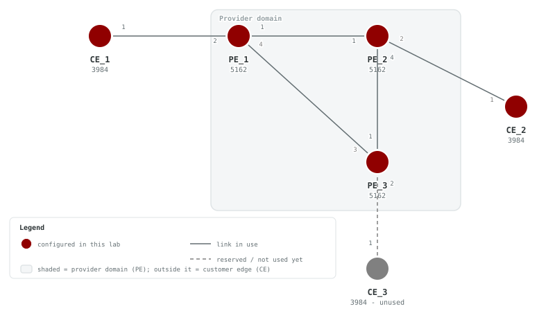
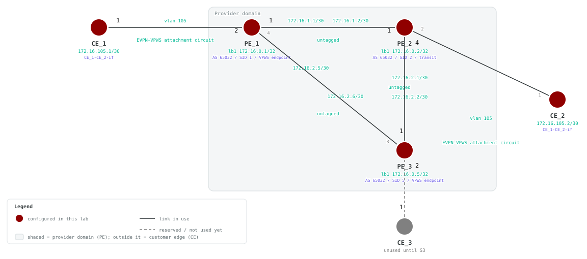

# S2 — EVPN-VPWS

## Goals

Build an EVPN-VPWS service over the recommended F4 SR-MPLS/iBGP foundation.
LDP is not part of this service path.

By the end of this lab you will be able to:

- Extend the IS-IS, SR-MPLS, and iBGP control planes to PE_3
- Configure an EVPN-VPWS instance between the PE_1 and PE_3 endpoints
- Configure the CE attachment circuits on VLAN 105
- Verify the EVPN routes and end-to-end service between CE_1 and CE_2

## Prerequisites

- Complete F1 through F4, or deploy this lab with its included F4 baseline.
- Confirm SR-MPLS and iBGP are operational before configuring the service.
- Make the SAOS 10x image `vrnetlab/ciena_saos:10-12-00-0228` (release 10.12.00.0228) available to Containerlab.
- Activate the built-in trial license after deployment.

## Topology





PE_1 and PE_3 terminate the VPWS. PE_2 remains a transit PE. CE_1 and CE_2 use
VLAN 105 attachment circuits.

### Node roles and loopback addressing

| Node | Role | Loopback |
| --- | --- | --- |
| PE_1 | VPWS endpoint | 172.16.0.1/32 |
| PE_2 | Transit PE | 172.16.0.2/32 |
| PE_3 | VPWS endpoint | 172.16.0.5/32 |
| CE_1 | Customer edge | 10.1.1.1/32 |
| CE_2 | Customer edge | 10.2.2.2/32 |

## Deploy

### Startup Configs

The checkpoint baseline each node boots from. If you are assembling the lab by hand, create a `configs/` folder next to [`topo.clab.yml`](./topo.clab.yml) and copy each file into it before you deploy.

- [PE_1.cfg.partial](./configs/PE_1.cfg.partial)
- [PE_2.cfg.partial](./configs/PE_2.cfg.partial)
- [PE_3.cfg.partial](./configs/PE_3.cfg.partial)
- [CE_1.cfg.partial](./configs/CE_1.cfg.partial)
- [CE_2.cfg.partial](./configs/CE_2.cfg.partial)
- [CE_3.cfg.partial](./configs/CE_3.cfg.partial)

### Containerlab topology

Download the topology file: [`topo.clab.yml`](./topo.clab.yml)

```yaml
name: S2-EVPN-VPWS
topology:
  defaults:
    kind: ciena_saos
    image: vrnetlab/ciena_saos:10-12-00-0228
    labels:
      lab-mode: hands-on
      prereq-lab: F4-BGP
  nodes:
    PE_1:
      type: '5162'
      startup-config: configs/PE_1.cfg.partial
    PE_2:
      type: '5162'
      startup-config: configs/PE_2.cfg.partial
    PE_3:
      type: '5162'
      startup-config: configs/PE_3.cfg.partial
    CE_1:
      type: '3984'
      startup-config: configs/CE_1.cfg.partial
    CE_2:
      type: '3984'
      startup-config: configs/CE_2.cfg.partial
    CE_3:
      type: '3984'
      labels:
        lab-state: unused
      startup-config: configs/CE_3.cfg.partial
  links:
  - endpoints: [ "PE_1:1", "PE_2:1" ]
  - endpoints: [ "PE_1:2", "CE_1:1" ]
  - endpoints: [ "PE_2:2", "CE_2:1" ]
  - endpoints: [ "PE_2:4", "PE_3:1" ]
  - endpoints: [ "PE_1:4", "PE_3:3" ]
  - endpoints: [ "CE_3:1", "PE_3:2" ]
```

### Start from checkpoint

```bash
LAB=S2-EVPN-VPWS
cd labs/${LAB}            # from the repo root, or cd into the unpacked directory
containerlab deploy -t topo.clab.yml
```

Equivalent invocation from the repo root:

```bash
containerlab deploy -t "labs/${LAB}/topo.clab.yml"
```

Once all five nodes reach healthy state, connect to them to complete the
tasks:

```bash
ssh diag@clab-S2-EVPN-VPWS-PE_1
ssh diag@clab-S2-EVPN-VPWS-PE_2
ssh diag@clab-S2-EVPN-VPWS-PE_3
ssh diag@clab-S2-EVPN-VPWS-CE_1
ssh diag@clab-S2-EVPN-VPWS-CE_2
```

Default credentials: `diag` / `ciena123`

## Instructions

<!-- task-index -->
- [Task 1: Verify the deployed topology](#task-1)
- [Task 2: Extend the SR-MPLS core to PE_3](#task-2)
- [Task 3: Extend the iBGP overlay](#task-3)
- [Task 4: Configure EVPN-VPWS](#task-4)
- [Task 5: Configure the customer attachment circuits](#task-5)
- [Task 6: Verify the service](#task-6)

<a id="task-1"></a>
### Task 1: Verify the deployed topology
<a href="#task-1" title="Direct link to this task (right-click to copy)">🔗</a>

<!-- prose: detailed -->

**Summary** — This lab starts from a working two-node core: `PE_1` and
`PE_2` arrive preloaded with an SR-MPLS underlay (IS-IS instance `Bootcamp`,
prefix-SIDs on `lb1` `172.16.0.1` and `172.16.0.2`) and an iBGP mesh in AS
`65032`. `PE_3` boots with nothing but its hostname, and the two CEs are
likewise blank — building them up is the work of the remaining tasks.

**Implementation** — Nothing to configure yet: before touching anything,
confirm the physical picture matches the diagram — `CE_1` hangs off `PE_1`,
`CE_2` links toward `PE_3`, and `PE_3` connects back to both existing PEs.
LLDP is the fastest way to prove cabling without any configuration at all.

<!-- verify-prose -->

On `CE_1`, the LLDP neighbor table should list a `system-name` of `PE_1`; on
`PE_1`, the mirror-image entry should show `CE_1`. Matching entries on both
ends prove the link is up and the devices agree on who their neighbor is.
LLDP runs by default here, which is why blank devices like `CE_1` can already
see neighbors — a useful day-one sanity check on any deployment.

<!-- retry: 60s -->
**Verify** (show mode) on **CE_1**:

```saos-show
show lldp neighbors
```

Pass: Output contains `system-name` and `PE_1`

<details><summary>Example output</summary>

```
+--------------- LLDP NEIGHBORS ---------------+
| Parameter                   | Value          |
+-----------------------------+----------------+
| interface                   | 1              |
| chassis-id                  | 0C009BC6F3F1   |
| chassis-id-subtype          | mac-address    |
| port-desc                   | 2              |
| port-id                     | 2              |
| port-id-subtype             | interface-name |
| system-capability-supported | bridge         |
| system-capability-enabled   | bridge         |
| system-description          | 5162           |
| system-name                 | PE_1           |
| auto-neg-supported          | True           |
| auto-neg-enabled            | False          |
| oper-mau-type               | 33             |
| port-class                  | p-class-pd     |
| mdi-supported               | False          |
| mdi-enabled                 | False          |
| pair-controlable            | False          |
| agg-status                  | capable        |
| max-frame-size              | 1526           |
| man-address-subtype         | ipv4           |
| man-address                 | 10.0.0.15      |
| if-subtype                  | if-index       |
+-----------------------------+----------------+
```

</details>

<!-- retry: 60s -->
**Verify** (show mode) on **PE_1**:

```saos-show
show lldp neighbors
```

Pass: Output contains `system-name` and `CE_1`

<details><summary>Example output</summary>

```
+--------------- LLDP NEIGHBORS ---------------+
| Parameter                   | Value          |
+-----------------------------+----------------+
| interface                   | 1              |
| chassis-id                  | 0C002FB9EDF1   |
| chassis-id-subtype          | mac-address    |
| port-desc                   | 1              |
| port-id                     | 1              |
| port-id-subtype             | interface-name |
| system-capability-supported | bridge         |
| system-capability-enabled   | bridge         |
| system-description          | 5162           |
| system-name                 | PE_2           |
| auto-neg-supported          | True           |
| auto-neg-enabled            | False          |
| oper-mau-type               | 33             |
| port-class                  | p-class-pd     |
| mdi-supported               | False          |
| mdi-enabled                 | False          |
| pair-controlable            | False          |
| agg-status                  | capable        |
| max-frame-size              | 1526           |
| man-address-subtype         | ipv4           |
| man-address                 | 10.0.0.15      |
| if-subtype                  | if-index       |
+-----------------------------+----------------+
| interface                   | 2              |
| chassis-id                  | 0C0045A10CF1   |
| chassis-id-subtype          | mac-address    |
| port-desc                   | 1              |
| port-id                     | 1              |
| port-id-subtype             | interface-name |
| system-capability-supported | bridge         |
| system-capability-enabled   | bridge         |
| system-description          | 3984           |
| system-name                 | CE_1            |
| auto-neg-supported          | True           |
| auto-neg-enabled            | False          |
| oper-mau-type               | 33             |
| port-class                  | p-class-pd     |
| mdi-supported               | False          |
| mdi-enabled                 | False          |
| pair-controlable            | False          |
| agg-status                  | capable        |
| max-frame-size              | 1526           |
| man-address-subtype         | ipv4           |
| man-address                 | 10.0.0.15      |
| if-subtype                  | if-index       |
+-----------------------------+----------------+
| interface                   | 4              |
| chassis-id                  | 0C007EA79BF1   |
| chassis-id-subtype          | mac-address    |
| port-desc                   | 3              |
| port-id                     | 3              |
| port-id-subtype             | interface-name |
| system-capability-supported | bridge         |
| system-capability-enabled   | bridge         |
| system-description          | 5162           |
| system-name                 | PE_3           |
| auto-neg-supported          | True           |
| auto-neg-enabled            | False          |
| oper-mau-type               | 33             |
| port-class                  | p-class-pd     |
| mdi-supported               | False          |
| mdi-enabled                 | False          |
| pair-controlable            | False          |
| agg-status                  | capable        |
| max-frame-size              | 1526           |
| man-address-subtype         | ipv4           |
| man-address                 | 10.0.0.15      |
| if-subtype                  | if-index       |
+-----------------------------+----------------+
```

</details>

<a id="task-2"></a>
### Task 2: Extend the SR-MPLS core to PE_3
<a href="#task-2" title="Direct link to this task (right-click to copy)">🔗</a>

<!-- prose: detailed -->

**Summary** — A point-to-point service between sites needs the transport
underlay first, so this task grows the two-node SR-MPLS core into a
three-node one. The payoff: every PE can reach every other PE's loopback by
a labeled SR path — services signaled between loopbacks cannot come up
without this, which is why the core is proven before any service work
begins.

**Implementation** — `PE_3` gets the full stack from scratch: a `lb1`
loopback (`172.16.0.5/32`), routed interfaces to each existing PE, MPLS
label switching, IS-IS in instance `Bootcamp`, and its own prefix-SID —
index `5` within the shared SRGB `16000`–`23999`. `PE_1` and `PE_2` each
need only their own side of the new links: the FD/FP/interface stack, label
switching, and the interface added to IS-IS as point-to-point level-1. Note
the uppercase `-FD`/`-FP` suffixes on these new objects — per the naming
convention, uppercase marks underlay infrastructure, distinguishing it from
the lowercase service objects you build later.

**Configure** (config mode) on **PE_1**:

```saos-config
fds fd PE_1-PE_3-FD mode vpls
oc-if:interfaces interface PE_1-PE_3-if config mtu 1500 name PE_1-PE_3-if type ip
oc-if:interfaces interface PE_1-PE_3-if config underlay-binding config fd PE_1-PE_3-FD
oc-if:interfaces interface PE_1-PE_3-if ipv4 addresses address 172.16.2.5 config ip 172.16.2.5 prefix-length 30
oc-if:interfaces interface PE_1-PE_3-if ipv6 addresses address FC00::60A config ip FC00::60A prefix-length 127
fps fp PE_1-PE_3-FP classifier-list-precedence 7 fd-name PE_1-PE_3-FD logical-port 4 mtu-size 2000 stats-collection on classifier-list CLASSIFIER-UNTAGGED
mpls interfaces interface PE_1-PE_3-if label-switching true
isis instance Bootcamp interfaces interface PE_1-PE_3-if interface-type point-to-point level-type level-1
isis instance Bootcamp interfaces interface PE_1-PE_3-if address-families address-family ipv6 unicast
```

**Configure** (config mode) on **PE_2**:

```saos-config
fds fd PE_2-PE_3-FD mode vpls
oc-if:interfaces interface PE_2-PE_3-if config mtu 1500 name PE_2-PE_3-if type ip
oc-if:interfaces interface PE_2-PE_3-if config underlay-binding config fd PE_2-PE_3-FD
oc-if:interfaces interface PE_2-PE_3-if ipv4 addresses address 172.16.2.1 config ip 172.16.2.1 prefix-length 30
oc-if:interfaces interface PE_2-PE_3-if ipv6 addresses address FC00::608 config ip FC00::608 prefix-length 127
fps fp PE_2-PE_3-FP classifier-list-precedence 7 fd-name PE_2-PE_3-FD logical-port 4 mtu-size 2000 stats-collection on classifier-list CLASSIFIER-UNTAGGED
mpls interfaces interface PE_2-PE_3-if label-switching true
isis instance Bootcamp interfaces interface PE_2-PE_3-if interface-type point-to-point level-type level-1
isis instance Bootcamp interfaces interface PE_2-PE_3-if address-families address-family ipv6 unicast
```

**Configure** (config mode) on **PE_3**:

```saos-config
fds fd PE_2-PE_3-FD mode vpls
fds fd PE_1-PE_3-FD mode vpls
oc-if:interfaces interface lb1 config name lb1 type loopback
oc-if:interfaces interface lb1 ipv4 addresses address 172.16.0.5 config ip 172.16.0.5 prefix-length 32
oc-if:interfaces interface lb1 ipv6 addresses address FC00::5 config ip FC00::5 prefix-length 128
oc-if:interfaces interface PE_2-PE_3-if config mtu 1500 name PE_2-PE_3-if type ip
oc-if:interfaces interface PE_2-PE_3-if config underlay-binding config fd PE_2-PE_3-FD
oc-if:interfaces interface PE_2-PE_3-if ipv4 addresses address 172.16.2.2 config ip 172.16.2.2 prefix-length 30
oc-if:interfaces interface PE_2-PE_3-if ipv6 addresses address FC00::609 config ip FC00::609 prefix-length 127
oc-if:interfaces interface PE_1-PE_3-if config mtu 1500 name PE_1-PE_3-if type ip
oc-if:interfaces interface PE_1-PE_3-if config underlay-binding config fd PE_1-PE_3-FD
oc-if:interfaces interface PE_1-PE_3-if ipv4 addresses address 172.16.2.6 config ip 172.16.2.6 prefix-length 30
oc-if:interfaces interface PE_1-PE_3-if ipv6 addresses address FC00::60B config ip FC00::60B prefix-length 127
classifiers classifier CLASSIFIER-UNTAGGED filter-entry vtag-stack untagged-exclude-priority-tagged false
fps fp PE_2-PE_3-FP classifier-list-precedence 7 fd-name PE_2-PE_3-FD logical-port 1 mtu-size 2000 stats-collection on classifier-list CLASSIFIER-UNTAGGED
fps fp PE_1-PE_3-FP classifier-list-precedence 7 fd-name PE_1-PE_3-FD logical-port 3 mtu-size 2000 stats-collection on classifier-list CLASSIFIER-UNTAGGED
mpls interfaces interface lb1 label-switching true
mpls interfaces interface PE_2-PE_3-if label-switching true
mpls interfaces interface PE_1-PE_3-if label-switching true
segment-routing connected-prefix-sid-map 172.16.0.5/32 interface lb1 start-sid 5 value-type index
isis instance Bootcamp cspf-flag true level-type level-1 net 49.0001.0172.0016.0005.00
isis instance Bootcamp interfaces interface lb1 interface-type point-to-point
isis instance Bootcamp interfaces interface lb1 address-families address-family ipv6 unicast
isis instance Bootcamp interfaces interface PE_2-PE_3-if interface-type point-to-point level-type level-1
isis instance Bootcamp interfaces interface PE_2-PE_3-if address-families address-family ipv6 unicast
isis instance Bootcamp interfaces interface PE_1-PE_3-if interface-type point-to-point level-type level-1
isis instance Bootcamp interfaces interface PE_1-PE_3-if address-families address-family ipv6 unicast
isis instance Bootcamp mpls-te level-type level-1 router-id 172.16.0.5
isis instance Bootcamp segment-routing enabled true srgb 16000 23999
isis instance Bootcamp segment-routing bindings advertise true receive true
```

<!-- verify-prose -->

On `PE_3`, IS-IS should show two adjacencies `Up` — system IDs
`0172.0016.0001` (`PE_1`) and `0172.0016.0002` (`PE_2`); note how each NET
embeds the router's loopback. `PE_1` and `PE_2` should each see
`0172.0016.0005` come `Up`. Beyond adjacency, SR must distribute labels:
`PE_3`'s connected-prefix-sid-map should bind `172.16.0.5` to `lb1`, and the
active IS-IS SR mapping table on `PE_1` and `PE_2` should contain
`172.16.0.5/32` — proof the new node's prefix-SID has propagated, not just
its route.

Question: with SID index `5` and an SRGB starting at `16000`, what MPLS
label would you expect other PEs to use to reach `PE_3`'s loopback?

<!-- retry: 120s -->
**Verify** (show mode) on **PE_3**:

```saos-show
show isis neighbors
```

Pass: Output contains `0172.0016.0001` and `0172.0016.0002` and `Up`

<details><summary>Example output</summary>

```
+-------------------------------------- ISIS NEIGHBOR STATE: Bootcamp ---------------------------------------+
| Neighbor |                        |                  |                |       |   Hold   |      |          |
|   Type   |       System ID        |    Interface     |      SNPA      | State | Time (s) | Type | Protocol |
+----------+------------------------+------------------+----------------+-------+----------+------+----------+
|   P2P    |     0172.0016.0002     |   PE_2-PE_3-if   | 0c00.2fb9.edf6 |    Up |       26 |  L1  |  IS-IS   |
|   P2P    |     0172.0016.0001     |   PE_1-PE_3-if   | 0c00.9bc6.f3f6 |    Up |       24 |  L1  |  IS-IS   |
+----------+------------------------+------------------+----------------+-------+----------+------+----------+
```

</details>

<!-- retry: 120s -->
**Verify** (show mode) on **PE_1**:

```saos-show
show isis neighbors
```

Pass: Output contains `0172.0016.0005` and `Up`

<details><summary>Example output</summary>

```
+-------------------------------------- ISIS NEIGHBOR STATE: Bootcamp ---------------------------------------+
| Neighbor |                        |                  |                |       |   Hold   |      |          |
|   Type   |       System ID        |    Interface     |      SNPA      | State | Time (s) | Type | Protocol |
+----------+------------------------+------------------+----------------+-------+----------+------+----------+
|   P2P    |     0172.0016.0002     |   PE_1-PE_2-if   | 0c00.2fb9.edf6 |    Up |       28 |  L1  |  IS-IS   |
|   P2P    |     0172.0016.0005     |   PE_1-PE_3-if   | 0c00.7ea7.9bf6 |    Up |       20 |  L1  |  IS-IS   |
+----------+------------------------+------------------+----------------+-------+----------+------+----------+
```

</details>

<!-- retry: 120s -->
**Verify** (show mode) on **PE_2**:

```saos-show
show isis neighbors
```

Pass: Output contains `0172.0016.0005` and `Up`

<details><summary>Example output</summary>

```
+-------------------------------------- ISIS NEIGHBOR STATE: Bootcamp ---------------------------------------+
| Neighbor |                        |                  |                |       |   Hold   |      |          |
|   Type   |       System ID        |    Interface     |      SNPA      | State | Time (s) | Type | Protocol |
+----------+------------------------+------------------+----------------+-------+----------+------+----------+
|   P2P    |     0172.0016.0001     |   PE_1-PE_2-if   | 0c00.9bc6.f3f6 |    Up |       29 |  L1  |  IS-IS   |
|   P2P    |     0172.0016.0005     |   PE_2-PE_3-if   | 0c00.7ea7.9bf6 |    Up |       20 |  L1  |  IS-IS   |
+----------+------------------------+------------------+----------------+-------+----------+------+----------+
```

</details>

**Verify** (show mode) on **PE_3**:

```saos-show
show segment-routing connected-prefix-sid-map
```

Pass: Output contains `172.16.0.5` and `lb1`

<details><summary>Example output</summary>

```
+----- SEGMENT-ROUTING SID MAP -----+
|  Name             |  Value        |
+-------------------+---------------+
| Prefix            | 172.16.0.5/32 |
| Interface         | lb1           |
| Value Type        | Index         |
| Start SID         | 5             |
| Range             | 1             |
| Algorithm         | SPF           |
| Last Hop Behavior | -             |
+-------------------+---------------+
```

</details>

<!-- retry: 120s -->
**Verify** (show mode) on **PE_1**:

```saos-show
show isis segment-routing mapping-table status active
```

Pass: Output contains `172.16.0.5/32`

<details><summary>Example output</summary>

```
+---------- ISIS SEGMENT-ROUTING MAPPING TABLE ACTIVE -----------+
| ISIS Instance |  Entry Prefix | SID Index | Range | Preference |
+---------------+---------------+-----------+-------+------------+
|    Bootcamp   | 172.16.0.1/32 |         1 |     1 |        192 |
|    Bootcamp   | 172.16.0.2/32 |         2 |     1 |        192 |
|    Bootcamp   | 172.16.0.5/32 |         5 |     1 |        192 |
+---------------+---------------+-----------+-------+------------+
```

</details>

<!-- retry: 120s -->
**Verify** (show mode) on **PE_2**:

```saos-show
show isis segment-routing mapping-table status active
```

Pass: Output contains `172.16.0.5/32`

<details><summary>Example output</summary>

```
+---------- ISIS SEGMENT-ROUTING MAPPING TABLE ACTIVE -----------+
| ISIS Instance |  Entry Prefix | SID Index | Range | Preference |
+---------------+---------------+-----------+-------+------------+
|    Bootcamp   | 172.16.0.1/32 |         1 |     1 |        192 |
|    Bootcamp   | 172.16.0.2/32 |         2 |     1 |        192 |
|    Bootcamp   | 172.16.0.5/32 |         5 |     1 |        192 |
+---------------+---------------+-----------+-------+------------+
```

</details>

<a id="task-3"></a>
### Task 3: Extend the iBGP overlay
<a href="#task-3" title="Direct link to this task (right-click to copy)">🔗</a>

<!-- prose: detailed -->

**Summary** — EVPN services are signaled by BGP, so `PE_3` must join the
iBGP overlay before it can host one. The design is a full iBGP mesh among
all three PEs, so any pair can exchange EVPN routes directly.

**Implementation** — On `PE_3`, create BGP instance `65032` with router-id
`172.16.0.5`, enable the `l2vpn evpn` address family, and peer with
`172.16.0.1` and `172.16.0.2`, sourcing the sessions from `lb1` — this is
why Task 2 mattered: the sessions ride loopback-to-loopback across the SR
core. `PE_1` and `PE_2` each add the reciprocal peer `172.16.0.5`,
activating only `l2vpn evpn` — the sole address family the upcoming service
needs.

**Configure** (config mode) on **PE_1**:

```saos-config
bgp instance 65032 peer 172.16.0.5 remote-as 65032 update-source-interface lb1 address-family l2vpn evpn activate true
```

**Configure** (config mode) on **PE_2**:

```saos-config
bgp instance 65032 peer 172.16.0.5 remote-as 65032 update-source-interface lb1 address-family l2vpn evpn activate true
```

**Configure** (config mode) on **PE_3**:

```saos-config
bgp instance 65032 router-id 172.16.0.5 address-family l2vpn evpn
bgp instance 65032 peer 172.16.0.1 remote-as 65032 update-source-interface lb1 address-family l2vpn evpn activate true
bgp instance 65032 peer 172.16.0.2 remote-as 65032 update-source-interface lb1 address-family l2vpn evpn activate true
```

<!-- verify-prose -->

On `PE_3`, both peers `172.16.0.1` and `172.16.0.2` should reach
`Established`; on `PE_1` and `PE_2`, the session to `172.16.0.5` should show
the same. Established sessions confirm loopback reachability over the
underlay and matching AS/address-family settings on both ends. The overlay
is now in place but empty of service routes — nothing advertises into `l2vpn
evpn` until the next task creates an EVPN instance.

Question: if a session stuck in a connect state, would you suspect the BGP
configuration first, or the SR underlay you built in Task 2 — and which
check from Task 2 would you rerun?

<!-- retry: 180s -->
**Verify** (show mode) on **PE_3**:

```saos-show
show bgp peers
```

Pass: Output contains `172.16.0.1` and `172.16.0.2` and `Established`

<details><summary>Example output</summary>

```
+-------------------------------------------------------------------------- BGP PEERS --------------------------------------------------------------------------+
|                                             |        |          | Up         | Peer    | Received | Advertised | Last       | Received | Sent   |             |
|                                             | Remote | Peer     | Time       | Table   | Pkt      | Pkt        | Reset      | Prefix   | Prefix |             |
| Peer                                        | AS     | Type     | (hh:mm:ss) | Version | Count    | Count      | (hh:mm:ss) | Count    | Count  | State       |
+---------------------------------------------+--------+----------+------------+---------+----------+------------+------------+----------+--------+-------------+
| 172.16.0.2                                  | 65032  | internal | 00:00:25   | 3       | 2        | 3          | -          | 0        | 1      | Established |
| 172.16.0.1                                  | 65032  | internal | 00:00:25   | 3       | 3        | 3          | -          | 1        | 1      | Established |
+---------------------------------------------+--------+----------+------------+---------+----------+------------+------------+----------+--------+-------------+
```

</details>

<!-- retry: 180s -->
**Verify** (show mode) on **PE_1**:

```saos-show
show bgp peers
```

Pass: Output contains `172.16.0.5` and `Established`

<details><summary>Example output</summary>

```
+-------------------------------------------------------------------------- BGP PEERS --------------------------------------------------------------------------+
|                                             |        |          | Up         | Peer    | Received | Advertised | Last       | Received | Sent   |             |
|                                             | Remote | Peer     | Time       | Table   | Pkt      | Pkt        | Reset      | Prefix   | Prefix |             |
| Peer                                        | AS     | Type     | (hh:mm:ss) | Version | Count    | Count      | (hh:mm:ss) | Count    | Count  | State       |
+---------------------------------------------+--------+----------+------------+---------+----------+------------+------------+----------+--------+-------------+
| 172.16.0.5                                  | 65032  | internal | 00:00:25   | 2       | 2        | 2          | -          | 1        | 1      | Established |
| 172.16.0.2                                  | 65032  | internal | 00:01:27   | 2       | 6        | 7          | -          | 1        | 2      | Established |
+---------------------------------------------+--------+----------+------------+---------+----------+------------+------------+----------+--------+-------------+
```

</details>

<!-- retry: 180s -->
**Verify** (show mode) on **PE_2**:

```saos-show
show bgp peers
```

Pass: Output contains `172.16.0.5` and `Established`

<details><summary>Example output</summary>

```
+-------------------------------------------------------------------------- BGP PEERS --------------------------------------------------------------------------+
|                                             |        |          | Up         | Peer    | Received | Advertised | Last       | Received | Sent   |             |
|                                             | Remote | Peer     | Time       | Table   | Pkt      | Pkt        | Reset      | Prefix   | Prefix |             |
| Peer                                        | AS     | Type     | (hh:mm:ss) | Version | Count    | Count      | (hh:mm:ss) | Count    | Count  | State       |
+---------------------------------------------+--------+----------+------------+---------+----------+------------+------------+----------+--------+-------------+
| 172.16.0.5                                  | 65032  | internal | 00:00:25   | 1       | 2        | 1          | -          | 1        | 0      | Established |
| 172.16.0.1                                  | 65032  | internal | 00:01:28   | 2       | 8        | 7          | -          | 2        | 1      | Established |
+---------------------------------------------+--------+----------+------------+---------+----------+------------+------------+----------+--------+-------------+
```

</details>

<a id="task-4"></a>
### Task 4: Configure EVPN-VPWS
<a href="#task-4" title="Direct link to this task (right-click to copy)">🔗</a>

<!-- prose: in-depth -->

**Summary** — Now the service itself: an EVPN-VPWS cross-connect between
`PE_1` (facing `CE_1`) and `PE_3` (facing `CE_2`) — `PE_2` carries no service
configuration and acts purely as core transit.

**Background** — EVPN-VPWS is a point-to-point Layer 2 cross-connect
signaled by BGP rather than by LDP or static pseudowires: each endpoint
advertises its side of the wire over the iBGP overlay built in Task 3. An
EVPN instance is what ties a forwarding domain to that signaling — an
ip-based route distinguisher keeps its routes unique, a route-target
imported and exported on both ends lets the endpoints accept each other's
advertisements, and mirrored VPWS service IDs pair the two attachment
circuits: each side's local ID is what the other side expects as remote.

**Implementation** — On each endpoint PE, build the service-layer stack: a
forwarding domain `vpws_1-fd` in `mode evpn-vpws`, a classifier
`CLASSIFIER-105` matching single-tagged frames with VLAN `105`, and a flow
point `vpws_1-fp` binding the CE-facing port into the FD with an egress
transform that pushes tag `105` onto frames leaving toward the CE. Note the
lowercase `-fd`/`-fp` suffixes: per the naming convention, lowercase marks
service-scope objects, versus the uppercase underlay objects from Task 2.
Then bind the FD to BGP with EVPN instance `102`: the ip-based route
distinguisher, route-target `0:102:102`, and the mirrored service IDs.

**Configure** (config mode) on **PE_1**:

```saos-config
fds fd vpws_1-fd mode evpn-vpws
classifiers classifier CLASSIFIER-105 filter-entry vtag-stack vtags 1 vlan-id 105
fps fp vpws_1-fp fd-name vpws_1-fd logical-port 2 stats-collection on classifier-list CLASSIFIER-105
fps fp vpws_1-fp egress-l2-transform push-vid-105 vlan-stack 1 push-tpid tpid-8100 push-vid 105
evpn evpn-instances evpn-instance 102 vpws-cross-connect-fd vpws_1-fd l2mtu 9216 local-service-id 2102 remote-service-id 1102
evpn evpn-instances evpn-instance 102 route-distinguisher ip-based value 172.16.0.1:102
evpn evpn-instances evpn-instance 102 vpn-target 0:102:102 route-target-type both
```

**Configure** (config mode) on **PE_3**:

```saos-config
fds fd vpws_1-fd mode evpn-vpws
classifiers classifier CLASSIFIER-105 filter-entry vtag-stack vtags 1 vlan-id 105
fps fp vpws_1-fp fd-name vpws_1-fd logical-port 2 stats-collection on classifier-list CLASSIFIER-105
fps fp vpws_1-fp egress-l2-transform push-vid-105 vlan-stack 1 push-tpid tpid-8100 push-vid 105
evpn evpn-instances evpn-instance 102 vpws-cross-connect-fd vpws_1-fd l2mtu 9216 local-service-id 1102 remote-service-id 2102
evpn evpn-instances evpn-instance 102 route-distinguisher ip-based value 172.16.0.5:102
evpn evpn-instances evpn-instance 102 vpn-target 0:102:102 route-target-type both
```

<!-- verify-prose -->

On both `PE_1` and `PE_3`, the forwarding-domain view should show
`vpws_1-fd` in `evpn-vpws` mode, and the classifier table should list
`CLASSIFIER-105` matching VLAN `105`. These checks prove the service
construct exists on both endpoints; with the Task 3 sessions established,
the expectation is that BGP is now exchanging EVPN routes for instance
`102`. No customer traffic can flow yet — the CE ends of the wire are
unconfigured until the last two tasks.

Question: if the local/remote service IDs were mistakenly set identically on
both PEs, would the cross-connect come up? Why do they need to mirror?

**Verify** (show mode) on **PE_1**:

```saos-show
show forwarding-domains forwarding-domain vpws_1-fd
```

Pass: Output contains `vpws_1-fd` and `evpn-vpws`

<details><summary>Example output</summary>

```
+ FORWARDING DOMAIN +
| KEY  | VALUE      |
+------+------------+
| Name | vpws_1-fd  |
| Mode | evpn-vpws  |
+------+------------+
```

</details>

**Verify** (show mode) on **PE_3**:

```saos-show
show forwarding-domains forwarding-domain vpws_1-fd
```

Pass: Output contains `vpws_1-fd` and `evpn-vpws`

<details><summary>Example output</summary>

```
+ FORWARDING DOMAIN +
| KEY  | VALUE      |
+------+------------+
| Name | vpws_1-fd  |
| Mode | evpn-vpws  |
+------+------------+
```

</details>

**Verify** (show mode) on **PE_1**:

```saos-show
show classifiers
```

Pass: Output contains `CLASSIFIER-105` and `105`

<details><summary>Example output</summary>

```
+---------------------- CLASSIFIER ---------------------+
| Name                | Filter Parameter                |
+---------------------+---------------------------------+
| CLASSIFIER-105      | Classifier:single-tagged        |
| CLASSIFIER-UNTAGGED | ciena-mef-classifier:vtag-stack |
| default-vid-127     | Classifier:single-tagged        |
+---------------------+---------------------------------+
```

</details>

**Verify** (show mode) on **PE_3**:

```saos-show
show classifiers
```

Pass: Output contains `CLASSIFIER-105` and `105`

<details><summary>Example output</summary>

```
+---------------------- CLASSIFIER ---------------------+
| Name                | Filter Parameter                |
+---------------------+---------------------------------+
| CLASSIFIER-105      | Classifier:single-tagged        |
| CLASSIFIER-UNTAGGED | ciena-mef-classifier:vtag-stack |
| default-vid-127     | Classifier:single-tagged        |
+---------------------+---------------------------------+
```

</details>

<a id="task-5"></a>
### Task 5: Configure the customer attachment circuits
<a href="#task-5" title="Direct link to this task (right-click to copy)">🔗</a>

<!-- prose: detailed -->

**Summary** — Time to plug in the customer's first site: `CE_1` plays the
customer edge, taking one end of a customer subnet whose far end will live
on `CE_2`. The VLAN `105` tag it applies is the service handoff contract — it
is exactly what `PE_1`'s `CLASSIFIER-105` from Task 4 admits into the VPWS.
Untagged or differently tagged frames would arrive at the PE and match
nothing.

**Implementation** — `CE_1` gets a forwarding domain `CE_1-CE_2-FD` carrying an
IP interface `CE_1-CE_2-if` at `172.16.105.1/30`. A flow point `CE_1-CE_2-FP`
binds the link to `PE_1` into that FD, with `CLASSIFIER-105` and an egress
`push-vid-105` transform: the CE's traffic leaves tagged with VLAN `105`,
and only frames returning with tag `105` are classified back in.

**Configure** (config mode) on **CE_1**:

```saos-config
fds fd CE_1-CE_2-FD mode vpls
oc-if:interfaces interface CE_1-CE_2-if config mtu 1500 name CE_1-CE_2-if type ip
oc-if:interfaces interface CE_1-CE_2-if config underlay-binding config fd CE_1-CE_2-FD
oc-if:interfaces interface CE_1-CE_2-if ipv4 addresses address 172.16.105.1 config ip 172.16.105.1 prefix-length 30
classifiers classifier CLASSIFIER-105 filter-entry vtag-stack vtags 1 vlan-id 105
fps fp CE_1-CE_2-FP fd-name CE_1-CE_2-FD logical-port 1 stats-collection on classifier-list CLASSIFIER-105
fps fp CE_1-CE_2-FP egress-l2-transform push-vid-105 vlan-stack 1 push-tpid tpid-8100 push-vid 105
```

<!-- verify-prose -->

On `CE_1`, the flow point `CE_1-CE_2-FP` should exist, be bound to
`CE_1-CE_2-FD`, and carry the `push-vid-105` egress transform — the full
attachment-circuit stack in one view. Nothing end-to-end is provable yet:
the VPWS has a configured attachment at only one customer site, so any ping
toward the far end of the customer /30 should be expected to fail until the
next task configures `CE_2`.

Question: trace a frame leaving `CE_1`'s IP interface — where does the `105`
tag get pushed, and which device decides to carry it into the EVPN-VPWS?

**Verify** (show mode) on **CE_1**:

```saos-show
show flow-points flow-point CE_1-CE_2-FP
```

Pass: Output contains `CE_1-CE_2-FP` and `CE_1-CE_2-FD` and `push-vid-105`

<details><summary>Example output</summary>

```
+--------------- FLOW POINT --------------+
| KEY                    | VALUE          |
+------------------------+----------------+
| Name                   | CE_1-CE_2-FP     |
| Forwarding Domain Name | CE_1-CE_2-FD     |
| Logical Port           | 1              |
| Statistics Collection  | on             |
| MTU Size               | 2000           |
| Admin State            | enabled        |
| Egress L2 Transform    |                |
|   Egress Name          | push-vid-105   |
|   Egress VLAN Stack    |                |
|     Tag                | 1              |
|     Push TPID          | tpid-8100      |
|     Push VID           | 105            |
| Classifier List        |                |
|                        | CLASSIFIER-105 |
+------------------------+----------------+
+----- FLOW POINT STATISTICS ------+
| KEY                 | VALUE      |
+---------------------+------------+
| Name                | CE_1-CE_2-FP |
| Rx Accepted Bytes   | 244        |
| Rx Accepted Frames  | 2          |
| Tx Forwarded Bytes  | 574        |
| Tx Forwarded Frames | 5          |
| Rx Yellow Bytes     | 0          |
| Rx Yellow Frames    | 0          |
| Rx Dropped Bytes    | 0          |
| Rx Dropped Frames   | 0          |
+---------------------+------------+
+----------- FLOW POINT STATE ----------+
| KEY                 | VALUE           |
+---------------------+-----------------+
| Name                | CE_1-CE_2-FP      |
| Oper State          | up              |
| Oper Up Time        | 0 days,0h:0m:8s |
| Egress L2 Transform |                 |
|   Egress VLAN Stack |                 |
|     Tag             | 1               |
|     Push TPID       | tpid-8100       |
|     Push VID        | 105             |
+---------------------+-----------------+
```

</details>

<a id="task-6"></a>
### Task 6: Verify the service
<a href="#task-6" title="Direct link to this task (right-click to copy)">🔗</a>

<!-- prose: simple -->

Mirror the Task 5 attachment on the second site — `CE_2` gets the same
`CE_1-CE_2-FD`, `CLASSIFIER-105`, and `CE_1-CE_2-FP` stack with the
`push-vid-105` transform, changing only:

- IP interface `CE_1-CE_2-if` at `172.16.105.2/30`
- flow point bound to logical port 2, the link toward `PE_3`

**Configure** (config mode) on **CE_2**:

```saos-config
fds fd CE_1-CE_2-FD mode vpls
oc-if:interfaces interface CE_1-CE_2-if config mtu 1500 name CE_1-CE_2-if type ip
oc-if:interfaces interface CE_1-CE_2-if config underlay-binding config fd CE_1-CE_2-FD
oc-if:interfaces interface CE_1-CE_2-if ipv4 addresses address 172.16.105.2 config ip 172.16.105.2 prefix-length 30
classifiers classifier CLASSIFIER-105 filter-entry vtag-stack vtags 1 vlan-id 105
fps fp CE_1-CE_2-FP fd-name CE_1-CE_2-FD logical-port 2 stats-collection on classifier-list CLASSIFIER-105
fps fp CE_1-CE_2-FP egress-l2-transform push-vid-105 vlan-stack 1 push-tpid tpid-8100 push-vid 105
```

<!-- verify-prose -->

On `CE_2`, flow point `CE_1-CE_2-FP` should show its binding to `CE_1-CE_2-FD`
and the `push-vid-105` transform, matching `CE_1`'s. With this, every layer
built so far is in play at once: `CE_2` tags traffic `105` toward `PE_3`,
`PE_3` classifies it into `vpws_1-fd`, BGP-signaled EVPN instance `102`
cross-connects it over the SR-MPLS core to `PE_1`, and `PE_1` hands it to
`CE_1` tagged `105`. Two CEs sharing subnet `172.16.105.0/30` behave as if
joined by a single wire, though three PEs and a label-switched core sit
between them. The real end-to-end proof is expectation-based: a ping between
the two ends of `172.16.105.0/30` should now traverse the VPWS transparently
— the CEs never see the MPLS core.

Question: which single device could you check to distinguish "attachment
circuit problem" from "EVPN signaling problem" if that ping failed — and
what would you look at on it?

**Verify** (show mode) on **CE_2**:

```saos-show
show flow-points flow-point CE_1-CE_2-FP
```

Pass: Output contains `CE_1-CE_2-FP` and `CE_1-CE_2-FD` and `push-vid-105`

<details><summary>Example output</summary>

```
+--------------- FLOW POINT --------------+
| KEY                    | VALUE          |
+------------------------+----------------+
| Name                   | CE_1-CE_2-FP     |
| Forwarding Domain Name | CE_1-CE_2-FD     |
| Logical Port           | 2              |
| Statistics Collection  | on             |
| MTU Size               | 2000           |
| Admin State            | enabled        |
| Egress L2 Transform    |                |
|   Egress Name          | push-vid-105   |
|   Egress VLAN Stack    |                |
|     Tag                | 1              |
|     Push TPID          | tpid-8100      |
|     Push VID           | 105            |
| Classifier List        |                |
|                        | CLASSIFIER-105 |
+------------------------+----------------+
+----- FLOW POINT STATISTICS ------+
| KEY                 | VALUE      |
+---------------------+------------+
| Name                | CE_1-CE_2-FP |
| Rx Accepted Bytes   | 0          |
| Rx Accepted Frames  | 0          |
| Tx Forwarded Bytes  | 708        |
| Tx Forwarded Frames | 6          |
| Rx Yellow Bytes     | 0          |
| Rx Yellow Frames    | 0          |
| Rx Dropped Bytes    | 0          |
| Rx Dropped Frames   | 0          |
+---------------------+------------+
+----------- FLOW POINT STATE ----------+
| KEY                 | VALUE           |
+---------------------+-----------------+
| Name                | CE_1-CE_2-FP      |
| Oper State          | up              |
| Oper Up Time        | 0 days,0h:0m:4s |
| Egress L2 Transform |                 |
|   Egress VLAN Stack |                 |
|     Tag             | 1               |
|     Push TPID       | tpid-8100       |
|     Push VID        | 105             |
+---------------------+-----------------+
```

</details>

## Tests

Deploy `S2-EVPN-VPWS`, then run the following validation checks.

### G1: Task 1 — Verify the deployed topology

<!-- retry: 60s -->
On **CE_1**, run:

```saos
show lldp neighbors
```

Pass: Output contains `system-name` and `PE_1`

<details><summary>Example output</summary>

```
+--------------- LLDP NEIGHBORS ---------------+
| Parameter                   | Value          |
+-----------------------------+----------------+
| interface                   | 1              |
| chassis-id                  | 0C009BC6F3F1   |
| chassis-id-subtype          | mac-address    |
| port-desc                   | 2              |
| port-id                     | 2              |
| port-id-subtype             | interface-name |
| system-capability-supported | bridge         |
| system-capability-enabled   | bridge         |
| system-description          | 5162           |
| system-name                 | PE_1           |
| auto-neg-supported          | True           |
| auto-neg-enabled            | False          |
| oper-mau-type               | 33             |
| port-class                  | p-class-pd     |
| mdi-supported               | False          |
| mdi-enabled                 | False          |
| pair-controlable            | False          |
| agg-status                  | capable        |
| max-frame-size              | 1526           |
| man-address-subtype         | ipv4           |
| man-address                 | 10.0.0.15      |
| if-subtype                  | if-index       |
+-----------------------------+----------------+
```

</details>

<!-- retry: 60s -->
On **PE_1**, run:

```saos
show lldp neighbors
```

Pass: Output contains `system-name` and `CE_1`

<details><summary>Example output</summary>

```
+--------------- LLDP NEIGHBORS ---------------+
| Parameter                   | Value          |
+-----------------------------+----------------+
| interface                   | 1              |
| chassis-id                  | 0C002FB9EDF1   |
| chassis-id-subtype          | mac-address    |
| port-desc                   | 1              |
| port-id                     | 1              |
| port-id-subtype             | interface-name |
| system-capability-supported | bridge         |
| system-capability-enabled   | bridge         |
| system-description          | 5162           |
| system-name                 | PE_2           |
| auto-neg-supported          | True           |
| auto-neg-enabled            | False          |
| oper-mau-type               | 33             |
| port-class                  | p-class-pd     |
| mdi-supported               | False          |
| mdi-enabled                 | False          |
| pair-controlable            | False          |
| agg-status                  | capable        |
| max-frame-size              | 1526           |
| man-address-subtype         | ipv4           |
| man-address                 | 10.0.0.15      |
| if-subtype                  | if-index       |
+-----------------------------+----------------+
| interface                   | 2              |
| chassis-id                  | 0C0045A10CF1   |
| chassis-id-subtype          | mac-address    |
| port-desc                   | 1              |
| port-id                     | 1              |
| port-id-subtype             | interface-name |
| system-capability-supported | bridge         |
| system-capability-enabled   | bridge         |
| system-description          | 3984           |
| system-name                 | CE_1            |
| auto-neg-supported          | True           |
| auto-neg-enabled            | False          |
| oper-mau-type               | 33             |
| port-class                  | p-class-pd     |
| mdi-supported               | False          |
| mdi-enabled                 | False          |
| pair-controlable            | False          |
| agg-status                  | capable        |
| max-frame-size              | 1526           |
| man-address-subtype         | ipv4           |
| man-address                 | 10.0.0.15      |
| if-subtype                  | if-index       |
+-----------------------------+----------------+
| interface                   | 4              |
| chassis-id                  | 0C007EA79BF1   |
| chassis-id-subtype          | mac-address    |
| port-desc                   | 3              |
| port-id                     | 3              |
| port-id-subtype             | interface-name |
| system-capability-supported | bridge         |
| system-capability-enabled   | bridge         |
| system-description          | 5162           |
| system-name                 | PE_3           |
| auto-neg-supported          | True           |
| auto-neg-enabled            | False          |
| oper-mau-type               | 33             |
| port-class                  | p-class-pd     |
| mdi-supported               | False          |
| mdi-enabled                 | False          |
| pair-controlable            | False          |
| agg-status                  | capable        |
| max-frame-size              | 1526           |
| man-address-subtype         | ipv4           |
| man-address                 | 10.0.0.15      |
| if-subtype                  | if-index       |
+-----------------------------+----------------+
```

</details>

### G2: Task 2 — Extend the SR-MPLS core to PE_3

<!-- retry: 120s -->
On **PE_3**, run:

```saos
show isis neighbors
```

Pass: Output contains `0172.0016.0001` and `0172.0016.0002` and `Up`

<details><summary>Example output</summary>

```
+-------------------------------------- ISIS NEIGHBOR STATE: Bootcamp ---------------------------------------+
| Neighbor |                        |                  |                |       |   Hold   |      |          |
|   Type   |       System ID        |    Interface     |      SNPA      | State | Time (s) | Type | Protocol |
+----------+------------------------+------------------+----------------+-------+----------+------+----------+
|   P2P    |     0172.0016.0002     |   PE_2-PE_3-if   | 0c00.2fb9.edf6 |    Up |       26 |  L1  |  IS-IS   |
|   P2P    |     0172.0016.0001     |   PE_1-PE_3-if   | 0c00.9bc6.f3f6 |    Up |       24 |  L1  |  IS-IS   |
+----------+------------------------+------------------+----------------+-------+----------+------+----------+
```

</details>

<!-- retry: 120s -->
On **PE_1**, run:

```saos
show isis neighbors
```

Pass: Output contains `0172.0016.0005` and `Up`

<details><summary>Example output</summary>

```
+-------------------------------------- ISIS NEIGHBOR STATE: Bootcamp ---------------------------------------+
| Neighbor |                        |                  |                |       |   Hold   |      |          |
|   Type   |       System ID        |    Interface     |      SNPA      | State | Time (s) | Type | Protocol |
+----------+------------------------+------------------+----------------+-------+----------+------+----------+
|   P2P    |     0172.0016.0002     |   PE_1-PE_2-if   | 0c00.2fb9.edf6 |    Up |       28 |  L1  |  IS-IS   |
|   P2P    |     0172.0016.0005     |   PE_1-PE_3-if   | 0c00.7ea7.9bf6 |    Up |       20 |  L1  |  IS-IS   |
+----------+------------------------+------------------+----------------+-------+----------+------+----------+
```

</details>

<!-- retry: 120s -->
On **PE_2**, run:

```saos
show isis neighbors
```

Pass: Output contains `0172.0016.0005` and `Up`

<details><summary>Example output</summary>

```
+-------------------------------------- ISIS NEIGHBOR STATE: Bootcamp ---------------------------------------+
| Neighbor |                        |                  |                |       |   Hold   |      |          |
|   Type   |       System ID        |    Interface     |      SNPA      | State | Time (s) | Type | Protocol |
+----------+------------------------+------------------+----------------+-------+----------+------+----------+
|   P2P    |     0172.0016.0001     |   PE_1-PE_2-if   | 0c00.9bc6.f3f6 |    Up |       29 |  L1  |  IS-IS   |
|   P2P    |     0172.0016.0005     |   PE_2-PE_3-if   | 0c00.7ea7.9bf6 |    Up |       20 |  L1  |  IS-IS   |
+----------+------------------------+------------------+----------------+-------+----------+------+----------+
```

</details>

On **PE_3**, run:

```saos
show segment-routing connected-prefix-sid-map
```

Pass: Output contains `172.16.0.5` and `lb1`

<details><summary>Example output</summary>

```
+----- SEGMENT-ROUTING SID MAP -----+
|  Name             |  Value        |
+-------------------+---------------+
| Prefix            | 172.16.0.5/32 |
| Interface         | lb1           |
| Value Type        | Index         |
| Start SID         | 5             |
| Range             | 1             |
| Algorithm         | SPF           |
| Last Hop Behavior | -             |
+-------------------+---------------+
```

</details>

<!-- retry: 120s -->
On **PE_1**, run:

```saos
show isis segment-routing mapping-table status active
```

Pass: Output contains `172.16.0.5/32`

<details><summary>Example output</summary>

```
+---------- ISIS SEGMENT-ROUTING MAPPING TABLE ACTIVE -----------+
| ISIS Instance |  Entry Prefix | SID Index | Range | Preference |
+---------------+---------------+-----------+-------+------------+
|    Bootcamp   | 172.16.0.1/32 |         1 |     1 |        192 |
|    Bootcamp   | 172.16.0.2/32 |         2 |     1 |        192 |
|    Bootcamp   | 172.16.0.5/32 |         5 |     1 |        192 |
+---------------+---------------+-----------+-------+------------+
```

</details>

<!-- retry: 120s -->
On **PE_2**, run:

```saos
show isis segment-routing mapping-table status active
```

Pass: Output contains `172.16.0.5/32`

<details><summary>Example output</summary>

```
+---------- ISIS SEGMENT-ROUTING MAPPING TABLE ACTIVE -----------+
| ISIS Instance |  Entry Prefix | SID Index | Range | Preference |
+---------------+---------------+-----------+-------+------------+
|    Bootcamp   | 172.16.0.1/32 |         1 |     1 |        192 |
|    Bootcamp   | 172.16.0.2/32 |         2 |     1 |        192 |
|    Bootcamp   | 172.16.0.5/32 |         5 |     1 |        192 |
+---------------+---------------+-----------+-------+------------+
```

</details>

### G3: Task 3 — Extend the iBGP overlay

<!-- retry: 180s -->
On **PE_3**, run:

```saos
show bgp peers
```

Pass: Output contains `172.16.0.1` and `172.16.0.2` and `Established`

<details><summary>Example output</summary>

```
+-------------------------------------------------------------------------- BGP PEERS --------------------------------------------------------------------------+
|                                             |        |          | Up         | Peer    | Received | Advertised | Last       | Received | Sent   |             |
|                                             | Remote | Peer     | Time       | Table   | Pkt      | Pkt        | Reset      | Prefix   | Prefix |             |
| Peer                                        | AS     | Type     | (hh:mm:ss) | Version | Count    | Count      | (hh:mm:ss) | Count    | Count  | State       |
+---------------------------------------------+--------+----------+------------+---------+----------+------------+------------+----------+--------+-------------+
| 172.16.0.2                                  | 65032  | internal | 00:00:25   | 3       | 2        | 3          | -          | 0        | 1      | Established |
| 172.16.0.1                                  | 65032  | internal | 00:00:25   | 3       | 3        | 3          | -          | 1        | 1      | Established |
+---------------------------------------------+--------+----------+------------+---------+----------+------------+------------+----------+--------+-------------+
```

</details>

<!-- retry: 180s -->
On **PE_1**, run:

```saos
show bgp peers
```

Pass: Output contains `172.16.0.5` and `Established`

<details><summary>Example output</summary>

```
+-------------------------------------------------------------------------- BGP PEERS --------------------------------------------------------------------------+
|                                             |        |          | Up         | Peer    | Received | Advertised | Last       | Received | Sent   |             |
|                                             | Remote | Peer     | Time       | Table   | Pkt      | Pkt        | Reset      | Prefix   | Prefix |             |
| Peer                                        | AS     | Type     | (hh:mm:ss) | Version | Count    | Count      | (hh:mm:ss) | Count    | Count  | State       |
+---------------------------------------------+--------+----------+------------+---------+----------+------------+------------+----------+--------+-------------+
| 172.16.0.5                                  | 65032  | internal | 00:00:25   | 2       | 2        | 2          | -          | 1        | 1      | Established |
| 172.16.0.2                                  | 65032  | internal | 00:01:27   | 2       | 6        | 7          | -          | 1        | 2      | Established |
+---------------------------------------------+--------+----------+------------+---------+----------+------------+------------+----------+--------+-------------+
```

</details>

<!-- retry: 180s -->
On **PE_2**, run:

```saos
show bgp peers
```

Pass: Output contains `172.16.0.5` and `Established`

<details><summary>Example output</summary>

```
+-------------------------------------------------------------------------- BGP PEERS --------------------------------------------------------------------------+
|                                             |        |          | Up         | Peer    | Received | Advertised | Last       | Received | Sent   |             |
|                                             | Remote | Peer     | Time       | Table   | Pkt      | Pkt        | Reset      | Prefix   | Prefix |             |
| Peer                                        | AS     | Type     | (hh:mm:ss) | Version | Count    | Count      | (hh:mm:ss) | Count    | Count  | State       |
+---------------------------------------------+--------+----------+------------+---------+----------+------------+------------+----------+--------+-------------+
| 172.16.0.5                                  | 65032  | internal | 00:00:25   | 1       | 2        | 1          | -          | 1        | 0      | Established |
| 172.16.0.1                                  | 65032  | internal | 00:01:28   | 2       | 8        | 7          | -          | 2        | 1      | Established |
+---------------------------------------------+--------+----------+------------+---------+----------+------------+------------+----------+--------+-------------+
```

</details>

### G4: Task 4 — Configure EVPN-VPWS

On **PE_1**, run:

```saos
show forwarding-domains forwarding-domain vpws_1-fd
```

Pass: Output contains `vpws_1-fd` and `evpn-vpws`

<details><summary>Example output</summary>

```
+ FORWARDING DOMAIN +
| KEY  | VALUE      |
+------+------------+
| Name | vpws_1-fd  |
| Mode | evpn-vpws  |
+------+------------+
```

</details>

On **PE_3**, run:

```saos
show forwarding-domains forwarding-domain vpws_1-fd
```

Pass: Output contains `vpws_1-fd` and `evpn-vpws`

<details><summary>Example output</summary>

```
+ FORWARDING DOMAIN +
| KEY  | VALUE      |
+------+------------+
| Name | vpws_1-fd  |
| Mode | evpn-vpws  |
+------+------------+
```

</details>

On **PE_1**, run:

```saos
show classifiers
```

Pass: Output contains `CLASSIFIER-105` and `105`

<details><summary>Example output</summary>

```
+---------------------- CLASSIFIER ---------------------+
| Name                | Filter Parameter                |
+---------------------+---------------------------------+
| CLASSIFIER-105      | Classifier:single-tagged        |
| CLASSIFIER-UNTAGGED | ciena-mef-classifier:vtag-stack |
| default-vid-127     | Classifier:single-tagged        |
+---------------------+---------------------------------+
```

</details>

On **PE_3**, run:

```saos
show classifiers
```

Pass: Output contains `CLASSIFIER-105` and `105`

<details><summary>Example output</summary>

```
+---------------------- CLASSIFIER ---------------------+
| Name                | Filter Parameter                |
+---------------------+---------------------------------+
| CLASSIFIER-105      | Classifier:single-tagged        |
| CLASSIFIER-UNTAGGED | ciena-mef-classifier:vtag-stack |
| default-vid-127     | Classifier:single-tagged        |
+---------------------+---------------------------------+
```

</details>

### G5: Task 5 — Configure the customer attachment circuits

On **CE_1**, run:

```saos
show flow-points flow-point CE_1-CE_2-FP
```

Pass: Output contains `CE_1-CE_2-FP` and `CE_1-CE_2-FD` and `push-vid-105`

<details><summary>Example output</summary>

```
+--------------- FLOW POINT --------------+
| KEY                    | VALUE          |
+------------------------+----------------+
| Name                   | CE_1-CE_2-FP     |
| Forwarding Domain Name | CE_1-CE_2-FD     |
| Logical Port           | 1              |
| Statistics Collection  | on             |
| MTU Size               | 2000           |
| Admin State            | enabled        |
| Egress L2 Transform    |                |
|   Egress Name          | push-vid-105   |
|   Egress VLAN Stack    |                |
|     Tag                | 1              |
|     Push TPID          | tpid-8100      |
|     Push VID           | 105            |
| Classifier List        |                |
|                        | CLASSIFIER-105 |
+------------------------+----------------+
+----- FLOW POINT STATISTICS ------+
| KEY                 | VALUE      |
+---------------------+------------+
| Name                | CE_1-CE_2-FP |
| Rx Accepted Bytes   | 244        |
| Rx Accepted Frames  | 2          |
| Tx Forwarded Bytes  | 574        |
| Tx Forwarded Frames | 5          |
| Rx Yellow Bytes     | 0          |
| Rx Yellow Frames    | 0          |
| Rx Dropped Bytes    | 0          |
| Rx Dropped Frames   | 0          |
+---------------------+------------+
+----------- FLOW POINT STATE ----------+
| KEY                 | VALUE           |
+---------------------+-----------------+
| Name                | CE_1-CE_2-FP      |
| Oper State          | up              |
| Oper Up Time        | 0 days,0h:0m:8s |
| Egress L2 Transform |                 |
|   Egress VLAN Stack |                 |
|     Tag             | 1               |
|     Push TPID       | tpid-8100       |
|     Push VID        | 105             |
+---------------------+-----------------+
```

</details>

### G6: Task 6 — Verify the service

On **CE_2**, run:

```saos
show flow-points flow-point CE_1-CE_2-FP
```

Pass: Output contains `CE_1-CE_2-FP` and `CE_1-CE_2-FD` and `push-vid-105`

<details><summary>Example output</summary>

```
+--------------- FLOW POINT --------------+
| KEY                    | VALUE          |
+------------------------+----------------+
| Name                   | CE_1-CE_2-FP     |
| Forwarding Domain Name | CE_1-CE_2-FD     |
| Logical Port           | 2              |
| Statistics Collection  | on             |
| MTU Size               | 2000           |
| Admin State            | enabled        |
| Egress L2 Transform    |                |
|   Egress Name          | push-vid-105   |
|   Egress VLAN Stack    |                |
|     Tag                | 1              |
|     Push TPID          | tpid-8100      |
|     Push VID           | 105            |
| Classifier List        |                |
|                        | CLASSIFIER-105 |
+------------------------+----------------+
+----- FLOW POINT STATISTICS ------+
| KEY                 | VALUE      |
+---------------------+------------+
| Name                | CE_1-CE_2-FP |
| Rx Accepted Bytes   | 0          |
| Rx Accepted Frames  | 0          |
| Tx Forwarded Bytes  | 708        |
| Tx Forwarded Frames | 6          |
| Rx Yellow Bytes     | 0          |
| Rx Yellow Frames    | 0          |
| Rx Dropped Bytes    | 0          |
| Rx Dropped Frames   | 0          |
+---------------------+------------+
+----------- FLOW POINT STATE ----------+
| KEY                 | VALUE           |
+---------------------+-----------------+
| Name                | CE_1-CE_2-FP      |
| Oper State          | up              |
| Oper Up Time        | 0 days,0h:0m:4s |
| Egress L2 Transform |                 |
|   Egress VLAN Stack |                 |
|     Tag             | 1               |
|     Push TPID       | tpid-8100       |
|     Push VID        | 105             |
+---------------------+-----------------+
```

</details>

## Solutions

Use the preloaded baseline for context, then apply the learner solution blocks in task order.

### Preloaded baseline

#### PE_1

```saos
# Preloaded start
fds fd PE_1-PE_2-FD mode vpls
oc-if:interfaces interface lb1 config name lb1 type loopback
oc-if:interfaces interface lb1 ipv4 addresses address 172.16.0.1 config ip 172.16.0.1 prefix-length 32
oc-if:interfaces interface lb1 ipv6 addresses address FC00::1 config ip FC00::1 prefix-length 128
oc-if:interfaces interface PE_1-PE_2-if config mtu 1500 name PE_1-PE_2-if type ip
oc-if:interfaces interface PE_1-PE_2-if config underlay-binding config fd PE_1-PE_2-FD
oc-if:interfaces interface PE_1-PE_2-if ipv4 addresses address 172.16.1.1 config ip 172.16.1.1 prefix-length 30
oc-if:interfaces interface PE_1-PE_2-if ipv6 addresses address FC00::600 config ip FC00::600 prefix-length 127
oc-if:interfaces interface lb10 config name lb10 type loopback
oc-if:interfaces interface lb10 ipv4 addresses address 10.65.0.32 config ip 10.65.0.32 prefix-length 32
routing-policy prefix-lists prefix-list lb10 mode ipv4 sequence 1 action permit ip-prefix 10.65.0.32/32
routing-policy policies policy lb10 statement 1 action permit
routing-policy policies policy lb10 statement 1 match route-entry lb10
routing-policy policies policy lb10 statement 1 set community append standard 65032:100
routing-policy policies policy lb10 statement 2 action deny
classifiers classifier CLASSIFIER-UNTAGGED filter-entry vtag-stack untagged-exclude-priority-tagged false
fps fp PE_1-PE_2-FP classifier-list-precedence 7 fd-name PE_1-PE_2-FD logical-port 1 mtu-size 2000 stats-collection on classifier-list CLASSIFIER-UNTAGGED
mpls interfaces interface PE_1-PE_2-if label-switching true
mpls interfaces interface lb1 label-switching true
segment-routing connected-prefix-sid-map 172.16.0.1/32 interface lb1 start-sid 1 value-type index
bgp instance 65032 router-id 172.16.0.1
bgp instance 65032 address-family ipv4 unicast
    exit
  exit
exit
bgp instance 65032 address-family ipv4 unicast redistribute connected policy lb10
bgp instance 65032 address-family vpnv4 unicast
    exit
  exit
exit
bgp instance 65032 address-family l2vpn evpn
    exit
  exit
exit
bgp instance 65032 address-family ipv4 labeled-unicast
    exit
  exit
exit
bgp instance 65032 peer 172.16.0.2 remote-as 65032
bgp instance 65032 peer 172.16.0.2 update-source-interface lb1
bgp instance 65032 peer 172.16.0.2 password ciena123
bgp instance 65032 peer 172.16.0.2 address-family ipv4 unicast activate true soft-reconfiguration-inbound true
bgp instance 65032 peer 172.16.0.2 address-family vpnv4 unicast activate true
bgp instance 65032 peer 172.16.0.2 address-family l2vpn evpn activate true
bgp instance 65032 peer 172.16.0.2 address-family ipv4 labeled-unicast activate true
system config hostname PE_1
isis instance Bootcamp level-type level-1 net 49.0001.0172.0016.0001.00
isis instance Bootcamp cspf-flag true
isis instance Bootcamp interfaces interface lb1 interface-type point-to-point
isis instance Bootcamp interfaces interface lb1 address-families address-family ipv6 unicast
isis instance Bootcamp interfaces interface PE_1-PE_2-if interface-type point-to-point level-type level-1
isis instance Bootcamp interfaces interface PE_1-PE_2-if address-families address-family ipv6 unicast
isis instance Bootcamp interfaces interface PE_1-PE_2-if level-1 password ciena123
isis instance Bootcamp mpls-te level-type level-1 router-id 172.16.0.1
isis instance Bootcamp segment-routing enabled true srgb 16000 23999
isis instance Bootcamp segment-routing bindings advertise true receive true
# Preloaded end
```

#### PE_2

```saos
# Preloaded start
fds fd PE_1-PE_2-FD mode vpls
oc-if:interfaces interface lb1 config name lb1 type loopback
oc-if:interfaces interface lb1 ipv4 addresses address 172.16.0.2 config ip 172.16.0.2 prefix-length 32
oc-if:interfaces interface lb1 ipv6 addresses address FC00::2 config ip FC00::2 prefix-length 128
oc-if:interfaces interface PE_1-PE_2-if config mtu 1500 name PE_1-PE_2-if type ip
oc-if:interfaces interface PE_1-PE_2-if config underlay-binding config fd PE_1-PE_2-FD
oc-if:interfaces interface PE_1-PE_2-if ipv4 addresses address 172.16.1.2 config ip 172.16.1.2 prefix-length 30
oc-if:interfaces interface PE_1-PE_2-if ipv6 addresses address FC00::601 config ip FC00::601 prefix-length 127
oc-if:interfaces interface lb10 config name lb10 type loopback
oc-if:interfaces interface lb10 ipv4 addresses address 10.65.0.33 config ip 10.65.0.33 prefix-length 32
routing-policy prefix-lists prefix-list lb10 mode ipv4 sequence 1 action permit ip-prefix 10.65.0.33/32
routing-policy policies policy lb10 statement 1 action permit
routing-policy policies policy lb10 statement 1 match route-entry lb10
routing-policy policies policy lb10 statement 1 set community append standard 65032:100
routing-policy policies policy lb10 statement 2 action deny
classifiers classifier CLASSIFIER-UNTAGGED filter-entry vtag-stack untagged-exclude-priority-tagged false
fps fp PE_1-PE_2-FP classifier-list-precedence 7 fd-name PE_1-PE_2-FD logical-port 1 mtu-size 2000 stats-collection on classifier-list CLASSIFIER-UNTAGGED
mpls interfaces interface PE_1-PE_2-if label-switching true
mpls interfaces interface lb1 label-switching true
segment-routing connected-prefix-sid-map 172.16.0.2/32 interface lb1 start-sid 2 value-type index
bgp instance 65032 router-id 172.16.0.2
bgp instance 65032 address-family ipv4 unicast
    exit
  exit
exit
bgp instance 65032 address-family ipv4 unicast redistribute connected policy lb10
bgp instance 65032 address-family vpnv4 unicast
    exit
  exit
exit
bgp instance 65032 address-family l2vpn evpn
    exit
  exit
exit
bgp instance 65032 address-family ipv4 labeled-unicast
    exit
  exit
exit
bgp instance 65032 peer 172.16.0.1 remote-as 65032
bgp instance 65032 peer 172.16.0.1 update-source-interface lb1
bgp instance 65032 peer 172.16.0.1 password ciena123
bgp instance 65032 peer 172.16.0.1 address-family ipv4 unicast activate true soft-reconfiguration-inbound true
bgp instance 65032 peer 172.16.0.1 address-family vpnv4 unicast activate true
bgp instance 65032 peer 172.16.0.1 address-family l2vpn evpn activate true
bgp instance 65032 peer 172.16.0.1 address-family ipv4 labeled-unicast activate true
system config hostname PE_2
isis instance Bootcamp level-type level-1 net 49.0001.0172.0016.0002.00
isis instance Bootcamp cspf-flag true
isis instance Bootcamp interfaces interface lb1 interface-type point-to-point
isis instance Bootcamp interfaces interface lb1 address-families address-family ipv6 unicast
isis instance Bootcamp interfaces interface PE_1-PE_2-if interface-type point-to-point level-type level-1
isis instance Bootcamp interfaces interface PE_1-PE_2-if address-families address-family ipv6 unicast
isis instance Bootcamp interfaces interface PE_1-PE_2-if level-1 password ciena123
isis instance Bootcamp mpls-te level-type level-1 router-id 172.16.0.2
isis instance Bootcamp segment-routing enabled true srgb 16000 23999
isis instance Bootcamp segment-routing bindings advertise true receive true
# Preloaded end
```

#### PE_3

```saos
# Preloaded start
system config hostname PE_3
# Preloaded end
```

#### CE_1

```saos
# Preloaded start
system config hostname CE_1
# Preloaded end
```

#### CE_2

```saos
# Preloaded start
system config hostname CE_2
# Preloaded end
```

#### CE_3

```saos
# Preloaded start
system config hostname CE_3
# Preloaded end
```

### Solution for Task 1

No configuration commands; this is a verification-only task.

### Solution for Task 2

#### PE_1

```saos
# Task 2 start
fds fd PE_1-PE_3-FD mode vpls
oc-if:interfaces interface PE_1-PE_3-if config mtu 1500 name PE_1-PE_3-if type ip
oc-if:interfaces interface PE_1-PE_3-if config underlay-binding config fd PE_1-PE_3-FD
oc-if:interfaces interface PE_1-PE_3-if ipv4 addresses address 172.16.2.5 config ip 172.16.2.5 prefix-length 30
oc-if:interfaces interface PE_1-PE_3-if ipv6 addresses address FC00::60A config ip FC00::60A prefix-length 127
fps fp PE_1-PE_3-FP classifier-list-precedence 7 fd-name PE_1-PE_3-FD logical-port 4 mtu-size 2000 stats-collection on classifier-list CLASSIFIER-UNTAGGED
mpls interfaces interface PE_1-PE_3-if label-switching true
isis instance Bootcamp interfaces interface PE_1-PE_3-if interface-type point-to-point level-type level-1
isis instance Bootcamp interfaces interface PE_1-PE_3-if address-families address-family ipv6 unicast
# Task 2 end
```

#### PE_2

```saos
# Task 2 start
fds fd PE_2-PE_3-FD mode vpls
oc-if:interfaces interface PE_2-PE_3-if config mtu 1500 name PE_2-PE_3-if type ip
oc-if:interfaces interface PE_2-PE_3-if config underlay-binding config fd PE_2-PE_3-FD
oc-if:interfaces interface PE_2-PE_3-if ipv4 addresses address 172.16.2.1 config ip 172.16.2.1 prefix-length 30
oc-if:interfaces interface PE_2-PE_3-if ipv6 addresses address FC00::608 config ip FC00::608 prefix-length 127
fps fp PE_2-PE_3-FP classifier-list-precedence 7 fd-name PE_2-PE_3-FD logical-port 4 mtu-size 2000 stats-collection on classifier-list CLASSIFIER-UNTAGGED
mpls interfaces interface PE_2-PE_3-if label-switching true
isis instance Bootcamp interfaces interface PE_2-PE_3-if interface-type point-to-point level-type level-1
isis instance Bootcamp interfaces interface PE_2-PE_3-if address-families address-family ipv6 unicast
# Task 2 end
```

#### PE_3

```saos
# Task 2 start
fds fd PE_2-PE_3-FD mode vpls
fds fd PE_1-PE_3-FD mode vpls
oc-if:interfaces interface lb1 config name lb1 type loopback
oc-if:interfaces interface lb1 ipv4 addresses address 172.16.0.5 config ip 172.16.0.5 prefix-length 32
oc-if:interfaces interface lb1 ipv6 addresses address FC00::5 config ip FC00::5 prefix-length 128
oc-if:interfaces interface PE_2-PE_3-if config mtu 1500 name PE_2-PE_3-if type ip
oc-if:interfaces interface PE_2-PE_3-if config underlay-binding config fd PE_2-PE_3-FD
oc-if:interfaces interface PE_2-PE_3-if ipv4 addresses address 172.16.2.2 config ip 172.16.2.2 prefix-length 30
oc-if:interfaces interface PE_2-PE_3-if ipv6 addresses address FC00::609 config ip FC00::609 prefix-length 127
oc-if:interfaces interface PE_1-PE_3-if config mtu 1500 name PE_1-PE_3-if type ip
oc-if:interfaces interface PE_1-PE_3-if config underlay-binding config fd PE_1-PE_3-FD
oc-if:interfaces interface PE_1-PE_3-if ipv4 addresses address 172.16.2.6 config ip 172.16.2.6 prefix-length 30
oc-if:interfaces interface PE_1-PE_3-if ipv6 addresses address FC00::60B config ip FC00::60B prefix-length 127
classifiers classifier CLASSIFIER-UNTAGGED filter-entry vtag-stack untagged-exclude-priority-tagged false
fps fp PE_2-PE_3-FP classifier-list-precedence 7 fd-name PE_2-PE_3-FD logical-port 1 mtu-size 2000 stats-collection on classifier-list CLASSIFIER-UNTAGGED
fps fp PE_1-PE_3-FP classifier-list-precedence 7 fd-name PE_1-PE_3-FD logical-port 3 mtu-size 2000 stats-collection on classifier-list CLASSIFIER-UNTAGGED
mpls interfaces interface lb1 label-switching true
mpls interfaces interface PE_2-PE_3-if label-switching true
mpls interfaces interface PE_1-PE_3-if label-switching true
segment-routing connected-prefix-sid-map 172.16.0.5/32 interface lb1 start-sid 5 value-type index
isis instance Bootcamp cspf-flag true level-type level-1 net 49.0001.0172.0016.0005.00
isis instance Bootcamp interfaces interface lb1 interface-type point-to-point
isis instance Bootcamp interfaces interface lb1 address-families address-family ipv6 unicast
isis instance Bootcamp interfaces interface PE_2-PE_3-if interface-type point-to-point level-type level-1
isis instance Bootcamp interfaces interface PE_2-PE_3-if address-families address-family ipv6 unicast
isis instance Bootcamp interfaces interface PE_1-PE_3-if interface-type point-to-point level-type level-1
isis instance Bootcamp interfaces interface PE_1-PE_3-if address-families address-family ipv6 unicast
isis instance Bootcamp mpls-te level-type level-1 router-id 172.16.0.5
isis instance Bootcamp segment-routing enabled true srgb 16000 23999
isis instance Bootcamp segment-routing bindings advertise true receive true
# Task 2 end
```

### Solution for Task 3

#### PE_1

```saos
# Task 3 start
bgp instance 65032 peer 172.16.0.5 remote-as 65032 update-source-interface lb1 address-family l2vpn evpn activate true
# Task 3 end
```

#### PE_2

```saos
# Task 3 start
bgp instance 65032 peer 172.16.0.5 remote-as 65032 update-source-interface lb1 address-family l2vpn evpn activate true
# Task 3 end
```

#### PE_3

```saos
# Task 3 start
bgp instance 65032 router-id 172.16.0.5 address-family l2vpn evpn
bgp instance 65032 peer 172.16.0.1 remote-as 65032 update-source-interface lb1 address-family l2vpn evpn activate true
bgp instance 65032 peer 172.16.0.2 remote-as 65032 update-source-interface lb1 address-family l2vpn evpn activate true
# Task 3 end
```

### Solution for Task 4

#### PE_1

```saos
# Task 4 start
fds fd vpws_1-fd mode evpn-vpws
classifiers classifier CLASSIFIER-105 filter-entry vtag-stack vtags 1 vlan-id 105
fps fp vpws_1-fp fd-name vpws_1-fd logical-port 2 stats-collection on classifier-list CLASSIFIER-105
fps fp vpws_1-fp egress-l2-transform push-vid-105 vlan-stack 1 push-tpid tpid-8100 push-vid 105
evpn evpn-instances evpn-instance 102 vpws-cross-connect-fd vpws_1-fd l2mtu 9216 local-service-id 2102 remote-service-id 1102
evpn evpn-instances evpn-instance 102 route-distinguisher ip-based value 172.16.0.1:102
evpn evpn-instances evpn-instance 102 vpn-target 0:102:102 route-target-type both
# Task 4 end
```

#### PE_3

```saos
# Task 4 start
fds fd vpws_1-fd mode evpn-vpws
classifiers classifier CLASSIFIER-105 filter-entry vtag-stack vtags 1 vlan-id 105
fps fp vpws_1-fp fd-name vpws_1-fd logical-port 2 stats-collection on classifier-list CLASSIFIER-105
fps fp vpws_1-fp egress-l2-transform push-vid-105 vlan-stack 1 push-tpid tpid-8100 push-vid 105
evpn evpn-instances evpn-instance 102 vpws-cross-connect-fd vpws_1-fd l2mtu 9216 local-service-id 1102 remote-service-id 2102
evpn evpn-instances evpn-instance 102 route-distinguisher ip-based value 172.16.0.5:102
evpn evpn-instances evpn-instance 102 vpn-target 0:102:102 route-target-type both
# Task 4 end
```

### Solution for Task 5

#### CE_1

```saos
# Task 5 start
fds fd CE_1-CE_2-FD mode vpls
oc-if:interfaces interface CE_1-CE_2-if config mtu 1500 name CE_1-CE_2-if type ip
oc-if:interfaces interface CE_1-CE_2-if config underlay-binding config fd CE_1-CE_2-FD
oc-if:interfaces interface CE_1-CE_2-if ipv4 addresses address 172.16.105.1 config ip 172.16.105.1 prefix-length 30
classifiers classifier CLASSIFIER-105 filter-entry vtag-stack vtags 1 vlan-id 105
fps fp CE_1-CE_2-FP fd-name CE_1-CE_2-FD logical-port 1 stats-collection on classifier-list CLASSIFIER-105
fps fp CE_1-CE_2-FP egress-l2-transform push-vid-105 vlan-stack 1 push-tpid tpid-8100 push-vid 105
# Task 5 end
```

### Solution for Task 6

#### CE_2

```saos
# Task 6 start
fds fd CE_1-CE_2-FD mode vpls
oc-if:interfaces interface CE_1-CE_2-if config mtu 1500 name CE_1-CE_2-if type ip
oc-if:interfaces interface CE_1-CE_2-if config underlay-binding config fd CE_1-CE_2-FD
oc-if:interfaces interface CE_1-CE_2-if ipv4 addresses address 172.16.105.2 config ip 172.16.105.2 prefix-length 30
classifiers classifier CLASSIFIER-105 filter-entry vtag-stack vtags 1 vlan-id 105
fps fp CE_1-CE_2-FP fd-name CE_1-CE_2-FD logical-port 2 stats-collection on classifier-list CLASSIFIER-105
fps fp CE_1-CE_2-FP egress-l2-transform push-vid-105 vlan-stack 1 push-tpid tpid-8100 push-vid 105
# Task 6 end
```
