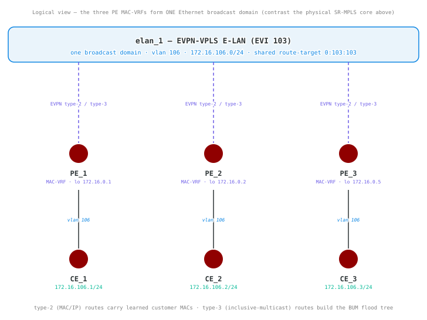
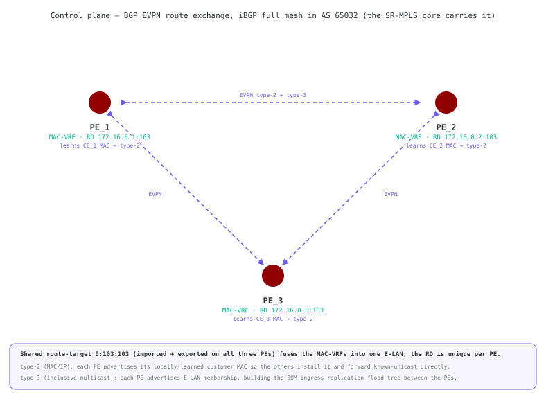
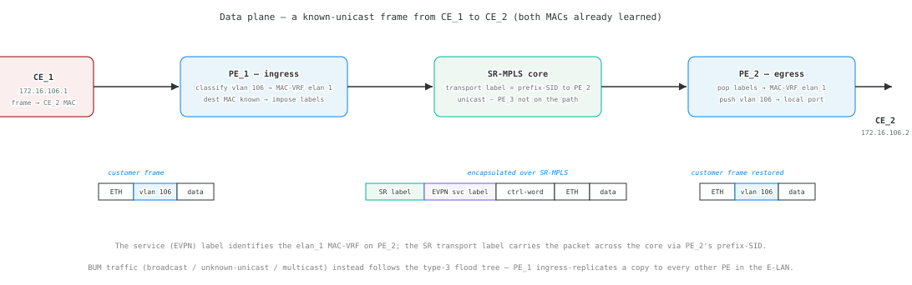
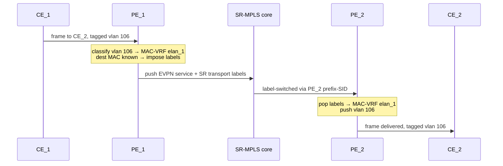

# S3 — EVPN-VPLS

## Goals

Build a multipoint EVPN-VPLS (E-LAN) service over the recommended F4
SR-MPLS/iBGP foundation. This lab extends EVPN from the point-to-point VPWS of
S2 to a single broadcast domain shared by three sites, where the PEs learn
customer MACs and flood BUM traffic over the EVPN overlay.

By the end of this lab you will be able to:

- Configure a shared EVPN-VPLS MAC-VRF (`elan_1`) on all three PEs
- Attach one customer site per PE (CE_1, CE_2, CE_3) on VLAN 106
- Explain how a route-distinguisher, a shared route-target, and type-3 routes
  build the E-LAN and its BUM flood tree
- Verify MAC learning and full-mesh reachability across the three CEs

## Prerequisites

- Complete F1 through F4, or deploy this lab with its included F4 baseline.
- Confirm SR-MPLS and iBGP (including the `l2vpn evpn` address family) are
  operational across all three PEs before configuring the service.
- Make the SAOS 10x image `vrnetlab/ciena_saos:10-12-00-0228` (release 10.12.00.0228) available to Containerlab.
- Activate the built-in trial license after deployment.

## Topology


All three PEs terminate the E-LAN — each has one attached customer site. The
SR-MPLS core and the iBGP `l2vpn evpn` overlay arrive preloaded and fully
meshed across PE_1, PE_2, and PE_3. CE_1, CE_2, and CE_3 share one IP subnet
(`172.16.106.0/24`) on VLAN 106.

The diagrams above show the **physical** wiring — the SR-MPLS core triangle and
each customer link. The service you build is **logical**: the per-PE MAC-VRFs
join into a single Ethernet broadcast domain, so the three CEs behave as if
plugged into one switch. That abstraction is what the rest of the lab
configures and verifies:



**How the PEs learn each other's customers** — over the iBGP EVPN mesh each PE
advertises its locally learned customer MACs (type-2) and its E-LAN membership
(type-3). The shared route-target binds the three MAC-VRFs into one E-LAN:



**How a frame crosses the E-LAN** — a known-unicast frame is classified on
VLAN 106, label-switched across the SR-MPLS core (EVPN service label + SR
transport label), then de-encapsulated and delivered at the far PE:



The same known-unicast walk as a message sequence:



### Node roles and loopback addressing

| Node | Role | Loopback |
| --- | --- | --- |
| PE_1 | E-LAN PE (serves CE_1) | 172.16.0.1/32 |
| PE_2 | E-LAN PE (serves CE_2) | 172.16.0.2/32 |
| PE_3 | E-LAN PE (serves CE_3) | 172.16.0.5/32 |
| CE_1 | Customer edge | 172.16.106.1/24 |
| CE_2 | Customer edge | 172.16.106.2/24 |
| CE_3 | Customer edge | 172.16.106.3/24 |

## Deploy

### Startup Configs

The checkpoint baseline each node boots from. If you are assembling the lab by hand, create a `configs/` folder next to [`topo.clab.yml`](./topo.clab.yml) and copy each file into it before you deploy.

- [PE_1.cfg.partial](./configs/PE_1.cfg.partial)
- [PE_2.cfg.partial](./configs/PE_2.cfg.partial)
- [PE_3.cfg.partial](./configs/PE_3.cfg.partial)
- [CE_1.cfg.partial](./configs/CE_1.cfg.partial)
- [CE_2.cfg.partial](./configs/CE_2.cfg.partial)
- [CE_3.cfg.partial](./configs/CE_3.cfg.partial)

### Containerlab topology

Download the topology file: [`topo.clab.yml`](./topo.clab.yml)

```yaml
name: S3-EVPN-VPLS
topology:
  defaults:
    kind: ciena_saos
    image: vrnetlab/ciena_saos:10-12-00-0228
    labels:
      lab-mode: hands-on
      prereq-lab: F4-BGP
  nodes:
    PE_1:
      type: '5162'
      startup-config: configs/PE_1.cfg.partial
    PE_2:
      type: '5162'
      startup-config: configs/PE_2.cfg.partial
    PE_3:
      type: '5162'
      startup-config: configs/PE_3.cfg.partial
    CE_1:
      type: '3984'
      startup-config: configs/CE_1.cfg.partial
    CE_2:
      type: '3984'
      startup-config: configs/CE_2.cfg.partial
    CE_3:
      type: '3984'
      startup-config: configs/CE_3.cfg.partial
  links:
  - endpoints: [ "PE_1:1", "PE_2:1" ]
  - endpoints: [ "PE_1:2", "CE_1:1" ]
  - endpoints: [ "PE_2:2", "CE_2:1" ]
  - endpoints: [ "PE_2:4", "PE_3:1" ]
  - endpoints: [ "PE_1:4", "PE_3:3" ]
  - endpoints: [ "CE_3:1", "PE_3:2" ]
```

### Start from checkpoint

```bash
LAB=S3-EVPN-VPLS
cd labs/${LAB}            # from the repo root, or cd into the unpacked directory
containerlab deploy -t topo.clab.yml
```

Equivalent invocation from the repo root:

```bash
containerlab deploy -t "labs/${LAB}/topo.clab.yml"
```

Once all six nodes reach healthy state, connect to them to complete the
tasks:

```bash
ssh diag@clab-S3-EVPN-VPLS-PE_1
ssh diag@clab-S3-EVPN-VPLS-PE_2
ssh diag@clab-S3-EVPN-VPLS-PE_3
ssh diag@clab-S3-EVPN-VPLS-CE_1
ssh diag@clab-S3-EVPN-VPLS-CE_2
ssh diag@clab-S3-EVPN-VPLS-CE_3
```

Default credentials: `diag` / `ciena123`

## Instructions

<!-- task-index -->
- [Task 1: Verify the deployed topology](#task-1)
- [Task 2: Configure the EVPN-VPLS MAC-VRF on the PEs](#task-2)
- [Task 3: Configure customer edge CE_1](#task-3)
- [Task 4: Configure customer edge CE_2](#task-4)
- [Task 5: Configure customer edge CE_3 and verify the E-LAN](#task-5)

<a id="task-1"></a>
### Task 1: Verify the deployed topology
<a href="#task-1" title="Direct link to this task (right-click to copy)">🔗</a>

<!-- prose: detailed -->

**Summary** — This lab starts from a fully built core. All three PEs arrive
preloaded with the SR-MPLS underlay (IS-IS instance `Bootcamp`, prefix-SIDs on
`lb1` `172.16.0.1`, `172.16.0.2`, and `172.16.0.5`) and an iBGP full mesh in AS
`65032` whose `l2vpn evpn` address family is already established. The three CEs
boot with only their hostnames — building the customer-facing E-LAN is the work
of the remaining tasks.

**Implementation** — Before configuring anything, confirm the starting state:
each CE should see its directly attached PE over LLDP, and PE_1's BGP table
should show the session to PE_3 (`172.16.0.5`) established. If these do not
hold, the overlay is not ready and the service tasks will not converge.

<!-- verify-prose -->

Confirm the fabric converged before building anything on top of it. Each CE
should see its directly attached PE in the LLDP neighbor table, and PE_1's BGP
table should list the session to PE_3 (`172.16.0.5`) as `Established`. That last
check is the important one: it proves the `l2vpn evpn` address family — the
overlay that will carry every customer MAC — is already up across the core. If a
check has not passed yet, give the control plane another minute to settle.

<!-- retry: 60s -->
**Verify** (show mode) on **CE_1**:

```saos-show
show lldp neighbors
```

Pass: Output contains `system-name` and `PE_1`

<details><summary>Example output</summary>

```
+--------------- LLDP NEIGHBORS ---------------+
| Parameter                   | Value          |
+-----------------------------+----------------+
| interface                   | 1              |
| chassis-id                  | 0C008A2347F1   |
| chassis-id-subtype          | mac-address    |
| port-desc                   | 2              |
| port-id                     | 2              |
| port-id-subtype             | interface-name |
| system-capability-supported | bridge         |
| system-capability-enabled   | bridge         |
| system-description          | 5162           |
| system-name                 | PE_1           |
| auto-neg-supported          | True           |
| auto-neg-enabled            | False          |
| oper-mau-type               | 33             |
| port-class                  | p-class-pd     |
| mdi-supported               | False          |
| mdi-enabled                 | False          |
| pair-controlable            | False          |
| agg-status                  | capable        |
| max-frame-size              | 1526           |
| man-address-subtype         | ipv4           |
| man-address                 | 10.0.0.15      |
| if-subtype                  | if-index       |
+-----------------------------+----------------+
```

</details>

<!-- retry: 60s -->
**Verify** (show mode) on **CE_2**:

```saos-show
show lldp neighbors
```

Pass: Output contains `system-name` and `PE_2`

<details><summary>Example output</summary>

```
+--------------- LLDP NEIGHBORS ---------------+
| Parameter                   | Value          |
+-----------------------------+----------------+
| interface                   | 1              |
| chassis-id                  | 0C00714D89F1   |
| chassis-id-subtype          | mac-address    |
| port-desc                   | 2              |
| port-id                     | 2              |
| port-id-subtype             | interface-name |
| system-capability-supported | bridge         |
| system-capability-enabled   | bridge         |
| system-description          | 5162           |
| system-name                 | PE_2           |
| auto-neg-supported          | True           |
| auto-neg-enabled            | False          |
| oper-mau-type               | 33             |
| port-class                  | p-class-pd     |
| mdi-supported               | False          |
| mdi-enabled                 | False          |
| pair-controlable            | False          |
| agg-status                  | capable        |
| max-frame-size              | 1526           |
| man-address-subtype         | ipv4           |
| man-address                 | 10.0.0.15      |
| if-subtype                  | if-index       |
+-----------------------------+----------------+
```

</details>

<!-- retry: 60s -->
**Verify** (show mode) on **CE_3**:

```saos-show
show lldp neighbors
```

Pass: Output contains `system-name` and `PE_3`

<details><summary>Example output</summary>

```
+--------------- LLDP NEIGHBORS ---------------+
| Parameter                   | Value          |
+-----------------------------+----------------+
| interface                   | 1              |
| chassis-id                  | 0C00AC57DDF1   |
| chassis-id-subtype          | mac-address    |
| port-desc                   | 2              |
| port-id                     | 2              |
| port-id-subtype             | interface-name |
| system-capability-supported | bridge         |
| system-capability-enabled   | bridge         |
| system-description          | 5162           |
| system-name                 | PE_3           |
| auto-neg-supported          | True           |
| auto-neg-enabled            | False          |
| oper-mau-type               | 33             |
| port-class                  | p-class-pd     |
| mdi-supported               | False          |
| mdi-enabled                 | False          |
| pair-controlable            | False          |
| agg-status                  | capable        |
| max-frame-size              | 1526           |
| man-address-subtype         | ipv4           |
| man-address                 | 10.0.0.15      |
| if-subtype                  | if-index       |
+-----------------------------+----------------+
```

</details>

<!-- retry: 180s -->
**Verify** (show mode) on **PE_1**:

```saos-show
show bgp peers
```

Pass: Output contains `172.16.0.5` and `Established`

<details><summary>Example output</summary>

```
+-------------------------------------------------------------------------- BGP PEERS --------------------------------------------------------------------------+
|                                             |        |          | Up         | Peer    | Received | Advertised | Last       | Received | Sent   |             |
|                                             | Remote | Peer     | Time       | Table   | Pkt      | Pkt        | Reset      | Prefix   | Prefix |             |
| Peer                                        | AS     | Type     | (hh:mm:ss) | Version | Count    | Count      | (hh:mm:ss) | Count    | Count  | State       |
+---------------------------------------------+--------+----------+------------+---------+----------+------------+------------+----------+--------+-------------+
| 172.16.0.5                                  | 65032  | internal | 00:02:30   | 6       | 5        | 5          | -          | 2        | 2      | Established |
| 172.16.0.2                                  | 65032  | internal | 00:02:41   | 2       | 9        | 9          | -          | 3        | 3      | Established |
+---------------------------------------------+--------+----------+------------+---------+----------+------------+------------+----------+--------+-------------+
```

</details>

<a id="task-2"></a>
### Task 2: Configure the EVPN-VPLS MAC-VRF on the PEs
<a href="#task-2" title="Direct link to this task (right-click to copy)">🔗</a>

<!-- prose: in-depth -->

**Summary** — Build the service itself: one shared EVPN-VPLS MAC-VRF,
`elan_1`, configured identically on PE_1, PE_2, and PE_3 so the three sites
join a single Ethernet broadcast domain.

**Background** — EVPN-VPLS is a multipoint Layer 2 service — an E-LAN — where
every PE that imports the same route-target participates in one bridge. Unlike
the point-to-point VPWS cross-connect of S2, there are no mirrored service IDs:
each PE runs a MAC-VRF that learns customer MAC addresses locally and
advertises them to the others as EVPN type-2 (MAC/IP) routes over the iBGP
overlay. Broadcast, unknown-unicast, and multicast (BUM) traffic is flooded
using the type-3 (inclusive multicast) routes each PE advertises, which
together build an ingress-replication flood tree among the three MAC-VRFs. An
ip-based route-distinguisher keeps each PE's routes unique, while a
route-target imported and exported on all three PEs ties them into the same
E-LAN.

**Implementation** — On each PE, build the service-layer stack: a forwarding
domain `elan_1-fd` in `mode evpn-vpls`, a classifier `CLASSIFIER-106` matching
single-tagged frames with VLAN `106`, and a flow point `elan_1-fp` binding the
CE-facing port (`logical-port 2`) into the FD with an egress transform that
pushes tag `106` toward the CE. The lowercase `-fd`/`-fp` suffixes mark these
as service-scope objects, versus the uppercase underlay objects in the
baseline. Then bind the FD to BGP with EVPN instance `103`: an ip-based route
distinguisher unique per PE (`172.16.0.1:103`, `172.16.0.2:103`,
`172.16.0.5:103`) and the shared route-target `0:103:103` imported and exported
on every PE. Because the route-target is identical everywhere, all three
MAC-VRFs join one E-LAN.

**Configure** (config mode) on **PE_1**:

```saos-config
fds fd elan_1-fd mode evpn-vpls
classifiers classifier CLASSIFIER-106 filter-entry vtag-stack vtags 1 vlan-id 106
fps fp elan_1-fp fd-name elan_1-fd logical-port 2 stats-collection on classifier-list CLASSIFIER-106
fps fp elan_1-fp egress-l2-transform push-vid-106 vlan-stack 1 push-tpid tpid-8100 push-vid 106
evpn evpn-instances evpn-instance 103 vpls-fd elan_1-fd control-word true
evpn evpn-instances evpn-instance 103 route-distinguisher ip-based value 172.16.0.1:103
evpn evpn-instances evpn-instance 103 vpn-target 0:103:103 route-target-type both
```

**Configure** (config mode) on **PE_2**:

```saos-config
fds fd elan_1-fd mode evpn-vpls
classifiers classifier CLASSIFIER-106 filter-entry vtag-stack vtags 1 vlan-id 106
fps fp elan_1-fp fd-name elan_1-fd logical-port 2 stats-collection on classifier-list CLASSIFIER-106
fps fp elan_1-fp egress-l2-transform push-vid-106 vlan-stack 1 push-tpid tpid-8100 push-vid 106
evpn evpn-instances evpn-instance 103 vpls-fd elan_1-fd control-word true
evpn evpn-instances evpn-instance 103 route-distinguisher ip-based value 172.16.0.2:103
evpn evpn-instances evpn-instance 103 vpn-target 0:103:103 route-target-type both
```

**Configure** (config mode) on **PE_3**:

```saos-config
fds fd elan_1-fd mode evpn-vpls
classifiers classifier CLASSIFIER-106 filter-entry vtag-stack vtags 1 vlan-id 106
fps fp elan_1-fp fd-name elan_1-fd logical-port 2 stats-collection on classifier-list CLASSIFIER-106
fps fp elan_1-fp egress-l2-transform push-vid-106 vlan-stack 1 push-tpid tpid-8100 push-vid 106
evpn evpn-instances evpn-instance 103 vpls-fd elan_1-fd control-word true
evpn evpn-instances evpn-instance 103 route-distinguisher ip-based value 172.16.0.5:103
evpn evpn-instances evpn-instance 103 vpn-target 0:103:103 route-target-type both
```

<!-- verify-prose -->

These checks confirm the service exists identically on all three PEs before any
customer traffic flows. The forwarding-domain view should report `elan_1-fd` in
`evpn-vpls` mode on each PE, the classifier table should list `CLASSIFIER-106`,
and `show evpn instances` should show EVI `103` with route-target `0:103:103`.
The route-distinguisher differs per PE, but that shared route-target is what
fuses the three MAC-VRFs into one E-LAN. Nothing is learned yet — the CE ports
are still down, so the forwarding database stays empty until the sites come up.

Question: the route-distinguisher is unique per PE while the route-target is
identical everywhere. Which of the two makes the three MAC-VRFs one broadcast
domain, and what would break if the route-targets did not match?

**Verify** (show mode) on **PE_1**:

```saos-show
show forwarding-domains forwarding-domain elan_1-fd
```

Pass: Output contains `elan_1-fd` and `evpn-vpls`

<details><summary>Example output</summary>

```
+ FORWARDING DOMAIN +
| KEY  | VALUE      |
+------+------------+
| Name | elan_1-fd  |
| Mode | evpn-vpls  |
+------+------------+
```

</details>

**Verify** (show mode) on **PE_2**:

```saos-show
show forwarding-domains forwarding-domain elan_1-fd
```

Pass: Output contains `elan_1-fd` and `evpn-vpls`

<details><summary>Example output</summary>

```
+ FORWARDING DOMAIN +
| KEY  | VALUE      |
+------+------------+
| Name | elan_1-fd  |
| Mode | evpn-vpls  |
+------+------------+
```

</details>

**Verify** (show mode) on **PE_3**:

```saos-show
show forwarding-domains forwarding-domain elan_1-fd
```

Pass: Output contains `elan_1-fd` and `evpn-vpls`

<details><summary>Example output</summary>

```
+ FORWARDING DOMAIN +
| KEY  | VALUE      |
+------+------------+
| Name | elan_1-fd  |
| Mode | evpn-vpls  |
+------+------------+
```

</details>

**Verify** (show mode) on **PE_1**:

```saos-show
show classifiers
```

Pass: Output contains `CLASSIFIER-106` and `106`

<details><summary>Example output</summary>

```
+---------------------- CLASSIFIER ---------------------+
| Name                | Filter Parameter                |
+---------------------+---------------------------------+
| CLASSIFIER-106      | Classifier:single-tagged        |
| CLASSIFIER-UNTAGGED | ciena-mef-classifier:vtag-stack |
| default-vid-127     | Classifier:single-tagged        |
+---------------------+---------------------------------+
```

</details>

<!-- retry: 120s -->
**Verify** (show mode) on **PE_1**:

```saos-show
show evpn instances
```

Pass: Output contains `103` and `0:103:103`

<details><summary>Example output</summary>

```
+-------------------------------------- EVPN INSTANCE STATE ---------------------------------------+
|         | Route          | Route     |       SR Policy        |       Number of       |   SRv6   |
| EVPN ID | Distinguisher  | Targets   |    Color    | Fallback | Cross-Connect Entries |  Locator |
+---------+----------------+-----------+-------------+----------+-----------------------+----------+
| 103     | 172.16.0.1:103 | 0:103:103 |      -      |  enable  |           1           |    -     |
+---------+----------------+-----------+-------------+----------+-----------------------+----------+
```

</details>

<a id="task-3"></a>
### Task 3: Configure customer edge CE_1
<a href="#task-3" title="Direct link to this task (right-click to copy)">🔗</a>

<!-- prose: detailed -->

**Summary** — Configure the first customer site. CE_1 emulates a customer
device with an IP host in the shared E-LAN subnet and a VLAN-106 attachment
circuit toward PE_1.

**Implementation** — On CE_1, create a local `mode vpls` bridge `CE_1-PE_1-FD`,
give it an IP interface at `172.16.106.1/24` (the customer host address), and
add a flow point on the uplink (`logical-port 1`) that classifies and pushes
VLAN `106` toward PE_1. This is the same attachment pattern used on every CE in
this lab — only the host address and the node names change.

**Configure** (config mode) on **CE_1**:

```saos-config
fds fd CE_1-PE_1-FD mode vpls
oc-if:interfaces interface CE_1-PE_1-if config mtu 1500 name CE_1-PE_1-if type ip
oc-if:interfaces interface CE_1-PE_1-if config underlay-binding config fd CE_1-PE_1-FD
oc-if:interfaces interface CE_1-PE_1-if ipv4 addresses address 172.16.106.1 config ip 172.16.106.1 prefix-length 24
classifiers classifier CLASSIFIER-106 filter-entry vtag-stack vtags 1 vlan-id 106
fps fp CE_1-PE_1-FP fd-name CE_1-PE_1-FD logical-port 1 stats-collection on classifier-list CLASSIFIER-106
fps fp CE_1-PE_1-FP egress-l2-transform push-vid-106 vlan-stack 1 push-tpid tpid-8100 push-vid 106
```

<!-- verify-prose -->

The flow-point view should show `CE_1-PE_1-FP` bound to `CE_1-PE_1-FD` with the
`push-vid-106` egress transform — CE_1 is now tagging its traffic into the E-LAN.
Only one site exists so far, so there is nothing to reach yet; end-to-end
reachability is proven as the other two sites come online.

**Verify** (show mode) on **CE_1**:

```saos-show
show flow-points flow-point CE_1-PE_1-FP
```

Pass: Output contains `CE_1-PE_1-FP` and `CE_1-PE_1-FD` and `push-vid-106`

<details><summary>Example output</summary>

```
+--------------- FLOW POINT --------------+
| KEY                    | VALUE          |
+------------------------+----------------+
| Name                   | CE_1-PE_1-FP   |
| Forwarding Domain Name | CE_1-PE_1-FD   |
| Logical Port           | 1              |
| Statistics Collection  | on             |
| MTU Size               | 2000           |
| Admin State            | enabled        |
| Egress L2 Transform    |                |
|   Egress Name          | push-vid-106   |
|   Egress VLAN Stack    |                |
|     Tag                | 1              |
|     Push TPID          | tpid-8100      |
|     Push VID           | 106            |
| Classifier List        |                |
|                        | CLASSIFIER-106 |
+------------------------+----------------+
+------ FLOW POINT STATISTICS -------+
| KEY                 | VALUE        |
+---------------------+--------------+
| Name                | CE_1-PE_1-FP |
| Rx Accepted Bytes   | 86728042     |
| Rx Accepted Frames  | 889874       |
| Tx Forwarded Bytes  | 4796         |
| Tx Forwarded Frames | 53           |
| Rx Yellow Bytes     | 0            |
| Rx Yellow Frames    | 0            |
| Rx Dropped Bytes    | 0            |
| Rx Dropped Frames   | 396870       |
+---------------------+--------------+
+----------- FLOW POINT STATE -----------+
| KEY                 | VALUE            |
+---------------------+------------------+
| Name                | CE_1-PE_1-FP     |
| Oper State          | up               |
| Oper Up Time        | 0 days,0h:1m:31s |
| Egress L2 Transform |                  |
|   Egress VLAN Stack |                  |
|     Tag             | 1                |
|     Push TPID       | tpid-8100        |
|     Push VID        | 106              |
+---------------------+------------------+
```

</details>

<a id="task-4"></a>
### Task 4: Configure customer edge CE_2
<a href="#task-4" title="Direct link to this task (right-click to copy)">🔗</a>

<!-- prose: simple -->

Repeat the CE_1 attachment on CE_2, using host address `172.16.106.2/24` and the
`CE_2-PE_2` objects toward PE_2. With two sites up, CE_1 and CE_2 should now reach
each other across the E-LAN.

**Configure** (config mode) on **CE_2**:

```saos-config
fds fd CE_2-PE_2-FD mode vpls
oc-if:interfaces interface CE_2-PE_2-if config mtu 1500 name CE_2-PE_2-if type ip
oc-if:interfaces interface CE_2-PE_2-if config underlay-binding config fd CE_2-PE_2-FD
oc-if:interfaces interface CE_2-PE_2-if ipv4 addresses address 172.16.106.2 config ip 172.16.106.2 prefix-length 24
classifiers classifier CLASSIFIER-106 filter-entry vtag-stack vtags 1 vlan-id 106
fps fp CE_2-PE_2-FP fd-name CE_2-PE_2-FD logical-port 1 stats-collection on classifier-list CLASSIFIER-106
fps fp CE_2-PE_2-FP egress-l2-transform push-vid-106 vlan-stack 1 push-tpid tpid-8100 push-vid 106
```

<!-- verify-prose -->

CE_2's flow point mirrors CE_1's (`CE_2-PE_2-FP` binding `CE_2-PE_2-FD`, pushing VLAN
`106`). With two sites up, they should now reach each other across the E-LAN —
ping CE_2's `172.16.106.2` from CE_1. Expect the very first packet to drop while
ARP resolves and the PEs learn the two MACs; the check retries, and a warmed
ping reports `100.00 percent`.

**Verify** (show mode) on **CE_2**:

```saos-show
show flow-points flow-point CE_2-PE_2-FP
```

Pass: Output contains `CE_2-PE_2-FP` and `CE_2-PE_2-FD` and `push-vid-106`

<details><summary>Example output</summary>

```
+--------------- FLOW POINT --------------+
| KEY                    | VALUE          |
+------------------------+----------------+
| Name                   | CE_2-PE_2-FP   |
| Forwarding Domain Name | CE_2-PE_2-FD   |
| Logical Port           | 1              |
| Statistics Collection  | on             |
| MTU Size               | 2000           |
| Admin State            | enabled        |
| Egress L2 Transform    |                |
|   Egress Name          | push-vid-106   |
|   Egress VLAN Stack    |                |
|     Tag                | 1              |
|     Push TPID          | tpid-8100      |
|     Push VID           | 106            |
| Classifier List        |                |
|                        | CLASSIFIER-106 |
+------------------------+----------------+
+------ FLOW POINT STATISTICS -------+
| KEY                 | VALUE        |
+---------------------+--------------+
| Name                | CE_2-PE_2-FP |
| Rx Accepted Bytes   | 66881244     |
| Rx Accepted Frames  | 674482       |
| Tx Forwarded Bytes  | 1672564      |
| Tx Forwarded Frames | 26116        |
| Rx Yellow Bytes     | 0            |
| Rx Yellow Frames    | 0            |
| Rx Dropped Bytes    | 0            |
| Rx Dropped Frames   | 271287       |
+---------------------+--------------+
+----------- FLOW POINT STATE -----------+
| KEY                 | VALUE            |
+---------------------+------------------+
| Name                | CE_2-PE_2-FP     |
| Oper State          | up               |
| Oper Up Time        | 0 days,0h:1m:31s |
| Egress L2 Transform |                  |
|   Egress VLAN Stack |                  |
|     Tag             | 1                |
|     Push TPID       | tpid-8100        |
|     Push VID        | 106              |
+---------------------+------------------+
```

</details>

<!-- retry: 60s -->
**Verify** (show mode) on **CE_1**:

```saos-show
ping ip destination 172.16.106.2 source 172.16.106.1 repeat-count 5
```

Pass: Output contains `100.00 percent`

<details><summary>Example output</summary>

```
Sending 5 ICMP Echos to 172.16.106.2, timeout is 1 second

Codes: 
'!' - Success, 'Q' - Request not sent, '.' - Timeout 

 Type 'Ctrl+C' to abort

! seq_num = 1  RTT = 5.43 ms  TTL = 255
! seq_num = 2  RTT = 8.87 ms  TTL = 255
! seq_num = 3  RTT = 6.77 ms  TTL = 255
! seq_num = 4  RTT = 7.89 ms  TTL = 255
! seq_num = 5  RTT = 6.28 ms  TTL = 255
Success Rate is 100.00 percent (5/5)
Round-trip min/avg/max = 5.43/7.05/8.87
```

</details>

<a id="task-5"></a>
### Task 5: Configure customer edge CE_3 and verify the E-LAN
<a href="#task-5" title="Direct link to this task (right-click to copy)">🔗</a>

<!-- prose: simple -->

Repeat the attachment on CE_3, using host address `172.16.106.3/24` and the
`CE_3-PE_3` objects toward PE_3. All three sites are now in the E-LAN; verify
full-mesh reachability between every pair of CEs.

**Configure** (config mode) on **CE_3**:

```saos-config
fds fd CE_3-PE_3-FD mode vpls
oc-if:interfaces interface CE_3-PE_3-if config mtu 1500 name CE_3-PE_3-if type ip
oc-if:interfaces interface CE_3-PE_3-if config underlay-binding config fd CE_3-PE_3-FD
oc-if:interfaces interface CE_3-PE_3-if ipv4 addresses address 172.16.106.3 config ip 172.16.106.3 prefix-length 24
classifiers classifier CLASSIFIER-106 filter-entry vtag-stack vtags 1 vlan-id 106
fps fp CE_3-PE_3-FP fd-name CE_3-PE_3-FD logical-port 1 stats-collection on classifier-list CLASSIFIER-106
fps fp CE_3-PE_3-FP egress-l2-transform push-vid-106 vlan-stack 1 push-tpid tpid-8100 push-vid 106
```

<!-- verify-prose -->

This is the capstone. With CE_3 attached, all three sites share one broadcast
domain, so every CE should reach every other CE — ping across the full mesh (as
before, the first packet in a newly learned direction may drop during ARP).
Then `show evpn instances vpls forwarding-database` on PE_1 makes the control
plane visible: next to PE_1's locally learned MAC you should see the CE_2 and CE_3
MACs installed as remote entries, reachable via the advertising PE's loopback
(`172.16.0.2` and `172.16.0.5`). That is EVPN at work — each PE learns its local
customer MACs and advertises them as type-2 routes so the others can unicast
directly, while the type-3 routes flood the BUM traffic that bootstraps that
learning.

**Verify** (show mode) on **CE_3**:

```saos-show
show flow-points flow-point CE_3-PE_3-FP
```

Pass: Output contains `CE_3-PE_3-FP` and `CE_3-PE_3-FD` and `push-vid-106`

<details><summary>Example output</summary>

```
+--------------- FLOW POINT --------------+
| KEY                    | VALUE          |
+------------------------+----------------+
| Name                   | CE_3-PE_3-FP   |
| Forwarding Domain Name | CE_3-PE_3-FD   |
| Logical Port           | 1              |
| Statistics Collection  | on             |
| MTU Size               | 2000           |
| Admin State            | enabled        |
| Egress L2 Transform    |                |
|   Egress Name          | push-vid-106   |
|   Egress VLAN Stack    |                |
|     Tag                | 1              |
|     Push TPID          | tpid-8100      |
|     Push VID           | 106            |
| Classifier List        |                |
|                        | CLASSIFIER-106 |
+------------------------+----------------+
+------ FLOW POINT STATISTICS -------+
| KEY                 | VALUE        |
+---------------------+--------------+
| Name                | CE_3-PE_3-FP |
| Rx Accepted Bytes   | 30909270     |
| Rx Accepted Frames  | 329440       |
| Tx Forwarded Bytes  | 4310760      |
| Tx Forwarded Frames | 67330        |
| Rx Yellow Bytes     | 0            |
| Rx Yellow Frames    | 0            |
| Rx Dropped Bytes    | 0            |
| Rx Dropped Frames   | 114946       |
+---------------------+--------------+
+----------- FLOW POINT STATE ----------+
| KEY                 | VALUE           |
+---------------------+-----------------+
| Name                | CE_3-PE_3-FP    |
| Oper State          | up              |
| Oper Up Time        | 0 days,0h:1m:7s |
| Egress L2 Transform |                 |
|   Egress VLAN Stack |                 |
|     Tag             | 1               |
|     Push TPID       | tpid-8100       |
|     Push VID        | 106             |
+---------------------+-----------------+
```

</details>

<!-- retry: 60s -->
**Verify** (show mode) on **CE_1**:

```saos-show
ping ip destination 172.16.106.3 source 172.16.106.1 repeat-count 5
```

Pass: Output contains `100.00 percent`

<details><summary>Example output</summary>

```
Sending 5 ICMP Echos to 172.16.106.3, timeout is 1 second

Codes: 
'!' - Success, 'Q' - Request not sent, '.' - Timeout 

 Type 'Ctrl+C' to abort

! seq_num = 1  RTT = 5.00 ms  TTL = 255
! seq_num = 2  RTT = 4.51 ms  TTL = 255
! seq_num = 3  RTT = 6.62 ms  TTL = 255
! seq_num = 4  RTT = 6.71 ms  TTL = 255
! seq_num = 5  RTT = 6.23 ms  TTL = 255
Success Rate is 100.00 percent (5/5)
Round-trip min/avg/max = 4.51/5.81/6.71
```

</details>

<!-- retry: 60s -->
**Verify** (show mode) on **CE_2**:

```saos-show
ping ip destination 172.16.106.3 source 172.16.106.2 repeat-count 5
```

Pass: Output contains `100.00 percent`

<details><summary>Example output</summary>

```
Sending 5 ICMP Echos to 172.16.106.3, timeout is 1 second

Codes: 
'!' - Success, 'Q' - Request not sent, '.' - Timeout 

 Type 'Ctrl+C' to abort

! seq_num = 1  RTT = 6.15 ms  TTL = 255
! seq_num = 2  RTT = 6.87 ms  TTL = 255
! seq_num = 3  RTT = 5.36 ms  TTL = 255
! seq_num = 4  RTT = 7.52 ms  TTL = 255
! seq_num = 5  RTT = 6.44 ms  TTL = 255
Success Rate is 100.00 percent (5/5)
Round-trip min/avg/max = 5.36/6.47/7.52
```

</details>

<!-- retry: 60s -->
**Verify** (show mode) on **CE_3**:

```saos-show
ping ip destination 172.16.106.1 source 172.16.106.3 repeat-count 5
```

Pass: Output contains `100.00 percent`

<details><summary>Example output</summary>

```
Sending 5 ICMP Echos to 172.16.106.1, timeout is 1 second

Codes: 
'!' - Success, 'Q' - Request not sent, '.' - Timeout 

 Type 'Ctrl+C' to abort

! seq_num = 1  RTT = 6.98 ms  TTL = 255
! seq_num = 2  RTT = 6.00 ms  TTL = 255
! seq_num = 3  RTT = 6.36 ms  TTL = 255
! seq_num = 4  RTT = 4.74 ms  TTL = 255
! seq_num = 5  RTT = 6.32 ms  TTL = 255
Success Rate is 100.00 percent (5/5)
Round-trip min/avg/max = 4.74/6.08/6.98
```

</details>

<!-- retry: 60s -->
**Verify** (show mode) on **PE_1**:

```saos-show
show evpn instances vpls forwarding-database
```

Pass: Output contains `elan_1-fd` and `172.16.0.2` and `172.16.0.5`

<details><summary>Example output</summary>

```
+--------------------------------------------------+
| Codes: > - installed FTN,                        |
|        L - local, R - remote,                    |
|        C - control-word, P - primary, B - backup |
+--------------------------------------------------+
+-------------------------------------------------------- EVPN VPLS FORWARDING DATABASE ---------------------------------------------------------+
| State | EVPN ID | Forwarding Domain | MAC            | IP | Next Hop   |  Ethernet Segment Identifier  | Out Label | SRv6 Service SID | Flags  |
+-------+---------+-------------------+----------------+----+------------+-------------------------------+-----------+------------------+--------+
|   >   |   103   | elan_1-fd         | 0c00:4fd6:fbf5 | -  | 172.16.0.2 | 00:00:00:00:00:00:00:00:00:00 | 132000    | -                | (R)(C) |
|       |   103   | elan_1-fd         | 0c00:d033:10f5 | -  | 0.0.0.0    | 00:00:00:00:00:00:00:00:00:00 | 132000    | -                | (L)(C) |
|   >   |   103   | elan_1-fd         | 0c00:d8b5:43f5 | -  | 172.16.0.5 | 00:00:00:00:00:00:00:00:00:00 | 132000    | -                | (R)(C) |
+-------+---------+-------------------+----------------+----+------------+-------------------------------+-----------+------------------+--------+
```

</details>

## Tests

Deploy `S3-EVPN-VPLS`, then run the following validation checks.

### G1: Task 1 — Verify the deployed topology

<!-- retry: 60s -->
On **CE_1**, run:

```saos
show lldp neighbors
```

Pass: Output contains `system-name` and `PE_1`

<details><summary>Example output</summary>

```
+--------------- LLDP NEIGHBORS ---------------+
| Parameter                   | Value          |
+-----------------------------+----------------+
| interface                   | 1              |
| chassis-id                  | 0C008A2347F1   |
| chassis-id-subtype          | mac-address    |
| port-desc                   | 2              |
| port-id                     | 2              |
| port-id-subtype             | interface-name |
| system-capability-supported | bridge         |
| system-capability-enabled   | bridge         |
| system-description          | 5162           |
| system-name                 | PE_1           |
| auto-neg-supported          | True           |
| auto-neg-enabled            | False          |
| oper-mau-type               | 33             |
| port-class                  | p-class-pd     |
| mdi-supported               | False          |
| mdi-enabled                 | False          |
| pair-controlable            | False          |
| agg-status                  | capable        |
| max-frame-size              | 1526           |
| man-address-subtype         | ipv4           |
| man-address                 | 10.0.0.15      |
| if-subtype                  | if-index       |
+-----------------------------+----------------+
```

</details>

<!-- retry: 60s -->
On **CE_2**, run:

```saos
show lldp neighbors
```

Pass: Output contains `system-name` and `PE_2`

<details><summary>Example output</summary>

```
+--------------- LLDP NEIGHBORS ---------------+
| Parameter                   | Value          |
+-----------------------------+----------------+
| interface                   | 1              |
| chassis-id                  | 0C00714D89F1   |
| chassis-id-subtype          | mac-address    |
| port-desc                   | 2              |
| port-id                     | 2              |
| port-id-subtype             | interface-name |
| system-capability-supported | bridge         |
| system-capability-enabled   | bridge         |
| system-description          | 5162           |
| system-name                 | PE_2           |
| auto-neg-supported          | True           |
| auto-neg-enabled            | False          |
| oper-mau-type               | 33             |
| port-class                  | p-class-pd     |
| mdi-supported               | False          |
| mdi-enabled                 | False          |
| pair-controlable            | False          |
| agg-status                  | capable        |
| max-frame-size              | 1526           |
| man-address-subtype         | ipv4           |
| man-address                 | 10.0.0.15      |
| if-subtype                  | if-index       |
+-----------------------------+----------------+
```

</details>

<!-- retry: 60s -->
On **CE_3**, run:

```saos
show lldp neighbors
```

Pass: Output contains `system-name` and `PE_3`

<details><summary>Example output</summary>

```
+--------------- LLDP NEIGHBORS ---------------+
| Parameter                   | Value          |
+-----------------------------+----------------+
| interface                   | 1              |
| chassis-id                  | 0C00AC57DDF1   |
| chassis-id-subtype          | mac-address    |
| port-desc                   | 2              |
| port-id                     | 2              |
| port-id-subtype             | interface-name |
| system-capability-supported | bridge         |
| system-capability-enabled   | bridge         |
| system-description          | 5162           |
| system-name                 | PE_3           |
| auto-neg-supported          | True           |
| auto-neg-enabled            | False          |
| oper-mau-type               | 33             |
| port-class                  | p-class-pd     |
| mdi-supported               | False          |
| mdi-enabled                 | False          |
| pair-controlable            | False          |
| agg-status                  | capable        |
| max-frame-size              | 1526           |
| man-address-subtype         | ipv4           |
| man-address                 | 10.0.0.15      |
| if-subtype                  | if-index       |
+-----------------------------+----------------+
```

</details>

<!-- retry: 180s -->
On **PE_1**, run:

```saos
show bgp peers
```

Pass: Output contains `172.16.0.5` and `Established`

<details><summary>Example output</summary>

```
+-------------------------------------------------------------------------- BGP PEERS --------------------------------------------------------------------------+
|                                             |        |          | Up         | Peer    | Received | Advertised | Last       | Received | Sent   |             |
|                                             | Remote | Peer     | Time       | Table   | Pkt      | Pkt        | Reset      | Prefix   | Prefix |             |
| Peer                                        | AS     | Type     | (hh:mm:ss) | Version | Count    | Count      | (hh:mm:ss) | Count    | Count  | State       |
+---------------------------------------------+--------+----------+------------+---------+----------+------------+------------+----------+--------+-------------+
| 172.16.0.5                                  | 65032  | internal | 00:02:30   | 6       | 5        | 5          | -          | 2        | 2      | Established |
| 172.16.0.2                                  | 65032  | internal | 00:02:41   | 2       | 9        | 9          | -          | 3        | 3      | Established |
+---------------------------------------------+--------+----------+------------+---------+----------+------------+------------+----------+--------+-------------+
```

</details>

### G2: Task 2 — Configure the EVPN-VPLS MAC-VRF on the PEs

On **PE_1**, run:

```saos
show forwarding-domains forwarding-domain elan_1-fd
```

Pass: Output contains `elan_1-fd` and `evpn-vpls`

<details><summary>Example output</summary>

```
+ FORWARDING DOMAIN +
| KEY  | VALUE      |
+------+------------+
| Name | elan_1-fd  |
| Mode | evpn-vpls  |
+------+------------+
```

</details>

On **PE_2**, run:

```saos
show forwarding-domains forwarding-domain elan_1-fd
```

Pass: Output contains `elan_1-fd` and `evpn-vpls`

<details><summary>Example output</summary>

```
+ FORWARDING DOMAIN +
| KEY  | VALUE      |
+------+------------+
| Name | elan_1-fd  |
| Mode | evpn-vpls  |
+------+------------+
```

</details>

On **PE_3**, run:

```saos
show forwarding-domains forwarding-domain elan_1-fd
```

Pass: Output contains `elan_1-fd` and `evpn-vpls`

<details><summary>Example output</summary>

```
+ FORWARDING DOMAIN +
| KEY  | VALUE      |
+------+------------+
| Name | elan_1-fd  |
| Mode | evpn-vpls  |
+------+------------+
```

</details>

On **PE_1**, run:

```saos
show classifiers
```

Pass: Output contains `CLASSIFIER-106` and `106`

<details><summary>Example output</summary>

```
+---------------------- CLASSIFIER ---------------------+
| Name                | Filter Parameter                |
+---------------------+---------------------------------+
| CLASSIFIER-106      | Classifier:single-tagged        |
| CLASSIFIER-UNTAGGED | ciena-mef-classifier:vtag-stack |
| default-vid-127     | Classifier:single-tagged        |
+---------------------+---------------------------------+
```

</details>

<!-- retry: 120s -->
On **PE_1**, run:

```saos
show evpn instances
```

Pass: Output contains `103` and `0:103:103`

<details><summary>Example output</summary>

```
+-------------------------------------- EVPN INSTANCE STATE ---------------------------------------+
|         | Route          | Route     |       SR Policy        |       Number of       |   SRv6   |
| EVPN ID | Distinguisher  | Targets   |    Color    | Fallback | Cross-Connect Entries |  Locator |
+---------+----------------+-----------+-------------+----------+-----------------------+----------+
| 103     | 172.16.0.1:103 | 0:103:103 |      -      |  enable  |           1           |    -     |
+---------+----------------+-----------+-------------+----------+-----------------------+----------+
```

</details>

### G3: Task 3 — Configure customer edge CE_1

On **CE_1**, run:

```saos
show flow-points flow-point CE_1-PE_1-FP
```

Pass: Output contains `CE_1-PE_1-FP` and `CE_1-PE_1-FD` and `push-vid-106`

<details><summary>Example output</summary>

```
+--------------- FLOW POINT --------------+
| KEY                    | VALUE          |
+------------------------+----------------+
| Name                   | CE_1-PE_1-FP   |
| Forwarding Domain Name | CE_1-PE_1-FD   |
| Logical Port           | 1              |
| Statistics Collection  | on             |
| MTU Size               | 2000           |
| Admin State            | enabled        |
| Egress L2 Transform    |                |
|   Egress Name          | push-vid-106   |
|   Egress VLAN Stack    |                |
|     Tag                | 1              |
|     Push TPID          | tpid-8100      |
|     Push VID           | 106            |
| Classifier List        |                |
|                        | CLASSIFIER-106 |
+------------------------+----------------+
+------ FLOW POINT STATISTICS -------+
| KEY                 | VALUE        |
+---------------------+--------------+
| Name                | CE_1-PE_1-FP |
| Rx Accepted Bytes   | 86728042     |
| Rx Accepted Frames  | 889874       |
| Tx Forwarded Bytes  | 4796         |
| Tx Forwarded Frames | 53           |
| Rx Yellow Bytes     | 0            |
| Rx Yellow Frames    | 0            |
| Rx Dropped Bytes    | 0            |
| Rx Dropped Frames   | 396870       |
+---------------------+--------------+
+----------- FLOW POINT STATE -----------+
| KEY                 | VALUE            |
+---------------------+------------------+
| Name                | CE_1-PE_1-FP     |
| Oper State          | up               |
| Oper Up Time        | 0 days,0h:1m:31s |
| Egress L2 Transform |                  |
|   Egress VLAN Stack |                  |
|     Tag             | 1                |
|     Push TPID       | tpid-8100        |
|     Push VID        | 106              |
+---------------------+------------------+
```

</details>

### G4: Task 4 — Configure customer edge CE_2

On **CE_2**, run:

```saos
show flow-points flow-point CE_2-PE_2-FP
```

Pass: Output contains `CE_2-PE_2-FP` and `CE_2-PE_2-FD` and `push-vid-106`

<details><summary>Example output</summary>

```
+--------------- FLOW POINT --------------+
| KEY                    | VALUE          |
+------------------------+----------------+
| Name                   | CE_2-PE_2-FP   |
| Forwarding Domain Name | CE_2-PE_2-FD   |
| Logical Port           | 1              |
| Statistics Collection  | on             |
| MTU Size               | 2000           |
| Admin State            | enabled        |
| Egress L2 Transform    |                |
|   Egress Name          | push-vid-106   |
|   Egress VLAN Stack    |                |
|     Tag                | 1              |
|     Push TPID          | tpid-8100      |
|     Push VID           | 106            |
| Classifier List        |                |
|                        | CLASSIFIER-106 |
+------------------------+----------------+
+------ FLOW POINT STATISTICS -------+
| KEY                 | VALUE        |
+---------------------+--------------+
| Name                | CE_2-PE_2-FP |
| Rx Accepted Bytes   | 66881244     |
| Rx Accepted Frames  | 674482       |
| Tx Forwarded Bytes  | 1672564      |
| Tx Forwarded Frames | 26116        |
| Rx Yellow Bytes     | 0            |
| Rx Yellow Frames    | 0            |
| Rx Dropped Bytes    | 0            |
| Rx Dropped Frames   | 271287       |
+---------------------+--------------+
+----------- FLOW POINT STATE -----------+
| KEY                 | VALUE            |
+---------------------+------------------+
| Name                | CE_2-PE_2-FP     |
| Oper State          | up               |
| Oper Up Time        | 0 days,0h:1m:31s |
| Egress L2 Transform |                  |
|   Egress VLAN Stack |                  |
|     Tag             | 1                |
|     Push TPID       | tpid-8100        |
|     Push VID        | 106              |
+---------------------+------------------+
```

</details>

<!-- retry: 60s -->
On **CE_1**, run:

```saos
ping ip destination 172.16.106.2 source 172.16.106.1 repeat-count 5
```

Pass: Output contains `100.00 percent`

<details><summary>Example output</summary>

```
Sending 5 ICMP Echos to 172.16.106.2, timeout is 1 second

Codes: 
'!' - Success, 'Q' - Request not sent, '.' - Timeout 

 Type 'Ctrl+C' to abort

! seq_num = 1  RTT = 5.43 ms  TTL = 255
! seq_num = 2  RTT = 8.87 ms  TTL = 255
! seq_num = 3  RTT = 6.77 ms  TTL = 255
! seq_num = 4  RTT = 7.89 ms  TTL = 255
! seq_num = 5  RTT = 6.28 ms  TTL = 255
Success Rate is 100.00 percent (5/5)
Round-trip min/avg/max = 5.43/7.05/8.87
```

</details>

### G5: Task 5 — Configure customer edge CE_3 and verify the E-LAN

On **CE_3**, run:

```saos
show flow-points flow-point CE_3-PE_3-FP
```

Pass: Output contains `CE_3-PE_3-FP` and `CE_3-PE_3-FD` and `push-vid-106`

<details><summary>Example output</summary>

```
+--------------- FLOW POINT --------------+
| KEY                    | VALUE          |
+------------------------+----------------+
| Name                   | CE_3-PE_3-FP   |
| Forwarding Domain Name | CE_3-PE_3-FD   |
| Logical Port           | 1              |
| Statistics Collection  | on             |
| MTU Size               | 2000           |
| Admin State            | enabled        |
| Egress L2 Transform    |                |
|   Egress Name          | push-vid-106   |
|   Egress VLAN Stack    |                |
|     Tag                | 1              |
|     Push TPID          | tpid-8100      |
|     Push VID           | 106            |
| Classifier List        |                |
|                        | CLASSIFIER-106 |
+------------------------+----------------+
+------ FLOW POINT STATISTICS -------+
| KEY                 | VALUE        |
+---------------------+--------------+
| Name                | CE_3-PE_3-FP |
| Rx Accepted Bytes   | 30909270     |
| Rx Accepted Frames  | 329440       |
| Tx Forwarded Bytes  | 4310760      |
| Tx Forwarded Frames | 67330        |
| Rx Yellow Bytes     | 0            |
| Rx Yellow Frames    | 0            |
| Rx Dropped Bytes    | 0            |
| Rx Dropped Frames   | 114946       |
+---------------------+--------------+
+----------- FLOW POINT STATE ----------+
| KEY                 | VALUE           |
+---------------------+-----------------+
| Name                | CE_3-PE_3-FP    |
| Oper State          | up              |
| Oper Up Time        | 0 days,0h:1m:7s |
| Egress L2 Transform |                 |
|   Egress VLAN Stack |                 |
|     Tag             | 1               |
|     Push TPID       | tpid-8100       |
|     Push VID        | 106             |
+---------------------+-----------------+
```

</details>

<!-- retry: 60s -->
On **CE_1**, run:

```saos
ping ip destination 172.16.106.3 source 172.16.106.1 repeat-count 5
```

Pass: Output contains `100.00 percent`

<details><summary>Example output</summary>

```
Sending 5 ICMP Echos to 172.16.106.3, timeout is 1 second

Codes: 
'!' - Success, 'Q' - Request not sent, '.' - Timeout 

 Type 'Ctrl+C' to abort

! seq_num = 1  RTT = 5.00 ms  TTL = 255
! seq_num = 2  RTT = 4.51 ms  TTL = 255
! seq_num = 3  RTT = 6.62 ms  TTL = 255
! seq_num = 4  RTT = 6.71 ms  TTL = 255
! seq_num = 5  RTT = 6.23 ms  TTL = 255
Success Rate is 100.00 percent (5/5)
Round-trip min/avg/max = 4.51/5.81/6.71
```

</details>

<!-- retry: 60s -->
On **CE_2**, run:

```saos
ping ip destination 172.16.106.3 source 172.16.106.2 repeat-count 5
```

Pass: Output contains `100.00 percent`

<details><summary>Example output</summary>

```
Sending 5 ICMP Echos to 172.16.106.3, timeout is 1 second

Codes: 
'!' - Success, 'Q' - Request not sent, '.' - Timeout 

 Type 'Ctrl+C' to abort

! seq_num = 1  RTT = 6.15 ms  TTL = 255
! seq_num = 2  RTT = 6.87 ms  TTL = 255
! seq_num = 3  RTT = 5.36 ms  TTL = 255
! seq_num = 4  RTT = 7.52 ms  TTL = 255
! seq_num = 5  RTT = 6.44 ms  TTL = 255
Success Rate is 100.00 percent (5/5)
Round-trip min/avg/max = 5.36/6.47/7.52
```

</details>

<!-- retry: 60s -->
On **CE_3**, run:

```saos
ping ip destination 172.16.106.1 source 172.16.106.3 repeat-count 5
```

Pass: Output contains `100.00 percent`

<details><summary>Example output</summary>

```
Sending 5 ICMP Echos to 172.16.106.1, timeout is 1 second

Codes: 
'!' - Success, 'Q' - Request not sent, '.' - Timeout 

 Type 'Ctrl+C' to abort

! seq_num = 1  RTT = 6.98 ms  TTL = 255
! seq_num = 2  RTT = 6.00 ms  TTL = 255
! seq_num = 3  RTT = 6.36 ms  TTL = 255
! seq_num = 4  RTT = 4.74 ms  TTL = 255
! seq_num = 5  RTT = 6.32 ms  TTL = 255
Success Rate is 100.00 percent (5/5)
Round-trip min/avg/max = 4.74/6.08/6.98
```

</details>

<!-- retry: 60s -->
On **PE_1**, run:

```saos
show evpn instances vpls forwarding-database
```

Pass: Output contains `elan_1-fd` and `172.16.0.2` and `172.16.0.5`

<details><summary>Example output</summary>

```
+--------------------------------------------------+
| Codes: > - installed FTN,                        |
|        L - local, R - remote,                    |
|        C - control-word, P - primary, B - backup |
+--------------------------------------------------+
+-------------------------------------------------------- EVPN VPLS FORWARDING DATABASE ---------------------------------------------------------+
| State | EVPN ID | Forwarding Domain | MAC            | IP | Next Hop   |  Ethernet Segment Identifier  | Out Label | SRv6 Service SID | Flags  |
+-------+---------+-------------------+----------------+----+------------+-------------------------------+-----------+------------------+--------+
|   >   |   103   | elan_1-fd         | 0c00:4fd6:fbf5 | -  | 172.16.0.2 | 00:00:00:00:00:00:00:00:00:00 | 132000    | -                | (R)(C) |
|       |   103   | elan_1-fd         | 0c00:d033:10f5 | -  | 0.0.0.0    | 00:00:00:00:00:00:00:00:00:00 | 132000    | -                | (L)(C) |
|   >   |   103   | elan_1-fd         | 0c00:d8b5:43f5 | -  | 172.16.0.5 | 00:00:00:00:00:00:00:00:00:00 | 132000    | -                | (R)(C) |
+-------+---------+-------------------+----------------+----+------------+-------------------------------+-----------+------------------+--------+
```

</details>

## Solutions

Use the preloaded baseline for context, then apply the learner solution blocks in task order.

### Preloaded baseline

#### PE_1

```saos
# Preloaded start
fds fd PE_1-PE_2-FD mode vpls
oc-if:interfaces interface lb1 config name lb1 type loopback
oc-if:interfaces interface lb1 ipv4 addresses address 172.16.0.1 config ip 172.16.0.1 prefix-length 32
oc-if:interfaces interface lb1 ipv6 addresses address FC00::1 config ip FC00::1 prefix-length 128
oc-if:interfaces interface PE_1-PE_2-if config mtu 1500 name PE_1-PE_2-if type ip
oc-if:interfaces interface PE_1-PE_2-if config underlay-binding config fd PE_1-PE_2-FD
oc-if:interfaces interface PE_1-PE_2-if ipv4 addresses address 172.16.1.1 config ip 172.16.1.1 prefix-length 30
oc-if:interfaces interface PE_1-PE_2-if ipv6 addresses address FC00::600 config ip FC00::600 prefix-length 127
oc-if:interfaces interface lb10 config name lb10 type loopback
oc-if:interfaces interface lb10 ipv4 addresses address 10.65.0.32 config ip 10.65.0.32 prefix-length 32
routing-policy prefix-lists prefix-list lb10 mode ipv4 sequence 1 action permit ip-prefix 10.65.0.32/32
routing-policy policies policy lb10 statement 1 action permit
routing-policy policies policy lb10 statement 1 match route-entry lb10
routing-policy policies policy lb10 statement 1 set community append standard 65032:100
routing-policy policies policy lb10 statement 2 action deny
classifiers classifier CLASSIFIER-UNTAGGED filter-entry vtag-stack untagged-exclude-priority-tagged false
fps fp PE_1-PE_2-FP classifier-list-precedence 7 fd-name PE_1-PE_2-FD logical-port 1 mtu-size 2000 stats-collection on classifier-list CLASSIFIER-UNTAGGED
mpls interfaces interface PE_1-PE_2-if label-switching true
mpls interfaces interface lb1 label-switching true
segment-routing connected-prefix-sid-map 172.16.0.1/32 interface lb1 start-sid 1 value-type index
bgp instance 65032 router-id 172.16.0.1
bgp instance 65032 address-family ipv4 unicast
    exit
  exit
exit
bgp instance 65032 address-family ipv4 unicast redistribute connected policy lb10
bgp instance 65032 address-family vpnv4 unicast
    exit
  exit
exit
bgp instance 65032 address-family l2vpn evpn
    exit
  exit
exit
bgp instance 65032 address-family ipv4 labeled-unicast
    exit
  exit
exit
bgp instance 65032 peer 172.16.0.2 remote-as 65032
bgp instance 65032 peer 172.16.0.2 update-source-interface lb1
bgp instance 65032 peer 172.16.0.2 password ciena123
bgp instance 65032 peer 172.16.0.2 address-family ipv4 unicast activate true soft-reconfiguration-inbound true
bgp instance 65032 peer 172.16.0.2 address-family vpnv4 unicast activate true
bgp instance 65032 peer 172.16.0.2 address-family l2vpn evpn activate true
bgp instance 65032 peer 172.16.0.2 address-family ipv4 labeled-unicast activate true
system config hostname PE_1
isis instance Bootcamp level-type level-1 net 49.0001.0172.0016.0001.00
isis instance Bootcamp cspf-flag true
isis instance Bootcamp interfaces interface lb1 interface-type point-to-point
isis instance Bootcamp interfaces interface lb1 address-families address-family ipv6 unicast
isis instance Bootcamp interfaces interface PE_1-PE_2-if interface-type point-to-point level-type level-1
isis instance Bootcamp interfaces interface PE_1-PE_2-if address-families address-family ipv6 unicast
isis instance Bootcamp interfaces interface PE_1-PE_2-if level-1 password ciena123
isis instance Bootcamp mpls-te level-type level-1 router-id 172.16.0.1
isis instance Bootcamp segment-routing enabled true srgb 16000 23999
isis instance Bootcamp segment-routing bindings advertise true receive true
fds fd PE_1-PE_3-FD mode vpls
oc-if:interfaces interface PE_1-PE_3-if config mtu 1500 name PE_1-PE_3-if type ip
oc-if:interfaces interface PE_1-PE_3-if config underlay-binding config fd PE_1-PE_3-FD
oc-if:interfaces interface PE_1-PE_3-if ipv4 addresses address 172.16.2.5 config ip 172.16.2.5 prefix-length 30
oc-if:interfaces interface PE_1-PE_3-if ipv6 addresses address FC00::60A config ip FC00::60A prefix-length 127
fps fp PE_1-PE_3-FP classifier-list-precedence 7 fd-name PE_1-PE_3-FD logical-port 4 mtu-size 2000 stats-collection on classifier-list CLASSIFIER-UNTAGGED
mpls interfaces interface PE_1-PE_3-if label-switching true
isis instance Bootcamp interfaces interface PE_1-PE_3-if interface-type point-to-point level-type level-1
isis instance Bootcamp interfaces interface PE_1-PE_3-if address-families address-family ipv6 unicast
bgp instance 65032 peer 172.16.0.5 remote-as 65032 update-source-interface lb1 address-family l2vpn evpn activate true
# Preloaded end
```

#### PE_2

```saos
# Preloaded start
fds fd PE_1-PE_2-FD mode vpls
oc-if:interfaces interface lb1 config name lb1 type loopback
oc-if:interfaces interface lb1 ipv4 addresses address 172.16.0.2 config ip 172.16.0.2 prefix-length 32
oc-if:interfaces interface lb1 ipv6 addresses address FC00::2 config ip FC00::2 prefix-length 128
oc-if:interfaces interface PE_1-PE_2-if config mtu 1500 name PE_1-PE_2-if type ip
oc-if:interfaces interface PE_1-PE_2-if config underlay-binding config fd PE_1-PE_2-FD
oc-if:interfaces interface PE_1-PE_2-if ipv4 addresses address 172.16.1.2 config ip 172.16.1.2 prefix-length 30
oc-if:interfaces interface PE_1-PE_2-if ipv6 addresses address FC00::601 config ip FC00::601 prefix-length 127
oc-if:interfaces interface lb10 config name lb10 type loopback
oc-if:interfaces interface lb10 ipv4 addresses address 10.65.0.33 config ip 10.65.0.33 prefix-length 32
routing-policy prefix-lists prefix-list lb10 mode ipv4 sequence 1 action permit ip-prefix 10.65.0.33/32
routing-policy policies policy lb10 statement 1 action permit
routing-policy policies policy lb10 statement 1 match route-entry lb10
routing-policy policies policy lb10 statement 1 set community append standard 65032:100
routing-policy policies policy lb10 statement 2 action deny
classifiers classifier CLASSIFIER-UNTAGGED filter-entry vtag-stack untagged-exclude-priority-tagged false
fps fp PE_1-PE_2-FP classifier-list-precedence 7 fd-name PE_1-PE_2-FD logical-port 1 mtu-size 2000 stats-collection on classifier-list CLASSIFIER-UNTAGGED
mpls interfaces interface PE_1-PE_2-if label-switching true
mpls interfaces interface lb1 label-switching true
segment-routing connected-prefix-sid-map 172.16.0.2/32 interface lb1 start-sid 2 value-type index
bgp instance 65032 router-id 172.16.0.2
bgp instance 65032 address-family ipv4 unicast
    exit
  exit
exit
bgp instance 65032 address-family ipv4 unicast redistribute connected policy lb10
bgp instance 65032 address-family vpnv4 unicast
    exit
  exit
exit
bgp instance 65032 address-family l2vpn evpn
    exit
  exit
exit
bgp instance 65032 address-family ipv4 labeled-unicast
    exit
  exit
exit
bgp instance 65032 peer 172.16.0.1 remote-as 65032
bgp instance 65032 peer 172.16.0.1 update-source-interface lb1
bgp instance 65032 peer 172.16.0.1 password ciena123
bgp instance 65032 peer 172.16.0.1 address-family ipv4 unicast activate true soft-reconfiguration-inbound true
bgp instance 65032 peer 172.16.0.1 address-family vpnv4 unicast activate true
bgp instance 65032 peer 172.16.0.1 address-family l2vpn evpn activate true
bgp instance 65032 peer 172.16.0.1 address-family ipv4 labeled-unicast activate true
system config hostname PE_2
isis instance Bootcamp level-type level-1 net 49.0001.0172.0016.0002.00
isis instance Bootcamp cspf-flag true
isis instance Bootcamp interfaces interface lb1 interface-type point-to-point
isis instance Bootcamp interfaces interface lb1 address-families address-family ipv6 unicast
isis instance Bootcamp interfaces interface PE_1-PE_2-if interface-type point-to-point level-type level-1
isis instance Bootcamp interfaces interface PE_1-PE_2-if address-families address-family ipv6 unicast
isis instance Bootcamp interfaces interface PE_1-PE_2-if level-1 password ciena123
isis instance Bootcamp mpls-te level-type level-1 router-id 172.16.0.2
isis instance Bootcamp segment-routing enabled true srgb 16000 23999
isis instance Bootcamp segment-routing bindings advertise true receive true
fds fd PE_2-PE_3-FD mode vpls
oc-if:interfaces interface PE_2-PE_3-if config mtu 1500 name PE_2-PE_3-if type ip
oc-if:interfaces interface PE_2-PE_3-if config underlay-binding config fd PE_2-PE_3-FD
oc-if:interfaces interface PE_2-PE_3-if ipv4 addresses address 172.16.2.1 config ip 172.16.2.1 prefix-length 30
oc-if:interfaces interface PE_2-PE_3-if ipv6 addresses address FC00::608 config ip FC00::608 prefix-length 127
fps fp PE_2-PE_3-FP classifier-list-precedence 7 fd-name PE_2-PE_3-FD logical-port 4 mtu-size 2000 stats-collection on classifier-list CLASSIFIER-UNTAGGED
mpls interfaces interface PE_2-PE_3-if label-switching true
isis instance Bootcamp interfaces interface PE_2-PE_3-if interface-type point-to-point level-type level-1
isis instance Bootcamp interfaces interface PE_2-PE_3-if address-families address-family ipv6 unicast
bgp instance 65032 peer 172.16.0.5 remote-as 65032 update-source-interface lb1 address-family l2vpn evpn activate true
# Preloaded end
```

#### PE_3

```saos
# Preloaded start
system config hostname PE_3
fds fd PE_2-PE_3-FD mode vpls
fds fd PE_1-PE_3-FD mode vpls
oc-if:interfaces interface lb1 config name lb1 type loopback
oc-if:interfaces interface lb1 ipv4 addresses address 172.16.0.5 config ip 172.16.0.5 prefix-length 32
oc-if:interfaces interface lb1 ipv6 addresses address FC00::5 config ip FC00::5 prefix-length 128
oc-if:interfaces interface PE_2-PE_3-if config mtu 1500 name PE_2-PE_3-if type ip
oc-if:interfaces interface PE_2-PE_3-if config underlay-binding config fd PE_2-PE_3-FD
oc-if:interfaces interface PE_2-PE_3-if ipv4 addresses address 172.16.2.2 config ip 172.16.2.2 prefix-length 30
oc-if:interfaces interface PE_2-PE_3-if ipv6 addresses address FC00::609 config ip FC00::609 prefix-length 127
oc-if:interfaces interface PE_1-PE_3-if config mtu 1500 name PE_1-PE_3-if type ip
oc-if:interfaces interface PE_1-PE_3-if config underlay-binding config fd PE_1-PE_3-FD
oc-if:interfaces interface PE_1-PE_3-if ipv4 addresses address 172.16.2.6 config ip 172.16.2.6 prefix-length 30
oc-if:interfaces interface PE_1-PE_3-if ipv6 addresses address FC00::60B config ip FC00::60B prefix-length 127
classifiers classifier CLASSIFIER-UNTAGGED filter-entry vtag-stack untagged-exclude-priority-tagged false
fps fp PE_2-PE_3-FP classifier-list-precedence 7 fd-name PE_2-PE_3-FD logical-port 1 mtu-size 2000 stats-collection on classifier-list CLASSIFIER-UNTAGGED
fps fp PE_1-PE_3-FP classifier-list-precedence 7 fd-name PE_1-PE_3-FD logical-port 3 mtu-size 2000 stats-collection on classifier-list CLASSIFIER-UNTAGGED
mpls interfaces interface lb1 label-switching true
mpls interfaces interface PE_2-PE_3-if label-switching true
mpls interfaces interface PE_1-PE_3-if label-switching true
segment-routing connected-prefix-sid-map 172.16.0.5/32 interface lb1 start-sid 5 value-type index
isis instance Bootcamp cspf-flag true level-type level-1 net 49.0001.0172.0016.0005.00
isis instance Bootcamp interfaces interface lb1 interface-type point-to-point
isis instance Bootcamp interfaces interface lb1 address-families address-family ipv6 unicast
isis instance Bootcamp interfaces interface PE_2-PE_3-if interface-type point-to-point level-type level-1
isis instance Bootcamp interfaces interface PE_2-PE_3-if address-families address-family ipv6 unicast
isis instance Bootcamp interfaces interface PE_1-PE_3-if interface-type point-to-point level-type level-1
isis instance Bootcamp interfaces interface PE_1-PE_3-if address-families address-family ipv6 unicast
isis instance Bootcamp mpls-te level-type level-1 router-id 172.16.0.5
isis instance Bootcamp segment-routing enabled true srgb 16000 23999
isis instance Bootcamp segment-routing bindings advertise true receive true
bgp instance 65032 router-id 172.16.0.5 address-family l2vpn evpn
bgp instance 65032 peer 172.16.0.1 remote-as 65032 update-source-interface lb1 address-family l2vpn evpn activate true
bgp instance 65032 peer 172.16.0.2 remote-as 65032 update-source-interface lb1 address-family l2vpn evpn activate true
# Preloaded end
```

#### CE_1

```saos
# Preloaded start
system config hostname CE_1
# Preloaded end
```

#### CE_2

```saos
# Preloaded start
system config hostname CE_2
# Preloaded end
```

#### CE_3

```saos
# Preloaded start
system config hostname CE_3
# Preloaded end
```

### Solution for Task 1

No configuration commands; this is a verification-only task.

### Solution for Task 2

#### PE_1

```saos
# Task 2 start
fds fd elan_1-fd mode evpn-vpls
classifiers classifier CLASSIFIER-106 filter-entry vtag-stack vtags 1 vlan-id 106
fps fp elan_1-fp fd-name elan_1-fd logical-port 2 stats-collection on classifier-list CLASSIFIER-106
fps fp elan_1-fp egress-l2-transform push-vid-106 vlan-stack 1 push-tpid tpid-8100 push-vid 106
evpn evpn-instances evpn-instance 103 vpls-fd elan_1-fd control-word true
evpn evpn-instances evpn-instance 103 route-distinguisher ip-based value 172.16.0.1:103
evpn evpn-instances evpn-instance 103 vpn-target 0:103:103 route-target-type both
# Task 2 end
```

#### PE_2

```saos
# Task 2 start
fds fd elan_1-fd mode evpn-vpls
classifiers classifier CLASSIFIER-106 filter-entry vtag-stack vtags 1 vlan-id 106
fps fp elan_1-fp fd-name elan_1-fd logical-port 2 stats-collection on classifier-list CLASSIFIER-106
fps fp elan_1-fp egress-l2-transform push-vid-106 vlan-stack 1 push-tpid tpid-8100 push-vid 106
evpn evpn-instances evpn-instance 103 vpls-fd elan_1-fd control-word true
evpn evpn-instances evpn-instance 103 route-distinguisher ip-based value 172.16.0.2:103
evpn evpn-instances evpn-instance 103 vpn-target 0:103:103 route-target-type both
# Task 2 end
```

#### PE_3

```saos
# Task 2 start
fds fd elan_1-fd mode evpn-vpls
classifiers classifier CLASSIFIER-106 filter-entry vtag-stack vtags 1 vlan-id 106
fps fp elan_1-fp fd-name elan_1-fd logical-port 2 stats-collection on classifier-list CLASSIFIER-106
fps fp elan_1-fp egress-l2-transform push-vid-106 vlan-stack 1 push-tpid tpid-8100 push-vid 106
evpn evpn-instances evpn-instance 103 vpls-fd elan_1-fd control-word true
evpn evpn-instances evpn-instance 103 route-distinguisher ip-based value 172.16.0.5:103
evpn evpn-instances evpn-instance 103 vpn-target 0:103:103 route-target-type both
# Task 2 end
```

### Solution for Task 3

#### CE_1

```saos
# Task 3 start
fds fd CE_1-PE_1-FD mode vpls
oc-if:interfaces interface CE_1-PE_1-if config mtu 1500 name CE_1-PE_1-if type ip
oc-if:interfaces interface CE_1-PE_1-if config underlay-binding config fd CE_1-PE_1-FD
oc-if:interfaces interface CE_1-PE_1-if ipv4 addresses address 172.16.106.1 config ip 172.16.106.1 prefix-length 24
classifiers classifier CLASSIFIER-106 filter-entry vtag-stack vtags 1 vlan-id 106
fps fp CE_1-PE_1-FP fd-name CE_1-PE_1-FD logical-port 1 stats-collection on classifier-list CLASSIFIER-106
fps fp CE_1-PE_1-FP egress-l2-transform push-vid-106 vlan-stack 1 push-tpid tpid-8100 push-vid 106
# Task 3 end
```

### Solution for Task 4

#### CE_2

```saos
# Task 4 start
fds fd CE_2-PE_2-FD mode vpls
oc-if:interfaces interface CE_2-PE_2-if config mtu 1500 name CE_2-PE_2-if type ip
oc-if:interfaces interface CE_2-PE_2-if config underlay-binding config fd CE_2-PE_2-FD
oc-if:interfaces interface CE_2-PE_2-if ipv4 addresses address 172.16.106.2 config ip 172.16.106.2 prefix-length 24
classifiers classifier CLASSIFIER-106 filter-entry vtag-stack vtags 1 vlan-id 106
fps fp CE_2-PE_2-FP fd-name CE_2-PE_2-FD logical-port 1 stats-collection on classifier-list CLASSIFIER-106
fps fp CE_2-PE_2-FP egress-l2-transform push-vid-106 vlan-stack 1 push-tpid tpid-8100 push-vid 106
# Task 4 end
```

### Solution for Task 5

#### CE_3

```saos
# Task 5 start
fds fd CE_3-PE_3-FD mode vpls
oc-if:interfaces interface CE_3-PE_3-if config mtu 1500 name CE_3-PE_3-if type ip
oc-if:interfaces interface CE_3-PE_3-if config underlay-binding config fd CE_3-PE_3-FD
oc-if:interfaces interface CE_3-PE_3-if ipv4 addresses address 172.16.106.3 config ip 172.16.106.3 prefix-length 24
classifiers classifier CLASSIFIER-106 filter-entry vtag-stack vtags 1 vlan-id 106
fps fp CE_3-PE_3-FP fd-name CE_3-PE_3-FD logical-port 1 stats-collection on classifier-list CLASSIFIER-106
fps fp CE_3-PE_3-FP egress-l2-transform push-vid-106 vlan-stack 1 push-tpid tpid-8100 push-vid 106
# Task 5 end
```
