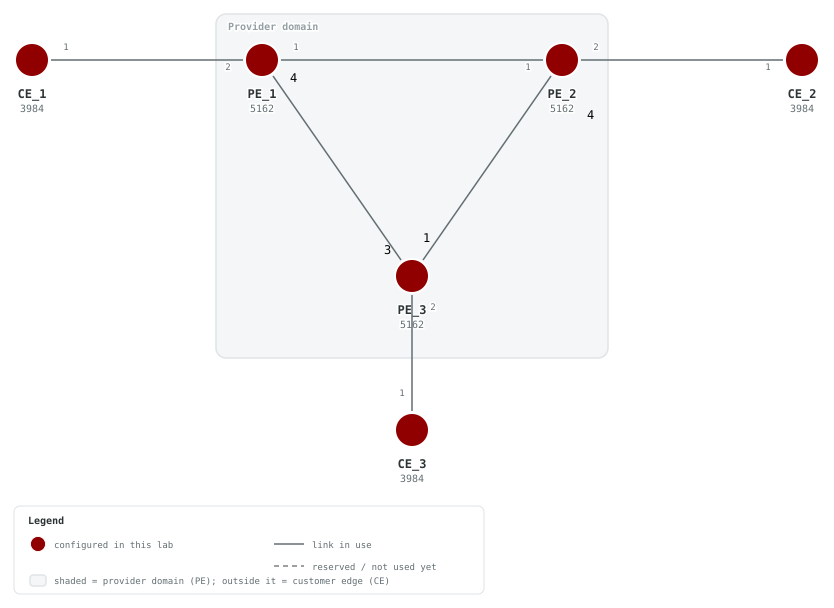
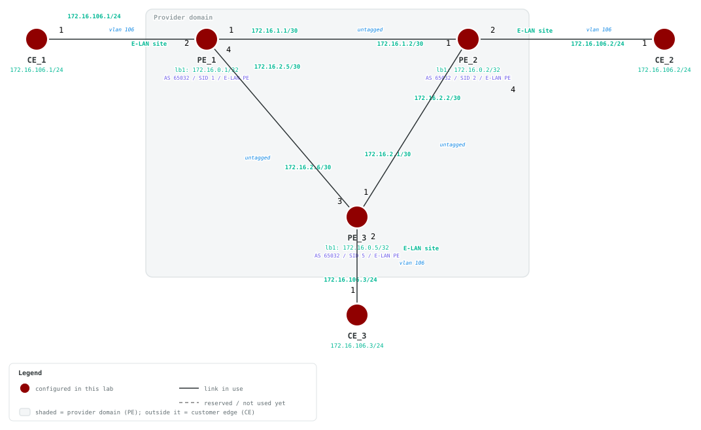

# S3 — Topology





## Containerlab topology

Download the topology file: [`topo.clab.yml`](./topo.clab.yml)

```yaml
name: S3-EVPN-VPLS
topology:
  defaults:
    kind: ciena_saos
    image: vrnetlab/ciena_saos:10-12-00-0228
    labels:
      lab-mode: hands-on
      prereq-lab: F4-BGP
  nodes:
    PE_1:
      type: '5162'
      startup-config: configs/PE_1.cfg.partial
    PE_2:
      type: '5162'
      startup-config: configs/PE_2.cfg.partial
    PE_3:
      type: '5162'
      startup-config: configs/PE_3.cfg.partial
    CE_1:
      type: '3984'
      startup-config: configs/CE_1.cfg.partial
    CE_2:
      type: '3984'
      startup-config: configs/CE_2.cfg.partial
    CE_3:
      type: '3984'
      startup-config: configs/CE_3.cfg.partial
  links:
  - endpoints: [ "PE_1:1", "PE_2:1" ]
  - endpoints: [ "PE_1:2", "CE_1:1" ]
  - endpoints: [ "PE_2:2", "CE_2:1" ]
  - endpoints: [ "PE_2:4", "PE_3:1" ]
  - endpoints: [ "PE_1:4", "PE_3:3" ]
  - endpoints: [ "CE_3:1", "PE_3:2" ]
```
